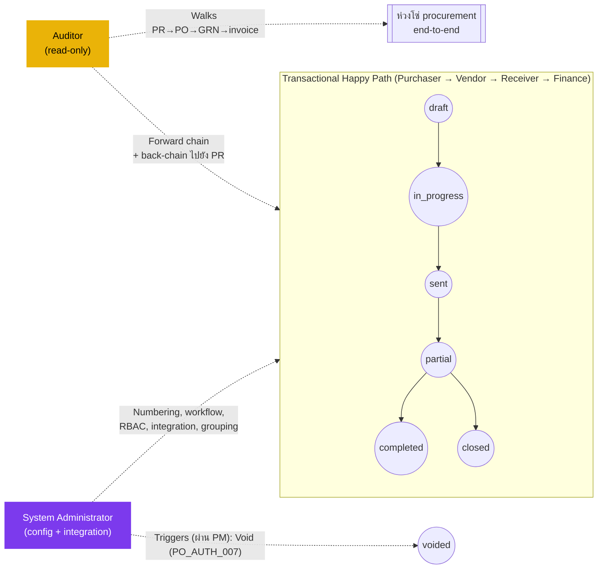

# ใบสั่งซื้อ (Purchase Order) — User Flow — Audit & Config

> **At a Glance**
> **Persona:** Audit / Config (Auditor + System Administrator) &nbsp;·&nbsp; **Module:** [purchase-order](/th/inventory/purchase-order) &nbsp;·&nbsp; **Workflow stages:** ผู้สังเกตการณ์นอกเส้นทาง — Sysadmin เป็นเจ้าของ PO numbering, workflow definition (stages / `stage_role` / `user_action.execute[]`), RBAC สำหรับ `PO_AUTH_001`–`PO_AUTH_011`, integrations (vendor, pricelist snapshot, budget soft-commit, GRN); Auditor trace PR → PO → GRN → invoice ผ่าน `workflow_history`, comments, three-way match record &nbsp;·&nbsp; **สิทธิ์สำคัญ:** Sysadmin ตั้งค่า workflow / RBAC / integrations; Auditor read-only ข้าม chain
> **Persona นี้ทำอะไร:** ตั้งค่า policy และ integration surface ของโมดูล PO (Sysadmin); audit ความสมบูรณ์ของห่วงโซ่ procurement end-to-end, SoD (`PO_AUTH_010`) และ three-way-match conformance (Auditor)

## 1. บทบาทในโมดูลนี้

แกน persona **Audit / Config** group สอง roles ที่แตกต่างที่ทั้งคู่นั่ง **นอก transactional happy path** ของโมดูล `purchase-order` แต่จำเป็นสำหรับ governance และ operability **Auditor** เป็น persona read-only ที่ interest spans **ห่วงโซ่ procurement end-to-end** — Purchase Request → Purchase Order → Goods Receive Note → vendor invoice / AP posting — และใช้ activity log ของโมดูล PO (`ActivityLogTab`), `workflow_history`, `tb_purchase_order_comment` (`PO_POST_005`, `PO_POST_009`), และ cross-document bridges (PR→PO ผ่าน `tb_purchase_order_detail_tb_purchase_request_detail`, PO→GRN ผ่าน GRN detail back-reference ตาม `PO_XMOD_003`, PO/GRN→invoice ผ่าน three-way match record ภายใต้ `PO_POST_008`) เพื่อ verify policy compliance, segregation of duties (`PO_AUTH_010`: Purchaser ≠ Receiver), three-way-match integrity (`PO_POST_008` / `PO_POST_009`), และ traceability เต็มจาก requisition ผ่าน commitment, receipt, และ payable Auditor มี **surface เขียนไม่มี** ในโมดูล: ไม่สามารถ approve, transmit, void, close, edit lines, หรือเปลี่ยน PO state **System Administrator** เป็น persona configuration ที่เป็นเจ้าของ **policy และ integration surface** สำหรับโมดูล — PO numbering scheme ที่ขับเคลื่อน `tb_purchase_order.po_no`, workflow definition ที่ `tb_purchase_order.workflow_id` อ้างอิง (stages, `stage_role`, และ membership `user_action.execute[]` ที่ gate ทุก transition ตาม `PO_AUTH_011`), RBAC role-to-permission map สำหรับ `PO_AUTH_001`–`PO_AUTH_011`, integration wiring กับ vendor, vendor-pricelist (snapshot ที่ PR-to-PO conversion), budget (soft-commit บน submit ตาม `PO_POST_002`), และ inventory (on-hand increment ผ่าน GRN ตาม `PO_XMOD_003`), กฎ PR-to-PO conversion และ vendor+currency grouping, document templates ที่ใช้ที่ transmission (`PO_POST_004`), และ tax / currency / FX rate sources ที่ `PO_CALC_001`–`PO_CALC_011` consume ทั้งสอง roles ไม่อยู่บน create-to-close happy path; แต่ละ role มี entry point, surface, และ exit semantics ของตัวเอง: Auditor exit ผ่าน generated report โดยไม่มี PO state change, Sysadmin exit ผ่าน saved configuration ที่มีผลสำหรับ POs ใหม่ขณะที่รักษา snapshot semantics สำหรับ POs ที่ `in_progress` แล้วหรือไกลกว่านั้น คู่ documented ที่นี่บนแกน persona เดียวเพราะทั้งสอง roles เป็นรอบ ๆ ของ transactional flow และใช้รูปแบบ "off-path, governance-oriented" ร่วมกัน

### ตำแหน่งเทียบกับ transactional flow (ผู้สังเกตการณ์นอกเส้นทาง)

### ตารางสิทธิ์ — Action × Sub-persona (Audit / Config)

Auditor สังเกต chain end-to-end (PR → PO → GRN → invoice) โดยไม่มี surface เขียน Sysadmin เป็นเจ้าของ policy / integration surface และไม่ mutate PO state โดยตรง — remediation ที่ต้องการ state change (void, early-close) escalate ไปยัง Procurement Manager

| Action | Auditor | System Administrator |
|---|---|---|
| Read PO `workflow_history` / `tb_purchase_order_comment` | ✅ | ✅ |
| Read header / lines / snapshots (vendor / pricelist / FX) | ✅ | ✅ |
| Walk PR→PO bridge (`tb_purchase_order_detail_tb_purchase_request_detail`) | ✅ | ✅ |
| Walk PO→GRN back-reference (`PO_XMOD_003`) | ✅ | ✅ |
| Walk PO/GRN → vendor-invoice three-way match (`PO_POST_008`) | ✅ | ✅ |
| ตรวจจับ `PO_AUTH_010` segregation-of-duties breach (Purchaser ≡ Receiver) | ✅ | ✅ |
| Flag PO ใน audit case file (audit-side store เท่านั้น) | ✅ | ❌ |
| Export report (sensitive fields ต้องการ export-approver) | ✅ | ✅ |
| Edit PO numbering scheme / templates | ❌ | ✅ |
| Edit workflow stages / `stage_role` / threshold (`PO_AUTH_004`, `PO_AUTH_011`) | ❌ | ✅ |
| Assign / remove users จาก `user_action.execute[]` | ❌ | ✅ |
| Edit RBAC permission map (`PO_AUTH_001`–`PO_AUTH_011`) | ❌ | ✅ |
| Edit integration endpoints (vendor / pricelist / budget / inventory) | ❌ | ✅ |
| Edit PR-to-PO conversion / grouping rule | ❌ | ✅ |
| Save configuration พร้อม `effective_from` (in-flight snapshot เก็บไว้) | ❌ | ✅ |
| Roll back configuration | ❌ | ✅ |
| Integration cutover (probe + drain + go-live) | ❌ | ✅ |
| Edit PO header / lines / vendor / qty | ❌ | ❌ |
| Approve / Transmit / Reject / Send-back | ❌ | ❌ |
| Void / Early-close PO | ❌ | ❌ (escalate ไปยัง PM ภายใต้ `PO_AUTH_007` / `PO_AUTH_008`) |

> ℹ️ **หลักการ Snapshot:** การเปลี่ยน configuration ของ Sysadmin ใช้ forward-only POs ที่ `in_progress`, `sent`, `partial`, หรือ `closed` แล้วเก็บ workflow stage chain, threshold, integration wiring, และ tax / currency context ที่ snapshot POs ใหม่ที่สร้างหลัง `effective_from` ใช้ configuration ใหม่

## 2. Entry Point และ Primary Flow

ทั้งสอง roles มี entry points แยกและ flows; แต่ละ addressed ด้านล่าง

### 2.1. Auditor flow

**Entry point:** Sidebar → workspace **Audit** → **Procurement Activity Queries** (หรือเมื่อเริ่มจากเอกสารที่รู้, Sidebar → โมดูล **Purchase Order** → เปิด PO → แท็บ **Activity Log** / แท็บ **Related Documents**) Auditor land บน surface query-builder ที่ scope กับ procurement document family (PR / PO / GRN / invoice) ไม่ใช่บน My POs หรือ review queues ที่ transactional personas ใช้

**Primary flow (happy path — Auditor):**

1. จาก **Audit → Procurement Activity Queries** เลือก audit query template (เช่น "All POs voided in period", "All POs transmitted by buyer", "Three-way-match exceptions", "Segregation-of-duties violations", "All status transitions for a PO", "PR-to-PO conversions in period") หรือสร้าง ad-hoc query เทียบกับ `workflow_history`, `tb_purchase_order_comment`, header / detail snapshots และ cross-document bridges
2. ใช้ **filters**: date range (`order_date`, `approval_date`, `last_action_at_date`, หรือ `created_at`), business unit, buyer, vendor, currency, ค่า `po_status`, `po_type` (`manual` vs `purchase_request`), และ band `total_amount` รวมถึง high-value threshold flag Filter chips ปรากฏเหนือตารางผลลัพธ์; ชุด filter ว่างถูก reject เพื่อป้องกัน unbounded scans ของ chain
3. Review **result set**: แต่ละ row คือ PO หนึ่งใบ (หรือ event หนึ่ง ขึ้นอยู่กับรูปแบบ query) พร้อม `po_no`, vendor, buyer, current state, last action, last actor และ audit fact ที่เกี่ยวข้องสำหรับ query (เช่น void reason, GRN count, invoice match outcome) Sort ตาม column ใด ๆ; คลิกเข้า row เพื่อ drill เข้า **full chain** สำหรับ PO นั้น
4. บนหน้า drill-down เดิน **forward chain** — จาก timeline ของ `po_status` ของ PO ผ่าน GRN postings ที่ link (`PO_POST_006` / `PO_POST_007` ที่ driven โดย [good-receive-note](/th/inventory/good-receive-note)) และต่อไปยัง vendor invoice three-way-match record (`PO_POST_008`) และ AP liability posting — และ **back chain** — จาก PO header ผ่าน PR→PO bridge `tb_purchase_order_detail_tb_purchase_request_detail` กลับไปยัง Purchase Request(s) ต้นทางและ approval trail ของพวกเขา Verify ว่า chain ติดกัน (ไม่มี gaps, ไม่มี out-of-order timestamps), ว่า segregation of duties ถูก respected (`PO_AUTH_010`: `buyer_id` / `last_action_by_id` บน transition `sent` ≠ user ที่ post GRN ใด ๆ), ว่าทุก transition มีทั้ง actor และ justification ที่ต้องการ และว่า PR→PO vendor+currency grouping (carmen/docs § 2.3.2) ถูกใช้ถูกต้อง
5. หากพบ anomaly (เช่น approval บันทึกนอก `user_action.execute[]` ของ stage ตาม `PO_AUTH_011`, void โดยไม่มี reason comment ใน `tb_purchase_order_comment`, three-way-match override ที่ bypass `PO_POST_009`, หรือคู่ same-user PO/GRN ละเมิด `PO_AUTH_010`), **flag** PO ใน audit case file พร้อม note การ flagging **ไม่** เปลี่ยน PO — เขียนไปยัง audit-side store เท่านั้น
6. **Export report** เป็น CSV / PDF สำหรับ period หรือสำหรับ case file Exports ของ sensitive fields (เช่น snapshots vendor pricing, identities buyer / approver, full justification text, attachment payloads) ต้องการ secondary approval ตาม data-export policy — Auditor submit export request และ export-approver release exported report และ approval record เป็น audit objects เอง

### 2.2. System Administrator flow

**Entry point:** Sidebar → workspace **Configuration** → **PO Numbering & Templates** (สำหรับ scheme `po_no` และ document templates), **PO Workflow Settings** (สำหรับ stages, high-value threshold, assignment `user_action.execute[]` ตาม `PO_AUTH_011`), **RBAC & Roles** (สำหรับ role-to-permission map ของ `PO_AUTH_001`–`PO_AUTH_011`), **Integration Settings** (vendor, vendor-pricelist, budget, inventory), หรือ **PR-to-PO Rules** (สำหรับ vendor+currency grouping และ conversion defaults) แต่ละ surface เป็นหน้าแยกภายใต้ workspace เดียวกัน

**Primary flow (happy path — Sysadmin, การเปลี่ยน configuration):**

1. **ระบุความต้องการ configuration** Trigger ภายนอก — เช่น Finance request high-value threshold ใหม่ การปรับโครงสร้างแผนกเปลี่ยนใครเป็นเจ้าของ stage approval สุดท้าย, integration vendor-portal ใหม่ go live, scheme `po_no` ต้องการ year-prefix change, กฎ PR-to-PO grouping ต้องการเพิ่ม delivery-location dimension, หรือ transmission template ต้องการ tax-registration block ใหม่ เปิด change ticket และ link policy reference (memo / approval) ก่อนเปิด configuration surface
2. **เปิดหน้า configuration ที่เกี่ยวข้อง** สำหรับ numbering: **Configuration → PO Numbering & Templates** → เลือก scheme row → edit prefix / sequence / reset rule สำหรับ workflow / threshold / RBAC: **Configuration → PO Workflow Settings** → เลือก workflow row (ต่อ business unit / ต่อ `po_type`) → เปิด stage editor สำหรับ integration: **Configuration → Integration Settings** → เลือก integration (vendor / pricelist / budget / inventory) → edit endpoints, credentials, sync windows สำหรับ conversion / grouping: **Configuration → PR-to-PO Rules**
3. **ปรับ settings** ใน staged editor: เปลี่ยน numbering scheme, เพิ่ม / ลบ / reorder workflow stages, edit high-value threshold ที่ trigger gate Procurement Manager approval ตาม `PO_AUTH_004`, assign หรือ remove users จาก `user_action.execute[]` ตาม `PO_AUTH_011`, update RBAC permission set สำหรับ `PO_AUTH_001`–`PO_AUTH_011` ใด ๆ, wire หรือ rewire integration endpoint, หรือเปลี่ยนกฎ vendor+currency grouping (carmen/docs § 2.3.2) Edits ทั้งหมดสะสมใน pending-configuration draft; ไม่มีอะไร persist จนกว่า Save
4. **Preview impact** หน้า configuration แสดง side-panel summary: จำนวน PO ที่ in-flight ที่จะดำเนินการต่อภายใต้ snapshot configuration เก่า, จำนวน PO ใหม่ที่จะใช้กฎใหม่ (forecast จาก recent creation rate), stages หรือกฎที่เปลี่ยน, และ users ใด ๆ ที่เพิ่งเพิ่มหรือ remove จาก `user_action.execute[]` สำหรับการเปลี่ยน threshold panel แสดง band shift และจำนวน POs ล่าสุดที่จะ route ต่างไป สำหรับการเปลี่ยน numbering panel preview `po_no` ที่จะ issued ถัดไปภายใต้ scheme ใหม่ สำหรับการเปลี่ยน integration panel รัน connectivity probe Sysadmin สามารถ revise หรือทิ้ง draft ณ จุดนี้
5. **Save configuration** ระบบเขียน configuration ใหม่ด้วย timestamp `effective_from` บันทึก change ใน system-side configuration audit log (อิสระจาก `tb_purchase_order_comment`) และ notify ประชากร users ที่ได้รับผลกระทบ (เช่น approvers ที่เพิ่งเพิ่ม, buyers ที่ grouping behaviour จะเปลี่ยน) POs ที่ `in_progress`, `sent`, หรือ `partial` แล้วเก็บ **snapshot** configuration ดั้งเดิม — workflow stage chain, threshold band, numbering, integration endpoints ที่บังคับใช้ที่ submission, และ tax / currency context — ตาม snapshot semantics เดียวกันที่ปกป้อง PR-to-PO conversion price snapshot POs ใหม่ที่สร้างหลัง `effective_from` ใช้ configuration ใหม่
6. **Verify activation** เลือก PO ใหม่ที่เป็นตัวแทน (หรือ simulate ใน non-production environment) และ confirm ว่า behaviour ใหม่ fire ตามที่คาดหวัง: numbering, routing, threshold gate, integration sync, และ grouping outcome หากพบ regression, roll back โดย re-open configuration และ revert เป็น version ก่อน (ทุก version ที่ save เก็บใน configuration audit log)
7. **ปิด change ticket** พร้อม link configuration audit-log จากจุดนั้น change บังคับใช้สำหรับ POs ใหม่; การ involve ของ Sysadmin จบจนถึง configuration change ถัดไป

## 3. Decision Branches

- **หาก Auditor พบ policy violation** (เช่น approval โดย user ที่ไม่อยู่ใน `user_action.execute[]` ตาม `PO_AUTH_011`, void โดยไม่มี reason บังคับใน `tb_purchase_order_comment`, breach `PO_AUTH_010` segregation-of-duties ที่ buyer ก็ post GRN, หรือ three-way-match override ที่ bypass `PO_POST_009`): Auditor **ไม่สามารถ act บน PO in-module** (read-only) Auditor escalate ผ่าน audit case file — flag PO, แนบหลักฐาน (excerpt activity-log, timeline chain, configuration version diff, segregation-of-duties pairing) — และ route case ไปยัง business owner ที่รับผิดชอบ (Finance, Compliance, Procurement Manager, หรือ department head) สำหรับ remediation out-of-band หาก remediation ต้องการ action ระดับระบบ (เช่น void เพื่อ terminate non-compliant PO ภายใต้ `PO_AUTH_007` หรือ credit-note initiation ฝั่ง AP) action นั้นดำเนินโดย Procurement Manager หรือ System Administrator ภายใต้สิทธิ์ authorization ของพวกเขาเอง ไม่ใช่โดย Auditor
- **หาก Sysadmin พยายาม configuration change ขณะที่ in-flight PO depend บนกฎปัจจุบัน** (เช่น การเปลี่ยน high-value threshold ขณะที่ PO นั่งที่ `in_progress` ภายใต้ routing threshold เก่า, หรือการเปลี่ยน grouping-rule ขณะที่ PR-to-PO conversion อยู่ mid-wizard): save อนุญาต (กฎไม่ lock โดย in-flight POs) แต่ change **ไม่** retroactively re-route หรือ re-rank in-flight POs ที่มีอยู่ หน้า configuration surface count ของ `in_progress` / `sent` / `partial` POs ที่ได้รับผลกระทบใน preview panel; POs เหล่านั้นดำเนินต่อภายใต้ snapshot (workflow stage chain, threshold band, integration endpoints, และ tax / currency context taken ที่ submission) In-flight PRs ที่ converting ที่ moment ของ save จบ conversion ภายใต้กฎที่บังคับใช้ที่ conversion start; conversion ถัดไปเริ่มภายใต้กฎใหม่
- **หาก Sysadmin activate delegation บน approval stage** (เช่น Procurement Manager อยู่นอกและ delegate ถูก grant สิทธิ์ approval สำหรับ window): delegate inherit `user_action.execute[]` membership สำหรับ scope ของ stage ตลอด window's duration Notifications สำหรับ PO ใด ๆ ที่ปัจจุบันนั่งที่ stage นั้น re-fan ไปยัง delegate เมื่อ window expire, สิทธิ์ที่ inherit drop อัตโนมัติ; POs ที่ยังที่ stage นั้นดำเนินต่อด้วย `user_action.execute[]` ของ user ดั้งเดิม (ซึ่งไม่เคยเปลี่ยน) — ไม่ต้องการ PO re-routing
- **หาก Auditor request export ที่รวม sensitive fields** (full buyer / approver identities, vendor pricelist snapshots, three-way-match deviation detail, attachment payloads): export เข้าสู่ state **pending** และต้องการ approval จาก data-export approver ตาม export policy Auditor ไม่สามารถ bypass step นี้ ขณะที่ pending, export มองไม่เห็นนอก audit case file; บน approval, export ถูก materialised และ download link บันทึกใน case file พร้อม identity ของ approver
- **หาก Sysadmin เปลี่ยน PR-to-PO conversion / grouping rule** (เช่น เพิ่ม delivery-location dimension ในคีย์ vendor+currency grouping ตาม carmen/docs § 2.3.2) ขณะที่ PR-to-PO conversion อยู่ in flight ใน wizard: in-flight conversion จบภายใต้ **กฎที่บังคับใช้ที่ wizard start** (groups ที่ user confirm ไปแล้วไม่ re-shuffle บน save) conversion ถัดไปที่ initiate หลัง `effective_from` ใช้กฎใหม่ Configuration audit log บันทึก change และจำนวน in-flight-conversion ที่ time ของ save ดังนั้น anomaly ใด ๆ ใน aftermath ทันทีสามารถ attributable กับ rule transition แทน routing bug
- **หาก Sysadmin change สร้าง workflow deadlock** (เช่น configuration remove user จาก `user_action.execute[]` บน stage ที่ user นั้นเป็น approver เดียวที่ assigned และ PO ปัจจุบันรอที่ stage นั้นโดยไม่มี approver อื่น): preview panel flag deadlock ใน step 4 หาก Sysadmin save อยู่ดี PO ที่ได้รับผลกระทบจะ time out ที่ stage นั้นและต้องการ manual intervention — โดยทั่วไป one-off delegation หรือ void ที่ initiated โดย Procurement-Manager / Sysadmin ภายใต้ `PO_AUTH_007` — เพื่อ unblock Configuration audit log บันทึก change และ deadlock warning เพื่อให้ audit trail ทำให้สาเหตุชัดเจน

## 4. Exit Point / Handoffs

แกน persona Audit / Config exit ในวิธีต่อไปนี้ ขึ้นอยู่กับ role ใดที่ acted:

- **Auditor — report generated** ผลลัพธ์ query, chain drill-down, หรือ case file ถูก materialised (review on-screen หรือ export เป็น CSV / PDF หลัง export-approval flow) **ไม่มี PO state change**: `po_status`, `workflow_current_stage`, `workflow_history`, `tb_purchase_order_comment`, และทุก snapshot บนเอกสารยังคงเหมือนเดิมก่อน Auditor เปิดหน้า Auditor's handoff เป็น **out-of-band** ไปยัง business owner (Finance, Compliance, Procurement Manager, หรือ department head) ที่รับผิดชอบ remediation ใด ๆ ที่ audit surface หาก case file ของ Auditor recommend void หรือ close, Procurement Manager ดำเนินภายใต้ `PO_AUTH_007` / `PO_POST_010` (void) หรือ `PO_AUTH_008` / `PO_POST_011` (close-early); Sysadmin ดำเนินเฉพาะเมื่อ remediation เป็น configuration change แทน per-document state change
- **Auditor — case file closed without action** เมื่อ audit query / chain drill-down ไม่พบ anomaly, Auditor ปิด case file ด้วย note "no findings" ไม่มี PO state change; case file เองเก็บเป็นหลักฐานว่า period / scope ถูก audited end-to-end ข้าม PR / PO / GRN / invoice chain
- **Sysadmin — configuration saved** version ใหม่ของ configuration (numbering scheme, workflow stages และ threshold, RBAC permission map, integration endpoints, PR-to-PO conversion / grouping rules, หรือ document templates) เขียนด้วย timestamp `effective_from` และบันทึกใน configuration audit log **POs ที่สร้างหลัง `effective_from`** ใช้ configuration ใหม่; **POs ที่ `in_progress`, `sent`, `partial` แล้ว, หรือ non-terminal state ใด ๆ** เก็บ snapshotted configuration ดั้งเดิม — รวมถึง stage chain, threshold band, integration wiring ที่ submission time, และ tax / currency context Notifications ไปยังประชากร users ที่ได้รับผลกระทบ fire บน save Handoff เป็น **forward in time** — Purchaser ถัดไปที่สร้าง PO เห็น behaviour ใหม่อัตโนมัติ
- **Sysadmin — configuration rolled back** หาก verification ใน step 6 ของ primary flow พบ regression, Sysadmin revert เป็น configuration version ก่อน Rollback เองเป็น configuration save พร้อม `effective_from` ของตัวเอง; POs ที่สร้างระหว่าง original change และ rollback ไม่ retroactively re-evaluated (snapshot semantics) แต่ POs ใหม่ที่สร้างหลัง rollback ใช้ reverted configuration Configuration audit log capture ทั้ง forward change และ rollback เก็บ trail สะอาด
- **Sysadmin — integration cutover** เมื่อ change เป็น integration rewire (เช่น vendor-portal endpoint ใหม่, base URL budget-system ใหม่, หรือ pricelist-sync window ใหม่) save trigger ลำดับ probe-and-cutover เพิ่มเติม — endpoint เก่า drained, endpoint ใหม่รับ synthetic round-trip, และเฉพาะบน success, configuration go live หาก probe fail, save hold และ endpoint ก่อนยังคงบังคับใช้; Sysadmin แจ้งเตือนเพื่อ remediate ก่อน retry

Document state ข้าม Audit / Config exits ทั้งหมด governed โดย `enum_purchase_order_doc_status = { draft, in_progress, voided, sent, partial, closed, completed }` Auditor flow ไม่เคลื่อน PO ข้าม enum นี้; Sysadmin's configuration flow ก็ไม่เคลื่อน PO ข้าม enum (เฉพาะ POs ในอนาคตที่ได้รับผลกระทบ) เฉพาะ PO state changes ที่ trigger โดย escalation จาก audit finding คือ **void** (Procurement Manager ภายใต้ `PO_AUTH_007` / `PO_POST_010`) และ **early close** (Procurement Manager / Inventory Manager ภายใต้ `PO_AUTH_008` / `PO_POST_011`); เหล่านี้เป็น operations พิเศษ audit-triggered ดำเนินโดย transactional persona ที่เหมาะสม ไม่ใช่โดยแกน Audit / Config เอง

## 5. แหล่งอ้างอิง

- ภาพรวม parent: [03-user-flow.md](./03-user-flow.md)
- กฎ Authorization: [02-business-rules.md](./02-business-rules.md) Section 4 — `PO_AUTH_004` (gate high-value threshold), `PO_AUTH_005` (delete-in-draft), `PO_AUTH_007` (Procurement Manager void), `PO_AUTH_008` (Inventory Manager close / GRN), `PO_AUTH_009` (Finance read-only), `PO_AUTH_010` (segregation of duties — Purchaser ≠ Receiver), `PO_AUTH_011` (workflow-derived stage-gated approval)
- กฎ Transition / posting: [02-business-rules.md](./02-business-rules.md) Section 5 — `PO_POST_002` (submit และ soft-commit), `PO_POST_004` (final approval และ transmit), `PO_POST_005` (reject), `PO_POST_006` / `PO_POST_007` (GRN-driven receipt transitions), `PO_POST_008` / `PO_POST_009` (three-way match success / failure), `PO_POST_010` (void), `PO_POST_011` (close-early), `PO_POST_012` (soft delete)
- กฎ Cross-module: [02-business-rules.md](./02-business-rules.md) Section 6 — `PO_XMOD_003` (PO ↔ GRN bridge ที่ขับเคลื่อน receipt chain ที่ audited end-to-end)
- โมเดลข้อมูล: [01-data-model.md](./01-data-model.md) — ค่า `enum_purchase_order_doc_status` ที่ใช้ข้าม chain, PR→PO bridge `tb_purchase_order_detail_tb_purchase_request_detail` ที่ walk ใน back-chain audit, และ surface audit `workflow_history` / `tb_purchase_order_comment`
- `../carmen/docs/purchase-order-management/purchase-order-module.md` — แหล่ง carmen/docs สำหรับ RBAC (§ 2.5), state diagram (§ 6.1), PR-to-PO vendor+currency grouping (§ 2.3.2), และ `ActivityLogTab` / `RelatedDocumentsTab` UX อธิบายใน § 2.4.1
- Sibling: [03-user-flow-purchaser.md](./03-user-flow-purchaser.md) — persona ต้นน้ำที่ creation, transmission, และ amendment actions feed PO activity log
- Sibling: [03-user-flow-procurement-manager.md](./03-user-flow-procurement-manager.md) — escalation path สำหรับ remediations void / early-close ที่ trigger โดย audit findings; ผู้บริโภคของ Sysadmin threshold / workflow configuration
- Sibling: [03-user-flow-vendor.md](./03-user-flow-vendor.md) — counterparty ภายนอกที่ acknowledgement และ invoice events สังเกตผ่าน chain audit
- Sibling: [03-user-flow-receiver.md](./03-user-flow-receiver.md) — persona ที่ post GRN ที่ actions ขับเคลื่อน transitions `sent → partial → completed` ที่ audited ภายใต้ `PO_POST_006` / `PO_POST_007`
- Sibling: [03-user-flow-finance.md](./03-user-flow-finance.md) — persona three-way-match ที่ records `PO_POST_008` / `PO_POST_009` ปิด audit chain ฝั่ง AP
- หน้าพี่น้อง: [หน้าหลักโมดูล](/th/inventory/purchase-order) Section 4 — คำอธิบาย role canonical ของ Auditor และ System Administrator
- Cross-link: [purchase-request](/th/inventory/purchase-request) — โมดูล upstream ที่ PR records และ approval trail walk ใน back-chain audit ผ่าน PR→PO bridge
- Cross-link: [good-receive-note](/th/inventory/good-receive-note) — โมดูลปลายน้ำที่ GRN postings ขับเคลื่อน forward-chain audit ของ receipt ภายใต้ `PO_POST_006` / `PO_POST_007`
- Cross-link: [vendor-pricelist](/th/inventory/vendor-pricelist) — surface price-snapshot ที่ taken ที่ PR-to-PO conversion และ verified ระหว่าง financial audit ของ PO
