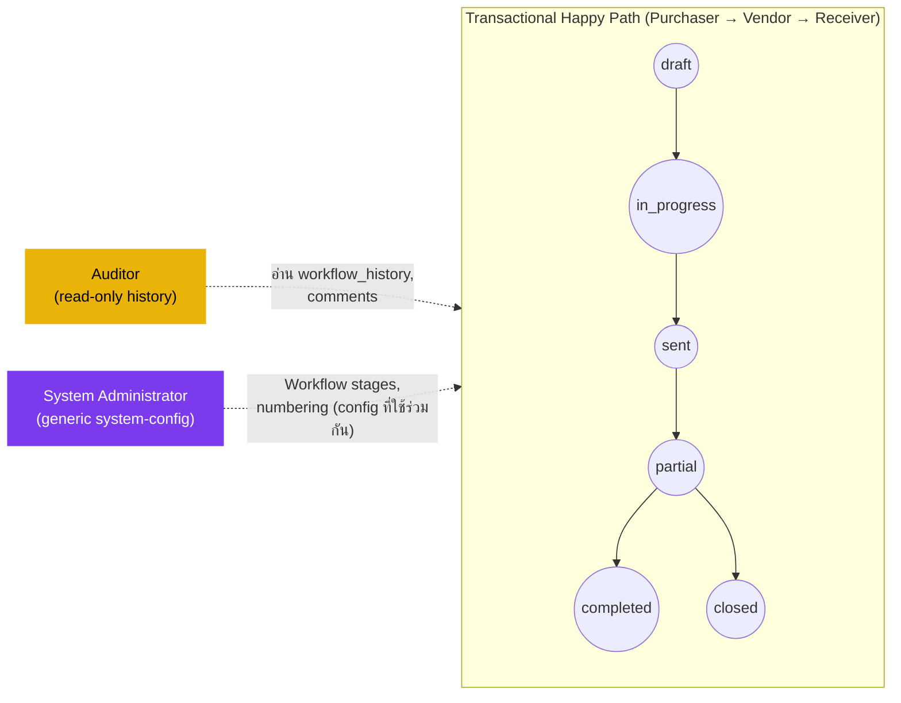

# ใบสั่งซื้อ (Purchase Order) — User Flow — Audit & Config

> **At a Glance**
> **Persona:** Audit / Config (Auditor + System Administrator) &nbsp;·&nbsp; **Module:** [purchase-order](/th/inventory/purchase-order) &nbsp;·&nbsp; **Surface ที่ยืนยันแล้ว:** มุมมอง activity/history ต่อเอกสารแบบ generic (Auditor, read-only); การตั้งค่า workflow-stage, routing-rule ตาม amount/department/category, และ running-code (numbering) แบบ generic ที่ใช้ร่วมกันข้าม document type (System Administrator — แท็บ routing-rule คือแท็บ Routing แบบเดียวกับที่ PR/PO/SR ใช้ร่วมกัน ไม่ใช่เฉพาะของ PO) &nbsp;·&nbsp; **ยังไม่ยืนยัน:** query builder แบบ "audit workspace" ข้ามเอกสารโดยเฉพาะ หรือ configuration workbench เฉพาะของ PO (numbering scheme editor, vendor-ranking editor, PR-to-PO grouping-rule editor, delegation-window manager)

> ⚠️ **การแก้ไขครั้งใหญ่ในรอบนี้** เวอร์ชันก่อนหน้าของหน้านี้อธิบาย audit workspace เฉพาะที่ชื่อ **"Procurement Activity Queries"** (query templates, filter chips, export-approval workflow, case-file notes) และ **"Configuration workspace"** เฉพาะ พร้อม child surfaces สำหรับ PO Numbering & Templates, PO Workflow Settings (รวมถึง high-value threshold และ approval delegations), RBAC & Roles, Integration Settings, และ PR-to-PO Rules audit workspace, configuration workbench เฉพาะของ PO, และฟีเจอร์ approval-delegation ไม่พบใน source ปัจจุบัน:
> - ไม่พบ route หรือ component ที่ตรงกับ "audit workspace", "activity queries", หรือ configuration workbench เฉพาะของ PO ใน `carmen-inventory-frontend-react`
> - การค้นหาทั่ว repo สำหรับ `segregation` และ code เกี่ยวกับ delegation-window ไม่คืนผลลัพธ์ที่เกี่ยวข้องใน `carmen-turborepo-backend-v2` เลย
> - Configuration surfaces แบบ generic **มีอยู่จริง** ในส่วนอื่นของ product — workflow stage definitions, routing rules ตาม amount/department/category, และ running-code (document numbering) ถูกตั้งค่าในโมดูล **system-config** ที่ใช้ร่วมกันข้าม document type (PR, PO, GRN, SR, ฯลฯ) ไม่ใช่เป็นหน้าจอเฉพาะของ PO เวอร์ชันก่อนหน้าของหน้านี้ปนกันระหว่าง "PO ใช้ workflow และ numbering scheme" (จริง และบันทึกไว้ใน [01-data-model.md](./01-data-model.md) / [02-business-rules.md](./02-business-rules.md)) กับ "PO มี configuration workspace เฉพาะของตัวเอง" (ยังไม่ยืนยัน)
>
> **ครึ่งหนึ่งของ claim เดิมที่เป็น "high-value threshold" กลับถูกตัดทิ้งผิดพลาดโดยการแก้ไขรุ่นก่อนหน้าเอง** — การค้นหาติดตามผลยืนยันว่าแท็บ **Routing** แบบทั่วไปของ `/system-admin/workflow` (`wf-routing.tsx`) ให้ System Administrator แนบ `routing_rules` เข้ากับ workflow ที่ route ตาม `total_amount` (รวมถึง `department`/`category`) ได้ ประเมินโดย `evaluateCondition`/`findNextStep` ใน `workflows.navagation.service.ts` ทุกครั้งที่ submit/approve มันมีจริง เป็น generic (ไม่ใช่เฉพาะของ PO) และตั้งค่าควบคู่ไปกับ — ไม่ใช่แทนที่ — การตั้งค่า stage/numbering ทั่วไปข้างต้น ดู [02-business-rules.md](./02-business-rules.md) `PO_AUTH_004`
> - รูปแบบเดียวกันนี้เป๊ะ (เรื่องเล่า audit-workspace + configuration-workspace ที่ละเอียดแต่ไม่มี route ที่ตรงกัน) ก็เคยถูก flag ว่ายัง unverified/deferred ในรอบ resync ก่อนหน้าของโมดูล `purchase-request` เช่นกัน เนื่องจากการค้นหาทั่ว repo ที่กว้างขึ้นในรอบนี้ไม่พบสิ่งใดสนับสนุน workspace ทั้งสองแบบเลยในทุกส่วนของ product ให้ถือว่าทั้งคู่ยังไม่ยืนยัน แทนที่จะเป็นเพียง deferred

## 1. บทบาทในโมดูลนี้

**Auditor** เป็น role แบบ read-only surface เดียวที่ยืนยันได้คือ activity/history ของหน้า PO detail เอง — `workflow_history`, `history`, และ `tb_purchase_order_comment` — ซึ่ง user ใด ๆ ที่มีสิทธิ์อ่าน PO ก็เห็นได้อยู่แล้ว ส่วนว่า role "Auditor" ที่แยกต่างหาก หรือ cross-document query workspace เฉพาะจะมีอยู่เพิ่มเติมจากนั้นหรือไม่ ยังไม่ได้รับการยืนยันในรอบนี้ Auditor ไม่สามารถ approve, transmit, reject, close, หรือ edit lines ได้

**System Administrator** ตั้งค่า workflow definition ที่ `tb_purchase_order.workflow_id` อ้างอิง (stages, `stage_role`, membership `user_action.execute[]`, และ — **ยืนยันแล้วในรอบนี้** — routing rules ตาม amount/department/category ผ่านแท็บ **Routing** ของ workflow, `PO_AUTH_004` — ทั้งหมดนี้คือ functionality system-config แบบ generic ที่ใช้ร่วมกันข้าม document type ไม่ใช่เฉพาะของ PO) และ running-code scheme ที่ generate `po_no` การ map RBAC role-to-permission ก็เป็นเรื่องของ system-config แบบ generic เช่นกัน ไม่พบ numbering template เฉพาะของ PO, หน้า integration-settings, หรือ PR-to-PO grouping-rule editor ใด ๆ

### ตำแหน่งเทียบกับ transactional flow

```mermaid
graph LR
    subgraph transactional["Transactional Happy Path (Purchaser → Vendor → Receiver)"]
        draft(("draft")) --> inprog(("in_progress"))
        inprog --> sent(("sent"))
        sent --> partial(("partial"))
        partial --> completed(("completed"))
        partial --> closed(("closed"))
    end
    auditor["Auditor<br/>(read-only history)"]:::audit -.->|"อ่าน workflow_history,<br/>comments"| transactional
    sysadmin["System Administrator<br/>(generic system-config)"]:::cfg -.->|"Workflow stages,<br/>numbering (config ที่ใช้ร่วมกัน)"| transactional
    classDef audit fill:#eab308,color:#000,stroke:#eab308;
    classDef cfg fill:#7c3aed,color:#fff,stroke:#7c3aed;
```

### ตารางสิทธิ์ — Action × Sub-persona (Audit / Config)

| Action | Auditor | System Administrator |
|---|---|---|
| อ่าน PO `workflow_history` / `tb_purchase_order_comment` | ✅ | ✅ |
| อ่าน header / lines / snapshots | ✅ | ✅ |
| เดิน PR→PO bridge (`tb_purchase_order_detail_tb_purchase_request_detail`) | ✅ | ✅ |
| Edit workflow stages / `stage_role` / `user_action.execute[]` (generic system-config) | ❌ | ✅ |
| Edit running-code scheme (`po_no`) (generic system-config) | ❌ | ✅ |
| Edit RBAC permission map | ❌ | ✅ (ผ่าน generic system-config, ยังไม่ยืนยันว่าเป็นหน้าจอเฉพาะของ PO) |
| Edit PO header / lines / vendor / qty | ❌ | ❌ |
| Approve / Transmit / Send-back / Reject | ❌ | ❌ |
| Close PO | ❌ | ❌ (escalate ไปยัง Procurement Manager หรือ Inventory Manager ภายใต้ `PO_AUTH_008`) |

## 2. Entry Point และ Primary Flow

### 2.1 Auditor

**Entry point:** เปิดหน้า detail ของ PO → **Activity Log** / มุมมอง history **ยังไม่ยืนยัน:** query builder แบบ cross-document เฉพาะที่ span PR → PO → GRN

**Flow ที่ยืนยันแล้ว:** เปิด PO อ่าน `workflow_history` (stage transitions, actor, timestamp) และ `tb_purchase_order_comment` (user และ system comments) เดิน PR→PO bridge สำหรับ PR-sourced POs เพื่อดู PR ต้นทาง ไม่มี PO state ใดถูกเปลี่ยนโดยสิ่งเหล่านี้

### 2.2 System Administrator

**Entry point:** หน้าจอ workflow-definition ของโมดูล system-config (ใช้ร่วมกันข้าม document type) และหน้าจอ running-code — ดู [system-config/workflow](/th/inventory/system-config/workflow) และ [system-config/running-code](/th/inventory/system-config/running-code) สำหรับหน้าจอจริง ซึ่งหน้านี้ไม่ได้ทำซ้ำ

**Flow ที่ยืนยันแล้ว:** define หรือ edit stages ของ workflow และ `stage_role` ต่อ stage; assign users/roles ให้ `user_action.execute[]`; ตั้งค่า pattern การ numbering ที่ generate `po_no` การเปลี่ยนแปลงเหล่านี้มีผลกับ POs ใหม่ที่จะเกิดขึ้นต่อจากนี้ POs ที่ `in_progress` แล้วถือ `workflow_id` และ stage cursor ของตัวเองอยู่ ดังนั้น PO ที่ in-flight จะไม่ถูก reroute แบบเงียบ ๆ กลางทาง workflow โดยการแก้ไข stage-definition ในภายหลัง (นี่เป็นผลจากการที่ workflow ถูกอ้างอิงด้วย ID บน PO row ไม่ได้ re-resolve จาก live definition ทุกครั้งที่อ่าน — ขอบเขตที่แท้จริงของพฤติกรรม "snapshot" เกินกว่านี้ยังไม่ได้ verify ในรอบนี้)

## 3. Decision Branches

- **หาก Auditor พบช่องว่างใน workflow-history หรือ timestamp ที่ผิดลำดับ**: escalate ออกนอกโมดูล PO — ไม่มี feature "case file" หรือ flagging ระดับโมดูล PO ที่ยืนยันได้ feature activity-log หรือ audit trail แบบ generic ถ้ามีอยู่จริง จะบันทึกไว้ใน [reporting-audit](/th/inventory/reporting-audit) ไม่ใช่ที่นี่
- **หาก Sysadmin ต้องการยุติ PO ที่ค้างอยู่** (เช่น ไม่มี approver ที่ eligible เหลืออยู่ที่ stage หนึ่งหลังจากเปลี่ยน RBAC): remediation ที่ยืนยันแล้วคือ action ของ Procurement Manager หรือ Inventory Manager (**Cancel**/**Close**/**Reject** ตามที่บันทึกไว้ใน [03-user-flow-procurement-manager.md](./03-user-flow-procurement-manager.md)) — ไม่มี override ระดับ Sysadmin ที่ยืนยันแล้วที่ mutate PO state โดยตรง

## 4. Exit Point / Handoffs

ทั้งสอง role ไม่ transition PO ข้าม `enum_purchase_order_doc_status` การอ่านของ Auditor ไม่เปลี่ยน state เลย; การ edit workflow/numbering ของ System Administrator มีผลกับ POs ในอนาคต

## 5. แหล่งอ้างอิง

- ภาพรวม parent: [03-user-flow.md](./03-user-flow.md)
- กฎ Authorization: [02-business-rules.md](./02-business-rules.md) Section 4 — `PO_AUTH_011` (การอนุมัติที่ gate ด้วย stage ที่มาจาก workflow)
- โมเดลข้อมูล: [01-data-model.md](./01-data-model.md) — ค่า `enum_purchase_order_doc_status`, PR→PO bridge, และ surface audit `workflow_history` / `tb_purchase_order_comment`
- เกี่ยวข้อง (config แบบ generic ไม่ใช่เฉพาะของ PO): [system-config/workflow](/th/inventory/system-config/workflow), [system-config/running-code](/th/inventory/system-config/running-code)
- `../carmen/docs/purchase-order-management/purchase-order-module.md` — แหล่ง carmen/docs สำหรับ legacy RBAC และ audit-workspace design; ถือเป็น design intent ไม่ใช่ verified behavior ปัจจุบัน
- Sibling: [03-user-flow-purchaser.md](./03-user-flow-purchaser.md) — persona ต้นน้ำที่ actions ของมัน populate activity log
- Sibling: [03-user-flow-procurement-manager.md](./03-user-flow-procurement-manager.md) — remediation path ที่ยืนยันแล้ว (cancel / close / reject) สำหรับ PO ที่ค้างหรือไม่ compliant
- Sibling: [03-user-flow-vendor.md](./03-user-flow-vendor.md), [03-user-flow-receiver.md](./03-user-flow-receiver.md), [03-user-flow-finance.md](./03-user-flow-finance.md) — persona file อื่น ๆ ที่ event ของพวกเขาจะปรากฏใน activity log
- Cross-link: [purchase-request](/th/inventory/purchase-request) — โมดูล upstream ที่ PR records ถูกเดินผ่าน PR→PO bridge
- Cross-link: [good-receive-note](/th/inventory/good-receive-note) — โมดูล downstream ที่ GRN postings ขับเคลื่อน `PO_POST_006` / `PO_POST_007`
