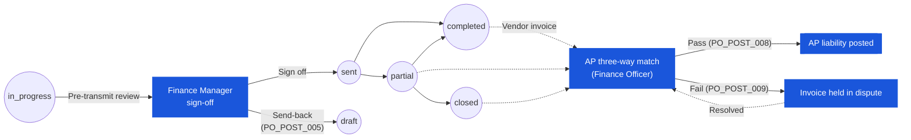

# ใบสั่งซื้อ (Purchase Order) — User Flow — Finance

> **At a Glance**
> **Persona:** Finance (Officer / AP Clerk + Finance Manager) &nbsp;·&nbsp; **Module:** [[purchase-order]] &nbsp;·&nbsp; **Workflow stages:** Pre-transmission review ที่ `po_status = in_progress` (Finance Manager — currency / FX / tax / line totals ก่อน `PO_POST_004` send) &nbsp;·&nbsp; post-receipt three-way match (PO ↔ GRN ↔ invoice — `PO_POST_008` / `PO_POST_009`) &nbsp;·&nbsp; AP posting บน success &nbsp;·&nbsp; **สิทธิ์สำคัญ:** financial sign-off pre-transmission; three-way match; flag discrepancy ให้ Purchaser PO state ไม่ transition โดย match
> **Persona นี้ทำอะไร:** Pre-transmission financial sign-off และ post-receipt three-way match; clear GRN accrual, post AP liability

## 1. บทบาทในโมดูลนี้

Persona **Finance** ครอบคลุม **Finance Officer / Accounts Payable** clerk ที่รัน invoice match ประจำวันและ post AP liability และ **Finance Manager** ที่ exercise pre-transmission financial sign-off บน POs ที่ high-value หรือ FX-sensitive Finance มี **สองจุดสัมผัส** ในวงจรชีวิต PO และอยู่ที่ปลายตรงข้ามของเอกสาร: **pre-transmission review** ที่หางของ approval (Finance Manager check currency, exchange rate, tax codes, และ line totals ขณะที่ PO ยังอยู่ที่ `po_status = in_progress` ก่อน transition stage สุดท้ายเป็น `sent` ภายใต้ `PO_POST_004`) และ **post-receipt three-way match** หลัง GRN posting (Finance Officer / AP รับ vendor invoice, look up PO และ GRN(s) ที่ตรงกัน และรัน match algorithm ภายใต้ `PO_POST_008` / `PO_POST_009`) Three-way match เป็นกิจกรรม **สำคัญของ Finance** ในโมดูล PO — เป็น control ที่แปลง matched-but-unbilled accrual เป็น payable, clear GRN accrual, และ post AP liability บน linked vendor invoice PO เอง **ไม่** transition โดย three-way match (`PO_POST_008` ระบุชัดเจน); PO เก็บสถานะ fulfilment ที่ถึง (`partial`, `completed`, หรือ `closed`) และ match outcome อยู่บนเร็คคอร์ด invoice บน match failure ความคลาดเคลื่อนถูก flag กลับให้ **Purchaser** สำหรับ resolution ผ่าน amendment, credit note, หรือ void และ invoice ถูก hold ใน dispute จนกว่าจะ reconcile

### ตำแหน่งใน Workflow (เน้นจุดสัมผัสของ Finance)

### ตารางสิทธิ์ — Touch point × Action (Finance sub-roles)

Finance มี **PO status mutation โดยตรงไม่มี** นอกการ pre-transmission review (send-back ที่ `in_progress`) Three-way match outcome อยู่บนเร็คคอร์ด invoice ไม่ใช่บน PO

| Action | Finance Manager (pre-transmit, PO ที่ `in_progress`) | Finance Officer / AP (post-receipt, PO ที่ `partial` / `completed` / `closed`) |
|---|---|---|
| ดู PO header / lines / Financial Details | ✅ | ✅ |
| Sign-off ที่ Finance approval stage (advance workflow) | ✅ (`PO_AUTH_003`) | ❌ |
| Send-back ที่ Finance stage (`PO_POST_005`) | ✅ | ❌ |
| Capture vendor invoice | ❌ | ✅ |
| รัน three-way match (qty / price / product / currency) | ❌ | ✅ |
| Post AP liability บน match success (`PO_POST_008`) | ❌ | ✅ |
| Hold invoice ใน dispute บน match failure (`PO_POST_009`) | ❌ | ✅ |
| Auto-pass price variance ภายใน tolerance | ❌ | ✅ (config-driven) |
| Flag discrepancy กลับให้ Purchaser ผ่าน `tb_purchase_order_comment` | ❌ | ✅ |
| Edit PO header / lines / vendor / qty | ❌ | ❌ |
| Approve ที่ final stage / Transmit | ❌ (FM sign off, จากนั้น chain ดำเนินการต่อ; final transmit ตาม `PO_AUTH_006`) | ❌ |
| Void / Early-close PO | ❌ (PM เท่านั้น) | ❌ (PM เท่านั้น) |
| Re-match หลัง dispute resolution | ❌ | ✅ |

> ℹ️ **PO status ไม่เปลี่ยนโดย three-way match:** PO เก็บ receipt-side status (`partial`, `completed`, หรือ `closed`) โดยไม่คำนึงถึง match outcome AP success / failure / dispute อยู่ทั้งหมดบนเร็คคอร์ด invoice ที่ link (`PO_POST_008` / `PO_POST_009`)

## 2. Entry Point และ Primary Flow

Finance มีสอง flows, addressed แยกด้านล่าง

### 2.1. Pre-transmission review (Finance Manager)

**Entry point:** Finance Manager assigned เป็น approver บน workflow stage ที่ตั้งค่าสำหรับ financial review (โดยทั่วไป stage สุดท้ายก่อน final approval หรือเป็น co-approver ที่ high-value gate) Entry ผ่าน **notification คิว review** เมื่อ PO อยู่ที่ `po_status = in_progress` และ stage cursor ของ workflow land ที่ Finance stage

**Primary flow (4 ขั้นตอน):**

1. **เปิด PO จากคิว review** Screen แสดงแท็บ **Financial Details** (`FinancialDetailsTab`) และแท็บ **General Info**; authorization คือ standard `PO_AUTH_003` approver check เทียบกับ `workflow_current_stage`
2. **Check financial header** — verify `currency_id` เทียบกับ vendor's contracted currency, `exchange_rate` เทียบกับ tenant's FX policy (rate source, refresh window, rounding), payment terms, และ prepayment / deposit flag ใด ๆ Confirm `total_amount` ในสกุลเงิน transaction และ base-currency equivalent อยู่ภายใน high-value threshold ที่ Finance Manager sign off
3. **Check line-level financials** — line subtotals ตาม calculation chain จาก carmen/docs § 1.4 (`Item Subtotal → Discount → Net Amount → Tax → Item Total`); verify `tax_id` / tax rate ของแต่ละบรรทัดตรงกับ product's tax profile และ vendor's tax registration ว่า discounts มีเหตุผล documented และไม่มีบรรทัดถูกปัดเศษไม่ consistent Tally totals ต่อบรรทัดเทียบกับ header roll-up (`PO_CALC_008`–`PO_CALC_011`)
4. **Sign off หรือ send-back**
   - **Sign off:** post stage approval; workflow advance ไปยัง stage ถัดไป (หรือไปยัง final approval, ซึ่ง trigger `PO_POST_004`: `in_progress → sent` และ transmission ไปยัง vendor)
   - **Send-back:** post send-back พร้อม reason text ภายใต้ `PO_POST_005`; PO return เป็น `draft` ให้ Purchaser แก้ไข Comment send-back เขียนใน `tb_purchase_order_comment` และ workflow cursor reset

### 2.2. Three-way match (Finance Officer / AP)

**Entry point:** Vendor invoice มาถึง (paper, PDF, หรือ EDI feed) Finance Officer เปิดหน้า AP capture และ index invoice เทียบกับ PO ผ่าน reference ของ vendor และ `po_no` ที่พิมพ์บน invoice

**Primary flow (7 ขั้นตอน):**

1. **Capture vendor invoice** — บันทึก invoice number, invoice date, vendor, currency, line items (product, qty, unit price), tax, และ total Invoice hold ใน state **pending match** จนกว่า three-way match รัน
2. **Look up PO ตามหมายเลขอ้างอิง** `po_no` ที่ capture resolve เป็น row `tb_purchase_order`; PO ต้องอยู่ที่ `po_status ∈ {partial, completed, closed}` สำหรับ matching (PO ที่ `sent` โดยไม่มี GRN ไม่สามารถ match — ดู Decision Branches) Verify ว่า invoice vendor ตรงกับ `tb_purchase_order.vendor_id` และ invoice currency ตรงกับ `tb_purchase_order.currency_id`
3. **Look up matching GRN(s)** Carmen retrieve GRNs ทั้งหมดที่ post เทียบกับ PO (PO link ฝั่ง GRN และ visible บน `GoodsReceiveNoteTab` ของ PO) สำหรับแต่ละ invoice line ระบบระบุ GRN line(s) ที่ครอบคลุม invoiced product บน PO line เดียวกัน
4. **รัน three-way match algorithm** (`PO_POST_008`) สำหรับแต่ละ invoice line, match เปรียบเทียบ:
   - **Quantity:** invoice qty ↔ GRN `accepted_qty` (หรือ `received_qty` ตาม tenant policy) — ภายใน qty tolerance ที่ตั้งค่า
   - **Price:** invoice unit price ↔ PO `unit_price` — ภายใน price tolerance ที่ตั้งค่า
   - **Product / line identity:** invoice product ตรงกับ PO/GRN product บน PO line เดียวกัน
   Match เป็น line-by-line; overall invoice match เป็น **success** เฉพาะเมื่อทุกบรรทัด match
5. **บน match success (`PO_POST_008`):** AP module **clear GRN accrual** (reverse entry inventory-receipt accrual เทียบกับ goods-received-not-invoiced account) และ **post AP liability** เทียบกับ vendor — debit inventory accrual / credit vendor payable ในสกุลเงิน transaction พร้อม FX revaluation เทียบกับ base currency ที่ capture ที่ invoice date Matched invoice เคลื่อนเป็น state **approved for payment** PO **ไม่** status-changed โดย event นี้ (ตาม `PO_POST_008`); เก็บ receipt-side status PO progress ไปยังตำแหน่งเชิงการค้า terminal — procurement commitment ตอนนี้เป็น payable
6. **บน match failure (`PO_POST_009`):** AP hold invoice ใน state **dispute** Comment `system` append เข้า `tb_purchase_order_comment` บันทึก failure (บรรทัดไหน, dimension ไหน — qty / price / product) และ deviation record เปิดบนฝั่ง vendor / vendor-pricelist สำหรับการ track ความคลาดเคลื่อนถูก **flag กลับให้ Purchaser** ผ่าน activity-log notification มาตรฐาน PO ไม่ auto-voided; การ resolve ทำด้วยมือ
7. **Reconcile และ re-match (เส้นทาง failure เท่านั้น)** เมื่อ Purchaser resolve ความคลาดเคลื่อน — amendment, credit note จาก vendor, supplementary GRN, หรือ write-off ผ่าน PO close (`PO_POST_011`) — invoice ถูก re-present ไปยัง match บน clean re-match, step 5 fire

## 3. Decision Branches

- **Clean match — post AP** (`PO_POST_008`): ทุกบรรทัดผ่าน qty และ price tolerance เทียบกับ matching GRN และ PO; AP module clear GRN accrual, post AP liability ในสกุลเงิน transaction พร้อม FX entry เทียบกับ base currency ที่ invoice date และเคลื่อน invoice เป็น approved-for-payment PO ไม่เปลี่ยน; ตำแหน่ง matched-but-unbilled บน PO ตอนนี้เป็นศูนย์
- **Quantity discrepancy — flag กลับให้ Purchaser** (`PO_POST_009`): invoice qty เกิน GRN `accepted_qty` (หรือต่ำกว่า ขึ้นอยู่กับทิศทาง) นอก tolerance Invoice hold ใน dispute; comment เขียน; Purchaser แจ้งเตือนเพื่อตามทั้ง credit note (over-invoicing) หรือ supplementary GRN เทียบกับ shipment vendor เพิ่ม (under-receipt) PO status ไม่เปลี่ยน; pending balance ระดับบรรทัดไม่เปลี่ยน
- **Price discrepancy ภายใน tolerance — auto-pass:** invoice unit price ต่างจาก PO `unit_price` แต่ความแตกต่าง absolute / percentage อยู่ภายใน tenant's price-tolerance configuration บรรทัดผ่าน; AP posting ดำเนินที่ราคา invoiced; variance capture เป็น price-variance entry บน AP posting (debit / credit purchase price variance account) PO line price ยังคงเป็น contracted price
- **Price discrepancy นอก tolerance — flag กลับให้ Purchaser** (`PO_POST_009`): invoice unit price อยู่นอก price-tolerance band Invoice hold ใน dispute; comment เขียน; Purchaser ตามทั้ง credit note (over-billing) หรือ price amendment บน PO ภายใต้ `PO_VAL_016` (การเปลี่ยนราคา post-`sent` จำกัดและต้องการ authority ที่เหมาะสม)
- **Missing GRN — await receipt หรือ bounce-back:** invoice ที่ capture ไม่มี matching GRN บน PO สอง sub-branches:
  - **Vendor ส่งของแต่ GRN ยังไม่ post:** invoice park ใน pending-match; Finance แจ้งเตือน Receiver / Purchaser เพื่อตาม GRN posting เมื่อ post แล้ว match re-run อัตโนมัติ
  - **Vendor invoice ก่อนการส่งของ (หรือสำหรับสินค้าที่ไม่ส่ง):** Finance bounce invoice กลับให้ vendor พร้อม non-receipt notice; Purchaser แจ้งเตือน PO status ไม่เปลี่ยน
- **Currency mismatch ระหว่าง PO และ invoice — FX adjustment posting:** invoice currency ต่างจาก `tb_purchase_order.currency_id` หาก variance ถูกอนุญาตโดย tenant policy (เช่น contracted dual-currency vendor) AP post invoice ในสกุลเงิน invoice และ capture FX adjustment entry เทียบกับ contracted currency ของ PO ที่ invoice-date rate หากไม่อนุญาต invoice bounce กลับเป็น currency-mismatch dispute และ flag ให้ Purchaser สำหรับ vendor correction

## 4. Exit Point / Handoffs

การ involve ของ Finance บนคู่ PO–invoice ที่กำหนดจบที่ **AP posting** (success) หรือบน **discrepancy resolution closure** (failure) จากจุดนั้น state บน Carmen เป็นหนึ่งใน:

- **AP posted, PO terminal:** invoice approved for payment; GRN accrual cleared; PO ไม่เปลี่ยนที่สถานะ fulfilment (`partial`, `completed`, หรือ `closed`) PO ถึงสิ้น lifecycle เชิงการค้า / บัญชีสำหรับส่วนที่ matched สำหรับ PO ที่ partially-fulfilled, Finance re-enter flow สำหรับแต่ละ invoice ที่ตามมาเทียบกับ PO เดียวกันจนกว่า cumulative receipt จะ fully invoiced หรือ PO ปิด
- **Discrepancy flagged, PO hold ที่ current state:** invoice hold ใน dispute (`PO_POST_009`); PO เก็บ `po_status` ปัจจุบัน; ownership ของ resolution อยู่กับ **Purchaser** (amendment / credit-note loop) หรือเมื่อต้องการ void, กับ **Procurement Manager** ภายใต้ `PO_POST_010` เมื่อ resolved, Finance re-run match และเส้นทาง success fire
- **Pre-transmission send-back, PO return เป็น draft:** send-back ของ Finance Manager ระหว่าง review stage route PO จาก `in_progress → draft` ภายใต้ `PO_POST_005`; ownership return ไปยัง **Purchaser** เพื่อแก้ไข issue ทางการเงินที่ flag และ resubmit

Persona handoffs คือ: Finance Manager ↔ Purchaser (pre-transmission send-back loop) และ Finance Officer ↔ Purchaser / Procurement Manager (post-receipt discrepancy loop) PO terminal commercial state สำหรับ clean run คือ `completed` (หรือ `partial` / `closed` ถ้า receipt side จบที่นั่น) ด้วย matched invoices ทั้งหมด posted

## 5. แหล่งอ้างอิง

- ภาพรวม parent: [03-user-flow.md](./03-user-flow.md) — global PO state machine และตาราง cross-persona handoff; row Finance นั่งที่ปลายด้านขวา (post-`completed`, post-`closed`, post-`partial`)
- Sibling: [03-user-flow-receiver.md](./03-user-flow-receiver.md) — internal persona ต้นน้ำที่ post GRN ที่ flow นี้ match เทียบกัน; GRN ขับเคลื่อน `received_qty` และ `accepted_qty` ที่ three-way match consume
- Sibling: [03-user-flow-purchaser.md](./03-user-flow-purchaser.md) — bounce-back target บน three-way match failure (qty / price / currency discrepancy); เป็นเจ้าของ amendment / credit-note resolution loop
- Sibling: [03-user-flow-procurement-manager.md](./03-user-flow-procurement-manager.md) — ถือ void / close override authority ที่ความคลาดเคลื่อนสามารถ resolve โดย `PO_POST_010` / `PO_POST_011` เท่านั้น
- Sibling: [03-user-flow-vendor.md](./03-user-flow-vendor.md) — ฝ่ายภายนอกที่ออก invoice ที่ flow นี้ capture และ match
- Sibling: [02-business-rules.md](./02-business-rules.md) § 5 (Posting Rules) — `PO_POST_004` (final approval / transmission), `PO_POST_005` (send-back), `PO_POST_008` (three-way match success), `PO_POST_009` (three-way match failure), และ `PO_POST_011` (close with cancelled remainder) สำหรับกฎที่อ้างอิงข้างต้น
- เกี่ยวข้อง: [[good-receive-note]] — โมดูล upstream ที่การ posting สร้าง matched-but-unbilled accrual ที่ AP clear บน match success
- เกี่ยวข้อง: [[inventory]] — inventory accrual ที่ clear บน match success เป็นของ inventory / GL integration; PO มีส่วนร่วมเฉพาะ on-order pipeline quantity จนกว่า GRN
- `../carmen/docs/purchase-order-management/purchase-order-module.md` — แหล่ง carmen/docs หลักสำหรับ business analysis โมดูล PO, Finance integration, และ flow three-way-match
