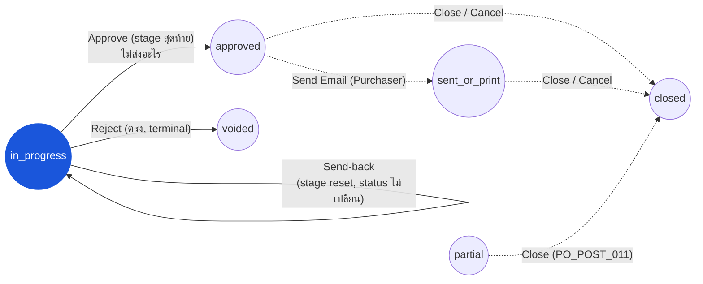

# ใบสั่งซื้อ (Purchase Order) — User Flow — Procurement Manager

> **At a Glance**
> **Persona:** Procurement Manager &nbsp;·&nbsp; **Module:** [purchase-order](/th/inventory/purchase-order) &nbsp;·&nbsp; **Workflow stages:** Approve ที่ stage ใดก็ตามที่ workflow ที่ assign ให้ (`in_progress → approved` ที่ stage สุดท้ายตาม `PO_POST_004` — การอนุมัติไม่ส่งอีกต่อไป), send-back (stage cursor reset, `po_status` ไม่เปลี่ยน, `PO_POST_005`), หรือ reject เป็น `voided` (ตรง, terminal); Close / Cancel &nbsp;·&nbsp; **สิทธิ์สำคัญ:** stage-gated approval (`PO_AUTH_011`); swipe-approve (`PO_AUTH_012`)
> **Persona นี้ทำอะไร:** ทำหน้าที่เป็น approver บน workflow stage ใดก็ตามที่ตั้งค่าไว้สำหรับ role นี้ Re-sync 2026-09-22 — delete-in-draft เป็นสิทธิ์ของเจ้าของ ไม่ใช่ของ Manager

> ⚠️ **แก้ไขในรอบนี้ — สองรอบซ้อน** เวอร์ชันก่อนหน้าของหน้านี้อธิบาย "high-value approval gate" เฉพาะของ Procurement Manager ที่ trigger โดย `total_amount` เกิน tenant threshold หรือ pricelist-deviation percentage บวกกับ "configurational surface" ทั้งชุด (rule-tuning workbench สำหรับ vendor ranking, Convert-to-PO grouping, unit-conversion factors, pricelist tolerance, และ threshold เอง), "void จาก non-terminal state ใด ๆ" ที่สงวนไว้เฉพาะ Manager, และ bulk void/close actions configurational surface, void ที่สงวนเฉพาะ Manager, pricelist-deviation-percentage routing, และ bulk actions ไม่พบใน source ปัจจุบัน: การค้นหาทั่ว repo ใน `carmen-turborepo-backend-v2` และ `carmen-inventory-frontend-react` สำหรับ `segregation`, vendor-ranking, และ code ของ bulk-action ไม่คืนผลลัพธ์ที่เกี่ยวข้อง; `enum_stage_role` ไม่มี member ที่ awareness deviation; และเส้นทางเดียวสู่ `voided` คือ reject แบบตรง `in_progress → voided` ซึ่งใช้ได้กับ approver คนใดก็ตามที่ holds stage ปัจจุบัน ไม่ได้สงวนไว้เฉพาะ role นี้
>
> **ครึ่งหนึ่งของ claim ที่เป็นเรื่อง amount-threshold กลับถูกตัดทิ้งผิดพลาดโดย correction pass ก่อนหน้านั้นเอง** — การค้นหาติดตามผลยืนยันว่าการ route stage ตาม `total_amount` มีจริง เพียงแต่ไม่ใช่ mechanism เฉพาะของ Procurement Manager หรือเฉพาะของ PO: มันคือ `routing_rules` ของ workflow แบบทั่วไป (`tb_workflow.data.routing_rules` ตั้งค่าได้จากแท็บ **Routing** ใน `/system-admin/workflow` ใช้ร่วมกันระหว่าง PR/PO/SR) ที่ประเมินโดย `evaluateCondition`/`findNextStep` ใน `workflows.navagation.service.ts` ทุกครั้งที่ submit/approve ดู § 1 และตารางสิทธิ์ด้านล่างสำหรับภาพที่แก้ไขแล้ว

## 1. บทบาทในโมดูลนี้

**Procurement Manager** engage กับโมดูล PO ในฐานะ **workflow-stage approver** — mechanism แบบ generic เดียวกับที่ user ใด ๆ ที่มี `stage_role = approve` ใช้ เมื่อ PO ถูก submit (`draft → in_progress`), workflow definition ที่ `tb_purchase_order.workflow_id` อ้างอิงจะกำหนดว่ามีกี่ stage และใคร assign ให้แต่ละ stage (`user_action.execute[]`); Procurement Manager ก็คือ user (หรือ role) ใดก็ตามที่ workflow configuration ของ tenant วางไว้บน stage เหล่านั้นหนึ่งหรือมากกว่าหนึ่ง stage ที่ stage สุดท้าย การ approve จะ authorize commitment — `po_status: in_progress → approved`, ตั้ง `approval_date` (`performApprove` ใน `purchase-order.logic.ts` L424-436, `PO_POST_004`) — **แต่ไม่ส่งอะไรออกไป**; การส่งเป็นขั้นตอน **Send Email** แยกต่างหากของ Purchaser (`PO_POST_004b`) ที่ stage ใด ๆ ที่ไม่ใช่ final การ approve จะเพียง advance `workflow_current_stage` (`po_status` ยังคงเป็น `in_progress`) Manager ยังสามารถ **send back** PO ที่ in-progress ได้ — การนี้ reset `workflow_current_stage` เป็น stage ก่อนหน้า (โดยทั่วไปกลับไปยังผู้สร้าง) โดยไม่เปลี่ยน `po_status` (`PO_POST_005`) — หรือ **reject** ซึ่งเป็น transition แบบตรงและ terminal `in_progress → voided` (ไม่มี state กลาง ไม่กลับไปที่ `draft`) จาก mobile client Manager สามารถ **swipe-approve** PO หลายใบพร้อมกัน (`POST .../purchase-orders/swipe-approve`, `PO_AUTH_012`) เช่นเดียวกับ user ใดก็ตามที่เปิด PO อยู่ Manager สามารถ **Close** PO ที่ `in_progress` / `approved` / `sent_or_print` / `partial` ก่อนกำหนด (`PO_POST_011`) หรือ **Cancel** PO ที่ `draft` / `in_progress` / `approved` / `sent_or_print` (`PO_POST_010`) — ทั้งคู่เขียนปริมาณที่ยังเปิดค้างเป็น `cancelled_qty` **แก้ไข 2026-09-22:** soft-delete-in-draft **ไม่ใช่** สิทธิ์ของ Manager — `remove()` อนุญาตเฉพาะผู้สร้างเอกสารหรือ platform super-admin (`PO_AUTH_005`) **ยืนยันแล้ว แก้ไขในรอบนี้:** workflow ที่ assign ให้ PO สามารถมี `routing_rules` ที่ skip หรือกระโดดข้าม stage ตาม `total_amount` (ผลรวม `total_price` ของแต่ละบรรทัด) ได้ — ประเมินทุกครั้งที่ submit/approve ตั้งค่าได้แบบทั่วไปจากแท็บ **Routing** ใน `/system-admin/workflow` (ใช้ร่วมกันระหว่าง PR/PO/SR ไม่ใช่เฉพาะของ PO หรือของ Manager) ไม่พบ field routing ตาม pricelist-deviation-percentage, การตั้งค่า vendor-ranking, หรือ bulk-action surface ใด ๆ ใน source ปัจจุบัน ถือว่าข้อกล่าวอ้างใด ๆ ในลักษณะนี้ที่อื่นเป็นเพียง design intent ที่ยังไม่ยืนยัน ไม่ใช่ behavior ที่ใช้งานจริง

### ตำแหน่งใน Workflow (PM approver + override paths)

### ตารางสิทธิ์ — Action (Procurement Manager)

| Action | Availability |
|---|---|
| ดู PO | ✅ ทุก status |
| Approve ที่ stage ตัวเอง (`in_progress`) | ✅ เมื่อถูก assign ผ่าน `user_action.execute[]` สำหรับ stage ปัจจุบัน (`PO_AUTH_011`) — authorization เองไม่ถูก gate ด้วย amount แม้ว่า stage ที่ cursor มาถึงอาจถูก gate ด้วยได้ (workflow `routing_rules` ดู § 1) |
| Approve ที่ stage สุดท้าย (`in_progress → approved`) | ✅ เมื่อ stage ปัจจุบันเป็น stage สุดท้ายของ workflow (`PO_POST_004`); ไม่มีการส่ง |
| Swipe-approve เป็น batch (`POST /swipe-approve`) | ✅ สำหรับ user ใน approval stage บน PO ที่ `in_progress` ซึ่งผู้เรียกเป็น action user (`PO_AUTH_012`); ปฏิเสธสำหรับ `stage_role = purchase` |
| Send-back (stage reset, `po_status` ไม่เปลี่ยน) | ✅ เมื่อถูก assign ให้ stage ปัจจุบัน (`PO_POST_005`) |
| Reject (`in_progress → voided`, ตรง, terminal) | ✅ เมื่อถูก assign ให้ stage ปัจจุบัน — ไม่ได้ผูกขาดเฉพาะ role นี้ |
| Soft-delete draft (`PO_AUTH_005`) | ❌ เว้นแต่ Manager เป็นผู้สร้าง draft (เจ้าของ) หรือเป็น platform super-admin |
| Send Email / mark-sent (`approved → sent_or_print`) | ✅ ไม่มี role gate — แต่โดยธรรมเนียมเป็นขั้นตอนของ Purchaser |
| Close (`{in_progress, approved, sent_or_print, partial} → closed`, `PO_POST_011`) | ✅ ไม่มี role gate ใน `closePO()` |
| Cancel (`{draft, in_progress, approved, sent_or_print} → closed`) | ✅ ไม่มี role gate ใน `cancel()` |
| Edit header / lines (qty, price, tax, FOC) | ❌ (ขอบเขตของ Purchaser, `PO_AUTH_002`) |

## 2. Entry Point และ Primary Flow

**Entry point:** การแจ้งเตือนใน-app เมื่อ stage cursor ของ workflow ของ PO ที่ submit แล้วมาลงที่ stage ที่ user นี้ถูก assign หรือ Sidebar → **Procurement** → **My Approvals** (`/procurement/approval`, `routes/procurement/approval/`) ซึ่งอ่านคิว pending แบบรวม `GET /api/my-pending` — หนุนด้วย SQL view `sys_v_my_pending` ที่ union แถวของ PR / PO / SR (`bb0000283`, 2026-09-16) — พร้อม filter chip **PO** (`filter = doc_type:po`, `approval-component.tsx`)

**Primary flow (happy path):**

1. รับ notification authorization ในการดำเนินการ เมื่อ cursor มาลงที่ stage ของ user นี้แล้ว คือ membership ใน `user_action.execute[]` สำหรับ stage นั้นเท่านั้น — ไม่ใช่การตรวจ amount หรือ deviation ใด ๆ แต่ stage ที่ cursor มาถึงเองอาจสะท้อน `routing_rules` ของ workflow ที่ skip หรือกระโดดข้าม stage ตาม `total_amount` (§ 1) ดังนั้น PO มูลค่าสูงอาจผ่านลำดับ stage ต่างจาก PO มูลค่าต่ำบน workflow เดียวกันก่อนที่ notification นี้จะ fire
2. เปิดหน้า **PO detail** จากคิว approval Review header (vendor, currency, exchange rate, credit term, order และ delivery dates) เทียบกับ `PO_VAL_002`–`PO_VAL_006` Review PR ที่ link ผ่านตาราง bridge สำหรับ PR-sourced POs (`PO_XMOD_001`)
3. เดินแท็บ **Items** ตรวจสอบ flag `is_foc`, `cancelled_qty` (ควรเป็นศูนย์ที่ stage นี้), และ `delivery_date` ต่อบรรทัด Re-validate การคำนวณ roll-up: `total_price`, `total_tax`, `total_amount` ตาม `PO_CALC_008`–`PO_CALC_010`
4. Review แท็บ **Attachments** และ **Comments** สำหรับ vendor quote, note justification ของ buyer, และ comments จาก approver stage ก่อนหน้า JSON columns `history` และ `workflow_history` surface ห่วงโซ่ events `created → submitted → approved` เต็ม
5. ตัดสินใจ ที่ระดับ item ก่อนแล้วจึงระดับเอกสาร (mirror flow ที่ยืนยันด้วย e2e ใน `403-po-approver-journey.spec.ts`):
   - **Approve** — mark item(s) เป็น Approved จากนั้น **Approve PO** (ปุ่ม footer ปรากฏเฉพาะเมื่อทุกบรรทัดที่ mark resolve เป็น `approved`, `po-footer-action.tsx` `computePoAction`) หากเป็น stage สุดท้าย: `po_status: in_progress → approved` ผ่าน `PO_POST_004`, ตั้ง `approval_date`, `last_action = approved`, `workflow_history` ได้ entry `completed` — **ไม่มีการส่ง**; Purchaser ส่งทีหลัง หากไม่ใช่ final: `po_status` ยังคงเป็น `in_progress`, stage cursor advance
   - **Send back** — mark item(s) เป็น Review จากนั้น **Document Send Back** พร้อมเหตุผล optional `workflow_current_stage` reset เป็น stage ก่อนหน้า; `po_status` ยังคงเป็น `in_progress`; `last_action = reviewed` เหตุผลถูก append ใน `tb_purchase_order_comment`
   - **Reject** — mark item(s) เป็น Reject จากนั้น **Document Reject** พร้อมเหตุผล optional `po_status: in_progress → voided` ตรงและ terminal `is_active` ไม่ถูกแตะโดย call นี้
6. (หลัง final approval) PO เป็น `approved`; การส่งเป็น event ที่แยกต่างหากและเกิดทีหลัง หาก Manager ต้องการยืนยันว่า vendor ได้รับแล้ว `tb_activity` มี entry `email_sent` (พร้อมผู้รับและผลลัพธ์) หรือ entry "Marked as sent to vendor" เมื่อ Purchaser ส่งแล้ว
7. (Optional, override path) **Close** PO ที่ `in_progress` / `approved` / `sent_or_print` / `partial` เมื่อ vendor ไม่สามารถ supply outstanding balance (`PO_POST_011`) — เขียน remainder เป็น `cancelled_qty` และแจ้งเตือน buyer ไม่มี field เหตุผลบน endpoint; เพิ่ม comment ถ้าต้องการ

## 3. Decision Branches

- **หากการ escalate ที่มาถึงเป็น PO ที่ valid ทางเทคนิคแต่น่าสงสัยทางการค้า**: Manager review vendor quote ใน Attachments และ justification ของ Purchaser ใน Comments จากนั้น approve, send back พร้อม comment, หรือ reject — โดยใช้ mechanism แบบ stage-based เดียวกับ approver คนอื่น ไม่พบ surface "commercial escalation" แยกต่างหาก
- **หาก vendor ไม่สามารถ fulfil PO ที่ `approved` / `sent_or_print` / `partial`**: Manager (หรือใครก็ตามที่เปิด PO อยู่) รัน **Close** เขียนปริมาณที่ยังเปิดค้างเป็น `cancelled_qty` บนแต่ละบรรทัดที่ได้รับผลกระทบ การนี้ลงเอยที่ `closed` ไม่ใช่ `voided` — ไม่มีเส้นทางจาก status เหล่านั้นไปยัง `voided`
- **หากต้องลบ draft PO**: เฉพาะผู้สร้าง (หรือ super-admin) ที่ **Delete** ได้ (`PO_AUTH_005`, `PO_POST_012` — `remove()` เช็ค `isDocumentOwner`); Manager ที่ไม่ได้สร้างใช้ **Cancel** (→ `closed`) แทน row ที่ลบแล้วยังคงอยู่ในฐานข้อมูลสำหรับ audit และ `po_no` เดียวกันถูกปล่อยให้ใช้ใหม่ (unique index รวม `deleted_at`)
- **หาก PO เล็ก ๆ หลายใบรออยู่ที่ stage เดียวกัน** (mobile): `POST .../purchase-orders/swipe-approve` `{ po_ids[] }` approve ทุกบรรทัดของแต่ละใบที่ stage ปัจจุบันและรายงาน success ต่อ PO หรือเหตุผลที่ block (`swipeApproveOne`)

## 4. Exit Point / Handoffs

การมีส่วนร่วมของ Procurement Manager บน PO ที่กำหนดจบที่หนึ่งใน handoffs ต่อไปนี้

- **Final approval → กลับไปที่ Purchaser เพื่อส่ง** — `po_status: in_progress → approved` ผ่าน `PO_POST_004` Handoff ไปยัง **Purchaser** (Send Email, `PO_POST_004b`) และคู่ขนานกัน **Receiver** อาจรับของกับ PO ที่ `approved` ได้แล้ว; document state ที่ handoff คือ `approved` ดู [03-user-flow-vendor.md](./03-user-flow-vendor.md) สำหรับสิ่งที่ vendor เห็น
- **Reject → terminal voided** — transition แบบตรง ไม่มี state กลาง Handoff ไปยัง **Auditor** สำหรับ review post-hoc เท่านั้น; document state คือ `voided` (terminal)
- **Send back → revision โดยเจ้าของ stage ที่ assign** — `workflow_current_stage` reset; `po_status` ยังคงเป็น `in_progress` (ไม่ใช่ `draft`) Handoff ไปยังใครก็ตามที่ stage ก่อนหน้า assign ไว้ (โดยทั่วไปคือ Purchaser) การมีส่วนร่วมของ Manager resume หาก PO ที่ resubmit มาถึง stage นี้อีกครั้ง
- **Close** — `{in_progress, approved, sent_or_print, partial} → closed`, remainder เขียนเป็น `cancelled_qty` Terminal

Transitions ที่ driven โดย receipt (`{approved, sent_or_print} → partial → completed` ผ่าน `PO_POST_006`/`PO_POST_007`) ไม่ใช่ action ของ Procurement Manager — driven โดย **Receiver** ผ่าน GRN posting

## 5. แหล่งอ้างอิง

- ภาพรวม parent: [03-user-flow.md](./03-user-flow.md) — global PO state machine และตาราง cross-persona handoff
- Sibling: [03-user-flow-purchaser.md](./03-user-flow-purchaser.md) — persona ต้นน้ำที่ submit PO และหยิบ send-back ที่ stage ก่อนหน้า
- Sibling: [03-user-flow-vendor.md](./03-user-flow-vendor.md) — ฝ่ายภายนอกปลายน้ำที่รับ PO ที่ transmit ที่ `po_status = sent`
- Sibling: [03-user-flow-audit-config.md](./03-user-flow-audit-config.md) — System Administrator ที่ตั้งค่า workflow definitions และ RBAC bindings; Auditor ที่ review activity log ของ actions approve / reject / close ของ Manager
- กฎ Authorization: [02-business-rules.md](./02-business-rules.md) Section 4 — `PO_AUTH_005` (delete-in-draft: เจ้าของ / super-admin, corrected), `PO_AUTH_007` (reject, corrected), `PO_AUTH_008` (early-close), `PO_AUTH_011` (workflow stage gating), `PO_AUTH_012` (swipe-approve)
- กฎ Posting: [02-business-rules.md](./02-business-rules.md) Section 5 — `PO_POST_004` (final approval → `approved`, corrected), `PO_POST_004b` (send email / mark sent → `sent_or_print`), `PO_POST_005` (send-back, corrected), `PO_POST_010`/`PO_POST_010b` (cancel / reject, corrected), `PO_POST_011` (early-close), `PO_POST_012` (soft-delete ใน draft)
- Backend: `../carmen-turborepo-backend-v2/apps/micro-business/src/procurement/purchase-order/purchase-order.logic.ts` (`performApprove`, `swipeApproveOne`, `reject`); `apps/micro-business/src/my-pending/` (คิวรวม, `sys_v_my_pending`)
- `../carmen/docs/purchase-order-management/purchase-order-module.md` — แหล่ง carmen/docs หลักสำหรับ business analysis โมดูล PO; ถือตาราง RBAC/threshold ของมันเป็น historical design intent ไม่ใช่ verified behavior ปัจจุบัน — ดู [02-business-rules.md](./02-business-rules.md) § 4 note
- เกี่ยวข้อง: [purchase-request](/th/inventory/purchase-request) — โมดูล upstream; PR-to-PO conversion ผ่านตาราง bridge
- เกี่ยวข้อง: [good-receive-note](/th/inventory/good-receive-note) — fulfilment ปลายน้ำที่ receipt postings ของมัน Manager สังเกต; close interact กับ GRN state ผ่าน `PO_XMOD_003`
