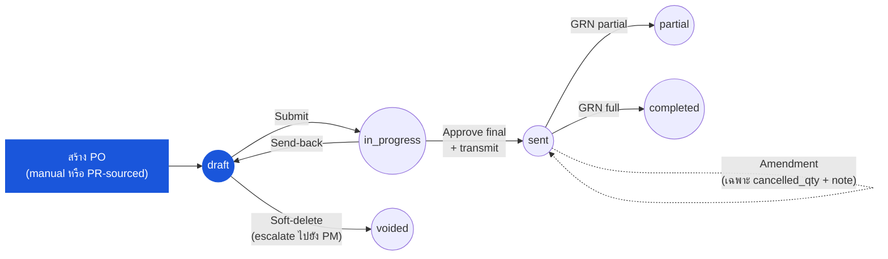

# ใบสั่งซื้อ (Purchase Order) — User Flow — Purchaser

> **At a Glance**
> **Persona:** Purchaser / Procurement Officer &nbsp;·&nbsp; **Module:** [[purchase-order]] &nbsp;·&nbsp; **Workflow stages:** draft → in_progress → sent (+ amendment บน sent) &nbsp;·&nbsp; **สิทธิ์สำคัญ:** create, edit, submit, transmit, amend, bounce-back
> **Persona นี้ทำอะไร:** สร้าง POs แบบ manual หรือ PR-sourced, validate ราคาและ vendor, submit สำหรับ approval, และส่งให้ vendor ตอน final approve

## 1. บทบาทในโมดูลนี้

**Purchaser** (หรือเรียกอีกชื่อว่า **Procurement Officer**) เป็นเจ้าของ PO ตั้งแต่การสร้างไปจนถึงการส่งให้ vendor — ช่วงจาก `draft` ถึง `sent` สองเส้นทางการสร้างมาบรรจบที่ flow เดียวกัน: **manual PO** (`po_type = manual`) ที่ยกขึ้นโดย procurement โดยตรง และ **PR-sourced PO** (`po_type = purchase_request`) ที่ materialise โดยการรัน Convert-to-PO จากโมดูล [[purchase-request]] ต้นน้ำ ซึ่งเขียน row หนึ่ง row ต่อคู่ (PO line, PR line) เข้าตาราง bridge `tb_purchase_order_detail_tb_purchase_request_detail` ([01-data-model.md](./01-data-model.md) Section 2.5) เมื่อ draft มีอยู่ Purchaser กรอก (หรือ inherit และ validate) header — `vendor_id`, `currency_id`, `exchange_rate`, `credit_term_id`, `order_date`, `delivery_date`, `workflow_id` — และเดินแต่ละบรรทัดเพื่อ verify ราคาเทียบกับ [[vendor-pricelist]] ปรับ quantity / discount / tax / FOC ที่ได้รับอนุญาต ตั้งเงื่อนไขการส่งของและการชำระเงิน และ submit (`draft → in_progress`, `PO_AUTH_003` และ `PO_POST_002`) Purchaser ยังถือ action transmit บน final approval (`PO_AUTH_006`, `PO_POST_004`) จัดการ amendments บน PO ที่เปิดภายใต้ข้อจำกัด post-`sent` ของ `PO_VAL_016` รัน bounce-back เพื่อส่ง PR กลับให้ Requestor เมื่อการ clarify vendor หรือ spec ไม่สามารถกู้คืนได้ และ void PO ใน `draft` เมื่อจำเป็น (`PO_AUTH_007` reserve void จากที่ไม่ใช่-`draft` ให้ Procurement Manager) Purchaser ปฏิบัติงานภายใต้ `enum_stage_role = purchase` (mirror จาก `PR_AUTH_008` บนฝั่ง PR)

### ตำแหน่งใน Workflow (Purchaser highlight)

### ตารางสิทธิ์ — Status × Action (Purchaser)

Purchaser เป็นเจ้าของเอกสารเต็มที่ใน `draft` และ re-enter ตอน send-back หลัง `sent` สิทธิ์ในการ edit ยุบลงเป็น `cancelled_qty` และ note ต่อบรรทัด (`PO_VAL_016`) Receipt-driven states (`partial`, `completed`, `closed`) สังเกตได้แต่ไม่ mutate โดยตรงโดย Purchaser `voided` สงวนสำหรับ Procurement Manager (`PO_AUTH_007`)

| Action | draft | in_progress | sent | partial | completed | closed | voided |
|---|---|---|---|---|---|---|---|
| ดู PO | ✅ | ✅ | ✅ | ✅ | ✅ | ✅ | ✅ |
| Edit header (vendor, currency, terms) | ✅ | ❌ | ❌ | ❌ | ❌ | ❌ | ❌ |
| เพิ่ม / ลบบรรทัด | ✅ | ❌ | ❌ | ❌ | ❌ | ❌ | ❌ |
| Edit qty / price / tax / FOC บรรทัด | ✅ | ❌ | ❌ | ❌ | ❌ | ❌ | ❌ |
| Submit for approval | ✅ (≥1 บรรทัด + workflow) | ❌ | ❌ | ❌ | ❌ | ❌ | ❌ |
| Self-approve (ต่ำกว่า threshold) | ❌ | ✅ (`PO_AUTH_004`) | ❌ | ❌ | ❌ | ❌ | ❌ |
| ส่งให้ vendor | ❌ | ✅ (บน final approve, `PO_AUTH_006`) | ❌ | ❌ | ❌ | ❌ | ❌ |
| ตั้ง `cancelled_qty` / note ต่อบรรทัด (amendment) | ❌ | ❌ | ✅ (`PO_VAL_016`) | ✅ | ❌ | ❌ | ❌ |
| เพิ่ม Comment / Attachment | ✅ | ✅ | ✅ | ✅ | ✅ | ✅ | ✅ |
| Soft-delete (เฉพาะ draft) | escalate ไปยัง PM (`PO_AUTH_005`) | ❌ | ❌ | ❌ | ❌ | ❌ | ❌ |
| Void (`PO_AUTH_007`) | ❌ | ❌ | ❌ (PM เท่านั้น) | ❌ (PM เท่านั้น) | ❌ | ❌ | — |
| Early-close (`PO_AUTH_008`) | ❌ | ❌ | ❌ | ❌ (PM / Inv Mgr) | ❌ | — | ❌ |

> ⚠️ **ความแตกต่าง — `IN PROGRESS` ไม่อยู่ใน BRD:** Live UI ใช้ `DRAFT` → `IN PROGRESS` สำหรับเฟส FC-approval ก่อน transmission BRD `FR-PO-005` นิยาม flow เป็น `Draft → Sent → Acknowledged → Partial Received → Fully Received → Closed/Cancelled` โดยไม่มี state `IN PROGRESS` Source: `Test_case/Purchase_Order/Purchaser/INDEX.md` § Status Lifecycle (วันที่ capture 2026-04-26) ดู [02-business-rules.md](./02-business-rules.md) § Status Lifecycle Mapping

## 2. Entry Point และ Primary Flow

**Entry point:** Sidebar → โมดูล **Purchase Order** → **Create Purchase Order** สำหรับ manual PO, หรือ Sidebar → โมดูล **Purchase Request** → คิว **Approved PRs** → workbench **Convert to PO** สำหรับ PR-sourced PO การแจ้งเตือนใน-app และ email "Purchase Request [PR-ID] Ready for PO Conversion" deep-link ตรงไปยัง workbench ทั้งสองเส้นทาง land Purchaser บนหน้า detail PO เดียวกันที่ `po_status = draft`

**Primary flow (happy path):**

1. เลือกเส้นทางการสร้าง สำหรับ **manual PO**: จาก PO module landing คลิก **Create Purchase Order** และกรอก header (vendor, currency, exchange rate, credit term, order และ delivery dates, workflow) บนฟอร์มเปล่า สำหรับ **PR-sourced PO**: จาก Convert-to-PO workbench เลือก PR lines ที่อนุมัติแล้วหนึ่งหรือมากกว่าหนึ่งบรรทัด; ระบบ group ด้วย `(vendor_id, currency_id)` และสร้าง draft `tb_purchase_order` หนึ่งใบต่อกลุ่ม แทรก `tb_purchase_order_detail` rows ที่ตรงกัน และเขียน bridge entries ด้วย `pr_detail_qty > 0` ต่อคู่ (PO line, PR line) (`PO_VAL_014`) PR-side snapshot — product, UoM, location, delivery point — denormalise ลงบน bridge row ที่ conversion time
2. เปิด **draft PO** Header pre-fill จาก vendor master และ workflow ที่เลือก (manual path) หรือ inherit จาก source PR(s) (PR-sourced path) Verify `vendor_id` อ้างอิง vendor ที่ active และไม่ blacklisted (`PO_VAL_002`), `currency_id` และ `exchange_rate > 0` (`PO_VAL_003`), `credit_term_id` ตั้งเมื่อ vendor ต้องการ (`PO_VAL_005`), และ `delivery_date >= order_date` (`PO_VAL_006`) `po_no` ที่ไม่ซ้ำ generate โดย numbering service (`PO_VAL_001`)
3. เดินแต่ละ **PO line** ในแท็บ **Items** สำหรับ PR-sourced lines bridge row ขับเคลื่อน snapshot; สำหรับ manual lines Purchaser เลือกสินค้าจากแคตตาล็อก สำหรับทุกบรรทัด confirm `product_id` active (`PO_VAL_007`), `order_qty > 0` พร้อม `order_unit_id` ตั้ง (`PO_VAL_008`), และ conversion factor ไปยัง base UoM positive (`PO_VAL_009`) FOC lines (`is_foc = true`) อนุญาตด้วย `price = 0` (`PO_VAL_010`)
4. Validate **ราคาเทียบกับ vendor pricelist ปัจจุบัน** ระบบเทียบแต่ละบรรทัดของ `price` กับ active `tb_pricelist_detail` row ที่ resolve โดย `product_id`, vendor, location, และ effective date Deviation indicator flag บรรทัดนอก tolerance band ที่ตั้งค่า (เช่น `±5%`) บน deviation Purchaser สามารถ (a) เก็บ price บรรทัดและดำเนินการต่อ (PR-sourced lines อาจคงไว้ PR snapshot), (b) refresh เป็นราคา pricelist ปัจจุบัน, หรือ (c) สำหรับ PR-sourced lines, raise concern ที่ trigger bounce-back ไปยัง Requestor ก่อน submission
5. ตั้งหรือ confirm **เงื่อนไขการส่งของและการชำระเงิน** บน header Payment terms (`credit_term_id` snapshot เป็น `credit_term`) มาจาก vendor master โดย default; Incoterm / delivery clause capture บน header และ reflect บนแต่ละ bridge row ของ `tb_purchase_order_detail` ที่ `delivery_point_id` ปรับ `delivery_date` ต่อบรรทัดหากต้องการ staggered schedule Tax profile และ discount rate validate เทียบกับ `PO_VAL_010` และ `PO_VAL_011`
6. ดูยอดรวม header คำนวณใหม่ Line subtotal, discount, net, tax, และ total คำนวณตาม `PO_CALC_001`–`PO_CALC_005`; base-currency dual-posting ใช้ `exchange_rate` ที่ lock ผ่าน `PO_CALC_006`; FOC lines flow quantity แต่เงินเป็นศูนย์ตาม `PO_CALC_007`; header roll up `total_price`, `total_tax`, `total_amount`, และ `total_qty` ตาม `PO_CALC_008`–`PO_CALC_011`; การปัดเศษทั้งหมดใช้ half-up ผ่าน `PO_CALC_012`
7. เปิดแท็บ **Attachments** และ **Comments** และแนบเอกสาร supporting (vendor quote, internal memo) หรือ note สำหรับ approver chain Activity log บันทึกทุก save event รวมถึงการเปลี่ยนแปลง header และบรรทัดผ่าน `tb_purchase_order_comment` และ `tb_purchase_order_detail_comment`
8. รัน submit-time check PO ต้องมีอย่างน้อยหนึ่งบรรทัดที่ไม่ soft-deleted (`PO_VAL_012`) ทุกบรรทัดต้องใช้ `vendor_id` และ `currency_id` ของ header (invariant single-vendor / single-currency, `PO_VAL_013`) และ PR-sourced lines ต้องบรรจุ bridge row (`PO_VAL_014`)
9. คลิก **Submit for approval** (`PO_AUTH_003`, `PO_POST_002`) `po_status` transition `draft → in_progress`, `last_action = submitted`, `workflow_current_stage` advance ไปยัง stage approval แรก และ `user_action.execute` populate จาก workflow definition Handoff ไปยัง first-stage approver (โดยทั่วไป Procurement Manager สำหรับ POs มูลค่าสูงเหนือ tenant threshold; ต่ำกว่า threshold Purchaser อาจถือสิทธิ์ self-approve ตาม `PO_AUTH_004`)
10. บน final approval (`in_progress → sent`, `PO_POST_004`) workflow engine trigger transmit action Purchaser (หรือระบบหากตั้ง auto-transmit ภายใต้ `PO_AUTH_006`) ส่ง PO ให้ vendor ผ่าน channel ที่ตั้งค่า — email, EDI, หรือ vendor portal — และระบบตั้ง `tb_purchase_order.email` และ `approval_date` `po_status` ตอนนี้ `sent` และ PO เป็น firm, vendor-facing commitment; soft budget commitment แข็งตัวเป็น vendor liability
11. Track PO บน **Open POs** dashboard Purchaser monitor vendor acknowledgement, follow up เรื่อง delays, และดู GRN postings (driven โดยโมดูล [[good-receive-note]]) flip `po_status` จาก `sent` เป็น `partial` และในที่สุดเป็น `completed` ผ่าน `PO_POST_006` และ `PO_POST_007` `received_qty` ต่อบรรทัดและ bridge `received_qty` columns update บนแต่ละ GRN post
12. จัดการ amendment requests post-`sent` ใด ๆ ตาม `PO_VAL_016` เฉพาะ `cancelled_qty` และ note ต่อบรรทัดเท่านั้นที่ update ได้หลัง `sent` — การเปลี่ยน vendor / currency / line material ต้อง void open balance และออก PO ใหม่ Purchaser เขียน comment สำหรับทุก amendment เพื่อให้ activity log เก็บประวัติการเปลี่ยนแปลง

## 3. Decision Branches

- **หาก deviation pricelist ของ PR-sourced line เกิน tolerance** (current price เทียบกับ `pricelist_price` ที่ snapshot ของ PR นอก band `±X%`): Purchaser เห็น deviation flag ใน Step 4 และเลือกหนึ่งในสามเส้นทาง (a) **Accept snapshot** — PO line inherit ราคา PR-frozen; PO submit ด้วยราคานั้น (b) **Refresh to current** — PO line update เป็นราคา `tb_pricelist_detail` ปัจจุบันก่อน submission; PR snapshot ไม่เปลี่ยนแต่ PO บันทึกราคาใหม่ (c) **Bounce-back to Requestor** — Purchaser ละทิ้ง conversion สำหรับ line(s) ที่ได้รับผลกระทบและ trigger เส้นทาง send-back มาตรฐานของ PR; `pr_status` กลับเป็น `draft`, soft commitment ปล่อย และ line re-enter PR approver chain หลังจาก Requestor revise เหตุผล bounce-back capture ใน `tb_purchase_request_comment` สำหรับ audit ดู [[purchase-request]] Section "Decision Branches" สำหรับ flow ฝั่งรับ
- **หาก manual-PO line ไม่มี vendor allocation หรือไม่รู้จัก pricelist match**: บรรทัดไม่สามารถผ่าน `PO_VAL_002` / `PO_VAL_007` จนกว่าจะตั้ง vendor + product + price ที่ถูกต้อง Purchaser เปิด pickers vendor และ product เลือก combination ที่ถูก และระบบเขียน vendor และ pricelist context ที่ snapshot ลงบนบรรทัด Manual POs ไม่ต้องการ bridge row (`PO_VAL_014` ใช้เฉพาะเมื่อ `po_type = purchase_request`)
- **หากเฉพาะบาง PR lines ที่เลือกควรส่งตอนนี้ (partial PR conversion)**: ใน Convert-to-PO workbench (Step 1) Purchaser ติ๊กเฉพาะ lines (และ quantities ที่แปลง) ที่จะส่งในรอบนี้; lines หรือ quantity ที่ไม่ติ๊กยังคงอยู่บน source PR เป็น open balance ตาราง bridge บันทึกตรง ๆ ว่า linkages PR-line → PO-line ใดถูกสร้างด้วย quantity เท่าไหร่ Source PR ยังอยู่ที่ `pr_status = approved` จนกว่าทุกบรรทัดถูก bridge เต็มหรือ cancelled แล้ว flip เป็น `completed` (ตาม `PR_POST_007`) Purchaser (หรือเพื่อนร่วมงาน) สามารถรัน conversion รอบที่สองภายหลังจากคิว Approved PRs เดียวกัน
- **หาก amendment จำเป็นหลัง `po_status = sent`** (price correction, quantity reduction, delivery-date shift ที่ตกลงกับ vendor): ตาม `PO_VAL_016` เฉพาะ `cancelled_qty` และ note ต่อบรรทัดเท่านั้นที่ update ได้ post-`sent` สำหรับ quantity reduction Purchaser เขียน remainder ที่ตกลงเป็น `cancelled_qty` เพื่อให้ `received_qty + cancelled_qty = order_qty` สำหรับบรรทัดที่ได้รับผลกระทบ จากนั้น log amendment ใน `tb_purchase_order_comment` สำหรับ material change (price ต่าง, product ต่าง, vendor ต่าง) open balance ต้องถูก void ผ่าน Procurement Manager (`PO_AUTH_007`) และยก PO ใหม่ Amendments ต้องสื่อสารกับ vendor ผ่าน channel ที่ใช้ส่งครั้งแรก (email / EDI / portal)
- **หาก Purchaser ต้อง void ใน draft** (PO ยกขึ้นโดยผิดพลาด, requirement เปลี่ยนก่อน submission): จากหน้า detail PO ใน `po_status = draft` Purchaser สามารถ soft-delete (`PO_AUTH_005` reserve hard-delete-in-draft ให้ Procurement Manager; เส้นทางของ Purchaser คือ abandon-as-draft โดยทิ้ง PO ไว้ใน `draft` ไม่กำหนดเวลา หรือ escalate ไปยัง Procurement Manager สำหรับ soft-delete) Void จาก `in_progress`, `sent`, หรือ `partial` **ไม่ใช้ได้** สำหรับ Purchaser — ต้องการ Procurement Manager (`PO_AUTH_007`, `PO_POST_010`)
- **หาก vendor clarification เกิดขึ้นระหว่างการเตรียม draft** (spec ambiguity, MOQ conflict, lead-time impossible): สำหรับ PR-sourced POs Purchaser **ไม่** edit เนื้อหา PR — พวกเขา trigger send-back ฝั่ง PR ที่ส่ง PR กลับให้ Requestor ที่ `draft` พร้อม clarification reason log ใน `tb_purchase_request_comment` Requestor revise และ re-submit ผ่าน PR approver chain เต็ม; PR re-enter คิว Approved PRs และ Purchaser หยิบไปทำ Convert-to-PO ใหม่ สำหรับ manual POs Purchaser จัดการ clarification กับ vendor โดยตรงและ edit draft PO ก่อน submission — ไม่มี PR ต้นน้ำให้ bounce back

## 4. Exit Point / Handoffs

การ involve ของ Purchaser บน PO ที่กำหนดจบที่หนึ่งในสี่จุดที่ documented; document state ที่แต่ละ handoff anchor ที่ค่า `enum_purchase_order_doc_status` ณ transfer

- **Standard submit → approval** — Purchaser submit PO และ `po_status` transition `draft → in_progress` (`PO_AUTH_003`, `PO_POST_002`) Handoff ไปยัง first-stage approver (โดยทั่วไป **Procurement Manager** สำหรับ POs มูลค่าสูงเหนือ tenant threshold; ต่ำกว่า threshold Purchaser อาจ self-approve ถ้า workflow อนุญาต) ความรับผิดชอบของ Purchaser resume หาก approver issue send-back (Step 9 ข้างต้น re-route PO เป็น `draft` ตาม `PO_POST_005`)
- **Final approval → ส่งให้ vendor** — บน final-stage approval (`in_progress → sent`, `PO_POST_004`) Purchaser (หรือ handler auto-transmit) ส่ง PO ให้ **Vendor** ผ่าน email / EDI / portal ภายใต้ `PO_AUTH_006` Handoff ไปยัง Vendor; document state ที่ handoff คือ `sent` PO ตอนนี้เป็น firm commitment และ soft budget commitment แข็งตัว ดู vendor persona file สำหรับ flow ฝั่งภายนอก
- **Amendment loop** — เมื่อ request ที่จะ amend `sent` PO เข้ามา (จาก Receiver, Finance, หรือ Vendor) Purchaser re-enter flow ที่ขั้นตอน edit ภายใต้ข้อจำกัดของ `PO_VAL_016` (เฉพาะ `cancelled_qty` และ note ต่อบรรทัดที่ mutable หลัง `sent`) Material changes route ไปยัง **Procurement Manager** สำหรับ void + re-raise; minor changes (quantity short-supply, note) จัดการ inline โดย Purchaser และ amendment log ใน `tb_purchase_order_comment` PO ไม่เปลี่ยน status — ยังคงเป็น `sent` หรือ `partial` จนกว่า GRN posting ครั้งถัดไป
- **Void in draft / bounce-back** — เมื่อ PO ไม่สามารถดำเนินการได้ Purchaser exit flow โดย (a) escalate ไปยัง **Procurement Manager** สำหรับ soft-delete ใน `draft` (`PO_AUTH_005`) หรือ void จาก state ที่สูงกว่า (`PO_AUTH_007`, `PO_POST_010`) — state terminal `voided` — หรือ (b) สำหรับ PR-sourced POs trigger send-back ฝั่ง PR ที่ส่ง source PR กลับให้ **Requestor** ที่ `pr_status = draft` (`PR_POST_003` บนฝั่ง PR) และละทิ้ง PO draft Requestor revise และ re-submit; PR re-enter approver chain และในที่สุดกลับมายังคิวของ Purchaser สำหรับ Convert-to-PO ใหม่ ดู [[purchase-request]] § Requestor flow สำหรับฝั่งรับของ bounce-back

Transitions ที่ driven โดย receipt (`sent → partial → completed` ผ่าน `PO_POST_006`/`PO_POST_007` และ `partial → closed` ผ่าน `PO_POST_011`) ไม่ใช่ action ของ Purchaser — driven โดย **Receiver** ผ่าน GRN posting และสำหรับ early closure โดย **Procurement Manager** หรือ **Inventory Manager** (`PO_AUTH_008`) Purchaser monitor transitions เหล่านี้บน Open POs dashboard แต่ไม่ trigger โดยตรง

## 5. แหล่งอ้างอิง

- ภาพรวม parent: [03-user-flow.md](./03-user-flow.md) — global PO state machine และตาราง cross-persona handoff
- ตาราง Bridge: [01-data-model.md](./01-data-model.md) Section 2.5 — `tb_purchase_order_detail_tb_purchase_request_detail` (linkage PO↔PR line many-to-many ที่รองรับ PR consolidation และ partial conversion)
- กฎ Validation: [02-business-rules.md](./02-business-rules.md) Section 2 — `PO_VAL_001`–`PO_VAL_016` (header, line, และ submit-time checks อ้างอิงตลอด flow นี้)
- กฎการคำนวณ: [02-business-rules.md](./02-business-rules.md) Section 3 — `PO_CALC_001`–`PO_CALC_012` (line และ header roll-ups, FOC handling, base-currency dual-posting, rounding)
- กฎ Authorization: [02-business-rules.md](./02-business-rules.md) Section 4 — `PO_AUTH_001`–`PO_AUTH_003` (Purchaser create/edit/submit), `PO_AUTH_006` (transmit to vendor)
- กฎ Posting: [02-business-rules.md](./02-business-rules.md) Section 5 — `PO_POST_002` (submit), `PO_POST_004` (final approval และ transmit), `PO_POST_006` / `PO_POST_007` (transitions ที่ driven โดย receipt)
- `../carmen/docs/purchase-order-management/purchase-order-module.md` — แหล่ง carmen/docs หลักสำหรับ business analysis โมดูล PO, state diagram, และ creation flows
- Sibling: [03-user-flow-procurement-manager.md](./03-user-flow-procurement-manager.md) — escalation target สำหรับ high-value approval, void จาก non-`draft`, และ override authority ของ Manager
- Sibling: [03-user-flow-vendor.md](./03-user-flow-vendor.md) — ฝ่ายภายนอกปลายน้ำที่รับ PO ที่ส่งที่ `po_status = sent`
- เกี่ยวข้อง: [[purchase-request]] — โมดูล upstream; PR-to-PO conversion ผ่านตาราง bridge และ bounce-back target เมื่อ vendor / spec clarification ไม่สามารถกู้คืน
- เกี่ยวข้อง: [[vendor-pricelist]] — pricing lookup และ deviation reference ที่ใช้ใน Step 4 ข้างต้น
- เกี่ยวข้อง: [[good-receive-note]] — fulfilment ปลายน้ำที่ขับเคลื่อน receipt transitions `sent → partial → completed` ที่ Purchaser monitor
