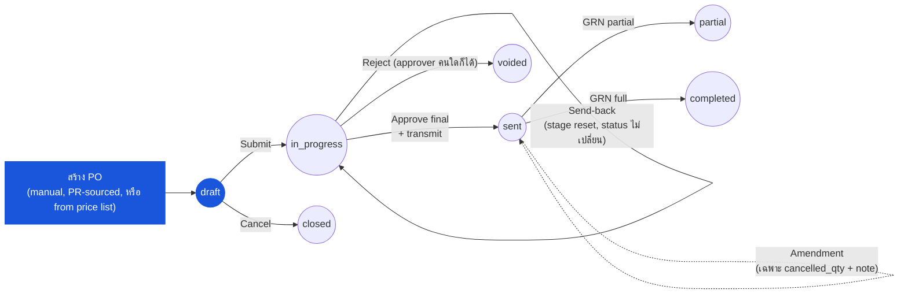

# ใบสั่งซื้อ (Purchase Order) — User Flow — Purchaser

> **At a Glance**
> **Persona:** Purchaser / Procurement Officer &nbsp;·&nbsp; **Module:** [purchase-order](/th/inventory/purchase-order) &nbsp;·&nbsp; **Workflow stages:** draft → in_progress → sent (+ amendment บน sent) &nbsp;·&nbsp; **สิทธิ์สำคัญ:** create, edit, submit, transmit, amend, bounce-back
> **Persona นี้ทำอะไร:** สร้าง PO แบบ manual หรือ PR-sourced, validate ราคาและ vendor, submit สำหรับ approval, และ transmit ให้ vendor ตอน final approve

## 1. บทบาทในโมดูลนี้

**Purchaser** (หรือเรียกอีกชื่อว่า **Procurement Officer**) เป็นเจ้าของ PO ตั้งแต่การสร้างไปจนถึงการ transmit ให้ vendor — ช่วงจาก `draft` ถึง `sent` มีเส้นทางการสร้างสามแบบ: **manual PO** (`po_type = manual`) ที่ยกขึ้นโดย procurement โดยตรง; **PR-sourced PO** (`po_type = purchase_request`) ที่ materialise โดย Convert-to-PO dialog **ภายในโมดูล Purchase Order เอง** (`po-from-pr-dialog.tsx` — dialog 2 ขั้นตอน: เลือก PR ที่อนุมัติแล้วทั้งใบหนึ่งใบหรือมากกว่า จากนั้น review PO group(s) ที่ server คำนวณไว้แล้ว) ซึ่งเขียน row หนึ่ง row ต่อคู่ (PO line, PR line) เข้าตาราง bridge `tb_purchase_order_detail_tb_purchase_request_detail` ([01-data-model.md](./01-data-model.md) Section 2.5); และ **price-list-sourced PO** (`po_type = pricelist`) ที่สร้างผ่าน wizard 4 ขั้นตอน (Order Details → Select Vendors → Select Items → Review & Confirm, `routes/procurement/purchase-order/from-price-list/`) ที่ข้าม PR stage ไปเลย เมื่อ draft มีอยู่ Purchaser กรอก (หรือ inherit และ validate) header — `vendor_id`, `currency_id`, `exchange_rate`, `credit_term_id`, `order_date`, `delivery_date`, `workflow_id` — และเดินแต่ละบรรทัดเพื่อ verify ราคาเทียบกับ [vendor-pricelist](/th/inventory/vendor-pricelist) ปรับ quantity / discount / tax / FOC ที่ได้รับอนุญาต ตั้งเงื่อนไขการส่งของและการชำระเงิน และ submit (`draft → in_progress`, `PO_AUTH_003` และ `PO_POST_002`) Purchaser ยังถือ action transmit บน final approval (`PO_AUTH_006`, `PO_POST_004` — bundle เข้ากับ approve call เดียวกัน ไม่ใช่ step แยก) จัดการ amendments บน PO ที่เปิดภายใต้ข้อจำกัด post-`sent` ของ `PO_VAL_016` และจัดการ `draft` PO ผ่าน **Cancel** (ซึ่งลงเอยที่ `closed` ไม่ใช่ `voided` — ไม่มี action "void" แยกต่างหากที่ใช้ได้ใน `draft`) Purchaser ปฏิบัติงานภายใต้ `enum_stage_role = purchase`

> ⚠️ **แก้ไขในรอบนี้:** เวอร์ชันก่อนหน้าของหน้านี้อธิบายการ conversion ว่าเป็น "Convert-to-PO workbench" ที่เข้าถึงจากคิว Approved-PRs ของโมดูล **Purchase Request** พร้อมการติ๊กเลือก PR lines ทีละบรรทัดและ converted quantities, indicator pricelist-deviation-tolerance ต่อบรรทัด, และคีย์ grouping แบบ `(vendor_id, currency_id)` เท่านั้น ทั้งหมดนี้ไม่ตรงกับ source ปัจจุบัน: dialog จริงอยู่ในโมดูล **Purchase Order**, ทำงานบน PR ที่เลือกทั้งใบ (ไม่ใช่ per-line quantities), ไม่มี per-line deviation-tolerance UI, และ group ด้วย `(vendor_id, delivery_date, currency_id)` — ยืนยันผ่าน `buildPoGroupKey` ใน `purchase-order.service.ts` Bruno ระบุ `Permissions: None` ทั้งบน `group-pr` และ `confirm-pr`; frontend dialog chain ไม่มี `hasPermission` check สิ่งนี้ตรงกับข้อเท็จจริงที่ระบุไว้แล้วในรอบ resync ก่อนหน้าของโมดูล `purchase-request`

### ตำแหน่งใน Workflow (Purchaser highlight)

```mermaid
graph LR
    create["สร้าง PO<br/>(manual, PR-sourced, หรือ from price list)"]:::current --> draft(("draft")):::current
    draft -->|"Submit"| inprog(("in_progress"))
    draft -->|"Cancel"| closed(("closed"))
    inprog -->|"Send-back<br/>(stage reset, status ไม่เปลี่ยน)"| inprog
    inprog -->|"Approve final<br/>+ transmit"| sent(("sent"))
    inprog -->|"Reject (approver คนใดก็ได้)"| voided(("voided"))
    sent -.->|"Amendment<br/>(เฉพาะ cancelled_qty + note)"| sent
    sent -->|"GRN partial"| partial(("partial"))
    sent -->|"GRN full"| completed(("completed"))
    classDef current fill:#1a56db,color:#fff,stroke:#1a56db;
```

### ตารางสิทธิ์ — Status × Action (Purchaser)

Purchaser เป็นเจ้าของเอกสารเต็มที่ใน `draft` การ send-back ทำให้ PO อยู่ที่ `in_progress` ต่อไป (เฉพาะ stage cursor reset) — ไม่กลับไปที่ `draft` หลัง `sent` สิทธิ์ในการ edit ยุบลงเหลือ `cancelled_qty` และ note ต่อบรรทัด (`PO_VAL_016`) Receipt-driven states (`partial`, `completed`, `closed`) สังเกตได้แต่ไม่ mutate โดยตรงโดย Purchaser `voided` เข้าถึงได้เฉพาะจาก `in_progress` ผ่าน reject ซึ่งทำโดย approver คนใดก็ตามที่ holds stage ปัจจุบัน — ไม่ใช่เฉพาะ Procurement Manager

| Action | draft | in_progress | sent | partial | completed | closed | voided |
|---|---|---|---|---|---|---|---|
| ดู PO | ✅ | ✅ | ✅ | ✅ | ✅ | ✅ | ✅ |
| Edit header (vendor, currency, terms) | ✅ | ❌ | ❌ | ❌ | ❌ | ❌ | ❌ |
| เพิ่ม / ลบบรรทัด | ✅ | ❌ | ❌ | ❌ | ❌ | ❌ | ❌ |
| Edit qty / price / tax / FOC บรรทัด | ✅ | ❌ | ❌ | ❌ | ❌ | ❌ | ❌ |
| Submit for approval | ✅ (≥1 บรรทัด + workflow) | ❌ | ❌ | ❌ | ❌ | ❌ | ❌ |
| Approve ที่ stage ตัวเอง (เมื่อถูก assign) | ❌ | ✅ (`PO_AUTH_011` — ไม่มี amount threshold gate สิ่งนี้) | ❌ | ❌ | ❌ | ❌ | ❌ |
| Transmit ให้ vendor | ❌ | ✅ (bundle เข้ากับ approve ที่ stage สุดท้าย, `PO_AUTH_006`) | ❌ | ❌ | ❌ | ❌ | ❌ |
| ตั้ง `cancelled_qty` / note ต่อบรรทัด (amendment) | ❌ | ❌ | ✅ (`PO_VAL_016`) | ✅ | ❌ | ❌ | ❌ |
| เพิ่ม Comment / Attachment | ✅ | ✅ | ✅ | ✅ | ✅ | ✅ | ✅ |
| Soft-delete (เฉพาะ draft) | escalate ไปยัง PM (`PO_AUTH_005`) | ❌ | ❌ | ❌ | ❌ | ❌ | ❌ |
| Cancel (→ `closed`) | ✅ | ✅ | ✅ | ❌ | ❌ | — | ❌ |
| Reject (→ `voided`, เมื่อถูก assign ให้ stage ปัจจุบัน) | ❌ | ✅ | ❌ | ❌ | ❌ | ❌ | — |
| Close (`PO_AUTH_008`) | ❌ | ✅ | ✅ | ✅ (PM / Inv Mgr) | ❌ | — | ❌ |

> ⚠️ **แก้ไขในรอบนี้:** ตารางเวอร์ชันก่อนหน้า gate การ approve ด้วย self-approval แบบ "below threshold" และสงวน "Void" ไว้เฉพาะ Procurement Manager จาก `sent`/`partial` เท่านั้น ทั้งสองแนวคิดไม่มีอยู่ใน source ปัจจุบัน — ดู [02-business-rules.md](./02-business-rules.md) § 4 note สถานะ `IN PROGRESS` เองมีอยู่จริง (ยืนยันโดย enum `enum_purchase_order_doc_status` และ badge text จริงใน e2e specs) เพียงแต่ไม่ได้ gate ด้วย amount threshold

## 2. Entry Point และ Primary Flow

**Entry point:** Sidebar → โมดูล **Purchase Order** → **Create Purchase Order** สำหรับ manual PO หรือ from-price-list PO, หรือจากภายใน Convert-to-PO dialog ของโมดูล **Purchase Order** เอง (`po-from-pr-dialog.tsx`) สำหรับ PR-sourced PO ทั้งสามเส้นทาง land Purchaser บนหน้า detail PO เดียวกันที่ `po_status = draft`

**Primary flow (happy path):**

1. เลือกเส้นทางการสร้าง สำหรับ **manual PO**: จาก PO module landing คลิก **Create Purchase Order** และกรอก header (vendor, currency, exchange rate, credit term, order และ delivery dates, workflow) บนฟอร์มเปล่า สำหรับ **PR-sourced PO**: เปิด Convert-to-PO dialog และ (ขั้นตอนที่ 1) เลือก PR ที่อนุมัติแล้วทั้งใบหนึ่งใบหรือมากกว่า; (ขั้นตอนที่ 2) review PO group(s) ที่ server คำนวณไว้แล้ว — backend group บรรทัดของ PR ที่เลือกด้วย `(vendor_id, delivery_date, currency_id)` (`buildPoGroupKey`) และคืน PO group หนึ่งกลุ่มต่อ combination ที่ไม่ซ้ำผ่าน `POST .../purchase-orders/group-pr`; การ confirm สร้าง draft PO(s) ผ่าน `POST .../purchase-orders/confirm-pr` เขียน bridge entries ด้วย `pr_detail_qty > 0` ต่อคู่ (PO line, PR line) (`PO_VAL_014`) ไม่มี per-line quantity หรือ per-line deviation UI ใน dialog นี้ — การเลือกเป็นแบบทั้ง PR และการ grouping/consolidation เกิดขึ้นฝั่ง server สำหรับ **price-list-sourced PO**: รัน wizard 4 ขั้นตอนของ from-price-list (Order Details → Select Vendors → Select Items → Review & Confirm) ซึ่งไม่มี PR ต้นน้ำเลย PR-side snapshot — product, UoM, location, delivery point — denormalise ลงบน bridge row ที่ conversion time สำหรับเส้นทาง PR-sourced
2. เปิด **draft PO** Header pre-fill จาก vendor master และ workflow ที่เลือก (manual path) หรือ inherit จาก source PR(s) (PR-sourced path) Verify `vendor_id` อ้างอิง vendor ที่ active และไม่ blacklisted (`PO_VAL_002`), `currency_id` และ `exchange_rate > 0` (`PO_VAL_003`), `credit_term_id` ตั้งเมื่อ vendor ต้องการ (`PO_VAL_005`), และ `delivery_date >= order_date` (`PO_VAL_006`) `po_no` ที่ไม่ซ้ำ generate โดย numbering service (`PO_VAL_001`)
3. เดินแต่ละ **PO line** ในแท็บ **Items** สำหรับ PR-sourced lines bridge row ขับเคลื่อน snapshot; สำหรับ manual lines Purchaser เลือกสินค้าจากแคตตาล็อก สำหรับทุกบรรทัด confirm `product_id` active (`PO_VAL_007`), `order_qty > 0` พร้อม `order_unit_id` ตั้ง (`PO_VAL_008`), และ conversion factor ไปยัง base UoM เป็นบวก (`PO_VAL_009`) FOC lines (`is_foc = true`) อนุญาตด้วย `price = 0` (`PO_VAL_010`)
4. Review ราคา **ยังไม่ยืนยันในรอบนี้:** ว่าหน้า create/edit เปิดเผย indicator pricelist-deviation หรือ tolerance band หรือไม่ ไม่ได้รับการยืนยันโดยตรงเทียบกับ component ของฟอร์ม PO ปัจจุบัน — ถือว่า tolerance percentage เฉพาะเจาะจงหรือ per-line deviation-override UI ที่อธิบายไว้ที่อื่นเป็นเพียงสิ่งที่ยังไม่ยืนยัน ไม่ใช่ข้อเท็จจริง
5. ตั้งหรือ confirm **เงื่อนไขการส่งของและการชำระเงิน** บน header Payment terms (`credit_term_id`, snapshot เป็น `credit_term`) มาจาก vendor master โดย default; Incoterm / delivery clause capture บน header และ reflect บนแต่ละ bridge row ของ `tb_purchase_order_detail` ที่ `delivery_point_id` ปรับ `delivery_date` ต่อบรรทัดหากต้องการ staggered schedule Tax profile และ discount rate validate เทียบกับ `PO_VAL_010` และ `PO_VAL_011`
6. ดูยอดรวม header คำนวณใหม่ Line subtotal, discount, net, tax, และ total คำนวณตาม `PO_CALC_001`–`PO_CALC_005`; base-currency dual-posting ใช้ `exchange_rate` ที่ lock ผ่าน `PO_CALC_006`; FOC lines flow quantity แต่เงินเป็นศูนย์ตาม `PO_CALC_007`; header roll up `total_price`, `total_tax`, `total_amount`, และ `total_qty` ตาม `PO_CALC_008`–`PO_CALC_011`; การปัดเศษทั้งหมดใช้ half-up ผ่าน `PO_CALC_012`
7. เปิดแท็บ **Attachments** และ **Comments** และแนบเอกสาร supporting (vendor quote, internal memo) หรือ note สำหรับ approver chain Activity log บันทึกทุก save event รวมถึงการเปลี่ยนแปลง header และบรรทัดผ่าน `tb_purchase_order_comment` และ `tb_purchase_order_detail_comment`
8. รัน submit-time check PO ต้องมีอย่างน้อยหนึ่งบรรทัดที่ไม่ soft-deleted (`PO_VAL_012`) ทุกบรรทัดต้องใช้ `vendor_id` และ `currency_id` ของ header เดียวกัน (invariant single-vendor / single-currency, `PO_VAL_013`) และ PR-sourced lines ต้องบรรจุ bridge row (`PO_VAL_014`)
9. คลิก **Submit for approval** (`PO_AUTH_003`, `PO_POST_002`) `po_status` transition `draft → in_progress`, `last_action = submitted`, `workflow_current_stage` advance ไปยัง stage approval แรก และ `user_action.execute` populate จาก workflow definition Handoff ไปยัง user(s) ใดก็ตามที่ stage แรกของ workflow assign — workflow ที่มี stage เดียวอาจ assign stage ของ Purchaser เอง ทำให้ user คนเดียวกัน submit และ approve ในภายหลังได้; ไม่มี amount-threshold gate
10. บน final approval (`in_progress → sent`, `PO_POST_004`) approve call เดียวกัน transmit PO ในขั้นตอนเดียว — ไม่มี action "Send to Vendor" แบบ manual แยกต่างหาก ระบบตั้ง `tb_purchase_order.email` และ `approval_date` และ channel (email / EDI / vendor portal) fire ตาม tenant configuration `po_status` ตอนนี้เป็น `sent` และ PO เป็น firm, vendor-facing commitment
11. Track PO บน dashboard **Open POs** Purchaser follow up เรื่อง delays และดู GRN postings (driven โดยโมดูล [good-receive-note](/th/inventory/good-receive-note)) flip `po_status` จาก `sent` เป็น `partial` และในที่สุดเป็น `completed` ผ่าน `PO_POST_006` และ `PO_POST_007` `received_qty` ต่อบรรทัดและ bridge `received_qty` columns update บนแต่ละ GRN post **ยังไม่ยืนยัน:** ว่าระบบ capture vendor-acknowledgement event แยกต่างหากหรือไม่ ยังไม่ได้รับการยืนยันในรอบนี้
12. จัดการ amendment requests post-`sent` ใด ๆ ตาม `PO_VAL_016` เฉพาะ `cancelled_qty` และ note ต่อบรรทัดเท่านั้นที่ update ได้หลัง `sent` — การเปลี่ยน vendor / currency / line ที่ material ต้อง void open balance และออก PO ใหม่ Purchaser เขียน comment สำหรับทุก amendment เพื่อให้ activity log เก็บประวัติการเปลี่ยนแปลง

## 3. Decision Branches

- **หาก manual-PO line ไม่มี vendor allocation หรือไม่รู้จัก pricelist match**: บรรทัดไม่สามารถผ่าน `PO_VAL_002` / `PO_VAL_007` จนกว่าจะตั้ง vendor + product + price ที่ถูกต้อง Purchaser เปิด pickers ของ vendor และ product เลือก combination ที่ถูกต้อง และระบบเขียน vendor และ pricelist context ที่ snapshot ลงบนบรรทัด Manual POs ไม่ต้องการ bridge row (`PO_VAL_014` ใช้เฉพาะเมื่อ `po_type = purchase_request`)
- **หากเฉพาะบาง approved PR ที่ควร convert ตอนนี้**: Convert-to-PO dialog เลือก PR ทั้งใบ ไม่ใช่บรรทัดเดี่ยว ๆ หรือ partial quantities — ไม่มีการติ๊กเลือกทีละบรรทัดหรือ control convert-quantity ใน dialog ปัจจุบัน การเลือกเพียงบางส่วนของ approved PRs ในขั้นตอนที่ 1 ปล่อยให้ PR ที่ไม่ได้เลือกคงอยู่สำหรับรอบ conversion ถัดไป; บรรทัดของ PR ที่เลือกครบทั้งใบทั้งหมดจะไหลเข้า grouped PO(s) ที่คำนวณไว้ในขั้นตอนที่ 2
- **หาก amendment จำเป็นหลัง `po_status = sent`** (price correction, quantity reduction, delivery-date shift ที่ตกลงกับ vendor): ตาม `PO_VAL_016` เฉพาะ `cancelled_qty` และ note ต่อบรรทัดเท่านั้นที่ update ได้ post-`sent` สำหรับ quantity reduction Purchaser เขียน remainder ที่ตกลงเป็น `cancelled_qty` เพื่อให้ `received_qty + cancelled_qty = order_qty` สำหรับบรรทัดที่ได้รับผลกระทบ จากนั้น log amendment ใน `tb_purchase_order_comment` สำหรับ material change (price ต่าง, product ต่าง, vendor ต่าง) PO ถูกจบผ่าน **Cancel** (`draft`/`in_progress`/`sent → closed`) และยก PO ใหม่ — ไม่มี action "void" แยกต่างหากสำหรับ PO ที่ `sent`
- **หาก Purchaser ต้องการจบ `draft` PO** (ยกขึ้นโดยผิดพลาด, requirement เปลี่ยนก่อน submission): **Cancel** ใช้ได้ที่ `draft` (เช่นเดียวกับที่ `in_progress` และ `sent`) และลงเอยที่ `closed` ไม่ใช่ `voided` — ไม่มี void action แยกต่างหากที่เข้าถึงได้จาก `draft` Soft-delete-in-draft สงวนไว้ให้ Procurement Manager (`PO_AUTH_005`) เส้นทางเดียวสู่ `voided` คือ reject แบบตรงและ terminal `in_progress → voided` โดย approver คนใดก็ตามที่ holds stage ปัจจุบัน

## 4. Exit Point / Handoffs

การมีส่วนร่วมของ Purchaser บน PO ที่กำหนดจบที่หนึ่งในจุดที่ documented ต่อไปนี้; document state ที่แต่ละ handoff anchor ที่ค่า `enum_purchase_order_doc_status` ณ ตอน transfer

- **Standard submit → approval** — Purchaser submit PO และ `po_status` transition `draft → in_progress` (`PO_AUTH_003`, `PO_POST_002`) Handoff ไปยัง user(s) ใดก็ตามที่ stage แรกของ workflow assign ความรับผิดชอบของ Purchaser resume หาก approver ส่ง PO กลับ — การนี้ทำให้ `po_status = in_progress` คงเดิมและเพียง reset `workflow_current_stage` (`PO_POST_005`); ไม่กลับ PO ไปที่ `draft`
- **Final approval → transmit ให้ vendor** — บน final-stage approval (`in_progress → sent`, `PO_POST_004`) call เดียวกันส่ง PO ให้ **Vendor** ผ่าน email / EDI / portal ภายใต้ `PO_AUTH_006` — ไม่มี manual transmit step แยกต่างหาก Handoff ไปยัง Vendor; document state ที่ handoff คือ `sent`
- **Amendment loop** — เมื่อ request ที่จะ amend `sent` PO เข้ามา Purchaser re-enter flow ที่ขั้นตอน edit ภายใต้ข้อจำกัดของ `PO_VAL_016` (เฉพาะ `cancelled_qty` และ note ต่อบรรทัดที่ mutable หลัง `sent`) Material changes จัดการโดยการ cancel PO (`sent → closed`) และยกใบใหม่; minor changes (quantity short-supply, note) จัดการ inline โดย Purchaser และ log ใน `tb_purchase_order_comment`
- **Cancel / จบ PO** — Purchaser (หรือ user ใดก็ตามที่มีสิทธิ์เข้าถึง; ไม่มี role restriction ที่ยืนยันได้นอกเหนือจาก generic PO permission) สามารถ Cancel PO ที่ `draft`, `in_progress`, หรือ `sent` ลงเอยที่ `closed` พร้อม remainder เขียนเป็น `cancelled_qty` เส้นทางเดียวสู่ status `voided` ที่แยกต่างหากคือ reject แบบตรงและ terminal จาก `in_progress` โดย approver คนใดก็ตามที่ holds stage ปัจจุบัน — ไม่มี step "escalate ไปยัง Procurement Manager สำหรับ void" สำหรับ PO ที่ `draft`, `sent`, หรือ `partial`

Transitions ที่ driven โดย receipt (`sent → partial → completed` ผ่าน `PO_POST_006`/`PO_POST_007` และ `{sent, partial, in_progress} → closed` ผ่าน `PO_POST_011`) ไม่ใช่ action ของ Purchaser — driven โดย **Receiver** ผ่าน GRN posting และสำหรับ early closure โดย Inventory Manager (`PO_AUTH_008`) Purchaser monitor transitions เหล่านี้บน Open POs dashboard แต่ไม่ trigger โดยตรง

## 5. แหล่งอ้างอิง

- ภาพรวม parent: [03-user-flow.md](./03-user-flow.md) — global PO state machine และตาราง cross-persona handoff
- ตาราง Bridge: [01-data-model.md](./01-data-model.md) Section 2.5 — `tb_purchase_order_detail_tb_purchase_request_detail` (linkage PO↔PR line many-to-many ที่รองรับ PR consolidation และ partial conversion)
- กฎ Validation: [02-business-rules.md](./02-business-rules.md) Section 2 — `PO_VAL_001`–`PO_VAL_016` (header, line, และ submit-time checks ที่อ้างอิงตลอด flow นี้)
- กฎการคำนวณ: [02-business-rules.md](./02-business-rules.md) Section 3 — `PO_CALC_001`–`PO_CALC_012` (line และ header roll-ups, FOC handling, base-currency dual-posting, rounding)
- กฎ Authorization: [02-business-rules.md](./02-business-rules.md) Section 4 — `PO_AUTH_001`–`PO_AUTH_003` (Purchaser create/edit/submit), `PO_AUTH_006` (transmit to vendor), `PO_AUTH_007` (reject, corrected)
- กฎ Posting: [02-business-rules.md](./02-business-rules.md) Section 5 — `PO_POST_002` (submit), `PO_POST_004` (final approval และ transmit), `PO_POST_005` (send-back, corrected), `PO_POST_006` / `PO_POST_007` (receipt-driven transitions), `PO_POST_010`/`PO_POST_010b` (cancel / reject, corrected)
- `../carmen/docs/purchase-order-management/purchase-order-module.md` — แหล่ง carmen/docs หลักสำหรับ business analysis โมดูล PO; ถือ state diagram และข้อกล่าวอ้าง RBAC/threshold ของมันเป็น historical design intent ไม่ใช่ verified behavior ปัจจุบัน
- Sibling: [03-user-flow-procurement-manager.md](./03-user-flow-procurement-manager.md) — generic approver mechanism เดียวกันที่ stage ใดก็ตามที่ workflow assign
- Sibling: [03-user-flow-vendor.md](./03-user-flow-vendor.md) — ฝ่ายภายนอกปลายน้ำที่รับ PO ที่ transmit ที่ `po_status = sent`
- เกี่ยวข้อง: [purchase-request](/th/inventory/purchase-request) — โมดูล upstream; PR-to-PO conversion ผ่านตาราง bridge
- เกี่ยวข้อง: [vendor-pricelist](/th/inventory/vendor-pricelist) — pricing lookup ที่ใช้ที่ conversion / creation time
- เกี่ยวข้อง: [good-receive-note](/th/inventory/good-receive-note) — fulfilment ปลายน้ำที่ขับเคลื่อน receipt transitions `sent → partial → completed` ที่ Purchaser monitor
