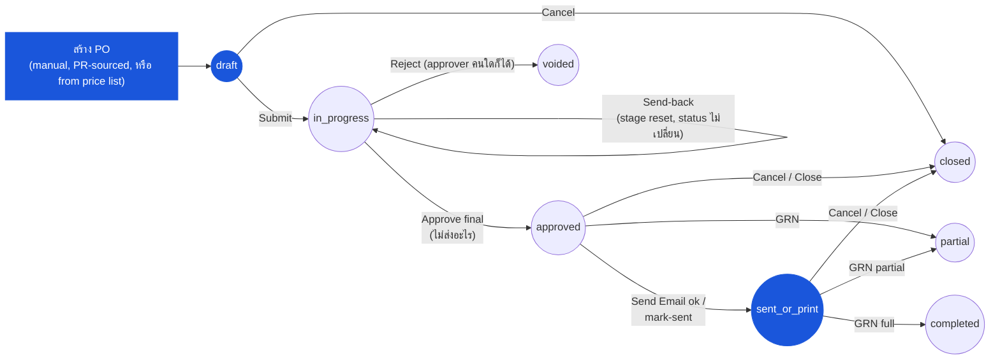

# ใบสั่งซื้อ (Purchase Order) — User Flow — Purchaser

> **At a Glance**
> **Persona:** Purchaser / Procurement Officer &nbsp;·&nbsp; **Module:** [purchase-order](/th/inventory/purchase-order) &nbsp;·&nbsp; **Workflow stages:** draft → in_progress → approved → sent_or_print (Send Email) &nbsp;·&nbsp; **สิทธิ์สำคัญ:** create, edit, submit, send email, cancel, ลบ draft ของตัวเอง
> **Persona นี้ทำอะไร:** สร้าง PO แบบ manual, PR-sourced หรือ price-list, validate ราคาและ vendor, submit สำหรับ approval, และ — เมื่อ PO เป็น `approved` แล้ว — ส่งอีเมลให้ vendor ซึ่งเป็นขั้นตอนที่ย้ายมันไป `sent_or_print` Re-sync 2026-09-22

## 1. บทบาทในโมดูลนี้

**Purchaser** (หรือเรียกอีกชื่อว่า **Procurement Officer**) เป็นเจ้าของ PO ตั้งแต่การสร้างไปจนถึงการส่งให้ vendor — ช่วงจาก `draft` ถึง `sent_or_print` มีเส้นทางการสร้างสามแบบ ทั้งหมดเข้าถึงจาก dialog **Create Purchase Order** (`po-create-dialog.tsx`): **manual PO** (`po_type = manual`, `/procurement/purchase-order/new`) ที่ยกขึ้นโดย procurement โดยตรง; **PR-sourced PO** (`po_type = purchase_request`) ที่ materialise โดยหน้า **From PR** 3 ขั้นตอน `/procurement/purchase-order/from-pr` (`step-select-pr.tsx` — เลือก PR ที่อนุมัติแล้วทั้งใบหนึ่งใบหรือมากกว่า; `step-review-group.tsx` — review PO group(s) ที่ server คำนวณผ่าน `group-pr`; `step-result.tsx` — PO ที่สร้างแล้วหลัง `confirm-pr`) ซึ่งเขียน row หนึ่ง row ต่อคู่ (PO line, PR line) เข้าตาราง bridge `tb_purchase_order_detail_tb_purchase_request_detail` ([01-data-model.md](./01-data-model.md) Section 2.3); และ **price-list-sourced PO** (`po_type = pricelist`) ที่สร้างผ่าน wizard 4 ขั้นตอน (Order Details → Select Vendors → Select Items → Review & Confirm, `routes/procurement/purchase-order/from-price-list/`) ที่ข้าม PR stage ไปเลย เมื่อ draft มีอยู่ Purchaser กรอก (หรือ inherit และ validate) header — `vendor_id`, `currency_id`, `exchange_rate`, `credit_term_id`, `order_date`, `delivery_date`, `delivery_point_id` (ระดับ header ตั้งแต่ 2026-09-15), `workflow_id` — และเดินแต่ละบรรทัด (สินค้าหนึ่งตัว **ต่อ delivery location** — สินค้าที่ไปสองร้านคือสองบรรทัด) เพื่อ verify ราคาเทียบกับ [vendor-pricelist](/th/inventory/vendor-pricelist) ปรับ quantity / discount / tax / FOC ที่ได้รับอนุญาต และ submit (`draft → in_progress`, `PO_AUTH_003` และ `PO_POST_002`) การอนุมัติจบที่ `approved` (`PO_POST_004`); จากนั้น Purchaser เปิด **Send Email** บน header (`po-send-email-dialog.tsx`, `use-po-send-email.ts`) เพื่อส่งอีเมล PO — พร้อม PDF แบบ optional — ให้ vendor ซึ่งเป็นสิ่งที่ย้ายมันไป `sent_or_print` (`PO_AUTH_006`, `PO_POST_004b`) Purchaser ยังถือ **Cancel** บน PO ที่ `draft` / `in_progress` / `approved` / `sent_or_print` (ลงเอยที่ `closed` ไม่ใช่ `voided`) และ **Delete** draft ที่ตัวเองสร้างได้ (`PO_AUTH_005` — เจ้าของหรือ super-admin) Purchaser ปฏิบัติงานภายใต้ `enum_stage_role = purchase` / `create`

> ⚠️ **แก้ไข 2026-09-22:** เวอร์ชันก่อนหน้ารวม "transmit ให้ vendor" เข้ากับ approve call ขั้นสุดท้าย ที่ HEAD การอนุมัติขั้นสุดท้ายลงที่ `approved` และการส่งเป็น action **Send Email** แยกต่างหาก (หรือ `mark-sent` แบบ API-only) การแก้ไขก่อนหน้ายังคงอยู่: การ conversion อยู่ในโมดูล **Purchase Order** (ตอนนี้เป็นหน้า `/procurement/purchase-order/from-pr` ไม่ใช่ dialog), ทำงานบน PR ที่เลือกทั้งใบ (ไม่ใช่ per-line quantities), ไม่มี per-line deviation-tolerance UI, และ group ด้วย `(vendor_id, delivery_date, currency_id)` — `buildPoGroupKey` ใน `purchase-order.service.ts` backend ยังรับ override `delivery_date` / `delivery_point_id` / `note` บน `group-pr` / `confirm-pr` เพิ่มด้วย (2026-09-15) แต่หน้า React ยังไม่ส่งมัน Bruno ระบุ `Permissions: None` ทั้งสอง endpoint; หน้านี้ไม่มี `hasPermission` check

### ตำแหน่งใน Workflow (Purchaser highlight)

```mermaid
graph LR
    create["สร้าง PO<br/>(manual, PR-sourced, หรือ from price list)"]:::current --> draft(("draft")):::current
    draft -->|"Submit"| inprog(("in_progress"))
    draft -->|"Cancel"| closed(("closed"))
    inprog -->|"Send-back<br/>(stage reset, status ไม่เปลี่ยน)"| inprog
    inprog -->|"Approve final<br/>(ไม่ส่งอะไร)"| approved(("approved"))
    inprog -->|"Reject (approver คนใดก็ได้)"| voided(("voided"))
    approved -->|"Send Email ok /<br/>mark-sent"| sent(("sent_or_print")):::current
    approved -->|"Cancel / Close"| closed
    sent -->|"Cancel / Close"| closed
    approved -->|"GRN"| partial(("partial"))
    sent -->|"GRN partial"| partial
    sent -->|"GRN full"| completed(("completed"))
    classDef current fill:#1a56db,color:#fff,stroke:#1a56db;
```

### ตารางสิทธิ์ — Status × Action (Purchaser)

Purchaser เป็นเจ้าของเอกสารเต็มที่ใน `draft` การ send-back ทำให้ PO อยู่ที่ `in_progress` ต่อไป (เฉพาะ stage cursor reset) — ไม่กลับไปที่ `draft`; การ submit ซ้ำทำได้เพราะ `submit()` รับ `in_progress + last_action = reviewed` ตั้งแต่ `approved` เป็นต้นไป header และบรรทัดเป็น read-only; เครื่องมือที่เหลือของ Purchaser คือ **Send Email**, **Cancel**, **Close**, และ comment Receipt-driven states (`partial`, `completed`) สังเกตได้แต่ไม่ mutate โดยตรงโดย Purchaser `voided` เข้าถึงได้เฉพาะจาก `in_progress` ผ่าน reject ซึ่งทำโดย approver คนใดก็ตามที่ holds stage ปัจจุบัน — ไม่ใช่เฉพาะ Procurement Manager

| Action | draft | in_progress | approved | sent_or_print | partial | completed | closed | voided |
|---|---|---|---|---|---|---|---|---|
| ดู PO | ✅ | ✅ | ✅ | ✅ | ✅ | ✅ | ✅ | ✅ |
| Edit header (vendor, currency, terms, delivery point) | ✅ | ❌ | ❌ | ❌ | ❌ | ❌ | ❌ | ❌ |
| เพิ่ม / ลบบรรทัด (หนึ่ง location ต่อบรรทัด) | ✅ | ❌ | ❌ | ❌ | ❌ | ❌ | ❌ | ❌ |
| Edit qty / price / tax / FOC บรรทัด | ✅ | ❌ | ❌ | ❌ | ❌ | ❌ | ❌ | ❌ |
| Dry-run กฎ (`POST /verify`) | ✅ | ✅ | — | — | — | — | — | — |
| Submit for approval | ✅ (≥1 บรรทัด + workflow) | ✅ เฉพาะหลังถูก send-back (`last_action = reviewed`) | ❌ | ❌ | ❌ | ❌ | ❌ | ❌ |
| Approve ที่ stage ตัวเอง (เมื่อถูก assign) | ❌ | ✅ (`PO_AUTH_011` — authorization เองไม่ถูก gate ด้วย amount แม้ว่า stage ที่เป็นอยู่นั้นอาจถูก gate ด้วยได้ผ่าน workflow `routing_rules`) | ❌ | ❌ | ❌ | ❌ | ❌ | ❌ |
| Send Email ให้ vendor (`PO_AUTH_006`) | ❌ | ❌ | ✅ (→ `sent_or_print`) | ✅ (ส่งซ้ำ, log เท่านั้น) | ✅ | ✅ | ✅ | ❌ |
| Mark sent (API เท่านั้น) | ❌ | ❌ | ✅ | ❌ | ❌ | ❌ | ❌ | ❌ |
| เพิ่ม Comment / Attachment | ✅ | ✅ | ✅ | ✅ | ✅ | ✅ | ✅ | ✅ |
| Soft-delete (`PO_AUTH_005`) | ✅ ถ้าเป็นเจ้าของ (หรือ super-admin) | ❌ | ❌ | ❌ | ❌ | ❌ | ❌ | ❌ |
| Cancel (→ `closed`) | ✅ | ✅ | ✅ | ✅ | ❌ | ❌ | — | ❌ |
| Reject (→ `voided`, เมื่อถูก assign ให้ stage ปัจจุบัน) | ❌ | ✅ | ❌ | ❌ | ❌ | ❌ | ❌ | — |
| Close (`PO_AUTH_008`) | ❌ | ✅ | ✅ | ✅ | ✅ | ❌ | — | ❌ |

> ⚠️ **แก้ไข 2026-09-22:** ตารางเวอร์ชันก่อนหน้ามีแถว "ตั้ง `cancelled_qty` / note ต่อบรรทัด (amendment)" สำหรับ `sent` / `partial` — ไม่มี endpoint amendment ต่อบรรทัดแบบนั้น; หลัง `approved` ทางเดียวที่ `cancelled_qty` เปลี่ยนคือ Cancel หรือ Close เขียนส่วนที่เหลือทั้งหมด (`PO_POST_010`/`011`) ตารางยังระบุ soft-delete ว่า "escalate ไปยัง PM" — `remove()` เช็คความเป็นเจ้าของเอกสาร ไม่ใช่ role ของ Manager การแก้ไขก่อนหน้ายังคงอยู่: ไม่มี self-approval amount gate ไม่มี void ที่สงวนเฉพาะ Manager; *ใคร* อนุมัติที่ stage หนึ่งได้เป็น membership ใน `user_action.execute[]` ล้วน ๆ ในขณะที่ *stage ไหน* ที่ PO มาถึงอาจถูก route ด้วย amount ผ่าน `routing_rules` ของ workflow (`PO_AUTH_004`)

## 2. Entry Point และ Primary Flow

**Entry point:** Sidebar → โมดูล **Purchase Order** → **Create Purchase Order** (`po-create-dialog.tsx`) → **Blank PO** (`/procurement/purchase-order/new`), **From PR** (`/procurement/purchase-order/from-pr`), หรือ **From Price List** (`/procurement/purchase-order/from-price-list`) ทั้งสามเส้นทาง land Purchaser บนหน้า detail PO เดียวกันที่ `po_status = draft` หน้า list default เรียงตาม order date และโหลดเฉพาะแท็บที่ active (`b121e014`, `14c0c702`)

**Primary flow (happy path):**

1. เลือกเส้นทางการสร้าง สำหรับ **manual PO**: เลือก **Blank PO** และกรอก header (vendor, currency, exchange rate, credit term, order และ delivery dates, delivery point, workflow) บนฟอร์มเปล่า; vendor picker ค้นหาแบบ on demand แทนการโหลดทะเบียนทั้ง BU (`05ba31b8`) สำหรับ **PR-sourced PO**: เปิด **From PR** และ (ขั้นตอนที่ 1) เลือก PR ที่อนุมัติแล้วทั้งใบหนึ่งใบหรือมากกว่า; (ขั้นตอนที่ 2) review PO group(s) ที่ server คำนวณไว้แล้ว — backend group บรรทัดของ PR ที่เลือกด้วย `(vendor_id, delivery_date, currency_id)` (`buildPoGroupKey`) และคืน PO group หนึ่งกลุ่มต่อ combination ที่ไม่ซ้ำผ่าน `POST .../purchase-orders/group-pr` (`delivery_date` คืนเป็น ISO, `0325e5c25`); การ confirm สร้าง draft PO(s) ผ่าน `POST .../purchase-orders/confirm-pr` (ขั้นตอนที่ 3 แสดงรายการ) เขียน bridge entries ด้วย `pr_detail_qty > 0` และ `pr_detail_foc_qty` ต่อคู่ (PO line, PR line) (`PO_VAL_014`) ไม่มี per-line quantity หรือ per-line deviation UI บนหน้านี้ — การเลือกเป็นแบบทั้ง PR และการ grouping/consolidation เกิดขึ้นฝั่ง server backend ยังรับ override `delivery_date` / `delivery_point_id` / `note` บนทั้งสอง call (วันที่ที่ส่งมาจะรวม PR ที่เดิมจะแยกตามวันที่) แต่หน้า React ยังไม่เปิดให้ใช้ สำหรับ **price-list-sourced PO**: รัน wizard 4 ขั้นตอนของ from-price-list (Order Details → Select Vendors → Select Items → Review & Confirm) ซึ่งไม่มี PR ต้นน้ำเลย PR-side snapshot — product, UoM, location, delivery point — denormalise ลงบน bridge row ที่ conversion time สำหรับเส้นทาง PR-sourced
2. เปิด **draft PO** Header pre-fill จาก vendor master และ workflow ที่เลือก (manual path) หรือ inherit จาก source PR(s) (PR-sourced path) Verify `vendor_id` อ้างอิง vendor ที่ active และไม่ blacklisted (`PO_VAL_002`), `currency_id` และ `exchange_rate > 0` (`PO_VAL_003`), `credit_term_id` ตั้งเมื่อ vendor ต้องการ (`PO_VAL_005`), และ `delivery_date >= order_date` (`PO_VAL_006`) `po_no` ที่ไม่ซ้ำ generate โดย numbering service (`PO_VAL_001`)
3. เดินแต่ละ **PO line** ในแท็บ **Items** แต่ละแถวคือสินค้าหนึ่งตัวสำหรับ delivery location เดียว (`PO_VAL_019`) — cell ของ location อยู่บนแถวเอง (`po-item-cells/location-cell.tsx`) ไม่ใช่ breakdown ซ้อน สำหรับ PR-sourced lines bridge row ขับเคลื่อน snapshot และปุ่ม **view source PR** เปิด PR ต้นทาง (`pr-source-button.tsx`); สำหรับ manual lines Purchaser เลือกสินค้าจากแคตตาล็อก สำหรับทุกบรรทัด confirm `product_id` active (`PO_VAL_007`), `order_qty > 0` พร้อม `order_unit_id` ตั้ง (`PO_VAL_008`), conversion factor ไปยัง base UoM เป็นบวก (`PO_VAL_009`), และ discount / tax ไม่เกินมูลค่าบรรทัด (`PO_VAL_017`) FOC lines (`is_foc = true`) อนุญาตด้วย `price = 0` (`PO_VAL_010`); `foc_qty` กรอกต่อแถว ปุ่ม **history** ต่อแถวเปิด `GET .../purchase-orders/detail/:detail_id/history` ปุ่ม **Save** บน draft ไม่บังคับให้กรอกทุกฟิลด์อีกต่อไป (`a848865f`, 2026-09-21); ใช้ **Verify** (`POST /verify`, `PO_VAL_018`) เพื่อดูปัญหาค้างทั้งหมดในครั้งเดียวก่อน submit
4. Review ราคา **ยังไม่ยืนยันในรอบนี้:** ว่าหน้า create/edit เปิดเผย indicator pricelist-deviation หรือ tolerance band หรือไม่ ไม่ได้รับการยืนยันโดยตรงเทียบกับ component ของฟอร์ม PO ปัจจุบัน — ถือว่า tolerance percentage เฉพาะเจาะจงหรือ per-line deviation-override UI ที่อธิบายไว้ที่อื่นเป็นเพียงสิ่งที่ยังไม่ยืนยัน ไม่ใช่ข้อเท็จจริง
5. ตั้งหรือ confirm **เงื่อนไขการส่งของและการชำระเงิน** บน header Payment terms (`credit_term_id`, snapshot เป็น `credit_term_name` / `credit_term_value`) มาจาก vendor master โดย default; `delivery_point_id` ของ header (ใหม่ 2026-09-15) บอกว่าทั้งใบสั่งไปที่ไหน ในขณะที่แต่ละ bridge row เก็บ `delivery_point_id` ของ PR line ต้นทางไว้เอง ไม่มี `delivery_date` ต่อบรรทัด — วันที่อยู่ระดับ header และ staggered schedule หมายถึง PO แยกใบ (ซึ่งคือสิ่งที่การ group ด้วย `(vendor, delivery_date, currency)` ผลิตออกมาพอดี) Tax profile และ discount rate validate เทียบกับ `PO_VAL_010`, `PO_VAL_011` และ `PO_VAL_017`
6. ดูยอดรวม header คำนวณใหม่ Line subtotal, discount, net, tax, และ total คำนวณตาม `PO_CALC_001`–`PO_CALC_005`; base-currency dual-posting ใช้ `exchange_rate` ที่ lock ผ่าน `PO_CALC_006`; FOC lines flow quantity แต่เงินเป็นศูนย์ตาม `PO_CALC_007`; header roll up `total_price`, `total_tax`, `total_amount`, และ `total_qty` ตาม `PO_CALC_008`–`PO_CALC_011`; การปัดเศษทั้งหมดใช้ half-up ผ่าน `PO_CALC_012`
7. เปิดแท็บ **Attachments** และ **Comments** และแนบเอกสาร supporting (vendor quote, internal memo) หรือ note สำหรับ approver chain Activity log บันทึกทุก save event รวมถึงการเปลี่ยนแปลง header และบรรทัดผ่าน `tb_purchase_order_comment` และ `tb_purchase_order_detail_comment`
8. รัน submit-time check PO ต้องมีอย่างน้อยหนึ่งบรรทัดที่ไม่ soft-deleted (`PO_VAL_012`) ทุกบรรทัดต้องใช้ `vendor_id` และ `currency_id` ของ header เดียวกัน (invariant single-vendor / single-currency, `PO_VAL_013`) และ PR-sourced lines ต้องบรรจุ bridge row (`PO_VAL_014`)
9. คลิก **Submit** (`PO_AUTH_003`, `PO_POST_002`) `po_status` transition `draft → in_progress`, `last_action = submitted`, `workflow_current_stage` advance ไปยัง stage approval แรก และ `user_action.execute` populate จาก workflow definition; `po_no` ยังคงเป็นเลขที่กำหนดตอนสร้าง Handoff ไปยัง user(s) ใดก็ตามที่ stage แรกของ workflow assign — workflow ที่มี stage เดียวอาจ assign stage ของ Purchaser เอง ทำให้ user คนเดียวกัน submit และ approve ในภายหลังได้; authorization ในการดำเนินการที่ stage นั้นไม่ถูก gate ด้วย amount (เป็น membership ใน `user_action.execute[]` ล้วน ๆ) แม้ว่า `routing_rules` ของ workflow ที่ assign ให้อาจ route stage *ถัดไป* ตาม `total_amount` เองได้ (`PO_AUTH_004`) PO ใหม่ที่ยังไม่เคย save สามารถ submit ได้โดยตรง — ฟอร์มสร้างก่อนแล้วจึง submit (`po-footer-action.tsx`)
10. บน final approval (`in_progress → approved`, `PO_POST_004`) workflow เสร็จสิ้นและ `approval_date` ถูกตั้ง — **ยังไม่มีการส่งอะไร** header ของ PO ตอนนี้แสดง **Send Email** (และ **Close** / **Cancel**) Purchaser เปิด dialog Send Email (`po-send-email-dialog.tsx`) เลือก BU email profile, ผู้รับ, หัวข้อและเนื้อหา (PO template ที่ seed ไว้ ทั้ง EN + TH) ติ๊ก **attach PDF** แบบ optional (render ฝั่งเซิร์ฟเวอร์โดย micro-report) แล้วส่ง (`POST .../purchase-orders/:id/send-email`) เมื่อ SMTP hand-off สำเร็จ `po_status` ย้าย `approved → sent_or_print` (`PO_POST_004b`) และ entry `email_sent` ใน `tb_activity` บันทึกความพยายามนั้น; รายชื่อผู้รับที่ถูกปฏิเสธคืนกลับเป็น `{ sent: false, rejected[] }` พร้อม HTTP 200 และ status ไม่ย้าย PO ที่ส่งมอบด้วยการพิมพ์ แฟกซ์ หรือโทร บันทึกด้วย `POST .../purchase-orders/:id/mark-sent` (API เท่านั้นในวันนี้) PO ตอนนี้เป็น firm, vendor-facing commitment
11. Track PO บนหน้า list Purchaser follow up เรื่อง delays และดู GRN postings (driven โดยโมดูล [good-receive-note](/th/inventory/good-receive-note)) flip `po_status` เป็น `partial` และในที่สุดเป็น `completed` ผ่าน `PO_POST_006` และ `PO_POST_007` — สังเกตว่า GRN อาจ post กับ PO ที่ `approved` ก่อนอีเมลถูกส่งออก บนหน้า detail แต่ละบรรทัดที่รับแล้วแสดงเลข GRN และปริมาณที่รับ / FOC ที่รับ ใต้คอลัมน์ Order / GRN และ FOC / GRN (เฉพาะโหมดอ่าน, `b1e578f2`, `90a7ecd4`) **ยังไม่ยืนยัน:** ว่าระบบ capture vendor-acknowledgement event แยกต่างหากหรือไม่ ยังไม่ได้รับการยืนยันในรอบนี้
12. จัดการคำขอเปลี่ยนแปลงหลังอนุมัติใด ๆ ไม่มีอะไรบน header หรือบรรทัดที่แก้ไขได้หลัง `approved` (`PO_VAL_016`); ปริมาณเดียวที่ยังเปลี่ยนได้คือส่วนที่เหลือที่ **Cancel** หรือ **Close** เขียนลง `cancelled_qty` การลดปริมาณที่ตกลงกับ vendor จึงบันทึกโดยการ close PO เมื่อรับปริมาณที่ลดแล้วเข้ามา และการเปลี่ยนแปลงที่ material (ราคา สินค้า vendor) โดยการ cancel แล้วยก PO ใหม่ Purchaser เขียน comment สำหรับทุกการตัดสินใจเช่นนี้เพื่อให้ activity log เก็บประวัติการเปลี่ยนแปลง

## 3. Decision Branches

- **หาก manual-PO line ไม่มี vendor allocation หรือไม่รู้จัก pricelist match**: บรรทัดไม่สามารถผ่าน `PO_VAL_002` / `PO_VAL_007` จนกว่าจะตั้ง vendor + product + price ที่ถูกต้อง Purchaser เปิด pickers ของ vendor และ product เลือก combination ที่ถูกต้อง และระบบเขียน vendor และ pricelist context ที่ snapshot ลงบนบรรทัด Manual POs ไม่ต้องการ bridge row (`PO_VAL_014` ใช้เฉพาะเมื่อ `po_type = purchase_request`)
- **หากเฉพาะบาง approved PR ที่ควร convert ตอนนี้**: Convert-to-PO dialog เลือก PR ทั้งใบ ไม่ใช่บรรทัดเดี่ยว ๆ หรือ partial quantities — ไม่มีการติ๊กเลือกทีละบรรทัดหรือ control convert-quantity ใน dialog ปัจจุบัน การเลือกเพียงบางส่วนของ approved PRs ในขั้นตอนที่ 1 ปล่อยให้ PR ที่ไม่ได้เลือกคงอยู่สำหรับรอบ conversion ถัดไป; บรรทัดของ PR ที่เลือกครบทั้งใบทั้งหมดจะไหลเข้า grouped PO(s) ที่คำนวณไว้ในขั้นตอนที่ 2
- **หากต้องเปลี่ยนแปลงหลัง `po_status ∈ {approved, sent_or_print}`** (price correction, quantity reduction, delivery-date shift ที่ตกลงกับ vendor): ตาม `PO_VAL_016` ไม่มี field ของ header หรือบรรทัดที่แก้ไขได้ สำหรับ quantity reduction ให้รับของตามที่ vendor จะส่งจริงแล้ว **Close** — `closePO()` เขียนส่วนที่เหลือลง `cancelled_qty` เพื่อให้ `received_qty + cancelled_qty = order_qty` สำหรับ material change (price ต่าง, product ต่าง, vendor ต่าง) PO ถูกจบผ่าน **Cancel** (`draft`/`in_progress`/`approved`/`sent_or_print → closed`) และยก PO ใหม่ — ไม่มี action "void" แยกต่างหาก และไม่มีตัวแก้ `cancelled_qty` ต่อบรรทัด log การตัดสินใจใน `tb_purchase_order_comment`
- **หากอีเมล bounce หรือที่อยู่ vendor ผิด**: `send-email` คืน `{ sent: false, rejected: [...] }` (HTTP 200) และ PO ยังคง `approved`; ความพยายามนั้นยังถูก log ลง `tb_activity` แก้ที่อยู่ใน dialog (หรือใน vendor master) แล้วส่งใหม่ หาก PO ถูกส่งมอบทางอื่น ใช้ `mark-sent`
- **หาก Purchaser ต้องการจบ `draft` PO** (ยกขึ้นโดยผิดพลาด, requirement เปลี่ยนก่อน submission): **Delete** ใช้ได้สำหรับผู้สร้าง draft (`PO_AUTH_005` — เจ้าของหรือ super-admin ไม่ใช่สิทธิ์ของ Manager) หรือ **Cancel** ลงเอยที่ `closed` ไม่ใช่ `voided` — ไม่มี void action แยกต่างหากที่เข้าถึงได้จาก `draft` เส้นทางเดียวสู่ `voided` คือ reject แบบตรงและ terminal `in_progress → voided` โดย approver คนใดก็ตามที่ holds stage ปัจจุบัน

## 4. Exit Point / Handoffs

การมีส่วนร่วมของ Purchaser บน PO ที่กำหนดจบที่หนึ่งในจุดที่ documented ต่อไปนี้; document state ที่แต่ละ handoff anchor ที่ค่า `enum_purchase_order_doc_status` ณ ตอน transfer

- **Standard submit → approval** — Purchaser submit PO และ `po_status` transition `draft → in_progress` (`PO_AUTH_003`, `PO_POST_002`) Handoff ไปยัง user(s) ใดก็ตามที่ stage แรกของ workflow assign ความรับผิดชอบของ Purchaser resume หาก approver ส่ง PO กลับ — การนี้ทำให้ `po_status = in_progress` คงเดิมและเพียง reset `workflow_current_stage` (`PO_POST_005`); ไม่กลับ PO ไปที่ `draft`
- **Final approval → ส่งให้ vendor** — บน final-stage approval (`in_progress → approved`, `PO_POST_004`) Purchaser ได้ PO กลับมาพร้อม **Send Email** ที่เปิดใช้; การส่งอีเมล (`PO_AUTH_006`, `PO_POST_004b`) คือ handoff ไปยัง **Vendor** และย้ายเอกสารไป `sent_or_print` การส่งมอบด้วยการพิมพ์ / แฟกซ์บันทึกผ่าน `mark-sent`
- **Change loop** — เมื่อคำขอเปลี่ยนแปลง PO ที่ `approved` / `sent_or_print` เข้ามา ไม่มีอะไรแก้ไขได้ (`PO_VAL_016`): short-supply ถูกดูดซับด้วย **Close** หลังรับของ (ส่วนที่เหลือ → `cancelled_qty`) material change ด้วย **Cancel** + PO ใหม่ การตัดสินใจ log ใน `tb_purchase_order_comment`
- **Cancel / จบ PO** — Purchaser (หรือ user ใดก็ตามที่มีสิทธิ์เข้าถึง; ไม่มี role restriction ใน `cancel()`) สามารถ Cancel PO ที่ `draft`, `in_progress`, `approved`, หรือ `sent_or_print` ลงเอยที่ `closed` พร้อม remainder ของทุกบรรทัดเขียนเป็น `cancelled_qty` เส้นทางเดียวสู่ status `voided` ที่แยกต่างหากคือ reject แบบตรงและ terminal จาก `in_progress` โดย approver คนใดก็ตามที่ holds stage ปัจจุบัน

Transitions ที่ driven โดย receipt (`{approved, sent_or_print} → partial → completed` ผ่าน `PO_POST_006`/`PO_POST_007`) ไม่ใช่ action ของ Purchaser — driven โดย **Receiver** ผ่าน GRN posting Early closure (`PO_POST_011`) ใช้ได้กับใครก็ตามที่เปิด PO อยู่ Purchaser monitor transitions เหล่านี้บนหน้า list และ detail แต่ไม่ trigger การรับของโดยตรง

## 5. แหล่งอ้างอิง

- ภาพรวม parent: [03-user-flow.md](./03-user-flow.md) — global PO state machine และตาราง cross-persona handoff
- ตาราง Bridge: [01-data-model.md](./01-data-model.md) Section 2.3 — `tb_purchase_order_detail_tb_purchase_request_detail` (linkage PO↔PR line many-to-many ที่รองรับ PR consolidation และ partial conversion; FOC ที่สั่งเทียบกับที่รับ); Section 2.4 — รูปแบบ response แบบหนึ่งแถวหนึ่ง location
- Frontend: `../carmen-inventory-frontend-react/routes/procurement/purchase-order/` — `po-create-dialog.tsx`, `from-pr/`, `from-price-list/`, `po-header.tsx` (ปุ่ม Send Email / Close / Cancel / Delete, `SEND_EMAIL_STATUSES`), `po-send-email-dialog.tsx`, `po-footer-action.tsx`, `po-item-cells/`
- กฎ Validation: [02-business-rules.md](./02-business-rules.md) Section 2 — `PO_VAL_001`–`PO_VAL_016` (header, line, และ submit-time checks ที่อ้างอิงตลอด flow นี้)
- กฎการคำนวณ: [02-business-rules.md](./02-business-rules.md) Section 3 — `PO_CALC_001`–`PO_CALC_012` (line และ header roll-ups, FOC handling, base-currency dual-posting, rounding)
- กฎ Authorization: [02-business-rules.md](./02-business-rules.md) Section 4 — `PO_AUTH_001`–`PO_AUTH_003` (Purchaser create/edit/submit), `PO_AUTH_005` (ลบ draft ของตัวเอง), `PO_AUTH_006` (send email / mark sent), `PO_AUTH_007` (reject, corrected)
- กฎ Posting: [02-business-rules.md](./02-business-rules.md) Section 5 — `PO_POST_002` (submit), `PO_POST_004` (final approval → `approved`), `PO_POST_004b` (send email / mark sent → `sent_or_print`), `PO_POST_005` (send-back, corrected), `PO_POST_006` / `PO_POST_007` (receipt-driven transitions), `PO_POST_010`/`PO_POST_010b` (cancel / reject, corrected)
- `../carmen/docs/purchase-order-management/purchase-order-module.md` — แหล่ง carmen/docs หลักสำหรับ business analysis โมดูล PO; ถือ state diagram และข้อกล่าวอ้าง RBAC/threshold ของมันเป็น historical design intent ไม่ใช่ verified behavior ปัจจุบัน
- Sibling: [03-user-flow-procurement-manager.md](./03-user-flow-procurement-manager.md) — generic approver mechanism เดียวกันที่ stage ใดก็ตามที่ workflow assign
- Sibling: [03-user-flow-vendor.md](./03-user-flow-vendor.md) — ฝ่ายภายนอกปลายน้ำที่รับ PO ทางอีเมลที่ `po_status = sent_or_print`
- เกี่ยวข้อง: [purchase-request](/th/inventory/purchase-request) — โมดูล upstream; PR-to-PO conversion ผ่านตาราง bridge
- เกี่ยวข้อง: [vendor-pricelist](/th/inventory/vendor-pricelist) — pricing lookup ที่ใช้ที่ conversion / creation time
- เกี่ยวข้อง: [good-receive-note](/th/inventory/good-receive-note) — fulfilment ปลายน้ำที่ขับเคลื่อน receipt transitions `{approved, sent_or_print} → partial → completed` ที่ Purchaser monitor
