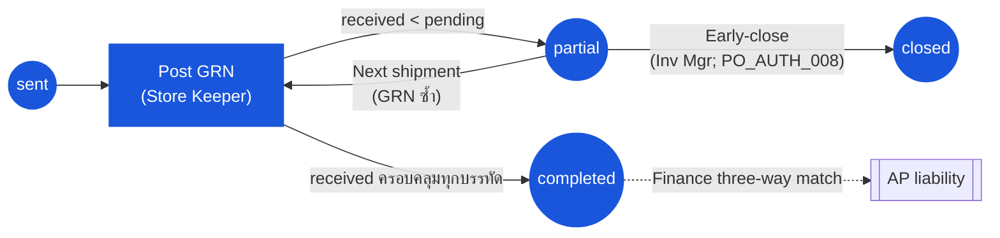

# ใบสั่งซื้อ (Purchase Order) — User Flow — Receiver

> **At a Glance**
> **Persona:** Receiver / Store Keeper (+ Inventory Manager) &nbsp;·&nbsp; **Module:** [purchase-order](/th/inventory/purchase-order) &nbsp;·&nbsp; **Workflow stages:** sent → partial → completed (+ closed ผ่าน early-close) &nbsp;·&nbsp; **สิทธิ์สำคัญ:** post GRN, ตั้ง received/accepted qty, early-close (Inv Mgr)
> **Persona นี้ทำอะไร:** ตรวจสอบการส่งของของ vendor จริง post GRN ทีละบรรทัด และ flip PO status จาก sent เป็น partial หรือ completed

## 1. บทบาทในโมดูลนี้

Persona **Receiver** ครอบคลุม **Receiver / Store Keeper** ที่ dock บวก **Inventory Manager** ที่กำกับการปิด receipt สำหรับ location ทั้งคู่เป็นเจ้าของขาการรับสินค้าจริงของห่วงโซ่ procure-to-pay: Store Keeper ตรวจสอบการส่งของของ vendor เทียบกับ PO, raise **Good Receive Note** (GRN) ทีละบรรทัด และบันทึก `received_qty` และ `accepted_qty` บนแต่ละ PO line; Inventory Manager กำกับการ post นั้นและปิด POs เมื่อรับครบหรือยอมรับเป็นการสิ้นสุด PO status ใน entry ไปยัง flow นี้คือ `sent` (หรือ `partial` สำหรับ deliveries ติดตามผล) การ post GRN เองดำเนินใน `[good-receive-note](/th/inventory/good-receive-note)` ปลายน้ำ — หน้านี้อธิบาย **PO-side effects เท่านั้น**: วิธีที่ GRN ของ Receiver flip `tb_purchase_order.po_status` จาก `sent → partial` (`PO_POST_006`) หรือ `sent → completed` / `partial → completed` (`PO_POST_007`), วิธีที่ Inventory Manager ปิด `partial` PO ด้วย remainder เขียนเป็น `cancelled_qty` (`PO_POST_011`), และวิธีที่ PO line counters (`received_qty`, `cancelled_qty`) advance เทียบกับ `order_qty` Inventory on-hand เพิ่มโดยโมดูล GRN ไม่ใช่โดย PO Segregation of duties บังคับใช้โดย `PO_AUTH_010` — ผู้ใช้ที่สร้างหรือส่ง PO ต้องไม่เป็นผู้ใช้คนเดียวกันที่ post GRN เทียบกับมัน

### ตำแหน่งใน Workflow (เน้น Receiver)

### ตารางสิทธิ์ — Status × Action (Receiver sub-roles)

Store Keeper ขับเคลื่อน GRN ต่อ shipment; Inventory Manager จัดการ override early-close Segregation of duties (`PO_AUTH_010`) ห้ามผู้ post GRN เป็นผู้ใช้คนเดียวกันที่สร้างหรือส่ง PO Inventory on-hand effects เป็นของโมดูล GRN / inventory ไม่ใช่ของ PO

| Action | sent | partial | completed | closed |
|---|---|---|---|---|
| ดู PO (open / received) | ✅ | ✅ | ✅ | ✅ |
| เปิด Receive screen (deep-link เข้า GRN) | ✅ | ✅ | ❌ | ❌ |
| Post GRN — Store Keeper | ✅ (`PO_AUTH_008`) | ✅ | ❌ | ❌ |
| ใส่ `received_qty` (≤ pending balance, หรือตาม over-deliv tolerance) | ✅ | ✅ | ❌ | ❌ |
| ใส่ `accepted_qty` (≤ `received_qty`) | ✅ | ✅ | ❌ | ❌ |
| Trigger `sent → partial` (`PO_POST_006`) | ✅ | — | ❌ | ❌ |
| Trigger `sent → completed` / `partial → completed` (`PO_POST_007`) | ✅ | ✅ | ❌ | ❌ |
| Early-close `partial → closed` — Inventory Manager | ❌ | ✅ (`PO_AUTH_008`, `PO_POST_011`; ต้องการ reason) | ❌ | — |
| ปฏิเสธการส่งของที่ dock (ไม่มี GRN, ไม่มี system effect) | ✅ | ✅ | — | — |
| Edit PO header / lines | ❌ | ❌ | ❌ | ❌ |
| Approve / Transmit / Void | ❌ | ❌ | ❌ | ❌ |
| Post GRN เทียบกับ PO ของ buyer ตัวเอง | ❌ (`PO_AUTH_010` — segregation of duties) | ❌ | — | — |

> ℹ️ **`accepted_qty` vs `received_qty`:** inventory on-hand เพิ่มโดย `accepted_qty` เท่านั้น; gap (`received_qty − accepted_qty`) คือ variance quality-rejection ที่ carry โดย GRN สำหรับการติดตาม vendor return / credit-note PO ไม่ auto-correct สำหรับ variance นี้ — การ resolve log ใน `tb_purchase_order_comment` และ write-off ที่ตกลงไปที่ `cancelled_qty`

## 2. Entry Point และ Primary Flow

**Entry point:** สองเส้นทางที่เทียบเท่าเข้าสู่ GRN posting:

- **จาก PO module** — เปิด PO ที่ `po_status ∈ {sent, partial}` และคลิก **Receive** บน PO header ซึ่ง deep-link เข้าโมดูล GRN พร้อม PO pre-selected
- **จาก GRN module โดยตรง** — เริ่ม GRN ใหม่ เลือก vendor จากนั้นเลือก PO จาก list ของ open POs เทียบกับ vendor / delivery location นั้น

ทั้งสอง entry route เข้าสู่หน้า posting เดียวกัน; PO-side effects ด้านล่างเหมือนกัน

**Primary flow (8 ขั้นตอน):**

1. **เปิด PO** ที่ dock เทียบกับการส่งของจริง Screen แสดงแต่ละบรรทัดของ `order_qty`, running `received_qty`, `cancelled_qty`, และ pending balance (`order_qty − received_qty − cancelled_qty`) Authorization check ภายใต้ `PO_AUTH_008` (Inventory Manager / Receiver สามารถดำเนินการเมื่อ `po_status ∈ {sent, partial}`) และ `PO_AUTH_010` (ผู้ post GRN ต้องไม่ใช่ buyer / transmitter ของ PO)
2. **ตรวจสอบการส่งของจริงเทียบกับ PO** — match delivery note / packing list กับ PO lines, นับ carton, และระบุ short delivery, over delivery, ผิดสินค้า, หรือปัญหาคุณภาพก่อนเปิด GRN
3. **เริ่ม GRN ใหม่** อ้างอิง PO Header GRN inherit `vendor_id`, `currency_id`, และ delivery location จาก PO; rows GRN detail pre-populate จาก `tb_purchase_order_detail` ด้วย `pending_qty` เป็น default editable quantity
4. **ใส่ `received_qty` ต่อบรรทัด** — สิ่งที่มาถึงจริงใน order UoM อาจเท่ากับ น้อยกว่า หรือ (ภายใต้ over-delivery policy) เกิน pending balance
5. **ใส่ `accepted_qty` ต่อบรรทัด** — สิ่งที่ผ่านการตรวจสอบคุณภาพ / specification และยอมรับเข้า inventory `accepted_qty ≤ received_qty`; gap (`received_qty − accepted_qty`) คือ variance quality-rejection ที่อยู่กับ vendor สำหรับ return / credit note
6. **Review totals และ discrepancies** — Screen GRN แสดง summary variance (short, over, quality-reject) และ preview PO line state ที่เกิดขึ้น (บรรทัดนี้จะปิด หรือยังเปิด?)
7. **Post GRN** บน post โมดูล GRN commit transaction: เขียน GRN detail rows, เพิ่ม `tb_purchase_order_detail.received_qty` ตามปริมาณ GRN line, update PR-side bridge `tb_purchase_order_detail_tb_purchase_request_detail.received_qty` สัดส่วน และเพิ่ม inventory on-hand ตาม `accepted_qty` (จัดการภายในโมดูล GRN / inventory ไม่ใช่โดย PO)
8. **PO state updates** คำนวณ line-wise และใช้กับ header:
   - หากอย่างน้อย PO line หนึ่งยังมี `received_qty < order_qty − cancelled_qty`, `po_status` ตั้งเป็น `partial` (`PO_POST_006`) PO ยังเปิดสำหรับ GRN posts เพิ่ม
   - หาก **ทุก** PO line ที่ active เป็นไปตาม `received_qty + cancelled_qty ≥ order_qty`, `po_status` ตั้งเป็น `completed` (`PO_POST_007`) PO ปิดปกติ; ไม่รับ GRNs เพิ่ม

## 3. Decision Branches

- **Short delivery** (`received_qty < pending_balance`): post GRN ด้วยสิ่งที่มาถึงจริง PO transition เป็น `partial` (หรือยังคงที่ `partial`) ภายใต้ `PO_POST_006`; balance ที่ยังไม่ fulfilled ยังคงเป็น pending quantity บนบรรทัดที่ได้รับผลกระทบ available สำหรับ GRN ถัดไป Notify Purchaser ผ่าน activity log มาตรฐานเพื่อให้ vendor ถูกตามเรื่อง remainder
- **Over delivery** (`received_qty > pending_balance`): โมดูล GRN gate เทียบกับ tenant over-delivery tolerance หากยอมรับ (ภายใน tolerance หรือพร้อม override ที่ชัดเจน) GRN post over-shipped quantity, `tb_purchase_order_detail.received_qty` rise เหนือ `order_qty − cancelled_qty`, และ PO transition เป็น `completed` (`PO_POST_007`) หากปฏิเสธ (นอก tolerance) Receiver cap `received_qty` ที่ pending balance และปฏิเสธ excess ที่ dock — ไม่มี system record สำหรับ rejected excess; Purchaser log dispute ฝั่ง vendor บน PO
- **Quality issue** (`accepted_qty < received_qty`): post GRN ด้วยทั้งสองค่า pending balance ของบรรทัดลดลงโดย `received_qty` แต่ inventory on-hand rise เฉพาะโดย `accepted_qty`; variance (`received_qty − accepted_qty`) คือ return / credit-note quantity ที่ track บน GRN PO ไม่ auto-correct — เส้นทาง resolution คือ amendment, return, หรือ credit note ที่ initiate โดย Purchaser
- **Wrong item** (delivery ไม่ตรงกับ PO product): **อย่า post GRN** ปฏิเสธการส่งที่ dock และ escalate ไปยัง Purchaser ที่ log error ฝั่ง vendor ใน `tb_purchase_order_comment` PO ยังคงที่ `sent` (หรือ state ก่อนหน้า) โดยไม่มี quantity change
- **Partial GRN ตอนนี้, remainder ภายหลัง**: post GRN สำหรับสิ่งที่มาถึงวันนี้; `po_status` กลายเป็น `partial` (`PO_POST_006`) และ open balance carry ไปข้างหน้า เมื่อ shipment ถัดไปมาถึง ทำซ้ำ steps 1–7 ข้างต้น; PO ยังคงเป็น `partial` หรือ progress เป็น `completed` เมื่อ final balance clear (`PO_POST_007`)
- **Close PO with remainder cancelled** (Inventory Manager เท่านั้น): เมื่อ vendor ไม่สามารถ supply outstanding quantity Inventory Manager ปิด PO ภายใต้ `PO_AUTH_008` / `PO_POST_011` สำหรับแต่ละบรรทัดที่ยัง pending application เขียน remainder เป็น `cancelled_qty` เพื่อให้ `received_qty + cancelled_qty = order_qty`; `po_status` กลายเป็น `closed` (terminal) Reason text required และบันทึกใน `tb_purchase_order_comment`

## 4. Exit Point / Handoffs

การ involve ของ Receiver บน PO ที่กำหนดจบที่ **GRN post** จากจุดนั้น document state บน Carmen เป็นหนึ่งใน:

- `partial` — อย่างน้อย PO line หนึ่งยังมี open balance; Receiver อาจ re-enter flow เมื่อ shipment ถัดไปมาถึง
- `completed` — ทุกบรรทัดรับครบ; PO อยู่ที่ terminal receipt state และเป็น read-only สำหรับวัตถุประสงค์ inventory ตำแหน่ง matched-but-unbilled ถูกส่งต่อให้ **Finance** สำหรับ three-way match (PO ↔ GRN ↔ invoice) เมื่อ invoice ของ vendor มาถึง; AP liability จากนั้น post ภายใต้ `PO_POST_008`
- `closed` — **Inventory Manager** ปิด `partial` PO ด้วย remainder เขียนเป็น `cancelled_qty` ภายใต้ `PO_POST_011`; close-out review โดย Finance สำหรับ GRNs ที่ post แล้วเทียบกับ closed lines

ในทั้งสามกรณี persona ถัดไปคือ **Finance** สำหรับ invoice match (และสำหรับ closed POs, close-out reconciliation) PO เองไม่ status-changed โดย three-way match — match outcome อยู่บนเร็คคอร์ด invoice ที่ link และ AP posting; PO เก็บสถานะ fulfilment ที่ถึง (`partial`, `completed`, หรือ `closed`) ดู finance persona file สำหรับฝั่งรับของ invoice handoff

## 5. แหล่งอ้างอิง

- ภาพรวม parent: [03-user-flow.md](./03-user-flow.md) — global PO state machine และตาราง cross-persona handoff; row `sent → partial → completed` และ row `partial → closed` เป็นพื้นที่ของ persona นี้
- Sibling: [03-user-flow-purchaser.md](./03-user-flow-purchaser.md) — internal persona ต้นน้ำที่ส่ง PO และแจ้งเตือนเรื่องความคลาดเคลื่อนที่ dock สำหรับ amendment / return / credit-note follow-up
- Sibling: [03-user-flow-procurement-manager.md](./03-user-flow-procurement-manager.md) — ถือ close / void override authority และ review การตัดสินใจ `partial → closed` ร่วมกับ Inventory Manager
- Sibling: [03-user-flow-vendor.md](./03-user-flow-vendor.md) — ฝ่ายภายนอกที่ persona นี้รับการส่งของจริงที่ dock
- Sibling: [03-user-flow-finance.md](./03-user-flow-finance.md) — persona ปลายน้ำที่หยิบตำแหน่ง matched-but-unbilled สำหรับ three-way match หลัง GRN post
- เกี่ยวข้อง: [good-receive-note](/th/inventory/good-receive-note) — โมดูลปลายน้ำที่ GRN จริง ๆ raise และ post; หน้านี้อธิบาย PO-side effects เท่านั้น
- เกี่ยวข้อง: [inventory](/th/inventory/inventory) — การเพิ่ม on-hand จาก `accepted_qty` เป็นของโมดูล inventory บน GRN post; PO มีส่วนร่วมเฉพาะ on-order pipeline quantity (`order_qty − received_qty − cancelled_qty`) ตาม `PO_XMOD_008`
- Sibling: [02-business-rules.md](./02-business-rules.md) — `PO_POST_006`, `PO_POST_007`, `PO_POST_011`, `PO_AUTH_008`, และ `PO_AUTH_010` สำหรับ receipt-side transitions และ authorization ที่อ้างอิงข้างต้น
- `../carmen/docs/purchase-order-management/purchase-order-module.md` — แหล่ง carmen/docs หลักสำหรับ business analysis โมดูล PO, GRN integration, และ receipt-state transitions
