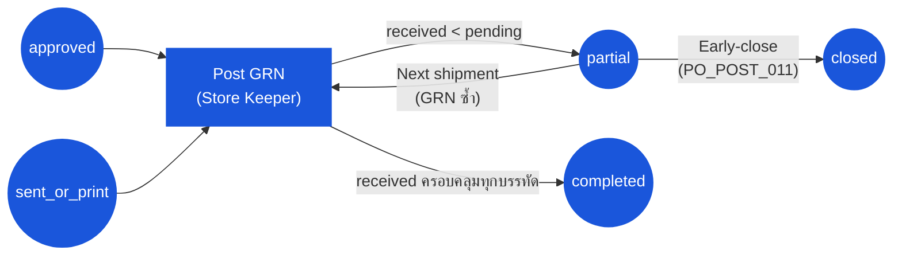

# ใบสั่งซื้อ (Purchase Order) — User Flow — Receiver

> **At a Glance**
> **Persona:** Receiver / Store Keeper (+ Inventory Manager) &nbsp;·&nbsp; **Module:** [purchase-order](/th/inventory/purchase-order) &nbsp;·&nbsp; **Workflow stages:** approved / sent_or_print → partial → completed (+ closed ผ่าน early-close) &nbsp;·&nbsp; **สิทธิ์สำคัญ:** `procurement.purchase_order: create` บน route GRN-by-PO, `can_use` ของ location จาก `tb_location_user`, post GRN, early-close
> **Persona นี้ทำอะไร:** ตรวจสอบการส่งของของ vendor จริง post GRN ทีละบรรทัด (ปริมาณจ่ายเงินและ FOC) และ flip PO status จาก approved / sent_or_print เป็น partial หรือ completed Re-sync 2026-09-22 — การรับของปลดล็อกที่ `approved` ก่อนอีเมลถึง vendor

## 1. บทบาทในโมดูลนี้

Persona **Receiver** ครอบคลุม **Receiver / Store Keeper** ที่ dock บวก **Inventory Manager** ที่กำกับการปิด receipt สำหรับ location ทั้งคู่เป็นเจ้าของขาการรับสินค้าจริงของห่วงโซ่ procure-to-pay: Store Keeper ตรวจสอบการส่งของของ vendor เทียบกับ PO, raise **Good Receive Note** (GRN) ทีละบรรทัด และบันทึก `received_qty` บนแต่ละ PO line; Inventory Manager กำกับการ post นั้นและปิด POs เมื่อรับครบหรือยอมรับเป็นการสิ้นสุด PO status ใน entry ไปยัง flow นี้คือ `approved` หรือ `sent_or_print` (หรือ `partial` สำหรับ deliveries ติดตามผล) — `findOnePoForGrn` รับทั้งสาม (`receivableStatuses`, `purchase-order.service.ts` L1205-1214: "A PO becomes receivable at approval, not at send: goods can arrive before anyone gets round to printing or emailing the order") การ post GRN เองดำเนินใน `[good-receive-note](/th/inventory/good-receive-note)` ปลายน้ำ — หน้านี้อธิบาย **PO-side effects เท่านั้น**: วิธีที่ GRN ของ Receiver flip `tb_purchase_order.po_status` เป็น `partial` (`PO_POST_006`) หรือ `completed` (`PO_POST_007`) ผ่าน `updatePoStatuses` ใน `good-received-note.logic.ts`, วิธีที่ใครก็ตามที่เปิด PO อยู่ปิด PO ที่ `{in_progress, approved, sent_or_print, partial}` ด้วย remainder เขียนเป็น `cancelled_qty` (`PO_POST_011`), และวิธีที่ PO line counters (`received_qty`, `cancelled_qty`) และ bridge counters (`received_qty`, `foc_received_qty`) advance เทียบกับ `order_qty` / `pr_detail_foc_qty` ของ FOC เข้าคลังตอนรับแล้วตอนนี้ (`f8cd9f0d9`, 2026-09-10) และปริมาณที่รับของมันถูก track แยกจากปริมาณจ่ายเงิน Inventory on-hand เพิ่มโดยโมดูล GRN ไม่ใช่โดย PO **ยังไม่ยืนยัน:** เวอร์ชันก่อนหน้าของหน้านี้อ้างว่า segregation of duties (buyer ≠ ผู้ post GRN) ถูกบังคับใช้ที่การสร้าง GRN — การค้นหาทั่ว repo ทั้งใน backend service ของ GRN และ PO สำหรับ `segregation` / การตรวจสอบ buyer-vs-poster ไม่พบ code ที่ตรงกัน ถือว่านี่เป็น design intent ไม่ใช่ guard ที่ใช้งานจริง จนกว่าจะยืนยันได้ในรอบ resync ของโมดูล good-receive-note เอง **แก้ไขในรอบนี้:** เวอร์ชันก่อนหน้าของหน้านี้ยังอ้างอิงฟิลด์ `accepted_qty` ที่แยกจาก `received_qty` (ขั้นตอน "quality inspection" ที่ Receiver บันทึกสิ่งที่รับมาเทียบกับสิ่งที่ผ่านการตรวจ) การค้นหาทั่ว Prisma schema และซอร์สทั้ง frontend และ backend ให้ผลศูนย์รายการสำหรับ `accepted_qty` / `acceptedQty` — ไม่มีฟิลด์นี้อยู่ สอดคล้องกับข้อค้นพบที่ยืนยันและแก้ไขแล้วในรอบ resync ของโมดูล [good-receive-note](/th/inventory/good-receive-note) เอง: การรับของขาดหรือปัญหาคุณภาพถูกบันทึกเพียงแค่กรอก `received_qty` ให้น้อยกว่าที่สั่ง ไม่มีปริมาณการยอมรับแยกต่างหาก

### ตำแหน่งใน Workflow (เน้น Receiver)

```mermaid
graph LR
    approved(("approved")):::current --> grn["Post GRN<br/>(Store Keeper)"]:::current
    sent(("sent_or_print")):::current --> grn
    grn -->|"received < pending"| partial(("partial")):::current
    grn -->|"received ครอบคลุมทุกบรรทัด"| completed(("completed")):::current
    partial -->|"Next shipment<br/>(GRN ซ้ำ)"| grn
    partial -->|"Early-close<br/>(PO_POST_011)"| closed(("closed")):::current
    classDef current fill:#1a56db,color:#fff,stroke:#1a56db;
```

### ตารางสิทธิ์ — Status × Action (Receiver sub-roles)

Store Keeper ขับเคลื่อน GRN ต่อ shipment; Inventory Manager จัดการ override early-close Inventory on-hand effects เป็นของโมดูล GRN / inventory ไม่ใช่ของ PO

| Action | approved | sent_or_print | partial | completed | closed |
|---|---|---|---|---|---|
| ดู PO (open / received) | ✅ | ✅ | ✅ | ✅ | ✅ |
| เห็น PO ใน GRN vendor / PO picker (`GET .../purchase-orders/grn*`) | ✅ | ✅ | ✅ | ❌ | ❌ |
| สร้าง GRN draft จาก PO (`GET .../purchase-orders/grn/:id`, `procurement.purchase_order: create`) | ✅ | ✅ | ✅ | ❌ | ❌ |
| Post GRN — Store Keeper (location `can_use = true`) | ✅ (`PO_AUTH_008`) | ✅ | ✅ | ❌ | ❌ |
| ใส่ `received_qty` และ FOC ที่รับต่อบรรทัด | ✅ | ✅ | ✅ | ❌ | ❌ |
| Trigger `→ partial` (`PO_POST_006`) | ✅ | ✅ | — | ❌ | ❌ |
| Trigger `→ completed` (`PO_POST_007`) | ✅ | ✅ | ✅ | ❌ | ❌ |
| Early-close `→ closed` (`PO_POST_011`; ไม่มี role gate ไม่มี field เหตุผล) | ✅ | ✅ | ✅ | ❌ | — |
| ปฏิเสธการส่งของที่ dock (ไม่มี GRN, ไม่มี system effect) | ✅ | ✅ | ✅ | — | — |
| Edit PO header / lines | ❌ | ❌ | ❌ | ❌ | ❌ |
| Approve / Send Email / Void | ❌ | ❌ | ❌ | ❌ | ❌ |
| Post GRN เทียบกับ PO ของ buyer ตัวเอง | ยังไม่ยืนยัน — ไม่พบ segregation-of-duties check ใน source ปัจจุบัน | — | — | — | — |

> ℹ️ **ไม่มีปริมาณการยอมรับแยกต่างหาก:** การค้นหาทั่ว Prisma schema และโค้ดแอปพลิเคชันของ GRN ไม่พบฟิลด์ `accepted_qty` (หรือฟิลด์ acceptance/rejection ต่อบรรทัดใดๆ) เลย — ดู data model ที่แก้ไขแล้วของโมดูล [good-receive-note](/th/inventory/good-receive-note) เอง Inventory on-hand เพิ่มโดย `received_qty` เท่านั้น; ปัญหาคุณภาพหรือการรับของขาดถูกบันทึกเพียงแค่กรอก `received_qty` ให้น้อยกว่าที่สั่ง โดยมี comment แบบ free-text บน GRN บันทึกความคลาดเคลื่อนไว้ Write-off ที่ตกลงกันเทียบกับ balance ที่เหลือไปที่ `cancelled_qty` ผ่าน close action ของ Inventory Manager ไม่ใช่ฟิลด์ acceptance แยกต่างหาก

## 2. Entry Point และ Primary Flow

**Entry point:** สองเส้นทางที่เทียบเท่าเข้าสู่ GRN posting:

- **จาก GRN module** — เริ่ม GRN ใหม่ เลือก vendor (`GET .../purchase-orders/grn/vendor` แสดง vendor ที่มี PO เปิดอยู่พร้อม `po_count`) จากนั้นเลือก PO จาก `GET .../purchase-orders/grn/vendor/:vendor_id`; แต่ละ location บนแต่ละบรรทัดมี `can_use` คำนวณจากแถว `tb_location_user` ของผู้เรียก (`c0b6d549f`) และ `GET .../purchase-orders/grn/:id` สร้าง GRN draft พร้อม `remain_qty` / `foc_remain_qty` ต่อ location
- **จากหน้า PO detail** — PO ที่ `approved` / `sent_or_print` / `partial` เป็น read-only สำหรับ Receiver; ทางเข้าการรับของที่ยืนยันแล้วคือโมดูล GRN (เวอร์ชันก่อนหน้าของหน้านี้อธิบายปุ่ม deep-link **Receive** บน PO header — ไม่มีปุ่มแบบนั้นใน `po-header.tsx` ที่ HEAD; ถือว่ายังไม่ยืนยัน)

ทั้งสอง entry route เข้าสู่หน้า posting เดียวกัน; PO-side effects ด้านล่างเหมือนกัน

**Primary flow (8 ขั้นตอน):**

1. **เปิด PO** ที่ dock เทียบกับการส่งของจริง Screen แสดงแต่ละบรรทัดของ `order_qty`, running `received_qty`, `cancelled_qty`, pending balance (`order_qty − received_qty − cancelled_qty`) และ — สำหรับ PR-sourced lines — เลข GRN ที่ post กับมันไปแล้ว Authorization check ภายใต้ `PO_AUTH_008` (`po_status ∈ {approved, sent_or_print, partial}`, `procurement.purchase_order: create` บน route GRN-by-PO, `can_use` ของ location); ไม่พบ segregation-of-duties check ที่จำกัดผู้ post GRN ที่ยืนยันได้ใน source ปัจจุบัน
2. **ตรวจสอบการส่งของจริงเทียบกับ PO** — match delivery note / packing list กับ PO lines, นับ carton, และระบุ short delivery, over delivery, ผิดสินค้า, หรือปัญหาคุณภาพก่อนเปิด GRN
3. **เริ่ม GRN ใหม่** อ้างอิง PO Header GRN inherit `vendor_id`, `currency_id`, และ delivery location จาก PO; rows GRN detail pre-populate จาก `tb_purchase_order_detail` ด้วย `pending_qty` เป็น default editable quantity
4. **ใส่ `received_qty` ต่อบรรทัด** — สิ่งที่มาถึงจริงใน order UoM อาจเท่ากับ น้อยกว่า หรือ (ภายใต้ over-delivery policy) เกิน pending balance ไม่มีฟิลด์ acceptance quantity แยกต่างหาก: short delivery, สินค้าผิด, หรือ quality rejection ถูกบันทึกด้วยการกรอก `received_qty` ให้น้อยกว่าที่สั่ง พร้อม comment แบบ free-text บน GRN บันทึกความคลาดเคลื่อนไว้ — ไม่ใช่ปริมาณ structured ตัวที่สอง
5. **Review totals และ discrepancies** — Screen GRN แสดง summary variance (short, over) และ preview PO line state ที่เกิดขึ้น (บรรทัดนี้จะปิด หรือยังเปิด?)
6. **Post GRN** บน post โมดูล GRN commit transaction: เขียน GRN detail rows, เพิ่ม `tb_purchase_order_detail.received_qty` ตามปริมาณ GRN line (`incrementPoDetailReceivedQty`), เพิ่ม `received_qty` และ `foc_received_qty` ของ bridge row (`good-received-note.service.ts` L3720) และเพิ่ม inventory on-hand ตามปริมาณที่รับ **รวม FOC** (จัดการภายในโมดูล GRN / inventory ไม่ใช่โดย PO)
7. **PO state updates** คำนวณ line-wise และใช้กับ header (`updatePoStatuses`, `good-received-note.logic.ts` L540-568):
   - หากอย่างน้อย PO line หนึ่งยังมี `received_qty < order_qty − cancelled_qty`, `po_status` ตั้งเป็น `partial` (`PO_POST_006`) PO ยังเปิดสำหรับ GRN posts เพิ่ม กรณีนี้เกิดจาก `approved` ได้โดยตรง ก่อนที่ PO จะเคยถูกส่งอีเมล
   - หาก **ทุก** PO line ที่ active เป็นไปตาม `received_qty ≥ order_qty − cancelled_qty`, `po_status` ตั้งเป็น `completed` (`PO_POST_007`) PO ปิดปกติ; ไม่รับ GRNs เพิ่ม

## 3. Decision Branches

- **Short delivery** (`received_qty < pending_balance`): post GRN ด้วยสิ่งที่มาถึงจริง PO transition เป็น `partial` (หรือยังคงที่ `partial`) ภายใต้ `PO_POST_006`; balance ที่ยังไม่ fulfilled ยังคงเป็น pending quantity บนบรรทัดที่ได้รับผลกระทบ available สำหรับ GRN ถัดไป Notify Purchaser ผ่าน activity log มาตรฐานเพื่อให้ vendor ถูกตามเรื่อง remainder
- **Over delivery** (`received_qty > pending_balance`): โมดูล GRN gate เทียบกับ tenant over-delivery tolerance หากยอมรับ (ภายใน tolerance หรือพร้อม override ที่ชัดเจน) GRN post over-shipped quantity, `tb_purchase_order_detail.received_qty` rise เหนือ `order_qty − cancelled_qty`, และ PO transition เป็น `completed` (`PO_POST_007`) หากปฏิเสธ (นอก tolerance) Receiver cap `received_qty` ที่ pending balance และปฏิเสธ excess ที่ dock — ไม่มี system record สำหรับ rejected excess; Purchaser log dispute ฝั่ง vendor บน PO
- **Quality issue** (บางส่วนของสิ่งที่มาถึง fail การตรวจสอบ): ไม่มีฟิลด์ acceptance quantity แยกต่างหากสำหรับบันทึกสิ่งนี้ — post GRN ด้วย `received_qty` ตั้งเป็นเฉพาะส่วนที่เก็บไว้ และบันทึกส่วนที่ปฏิเสธไว้ใน comment แบบ free-text บน GRN pending balance ของบรรทัดลดลงโดย `received_qty` ที่กรอกเท่านั้น และ inventory on-hand rise ด้วย `received_qty` เดียวกันนั้น; ส่วนที่ปฏิเสธไม่ถูก track เป็นฟิลด์ structured ใดๆ ทั้งใน schema ของ GRN หรือ PO PO ไม่ auto-correct — เส้นทาง resolution (amendment, return, หรือ credit note กับ vendor) initiate โดย Purchaser นอกเอกสาร
- **Wrong item** (delivery ไม่ตรงกับ PO product): **อย่า post GRN** ปฏิเสธการส่งที่ dock และ escalate ไปยัง Purchaser ที่ log error ฝั่ง vendor ใน `tb_purchase_order_comment` PO ยังคงที่ `sent` (หรือ state ก่อนหน้า) โดยไม่มี quantity change
- **Partial GRN ตอนนี้, remainder ภายหลัง**: post GRN สำหรับสิ่งที่มาถึงวันนี้; `po_status` กลายเป็น `partial` (`PO_POST_006`) และ open balance carry ไปข้างหน้า เมื่อ shipment ถัดไปมาถึง ทำซ้ำ steps 1–7 ข้างต้น; PO ยังคงเป็น `partial` หรือ progress เป็น `completed` เมื่อ final balance clear (`PO_POST_007`)
- **Close PO with remainder cancelled**: เมื่อ vendor ไม่สามารถ supply outstanding quantity ใครก็ตามที่เปิด PO อยู่ปิดมันภายใต้ `PO_POST_011` (`closePO()` ไม่มี role gate; header ของ React แสดง **Close** บน `approved` / `sent_or_print`) สำหรับแต่ละบรรทัดที่ยัง pending application เขียน remainder เป็น `cancelled_qty` เพื่อให้ `received_qty + cancelled_qty = order_qty`; `po_status` กลายเป็น `closed` (terminal) และ buyer ถูกแจ้งเตือน body ของ endpoint คือ `{}` — ไม่บังคับ field เหตุผล; บันทึกเป็น comment ถ้านโยบายต้องการ

## 4. Exit Point / Handoffs

การ involve ของ Receiver บน PO ที่กำหนดจบที่ **GRN post** จากจุดนั้น document state บน Carmen เป็นหนึ่งใน:

- `partial` — อย่างน้อย PO line หนึ่งยังมี open balance; Receiver อาจ re-enter flow เมื่อ shipment ถัดไปมาถึง
- `completed` — ทุกบรรทัดรับครบ; PO อยู่ที่ terminal receipt state และเป็น read-only สำหรับวัตถุประสงค์ inventory **ยังไม่ยืนยัน:** ไม่พบ feature vendor-invoice-match หรือ AP-posting downstream ใด ๆ ใน source ปัจจุบัน — ดู [03-user-flow-finance.md](./03-user-flow-finance.md) สำหรับการแก้ไข การลดหนี้จาก vendor หลังรับของทำผ่าน [Credit Note](/th/inventory/purchase-order/credit-note) ซึ่งอิง GRN และลดหนี้แต่ละสินค้าบนใบรับได้ครั้งเดียว
- `closed` — มีคนปิด `partial` PO ด้วย remainder เขียนเป็น `cancelled_qty` ภายใต้ `PO_POST_011`

## 5. แหล่งอ้างอิง

- ภาพรวม parent: [03-user-flow.md](./03-user-flow.md) — global PO state machine และตาราง cross-persona handoff; row `{approved, sent_or_print} → partial → completed` และ row `partial → closed` เป็นพื้นที่ของ persona นี้
- Backend: `../carmen-turborepo-backend-v2/apps/micro-business/src/procurement/purchase-order/purchase-order.service.ts` (`findAllForGrn` L1351-1622 พร้อม `can_use`, `findOnePoForGrn` L1195-1215); `apps/micro-business/src/inventory/good-received-note/good-received-note.logic.ts` (`updatePoStatuses`); Bruno `GET-find-vendors-for-grn`, `GET-find-all-for-grn-by-vendor`, `GET-find-all-for-grn`, `GET-build-grn-draft-from-po`
- Sibling: [03-user-flow-purchaser.md](./03-user-flow-purchaser.md) — internal persona ต้นน้ำที่ส่ง PO และแจ้งเตือนเรื่องความคลาดเคลื่อนที่ dock สำหรับ amendment / return / credit-note follow-up
- Sibling: [03-user-flow-procurement-manager.md](./03-user-flow-procurement-manager.md) — ถือ close / void override authority และ review การตัดสินใจ `partial → closed` ร่วมกับ Inventory Manager
- Sibling: [03-user-flow-vendor.md](./03-user-flow-vendor.md) — ฝ่ายภายนอกที่ persona นี้รับการส่งของจริงที่ dock
- Sibling: [03-user-flow-finance.md](./03-user-flow-finance.md) — บันทึกเหตุผลที่ไม่พบ three-way-match / invoice handoff ที่ยืนยันได้หลัง GRN post
- เกี่ยวข้อง: [good-receive-note](/th/inventory/good-receive-note) — โมดูลปลายน้ำที่ GRN จริง ๆ raise และ post; หน้านี้อธิบาย PO-side effects เท่านั้น
- เกี่ยวข้อง: [inventory](/th/inventory/inventory) — การเพิ่ม on-hand จาก `received_qty` เป็นของโมดูล inventory บน GRN post; PO มีส่วนร่วมเฉพาะ on-order pipeline quantity (`order_qty − received_qty − cancelled_qty`) ตาม `PO_XMOD_008`
- Sibling: [02-business-rules.md](./02-business-rules.md) — `PO_POST_006`, `PO_POST_007`, `PO_POST_011`, `PO_AUTH_008`, และ `PO_AUTH_010` สำหรับ receipt-side transitions และ authorization ที่อ้างอิงข้างต้น
- `../carmen/docs/purchase-order-management/purchase-order-module.md` — แหล่ง carmen/docs หลักสำหรับ business analysis โมดูล PO, GRN integration, และ receipt-state transitions
