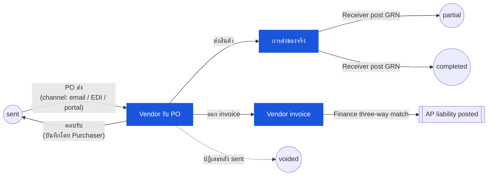

# ใบสั่งซื้อ (Purchase Order) — User Flow — Vendor

> **At a Glance**
> **Persona:** Vendor (ภายนอก — ไม่มี Carmen login) &nbsp;·&nbsp; **Module:** [purchase-order](/th/inventory/purchase-order) &nbsp;·&nbsp; **Workflow stages:** sent (จุดสัมผัส) → partial / completed / voided &nbsp;·&nbsp; **สิทธิ์สำคัญ:** ไม่มีตรง — events บันทึกโดย Purchaser / Receiver / Finance / PM แทน vendor
> **Persona นี้ทำอะไร:** รับ PO ที่ส่งมา ตอบรับ ส่งของ และออก invoice — ทุก effect ระบบ capture โดย internal persona

## 1. บทบาทในโมดูลนี้

**Vendor** คือ **ฝ่ายภายนอกที่ไม่มี Carmen system login** Vendor รับ PO ที่ส่งมา ตอบรับการตอบรับ ส่งของตามที่ตกลง และออก invoice สำหรับ three-way match — แต่ทุก effect ฝั่งระบบของ actions เหล่านี้บันทึกโดย internal persona แทน vendor เมื่อ PO ส่งบน final approval state ระบบเคลื่อนเป็น `sent` (`PO_POST_004`); หลังจากนั้น acknowledgement ของ vendor capture ด้วยมือโดย **Purchaser** ใน `tb_purchase_order_comment` (หรือเมื่อมี vendor portal ตั้งค่า เขียนตรงผ่าน portal callback), การส่งของจริงไม่มี effect ระบบทันที, การ post GRN ของ **Receiver** flip `po_status` เป็น `partial` หรือ `completed` ผ่าน `PO_POST_006` / `PO_POST_007`, และ invoice ของ vendor capture และ three-way-matched โดย persona **Finance** Vendor ไม่ operate `po_status` โดยตรง — actions ของมัน drive state เฉพาะผ่าน internal personas ที่บันทึก

### ตำแหน่งใน Workflow (เน้นจุดสัมผัสของ Vendor)

### ตารางสิทธิ์ — Vendor Event × System Effect (บันทึกโดย internal persona)

Vendor มี **สิทธิ์เขียนโดยตรงไม่มี** ใน Carmen แต่ละ event ฝั่ง vendor บันทึกโดย internal persona; ตารางด้านล่าง map event ไปยัง persona, surface ระบบ, และ effect ของ `po_status` (ถ้ามี)

| Vendor event | Internal persona ที่บันทึก | System surface | Effect ของ `po_status` |
|---|---|---|---|
| ตอบรับ PO | Purchaser (หรือ portal callback) | `tb_purchase_order_comment` | ไม่มี (ยังคงเป็น `sent`) |
| ส่งของ partial qty | Receiver | GRN posting | `sent → partial` (`PO_POST_006`) |
| ส่งของเต็ม / final balance | Receiver | GRN posting | `sent → completed` หรือ `partial → completed` (`PO_POST_007`) |
| ปฏิเสธ / ยกเลิกหลัง `sent` | Procurement Manager | Void (`PO_AUTH_007`) | `sent → voided` (`PO_POST_010`) |
| ไม่สามารถ supply outstanding balance | Procurement Manager / Inventory Manager | Early-close (`PO_AUTH_008`) | `partial → closed` (`PO_POST_011`) |
| ส่งของผิด / qty over | Receiver (ปฏิเสธที่ dock) | ไม่มี — escalate ไปยัง Purchaser ผ่าน `tb_purchase_order_comment` | ไม่มี |
| ส่งของที่ failed คุณภาพ | Receiver | GRN with `accepted_qty < received_qty` | ตาม `PO_POST_006` / `PO_POST_007` |
| ออก invoice | Finance Officer / AP | หน้า AP capture + three-way match | ไม่มี — three-way-match outcome อยู่บนเร็คคอร์ด invoice (`PO_POST_008` / `PO_POST_009`) |

> ⚠️ **ความแตกต่าง — auto-transmit บน final approve:** Live UI ส่ง PO ให้ vendor **ทันทีบน final approval** (ไม่มีปุ่ม "Send to Vendor" ด้วยมือแยกต่างหาก) — `APPROVED` และ `SENT` สังเกตเหมือนเป็นขั้นตอนเดียวกัน BRD `FR-PO-005` อธิบาย action *Send* ด้วยมือแยกและ status `ACKNOWLEDGED` ที่ vendor confirm ทั้งปุ่ม send ด้วยมือและ status `ACKNOWLEDGED` ไม่อยู่ใน live UI Source: `Test_case/Purchase_Order/Purchaser/INDEX.md` § Status Lifecycle (วันที่ capture 2026-04-26)

## 2. Entry Point และ Primary Flow

**Entry point:** Vendor รับ PO ที่ส่งผ่าน channel ที่ตั้งค่าบน tenant — email PDF, EDI feed, หรือ vendor portal link การส่งเขียน `tb_purchase_order.email` และ `approval_date`, และ PO อยู่ที่ `po_status = sent`

**Primary flow (เชิงแนวคิด — system effects เฉพาะใน internal entry):**

1. **ตอบรับการรับ PO** Vendor confirm การตอบรับ terms (price, quantity, delivery date, payment terms) **System effect:** Purchaser บันทึก acknowledgement ใน `tb_purchase_order_comment` พร้อมวันที่ confirm และ reference; หากใช้ vendor portal portal callback เขียน comment เดียวกันโดยอัตโนมัติ `po_status` ยังคงเป็น `sent`
2. **เตรียมและส่งสินค้าตามวันส่งที่ตกลง** Vendor allocate stock, pick, pack, และ dispatch shipment พร้อม delivery note / packing list อ้างอิง `po_no` **System effect:** ไม่มี — การเคลื่อนไหวจริงมองไม่เห็นใน Carmen จนกว่า Receiver เปิดที่ dock
3. **ส่งสินค้าไปยัง receiving location** logistics partner ของ vendor ส่งเทียบกับ PO และ delivery point ที่ตกลง **System effect:** ไม่มีโดยตรง — persona **Receiver** scan / count และ raise GRN ในโมดูล [good-receive-note](/th/inventory/good-receive-note) ปลายน้ำ ซึ่งจริง ๆ flip `po_status` (`sent → partial` หรือ `sent → completed`)
4. **ออก invoice** Vendor ส่ง AP invoice (paper, PDF, หรือ EDI) อ้างอิง `po_no` และปริมาณที่ส่ง **System effect:** persona **Finance** capture invoice, รัน three-way match (PO ↔ GRN ↔ invoice) และ post AP liability บน match สำเร็จ; PO เองไม่ status-updated โดย invoice — three-way match track บนเร็คคอร์ด invoice ที่ link

## 3. Decision Branches

- **หาก vendor ปฏิเสธ PO หลัง transmission** (price disagreement, stock-out, lead-time impossible): vendor สื่อสารการปฏิเสธผ่าน channel ดั้งเดิม **System effect:** Purchaser log การปฏิเสธใน `tb_purchase_order_comment` และทั้ง re-route สำหรับ amendment (ภายในข้อจำกัด post-`sent` ของ `PO_VAL_016`) หรือ escalate ไปยัง **Procurement Manager** สำหรับ void จาก `sent` ภายใต้ `PO_AUTH_007` / `PO_POST_010` Terminal state ของ PO คือ `voided`
- **หาก vendor partial-ships** (เฉพาะบางของปริมาณที่สั่งถูกส่งตอนนี้, balance ตามมา): vendor ส่งสิ่งที่มีพร้อม delivery note ทำเครื่องหมาย partial **System effect:** **Receiver** post partial GRN — `received_qty < order_qty − cancelled_qty` บนบรรทัดที่ได้รับผลกระทบ — ซึ่ง flip `po_status` เป็น `partial` (`PO_POST_006`) Shipments ถัดไป capture โดย GRN posts เพิ่มจนกว่า balance จะ clear (`partial → completed`, `PO_POST_007`) หรือ write off เป็น `cancelled_qty` โดย **Procurement Manager** / **Inventory Manager** (`partial → closed`, `PO_POST_011`)
- **หาก vendor ส่งสินค้าผิด, qty over, หรือคุณภาพต่ำกว่ามาตรฐาน**: ความคลาดเคลื่อนของ vendor ตรวจพบที่ dock **System effect:** **Receiver** บันทึกความคลาดเคลื่อนบน GRN (variance qty, reason code) และ **Purchaser** แจ้งเตือนเพื่อ initiate return / replacement / credit note กับ vendor ภายใต้ amendment loop PO ไม่ auto-correct — การ resolve log ใน `tb_purchase_order_comment` และ write-off ที่ตกลงไปที่ `cancelled_qty` บนบรรทัดที่ได้รับผลกระทบ

## 4. Exit Point / Handoffs

การ involve ของ vendor บน PO ที่กำหนดจบที่ **invoice issuance** จากจุดนั้น document state บน Carmen เป็นหนึ่งใน:

- `sent` — PO ส่งแล้วแต่ยังไม่ได้ post GRN (vendor ยังไม่ส่งหรือ delivery ระหว่าง transit)
- `partial` — Receiver ได้ post อย่างน้อย GRN หนึ่งใบแต่ PO ยังมี open balance บนบรรทัดหนึ่งหรือมากกว่า
- `completed` — Receiver ได้ clear ทุกบรรทัดผ่าน GRN; PO ถึง terminal receipt state
- `voided` — PO ถูก void post-transmission (vendor ปฏิเสธ หรือ material amendment force re-issue); invoice ของ vendor ถ้ามี ไม่ถูก match

**Three-way match** (PO ↔ GRN ↔ invoice) รันโดย persona **Finance** หลังทั้ง GRN และ invoice บันทึก — PO status เองไม่เปลี่ยนโดย match outcome แต่ AP liability post เทียบกับ matched invoice บน success ดู finance persona file สำหรับฝั่งรับของ invoice handoff

## 5. แหล่งอ้างอิง

- ภาพรวม parent: [03-user-flow.md](./03-user-flow.md) — global PO state machine และตาราง cross-persona handoff
- Sibling: [03-user-flow-purchaser.md](./03-user-flow-purchaser.md) — internal persona ที่ส่ง PO บันทึก vendor acknowledgement และรัน amendment loop แทน vendor
- Sibling: [03-user-flow-receiver.md](./03-user-flow-receiver.md) — internal persona ปลายน้ำที่รับการส่งของจริงของ vendor และ post GRN ที่ขับเคลื่อน `sent → partial → completed`
- Sibling: [03-user-flow-finance.md](./03-user-flow-finance.md) — internal persona ที่ capture invoice ของ vendor และรัน three-way match
- เกี่ยวข้อง: [good-receive-note](/th/inventory/good-receive-note) — โมดูลปลายน้ำที่บันทึกการส่งของจริงของ vendor และขับเคลื่อน receipt-state transitions บน PO
- `../carmen/docs/purchase-order-management/purchase-order-module.md` — แหล่ง carmen/docs หลักสำหรับ business analysis โมดูล PO, transmission, และ flow three-way-match
