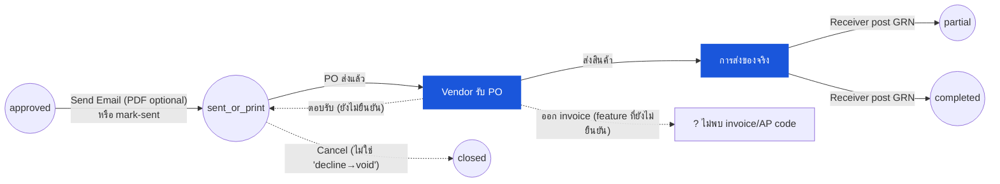

# ใบสั่งซื้อ (Purchase Order) — User Flow — Vendor

> **At a Glance**
> **Persona:** Vendor (ภายนอก — ไม่มี Carmen login) &nbsp;·&nbsp; **Module:** [purchase-order](/th/inventory/purchase-order) &nbsp;·&nbsp; **Workflow stages:** sent_or_print (จุดสัมผัส) → partial / completed / closed &nbsp;·&nbsp; **สิทธิ์สำคัญ:** ไม่มีโดยตรง — events บันทึกโดย Purchaser / Receiver แทน vendor
> **Persona นี้ทำอะไร:** รับ PO ทางอีเมล (พร้อม PDF แบบ optional) หรือการส่งมอบแบบพิมพ์ / แฟกซ์ที่ Purchaser บันทึกด้วย `mark-sent` จากนั้น fulfil การส่งของ — ทุก system effect ถูก capture โดย internal persona Re-sync 2026-09-22

## 1. บทบาทในโมดูลนี้

**Vendor** คือ **ฝ่ายภายนอกที่ไม่มี Carmen system login** Vendor รับ PO และ fulfil การส่งของตามที่ตกลง — system-side effect ที่ยืนยันแล้วของสิ่งนี้คือการ post GRN ของ **Receiver** ซึ่ง flip `po_status` เป็น `partial` หรือ `completed` ผ่าน `PO_POST_006` / `PO_POST_007` การส่งตอนนี้เป็น system event ที่ชัดเจนและยืนยันแล้ว (`PO_POST_004b`, 2026-09-08/14): Purchaser ส่งอีเมล PO ผ่าน BU email profile (`POST .../purchase-orders/:id/send-email` พร้อม PDF ที่ render ฝั่งเซิร์ฟเวอร์แบบ optional, template EN/TH ที่ seed ไว้) หรือบันทึกการส่งมอบแบบพิมพ์ / แฟกซ์ / โทรด้วย `POST .../purchase-orders/:id/mark-sent`; ทั้งสองย้าย PO `approved → sent_or_print` และเขียน entry ใน `tb_activity` (`email_sent` พร้อมผู้รับและผลลัพธ์ หรือ "Marked as sent to vendor") PO ที่เป็นเพียง `approved` อาจถูกรับของกับมันได้แล้ว — vendor ส่งของตามคำสั่งปากเปล่าก่อนอีเมลออกได้ **ยังไม่ยืนยันในรอบนี้:** ว่า acknowledgement ของ vendor ถูก capture ที่ไหนหรือไม่ (comment, portal callback, หรืออื่น ๆ) และว่า feature vendor-invoice / three-way-match ใด ๆ มีอยู่ downstream ของ receipt หรือไม่ — การค้นหาทั่ว repo สำหรับ `three-way`, `vendor_invoice`, และ `tb_invoice` ไม่พบ match ใดทั้งใน frontend และ backend ถือว่าขั้นตอน acknowledgement และ invoice/AP ด้านล่างเป็น documented design intent ที่สืบทอดมาจาก `carmen/docs` ไม่ใช่ confirmed live behavior; ดู [03-user-flow-finance.md](./03-user-flow-finance.md) สำหรับการแก้ไขที่สมบูรณ์กว่า

### ตำแหน่งใน Workflow (เน้นจุดสัมผัสของ Vendor)

```mermaid
graph LR
    approved(("approved")) -->|"Send Email (PDF optional)<br/>หรือ mark-sent"| sent(("sent_or_print"))
    sent -->|"PO ส่งแล้ว"| vendor["Vendor รับ PO"]:::current
    vendor -.->|"ตอบรับ (ยังไม่ยืนยัน)"| sent
    vendor -->|"ส่งสินค้า"| recv["การส่งของจริง"]:::current
    recv -->|"Receiver post GRN"| partial(("partial"))
    recv -->|"Receiver post GRN"| completed(("completed"))
    vendor -.->|"ออก invoice (feature ที่ยังไม่ยืนยัน)"| inv["? ไม่พบ invoice/AP code"]
    sent -.->|"Cancel (ไม่ใช่ 'decline→void')"| closed(("closed"))
    classDef current fill:#1a56db,color:#fff,stroke:#1a56db;
```

### ตารางสิทธิ์ — Vendor Event × System Effect (บันทึกโดย internal persona, เมื่อยืนยันได้)

Vendor มี **สิทธิ์เขียนโดยตรงไม่มี** ใน Carmen ตารางด้านล่าง map แต่ละ event ฝั่ง vendor ไปยังสิ่งที่เกิดขึ้นจริงฝั่ง PO พร้อม flag ว่าอะไรยืนยันแล้วและอะไรยังไม่ยืนยัน

| Vendor event | System surface | Effect ของ `po_status` |
|---|---|---|
| รับ PO | **Send Email** ของ Purchaser (`send-email`, `tb_activity` `email_sent`) หรือ `mark-sent` | `approved → sent_or_print` (`PO_POST_004b`) |
| ตอบรับ PO | **ยังไม่ยืนยัน** — ไม่พบ code เฉพาะสำหรับ comment/portal-callback ในรอบนี้ | สันนิษฐานว่าไม่มี; `po_status` ยังคงเป็น `sent_or_print` ถ้าเกิดขึ้นจริง |
| ส่งของ partial qty | GRN posting ของ Receiver | `{approved, sent_or_print} → partial` (`PO_POST_006`) |
| ส่งของเต็ม / final balance | GRN posting ของ Receiver | `{approved, sent_or_print} → completed` หรือ `partial → completed` (`PO_POST_007`) |
| ปฏิเสธ / vendor ไม่สามารถ fulfil ได้อีกต่อไป | **Cancel** (`{draft, in_progress, approved, sent_or_print} → closed`) หรือ **Close** (`{in_progress, approved, sent_or_print, partial} → closed`) | `→ closed`, remainder เขียนเป็น `cancelled_qty` — **ไม่ใช่** `voided`; ไม่มีเส้นทางจาก `sent_or_print` ไปยัง `voided` ใน source ปัจจุบัน |
| ส่งของผิด / qty เกิน | Receiver (ปฏิเสธที่ dock) | ไม่มี — escalate ผ่าน comment |
| ส่งของที่ failed คุณภาพ | Receiver บันทึก `received_qty` ให้น้อยกว่าที่สั่งและบันทึกการปฏิเสธไว้ใน comment แบบ free-text บน GRN — ไม่มีฟิลด์ acceptance quantity แยกต่างหากอยู่ทั้งใน schema ของ GRN หรือ PO (ยืนยันว่าไม่มีอยู่ทั่ว repo) | ตาม `PO_POST_006` / `PO_POST_007` |
| ออก invoice | **ไม่ได้ implement** — ไม่มีหน้า capture invoice หรือ code AP-posting ใน source ปัจจุบัน | ไม่มี |

## 2. Entry Point และ Primary Flow

**Entry point:** Vendor รับ PO ทางอีเมลจาก email profile ที่ตั้งค่าของ BU (หัวข้อ / เนื้อหาจาก PO template ที่ seed ไว้ แนบ PDF เมื่อ Purchaser ติ๊ก `attach_pdf`) หรือทางพิมพ์ / แฟกซ์ / โทร ไม่มี EDI feed หรือ vendor portal ใน source ปัจจุบัน (ค้นหาทั่ว repo สำหรับ `EDI` / `portal` ในโมดูล PO ไม่พบอะไร) การส่งเขียน entry ใน `tb_activity` และย้าย PO ไป `po_status = sent_or_print`; `approval_date` ถูกตั้งไปแล้วตอนอนุมัติขั้นสุดท้าย

**Primary flow (เชิงแนวคิด — confirmed system effects เท่านั้น):**

1. **ตอบรับการรับ PO** (ยังไม่ยืนยันว่า Carmen บันทึกสิ่งนี้หรือไม่)
2. **เตรียมและส่งสินค้าตามวันส่งที่ตกลง** **System effect:** ไม่มี — การเคลื่อนไหวจริงมองไม่เห็นใน Carmen จนกว่า Receiver จะเปิดที่ dock
3. **ส่งสินค้าไปยัง receiving location** **System effect:** ไม่มีโดยตรง — persona **Receiver** raise GRN ในโมดูล [good-receive-note](/th/inventory/good-receive-note) ปลายน้ำ ซึ่งจริง ๆ flip `po_status` (`sent → partial` หรือ `sent → completed`)
4. **ออก invoice** — **ไม่ได้ implement** ใน source ปัจจุบัน ดู [03-user-flow-finance.md](./03-user-flow-finance.md) สำหรับการแก้ไขเต็มว่าทำไมไม่พบ feature invoice / AP-matching

## 3. Decision Branches

- **หาก vendor ไม่สามารถ fulfil PO ได้อีกต่อไปหลัง transmission** (price disagreement, stock-out, lead-time impossible): ไม่มีเส้นทาง "decline → void" จาก `sent_or_print` ใน source ปัจจุบัน PO ถูกจบผ่าน **Cancel** หรือ **Close** ทั้งคู่ลงเอยที่ `closed` พร้อม remainder เขียนเป็น `cancelled_qty` — ไม่ใช่ `voided` (ซึ่งเข้าถึงได้เฉพาะจาก `in_progress` ผ่าน reject)
- **หากอีเมลไปไม่ถึง vendor** (`send-email` คืน `sent: false` พร้อมรายการ `rejected[]`): PO ยังคง `approved` ความพยายามที่ล้มเหลวอยู่ใน `tb_activity` และ Purchaser แก้ที่อยู่แล้วส่งใหม่; ไม่มีอะไรเปลี่ยนฝั่ง vendor
- **หาก vendor partial-ships** (เฉพาะบางส่วนของปริมาณที่สั่งถูกส่งตอนนี้ balance ตามมาทีหลัง): **Receiver** post partial GRN — `received_qty < order_qty − cancelled_qty` บนบรรทัดที่ได้รับผลกระทบ — ซึ่ง flip `po_status` เป็น `partial` (`PO_POST_006`) Shipments ถัดไป capture โดย GRN posts เพิ่มจนกว่า balance จะ clear (`partial → completed`, `PO_POST_007`) หรือ balance ที่เหลือ write off เป็น `cancelled_qty` ผ่าน **Close** (`partial → closed`, `PO_POST_011`)
- **หาก vendor ส่งของผิด, qty เกิน, หรือคุณภาพต่ำกว่ามาตรฐาน**: ความคลาดเคลื่อนของ vendor ถูกตรวจพบที่ dock **System effect:** **Receiver** บันทึกความคลาดเคลื่อนบน GRN และ **Purchaser** ถูกแจ้งเตือนผ่าน comment เพื่อ initiate return / replacement กับ vendor PO ไม่ auto-correct; write-off ที่ตกลงไปที่ `cancelled_qty` บนบรรทัดที่ได้รับผลกระทบ

## 4. Exit Point / Handoffs

การมีส่วนร่วมของ vendor บน PO ที่กำหนดจบที่ **การส่งของจริง** (ยืนยันแล้ว) — invoice issuance เป็น documented design intent ไม่ใช่ confirmed system interaction จากจุดนั้น document state บน Carmen เป็นหนึ่งใน:

- `approved` — workflow เสร็จแล้ว ยังไม่ส่งอีเมล; ของอาจถูกรับกับมันได้อยู่ดี
- `sent_or_print` — PO transmit แล้วแต่ยังไม่ได้ post GRN (vendor ยังไม่ส่งของ หรือ delivery ระหว่าง transit)
- `partial` — Receiver ได้ post อย่างน้อย GRN หนึ่งใบแต่ PO ยังมี open balance บนบรรทัดหนึ่งหรือมากกว่า
- `completed` — Receiver ได้ clear ทุกบรรทัดผ่าน GRN; PO ถึง terminal receipt state
- `closed` — PO ถูก cancel หรือ close post-transmission (vendor ไม่สามารถ fulfil, หรือ material amendment บังคับให้ re-issue) — เข้าถึงได้ผ่าน **Cancel** หรือ **Close** ไม่ใช่ `voided`

## 5. แหล่งอ้างอิง

- ภาพรวม parent: [03-user-flow.md](./03-user-flow.md) — global PO state machine และตาราง cross-persona handoff
- Sibling: [03-user-flow-purchaser.md](./03-user-flow-purchaser.md) — internal persona ที่ส่งอีเมล PO (dialog Send Email) และรัน cancel / close loop แทน vendor
- Sibling: [03-user-flow-receiver.md](./03-user-flow-receiver.md) — internal persona ปลายน้ำที่รับการส่งของจริงของ vendor และ post GRN ที่ขับเคลื่อน `{approved, sent_or_print} → partial → completed`
- Backend: `purchase-order.service.ts` `sendEmailToVendor` (L7264+), `markSent` (L6150+), `EMAILABLE_PO_STATUSES` (L7127); email template seed โดย `ccc72e78b`; PDF ผ่าน `exportPdfViaMicroReport` → micro-report → FastReport `POST /api/Report/Export/Pdf`
- Sibling: [03-user-flow-finance.md](./03-user-flow-finance.md) — บันทึกเหตุผลที่ไม่พบ feature invoice / three-way-match ใน source ปัจจุบัน
- เกี่ยวข้อง: [good-receive-note](/th/inventory/good-receive-note) — โมดูลปลายน้ำที่บันทึกการส่งของจริงของ vendor และขับเคลื่อน receipt-state transitions บน PO
- `../carmen/docs/purchase-order-management/purchase-order-module.md` — แหล่ง carmen/docs หลักสำหรับ business analysis โมดูล PO และ transmission flow; ถือคำอธิบาย three-way-match ของมันเป็น design intent ไม่ใช่ verified behavior ปัจจุบัน
