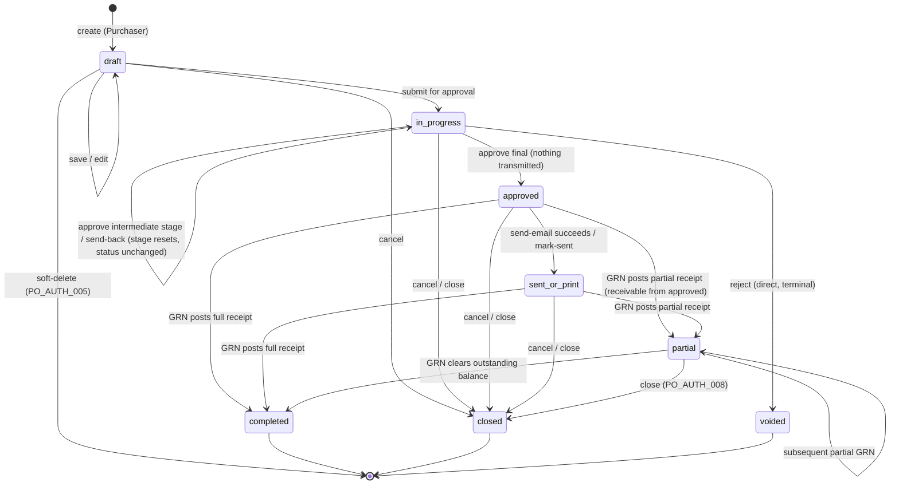

# ใบสั่งซื้อ (Purchase Order) — User Flow

> **At a Glance**
> **Module:** [purchase-order](/th/inventory/purchase-order) &nbsp;·&nbsp; **Personas:** Purchaser &nbsp;·&nbsp; Procurement Manager &nbsp;·&nbsp; Vendor &nbsp;·&nbsp; Receiver &nbsp;·&nbsp; Finance &nbsp;·&nbsp; Audit / Config
> **วงจรการทำงาน workflow:** `draft` → `in_progress` → `approved` → `sent_or_print` → `partial` → `completed` / `closed` (พร้อม branch `voided` จาก `in_progress`) — re-sync 2026-09-22 ให้ตรงกับการแยก `approved` / `sent_or_print`
> **ดูมุมมองแต่ละ persona ด้านล่างเพื่อรายละเอียดระดับ action**

## 1. ภาพรวม

หน้านี้คือ **จุดเริ่มต้นภาพรวม** สำหรับชุด user-flow ของโมดูล `purchase-order` Purchase Order (PO) คือเอกสารการผูกพัน procurement — header PO (`tb_purchase_order`) ร่วมกับบรรทัด detail หนึ่งหรือมากกว่าหนึ่งบรรทัด (`tb_purchase_order_detail`) — ที่สร้างด้วยมือ, จากใบขอซื้อ (Purchase Request) ที่อนุมัติแล้วหนึ่งใบขึ้นไป, หรือโดยตรงจาก vendor price list ซึ่งผูกพัน buyer กับ vendor ในราคา ปริมาณ และวันส่งของที่ fixed วงจรชีวิตใน Section 2 ครอบคลุมจากการสร้าง draft เริ่มต้นผ่าน internal approval (`approved`) การส่งให้ vendor (`sent_or_print` — ตอนนี้เป็นขั้นตอน **Send Email** / `mark-sent` ที่ชัดเจน ไม่ได้รวมอยู่ในการอนุมัติขั้นสุดท้ายอีกต่อไป) การรับบางส่วนหรือเต็มเทียบกับ PO และสุดท้ายการปิด (การ complete ปกติหรือการปิดก่อนกำหนด) Personas ที่เกี่ยวข้องคือ **Purchaser** (สร้างและ submit PO บริหาร amendments), **Procurement Manager** (ทำหน้าที่เป็นผู้อนุมัติใน workflow stage ที่กำหนดไว้; ถือสิทธิ์ delete-in-draft — `routing_rules` ของ workflow ที่ assign ให้สามารถ skip/กระโดดข้าม stage ตาม `total_amount` ได้จริง ยืนยันแล้ว ดู [02-business-rules.md](./02-business-rules.md) `PO_AUTH_004`; การตั้งค่า vendor-ranking ยังไม่ยืนยัน), **Vendor** (ฝ่ายภายนอกไม่มี system login — รับและ fulfil; ไม่พบฟีเจอร์การตอบรับในระบบหรือ invoice ที่ยืนยันได้), **Receiver** (รับสินค้าจริงและสร้าง GRN เทียบกับ PO), บทบาท **Finance** ที่ถูกระบุไว้ในเอกสารออกแบบรุ่นเก่าแต่ยังไม่ยืนยันใน source ปัจจุบัน, และ roles **Audit / Config** (Auditor สำหรับ read-only review, System Administrator สำหรับการตั้งค่า workflow และการเรียงเลข) Catalogue role เองนิยามใน [หน้าหลักโมดูล](/th/inventory/purchase-order) Section 4

Section 2 ด้านล่างคือ **global state machine** — list canonical ของ transitions ข้ามค่า `enum_purchase_order_doc_status` อิสระจากใครทำ ไฟล์ persona แต่ละไฟล์ (link จาก Section 3) อธิบาย *เส้นทางผ่าน* state machine ของ persona นั้น — entry point ของพวกเขา actions ที่ใช้ได้กับพวกเขา decision branches ที่พวกเขาเผชิญ และ handoff ที่จบการ involvement ของพวกเขา Section 4 จากนั้น summarise cross-persona handoffs ที่เย็บเส้นทางส่วนตัวเข้าด้วยกัน อ่านภาพรวมนี้ก่อนเพื่อ anchor วงจรชีวิต จากนั้นเจาะลึกไฟล์ persona ที่ตรงกับ role ของคุณ

## 2. วงจรชีวิตของเอกสาร

PO document status เก็บใน `tb_purchase_order.po_status` และจำกัดให้เป็นค่าที่ประกาศใน `enum_purchase_order_doc_status`: `draft`, `in_progress`, `voided`, `approved`, `sent_or_print`, `partial`, `closed`, `completed` (เพิ่ม `approved` และเปลี่ยนชื่อ `sent` เป็น `sent_or_print` เมื่อ 2026-09-14) Transitions ด้านล่างครอบคลุมการเคลื่อนไหวที่ถูกต้องระหว่างกัน; อย่างอื่นถูก reject โดย guard ของ service หมายเหตุว่า transitions ที่ driven โดย receipt (`{approved, sent_or_print} → partial → completed`) ถูก trigger โดย GRN postings ในโมดูลปลายน้ำ [good-receive-note](/th/inventory/good-receive-note) ไม่ใช่โดย action ผู้ใช้โดยตรงบน PO — และ GRN post กับ PO ที่ `approved` ได้ก่อนที่ใครจะส่งอีเมล

> ⚠️ **แก้ไข 2026-09-22:** diagram รุ่นก่อนหน้ารวมการอนุมัติกับการส่งเป็น edge เดียว `in_progress → sent` source HEAD แยกออกจากกัน: การอนุมัติขั้นสุดท้ายลงที่ `approved` (`purchase-order.logic.ts` `performApprove`) และ `sent_or_print` เข้าถึงได้เฉพาะเมื่อ `POST .../purchase-orders/:id/send-email` สำเร็จ หรือเรียก `POST .../purchase-orders/:id/mark-sent` (`markPoAsSent`, `updateMany where po_status = approved`) การรับของด้วย GRN ปลดล็อกที่ `approved` (`findOnePoForGrn`) การแก้ไขก่อนหน้ายังคงอยู่: send-back (`/review`) คง `po_status = in_progress` ไว้และรีเซ็ตเฉพาะ `workflow_current_stage`; เส้นทางเดียวไปยัง `voided` คือ transition แบบตรงและสิ้นสุด `in_progress → voided` ผ่าน `/reject`; การจบ PO จาก `draft`, `approved`, `sent_or_print`, หรือ `partial` ใช้ **Cancel** หรือ **Close** แทน (ทั้งคู่ลงเอยที่ `closed` โดยเขียนส่วนที่เหลือลงใน `cancelled_qty`) ไม่ใช่ `voided`

| จาก state | Action | ไปยัง state | อนุญาตสำหรับ | เงื่อนไขก่อน |
| ---------- | ------ | -------- | ----------- | -------------- |
| `(none)` | create | `draft` | Purchaser | ฟิลด์ header ถูก validate (`vendor_id`, `currency_id`, `order_date`, `delivery_date`, `workflow_id`); ต้องมีอย่างน้อยหนึ่งบรรทัดก่อน submission PR linkage เขียนเข้าตาราง bridge เมื่อมีต้นทางจาก PR; ไม่ต้องมี linkage สำหรับต้นทาง `manual` หรือ `pricelist` |
| `draft` | save (edit) | `draft` | Purchaser (owner) | PO ยังแก้ไขได้; ไม่มี workflow stage advance Header totals (`total_qty`, `total_price`, `total_tax`, `total_amount`) คำนวณใหม่ตอน save |
| `draft` | submit for approval | `in_progress` | Purchaser (owner) | อย่างน้อยบรรทัดที่ไม่ deleted หนึ่งบรรทัด; header ครบ; `workflow_id` ที่เลือก active สำหรับ scope `purchase-order` `last_action` ตั้งเป็น `submitted`; stage cursor advance ไปยัง stage approval แรก |
| `draft` | delete | `(none)` | เจ้าของเอกสาร (`created_by_id`) หรือ platform super-admin | Soft-delete เท่านั้น (`deleted_at` ตั้ง); อนุญาตเฉพาะตอน PO อยู่ใน `draft` (`remove()`: "Only draft purchase orders can be deleted" + `isDocumentOwner` / `isSuperAdmin`) |
| `draft` / `in_progress` / `approved` / `sent_or_print` | cancel | `closed` | ผู้ที่ถือ action นั้น (ไม่มี role gate นอกเหนือจาก authentication) | ถอน commitment; ทุกบรรทัด `cancelled_qty = order_qty − received_qty` (`cancel()`) ใช้จาก `partial` ไม่ได้ |
| `in_progress` | approve (stage นี้ ไม่ใช่ final) | `in_progress` | Current-stage approver | Approver อยู่ใน `user_action.execute[]` สำหรับ `workflow_current_stage`; `last_action` กลายเป็น `approved`; stage cursor advance การอนุญาตให้ดำเนินการที่ stage นี้คือ membership ใน `user_action.execute[]` เท่านั้น — ไม่มี amount threshold ใดมา gate ว่า *ใคร* อนุมัติได้ แต่ stage ถัดไปเองอาจขับเคลื่อนด้วย amount ได้: `routing_rules` ของ workflow อาจ skip หรือกระโดดข้าม stage ตาม `total_amount` (`PO_AUTH_004`) |
| `in_progress` | approve (final stage) | `approved` | ผู้ที่ถือ stage สุดท้ายของ workflow | `isFinalApproval` จาก `buildApproveWorkflow`; ตั้ง `approval_date`; `workflow_history` ได้ entry `completed` **ไม่มีการส่งอะไรออกไป** — PO รับของได้และส่งอีเมลได้แล้ว แต่ vendor ยังไม่เห็น |
| `approved` | send email ให้ vendor | `sent_or_print` | ผู้ที่เปิด dialog **Send Email** (`po-send-email-dialog.tsx`; ไม่มี role gate) | `POST .../:id/send-email` `{ profile_id, to[], cc[], subject, body, attach_pdf }` ผ่าน BU email profile; PDF แบบ optional render โดย micro-report; log `tb_activity` `email_sent` ทุกครั้ง; status ย้ายเฉพาะเมื่อ SMTP hand-off รายงาน `sent: true` ทำซ้ำได้จาก `sent_or_print` / `partial` / `closed` / `completed` (ส่งซ้ำ) ซึ่งแค่ log |
| `approved` | mark sent (พิมพ์ / แฟกซ์ / โทร) | `sent_or_print` | ผู้เรียก API (`POST .../:id/mark-sent`; ยังไม่มีปุ่ม React) | "Only approved orders can be marked as sent."; `tb_activity` "Marked as sent to vendor" |
| `in_progress` | send-back / review | `in_progress` (ไม่เปลี่ยน) | ผู้อนุมัติใด ๆ บนห่วงโซ่ | รีเซ็ต `workflow_current_stage` ไปยัง stage ก่อนหน้า (เช่น กลับไปยังผู้สร้าง); `po_status` ไม่เปลี่ยน เหตุผล (ถ้ามี) บันทึกเป็น comment |
| `in_progress` | reject | `voided` | ผู้อนุมัติใด ๆ บนห่วงโซ่ | Transition แบบตรงและสิ้นสุด — ไม่มี state ระหว่างทาง |
| `{in_progress, approved, sent_or_print, partial}` | close | `closed` | ผู้ใช้ที่ authenticate แล้วคนใดก็ได้ (header ของ React แสดง **Close** บน `approved` / `sent_or_print` เมื่อ `canClose`, `po-header.tsx` L128-131); ไม่มี role gate ใน `closePO()` | Vendor ไม่สามารถ supply ปริมาณที่เหลือ; open qty ที่เหลือ (`> 0`) เขียนลงใน `cancelled_qty`; แจ้งเตือน buyer |
| `approved` / `sent_or_print` | receive (partial) | `partial` | Receiver ผ่าน GRN posting (ต้องมี `can_use` ของ location) | อย่างน้อย PO line หนึ่งมี `received_qty > 0` แต่ `received_qty < order_qty − cancelled_qty` ข้าม PO State change คำนวณจาก GRN postings ระดับบรรทัด (`updatePoStatuses`) |
| `approved` / `sent_or_print` | receive (full) | `completed` | Receiver ผ่าน GRN posting | ทุกบรรทัดเป็นไปตาม `received_qty + cancelled_qty ≥ order_qty`; ทุกบรรทัดปิดผ่าน GRN ใน transaction เดียว |
| `partial` | receive (เพิ่มเติม) | `partial` | Receiver ผ่าน GRN posting | GRN ถัดไป post quantity เพิ่ม แต่ PO ยังมีอย่างน้อยหนึ่งบรรทัดที่เปิด; state ยังคงเป็น `partial` |
| `partial` | receive (final balance) | `completed` | Receiver ผ่าน GRN posting | GRN สุดท้าย clear outstanding balance บนทุกบรรทัด; PO transition ไปยัง normal completion |
| `completed` | (ไม่มี action เพิ่ม) | `completed` | — | Terminal state สำหรับเส้นทาง receipt ไม่พบฟีเจอร์ three-way-match / invoice ที่ยืนยันได้ใน source ปัจจุบันเพื่อ track ต่อจากนี้ |

## 3. สารบัญ Persona

แต่ละ persona ด้านล่างมีไฟล์ drill-down เฉพาะที่อธิบาย entry point, primary flow, decision branches, และ exit point Slugs ตรงกับ role ของ persona; การคลิก link เปิดมุมมองต่อ persona

- [Purchaser](./03-user-flow-purchaser.md) — สร้าง PO ด้วยมือ, โดยการแปลง PR ที่อนุมัติแล้ว (group ด้วย vendor + delivery date + currency), หรือจาก vendor price list; validate ราคา pricelist; submit; เมื่อ `approved` แล้ว ส่งอีเมล PO ให้ vendor (ขั้นตอนที่ไปถึง `sent_or_print`) และบริหารการติดตาม
- [Procurement Manager](./03-user-flow-procurement-manager.md) — ทำหน้าที่เป็นผู้อนุมัติใน workflow stage ที่กำหนดไว้ (กลไกทั่วไปเดียวกับผู้อนุมัติรายอื่น; `routing_rules` ของ workflow ที่ assign ให้สามารถ skip/กระโดดข้าม stage ตาม `total_amount` ได้จริง ยืนยันแล้ว, `PO_AUTH_004`); ถือสิทธิ์ delete-in-draft
- [Vendor](./03-user-flow-vendor.md) — ฝ่ายภายนอกไม่มี system login; รับ PO ทางอีเมล (พร้อม PDF แบบ optional) หรือการพิมพ์นอกระบบที่บันทึกผ่าน `mark-sent` และ fulfil การส่งของตามเงื่อนไขที่ตกลง ไม่พบฟีเจอร์การตอบรับในระบบหรือ invoice ที่ยืนยันได้
- [Receiver](./03-user-flow-receiver.md) — Receiver / Store Keeper + Inventory Manager รับสินค้าจริง สร้าง GRN เทียบกับ PO ที่ `approved` / `sent_or_print` / `partial` ทีละบรรทัด และ trigger receipt-state transitions `→ partial → completed`
- [Finance](./03-user-flow-finance.md) — ถูกระบุไว้ในเอกสารออกแบบรุ่นเก่าว่าเป็นผู้ review ก่อนส่งและเจ้าของ AP หลังรับของ; **ยังไม่ยืนยัน** ใน source ปัจจุบัน (ไม่พบ stage role แยกต่างหาก, การบันทึก invoice, หรือโค้ด AP-matching)
- [Audit / Config](./03-user-flow-audit-config.md) — Auditor (read-only review ของ POs, amendments, และ activity log) และ System Administrator (workflow stage configuration, RBAC, การเรียงเลข)

## 4. Handoffs ข้าม Persona

ตารางด้านล่าง capture moments ที่ PO เคลื่อนจากความรับผิดชอบของ persona หนึ่งไปยังอีก persona Handoff แต่ละครั้ง anchor ที่ document state ณ จุด transfer

| จาก persona | Trigger | ไปยัง persona | Document state ที่ handoff |
| ------------ | ------- | ---------- | ------------------------- |
| Purchaser | Submit for approval | ผู้อนุมัติ stage แรก | `in_progress` (stage cursor อยู่บน stage approval แรก) |
| Approver (stage N, ไม่ใช่ final) | Approve ที่ stage นี้ | Approver (stage N+1) | `in_progress` (stage cursor advance) |
| Approver (final stage) | Approve ที่ final stage | Purchaser (เพื่อส่ง) และ Receiver (อาจรับของได้แล้ว) | `approved` (workflow เสร็จ; ยังไม่ส่งอะไร) |
| Purchaser (หรือใครก็ได้ที่เปิด PO อยู่) | Send Email ให้ vendor / `mark-sent` | Vendor | `sent_or_print` (PO ส่งแล้ว; รอ GRN ครั้งแรก) |
| Approver (stage ใด ๆ) | Send-back / review พร้อมเหตุผล | Purchaser (หรือ stage ที่เฉพาะผู้สร้าง) | `in_progress` ไม่เปลี่ยน (รีเซ็ตเฉพาะ `workflow_current_stage` — ไม่ถึง `draft`) |
| Vendor | การส่งของจริง | Receiver | `approved` หรือ `sent_or_print` (state ระบบไม่เปลี่ยนจนกว่า GRN จะ post) |
| Receiver | Post GRN — partial fulfilment | Purchaser, Inventory Manager | `partial` (บรรทัดหนึ่งหรือมากกว่ายังเปิดอยู่) |
| Receiver | Post GRN — final balance | — | `completed` (ทุกบรรทัดรับครบ; ไม่พบ handoff invoice/AP ปลายน้ำที่ยืนยันได้) |
| Procurement Manager / Inventory Manager | Close PO ด้วย qty ที่เหลือเป็น cancelled | — (เป้าหมาย review close-out ยังไม่ยืนยัน) | `closed` (qty ที่เหลือเขียนเป็น `cancelled_qty`) |
| ผู้อนุมัติใด ๆ ที่ stage ปัจจุบัน | Reject (แบบตรงและสิ้นสุด) | Auditor (review หลังเกิดเหตุเท่านั้น) | `voided` (เข้าถึงได้เฉพาะจาก `in_progress`) |

## 5. แหล่งอ้างอิง

- `../carmen/docs/purchase-order-management/purchase-order-module.md` — แหล่ง carmen/docs หลักสำหรับ business analysis, state diagram, และ PO creation flows ให้ถือว่า claim เกี่ยวกับ state-machine และ role ในนั้นเป็นเจตนาการออกแบบทางประวัติศาสตร์ ไม่ใช่พฤติกรรมปัจจุบันที่ verify แล้ว — ดู [02-business-rules.md](./02-business-rules.md) § 5.1 สำหรับ mapping ที่แก้ไขแล้ว
- ส่วนคู่ขนาน: [01-data-model.md](./01-data-model.md) — ค่า `enum_purchase_order_doc_status` canonical ที่ใช้ใน Section 2 ข้างต้นและตาราง bridge ที่ carry PR→PO traceability
- ส่วนคู่ขนาน: [02-business-rules.md](./02-business-rules.md) — กฎ validation, authorization, posting, และ transition ที่อ้างอิงโดยแต่ละ row ของ Section 2
- โมดูลที่เกี่ยวข้อง: [purchase-request](/th/inventory/purchase-request) (ต้นทาง upstream ผ่าน PR→PO bridge), [good-receive-note](/th/inventory/good-receive-note) (fulfilment ปลายน้ำที่ขับเคลื่อน transitions `partial` / `completed`), [vendor-pricelist](/th/inventory/vendor-pricelist) (price snapshot ที่ PR-to-PO conversion time)
