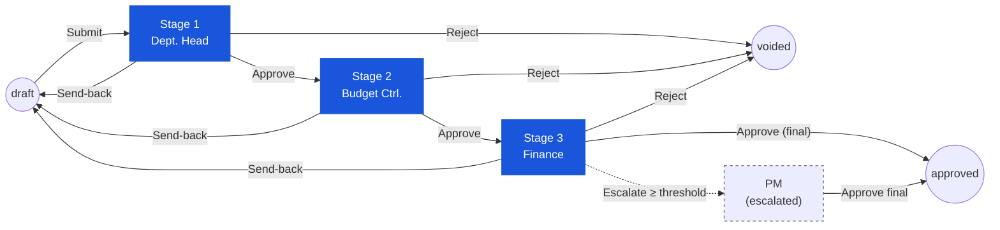

# ใบขอซื้อ (Purchase Request) — User Flow — Approver

> **At a Glance**
> **Persona:** Approver (Dept. Head / Budget Controller / Finance) &nbsp;·&nbsp; **โมดูล:** [purchase-request](/th/inventory/purchase-request) &nbsp;·&nbsp; **Stage ของ workflow:** in_progress (Stage 1 → Stage 2 → Stage 3 → approved) &nbsp;·&nbsp; **สิทธิ์สำคัญ:** approve / send-back / reject / split-reject, ปรับ approved_qty
> **persona นี้ทำอะไร:** review PR ที่ submit แล้วในแต่ละ stage อนุมัติและเดินหน้า, ส่งกลับ หรือยุติเอกสารผ่าน workflow

## 1. บทบาทในโมดูลนี้

**Approver** เป็น persona ร่ม ที่ครอบสาม decision-maker กลางใน chain อนุมัติของ PR — **Department Head** (Stage 1 approve), **Budget Controller** (Stage 2) และ **Finance Officer / Manager** (Stage 3) — ทั้งหมดใช้ UI review-and-decide เดียวกันแต่ apply มันกับเรื่องต่างกัน (เหตุผลของแผนก, ความพร้อมของ budget และความถูกต้องของผลกระทบทางการเงินตามลำดับ) ที่แต่ละ stage Approver เปิด PR ที่ submit แล้ว, review header และบรรทัด, ปรับ `approved_qty` ต่อบรรทัดได้แบบ optional และเลือกหนึ่งในสี่ action: **Approve** (เลื่อนไป stage ถัดไป), **Send Back** (ส่งกลับให้ Requestor ที่ `draft`), **Reject** (ยุติเอกสาร) หรือ **Split-Reject** (accept / reject ต่อบรรทัดเพื่อให้บรรทัดที่รอดต่อในขณะที่บรรทัดที่ถูก reject ถูกบันทึกด้วย `current_stage_status = rejected`) สถานะเอกสารยังคงเป็น `in_progress` สำหรับการอนุมัติกลางทุกครั้ง — `pr_status` พลิกเป็น `approved` เฉพาะเมื่อ stage **สุดท้าย** ผ่าน (ดู `PR_POST_004` / `PR_POST_005` ใน [02-business-rules.md](./02-business-rules.md)) Approver ไม่ใช่ส่วนของการ allocate vendor หรือการแปลงเป็น PO — สิทธิ์เหล่านั้นเป็นของ persona Procurement Manager / Purchaser ภายใต้ `enum_stage_role = purchase` (`PR_AUTH_008`)

### ตำแหน่งใน workflow (chain Approver highlighted)

### ตารางสิทธิ์ — Action × Stage Role (Approver)

ทั้งสาม sub-role ใช้ UI review-and-decide และชุด action เดียวกัน ความต่างมาจาก scope (visibility ของแผนก) และนโยบายที่แต่ละ stage บังคับใช้ สิทธิ์การแก้ scope เฉพาะฟิลด์ **Approved Qty / approved unit ระดับบรรทัด** ต่อ `PR_VAL_013`; ฟิลด์ vendor และ pricing เป็น read-only ทุก approve stage (`PR_AUTH_008` สงวนสำหรับ stage `purchase`)

| Action | Dept. Head (Stage 1) | Budget Controller (Stage 2) | Finance (Stage 3) |
|---|---|---|---|
| ดู PR ของแผนกตัวเอง | ✅ | ✅ (ทุกแผนก) | ✅ (ทุกแผนก) |
| ดู Items / Budget Impact / Activity Log | ✅ | ✅ | ✅ |
| Approve (เลื่อน stage) | ✅ | ✅ | ✅ |
| Send-back (พร้อมเหตุผล) | ✅ | ✅ | ✅ |
| Reject — ระดับ header (ยุติเป็น `voided`) | ✅ | ✅ | ✅ |
| Split-Reject — ระดับบรรทัด | ✅ | ✅ | ✅ |
| ปรับ `approved_qty` / `approved_unit` (ต่อ `PR_VAL_013`) | ✅ | ✅ | ✅ |
| Add Comment | ✅ | ✅ | ✅ |
| แก้ vendor / unit price / discount / tax / FOC | ❌ | ❌ | ❌ |
| Delete PR | ❌ | ❌ | ❌ |
| Convert to PO | ❌ | ❌ | ❌ |
| Override send-back ของ stage ก่อนหน้า | ❌ | ❌ | ❌ (เฉพาะ Procurement Manager) |

> ⚠️ **ความต่าง — bulk-toolbar กับ action ระดับแถว (BRD FR-PR-005A):** BRD ระบุปุ่ม **Approve / Reject / Send for Review** แบบ standalone ต่อแถวบน list / header ของ PR detail UI ปัจจุบันที่ live เปิด action เหล่านี้เป็น **bulk toolbar action** ใน Edit Mode เท่านั้น (ผ่าน dropdown Select All → bulk action toolbar) Bulk action ที่ยืนยันแล้ว: Approve, Reject, Send for Review (BRD "Return Selected"), Split ปุ่มระดับแถวแบบ standalone ยังไม่มี ที่มา: `Test_case/Purchase_Request/Approver/INDEX.md` (วันที่จับภาพ 2026-04-19) สถานะการตรวจสอบ: ยืนยันแล้วสำหรับ HOD; assumed สำหรับ FC / GM / Owner

## 2. จุดเริ่มต้นและ flow หลัก

**จุดเริ่มต้น:** Email / in-app notification "Purchase Request [PR-ID] Awaiting Your Approval" → คลิก deep link ซึ่งพาตรงไปยังหน้า PR detail หรือทางเลือก: Sidebar → โมดูล **Purchase Request** → คิว **My Approvals** (filter ไป PR ที่ผู้ใช้ปัจจุบันปรากฏใน `tb_purchase_request.user_action.execute[]` ของ stage ปัจจุบัน)

**Flow หลัก (happy path) — มุมมอง stage เดียว:**

1. จากคิว **My Approvals** (หรือ link notification) เลือก PR ที่รอตัดสิน คิวแสดง `pr_no`, requestor, แผนก, grand total ในสกุลเงินธุรกรรมและสกุลเงินฐาน, stage ปัจจุบันของ workflow และเวลาที่ PR รออยู่ คลิกเข้า PR เพื่อเปิดหน้า detail ใน read-mostly mode (header และบรรทัดแก้ไม่ได้สำหรับ Approver ยกเว้น `approved_qty` และ flag การตัดสินใจระดับบรรทัด)
2. Review **header**: ประเภท PR (`General Purchase` / `Market List` / `Asset`), requestor และแผนก, `pr_date`, วันส่งของที่ต้องการ, สกุลเงินและอัตราแลกเปลี่ยน, `workflow_name`, คำอธิบาย / เหตุผล และ attachment ใช้ panel **Activity Log** อ่าน comment ก่อนหน้า (note ของ Requestor, comment ของ Approver stage ก่อนหน้า, system event)
3. เปิดแท็บ **Items** และเดินทีละบรรทัด สำหรับแต่ละบรรทัดยืนยันสินค้า, store location, `requested_qty`, หน่วยนับ, ราคาต่อหน่วยประมาณ, จำนวน FOC, ส่วนลด, การจัดการภาษี, วันส่งของของบรรทัด และ note บรรทัด Approver ยังเห็นบริบท inventory (on-hand, on-order, reorder level, average monthly usage, ราคาซื้อล่าสุด) ที่ pull จาก [inventory](/th/inventory/inventory) แบบ live และบริบท preferred-vendor / pricelist ที่ pull จาก [vendor-pricelist](/th/inventory/vendor-pricelist)
4. เปิด panel **Budget Impact** ระบบแสดง availability ต่อแผนก / cost-centre / budget category สำหรับงวดที่เกี่ยวข้อง: total budget, soft commitment จาก PR นี้และ PR / PO อื่นที่เปิดอยู่, hard commitment และ `availableBudget` ผลลัพธ์ Budget Controller (Stage 2) ใส่ใจ panel นี้มากที่สุด แต่ Approver ทุกคนเห็นได้
5. ถ้าจำนวนต้องลดลง (เช่น budget แน่น, จำนวนที่ขอเกินนโยบาย, ต้องการ fulfilment บางส่วน) แก้ **`approved_qty`** บนบรรทัดที่ได้รับผลกระทบ ตาม `PR_VAL_013` ค่าใหม่ต้อง `> 0` และ `≤ requested_qty` หลังแปลง UoM; `approved_unit_id` และ `approved_unit_conversion_factor` ถูก persist ไปด้วย ยอด roll-up ของ header (`base_sub_total_amount`, `base_total_amount` ฯลฯ) คำนวณใหม่เมื่อ save
6. ตัดสิน **disposition ต่อบรรทัด** ถ้าต้องการ split-reject: mark บรรทัดเดี่ยวเป็น **accept** (default) หรือ **reject** บรรทัดที่ reject ต้องมีเหตุผล บรรทัดที่ accept ที่เหลือเดินต่อใน workflow; บรรทัดที่ reject ยังอยู่บนเอกสารด้วย `current_stage_status = rejected` และไม่ถึงการแปลงเป็น PO (`PR_AUTH_003`)
7. เลือก **action ระดับ header** จาก action bar: **Approve**, **Send Back**, **Reject** หรือ (เมื่ออย่างน้อยหนึ่งบรรทัด mark reject และอื่น ๆ accept) ระบบถือ action Approve เป็น commit **Split-Reject** สำหรับ Send Back และ Reject ระบบ prompt เหตุผล mandatory; สำหรับ Approve comment เป็น optional
8. ยืนยัน action ใน dialog ระบบรันเช็คการให้สิทธิ์ (`PR_AUTH_002` — ผู้ใช้ปัจจุบันต้องอยู่ใน `user_action.execute[]` ของ stage ปัจจุบัน; `PR_VAL_013` บน `approved_qty` ที่แก้)
9. เมื่อกด **Approve** ที่ stage กลาง: ระบบใช้ `PR_POST_004` — append `workflow_history`, อัปเดต `workflow_previous_stage` / `workflow_current_stage` / `workflow_next_stage`, set `last_action = approved` และ `last_action_by_*` เป็นผู้ใช้ปัจจุบัน, คำนวณ `user_action.execute[]` ใหม่สำหรับ stage ถัดไปจากกฎ threshold และ routing ใน `tb_workflow` และแจ้งผู้อนุมัติ stage ถัดไป `pr_status` ยังคง `in_progress` Soft budget commitment ยังอยู่
10. เมื่อกด **Approve** ที่ **stage สุดท้าย**: `PR_POST_005` พลิก `pr_status` จาก `in_progress` เป็น `approved`, stepper ของ workflow mark chain เสร็จ, notification ไปที่ Requestor ("Approved") และคิวของ Purchaser และ PR เข้าเกณฑ์การแปลงเป็น PO Soft commitment ยังอยู่จนกว่า Purchaser สร้าง PO ซึ่งจุดนั้นแปลงเป็น hard commitment (ดู [purchase-order](/th/inventory/purchase-order))
11. Approver กลับไปคิว **My Approvals** ซึ่ง PR ที่เพิ่งตัดสินใจหายไป Action และ comment ใด ๆ ปรากฏใน log `tb_purchase_request_comment` ของ PR แบบ immutable (`PR_POST_008`)

## 3. แขนงการตัดสินใจ

- **ถ้า Approver เลือก Send Back** แทน Approve: dialog ต้องการเหตุผล เมื่อยืนยัน ระบบใช้ `PR_POST_003` และย้าย `workflow_current_stage` ก่อนหน้าหนึ่ง stage; เนื่องจาก Stage 1 เป็น requestor-create stage send-back จาก Stage 1 จริง ๆ แล้วส่ง PR กลับไป `draft` ให้ Requestor แก้และ resubmit ปล่อย soft budget commitment Send-back จาก Stage 2 หรือ Stage 3 อาจส่ง PR กลับไป stage อนุมัติก่อนหน้าหรือกลับไปถึง Requestor ทั้งหมดขึ้นกับ workflow configuration Notification ถูก fire ไปยังผู้ใช้ที่ stage ใหม่ (ก่อนหน้า) การมีส่วนร่วมของ Approver จบที่นี่
- **ถ้า Approver เลือก Reject ระดับ header** (PR ทั้งใบไม่สมเหตุผล, duplicate หรือไม่ยอมรับด้วยเหตุอื่น): dialog ต้องการเหตุผล เมื่อยืนยัน `PR_AUTH_004` + `PR_POST_006` ใช้: `pr_status` ย้ายเป็น `voided` (terminal), soft budget commitment ถูกปล่อย, `workflow_history` ถูก append และ comment `type = system` จับการ reject Requestor ได้รับแจ้งและ chain จบ — ไม่มี stage ถัดไปทำงาน
- **ถ้า Approver ต้องการ accept บางบรรทัดและ reject บรรทัดอื่น (Split-Reject)**: แก้ disposition ต่อบรรทัดใน Step 6 ด้านบน, mark บรรทัดที่ได้รับผลกระทบเป็น reject พร้อมเหตุผล แล้ว commit Approve ที่ header ระบบบันทึก `current_stage_status = rejected` บนแต่ละบรรทัดที่ reject (`PR_AUTH_003`) และเลื่อน PR ไป stage ถัดไปด้วยบรรทัดที่ accept เท่านั้นที่นับเข้า budget และยอดรวมของการอนุมัติถัดไป บรรทัดที่ reject ยังเห็นได้บนเอกสารสำหรับ audit และไม่แปลงเป็น PO เลย
- **ถ้า Approver ปรับ `approved_qty` ลง**: roll-up ของ header คำนวณใหม่, `base_total_amount` ใหม่คือสิ่งที่ stage ถัดไปและ budget check เห็น และ soft budget commitment ถูก rebalance ถ้ายอดใหม่ข้าม threshold ที่ตั้งใน `tb_workflow` การ routing สำหรับ stage *ถัดไป* อาจเปลี่ยน (เช่น PR จำนวนเงินน้อยอาจข้าม Stage 4 ตาม `PR_AUTH_005`)
- **ถ้า `base_total_amount` ของ PR เกิน threshold escalation ที่ตั้งไว้**: ตาม `PR_AUTH_005` อาจมีการเพิ่ม stage หรือเส้นทาง escalation ไปยัง **Procurement Manager** Approver ยังทำ stage ของตัวเองตามปกติ; logic threshold ทำงานอัตโนมัติบนการ transition stage และ reroute notification ถัดไป Approver ไม่เห็น threshold breach เป็น error — workflow engine จัดการเอง
- **ถ้า Approver ไม่อยู่ชั่วคราว** และ delegate stage ของตน: ตาม `PR_AUTH_006` ผู้ใช้ delegate สืบทอดสิทธิ์ approve / send-back / reject / split-reject เดียวกันเฉพาะช่วง delegation `last_action_by_id` สะท้อน delegate ขณะที่ audit comment จับแหล่งที่มาของ delegation จากมุมมอง UI ของ delegate flow เหมือนกับ Section 2
- **ถ้า Approver พยายามลงมือกับ PR ที่ตนไม่มีสิทธิ์** (ไม่อยู่ใน `user_action.execute[]` ของ stage ปัจจุบัน หรือ PR อยู่ stage หลังกว่าแล้ว): ปุ่ม action ถูก disable และข้อความ inline อธิบาย `PR_AUTH_002` บังคับใช้ฝั่ง server ด้วย

## 4. จุดออก / Handoff

การมีส่วนร่วมของ Approver จบในขณะที่ commit การตัดสินใจระดับ header ใน Section 2 step 8 เอกสารไปไหนต่อขึ้นกับการตัดสินใจที่เลือก:

- **Approve ของ stage กลาง** (Stage 1 หรือ Stage 2 หรือ Stage 3 เมื่อ Stage 4 ยังทำงาน): `pr_status` ยังคง `in_progress`; `workflow_current_stage` เลื่อนไป; handoff ไปยัง **Approver stage ถัดไป** (Budget Controller, Finance หรือ Procurement Manager ตามลำดับ) Soft budget commitment ยังอยู่
- **Approve ของ stage สุดท้าย** (stage `approve` สุดท้ายผ่าน ก่อน stage `purchase`): `pr_status` พลิกเป็น `approved` (`PR_POST_005`); handoff ไปยังคิว **Purchaser / Procurement Manager** สำหรับ vendor allocation และการแปลงเป็น PO PR ยังคงเป็น `approved` จนกว่าทุกบรรทัดจะถูก bridge เต็มกับ PO หรือยกเลิก ซึ่งจุดนั้น `pr_status` พลิกเป็น `completed` (`PR_POST_007`) Soft commitment ยังอยู่จนกว่าการสร้าง PO จะแปลงเป็น hard commitment
- **Send Back** (stage ใดก็ตาม): `pr_status` ยังคง `in_progress` แต่ `workflow_current_stage` ย้ายไปก่อนหน้าหนึ่ง stage; ถ้า stage นั้นเป็น create stage ของ Requestor เอกสารกลับเป็น `draft` และ **Requestor** เป็นคนรับต่อที่ [03-user-flow-requestor.md](./03-user-flow-requestor.md) Section 2 step 2 Soft budget commitment ถูกปล่อยจนกว่าจะ submit ใหม่
- **Header Reject** (stage ใดก็ตาม): `pr_status` พลิกเป็น `voided` (terminal, `PR_POST_006`); soft budget commitment ถูกปล่อย; **Auditor** review หลังเหตุการณ์แต่ไม่มี action ของผู้ใช้เพิ่มเติม Requestor เห็นการยกเลิกใน dashboard **My PRs**
- **Escalation ตาม threshold**: `pr_status` ยังคง `in_progress`; workflow engine แทรก (หรือ re-route ไปยัง) stage เพิ่มที่ **Procurement Manager** เป็นเจ้าของ Approver ปัจจุบันออกแล้ว; Procurement Manager รับต่อจากคิว My Approvals ของตัวเองด้วย flow Section 2 เดียวกัน

สถานะเอกสารบนการ transition ทุกครั้งบันทึกโดย `enum_purchase_request_doc_status = { draft, in_progress, voided, approved, completed }` และ workflow timeline ใน `workflow_history` การ void (`pr_status → voided`) สงวนสำหรับ Finance หรือ system-admin ต่อ `PR_AUTH_007` และไม่ใช่ส่วนของ flow Approver มาตรฐาน

## 5. แหล่งอ้างอิง

- ภาพรวมหลัก: [03-user-flow.md](./03-user-flow.md)
- กฎการให้สิทธิ์: [02-business-rules.md](./02-business-rules.md) Section 4 — `PR_AUTH_001`–`PR_AUTH_008`, stage chain, delegation, threshold routing
- กฎการ posting: [02-business-rules.md](./02-business-rules.md) Section 5 — `PR_POST_003` (send-back), `PR_POST_004` (intermediate approve), `PR_POST_005` (final approve), `PR_POST_006` (reject / void / cancel)
- `../carmen/docs/purchase-request-management/PR-User-Experience.md` — แหล่งหลักของ sequence กระบวนการอนุมัติ, flow UI ของ Approver และตารางสิทธิ์ต่อ stage
- `../carmen/docs/purchase-request-management/PR-Overview.md` — ภาพรวมโมดูล, นิยาม role ผู้อนุมัติ (Department Head, Budget Controller, Finance) และจุด integration
- `../carmen/docs/purchase-request-management/purchase-request-module-prd.md` — product requirement ที่ขับเคลื่อน chain อนุมัติหลายระดับและการ routing ตาม threshold
- หน้าพี่น้อง: [01-data-model.md](./01-data-model.md) — `tb_purchase_request.workflow_current_stage`, `stages_status`, `user_action`, `workflow_history`, `enum_purchase_request_doc_status`
- หน้าพี่น้อง: [03-user-flow-requestor.md](./03-user-flow-requestor.md) — persona ต้นน้ำ; รับ PR ที่ส่งกลับผ่าน Send Back
- หน้าพี่น้อง: [หน้าหลักโมดูล](/th/inventory/purchase-request) Section 4 — คำอธิบาย role ของ Approver ตามมาตรฐานและ stage chain
