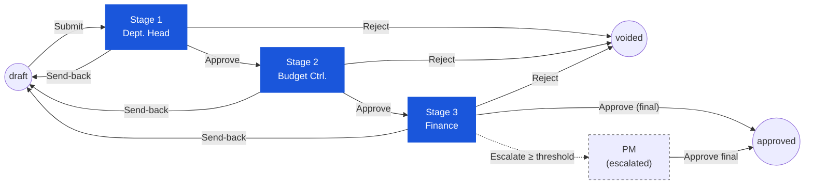

# ใบขอซื้อ (Purchase Request) — User Flow — Approver

> **At a Glance**
> **Persona:** Approver (stage role `approve` ใดก็ได้ — แสดงตัวอย่างเป็น Dept. Head / Budget Controller / Finance) &nbsp;·&nbsp; **โมดูล:** [purchase-request](/th/inventory/purchase-request) &nbsp;·&nbsp; **Stage ของ workflow:** in_progress (Stage 1 → Stage 2 → Stage 3 → approved) &nbsp;·&nbsp; **สิทธิ์สำคัญ:** approve / send-back / reject / split, ปรับ approved_qty &nbsp;·&nbsp; **ตรวจสอบซ้ำ 2026-09-22:** send-back คง `pr_status = in_progress`; `approved_qty` ถูกเช็คแค่ ≥ 0; panel "Budget Impact" และ budget commitment ไม่มี code path
> **persona นี้ทำอะไร:** review PR ที่ submit แล้วในแต่ละ stage อนุมัติและเดินหน้า, ส่งกลับ หรือยุติเอกสารผ่าน workflow

## 1. บทบาทในโมดูลนี้

**Approver** เป็น persona ร่ม ที่ครอบสาม decision-maker กลางใน chain อนุมัติของ PR — **Department Head** (Stage 1 approve), **Budget Controller** (Stage 2) และ **Finance Officer / Manager** (Stage 3) — ทั้งหมดใช้ UI review-and-decide เดียวกันแต่ apply มันกับเรื่องต่างกัน (เหตุผลของแผนก, ความพร้อมของ budget และความถูกต้องของผลกระทบทางการเงินตามลำดับ) ที่แต่ละ stage Approver เปิด PR ที่ submit แล้ว, review header และบรรทัด, ปรับ `approved_qty` ต่อบรรทัดได้แบบ optional และเลือกหนึ่งในสี่ action: **Approve** (เลื่อนไป stage ถัดไป), **Send Back** (ย้าย cursor ของ stage กลับไป stage ก่อนหน้าที่เลือก — PR คงอยู่ที่ `in_progress`), **Reject** (ยุติเอกสาร) หรือ **Split** (accept / reject ต่อบรรทัดเพื่อให้บรรทัดที่รอดต่อในขณะที่บรรทัดที่ถูก reject ถูกบันทึกด้วย `current_stage_status = rejected`) สถานะเอกสารยังคงเป็น `in_progress` สำหรับการอนุมัติกลางทุกครั้ง — `pr_status` พลิกเป็น `approved` เฉพาะเมื่อ stage **สุดท้าย** ผ่าน (ดู `PR_POST_004` / `PR_POST_005` ใน [02-business-rules.md](./02-business-rules.md)) Approver ไม่ใช่ส่วนของการ allocate vendor หรือการแปลงเป็น PO — สิทธิ์เหล่านั้นเป็นของ persona Procurement Manager / Purchaser ภายใต้ `enum_stage_role = purchase` (`PR_AUTH_008`)

### ตำแหน่งใน workflow (chain Approver highlighted)

```mermaid
graph LR
    draft(("draft")) -->|"Submit"| s1["Stage 1<br/>Dept. Head"]:::current
    s1 -->|"Approve"| s2["Stage 2<br/>Budget Ctrl."]:::current
    s2 -->|"Approve"| s3["Stage 3<br/>Finance"]:::current
    s3 -->|"Approve (final)"| approved(("approved"))
    s1 -->|"Send-back"| draft
    s2 -->|"Send-back"| draft
    s3 -->|"Send-back"| draft
    s1 -->|"Reject"| voided(("voided"))
    s2 -->|"Reject"| voided
    s3 -->|"Reject"| voided
    s3 -.->|"Escalate ≥ threshold"| pm["PM<br/>(escalated)"]:::escalated
    pm -->|"Approve final"| approved
    classDef current fill:#1a56db,color:#fff,stroke:#1a56db;
    classDef escalated stroke-dasharray: 4 4,stroke:#555;
```

### ตารางสิทธิ์ — Action × Stage Role (Approver)

ทั้งสาม sub-role ใช้ UI review-and-decide และชุด action เดียวกัน ความต่างมาจาก scope (visibility ของแผนก) และนโยบายที่แต่ละ stage บังคับใช้ สิทธิ์การแก้ scope เฉพาะฟิลด์ **Approved Qty / approved unit ระดับบรรทัด** (บวก note ของรายการและ delivery point — E2E `TC-PR-0604xx`); ฟิลด์ vendor และ pricing เป็น read-only ทุก approve stage (stage `purchase` เป็นเจ้าของ) server ปฏิเสธเฉพาะ `approved_qty` ติดลบหรือหน่วยที่ไม่ใช่ order unit และเฉพาะผ่าน `POST …/verify` (`PR_VAL_013`)

| Action | Dept. Head (Stage 1) | Budget Controller (Stage 2) | Finance (Stage 3) |
|---|---|---|---|
| ดู PR ของแผนกตัวเอง | ✅ | ✅ (ทุกแผนก) | ✅ (ทุกแผนก) |
| ดู Items / Workflow History / Comments | ✅ | ✅ | ✅ |
| Approve (เลื่อน stage) | ✅ | ✅ | ✅ |
| Send-back (พร้อมเหตุผล) | ✅ | ✅ | ✅ |
| Reject — ระดับ header (ยุติเป็น `voided`) | ✅ | ✅ | ✅ |
| Split — ระดับบรรทัด (`POST …/:id/split`) | ✅ | ✅ | ✅ |
| ปรับ `approved_qty` / `approved_unit` (≥ 0, `PR_VAL_013`) | ✅ | ✅ | ✅ |
| Add Comment | ✅ | ✅ | ✅ |
| แก้ vendor / unit price / discount / tax / FOC | ❌ | ❌ | ❌ |
| Delete PR | ❌ | ❌ | ❌ |
| Convert to PO | ❌ | ❌ | ❌ |
| Override send-back ของ stage ก่อนหน้า | ❌ | ❌ | ❌ (เฉพาะ Procurement Manager) |

> ⚠️ **ความต่าง — bulk-toolbar กับ action ระดับแถว (BRD FR-PR-005A):** BRD ระบุปุ่ม **Approve / Reject / Send for Review** แบบ standalone ต่อแถวบน list / header ของ PR detail UI ปัจจุบันที่ live เปิด action เหล่านี้เป็น **bulk toolbar action** ใน Edit Mode เท่านั้น (ผ่าน dropdown Select All → bulk action toolbar) Bulk action ที่ยืนยันแล้ว: Approve, Reject, Send for Review (BRD "Return Selected"), Split ปุ่มระดับแถวแบบ standalone ยังไม่มี ที่มา: `Test_case/Purchase_Request/Approver/INDEX.md` (วันที่จับภาพ 2026-04-19) สถานะการตรวจสอบ: ยืนยันแล้วสำหรับ HOD; assumed สำหรับ FC / GM / Owner

## 2. จุดเริ่มต้นและ flow หลัก

**จุดเริ่มต้น:** In-app notification → deep link ไปยังหน้า PR detail หรือทางเลือก: Sidebar → **My Approval** (`/procurement/approval` คิวข้ามเอกสารที่อ่านจาก `sys_v_my_pending` — ดู [my-approval](/th/inventory/purchase-request/my-approval)) หรือ Sidebar → **Purchase Request** → แท็บ **My Pending** (`GET /api/my-pending/purchase-requests`); ทั้งสองแสดง PR ที่ผู้ใช้ปัจจุบันปรากฏใน `tb_purchase_request.user_action.execute[]` ของ stage ปัจจุบัน

**Flow หลัก (happy path) — มุมมอง stage เดียว:**

1. จากคิว **My Approval** (หรือ link notification) เลือก PR ที่รอตัดสิน คิวแสดง `doc_no`, ประเภท, วันที่ และสถานะ เอกสารเก่าสุดก่อน; แท็บ My Pending ของ list PR แสดง requestor, แผนก, stage และยอดรวมเพิ่มเติม คลิกเข้า PR เพื่อเปิดหน้า detail ใน read-mostly mode (header และบรรทัดแก้ไม่ได้สำหรับ Approver ยกเว้น `approved_qty` และ flag การตัดสินใจระดับบรรทัด)
2. Review **header**: requestor และแผนก, `pr_date`, `workflow_name`, คำอธิบาย, `doc_version` ใช้ sheet **Workflow History** และ sheet **comment** อ่าน comment ก่อนหน้า (note ของ Requestor, comment ของ Approver stage ก่อนหน้า, system event) *(ไม่มีประเภท PR หรือวันส่งของระดับ header — ดู [01-data-model](./01-data-model.md) §5)*
3. เปิดแท็บ **Items** และเดินทีละบรรทัด สำหรับแต่ละบรรทัดยืนยันสินค้า, store location, delivery point และวันที่, `requested_qty` + หน่วย, จำนวน FOC และ note บรรทัด; ราคาต่อหน่วย / vendor / ส่วนลด / ภาษี เห็นได้แต่ read-only Approver ยังเห็นบริบท inventory (on-hand, on-order, ข้อมูลการรับของล่าสุด และ `last_price` ของบรรทัด) ที่ pull จาก [inventory](/th/inventory/inventory) แบบ live
4. *(panel **Budget Impact** พร้อม `availableBudget` เคยระบุในเอกสารรุ่นก่อน — ยังไม่ยืนยัน ไม่มี code path ดู `PR_VAL_015`)* Review ยอดรวมใน footer: subtotal, discount, net, tax, grand total (`workflow/pr-footer-action.tsx`)
5. ถ้าจำนวนต้องลดลง (จำนวนที่ขอเกินนโยบาย, ต้องการ fulfilment บางส่วน) คลิก **Edit** และเปลี่ยน **`approved_qty`** บนบรรทัดที่ได้รับผลกระทบ schema ฝั่ง client รับ `≥ 0`; server (`verify`, `stage_role = approve`) ปฏิเสธเฉพาะค่าติดลบหรือหน่วยอนุมัติที่ไม่ใช่ order unit ของสินค้า — **ไม่มี**การเช็ค `≤ requested_qty` (`PR_VAL_013`) `approved_unit_id` และ `approved_unit_conversion_factor` ถูก persist ไปด้วย และ roll-up ของ header คำนวณใหม่เมื่อ save
6. ตัดสิน **disposition ต่อบรรทัด** ถ้าต้องการ split: เลือกบรรทัดที่จะเก็บแล้วใช้ bulk action **Split**; บรรทัดที่เลือกถูกย้ายไป PR ใหม่ (`POST …/:id/split`) ที่เหลือคงอยู่ บรรทัดที่ reject ยังอยู่บนเอกสารด้วย `current_stage_status = rejected` และไม่ถึงการแปลงเป็น PO (`PR_AUTH_003`)
7. เลือก action จาก footer / bulk toolbar: **Approve**, **Send Back**, **Reject** หรือ **Split** สำหรับ Send Back และ Reject dialog (`workflow/pr-action-dialog.tsx`) prompt เหตุผล mandatory (Send Back ถาม stage เป้าหมายจาก `GET …/:pr_id/previous-stages` ด้วย); สำหรับ Approve comment เป็น optional
8. ยืนยัน action ใน dialog ระบบรันเช็คการให้สิทธิ์ (`PR_AUTH_002` — ผู้ใช้ปัจจุบันต้องอยู่ใน `user_action.execute[]` ของ stage ปัจจุบัน) และ lock `doc_version` (`PR_VAL_016`) frontend อาจเรียก `POST …/verify` ด้วย `verify_state = approve` ก่อนเพื่อ list ทุกปัญหาในครั้งเดียว (`PR_VAL_017`)
9. เมื่อกด **Approve** ที่ stage กลาง: ระบบใช้ `PR_POST_004` — append `workflow_history`, อัปเดต `workflow_previous_stage` / `workflow_current_stage` / `workflow_next_stage`, set `last_action = approved` และ `last_action_by_*` เป็นผู้ใช้ปัจจุบัน, คำนวณ `user_action.execute[]` ใหม่สำหรับ stage ถัดไปจากกฎ routing ใน `tb_workflow` และแจ้งผู้อนุมัติ stage ถัดไป `pr_status` ยังคง `in_progress`
10. เมื่อกด **Approve** ที่ **stage สุดท้าย**: `PR_POST_005` พลิก `pr_status` จาก `in_progress` เป็น `approved` (`purchase-request.service.ts:1913`), workflow history mark chain เสร็จ, notification ไปที่ Requestor และ PR เข้าเกณฑ์การแปลงเป็น PO (ดู [purchase-order](/th/inventory/purchase-order))
11. Approver กลับไปคิว **My Approval** ซึ่ง PR ที่เพิ่งตัดสินใจหายไป (view ยกเว้น `approved` และการ transition stage เขียน `execute[]` ใหม่) Action และ comment ใด ๆ ปรากฏใน log `tb_purchase_request_comment` ของ PR แบบ immutable (`PR_POST_008`)

## 3. แขนงการตัดสินใจ

- **ถ้า Approver เลือก Send Back** แทน Approve: dialog ต้องการเหตุผลและ stage เป้าหมาย (stage ก่อนหน้าใดก็ได้ `GET …/:pr_id/previous-stages`) เมื่อยืนยัน ระบบใช้ `PR_POST_003`: `workflow_current_stage` ย้ายไปเป้าหมาย, `last_action = reviewed` และ `pr_status` ถูกเขียนเป็น `in_progress` — แม้เป้าหมายเป็น create stage ของ requestor PR ก็**ไม่**กลับไป `draft` (`purchase-request.service.ts:2052`) Notification ถูก fire ไปยังผู้ใช้ที่ stage เป้าหมาย การมีส่วนร่วมของ Approver จบที่นี่
- **ถ้า Approver เลือก Reject ระดับ header** (PR ทั้งใบไม่สมเหตุผล, duplicate หรือไม่ยอมรับด้วยเหตุอื่น): dialog ต้องการเหตุผล เมื่อยืนยัน `PR_AUTH_004` + `PR_POST_006` ใช้: `pr_status` ย้ายเป็น `voided` (terminal), `workflow_history` ถูก append และ comment `type = system` จับการ reject Requestor ได้รับแจ้งและ chain จบ — ไม่มี stage ถัดไปทำงาน
- **ถ้า Approver ต้องการ accept บางบรรทัดและ reject บรรทัดอื่น (Split)**: เลือกบรรทัดแล้วใช้ bulk **Split** (`POST …/:id/split`) เพื่อให้บรรทัดที่เลือกเดินต่อบน PR ใหม่ขณะที่ที่เหลือคงอยู่ หรือ reject บรรทัดเดี่ยวเพื่อให้มี `current_stage_status = rejected` (`PR_AUTH_003`) บรรทัดที่ reject ยังเห็นได้บนเอกสารสำหรับ audit และไม่แปลงเป็น PO เลย
- **ถ้า Approver ปรับ `approved_qty`**: roll-up ของ header คำนวณใหม่ และ `total_amount` ใหม่คือสิ่งที่ stage ถัดไปเห็น ถ้ายอดใหม่ข้าม threshold ที่ตั้งใน `tb_workflow` การ routing สำหรับ stage *ถัดไป* อาจเปลี่ยน (เช่น PR จำนวนเงินน้อยอาจข้าม Stage 4 ตาม `PR_AUTH_005`)
- **ถ้า `base_total_amount` ของ PR เกิน threshold escalation ที่ตั้งไว้**: ตาม `PR_AUTH_005` อาจมีการเพิ่ม stage หรือเส้นทาง escalation ไปยัง **Procurement Manager** Approver ยังทำ stage ของตัวเองตามปกติ; logic threshold ทำงานอัตโนมัติบนการ transition stage และ reroute notification ถัดไป Approver ไม่เห็น threshold breach เป็น error — workflow engine จัดการเอง
- **ถ้า Approver ไม่อยู่ชั่วคราว**: **(ยังไม่ยืนยัน — ไม่พบโค้ด delegation)** เอกสารรุ่นก่อนหน้าระบุว่า Approver delegate stage ของตนได้ตาม `PR_AUTH_006` โดย delegate สืบทอดสิทธิ์ approve / send-back / reject / split-reject เฉพาะช่วง delegation window, `last_action_by_id` สะท้อน delegate, และ audit comment จับแหล่งที่มาของ delegation การค้นหาทั่ว repo ทั้ง workflow admin ฝั่ง frontend และ backend workflow orchestrator ไม่พบกลไก delegation, reassignment, proxy หรือ substitute-approver เลย วิธีเดียวที่ยืนยันได้ว่าทำให้ chain เดินต่อได้เมื่อ Approver หลักไม่อยู่คือให้ผู้ใช้อีกคนที่อยู่ใน `user_action.execute[]` ของ stage นั้นอยู่แล้ว (เช่น `assigned_users` รายที่สองที่ตั้งไว้บน stage) ลงมือแทน หรือให้ System Administrator แก้ assigned users ของ stage ผ่าน `/system-admin/workflow`
- **ถ้า Approver พยายามลงมือกับ PR ที่ตนไม่มีสิทธิ์** (ไม่อยู่ใน `user_action.execute[]` ของ stage ปัจจุบัน หรือ PR อยู่ stage หลังกว่าแล้ว): ปุ่ม action ถูก disable และข้อความ inline อธิบาย `PR_AUTH_002` บังคับใช้ฝั่ง server ด้วย

## 4. จุดออก / Handoff

การมีส่วนร่วมของ Approver จบในขณะที่ commit การตัดสินใจระดับ header ใน Section 2 step 8 เอกสารไปไหนต่อขึ้นกับการตัดสินใจที่เลือก:

- **Approve ของ stage กลาง** (Stage 1 หรือ Stage 2 หรือ Stage 3 เมื่อ Stage 4 ยังทำงาน): `pr_status` ยังคง `in_progress`; `workflow_current_stage` เลื่อนไป; handoff ไปยัง **Approver stage ถัดไป** (Budget Controller, Finance หรือ Procurement Manager ตามลำดับ)
- **Approve ของ stage สุดท้าย** (stage สุดท้ายผ่าน): `pr_status` พลิกเป็น `approved` (`PR_POST_005`); handoff ไปยังผู้ที่รัน dialog Convert-to-PO PR ยังคงเป็น `approved` จนกว่าทุกบรรทัดจะถูก bridge เต็มกับ PO ซึ่งจุดนั้น `pr_status` พลิกเป็น `completed` (`PR_POST_007`)
- **Send Back** (stage ใดก็ตาม): `pr_status` ยังคง `in_progress` และ `workflow_current_stage` ย้ายไป stage ก่อนหน้าที่เลือก; ถ้า stage นั้นเป็น create stage ของ Requestor **Requestor** เป็นคนรับต่อที่ [03-user-flow-requestor.md](./03-user-flow-requestor.md) Section 2 step 2 — ยังคงเป็นเอกสาร `in_progress`
- **Header Reject** (stage ใดก็ตาม): `pr_status` พลิกเป็น `voided` (terminal, `PR_POST_006`); **Auditor** review หลังเหตุการณ์แต่ไม่มี action ของผู้ใช้เพิ่มเติม Requestor เห็นสถานะบน list PR
- **Escalation ตาม threshold**: `pr_status` ยังคง `in_progress`; workflow engine แทรก (หรือ re-route ไปยัง) stage เพิ่มที่ **Procurement Manager** เป็นเจ้าของ Approver ปัจจุบันออกแล้ว; Procurement Manager รับต่อจากคิว My Approval ของตัวเองด้วย flow Section 2 เดียวกัน

สถานะเอกสารบนการ transition ทุกครั้งบันทึกโดย `enum_purchase_request_doc_status = { draft, in_progress, voided, approved, completed }` และ workflow timeline ใน `workflow_history` ไม่มี void โดยผู้ดูแลระบบ — `voided` ถูกเขียนโดย Reject เท่านั้น (`PR_AUTH_007` ยังไม่ยืนยัน)

## 5. แหล่งอ้างอิง

- ภาพรวมหลัก: [03-user-flow.md](./03-user-flow.md)
- กฎการให้สิทธิ์: [02-business-rules.md](./02-business-rules.md) Section 4 — `PR_AUTH_001`–`PR_AUTH_008`, stage chain, threshold routing (ยืนยันแล้ว); delegation (`PR_AUTH_006`, ยังไม่ยืนยัน)
- กฎการ posting: [02-business-rules.md](./02-business-rules.md) Section 5 — `PR_POST_003` (send-back), `PR_POST_004` (intermediate approve), `PR_POST_005` (final approve), `PR_POST_006` (reject / void / cancel)
- `../carmen/docs/purchase-request-management/PR-User-Experience.md` — แหล่งหลักของ sequence กระบวนการอนุมัติ, flow UI ของ Approver และตารางสิทธิ์ต่อ stage
- `../carmen/docs/purchase-request-management/PR-Overview.md` — ภาพรวมโมดูล, นิยาม role ผู้อนุมัติ (Department Head, Budget Controller, Finance) และจุด integration
- `../carmen/docs/purchase-request-management/purchase-request-module-prd.md` — product requirement ที่ขับเคลื่อน chain อนุมัติหลายระดับและการ routing ตาม threshold
- หน้าพี่น้อง: [01-data-model.md](./01-data-model.md) — `tb_purchase_request.workflow_current_stage`, `stages_status`, `user_action`, `workflow_history`, `enum_purchase_request_doc_status`
- หน้าพี่น้อง: [03-user-flow-requestor.md](./03-user-flow-requestor.md) — persona ต้นน้ำ; รับ PR ที่ส่งกลับผ่าน Send Back
- หน้าพี่น้อง: [หน้าหลักโมดูล](/th/inventory/purchase-request) Section 4 — คำอธิบาย role ของ Approver ตามมาตรฐานและ stage chain
