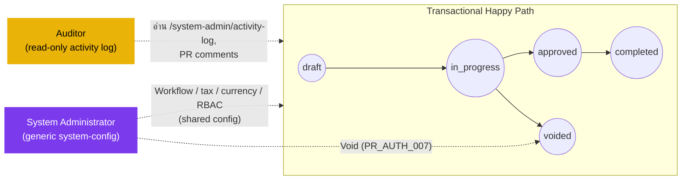

# ใบขอซื้อ (Purchase Request) — User Flow — Audit & Config

> **At a Glance**
> **Persona:** Audit / Config (Auditor + System Administrator) &nbsp;·&nbsp; **โมดูล:** [purchase-request](/th/inventory/purchase-request) &nbsp;·&nbsp; **Surface ที่ยืนยันแล้ว:** activity log แบบ generic ต่อเอกสาร (Auditor, read-only — `/system-admin/activity-log`); workflow-stage editor แบบ generic ที่มีแท็บ **Routing** รองรับ amount/department/category-threshold routing (`/system-admin/workflow`), tax-profile (`/config/tax-profile`), currency + exchange-rate (`/config/currency`, `/config/exchange-rate`), และหน้า user / role (`/system-admin/user`, `/system-admin/role`) ที่ใช้ร่วมกันข้ามทุกประเภทเอกสาร ไม่ใช่เฉพาะ PR (System Administrator) &nbsp;·&nbsp; **ยังไม่ยืนยัน:** "Audit workspace" query builder เฉพาะ PR, "Configuration workspace" เฉพาะ PR, delegation window, หรือ default ต่อประเภท PR

> ⚠️ **แก้ไขใหญ่ในรอบนี้** เวอร์ชันก่อนหน้าของหน้านี้บรรยาย sidebar workspace **"Audit"** เฉพาะทาง พร้อม query builder **"PR Activity Queries"** (audit template, filter chip, การ flag case file, export-approval workflow) และ sidebar workspace **"Configuration"** เฉพาะทางพร้อมหน้าลูก — **PR Workflow Settings** (stage editor บวก panel Threshold Rules, panel preview/forecast, และ versioning ด้วย `effective_from`), **PR Type Defaults**, **Delegation Rules**, **Tax Codes**, และ **Currency Rates** ข้อค้นพบนี้ถูก settle เทียบกับซอร์สปัจจุบันใน `.specs/resync-2026-07-15-progress.md` (commit `df8ab13`, "settle PR audit-config deferral vs system-admin screens") ซึ่งอ่านทุก route ใน `router.tsx` และทุก screen component ใต้ `routes/system-admin/` และ `routes/config/`:
> - **ไม่มี route หรือ component ใดตรงกับ "audit workspace," "PR Activity Queries," หรือ configuration workbench เฉพาะ PR อยู่เลย** ใน `carmen-inventory-frontend-react` และไม่มี "PR detail → Activity Log tab" ด้วย — หน้า detail ของ PR มีเฉพาะ comment sheet
> - "PR Activity Queries" map ได้เพียงบางส่วนกับหน้า **`/system-admin/activity-log`** แบบ generic (`activity-log-component.tsx`): list ธรรมดาที่ filter ได้ตาม `action` / `entity_type` / `user` ไม่ใช่ query-template builder — ไม่มี filter chip เพิ่มเติมนอกจากนี้ ไม่มี PR-specific scoping และไม่มี audit-of-audit log ต่อ query
> - "PR Workflow Settings" map กับ stage editor **`/system-admin/workflow`** แบบ generic (จริง: stages, SLA, assigned users, `hide_fields` สำหรับแถว `workflow_type = purchase_request` เป็นหนึ่งในหลายประเภท) ซึ่งมีแท็บ **Routing** ด้วย — การค้นหาทั่ว repo ทั้ง workflow route ฝั่ง frontend และ backend สำหรับคำ `threshold` และ `delegat` ไม่พบคำตรงกัน แต่รอบตรวจสอบติดตาม (2026-07-29) ที่ค้นหาด้วยคำที่ implementation ใช้จริง (`routing_rules`, `total_amount`, `evaluateCondition`) พบว่าแท็บ Routing นี้**คือ**กลไก amount-threshold routing ที่ live จริง: ชุดกฎต่อ workflow (`tb_workflow.data.routing_rules`) ที่เทียบ `total_amount` (ผลรวม `total_price` ของบรรทัด PR), `department`, หรือ `category` กับ operator (`eq`/`gt`/`lt`/`gte`/`lte`/`between`) แล้วเมื่อตรง จะข้ามหรือกระโดดไป stage ที่ระบุ — ประเมินโดย workflow orchestrator ทั้งตอน submit และทุกครั้งที่ approve ไม่มี panel preview/forecast และไม่มี versioning ด้วย `effective_from` (ส่วนที่เป็นการปรุงแต่งสมมติจากเวอร์ชันก่อนหน้าของหน้านี้) และเป็นแบบ generic (ใช้ร่วมกันระหว่าง workflow ของ PR, PO, และ SR) ไม่ใช่ "Threshold Rules panel" เฉพาะ PR ในทางกลับกัน กลไก **delegation** window ไม่พบเลยจากการค้นหาทั้งสองรอบ **นี่หมายความว่ารายการ `PR_AUTH_005`** (amount thresholds) **ใน [02-business-rules.md](./02-business-rules.md) เป็น live behavior ที่ยืนยันแล้ว ส่วนรายการ `PR_AUTH_006`** (delegation) **ยังคงเป็น design intent ที่ยังไม่ยืนยัน** — ทั้งรายการ business-rules และทุกหน้าอื่นในโมดูลนี้ที่อ้างถึงถูกแก้ไขในรอบตรวจสอบติดตามเดียวกันนี้แล้ว
> - "PR Type Defaults" และ "Delegation Rules" **ไม่มี equivalent อยู่เลย** ในซอร์สปัจจุบัน
> - "Tax Codes" map กับหน้า master-data **`/config/tax-profile`** แบบ generic (`tax-profile-component.tsx` / `tax-profile-dialog.tsx`) — ฟิลด์ `tax_rate` แบบแบนต่อแถว ไม่ใช่ตาราง rate แบบ effective-dated
> - "Currency Rates" map กับหน้า master-data **`/config/currency`** + **`/config/exchange-rate`** แบบ generic — ไม่พบ versioning ด้วย `effective_from` บนทั้งสองหน้า
> - "Users & Roles" map กับหน้า access-control จริง **`/system-admin/user`** + **`/system-admin/role`** — generic ไม่ใช่เฉพาะ PR
> pattern นี้ (audit-workspace + configuration-workspace ที่ elaborate โดยไม่มี route ที่ตรงกัน) ถูกพบและแก้ไขอย่างอิสระในรอบ resync ของโมดูล `purchase-order` เอง — ดู [purchase-order/03-user-flow-audit-config.md](/th/inventory/purchase-order/03-user-flow-audit-config) ซึ่งรัน search ทั่ว repo แบบเดียวกันและไม่พบสิ่งใดสนับสนุน workspace ทั้งสองในผลิตภัณฑ์เลย

## 1. บทบาทในโมดูลนี้

**Auditor** เป็น role read-only surface ที่ยืนยันได้มีเพียงหน้า **`/system-admin/activity-log`** แบบ generic — list ที่ filter ได้ของ event `action` / `entity_type` / `user` ข้ามทุกประเภทเอกสาร รวมถึงแถว `purchase_request` — บวก comment sheet ของหน้า detail PR เอง (`tb_purchase_request_comment`, immutable สำหรับแถว `type = system` ตาม `PR_POST_008`) ที่ผู้ใช้ที่มีสิทธิ์อ่าน PR เห็นได้อยู่แล้ว ยังไม่ยืนยันในรอบนี้ว่า role "Auditor" ที่แยกต่างหาก gate surface ใดต่างจากผู้อ่านคนอื่นหรือไม่ Auditor ไม่สามารถ approve, reject, send back, แก้บรรทัด หรือ void PR ได้

**System Administrator** ตั้งค่า workflow definition ที่ PR อ้างอิงผ่าน `workflow_id` (stages, `stage_role`, การเป็นสมาชิกของ `user_action.execute[]`, และกฎ amount/department/category-threshold ในแท็บ **Routing** — เป็น system-config functionality แบบ generic ที่ใช้ร่วมกันข้ามประเภทเอกสารผ่าน `/system-admin/workflow` ไม่ใช่เฉพาะ PR), tax rate (`/config/tax-profile`), currency และ exchange-rate master (`/config/currency`, `/config/exchange-rate`), และ RBAC user/role assignment (`/system-admin/user`, `/system-admin/role`) ไม่พบ amount-threshold editor เฉพาะ PR (ตัวจริงเป็น generic ไม่ใช่เฉพาะ PR), delegation-window manager (ไม่มี equivalent อยู่เลย), หรือ screen default ต่อประเภท PR เฉพาะ PR ใดๆ แยกต่างหาก System Administrator (ร่วมกับ Finance) ถือสิทธิ์ **void** ระดับสูงตาม `PR_AUTH_007` ซึ่งเป็น action จริงที่ยืนยันแล้ว แยกจาก screen configuration ข้างต้นทั้งหมด

### ตำแหน่งเทียบกับ flow transactional

### ตารางสิทธิ์ — Action × Sub-persona (Audit / Config)

| Action | Auditor | System Administrator |
|---|---|---|
| อ่าน `/system-admin/activity-log` (filter ตาม `action` / `entity_type` / `user`) | ✅ | ✅ |
| อ่าน header / บรรทัด / `tb_purchase_request_comment` ของ PR (ผ่านหน้า detail PR เหมือนผู้อ่านทั่วไป) | ✅ | ✅ |
| แก้ workflow stages / `stage_role` / `user_action.execute[]` (`/system-admin/workflow`, generic) | ❌ | ✅ |
| แก้ tax rate (`/config/tax-profile`, generic) | ❌ | ✅ |
| แก้ currency / exchange-rate master (`/config/currency`, `/config/exchange-rate`, generic) | ❌ | ✅ |
| แก้ RBAC user / role assignment (`/system-admin/user`, `/system-admin/role`, generic) | ❌ | ✅ |
| ตั้งค่ากฎ routing ตาม amount threshold (แท็บ **Routing** ของ `/system-admin/workflow`, generic) | ❌ | ✅ |
| ตั้งค่า delegation window | **ยังไม่ยืนยันว่ามีอยู่จริง** | **ยังไม่ยืนยันว่ามีอยู่จริง** |
| แก้ header / บรรทัด / vendor / pricing ของ PR | ❌ | ❌ |
| Approve / Reject / Send-back / Split-Reject | ❌ | ❌ |
| Void PR ที่ in-flight หรือ approved (`PR_AUTH_007`) | ❌ | ✅ |

## 2. Entry Point และ Primary Flow

### 2.1 Auditor

**Entry point:** Sidebar → **System Admin** → **Activity Log** (`/system-admin/activity-log`) **ยังไม่ยืนยัน:** query workspace ที่ scope เฉพาะ PR, ตัวเลือก query-template, หรือหน้า drill-down นอกเหนือจาก detail sheet ของ activity log เอง

**Flow ที่ยืนยันแล้ว:** เปิด `/system-admin/activity-log`, filter ด้วย `entity_type = purchase_request` (หรือ filter `action` / `user` ที่แคบกว่า) และ review list ที่ได้ — แต่ละแถวแสดง action, actor, และ timestamp; คลิกแถวเปิด detail sheet (`activity-log-detail-sheet.tsx`) พร้อม event payload ที่บันทึกไว้ สำหรับ comment history ของ PR เฉพาะ เปิดหน้า detail PR โดยตรงและอ่าน `tb_purchase_request_comment` (แถว `type = system` immutable ตาม `PR_POST_008`) ไม่มีการเปลี่ยนสถานะ PR จากทั้งสอง read path

### 2.2 System Administrator

**Entry point:** screen system-config และ config แบบ generic — **`/system-admin/workflow`** (workflow stages และ stage-role assignment), **`/config/tax-profile`** (tax rate), **`/config/currency`** และ **`/config/exchange-rate`** (currency master และ rate), และ **`/system-admin/user`** / **`/system-admin/role`** (RBAC) ไม่มีตัวใดเฉพาะ PR แต่ละตัวใช้ร่วมกันข้ามทุกประเภทเอกสารในผลิตภัณฑ์ และ document ไว้ในตัวของมันเองภายใต้ [system-config](/th/inventory/system-config) (นอกขอบเขตที่จะ duplicate ที่นี่)

**Flow ที่ยืนยันแล้ว:** เปิด screen ที่เกี่ยวข้อง, แก้ไขแถว (workflow stage / `stage_role` / assigned user, tax rate, exchange rate, หรือ role-permission grant) และ save การแก้ workflow มีผลกับ PR ที่สร้างหลังการเปลี่ยน; PR ที่อยู่ใน `in_progress` แล้วยังคง `workflow_id` และ stage cursor ที่ assign ไว้ ดังนั้น PR ที่ in-flight ไม่ถูก reroute เงียบๆ กลางทาง workflow ด้วยการแก้ stage-definition ภายหลัง (เป็นผลจากที่ workflow ถูกอ้างอิงด้วย ID ไม่ใช่ re-resolve แบบ live — ขอบเขตจริงของพฤติกรรม "snapshot" นอกเหนือจากนี้ยังไม่ verified ในรอบนี้) **ยังไม่ยืนยัน:** panel preview/forecast ใดๆ ที่แสดงจำนวน PR ที่ in-flight หรือคาดการณ์ที่ได้รับผลกระทบก่อน save หรือ configuration history แบบ versioned/effective-dated สำหรับ screen เหล่านี้

## 3. Decision Branches

- **หาก Auditor พบช่องว่างใน activity log หรือ entry ที่ผิดปกติ**: escalate นอกโมดูล — ไม่พบ feature "case file" หรือการ flag เฉพาะ PR ที่ยืนยันได้ feature activity-log หรือ audit-trail แบบ generic นอกเหนือจาก list ที่ filter ได้ ถ้ามีอยู่ document ไว้ใน [reporting-audit](/th/inventory/reporting-audit) ไม่ใช่ที่นี่
- **หาก Sysadmin ต้องยุติ PR ที่ค้าง** (เช่น การแก้ workflow ทำให้ไม่มี approver ที่เหมาะสมเหลือที่ stage หนึ่งหลังการเปลี่ยน RBAC): remediation ที่ยืนยันได้คือ **void** ระดับสูงของ System Administrator เองตาม `PR_AUTH_007` หรือ escalate ไปยัง Finance ไม่มีกลไก delegation ที่ยืนยันได้สำหรับ reassign stage ที่ค้างชั่วคราว — การค้นหาทั่ว repo สำหรับ feature delegation-window ไม่พบสิ่งใด (ดู correction note ข้างต้น)
- **หาก Sysadmin แก้ tax rate, exchange rate, หรือ workflow stage ขณะที่ PR อยู่ in-flight ภายใต้ค่าเก่า**: การแก้ไม่ปรากฏว่าเขียนทับ field ที่ snapshot ไว้แล้วของ PR ที่ in-flight แบบย้อนหลัง (`exchange_rate`, `vat_rate` ฯลฯ ที่ capture ตอน submit — ดู [02-business-rules.md](./02-business-rules.md) Section 6) แต่ไม่พบ preview panel ฝั่ง configuration หรือจำนวน PR ที่ได้รับผลกระทบที่ยืนยันว่าสิ่งนี้ surface ให้ Sysadmin เห็นก่อน save

## 4. Exit Point / Handoffs

ทั้งสอง role ไม่ transition PR ข้าม `enum_purchase_request_doc_status = { draft, in_progress, voided, approved, completed }` ผ่านเส้นทาง read หรือ configuration ที่บรรยายข้างต้น

- **Auditor** — การอ่าน activity log ไม่เปลี่ยนสถานะเลย remediation ใดที่ review ของ Auditor surface ถูก handoff แบบ out-of-band ไปยัง Finance, Compliance, หรือ System Administrator
- **System Administrator (configuration)** — การแก้ workflow / tax / currency / RBAC ถูก save และมีผลกับ PR ในอนาคตและ (สำหรับ RBAC) action ในอนาคต ไม่เคยเปลี่ยน `pr_status` ของ PR เอง
- **System Administrator (void)** — action เดียวในแกน persona นี้ที่เปลี่ยนสถานะ PR จริง: `pr_status` flip เป็น `voided` (terminal) ตาม `PR_AUTH_007` / `PR_POST_006` ปล่อย budget soft-commitment และ append comment เหตุผลบังคับ Handoff ไปยัง Requestor (เห็น `voided` บน **My PRs**) และ Auditor (เห็น void ใน activity log เมื่อ query ครั้งถัดไป)

## 5. แหล่งอ้างอิง

- ภาพรวม parent: [03-user-flow.md](./03-user-flow.md)
- กฎการให้สิทธิ์: [02-business-rules.md](./02-business-rules.md) Section 4 — `PR_AUTH_002` (ผู้ execute ต่อ stage), `PR_AUTH_007` (void ระดับสูง, ขอบเขต Finance / System Administrator), `PR_AUTH_008` (ความเป็นเจ้าของ `enum_stage_role` สำหรับ PO conversion) **`PR_AUTH_005`** (amount thresholds) เป็น live behavior ที่ยืนยันแล้วผ่านแท็บ **Routing** ของ `/system-admin/workflow` (ดู correction note ด้านบน) **`PR_AUTH_006`** (delegation) ยังคงไม่ยืนยัน — ไม่พบโค้ด delegation ที่ตรงกันเลย
- กฎการ post: [02-business-rules.md](./02-business-rules.md) Section 5 — `PR_POST_006` (void), `PR_POST_008` (audit comment ที่ immutable)
- กฎ cross-module: [02-business-rules.md](./02-business-rules.md) Section 6 — snapshot semantics (`exchange_rate`, ฟิลด์ tax) ที่ capture ตอน submit เกี่ยวข้องกับสิ่งที่การแก้ master-data ของ Sysadmin มีผลย้อนหลังหรือไม่
- เกี่ยวข้อง (generic config ไม่ใช่เฉพาะ PR): [system-config/workflow](/th/inventory/system-config/workflow)
- Sibling: [03-user-flow-requestor.md](./03-user-flow-requestor.md) — persona ต้นน้ำที่ action ปรากฏใน activity log
- Sibling: [03-user-flow-approver.md](./03-user-flow-approver.md) — การตัดสินใจใน approval chain ที่จับใน `workflow_history` สำหรับ audit review
- Sibling: [03-user-flow-purchaser.md](./03-user-flow-purchaser.md) — persona ปลายน้ำที่ handoff การแปลงเป็น PO สังเกตได้ใน activity log
- Sibling: [03-user-flow-procurement-manager.md](./03-user-flow-procurement-manager.md) — เส้นทาง escalation สำหรับ PR ที่ค้าง ซึ่งไม่ผ่านแกน persona นี้
- Cross-link: [purchase-order/03-user-flow-audit-config.md](/th/inventory/purchase-order/03-user-flow-audit-config) — โมดูลพี่น้องที่พบและแก้ไข narrative audit/config-workspace แบบเดียวกันอย่างอิสระ; รายการ search ทั้งหมดที่รัน
- Cross-link: [inventory-adjustment](/th/inventory/inventory-adjustment) — โมดูลพี่น้องที่มี audit surface เป็น generic activity log เท่านั้นเหมือนกัน
