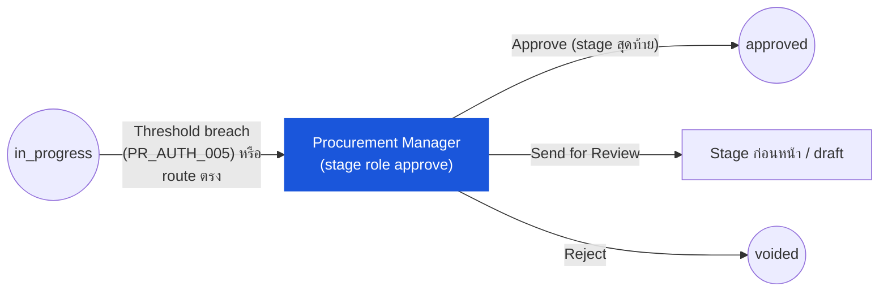

# ใบขอซื้อ (Purchase Request) — User Flow — Procurement Manager

> **At a Glance**
> **Persona:** Procurement Manager / General Manager &nbsp;·&nbsp; **โมดูล:** [purchase-request](/th/inventory/purchase-request) &nbsp;·&nbsp; **Stage ของ workflow:** in_progress (stage approve แบบ escalated / มูลค่าสูง) &nbsp;·&nbsp; **สิทธิ์สำคัญ:** approve / send-back / reject / split-reject ที่ stage escalated เหมือน stage Approver ใด ๆ
> **persona นี้ทำอะไร:** เป็น authority ของการ approve สุดท้ายแบบ escalated สำหรับ PR มูลค่าสูงหรือมีความสำคัญเชิงกลยุทธ์ โดยใช้ UI review-and-decide เดียวกันกับ chain Approver ที่เหลือ

## 1. บทบาทในโมดูลนี้

**Procurement Manager** (ในชุด test fixture ปัจจุบันเรียกว่า **General Manager**) เป็นตำแหน่งทางธุรกิจที่วางทับบน stage role `approve` ใน workflow ที่ตั้งค่าได้ **เดียวกัน** กับ stage ของ Department Head / Budget Controller / Finance — source ปัจจุบันไม่มีหน้าจอ, route หรือ API surface เฉพาะของ Procurement Manager ที่แตกต่างจาก UI Approver ทั่วไปที่อธิบายใน [03-user-flow-approver.md](./03-user-flow-approver.md) เมื่อ `base_total_amount` ของ PR ข้าม threshold มูลค่าสูงที่ตั้งไว้ (`PR_AUTH_005`) หรือ workflow ถูกตั้งค่าให้ route PR ตรงไปยัง role นี้ เอกสารจะลงในคิว **My Pending** ของ Procurement Manager เหมือนการส่งต่อ stage อื่น ๆ พวกเขา review PR (header, บรรทัด, Activity Log, Budget Impact) แล้วทำหนึ่งใน action เดียวกับที่ใช้ได้ทุก stage — **Approve**, **Reject**, **Send for Review** (send-back), **Split** — จาก bulk toolbar ใน Edit Mode ถ้า stage ของพวกเขาเป็น stage `approve`-role สุดท้ายของ chain การ Approve จะพลิก `pr_status` จาก `in_progress` เป็น `approved` (`PR_POST_005`) ส่งต่อ PR ไปยัง stage หรือโมดูลถัดไป (โดยทั่วไปคือ stage role `purchase` หรือส่งตรงไปยังการแปลง PO เมื่อ approved แล้ว — ดู [03-user-flow-purchaser.md](./03-user-flow-purchaser.md))

> ⚠️ **ความคลาดเคลื่อน — ไม่พบหน้าจอตั้งค่า vendor-ranking ใน source ปัจจุบัน** เนื้อหารุ่นก่อนหน้าของหน้านี้อธิบาย "configurational surface" แยกต่างหากสำหรับ Procurement Manager — หน้าจอ Vendor Allocation Rules พร้อม scoring weight, override priority ต่อ vendor และมุมมอง "Stuck PR Oversight" แบบ bulk action ไม่พบ route, component หรือ backend endpoint ที่ตรงกันใน `../carmen-inventory-frontend-react/` หรือ `../carmen-turborepo-backend-v2/` ในรอบตรวจสอบนี้ และไม่มี route แบบนี้ปรากฏใน `.specs/resync-2026-07-15-routes-inventory.txt` การจัดอันดับ vendor สำหรับ **Auto Allocate** ถูก resolve ฝั่ง server โดย price-compare lookup ของ vendor-pricelist (ดู [vendor-pricelist](/th/inventory/vendor-pricelist)); ไม่มีหน้าจอสำหรับผู้ใช้ในการปรับเกณฑ์ ranking นี้ใน build ปัจจุบัน ให้ถือว่าเนื้อหา "configurational surface" เดิมเป็นสิ่งที่ยังไม่ถูกสร้าง / เป็น aspiration — บันทึกไว้ใน Discrepancy log ของ progress log สำหรับรอบนี้

### ตำแหน่งใน workflow

### ตารางสิทธิ์ — Action × stage escalated

สิทธิ์และ UI เหมือนกับ chain Approver พื้นฐานทุกประการ (ดูตารางเต็มใน [03-user-flow-approver.md](./03-user-flow-approver.md)) ความต่างเดียวคือ scope (PR ใดถูก route มาที่นี่) และมูลค่า/authority ที่ stage นี้แทน

| Action | Stage escalated / มูลค่าสูง |
|---|---|
| ดู PR | ✅ |
| Approve (เดินหน้า / สุดท้าย) | ✅ |
| Send for Review (พร้อมเหตุผล) | ✅ |
| Reject — ระดับ header (→ `voided`) | ✅ |
| Split — ระดับบรรทัด | ✅ |
| ปรับ `approved_qty` (`PR_VAL_013`) | ✅ |
| แก้ vendor / ราคาต่อหน่วย / ส่วนลด / tax / FOC | ❌ (สงวนสำหรับ stage role `purchase`) |
| Delete PR | ❌ |
| Convert to PO | ❌ (dialog แยกในโมดูล Purchase Order, พื้นที่ของ `enum_stage_role = purchase`) |

## 2. จุดเริ่มต้นและ flow หลัก

**จุดเริ่มต้น:** Notification deep link หรือ Sidebar → โมดูล **Purchase Request** → **My Pending** (filter เป็น PR ที่ผู้ใช้ที่ล็อกอินอยู่ใน `user_action.execute[]` ของ stage ปัจจุบัน)

**Flow หลัก (happy path):** เหมือนกับ flow Approver พื้นฐานใน [03-user-flow-approver.md](./03-user-flow-approver.md) Section 2 ทุกประการ — เปิด PR, review header / บรรทัด / Budget Impact / Activity Log, ปรับ `approved_qty` ตาม `PR_VAL_013` ได้ถ้าจำเป็น แล้วทำ bulk action (Approve / Reject / Send for Review / Split) จาก toolbar ใน Edit Mode ปัจจัยเดียวที่ต่างคือ PR ใดถูก route มาที่ stage นี้ (threshold breach หรือ workflow route ตรง) ไม่ใช่ชุดหน้าจอหรือ action ที่ต่างกัน

## 3. แขนงการตัดสินใจ

แขนงการตัดสินใจสะท้อน chain Approver พื้นฐาน (ดู [03-user-flow-approver.md](./03-user-flow-approver.md) Section 3): Send for Review พร้อมเหตุผล, Reject ระดับ header พร้อมเหตุผล, Split-Reject ต่อบรรทัด *(เอกสารรุ่นก่อนหน้ายังระบุ "delegation ขณะไม่อยู่" ตาม `PR_AUTH_006` — ยังไม่ยืนยัน ไม่พบกลไก delegation ดู [02-business-rules.md](./02-business-rules.md))* ไม่มีแขนงการตัดสินใจเฉพาะสำหรับ configuration surface ใน build ปัจจุบัน

## 4. จุดออก / Handoff

- **Approve ที่ stage สุดท้าย** `pr_status` พลิกจาก `in_progress` เป็น `approved` (`PR_POST_005`); handoff ไปยังใครก็ตามที่รัน dialog Convert-to-PO แยกต่างหากในโมดูล Purchase Order ([03-user-flow-purchaser.md](./03-user-flow-purchaser.md))
- **Send for Review** `workflow_current_stage` ย้ายกลับหนึ่ง step; ถ้าถึง create stage ของ Requestor `pr_status` กลับเป็น `draft` และ **Requestor** รับต่อ ([03-user-flow-requestor.md](./03-user-flow-requestor.md))
- **Reject ระดับ header** `pr_status` พลิกเป็น `voided` (terminal, `PR_POST_006`); **Auditor** review ภายหลัง

สถานะเอกสารข้ามทุก transition บันทึกโดย `enum_purchase_request_doc_status = { draft, in_progress, voided, approved, completed }`

## 5. แหล่งอ้างอิง

- ภาพรวมหลัก: [03-user-flow.md](./03-user-flow.md)
- กฎการให้สิทธิ์: [02-business-rules.md](./02-business-rules.md) Section 4 — `PR_AUTH_002`, `PR_AUTH_005` (routing ตาม threshold, ยืนยันแล้ว), `PR_AUTH_006` (delegation, ยังไม่ยืนยัน)
- กฎการ posting: [02-business-rules.md](./02-business-rules.md) Section 5 — `PR_POST_003` (send-back), `PR_POST_005` (final approve → `approved`), `PR_POST_006` (reject / void)
- E2E: ยังไม่มี persona-journey spec เฉพาะของ Procurement Manager; เส้นทาง escalated / มูลค่าสูงถูกทดสอบผ่าน fixture `gmTest` ใน `../carmen-inventory-frontend-e2e/tests/301-pr.spec.ts` (เช่น `TC-PR-060005` — reject PR มูลค่าสูงมาก)
- หน้าพี่น้อง: [03-user-flow-approver.md](./03-user-flow-approver.md) — flow อนุมัติพื้นฐานที่นี่ใช้ซ้ำทุกประการ
- หน้าพี่น้อง: [03-user-flow-purchaser.md](./03-user-flow-purchaser.md) — ปลายน้ำ: stage role `purchase` แยกต่างหากและ dialog Convert-to-PO
- หน้าพี่น้อง: [หน้าหลักโมดูล](/th/inventory/purchase-request) Section 4 — คำอธิบาย role ของ Procurement Manager ตามมาตรฐาน
- Cross-link: [purchase-order](/th/inventory/purchase-order) — โมดูลปลายน้ำที่รับ PR ที่ final-approved สำหรับการแปลง
