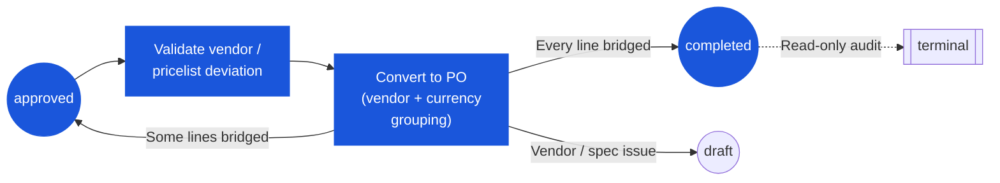

# ใบขอซื้อ (Purchase Request) — User Flow — Purchaser

> **At a Glance**
> **Persona:** Purchaser / Procurement Officer &nbsp;·&nbsp; **โมดูล:** [[purchase-request]] &nbsp;·&nbsp; **Stage ของ workflow:** approved → completed (Convert to PO) &nbsp;·&nbsp; **สิทธิ์สำคัญ:** vendor allocation, pricelist refresh, set convert qty, Convert to PO, bounce-back ให้ Requestor
> **persona นี้ทำอะไร:** รับ PR ที่ approved, validate vendor และราคา, group ตาม vendor + currency และแปลงบรรทัดเป็น PO หนึ่งหรือหลายใบ

## 1. บทบาทในโมดูลนี้

**Purchaser** (ตำแหน่งอื่นคือ **Procurement Officer**) เป็น persona สะพานระหว่างฝั่ง PR ต้นน้ำและฝั่ง PO ปลายน้ำของห่วงโซ่ procure-to-pay พวกเขา **ไม่** อนุมัติเนื้อหา PR — ตอนที่ PR ถึงคิวของพวกเขา มันได้ผ่าน chain ผู้อนุมัติทั้งหมดแล้วและ `pr_status = approved` (`PR_POST_005`) งานของพวกเขาคือรับสิ่งที่ approved แล้ว, validate การจัดสรร vendor ต่อบรรทัด, lookup pricelist ของ vendor ปัจจุบันเพื่อ verify ราคาและ deviation, group บรรทัดจาก PR ต่าง ๆ ที่มี **vendor + currency** เดียวกันเพื่อออกเป็น PO ใบเดียว และรัน action Convert-to-PO Link จากบรรทัด PR ถึงบรรทัด PO ถูกบันทึกบนตาราง bridge `tb_purchase_order_detail_tb_purchase_request_detail` ([01-data-model.md](./01-data-model.md) Section 2) — many-to-many ที่รองรับทั้ง **consolidation** (หลายบรรทัด PR → หนึ่งบรรทัด PO) และ **partial conversion** (หนึ่งบรรทัด PR → หลายบรรทัด PO ข้าม vendor / วันส่งของ) เมื่อปัญหา vendor หรือ spec ปรากฏขึ้น Purchaser สามารถ route PR กลับให้ Requestor ผ่านกลไก send-back มาตรฐานของ PR แทนการแปลงให้เสร็จ Purchaser ทำงานภายใต้ `enum_stage_role = purchase` (`PR_AUTH_008`)

### ตำแหน่งใน workflow (Purchaser highlighted)

### ตารางสิทธิ์ — Action × pr_status ที่ Purchaser เห็น

Purchaser เห็น PR เฉพาะหลังจาก chain อนุมัติผ่านแล้ว สถานะเอกสารที่เกี่ยวข้องสองสถานะคือ `approved` (candidate การแปลงที่ active) และ `completed` (ประวัติ, read-only) สิทธิ์การแก้ scope อยู่ที่ vendor allocation, pricelist refresh และ convert quantity ต่อบรรทัด — ไม่ใช่เนื้อหา PR

| Action | approved (เปิดหรือถูก bridge บางส่วน) | completed (bridge เต็มแล้ว) |
|---|---|---|
| ดู PR | ✅ | ✅ (read-only) |
| Allocate / เปลี่ยน vendor บนบรรทัด (`vendor_id`) | ✅ | ❌ |
| Refresh `pricelist_price` เป็นค่าปัจจุบัน | ✅ | ❌ |
| ตั้ง **convert quantity** ต่อบรรทัด (เต็มหรือบางส่วน) | ✅ | ❌ |
| รัน **Convert to PO** (เขียนแถว bridge) | ✅ | ❌ |
| Bounce-back ให้ Requestor (send-back จาก stage `purchase`) | ✅ | ❌ |
| Add Comment | ✅ | ✅ |
| แก้ header / บรรทัด (qty, price, tax, FOC) | ❌ | ❌ |
| ปรับ `approved_qty` | ❌ (สิทธิ์ของ Approver; `PR_VAL_013`) | ❌ |
| Reject / Approve / Split-Reject | ❌ | ❌ |
| Delete / Void PR | ❌ (sysadmin เท่านั้น — `PR_AUTH_007`) | ❌ |

> ℹ️ **PR → PO snapshot:** เมื่อ Purchaser รัน Convert to PO **PO** จะ snapshot `exchange_rate` ใหม่และบริบท pricelist ปัจจุบันลงบนแต่ละบรรทัด PO; **PR** ยังคง snapshot เดิมตาม `PR_CALC_006` ยอดฐานฝั่ง PR และฝั่ง PO อาจต่างกัน — นี่เป็นไปตามที่ออกแบบ

## 2. จุดเริ่มต้นและ flow หลัก

**จุดเริ่มต้น:** Sidebar → โมดูล **Purchase Request** → คิว **Approved PRs** (filter เป็น `pr_status = approved` และยังไม่ได้ถูก bridge เต็มกับ PO) หรือทางเลือก: Procurement workspace → workbench **Convert to PO** ที่แสดง pool บรรทัดที่ approved เดียวกัน group ตาม vendor + currency Notification ในแอปและอีเมล "Purchase Request [PR-ID] Ready for PO Conversion" deep-link ตรงไปยังหน้า PR detail

**Flow หลัก (happy path):**

1. จากคิว **Approved PRs** ใช้ filter — vendor, currency, ช่วงวันส่งของที่ขอ, แผนก, store location — เพื่อแคบ working set คิวแสดง `pr_no`, requestor, แผนก, จำนวนบรรทัด, `base_total_amount`, vendor (ถ้า vendor เดียวครอบทุกบรรทัด) หรือ "multi-vendor", สกุลเงิน และเวลาตั้งแต่ PR ลงใน `approved` จำนวนบรรทัดที่ยังไม่ถูก bridge เทียบกับบรรทัดทั้งหมดเห็นได้ต่อแถว ทำให้ PR ที่แปลงบางส่วนปรากฏชัดเจน
2. เปิด PR โดยคลิกเข้า หน้า detail เป็น **read-mostly** สำหรับ Purchaser: header (ประเภท PR, requestor, แผนก, `pr_date`, วันส่งของที่ต้องการ, สกุลเงิน, `exchange_rate`, เหตุผล, attachment) แก้ไม่ได้; เฉพาะ vendor allocation, การเลือก pricelist และ checkbox การแปลงต่อบรรทัดที่ interactive
3. เดินทีละ **บรรทัดที่ approved** สำหรับทุกบรรทัดยืนยัน `vendor_id` / `vendor_name` ที่ snapshot ไว้ ถ้า Requestor หรือระบบ auto-allocate preferred vendor Purchaser validate กับ master data ของ vendor ปัจจุบัน (active status, payment terms, credit limit, blacklist flag) ที่ pull แบบ live ควบคู่กับ [[vendor-pricelist]] สำหรับราคาปัจจุบันและ deviation ถ้าบรรทัดไม่มีการจัดสรร vendor Purchaser เลือกหนึ่งจาก Allocate Vendor dialog — dialog จัดอันดับ vendor candidate ตามการ match pricelist กับสินค้า, location และวันที่ต้องการของบรรทัด และแสดงราคาปัจจุบัน, lead time และประวัติ performance
4. Verify **ราคาและ pricelist deviation** ต่อบรรทัด ระบบเปรียบเทียบ `pricelist_price` ที่ snapshot ไว้ของบรรทัดกับแถว pricelist **ปัจจุบัน** ที่ active (resolve ตาม `product_id`, vendor, location และ effective date) Indicator deviation highlight บรรทัดที่ราคาปัจจุบันเคลื่อนเกิน tolerance ที่ตั้งไว้ (เช่น `±5%`) เมื่อมี deviation Purchaser สามารถ (a) ยอมรับราคา snapshot และดำเนินต่อ, (b) refresh ไปราคา pricelist ปัจจุบันก่อนแปลง หรือ (c) ยกประเด็นเพื่อ route PR กลับให้ Requestor เพื่อ re-justify
5. ปรับ **convert quantity** ต่อบรรทัดแบบ optional โดย default แต่ละบรรทัดถูกแปลงที่จำนวนเปิดเต็ม (`approved_base_qty` ลบจำนวนที่ถูก bridge ไปแล้วจากการแปลงบางส่วนก่อนหน้า) Purchaser อาจแปลงน้อยกว่าจำนวนเปิด เหลือส่วนที่เหลือสำหรับ PO อนาคต — ตาราง bridge บันทึกจำนวนที่แปลงจริงต่อ link PO-PR-line
6. สลับไปมุมมอง workbench **Convert to PO** Workbench pool บรรทัดที่ tick ไว้จาก PR ปัจจุบันและ PR ที่ approved อื่น ๆ ที่ Purchaser เลือก แล้ว group อัตโนมัติตาม `(vendor_id, currency_id)` แต่ละ group กลายเป็น draft PO; บรรทัดที่ share ทั้ง vendor และ currency consolidate เข้า PO เดียวกันไม่ว่าจะมาจาก PR ใด แต่ละ preview group แสดง: ชื่อและ code vendor, สกุลเงิน, จำนวนบรรทัด, subtotal, ภาษีรวม, ส่วนลดรวม และ grand total ทั้งสกุลธุรกรรมและสกุลฐาน
7. Review แต่ละ group draft PO Purchaser ย้ายบรรทัดออกจาก group ได้ (เช่นเลื่อนไป PO ถัดไป), แก้วันส่งของฝั่ง PO หรือส่วนลดฝั่ง PO ของบรรทัดภายในขอบเขตที่ `PR_AUTH_008` และนโยบายโมดูล PO ที่ตั้งค่ากำหนด และเพิ่ม note ระดับ PO บรรทัดที่ fail vendor หรือ pricelist validation ถูก flag สีแดงและถูกตัดออกจากการแปลงจนกว่าจะแก้
8. รัน **Convert to PO** ระบบสร้าง `tb_purchase_order` หนึ่งใบต่อ group, insert แถว `tb_purchase_order_detail` ที่ match พร้อมบริบทสินค้า / pricing / qty / UoM ที่ snapshot, snapshot อัตรา FX ตอนแปลงลงบนแต่ละบรรทัด PO และเขียนหนึ่งแถวต่อคู่ (บรรทัด PO, บรรทัด PR) เข้า bridge `tb_purchase_order_detail_tb_purchase_request_detail` บันทึกจำนวนที่แปลง ตาม `PR_POST_007` ถ้าทุกบรรทัดบน PR ต้นทางถูก bridge เต็มแล้ว (ผลรวมจำนวน PO ที่ link ผ่าน bridge เท่ากับ `approved_base_qty`) หรือถูกยกเลิกชัดเจน `pr_status` ของ PR พลิกจาก `approved` เป็น `completed`; บรรทัดที่มีจำนวนเปิดเหลือทำให้ PR คงอยู่ที่ `approved` สำหรับการแปลงในอนาคต
9. ยืนยันการแปลงใน dialog สรุป (จำนวน PO, มูลค่ารวม PO ในสกุลฐาน, จำนวน PR ต้นทาง) เมื่อยืนยัน ระบบเขียน comment audit `type = system` บน PR ต้นทางแต่ละใบ (`PR_POST_008`), ส่ง PO notification ไปยัง vendor contact ที่ระบุ (ที่ vendor portal integration เปิด) และแจ้ง Requestor ว่า PR ของพวกเขาตอนนี้ link กับ PO แล้ว
10. Purchaser กลับไปคิว **Approved PRs** PR ที่ถูก bridge เต็มหายจากคิว; PR ที่ถูก bridge บางส่วนยังคงอยู่พร้อมจำนวนบรรทัด unbridged ที่อัปเดต PO ที่สร้างใหม่อยู่ในโมดูล [[purchase-order]] ให้ Purchaser ติดตามจนถึงการรับของ

## 3. แขนงการตัดสินใจ

- **ถ้า pricelist deviation ของบรรทัดเกิน tolerance** (ราคาปัจจุบันเทียบกับ `pricelist_price` ที่ snapshot อยู่นอกแถบ `±X%`): Purchaser เห็น flag deviation ใน Step 4 และเลือกหนึ่งในสามทาง (a) **Accept snapshot** — ดำเนินต่อด้วย `pricelist_price` ที่ freeze ของ PR; PO สืบทอดราคาเดียวกัน (b) **Refresh to current** — pull ราคา `tb_pricelist_detail` ปัจจุบันลงบนบรรทัด PO; snapshot ของ PR ไม่เปลี่ยน แต่ PO บันทึกราคาใหม่ (c) **Raise concern / send back** — ละทิ้งการแปลงบรรทัดนั้นและ route PR กลับให้ Requestor โดย trigger เส้นทาง send-back มาตรฐาน (`workflow_current_stage` ของ PR re-open ไป create stage ของ Requestor, `pr_status` กลับเป็น `draft`, soft budget commitment ถูกปล่อยจนกว่าจะ submit ใหม่ตาม `PR_POST_003`) เหตุผล bounce-back ถูกจับใน `tb_purchase_request_comment` สำหรับ audit
- **ถ้าบรรทัดไม่มีการจัดสรร vendor** (`vendor_id IS NULL`): บรรทัดไม่สามารถแปลงในสภาพปัจจุบัน Purchaser เปิด Allocate Vendor dialog เลือก vendor (จัดอันดับตาม pricelist match, lead time และ performance ในอดีต) และ snapshot `vendor_id`, `vendor_name`, `pricelist_detail_id`, `pricelist_no`, `pricelist_unit`, `pricelist_price` และ `pricelist_type` ของบรรทัดถูกอัปเดตบนแถว PR detail PR ยังคงเป็น `approved`; ไม่ต้องอนุมัติใหม่เพราะ vendor allocation เป็นสิทธิ์ของ Purchaser ตาม `PR_AUTH_008`
- **ถ้า Purchaser ต้องการแปลงบางบรรทัดตอนนี้ (partial conversion)**: ใน Step 5 พวกเขา tick เฉพาะบรรทัด (และจำนวน) ที่จะแปลงรอบนี้ ทิ้งที่เหลือไม่ tick และรัน Convert to PO ตาราง bridge บันทึกสิ่งที่แปลงต่อบรรทัด; PR ต้นทางยังอยู่ที่ `approved` พร้อมบรรทัด unbridged ที่เห็นได้ Purchaser (หรือเพื่อนร่วมงาน) สามารถรันรอบการแปลงที่สองได้ — และที่สาม ตราบใดที่บรรทัดยังมีจำนวนเปิด `pr_status` พลิกเป็น `completed` เมื่อจำนวนเปิดสุดท้ายถูก bridge หรือยกเลิก (`PR_POST_007`)
- **ถ้าต้องการ vendor clarification** (spec ไม่ชัดเจน, MOQ ขัดแย้ง, lead time ไม่ไหวสำหรับวันที่ขอ): Purchaser **ไม่** แก้เนื้อหา PR — พวกเขา trigger send-back ฝั่ง PR ที่ส่ง PR กลับให้ Requestor ที่ `draft` พร้อมเหตุผล clarification ที่ log ไว้ Requestor แก้บรรทัด (description, qty, วันส่งของ หรือ attachment) และ resubmit ผ่าน chain อนุมัติทั้งหมด Purchaser รับ PR กลับเมื่อมันลงใน `approved` อีกครั้ง
- **ถ้า Purchaser พยายาม consolidate ข้ามสกุลเงินที่ไม่ตรง** (สองบรรทัดของ vendor เดียวกันแต่หนึ่งใน `THB` และอีกหนึ่งใน `USD`): workbench ปฏิเสธการ merge เข้า group draft PO เดียว — consolidation ต้องการทั้ง `vendor_id` และ `currency_id` ตรงกัน Purchaser เห็น draft PO สองใบสำหรับ vendor เดียวกัน หนึ่งใบต่อสกุลเงิน
- **ถ้าอัตรา FX ขยับตั้งแต่ PR submit** (เช่น PR submit สามสัปดาห์ก่อนที่ `35.50000`, วันนี้ `36.20000`): `exchange_rate` ของ **PR** เป็น immutable ตาม `PR_CALC_006` — การ re-approve ไม่ re-fetch อัตรา **PO** อย่างไรก็ตาม snapshot `exchange_rate` ใหม่ตอนแปลงเพื่อให้ยอดสกุลฐานสะท้อนอัตราในขณะ commit กับ vendor `base_total_amount` ฝั่ง PR และยอดฝั่ง PO ในสกุลฐานอาจต่างกัน; เป็นที่คาดและบันทึกใน PR detail สำหรับ traceability
- **ถ้า PR ต้นทางถูก bridge เต็มในรอบการแปลงเดียว**: `PR_POST_007` พลิก `pr_status` จาก `approved` เป็น `completed` ทันที; soft budget commitment แปลงเป็น hard commitment บน PO ใหม่; PR ออกจากคิว Approved PRs และเก็บไว้เป็น read-only สำหรับ audit

## 4. จุดออก / Handoff

การมีส่วนร่วมของ Purchaser บน PR ใบหนึ่งจบที่จุดหนึ่งในสาม:

- **Full conversion** — ทุกบรรทัดที่ approved ถูก bridge ในรอบเดียว (หรือข้ามหลายรอบ โดยรอบนี้ปิดจำนวนเปิดสุดท้าย) `pr_status` พลิกจาก `approved` เป็น `completed` (`PR_POST_007`); soft budget commitment แข็งตัวเป็น PO commitment; handoff ไปยัง **โมดูล PO** ([[purchase-order]]) สำหรับ vendor commitment, การติดตามจนถึงรับของ และการ match กับ GRN ([[good-receive-note]]) Requestor เห็น PO ที่ link บนหน้า PR detail สำหรับ traceability
- **Partial conversion** — บางบรรทัด (หรือส่วนของจำนวนบรรทัด) ถูก bridge ที่อื่นยังเปิด `pr_status` ยังคง `approved`; ตาราง bridge บันทึกว่า link บรรทัด PR → บรรทัด PO ใดถูกสร้างและด้วยจำนวนเท่าไร PR ยังอยู่ในคิว Approved PRs พร้อมจำนวนบรรทัด unbridged ที่เห็น รอรอบการแปลงในอนาคต Soft commitment สำหรับส่วนที่ยังเปิดอยู่
- **Bounce-back ให้ Requestor** — ปัญหา vendor หรือ spec ที่กู้คืนไม่ได้ในระดับ Purchaser Purchaser trigger เส้นทาง send-back มาตรฐาน: `pr_status` กลับเป็น `draft` (`PR_POST_003`), `workflow_current_stage` re-open ไป create stage ของ Requestor, soft budget commitment ถูกปล่อย และ handoff ไปยัง **Requestor** ที่ [03-user-flow-requestor.md](./03-user-flow-requestor.md) Section 2 step 2 Requestor แก้และ resubmit; PR กลับเข้า chain ผู้อนุมัติและสุดท้ายกลับมาที่คิวของ Purchaser

สถานะเอกสารข้ามการ transition เหล่านี้บันทึกโดย `enum_purchase_request_doc_status = { draft, in_progress, voided, approved, completed, cancelled }` Purchaser เห็นเฉพาะ PR ใน `approved` (candidate การแปลง active) หรือ `completed` (ประวัติ, read-only) การ void (`pr_status → voided`) สงวนสำหรับ Finance / system-admin ต่อ `PR_AUTH_007` และไม่ใช่ส่วนของ flow Purchaser มาตรฐาน

## 5. แหล่งอ้างอิง

- ภาพรวมหลัก: [03-user-flow.md](./03-user-flow.md)
- ตาราง bridge: [01-data-model.md](./01-data-model.md) Section 2 — `tb_purchase_order_detail_tb_purchase_request_detail` (link many-to-many ระหว่างบรรทัด PR↔PO รองรับ consolidation และ partial conversion)
- กฎข้ามโมดูล: [02-business-rules.md](./02-business-rules.md) Section 6 — bridge การแปลง PR → PO, semantic snapshot vendor / pricelist, handoff soft→hard commitment ของ budget
- กฎการให้สิทธิ์: [02-business-rules.md](./02-business-rules.md) Section 4 — `PR_AUTH_008` (`enum_stage_role = purchase` เป็นเจ้าของ vendor allocation และการแปลงเป็น PO)
- กฎการ posting: [02-business-rules.md](./02-business-rules.md) Section 5 — `PR_POST_005` (final approve → `approved`), `PR_POST_007` (convert to PO → bridge writes + `completed`)
- `../carmen/docs/purchase-request-management/PR-User-Experience.md` — แหล่งหลักของ UX การแปลง PO, Allocate Vendor dialog และ Convert-to-PO workbench
- `../carmen/docs/purchase-request-management/PR-Overview.md` — ภาพรวมโมดูล, นิยาม role Purchaser / Procurement Officer และ integration กับโมดูล PO
- `../carmen/docs/purchase-request-management/purchase-request-module-prd.md` — product requirement ที่ขับเคลื่อน consolidation grouping (vendor + currency) และพฤติกรรม partial-conversion
- หน้าพี่น้อง: [03-user-flow-approver.md](./03-user-flow-approver.md) — persona ต้นน้ำ; ผู้อนุมัติสุดท้าย handoff ให้ Purchaser เมื่อ `pr_status` พลิกเป็น `approved`
- หน้าพี่น้อง: [03-user-flow-requestor.md](./03-user-flow-requestor.md) — เป้าหมาย bounce-back เมื่อต้องการ vendor / spec clarification
- หน้าพี่น้อง: [หน้าหลักโมดูล](/th/inventory/purchase-request) Section 4 — คำอธิบาย role ของ Purchaser ตามมาตรฐาน
- Cross-link: [[purchase-order]] — โมดูลปลายน้ำที่รับ PO ที่แปลงแล้ว
- Cross-link: [[vendor-pricelist]] — reference pricelist deviation และแหล่งจัดอันดับ Allocate Vendor
