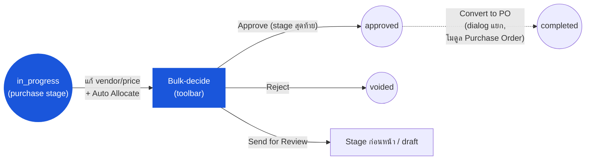

# ใบขอซื้อ (Purchase Request) — User Flow — Purchaser

> **At a Glance**
> **Persona:** Purchaser / Purchasing Staff — ถือ stage `enum_stage_role = purchase` ภายในสายอนุมัติของ PR เอง และแยกต่างหากเป็นผู้ใช้งาน dialog แปลง PR→PO ในโมดูล Purchase Order &nbsp;·&nbsp; **โมดูล:** [purchase-request](/th/inventory/purchase-request) &nbsp;·&nbsp; **Stage ของ workflow:** in_progress (stage `purchase` ของตัวเอง: แก้ vendor/pricing แล้วตัดสินใจแบบ bulk เหมือน stage อื่น) → approved → completed (ผ่าน dialog Convert-to-PO แยกต่างหาก) &nbsp;·&nbsp; **สิทธิ์สำคัญ:** แก้ vendor / ราคาต่อหน่วย / ส่วนลด / tax profile ที่ stage `purchase`, Auto Allocate, bulk Approve / Reject / Send for Review / Split, เลือก PR ที่ approved แล้วเพื่อแปลงเป็น PO
> **persona นี้ทำอะไร:** ที่ stage ของตนในสายอนุมัติของ PR เอง ตั้งหรือตรวจสอบ vendor และราคาต่อบรรทัดแล้วตัดสินใจแบบ bulk เหมือนผู้อนุมัติคนอื่น แยกต่างหาก เมื่อ PR เป็น `approved` แล้ว จะเปิดจาก โมดูล Purchase Order และเลือก PR ที่ approved แล้วหนึ่งใบหรือมากกว่าเพื่อแปลงเป็นใบสั่งซื้อ (group อัตโนมัติตาม vendor, วันส่งของ และสกุลเงิน)

## 1. บทบาทในโมดูลนี้

**Purchaser** (Purchasing Staff) ที่พบบ่อยที่สุดคือ stage ที่ถูก tag `enum_stage_role = purchase` ภายใน workflow PR แบบหลายขั้นตอน **เดียวกัน** กับ stage ของ Department Head / Budget Controller / Finance — มันเป็น role ของ stage ไม่ใช่สถานะเอกสารแยกต่างหาก ขณะที่ PR ยัง `in_progress` และ `workflow_current_stage` ชี้ไปที่ stage นี้ Edit Mode ของ Purchaser จะปลดล็อกฟิลด์บรรทัดที่เคย read-only สำหรับ stage อนุมัติก่อนหน้า — **vendor, ราคาต่อหน่วย, ส่วนลด และ tax profile** — ในขณะที่ `approved_qty` ยังคง lock (chain ผู้อนุมัติตั้งไว้แล้วตาม `PR_VAL_013`) ปุ่ม bulk **Auto Allocate** เรียก price-compare lookup ของ vendor-pricelist ต่อบรรทัดและเติม vendor, ราคา, tax profile และอัตราภาษีจากผลลัพธ์; Purchaser ยัง override บรรทัดใดก็ได้ด้วยมือผ่าน Price Comparison dialog เมื่อ vendor และราคาดูถูกต้องแล้ว Purchaser ทำ **action workflow แบบ bulk เดียวกันกับที่ทุก stage ใช้ได้** — **Approve**, **Reject**, **Send for Review** (send-back), **Split** — จาก bulk toolbar ใน Edit Mode (ไม่มีปุ่ม Approve/Reject แบบ standalone ต่อแถวใน UI ปัจจุบัน; ดู callout ความคลาดเคลื่อนใน [02-business-rules.md](./02-business-rules.md) Section 4) ถ้า `purchase` เป็น stage สุดท้ายของ chain bulk **Approve** คือสิ่งที่พลิก `pr_status` จาก `in_progress` เป็น `approved` (`PR_POST_005`)

แยกต่างหาก — และเฉพาะเมื่อ `pr_status` ของ PR เป็น `approved` แล้วเท่านั้น — Purchaser (หรือใครก็ตามที่มีสิทธิ์สร้างใบสั่งซื้อ) จะเปิด dialog **Convert to PO** จากโมดูล **Purchase Order** (`routes/procurement/purchase-order/po-from-pr-dialog.tsx` — หน้าจอนี้อยู่นอกโมดูล purchase-request) เป็น wizard สองขั้นตอนที่ทำงานบน PR ทั้งใบ ไม่ใช่ workbench ระดับบรรทัด: **ขั้นตอนที่ 1** เลือก workflow ของ PO แล้ว tick PR ที่ approved แล้วหนึ่งใบหรือมากกว่าจากรายการที่ดึงจาก `GET .../purchase-requests/for-po`; **ขั้นตอนที่ 2** เรียก `POST .../purchase-orders/group-pr` ซึ่ง group บรรทัดของ PR ที่เลือกอัตโนมัติตาม `(vendor, delivery_date, currency)` เป็น draft PO group ให้ review; **Confirm** เรียก `POST .../purchase-orders/confirm-pr` เพื่อสร้าง PO การ implement ปัจจุบันแปลง **PR ทั้งใบที่เลือก** — ไม่มี control การจัดสรร vendor ต่อบรรทัด, ไม่มี indicator pricelist-deviation-tolerance และไม่มีฟิลด์ "convert quantity" บางส่วนใน UI ตาม `PR_POST_007` เมื่อทุกบรรทัดของ PR ต้นทางถูก link กับบรรทัด PO ครบแล้ว PR นั้นจะพลิกจาก `approved` เป็น `completed`

### ตำแหน่งใน workflow

```mermaid
graph LR
    inprog(("in_progress<br/>(purchase stage)")):::current -->|"แก้ vendor/price<br/>+ Auto Allocate"| decide["Bulk-decide<br/>(toolbar)"]:::current
    decide -->|"Approve (stage สุดท้าย)"| approved(("approved"))
    decide -->|"Reject"| voided(("voided"))
    decide -->|"Send for Review"| prior["Stage ก่อนหน้า / draft"]
    approved -.->|"Convert to PO<br/>(dialog แยก,<br/>โมดูล Purchase Order)"| completed(("completed"))
    classDef current fill:#1a56db,color:#fff,stroke:#1a56db;
```

### ตารางสิทธิ์ — stage `purchase` (ขณะ `pr_status = in_progress`)

| Action | ที่ stage `purchase` |
|---|---|
| ดู PR | ✅ |
| แก้ vendor / ราคาต่อหน่วย / ส่วนลด / tax profile ต่อบรรทัด | ✅ (Edit Mode) |
| แก้ `approved_qty` | ❌ (chain ผู้อนุมัติตั้งไว้แล้ว; read-only ตาม `PR_VAL_013`) |
| รัน Auto Allocate (เติม vendor + ราคา + tax แบบ bulk) | ✅ |
| Bulk Approve / Reject / Send for Review / Split (toolbar) | ✅ |
| ปุ่ม Approve / Reject แบบ standalone ต่อแถว | ❌ (ช่องว่างตาม BRD — bulk toolbar เท่านั้น) |
| Delete PR | ❌ (Requestor บน draft เท่านั้น) |

### ตารางสิทธิ์ — dialog Convert-to-PO แยกต่างหาก ตาม `pr_status` ของ PR ต้นทาง

| Action | `approved` | `completed` |
|---|---|---|
| เลือก PR เพื่อแปลง | ✅ | ❌ (แปลงครบแล้ว; ถูกตัดออกจากรายการ "for PO") |
| Group PR ที่เลือกอัตโนมัติตาม vendor + วันส่งของ + สกุลเงิน | ✅ | — |
| Confirm → สร้าง PO, link บรรทัด PR กับบรรทัด PO | ✅ | — |
| การแปลงบางส่วน / ปรับ convert-qty ต่อบรรทัด | ไม่มีใน UI ปัจจุบัน | — |

## 2. จุดเริ่มต้นและ flow หลัก

**จุดเริ่มต้น — การตัดสินใจที่ stage:** Sidebar → โมดูล **Purchase Request** → **My Pending** (PR ที่อยู่ที่ stage ซึ่งมอบหมายให้ผู้ใช้ที่ล็อกอิน) หรือ notification deep link → หน้า PR detail

**Flow หลัก — การตัดสินใจที่ stage (happy path):**

1. เปิด PR ที่อยู่ที่ stage `purchase` (`pr_status = in_progress`, `workflow_current_stage` มอบหมายให้ Purchaser) หน้า detail เปิดในโหมด view พร้อม header, บรรทัด และ Activity Log เต็มจากทุก stage ก่อนหน้า
2. คลิก **Edit** เพื่อเข้า Edit Mode vendor, ราคาต่อหน่วย, ส่วนลด และ tax profile กลายเป็นแก้ไขได้ต่อบรรทัด; `approved_qty` ยังคง read-only
3. แบบ optional คลิก **Auto Allocate** เพื่อเติม vendor, ราคา, pricelist reference และ tax แบบ bulk จาก pricelist ปัจจุบันสำหรับทุกบรรทัดที่มีสินค้า, หน่วยที่ขอ และสกุลเงินตั้งไว้ หรือเปิด Price Comparison dialog บนบรรทัดเดี่ยวเพื่อเลือก vendor ด้วยมือ
4. เลือกบรรทัดที่จะดำเนินการ (หรือ **Select All**) แล้วเลือก bulk action จาก toolbar: **Approve** (เดินหน้า — หรือถ้าเป็น stage สุดท้ายของ chain พลิกเป็น `approved`), **Reject** (ยุติ → `voided`, ต้องมีเหตุผล), **Send for Review** (ส่งกลับไป stage ก่อนหน้า, ต้องมีเหตุผล) หรือ **Split** (accept บางบรรทัด, reject บรรทัดอื่น)
5. ยืนยันใน dialog PR จะเดินหน้าต่อ (`pr_status` ยังคง `in_progress` พร้อม stage cursor ที่ย้าย), พลิกเป็น `approved` (stage สุดท้าย clear แล้ว), กลับไป stage ก่อนหน้า / `draft` (send-back) หรือยุติ (`voided`)

**จุดเริ่มต้น — การแปลงเป็น PO:** Sidebar → โมดูล **Purchase Order** → **Create from PR** (`PoFromPrDialog`)

**Flow หลัก — การแปลงเป็น PO (happy path):**

1. เปิด dialog Convert-to-PO **ขั้นตอนที่ 1**: เลือก workflow ของ PO ที่ใบสั่งซื้อใหม่ควรใช้ จากนั้น dialog โหลด PR ที่ approved แล้วและยังไม่ถูกแปลงครบ; tick PR ทั้งใบหนึ่งใบหรือมากกว่า
2. คลิก **Next** ระบบเรียก endpoint group-PR ซึ่งจัด bucket บรรทัดของ PR ที่เลือกตาม `(vendor, delivery_date, currency)` และคืนหนึ่ง draft-PO group ต่อ bucket
3. **ขั้นตอนที่ 2** review แต่ละ group — เลขที่ PO placeholder, vendor, วันส่งของ, สกุลเงิน, จำนวนบรรทัด และยอดรวม ขยายดูบรรทัดสินค้าที่อยู่ข้างในได้
4. คลิก **Confirm** ระบบสร้าง `tb_purchase_order` หนึ่งใบต่อ group พร้อมบรรทัดรายละเอียด และ link แต่ละบรรทัด PR ต้นทางกับบรรทัด PO ใหม่ ตาม `PR_POST_007` PR ต้นทางที่ทุกบรรทัดถูก link ครบแล้วจะพลิกจาก `approved` เป็น `completed`

## 3. แขนงการตัดสินใจ

- **ถ้าบรรทัดไม่มี vendor จัดสรรที่ stage `purchase`**: รัน **Auto Allocate** อีกครั้ง (เติมจาก pricelist ปัจจุบัน) หรือเปิด Price Comparison บนบรรทัดเพื่อเลือก vendor ด้วยมือก่อน bulk-approve
- **ถ้า PR ขาดข้อมูลราคาที่จำเป็นตอนพยายาม bulk action**: validation block action ไว้; Purchaser แก้บรรทัดที่ถูก flag แล้วลองใหม่
- **ถ้า Purchaser ไม่เห็นด้วยกับคำขอทั้งใบ**: เลือก bulk **Reject** พร้อมเหตุผล (`pr_status → voided`, terminal) หรือ bulk **Send for Review** พร้อมเหตุผลและ stage เป้าหมาย (กลับไป stage ก่อนหน้า หรือไปที่ `draft` ถ้าเป้าหมายคือ create stage ของ Requestor)
- **ถ้าบางบรรทัดยอมรับได้และบางบรรทัดไม่ได้**: ใช้ **Split** เพื่อ accept บางส่วนและ reject ที่เหลือ; บรรทัดที่ reject ถูก flag `current_stage_status = rejected` และหลุดจากการดำเนินการต่อไป ขณะที่บรรทัดที่ accept เดินต่อ
- **ถ้า PR ที่เลือกเพื่อแปลงเป็น PO มีมากกว่าหนึ่ง vendor, วันส่งของ หรือสกุลเงิน**: ขั้นตอน group-PR สร้าง draft-PO group หลายใบอัตโนมัติ — หนึ่ง PO ต่อ combination `(vendor, delivery_date, currency)` ที่แตกต่างกัน Purchaser ไม่ต้อง split ด้วยมือ
- **ถ้า PR ที่เลือกเพื่อแปลงถูกแปลงครบแล้ว (`pr_status = completed`)**: มันจะไม่ปรากฏในรายการ PR-for-PO ดังนั้นจึงเลือกซ้ำไม่ได้

## 4. จุดออก / Handoff

- **Bulk Approve ที่ stage สุดท้ายของ chain** `pr_status` พลิกจาก `in_progress` เป็น `approved` (`PR_POST_005`); PR เข้าเกณฑ์การแปลงเป็น PO Handoff ไปยังใครก็ตามที่เปิด dialog Convert-to-PO ในโมดูล Purchase Order ในภายหลัง — ไม่จำเป็นต้องเป็นผู้ใช้คนเดียวกัน
- **Bulk Approve ที่ stage กลาง** `pr_status` ยังคง `in_progress`; handoff ไปยังผู้ใช้ที่มอบหมายของ stage ถัดไป
- **Bulk Send for Review** PR กลับไป stage ก่อนหน้า (หรือไปที่ `draft`, handoff ให้ **Requestor** — ดู [03-user-flow-requestor.md](./03-user-flow-requestor.md))
- **Bulk Reject** `pr_status` พลิกเป็น `voided` (terminal); **Auditor** review ภายหลัง
- **ยืนยัน Convert to PO แล้ว** PR ต้นทางที่ bridge ครบแล้วพลิกจาก `approved` เป็น `completed` (`PR_POST_007`); handoff ไปยังโมดูล [purchase-order](/th/inventory/purchase-order) สำหรับการผูกพัน vendor และติดตามจนถึงรับของ PR ที่ bridge บางส่วน (ถ้า release ในอนาคตเพิ่มการแปลงบางส่วน) จะยังคง `approved`; UI ปัจจุบันแปลง PR ทั้งใบครั้งละใบ

สถานะเอกสารข้ามการ transition เหล่านี้บันทึกโดย `enum_purchase_request_doc_status = { draft, in_progress, voided, approved, completed }` การ void แบบ administrative (ต่างจาก reject ผ่าน workflow) สงวนสำหรับ Finance / system-admin ตาม `PR_AUTH_007`

## 5. แหล่งอ้างอิง

- ภาพรวมหลัก: [03-user-flow.md](./03-user-flow.md)
- ตาราง bridge: [01-data-model.md](./01-data-model.md) Section 2 — `tb_purchase_order_detail_tb_purchase_request_detail` (link บรรทัด PR↔PO)
- กฎการ posting: [02-business-rules.md](./02-business-rules.md) Section 5 — `PR_POST_005` (final approve → `approved`), `PR_POST_007` (convert to PO → bridge writes + `completed`)
- Frontend: `../carmen-inventory-frontend-react/routes/procurement/purchase-request/pr-item-fields.tsx` (Auto Allocate, ฟิลด์ที่แก้ได้ต่อ stage), `../carmen-inventory-frontend-react/routes/procurement/purchase-order/po-from-pr-dialog.tsx` (dialog Convert-to-PO)
- API contracts: `../carmen-turborepo-backend-bruno/collections/carmen-inventory/procurement/purchase-order/POST-group-pr-for-po-procurement-purchase-order.bru`, `POST-confirm-pr-to-po-procurement-purchase-order.bru`
- E2E: `../carmen-inventory-frontend-e2e/tests/304-pr-purchaser-journey.spec.ts` — persona-journey spec ครอบคลุม flow แก้ที่ stage `purchase` + bulk-decide Convert-to-PO ถูกครอบคลุมแยกต่างหาก (หลวมกว่า) ใน `../carmen-inventory-frontend-e2e/tests/301-pr.spec.ts` ใต้ "PR — Convert to PO — Purchase Staff"
- หน้าพี่น้อง: [03-user-flow-approver.md](./03-user-flow-approver.md) — mechanics การตัดสินใจแบบ bulk toolbar เดียวกันใช้ที่ทุก stage ทั้ง approve-role และ purchase-role
- หน้าพี่น้อง: [03-user-flow-requestor.md](./03-user-flow-requestor.md) — เป้าหมาย send-back เมื่อ rollback ถึง create stage
- หน้าพี่น้อง: [หน้าหลักโมดูล](/th/inventory/purchase-request) Section 4 — คำอธิบาย role ของ Purchaser ตามมาตรฐาน
- Cross-link: [purchase-order](/th/inventory/purchase-order) — โมดูลปลายน้ำที่รับ PO ที่แปลงแล้ว
- Cross-link: [vendor-pricelist](/th/inventory/vendor-pricelist) — แหล่ง pricelist สำหรับ Auto Allocate และ Price Comparison
