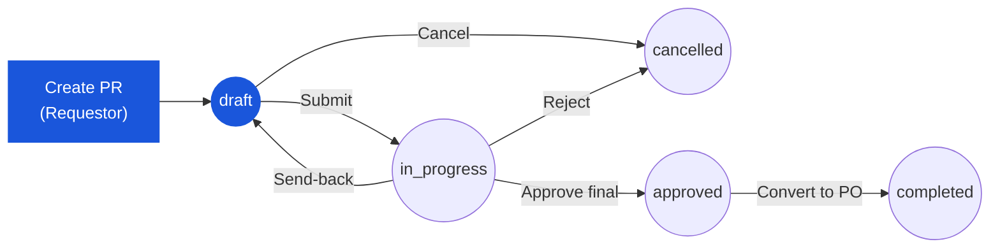

# ใบขอซื้อ (Purchase Request) — User Flow — Requestor

> **At a Glance**
> **Persona:** Requestor (พนักงานโรงแรม / แผนก) &nbsp;·&nbsp; **โมดูล:** [[purchase-request]] &nbsp;·&nbsp; **Stage ของ workflow:** draft → submit → in_progress (+ การกลับเข้าจาก send-back, การ cancel จาก draft) &nbsp;·&nbsp; **สิทธิ์สำคัญ:** create/edit draft, แนบไฟล์, submit, cancel draft ของตัวเอง, resubmit หลัง send-back
> **persona นี้ทำอะไร:** ตั้ง PR — กรอก header และ list บรรทัด, แนบเอกสารประกอบ, submit ขออนุมัติ และแก้ไขเมื่อถูก send back

## 1. บทบาทในโมดูลนี้

**Requestor** คือพนักงานโรงแรมหรือแผนกที่เป็นผู้ตั้ง Purchase Request — สัญญาณความต้องการต้นน้ำที่อนุญาตให้ procurement ดำเนินการก่อนจะมี commitment ภายนอกกับ vendor ใด ๆ พวกเขาเป็นเจ้าของ PR ขณะที่อยู่ใน `draft`: กรอก header (ประเภท PR — `General Purchase`, `Market List`, `Asset` — แผนก, สกุลเงิน, requestor, วันที่ขอและวันที่ต้องการรับ, รหัสงาน/ต้นทุน, จุดส่ง, คำอธิบายและเหตุผล), สร้าง list บรรทัด (สินค้าหรือคำอธิบายแบบ free-text, store location, จำนวนที่ขอ, จำนวน FOC, หน่วยนับ, ราคาต่อหน่วยประมาณ, ส่วนลด, การจัดการภาษี, วันส่งของระดับบรรทัด), แนบเอกสารประกอบ (ใบเสนอราคา, spec, รูปถ่าย) และ submit เมื่อคำขอพร้อมขออนุมัติ การมีส่วนร่วมของพวกเขาไม่จบที่ submit: เมื่อผู้อนุมัติเลือก **Send Back** PR กลับสู่ `draft` และ Requestor กลับเข้า flow เพื่อแก้และ resubmit และในขณะที่ PR ยังอยู่ใน `draft` พวกเขายังสามารถยกเลิกได้ พวกเขาแก้ไข PR หลัง submit ไม่ได้และไม่ใช่ส่วนของขั้นตอนการอนุมัติ, การจัดสรร vendor หรือการแปลงเป็น PO — สิ่งเหล่านั้นเป็นของ chain ผู้อนุมัติ, Purchaser และ Procurement Manager ตามลำดับ (ดู [หน้าหลักโมดูล](/th/inventory/purchase-request) Section 4) แค็ตตาล็อก role อยู่ที่ [หน้าหลักโมดูล](/th/inventory/purchase-request) Section 4

### ตำแหน่งใน workflow (Requestor highlighted)

### ตารางสิทธิ์ — Status × Action (Requestor)

Requestor เป็น **เจ้าของ** PR เฉพาะตอน `draft` เท่านั้น เมื่อออกจาก `draft` (`in_progress`, `approved`, `completed`) หรือสิ้นสุด (`cancelled`, `voided`) Requestor ยังมีสิทธิ์ดูเท่านั้น Action availability ถูกบังคับฝั่ง server โดย `PR_AUTH_001` และ guard ของ state-machine

| Action | draft (ของตัวเอง) | in_progress | approved | completed | cancelled / voided |
|---|---|---|---|---|---|
| ดู PR | ✅ | ✅ | ✅ | ✅ | ✅ |
| แก้ header / บรรทัด | ✅ | ❌ | ❌ | ❌ | ❌ |
| เพิ่ม / ลบ item | ✅ | ❌ | ❌ | ❌ | ❌ |
| เพิ่ม attachment / comment | ✅ | ✅ (comment เท่านั้น) | ✅ (comment เท่านั้น) | ✅ (comment เท่านั้น) | ❌ |
| Submit | ✅ (≥1 บรรทัด + เลือก workflow) | ❌ | ❌ | ❌ | ❌ |
| Cancel | ✅ | ❌ | ❌ | ❌ | — |
| Resubmit (หลัง Send-back) | ✅ (PR กลับมาเป็น `draft`) | ❌ | ❌ | ❌ | ❌ |

> ℹ️ **Send-back loop:** เมื่อผู้อนุมัติเลือก *Send Back* `pr_status` ของ PR กลับสู่ `draft` และ Requestor เป็นเจ้าของอีกครั้ง — ทุก cell ในคอลัมน์ **draft (ของตัวเอง)** ด้านบนใช้อีกครั้ง ประวัติการแก้ไขถูกเก็บไว้ (`PR_POST_008`)

## 2. จุดเริ่มต้นและ flow หลัก

**จุดเริ่มต้น:** Sidebar → โมดูล **Purchase Request** → **PR list view** → ปุ่ม **Create New PR** (หรือทางเลือก: **Create from Template** เมื่อใช้ template ที่บันทึกไว้ หรือ `Alt+N` จากที่ใดในโมดูลก็ได้)

**Flow หลัก (happy path):**

1. จาก PR list view คลิก **Create New PR** ระบบ insert แถว header ใหม่ด้วย `pr_status = draft`, สร้างหมายเลขอ้างอิงอัตโนมัติ, ประทับ `pr_date` ด้วยวันที่วันนี้ และ pre-fill `requestor_id` จากผู้ใช้ที่ล็อกอินอยู่
2. กรอก header: เลือก **ประเภท PR** (`General Purchase`, `Market List`, หรือ `Asset`), ยืนยันหรือเปลี่ยน `department_id`, ตั้ง **วันส่งของ** ที่ต้องการ, เลือก **สกุลเงิน** (อัตราแลกเปลี่ยน fetch อัตโนมัติ), ใส่ **คำอธิบาย / เหตุผล**, และเลือก **workflow_id** เป้าหมายสำหรับ scope `purchase-request` Save header (auto-save ก็ทำงานเมื่อขาดการเชื่อมต่อ)
3. เปิดแท็บ **Items** และคลิก **Add Item** สำหรับแต่ละบรรทัด: ค้นหา product catalog (หรือใช้คำอธิบาย free-text สำหรับ item ที่ไม่อยู่ใน catalog), เลือก **store location**, ใส่ **จำนวนที่ขอ** และ **หน่วยนับ**, ใส่ **ราคาต่อหน่วยประมาณ** (หรือยอมรับราคา pricelist ที่ระบบเติมให้อัตโนมัติ), ตั้ง **จำนวน FOC**, **ส่วนลด** ระดับบรรทัด, การจัดการ **ภาษี** และ **วันส่งของ** ของบรรทัด เพิ่ม note ของบรรทัดถ้ามีประโยชน์
4. ทำซ้ำ step 3 จนทุกบรรทัดที่ต้องการอยู่บน PR Inline validation flag ฟิลด์ required ที่ขาดในแต่ละบรรทัด (อ้างอิงกฎ: `PR_VAL_006` ต้องการบรรทัดที่ไม่ลบอย่างน้อยหนึ่งบรรทัดตอน submit; validation ระดับบรรทัดถูกบังคับก่อนบันทึก line ได้)
5. Review **financial summary** บน header: subtotal, total discount, total tax และ grand total ทั้งสกุลเงินธุรกรรมและสกุลเงินฐาน ระบบ roll up ค่าระดับบรรทัดที่ปัดเศษแล้ว (3-dp ปริมาณ, 2-dp เงิน, 5-dp อัตราแลกเปลี่ยน)
6. เปิดแท็บ **Attachments** และอัปโหลดเอกสารประกอบ — ใบเสนอราคา, spec สินค้า, รูปถ่าย, การอนุมัติภายใน เพิ่มคำอธิบายและตั้ง visibility ต่อไฟล์
7. กด **budget validation** จาก header แบบ optional ระบบรันเช็คความพร้อมต่อแผนกและ cost-centre budget ของ requestor และแสดง indicator Available / Warning / Exceeded พร้อม breakdown (total budget, soft commitment จาก PR อื่น / PO ที่เปิด, hard commitment) การเช็คนี้เป็นข้อมูลเชิงข้อมูลตอนนี้ — มันไม่บล็อก submit
8. Review PR เต็มในแท็บ **Review**: header, ทุกบรรทัด, ยอดรวม, attachment และ stage ของ workflow ที่จะรันหลัง submit แก้ปัญหาที่พบในที่
9. คลิก **Submit** ระบบรัน validation ตอน submit ทุกตัว (header required field, ≥1 บรรทัด, validation ระดับบรรทัด, workflow active) เมื่อผ่าน transition `pr_status` จาก `draft` เป็น `in_progress`, เลื่อน `workflow_current_stage` ไป stage อนุมัติแรก, สร้าง **soft budget commitment** บน category ที่เกี่ยวข้อง, เขียน audit entry และส่ง notification ไปยังผู้อนุมัติคนแรก (ปกติคือ Department Head) พร้อมสำเนากลับให้ Requestor
10. ติดตามความคืบหน้าจาก dashboard **My PRs** หรือหน้า PR detail — stepper ของ workflow แสดง stage ที่ PR อยู่, ใครเป็นผู้อนุมัติปัจจุบัน และประวัติ action สะสม เส้นทางหลักของ Requestor จบที่นี่สำหรับกรณี happy; พวกเขากลับเข้าเฉพาะกรณี send-back (Section 3)

## 3. แขนงการตัดสินใจ

- **ถ้าฟิลด์ header required ขาดหรือไม่ valid ตอน submit** (เช่นไม่มี `department_id`, ไม่มี `pr_date`, ไม่มี `workflow_id`, สกุลเงินหรืออัตราแลกเปลี่ยนไม่ valid): action submit ถูกบล็อก, form scroll ไปยังฟิลด์ที่ผิดอันแรก และแสดง error inline PR ยังเป็น `draft` แก้ฟิลด์แล้วลอง submit ใหม่
- **ถ้า PR ไม่มีบรรทัดที่ไม่ลบตอน submit** (กฎ `PR_VAL_006`): submit ถูกปฏิเสธด้วยข้อความ "At least one line is required" PR ยังเป็น `draft` เพิ่มอย่างน้อยหนึ่งบรรทัดและ submit ใหม่
- **ถ้า budget validation รายงาน `Warning` หรือ `Exceeded`**: ระบบแสดงผลกระทบ budget แต่ **ไม่** บล็อก submit (budget check เป็น informational ตอน submit) Requestor ตัดสินว่าจะ (a) ลดจำนวนหรือราคาประมาณแล้ว validate ใหม่, (b) แบ่ง request เป็น PR ย่อย หรือ (c) ดำเนินต่อและให้ Budget Controller อนุมัติหรือ reject ปลายน้ำ
- **ถ้าผู้อนุมัติเลือก Send Back** บน PR ที่ submit แล้ว (stage ใดก็ตาม): PR transition จาก `in_progress` กลับเป็น `draft`, soft budget commitment ถูกปล่อยจนกว่าจะ submit ใหม่, เหตุผลของผู้อนุมัติแนบกับ activity log และ Requestor ได้รับแจ้ง Requestor กลับเข้า Section 2 step 2 (แก้ header หรือบรรทัดตาม comment) และ resubmit ที่ step 9 ประวัติการแก้ไขถูกเก็บไว้
- **ถ้า Requestor ต้องการยกเลิก PR ที่ยังไม่ submit**: จากหน้า PR detail หรือ list view เลือก **Cancel** ขณะที่ PR ยังเป็น `draft` ระบบ transition เป็น `cancelled`, ทิ้งการแก้ไขที่ค้างอยู่ และยุติเอกสาร PR ที่ submit แล้ว (`in_progress`, `approved`) ไม่สามารถถูกยกเลิกโดย Requestor — workflow เท่านั้นที่ reject ได้ (transition เป็น `cancelled`) หรือ administrator void ได้ (transition เป็น `voided`)
- **ถ้า Requestor พยายามแก้ PR หลัง submit** (`in_progress`, `approved`, `completed`, `voided`, `cancelled`): ปุ่มควบคุมการแก้ไขทั้งหมดเป็น read-only วิธีเดียวที่จะเปลี่ยนเนื้อหาคือขอให้ผู้อนุมัติปัจจุบันส่ง PR กลับเป็น `draft` เมื่อกลับเป็น `draft`, Requestor ได้สิทธิ์แก้ไขคืนและ flow ดำเนินต่อที่ Section 2 step 2

## 4. จุดออก / Handoff

การมีส่วนร่วมหลักของ Requestor จบเมื่อ PR transition จาก `draft` เป็น `in_progress` ที่ step 9 ของ Section 2 ณ จุดนั้นเอกสารออกจากความรับผิดชอบของ Requestor และถูก pick up โดยผู้อนุมัติ stage แรกใน workflow ที่ตั้งค่าไว้ (ปกติคือ Department Head; ดู [03-user-flow-approver.md](./03-user-flow-approver.md) เมื่อ publish) สถานะเอกสารตอน handoff คือ `in_progress` พร้อม `workflow_current_stage` ชี้ที่ stage อนุมัติแรกและ soft budget commitment ลงทะเบียนกับแผนกของ requestor

ทิศทาง handoff ที่สองคือ **กลับมาที่ Requestor ตอน send-back**: ผู้อนุมัติคนใดบน chain อาจส่ง PR กลับเป็น `draft` พร้อมเหตุผล ปล่อย soft commitment นี่ไม่ใช่จุดออกจริง — Requestor กลับเข้าที่ Section 2 step 2 เพื่อแก้ PR และ resubmit Cycle ทำซ้ำจนกว่า PR จะ approved (stage สุดท้าย), rejected (`cancelled`) หรือ voided (`voided`)

จุดออก terminal สำหรับ Requestor (ไม่มี action เพิ่มเติมโดยพวกเขา) ได้แก่:

- **ยกเลิกโดย Requestor ใน draft** — `pr_status = cancelled`, terminal
- **ปฏิเสธโดยผู้อนุมัติ** — `pr_status = cancelled`, terminal Auditor review หลังเหตุการณ์
- **Void โดย System Administrator** — `pr_status = voided`, terminal Auditor review หลังเหตุการณ์
- **Approved และแปลงเป็น PO** — `pr_status = completed`, terminal Purchaser เป็นเจ้าของการแปลง; Requestor เห็น PO ที่ link บนหน้า PR detail สำหรับ traceability

## 5. แหล่งอ้างอิง

- ภาพรวมหลัก: [03-user-flow.md](./03-user-flow.md)
- `../carmen/docs/purchase-request-management/PR-User-Experience.md` — แหล่งหลักของ flow การสร้าง, submit และ send-back
- `../carmen/docs/purchase-request-management/PR-Overview.md` — ภาพรวมโมดูล, นิยาม role ของ requestor, จุด integration
- `../carmen/docs/purchase-request-management/purchase-request-module-prd.md` — product requirement ที่ขับเคลื่อน flow ของ Requestor
- หน้าพี่น้อง: [01-data-model.md](./01-data-model.md) — `tb_purchase_request`, `tb_purchase_request_detail`, `enum_purchase_request_doc_status`
- หน้าพี่น้อง: [02-business-rules.md](./02-business-rules.md) — `PR_VAL_006` (at-least-one-line) และ validation อื่น ๆ ตอน submit
- หน้าพี่น้อง: [หน้าหลักโมดูล](/th/inventory/purchase-request) Section 4 — คำอธิบาย role ของ Requestor ตามมาตรฐาน
