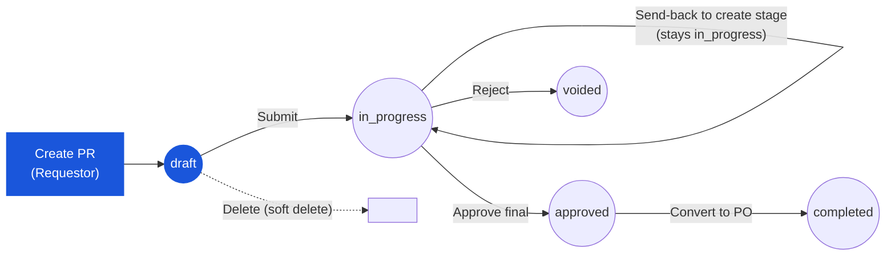

# ใบขอซื้อ (Purchase Request) — User Flow — Requestor

> **At a Glance**
> **Persona:** Requestor (พนักงานโรงแรม / แผนก) &nbsp;·&nbsp; **โมดูล:** [purchase-request](/th/inventory/purchase-request) &nbsp;·&nbsp; **Stage ของ workflow:** draft → submit → in_progress (+ การกลับเข้าจาก send-back ที่ stage `create`, การลบจาก draft) &nbsp;·&nbsp; **สิทธิ์สำคัญ:** `procurement.purchase_request.view` (+ `view_department` / `view_all` สำหรับ scope ของ list), สร้าง / แก้ / ลบ draft ของตัวเอง, submit, resubmit หลัง send-back &nbsp;·&nbsp; **ตรวจสอบซ้ำ 2026-09-22** กับ `routes/procurement/purchase-request/` และ `purchase-request.validate.ts` — หน้านี้เขียนครั้งล่าสุดจาก concept docs เมื่อ 2026-05-20 และมีหน้าจอหลายอย่างที่ไม่มีอยู่จริง (ประเภท PR, แท็บ Review, budget validation, `Alt+N`, auto-save); ถูกตัดออกด้านล่างแล้ว
> **persona นี้ทำอะไร:** ตั้ง PR — กรอก header และ list บรรทัด, แนบเอกสารประกอบ, submit ขออนุมัติ และแก้ไขเมื่อถูก send back

## 1. บทบาทในโมดูลนี้

**Requestor** คือพนักงานโรงแรมหรือแผนกที่เป็นผู้ตั้ง Purchase Request — สัญญาณความต้องการต้นน้ำที่อนุญาตให้ procurement ดำเนินการก่อนจะมี commitment ภายนอกกับ vendor ใด ๆ พวกเขาเป็นเจ้าของ PR ขณะที่อยู่ใน `draft`: กรอก header (**workflow** — บังคับ และเป็นตัวเลือก routing เดียวที่มี; **แผนก**; **วันที่ PR**; คำอธิบาย / note — *ไม่มี*ฟิลด์ประเภท PR, รหัสงาน/ต้นทุน หรือวันส่งของระดับ header ดู [01-data-model](./01-data-model.md) §5), สร้าง grid บรรทัด (สินค้า, store location, delivery point, วันส่งของ, จำนวนที่ขอ + หน่วย, จำนวน FOC + หน่วยแบบ optional, สกุลเงิน; ราคาต่อหน่วย, vendor, ส่วนลด และภาษีเป็นงานของ stage `purchase`), เพิ่ม comment / attachment และกด **Submit** เมื่อคำขอพร้อม การมีส่วนร่วมของพวกเขาไม่จบที่ submit: เมื่อผู้อนุมัติเลือก **Send Back** ไปที่ stage `create` PR คงอยู่ที่ `in_progress` แต่ cursor ของ stage กลับมาที่พวกเขา และพวกเขาแก้ไขแล้ว resubmit; ขณะที่ PR ยังเป็น `draft` พวกเขา **Delete** ได้ พวกเขาไม่ใช่ส่วนของขั้นตอนการอนุมัติ, การจัดสรร vendor หรือการแปลงเป็น PO — สิ่งเหล่านั้นเป็นของ chain ผู้อนุมัติ, Purchaser และ Procurement Manager ตามลำดับ (ดู [หน้าหลักโมดูล](/th/inventory/purchase-request) Section 4)

### ตำแหน่งใน workflow (Requestor highlighted)

```mermaid
graph LR
    create["Create PR<br/>(Requestor)"]:::current --> draft(("draft")):::current
    draft -->|"Submit"| inprog(("in_progress"))
    draft -.->|"Delete (soft delete)"| gone[" "]
    inprog -->|"Send-back to create stage<br/>(stays in_progress)"| inprog
    inprog -->|"Approve final"| approved(("approved"))
    inprog -->|"Reject"| voided(("voided"))
    approved -->|"Convert to PO"| completed(("completed"))
    classDef current fill:#1a56db,color:#fff,stroke:#1a56db;
```

### ตารางสิทธิ์ — Status × Action (Requestor)

Requestor เป็น **เจ้าของ** PR ขณะที่อยู่ใน `draft` (`created_by_id` หรือ `requestor_id` เท่ากับผู้ใช้ที่ล็อกอิน — `common/helpers/document-ownership.helper.ts`) หลัง submit พวกเขาลงมือได้อีกครั้งเฉพาะเมื่อ send-back พา PR มาจอดที่ stage `create` ซึ่งใส่ id ของพวกเขากลับเข้า `user_action.execute[]`

| Action | draft (ของตัวเอง) | in_progress (ที่ stage `create` หลัง send-back) | in_progress (stage อื่น) | approved | completed | voided |
|---|---|---|---|---|---|---|
| ดู PR | ✅ | ✅ | ✅ | ✅ | ✅ | ✅ |
| แก้ header / บรรทัด | ✅ | ✅ | ❌ | ❌ | ❌ | ❌ |
| เพิ่ม / ลบ item | ✅ | ✅ | ❌ | ❌ | ❌ | ❌ |
| เพิ่ม comment | ✅ | ✅ | ✅ | ✅ | ✅ | ✅ |
| Save ทั้งที่บรรทัดไม่ครบ (qty `0`) | ✅ (ตั้งแต่ 2026-09-21) | ✅ | ❌ | ❌ | ❌ | ❌ |
| Submit | ✅ (≥1 บรรทัด แต่ละบรรทัดซื้อหรือ FOC) | ✅ (resubmit) | ❌ | ❌ | ❌ | ❌ |
| Delete | ✅ (soft delete; เมนู row ของ list, **Delete** บน detail หรือ batch แบบ multi-select) | ❌ ("Only draft purchase requests can be deleted") | ❌ | ❌ | ❌ | — |
| Duplicate | ✅ | ✅ | ✅ | ✅ | ✅ | ✅ (ทุกสถานะ — `/new?duplicate_id=`) |

> ℹ️ **Send-back loop:** `pr_status` ไม่กลับไป `draft` หลัง send-back เลย (`purchase-request.service.ts:2052` เขียนทับเป็น `in_progress`); สิ่งที่เปลี่ยนคือ `workflow_current_stage` ประวัติการแก้ไขถูกเก็บไว้ใน `workflow_history` และ log ของ comment (`PR_POST_008`)

## 2. จุดเริ่มต้นและ flow หลัก

**จุดเริ่มต้น:** Sidebar → **Purchase Request** → list (`/procurement/purchase-request` เรียงตามวันที่เป็น default แท็บ *My Pending* / *All*) → **New** (`pr-create-dialog.tsx`) → **Blank** (`/procurement/purchase-request/new`) หรือ **From Template** (`/procurement/purchase-request/from-template` ดู [templates/purchase-request](/th/inventory/templates/purchase-request)) action **Duplicate** บน PR ใดก็ตามเปิด `/new?duplicate_id=<id>` ที่เติมข้อมูลไว้แบบเดียวกัน

**Flow หลัก (happy path):**

1. เปิดฟอร์ม PR ใหม่ ยังไม่มีอะไรถูกเขียน — row ถูกสร้างตอน **Save** ครั้งแรก (`POST /:bu_code/purchase-requests`, `stage_role = create`) ซึ่งสร้าง `pr_no` ฝั่ง server, ประทับ `pr_date` (default วันนี้) และ snapshot requestor จากผู้ใช้ที่ล็อกอิน
2. กรอก header: เลือก **workflow** (บังคับ — ฟอร์มบล็อกการสร้างเมื่อไม่มี workflow ที่ผู้ใช้สร้างได้ "noCreatableWorkflow"), ยืนยัน **แผนก**, ใส่ **คำอธิบาย** สกุลเงินและอัตราแลกเปลี่ยนอยู่บนแต่ละบรรทัด ไม่ใช่บน header
3. ใน grid รายการคลิก **Add Item** และต่อบรรทัด เลือก **สินค้า** (row แบบ hover / ขยายแสดง on-hand, on-order และข้อมูลการรับของล่าสุดแบบ live จาก [inventory](/th/inventory/inventory)), **location**, **delivery point**, **วันส่งของ** (บังคับ), **จำนวนที่ขอ + หน่วย**, **จำนวน FOC + หน่วย** แบบ optional และ **สกุลเงิน** บรรทัดบันทึกได้ด้วยจำนวน `0` — ฟอร์ม draft บังคับเฉพาะการอ้างอิงที่ required (`pr-form-schema.ts`)
4. คลิก **Save** เมื่อสะดวก; draft ที่ไม่ครบบันทึกได้ (commit `a848865f`) ทุกการ save echo `doc_version`; version ที่ stale ได้ `409` ([system-config/doc-version](/th/inventory/system-config/doc-version))
5. เพิ่ม **comment / attachment** จาก sheet comment (`tb_purchase_request_comment`) และ **Print** / **Export** แบบ optional
6. คลิก **Submit** client รัน `findRowsMissingQty` ก่อน — ทุกบรรทัดต้องมี `requested_qty > 0` **หรือ** `foc_qty > 0` — และแสดงคำเตือน "incompleteItems" แทน dialog ยืนยันเมื่อมี row ไม่ผ่าน เมื่อยืนยัน client เรียก `PATCH …/:id/submit` (`stage_role = create`, `doc_version`) server เช็คซ้ำกฎ workflow / requestor / แผนก / วันที่ PR / มีอย่างน้อยหนึ่งบรรทัด / จำนวนและหน่วยต่อบรรทัด (`purchase-request.validate.ts`) หยุดที่ความล้มเหลวแรก และเมื่อสำเร็จพลิก `pr_status` เป็น `in_progress`, ตั้ง `last_action = submitted`, initialise `workflow_current_stage` / `stages_status` และเติม `user_action.execute[]` สำหรับ stage แรก หากต้องการเห็น*ทุก*ปัญหาพร้อมกันก่อน submit client (หรือ tester) เรียก `POST …/verify` ด้วย `verify_state = submit` ได้ (`PR_VAL_017`)
7. ติดตามความคืบหน้าจากแท็บ **My Pending** ของ list, badge สถานะบนหน้า detail และ sheet **Workflow History** หรือคิวข้ามโมดูล [My Approval](/th/inventory/purchase-request/my-approval) (ซึ่ง list draft ของผู้ใช้เองด้วย) เส้นทางหลักของ Requestor จบที่นี่; พวกเขากลับเข้าเฉพาะกรณี send-back (Section 3)

## 3. แขนงการตัดสินใจ

- **ถ้าฟิลด์ header required ขาดตอน save** (`workflow_id`, `department_id`, `pr_date` หรือบรรทัดที่ไม่มีสินค้า / location / หน่วย / สกุลเงิน / delivery point / วันส่งของ): Zod schema บล็อกการ save และ highlight ฟิลด์; PR (ถ้ามีอยู่) ยังเป็น `draft`
- **ถ้าบรรทัดไม่มีจำนวนตอน submit** (`requested_qty = 0` และ `foc_qty = 0`): toast ฝั่ง client ระบุ row ที่ไม่ครบและ dialog ยืนยันไม่เปิด; server จะตอบ `"Detail line N: needs a requested_qty or a foc_qty"` (`PR_ERROR.LINE_ORDERS_NOTHING`) บรรทัด **FOC-only** (`requested_qty = 0`, `foc_qty > 0`, ตั้ง `foc_unit_id`) ได้รับการยอมรับ
- **ถ้า PR ไม่มีบรรทัดตอน submit** (`PR_VAL_006`): schema ฝั่ง client ต้องการอย่างน้อยหนึ่งรายการ; server ตอบ `"PR must have at least one detail line"`
- **ถ้าผู้อนุมัติเลือก Send Back ไปที่ stage create**: `workflow_current_stage` กลับไป stage create, `last_action = reviewed`, เหตุผลถูก append เข้า `workflow_history` และ log ของ comment และ id ของ Requestor กลับเข้า `user_action.execute[]`; PR ยังคง `in_progress` Requestor กลับเข้า Section 2 step 2 และ resubmit ที่ step 6
- **ถ้า Requestor ต้องการทิ้ง PR ที่ยังไม่ submit**: **Delete** (หน้า detail หรือ row ของ list / multi-select) server soft-delete header และบรรทัด (`deleted_at`) — เฉพาะ draft โดยเจ้าของหรือ super-admin (`PR_VAL_018`) ไม่มี action "cancel เป็น `voided`"; `voided` สงวนสำหรับ Reject ของผู้อนุมัติ
- **ถ้า Requestor พยายามแก้ PR หลัง submit** ขณะที่มันอยู่ที่ stage อื่น: ปุ่มควบคุมการแก้ไขทั้งหมดเป็น read-only ทางเดียวที่จะกลับมาคือ Send Back ของผู้อนุมัติไปที่ stage create
- **ถ้าเปิด draft ของคนอื่น**: ดูได้อย่างเดียว — Edit / Delete / Submit ถูกซ่อน และการพยายามลบถูกปฏิเสธตั้งแต่ต้น (`pr-ownership.ts`, commit `9fb747c2`)
- *(แขนง budget-validation และ indicator "Available / Warning / Exceeded" เคยระบุในเอกสารรุ่นก่อน — ยังไม่ยืนยัน ไม่มี code path ดู `PR_VAL_015`)*

## 4. จุดออก / Handoff

การมีส่วนร่วมหลักของ Requestor จบเมื่อ PR transition จาก `draft` เป็น `in_progress` ที่ step 6 ของ Section 2 จากนั้นเอกสารถูก pick up โดยผู้ใช้ที่ระบุใน `user_action.execute[]` ของ stage แรก (ดู [03-user-flow-approver.md](./03-user-flow-approver.md))

ทิศทาง handoff ที่สองคือ **กลับมาที่ Requestor ตอน send-back**: ผู้อนุมัติอาจส่ง PR กลับไป stage create พร้อมเหตุผล นี่ไม่ใช่จุดออกจริง — Requestor แก้และ resubmit Cycle ทำซ้ำจนกว่า PR จะ approved (stage สุดท้าย) หรือ rejected (`voided`)

จุดออก terminal สำหรับ Requestor (ไม่มี action เพิ่มเติมโดยพวกเขา) ได้แก่:

- **ลบใน draft** — row ถูก soft-delete; หายจากทุก list และจากคิว pending
- **ปฏิเสธโดยผู้อนุมัติ** — `pr_status = voided`, terminal Auditor review หลังเหตุการณ์
- **Approved และแปลงเป็น PO** — `pr_status = completed`, terminal Purchaser เป็นเจ้าของการแปลง; Requestor เห็น PO ที่ link บนหน้า PR detail สำหรับ traceability

## 5. แหล่งอ้างอิง

- ภาพรวมหลัก: [03-user-flow.md](./03-user-flow.md)
- `../carmen/docs/purchase-request-management/PR-User-Experience.md` — แหล่งหลักของ flow การสร้าง, submit และ send-back
- `../carmen/docs/purchase-request-management/PR-Overview.md` — ภาพรวมโมดูล, นิยาม role ของ requestor, จุด integration
- `../carmen/docs/purchase-request-management/purchase-request-module-prd.md` — product requirement ที่ขับเคลื่อน flow ของ Requestor
- หน้าพี่น้อง: [01-data-model.md](./01-data-model.md) — `tb_purchase_request`, `tb_purchase_request_detail`, `enum_purchase_request_doc_status`
- หน้าพี่น้อง: [02-business-rules.md](./02-business-rules.md) — `PR_VAL_006` (at-least-one-line), `PR_VAL_008` (ซื้อหรือ FOC ต่อบรรทัด), `PR_VAL_017` (verify), `PR_VAL_018` (ลบ)
- Frontend: `../carmen-inventory-frontend-react/routes/procurement/purchase-request/` — `pr-create-dialog.tsx`, `pr-new-content.tsx`, `pr-form.tsx`, `pr-form-schema.ts`, `use-pr-form-actions.ts` (`handleSubmitPr`), `pr-ownership.ts`, `from-template/`
- Backend: `../carmen-turborepo-backend-v2/apps/micro-business/src/procurement/purchase-request/logic/purchase-request.validate.ts`, `purchase-request.service.ts` (`delete`, `deleteBatch`)
- E2E: `../carmen-inventory-frontend-e2e/tests/302-pr-creator-journey.spec.ts`, gap report `docs/test-cases/gaps/302-pr-creator-journey-gap.md`
- หน้าพี่น้อง: [หน้าหลักโมดูล](/th/inventory/purchase-request) Section 4 — คำอธิบาย role ของ Requestor ตามมาตรฐาน
