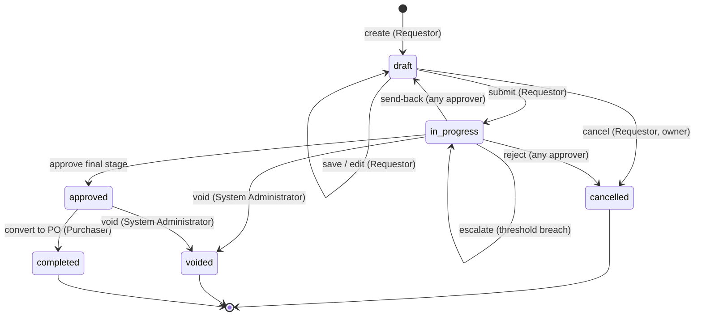

# ใบขอซื้อ (Purchase Request) — User Flow

> **At a Glance**
> **โมดูล:** [[purchase-request]] &nbsp;·&nbsp; **Persona:** Requestor &nbsp;·&nbsp; Approver &nbsp;·&nbsp; Procurement Manager &nbsp;·&nbsp; Purchaser &nbsp;·&nbsp; Audit / Config
> **วงจรชีวิตของ workflow:** Draft → In Progress (อนุมัติหลายระดับ) → Approved → Completed (พร้อมเส้นทางย่อยไปยัง Cancelled / Voided)
> **เจาะดูมุมมองแยกตาม persona ด้านล่างเพื่อรายละเอียดในระดับ action**

## 1. ภาพรวม

หน้านี้เป็น **จุดเริ่มต้นภาพรวม** สำหรับชุด user-flow ของโมดูล `purchase-request` ครอบคลุมวงจรชีวิตของเอกสาร Purchase Request หนึ่งใบ — ส่วนหัวของ PR (`tb_purchase_request`) พร้อมกับรายการสินค้าหนึ่งรายการหรือมากกว่า (`tb_purchase_request_detail`) — ตั้งแต่ตอนที่ Requestor บันทึก draft ครั้งแรก ผ่านสายอนุมัติหลายระดับ ไปจนถึงการแปลงเป็นใบสั่งซื้อหรือการสิ้นสุดด้วยการ void / ยกเลิก persona ที่เกี่ยวข้องคือ **Requestor** (ผู้ตั้งและแก้ไข PR), สายอนุมัติ **Approver** (Department Head, Budget Controller, Finance และ stage escalation ใด ๆ), **Purchaser** (ผู้แปลง PR ที่อนุมัติแล้วเป็น PO), **Procurement Manager** (กำกับและอนุมัติ PR มูลค่าสูง) และบทบาท **Audit / Config** (Auditor สำหรับ review แบบอ่านอย่างเดียว, System Administrator สำหรับตั้งค่า workflow) แค็ตตาล็อก role อยู่ที่ [หน้าหลักโมดูล](/th/inventory/purchase-request) Section 4

Section 2 ด้านล่างเป็น **state machine ของระบบ** — รายการการ transition ตามมาตรฐานข้ามค่าของ `enum_purchase_request_doc_status` โดยไม่ขึ้นกับว่าใครเป็นคนลงมือ ไฟล์ของแต่ละ persona (link จาก Section 3) จะอธิบาย *เส้นทางที่ persona นั้นเดินผ่าน* state machine — จุดเริ่มต้น, action ที่ใช้ได้, แขนงการตัดสินใจ และ handoff ที่จบการมีส่วนร่วมของพวกเขา จากนั้น Section 4 จะสรุป handoff ข้าม persona ที่ร้อยเส้นทางแต่ละเส้นเข้าด้วยกัน อ่านภาพรวมนี้ก่อนเพื่อจับ lifecycle จากนั้นเจาะลงไปที่ไฟล์ persona ที่ตรงกับ role ของคุณ

## 2. วงจรชีวิตของเอกสาร

สถานะของเอกสาร PR เก็บไว้ที่ `tb_purchase_request.pr_status` และจำกัดไว้ที่ค่าที่ประกาศใน `enum_purchase_request_doc_status`: `draft`, `in_progress`, `voided`, `approved`, `completed`, `cancelled` การ transition ด้านล่างคือการเคลื่อนที่ที่ถูกต้องระหว่างพวกมัน อย่างอื่นจะถูก workflow engine ปฏิเสธ

| จากสถานะ | Action | ไปสถานะ | อนุญาตให้ใคร | เงื่อนไขก่อน |
| ---------- | ------ | -------- | ----------- | -------------- |
| `(none)` | create | `draft` | Requestor | ฟิลด์ header ผ่านการตรวจสอบ (`requestor_id`, `department_id`, `pr_date`, `workflow_id`); ยังไม่ต้องมี line |
| `draft` | save (edit) | `draft` | Requestor (เจ้าของ) | PR ยังเป็นของ requestor; ยังไม่มีการเลื่อน stage ของ workflow |
| `draft` | submit | `in_progress` | Requestor (เจ้าของ) | มี line ที่ไม่ถูกลบอย่างน้อยหนึ่งบรรทัด (`PR_VAL_006`); ทุก validation ระดับ line ผ่าน; `workflow_id` ที่เลือก active สำหรับ scope `purchase-request` สร้าง soft budget commitment ตอน transition |
| `draft` | cancel | `cancelled` | Requestor (เจ้าของ) | PR ยังไม่เคยถูก submit (ยังเป็นของ requestor); ยังไม่มีการเลื่อน stage ทิ้งการแก้ไขที่ค้างอยู่ |
| `in_progress` | approve (stage นี้, ไม่ใช่ final) | `in_progress` | ผู้อนุมัติ stage ปัจจุบัน | ผู้อนุมัติถูก assign ที่ `workflow_current_stage` ปัจจุบันด้วย `stage_role = approve`; `last_action` กลายเป็น `approved` และ cursor ของ stage เลื่อนไป |
| `in_progress` | approve (stage สุดท้าย) | `approved` | ผู้อนุมัติ stage สุดท้าย | ผู้อนุมัติถูก assign ที่ stage อนุมัติสุดท้าย; ทุก stage ก่อนหน้าเซ็นแล้ว; soft budget commitment ยังคงอยู่รอการแปลงเป็น PO |
| `in_progress` | send-back | `draft` | ผู้อนุมัติคนใดบน chain | ต้องมีข้อความเหตุผล; soft budget commitment ถูกปล่อยจนกว่าจะ submit ใหม่ มี audit comment เขียน |
| `in_progress` | reject | `cancelled` | ผู้อนุมัติคนใดบน chain | ต้องมีข้อความเหตุผล; soft budget commitment ถูกปล่อย; workflow จบ ไม่อนุญาตให้ทำอะไรเพิ่ม |
| `in_progress` | void | `voided` | System Administrator (หรือ role ระดับสูงอื่น) | ต้องมีข้อความเหตุผล; ใช้สำหรับ void เชิงธุรการหลัง submit (เช่น duplicate, ปัญหา compliance) soft budget commitment ถูกปล่อย |
| `in_progress` | escalate (เกิน threshold) | `in_progress` | Workflow engine / ผู้อนุมัติ stage ปัจจุบัน | `base_total_amount` ของ header เกิน threshold ค่าสูงที่ตั้งไว้; ส่งต่อให้ Procurement Manager เป็น stage ถัดไป สถานะไม่เปลี่ยนแต่ cursor ของ stage กระโดด |
| `approved` | convert to PO | `completed` | Purchaser | line ที่อนุมัติแล้วทั้งหมดถูก bridge เข้าสู่ `tb_purchase_order` หนึ่งใบหรือมากกว่า; PR ถูกปิดไม่ให้แปลงต่อ Soft commitment แข็งตัวเป็น PO commitment |
| `approved` | void | `voided` | System Administrator | ใช้เมื่อ PR ที่อนุมัติแล้วต้องถูกถอนก่อนแปลง (พบไม่บ่อย; ต้องมีเหตุผล) |

## 3. ดัชนี Persona

แต่ละ persona ด้านล่างมีไฟล์ drill-down ของตัวเองที่อธิบายจุดเริ่มต้น, flow หลัก, แขนงการตัดสินใจ และจุดออก slug ตรงกับ role ของ persona; คลิก link เพื่อเปิดมุมมองของแต่ละ persona

- [Requestor](./03-user-flow-requestor.md) — สร้างและ submit PR ตอบสนองต่อ send-back ยกเลิก draft ของตัวเอง
- [Approver](./03-user-flow-approver.md) — สายอนุมัติหลายระดับ (Department Head, Budget Controller, Finance Officer / Manager) พร้อม action approve / send-back / reject / split-reject ในแต่ละ stage
- [Purchaser](./03-user-flow-purchaser.md) — รับ PR ที่อนุมัติแล้ว ตรวจสอบการจัดสรรผู้ขายและราคา แล้วแปลงเป็นใบสั่งซื้อ
- [Procurement Manager](./03-user-flow-procurement-manager.md) — กำกับฟังก์ชัน procurement, อนุมัติ PR มูลค่าสูงหรือที่ถูก escalate, ปรับ vendor ranking และกฎ Allocate Vendor
- [Audit / Config](./03-user-flow-audit-config.md) — Auditor (review PR และ activity log แบบอ่านอย่างเดียว) และ System Administrator (ตั้งค่า stage ของ workflow, threshold, กฎ delegation)

## 4. Handoff ข้าม Persona

ตารางด้านล่างจับโมเมนต์ที่ PR ย้ายความรับผิดชอบจาก persona หนึ่งไปอีก persona handoff แต่ละจุด anchor ที่สถานะของเอกสารตอน transfer

| จาก persona | Trigger | ไป persona | สถานะเอกสารตอน handoff |
| ------------ | ------- | ---------- | ------------------------- |
| Requestor | Submit | ผู้อนุมัติ stage แรก (โดยทั่วไปคือ Department Head) | `in_progress` (cursor ของ stage อยู่ที่ stage อนุมัติแรก) |
| Approver (stage N, ไม่ใช่ final) | Approve ที่ stage นี้ | Approver (stage N+1) | `in_progress` (cursor ของ stage เลื่อนไปยัง stage ถัดไป) |
| Approver (stage สุดท้าย) | Approve ที่ stage สุดท้าย | Purchaser | `approved` |
| Approver (stage ใด ๆ) | Send-back พร้อมเหตุผล | Requestor | `draft` (พร้อมประวัติการแก้ไขและ comment ของผู้อนุมัติที่เก็บไว้) |
| ผู้อนุมัติ stage ปัจจุบัน | จำนวนเงิน header เกิน threshold ค่าสูง | Procurement Manager | `in_progress` (escalate; cursor อยู่ที่ stage Procurement Manager) |
| Purchaser | Convert to PO | โมดูล Purchase Order (และโดยอ้อมไปยัง Receiver / GRN ปลายน้ำ) | `completed` (สร้าง `tb_purchase_order` หนึ่งใบหรือมากกว่า โดย link กลับมายัง PR) |
| System Administrator | Void พร้อมเหตุผล | Auditor (review หลังเหตุการณ์เท่านั้น) | `voided` |
| Approver | Reject พร้อมเหตุผล | Auditor (review หลังเหตุการณ์เท่านั้น) | `cancelled` |

## 5. แหล่งอ้างอิง

- `../carmen/docs/purchase-request-management/PR-User-Experience.md` — แหล่งหลักของ user-experience flow (การสร้าง, การอนุมัติ, การเปรียบเทียบ vendor, การใช้ template)
- `../carmen/docs/purchase-request-management/PR-Overview.md` — ภาพรวมโมดูล, user roles, จุด integration
- `../carmen/docs/purchase-request-management/purchase-request-module-prd.md` — product requirements ที่ขับเคลื่อน flow
- หน้าพี่น้อง: [01-data-model.md](./01-data-model.md) — ค่าตามมาตรฐานของ `enum_purchase_request_doc_status` ที่ใช้ใน Section 2 ด้านบน
- หน้าพี่น้อง: [02-business-rules.md](./02-business-rules.md) — กติกาการ validate, อนุมัติ และ posting ที่อ้างถึงในแต่ละ transition
