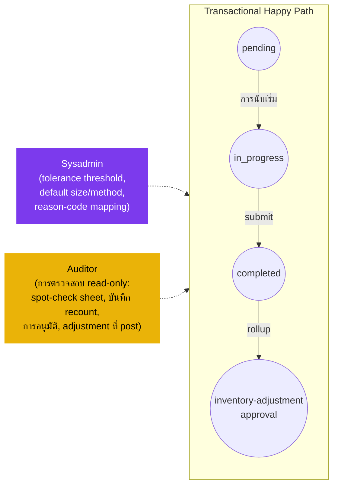

# การสุ่มตรวจ (Spot Check) — User Flow — Audit & Config

> **At a Glance**
> **Persona:** Auditor + Sysadmin (โดยปริยาย) &nbsp;·&nbsp; **โมดูล:** [spot-check](/th/inventory/spot-check) &nbsp;·&nbsp; **ขั้นตอน workflow:** off-path — สังเกต pending → in_progress → completed (+ void); Sysadmin config default ของ tenant &nbsp;·&nbsp; **สิทธิ์สำคัญ:** อ่าน audit chain (Auditor), config tolerance / sampling / reason codes (Sysadmin)
> **สิ่งที่ persona นี้ทำ:** Auditor review หลักฐาน spot-check end-to-end เพื่อ compliance; Sysadmin config tolerance ของ variance และการ map reason-code

## 1. Persona

กลุ่ม persona นี้ยุบสอง role ที่การสัมผัสโมดูล spot-check คือการสังเกตหรือการ config:

- **Auditor** — review ผล spot-check, หลักฐาน recount, และ adjustment ที่ post อย่างเป็นอิสระเพื่อยืนยันว่าการควบคุมทำงานและการสูญเสียได้รับการสืบสวน สังเกตการณ์ spot check ตัวอย่างขณะ in-progress; ตรวจ chain เต็มจากต้นจนจบ (spot-check sheet, บันทึก recount, การอนุมัติ, adjustment ที่ post, journal entry) สำหรับ compliance, segregation-of-duties และการปฏิบัติตามนโยบาย
- **Sysadmin** (โดยปริยาย — ไม่ได้ list ชัดเจนใน persona ของ [spot-check](/th/inventory/spot-check) § 4 แต่อนุมานจาก surface การ config) — config default ของ tenant: tolerance threshold สำหรับ flag variance (`SPC_VAL_006`), default sampling `size`, default `method`, และการ map reason-code สำหรับ `SPOT_CHECK_OVERAGE` / `SPOT_CHECK_SHORTAGE` (หรือ alias เป็น `COUNT_*`) ใน [inventory-adjustment](/th/inventory/inventory-adjustment)

> **Note:** ไม่เหมือน physical-count, โมดูล spot-check **ไม่** กำหนด persona Approver / Finance Reviewer ที่ระดับนี้ — การอนุมัติ rollup-adjustment ลงจอดบนเอกสาร [inventory-adjustment](/th/inventory/inventory-adjustment) และกำกับโดย `ADJ_AUTH_*` ไม่ใช่กฎ spot-check คู่ Auditor / Sysadmin จับ surface ของ audit-and-config เฉพาะของ spot-check

Authority anchor สำหรับ `SPC_AUTH_003`

### ตำแหน่งเทียบกับ flow ธุรกรรม (ผู้สังเกตการณ์นอก path)

### Permission Matrix — V6 Action × Sub-persona (Audit / Config)

ทั้งสอง sub-persona ไม่เกี่ยวข้องกับธุรกรรมในโมดูล spot-check — ไม่มีใครสร้าง แก้ไข submit หรือ void เอกสาร spot-check หมายเหตุ: ไม่เหมือน Physical Count, ไม่มี persona Approver / Finance ที่ระดับ spot-check — การอนุมัติ rollup-adjustment ลงจอดบน [inventory-adjustment](/th/inventory/inventory-adjustment) ตาม `ADJ_AUTH_*` row มาจากหัวข้อ 3 (Primary Actions) ของไฟล์นี้; citation ของกฎอ้างอิง [spot-check/02-business-rules](/th/inventory/spot-check/02-business-rules) § 4 / § 5

| Action | Auditor | Sysadmin |
|---|---|---|
| ดู spot-check header / detail / thread comment (read-only) | ✅ (`SPC_AUTH_003`) | ✅ |
| ดูการมอบหมาย counter (location-grants) และ stamp counted-by | ✅ (`SPC_AUTH_003`) | ✅ |
| ดู rollup adjustment (`tb_stock_in` / `tb_stock_out`) ใน [inventory-adjustment](/th/inventory/inventory-adjustment) | ✅ | ✅ |
| สังเกต spot check ขณะ in-progress (ตัวอย่าง; เพิ่ม comment สังเกต) | ✅ (`SPC_AUTH_003`) | ❌ |
| ตรวจ chain เต็ม (spot-check sheet → recount → การอนุมัติ → posted adj → inventory tx) | ✅ (`SPC_AUTH_003`) | ❌ |
| Verify SoD (submitter ≠ rollup approver) | ✅ (`SPC_AUTH_003`) | ❌ |
| ตั้งค่า tolerance threshold (`SPC_VAL_006` default) | ❌ | ✅ (`SPC_AUTH_003`) |
| ตั้งค่า default sample `size` | ❌ | ✅ (`SPC_AUTH_003`) |
| ตั้งค่า default `method` (`enum_spot_check_method`) | ❌ | ✅ (`SPC_AUTH_003`) |
| ตั้งค่า reason-code mapping (`SPOT_CHECK_OVERAGE` / `SPOT_CHECK_SHORTAGE` → บัญชี GL) | ❌ | ✅ (`SPC_AUTH_003`) |
| สร้าง / แก้ไข / submit / void เอกสาร spot-check | ❌ | ❌ |

## 2. จุดเริ่ม

- **Audit log** — Auditor: มุมมอง read-only ข้ามเอกสาร spot-check, thread comment ของ recount, rollup adjustment, journal entry
- **หน้าจอ Configuration** — Sysadmin: หน้า admin ของ tolerance / default-`size` / default-`method` / reason-code
- **คิวอนุมัติ (cross-reference)** — การอนุมัติ rollup adjustment เองเกิดขึ้นบน flow [inventory-adjustment/03-user-flow-finance](/th/inventory/inventory-adjustment/03-user-flow-finance); Audit / Config persona ที่นี่อ่าน chain ของ spot-check ต้นน้ำเพื่อ back-validate การอนุมัติ

## 3. Primary Actions

| Action | Persona | State precondition | State effect | Notes |
| ------ | ------- | ------------------ | ------------ | ----- |
| สังเกต spot check ขณะ in-progress | Auditor | Spot check อยู่ `in_progress` | (read) การป้อน `actual_qty` สด, การมอบหมาย counter, flag recount | ตัวอย่าง; บันทึกการสังเกตเก็บเป็น `tb_spot_check_comment` |
| ตรวจ chain เต็ม | Auditor | Spot check `completed`; rollup adjustment `completed` | (read) spot-check sheet → บันทึก recount → การอนุมัติ → adjustment ที่ post → inventory transaction → journal entry | audit trail ทั้งหมด |
| Verify SoD บนการอนุมัติ rollup | Auditor | Rollup adjustment `completed` | (read) ตรวจ `tb_stock_in.created_by_id` ≠ approval `last_action_by_id` | SoD: Inventory Controller (submitter ของ spot-check) ≠ approver ของ rollup |
| ตั้งค่า tolerance threshold | Sysadmin | (ใดก็ได้) | Default tenant ใหม่สำหรับ `SPC_VAL_006` | ใช้กับ spot check ในอนาคต |
| ตั้งค่า default `size` | Sysadmin | (ใดก็ได้) | Default tenant ใหม่สำหรับ sample size | ใช้ตอนสร้าง sheet เมื่อไม่ override |
| ตั้งค่า default `method` | Sysadmin | (ใดก็ได้) | Default tenant ใหม่สำหรับ `enum_spot_check_method` | ใช้ตอนสร้าง sheet เมื่อไม่ override |
| ตั้งค่า reason-code mapping | Sysadmin | (ใดก็ได้) | `tb_adjustment_type` row สำหรับ `SPOT_CHECK_OVERAGE` / `SPOT_CHECK_SHORTAGE` (หรือ alias `COUNT_*`) พร้อม `info.glAccount` | ตาม [inventory-adjustment/01-data-model](/th/inventory/inventory-adjustment/01-data-model) § 2.1 |

## 4. Decision Points

- **Auditor — สังเกตเร็วหรือ inspect ช้า** การสังเกตขณะ `in_progress` จับปัญหาวินัยกระบวนการ (counter bias, recount ที่พลาด); การ inspect ช้าหลัง `completed` ของ spot check + chain ของ adjustment ยืนยันว่าเอกสารครบสมบูรณ์สำหรับ external audit
- **Auditor — ความหนาแน่นของตัวอย่าง** spot check เองคือตัวอย่าง; auditor re-sample อิสระเท่าไรขึ้นกับ risk appetite และ findings ของ period ก่อน
- **Sysadmin — ความเข้มงวด vs operational friction** Tolerance ที่แน่นกว่า (% ต่ำ) จับ variance มากกว่าแต่สร้าง overhead recount มากกว่า; tolerance หลวมกว่าทำให้ spot check เร็วแต่อาจ mask shrinkage Default `size` และ `method` เปลี่ยนการเน้นความครอบคลุม (random สำหรับการหมุน, high_value สำหรับการเน้น risk)

> **TODO:** ดึง UI ที่แน่นอนสำหรับ admin tolerance / default-size / default-method จาก `../carmen-inventory-frontend/`; ยืนยันว่า tolerance เป็น per-tenant, per-location หรือ per-category

## 5. Exit / Handoff

| Trigger | Handoff to | Artefact |
| ------- | ---------- | -------- |
| Auditor inspect เสร็จ | (read-only, ไม่เปลี่ยนสถานะ) | รายงาน audit (artefact ภายนอก) |
| Auditor escalate finding | Inventory Controller / Finance | Comment บน `tb_spot_check` หรือบน rollup `tb_stock_in` / `tb_stock_out` พร้อม note finding |
| Sysadmin อัปเดต config | (configuration ใช้กับ spot check ถัดไป) | ค่า default ของ tenant ที่อัปเดต |

## 6. แหล่งอ้างอิง

- **Primary (TODO):** source carmen/docs — ไม่มีสำหรับโมดูลนี้
- **Frontend (TODO):** `../carmen-inventory-frontend/` — audit query และหน้าจอ config admin
- **E2E (TODO):** `../carmen-inventory-frontend-e2e/tests/` — ยังไม่มี spec spot-check
- ที่เกี่ยวข้อง: [spot-check/03-user-flow](/th/inventory/spot-check/03-user-flow) (overview), [spot-check/02-business-rules](/th/inventory/spot-check/02-business-rules) (`SPC_AUTH_003`, `SPC_VAL_006`, `SPC_POST_002`), [physical-count/03-user-flow-audit-config](/th/inventory/physical-count/03-user-flow-audit-config) (flow audit/config คู่เทียบการนับเต็มที่มี Approver/Finance อยู่ใน scope), [inventory-adjustment/03-user-flow-finance](/th/inventory/inventory-adjustment/03-user-flow-finance) (flow approver ฝั่ง rollup ที่ variance adjustment ถูกอนุมัติจริง), [inventory-adjustment/03-user-flow-audit-config](/th/inventory/inventory-adjustment/03-user-flow-audit-config) (flow audit / config คู่ขนานฝั่ง adjustment)
