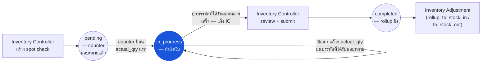

# การสุ่มตรวจ (Spot Check) — User Flow — Counter

> **At a Glance**
> **Persona:** Counter (counter พื้นที่) &nbsp;·&nbsp; **โมดูล:** [spot-check](/th/inventory/spot-check) &nbsp;·&nbsp; **ขั้นตอน workflow:** pending → in_progress (การป้อน actual_qty แรก; แก้ไขบรรทัดที่ได้รับมอบหมาย; แจ้ง IC) &nbsp;·&nbsp; **สิทธิ์สำคัญ:** ป้อน / แก้ไข actual_qty บนบรรทัดที่ได้รับมอบหมาย, comment ระดับบรรทัด, เซ็นปิดกลับ IC
> **สิ่งที่ persona นี้ทำ:** เดินใน location นับรายการใน scope และบันทึก actual_qty เทียบกับ spot-check sheet ที่ได้รับมอบหมาย

## 1. Persona

**Counter** — พนักงานพื้นที่ที่ทำการนับ physical ของรายการหรือ location ใน scope บน spot check ที่ได้รับมอบหมาย บันทึกปริมาณที่นับได้บน detail sheet (`tb_spot_check_detail.actual_qty`) อย่างถูกต้องและทันเวลา flag รายการที่เสียหาย ไม่มีป้าย หรือไม่คุ้นเคยผ่าน comment ระดับบรรทัด และเซ็นปิด sheet ที่เสร็จกลับ Inventory Controller Authority anchor สำหรับ `SPC_AUTH_002`

### ตำแหน่ง workflow (Counter เน้น)

### Permission Matrix — V1 Status × Action (Counter)

Counter เป็น persona ป้อนข้อมูลที่จำกัดขอบเขตอยู่ที่ location ที่ได้รับมอบหมาย อ่านและเขียน `actual_qty` บนบรรทัดของตนและเพิ่ม comment ได้ แต่ submit เอกสาร spot-check หรือเปลี่ยน config ใด ๆ ไม่ได้ row มาจากหัวข้อ 3 (Primary Actions) ของไฟล์นี้; citation ของกฎอ้างอิง [spot-check/02-business-rules](/th/inventory/spot-check/02-business-rules) § 4 / § 5

| Action | Spot check `pending` | Spot check `in_progress` | Spot check `completed` |
|---|---|---|---|
| ดู spot-check sheet ที่ได้รับมอบหมาย (location-scoped) | ✅ (`SPC_AUTH_004`) | ✅ (`SPC_AUTH_004`) | ✅ (read-only) |
| ป้อน `actual_qty` แรก (trigger `pending → in_progress`) | ✅ (`SPC_AUTH_002`) | — | ❌ |
| ป้อน / แก้ไข `actual_qty` บนบรรทัดของ location ที่ได้รับมอบหมาย | — | ✅ (`SPC_VAL_005` — qty ≥ 0) | ❌ (`SPC_VAL_007` — immutable) |
| Flag รายการเสียหาย / ไม่มีป้าย / ไม่คุ้นเคย (comment + photo) | — | ✅ (`SPC_AUTH_002`) | ❌ |
| เพิ่ม free-text comment ให้ spot check | — | ✅ (`SPC_AUTH_002`) | ❌ |
| เซ็นปิด sheet ที่เสร็จ (แจ้ง Inventory Controller) | — | ✅ (notification; ไม่เปลี่ยนสถานะ) | — |
| Submit spot check (`in_progress → completed`) | ❌ (`SPC_AUTH_002` — Inventory Controller เท่านั้น) | ❌ (`SPC_AUTH_002` — Inventory Controller เท่านั้น) | — |
| ดูบรรทัดนอก location ที่ได้รับมอบหมาย | ❌ (`SPC_AUTH_004` — location-scoped) | ❌ (`SPC_AUTH_004` — location-scoped) | ❌ |
| ป้อนใหม่บรรทัด recount ที่ Inventory Controller flag | — | ✅ (ควรเป็น counter คนละคนเพื่อลด bias) | ❌ |

## 2. จุดเริ่ม

- **การมอบหมาย spot-check ของฉัน** — รายการเอกสาร `tb_spot_check` ที่สถานะ `pending` หรือ `in_progress` ซึ่ง counter มี location-grant
- **มุมมอง spot-check sheet** — drill เข้า spot check หนึ่งและเห็นบรรทัด detail สำหรับ location ที่ได้รับมอบหมาย
- **Mobile / handheld scanner** — อุปกรณ์พื้นที่ทั่วไปสำหรับ scan barcode สินค้าและป้อน `actual_qty` ทีละบรรทัด; spot check มักเหมาะกับ mobile มากกว่า physical count เต็มเพราะ scope เล็ก

## 3. Primary Actions

| Action | State precondition | State effect | Notes |
| ------ | ------------------ | ------------ | ----- |
| เปิด spot-check sheet ที่ได้รับมอบหมาย | Spot check อยู่ `pending` หรือ `in_progress`; counter มี location-grant | (read) บรรทัด detail มองเห็น | ตาม `SPC_AUTH_004` |
| ป้อน `actual_qty` แรก | Spot check อยู่ `pending` | Spot check เลื่อนไป `in_progress` | การป้อนบรรทัดแรก trigger transition |
| ป้อน / แก้ไข `actual_qty` บนบรรทัด | บรรทัดภายใน location ที่ได้รับมอบหมาย | `actual_qty` บันทึก; stamp `counted_at` / `counted_by_id` | `actual_qty ≥ 0` ตาม `SPC_VAL_005` |
| Flag รายการเสียหาย / ไม่มีป้าย / ไม่คุ้นเคย | บรรทัดบน spot check ที่ได้รับมอบหมาย | สร้าง `tb_spot_check_detail_comment` row พร้อม attachment (photo) | Soft-flag; Inventory Controller review |
| เพิ่ม comment ให้ spot check | Spot check อยู่ `in_progress` | สร้าง `tb_spot_check_comment` row | บันทึก free-text (เช่น "shelf restock กำลังดำเนิน แนะนำให้ recount บรรทัด 4") |
| เซ็นปิด sheet ที่เสร็จ | ทุกบรรทัดที่ได้รับมอบหมายมี `actual_qty` ไม่เป็น null | Notification ยิงไปยัง Inventory Controller | Counter ไม่ submit เอกสาร — Inventory Controller ทำ ตาม `SPC_AUTH_002` |

## 4. Decision Points

- **รายการเสียหาย / ไม่คุ้นเคย** เมื่อ counter พบรายการที่ไม่ตรงกับ sheet (ไม่มีป้าย เสียหาย จัดประเภทผิด) บรรทัดถูก flag พร้อม comment + photo; การจัดการ variance เป็นการตัดสินใจของ Inventory Controller
- **ศูนย์-บนชั้น vs ศูนย์-นับ** ถ้า sheet แสดง `on_hand_qty > 0` แต่ counter ไม่เห็นอะไร `actual_qty = 0` ถูกป้อนชัดเจน (ไม่ปล่อยว่าง) `actual_qty` ว่างบล็อก submit ตาม `SPC_VAL_004`; ป้อนศูนย์ดำเนินไปสู่ variance flag
- **บรรทัด recount** เมื่อบรรทัดถูก flag ให้ recount, recount ควรทำโดย counter **คนละคน** เพื่อกำจัด bias ในการนับของบุคคล — convention มากกว่า constraint hard ใน schema

> **TODO:** ดึงหน้าจอ UI mobile / scanner ที่แน่นอนและ toggle blind-count (book qty ซ่อน) จาก `../carmen-inventory-frontend/` ยืนยันว่านโยบาย blind-count tenant เดียวกันที่ใช้ใน physical-count ใช้ที่นี่หรือไม่

## 5. Exit / Handoff

| Trigger | Handoff to | Artefact |
| ------- | ---------- | -------- |
| ทำบรรทัดที่ได้รับมอบหมายเสร็จทั้งหมด | Inventory Controller | Notification + tag completion ใน comment thread |
| Flag บรรทัดเพื่อตรวจเพิ่ม | Inventory Controller | `tb_spot_check_detail_comment` พร้อม tag เสียหาย / ไม่มีป้าย |
| (ไม่มี action submit) | Inventory Controller | Counter submit ไม่ได้; เฉพาะ Inventory Controller ตาม `SPC_AUTH_002` |

## 6. แหล่งอ้างอิง

- **Primary (TODO):** source carmen/docs — ไม่มีสำหรับโมดูลนี้
- **Frontend (TODO):** `../carmen-inventory-frontend/` — UI ของ Counter / mobile; ตรวจ cmobile (`../cmobile/`) สำหรับการ implement spot-check sheet ฝั่ง PWA ถ้ามี
- **E2E (TODO):** `../carmen-inventory-frontend-e2e/tests/` — ยังไม่มี spec spot-check
- ที่เกี่ยวข้อง: [spot-check/03-user-flow](/th/inventory/spot-check/03-user-flow) (overview), [spot-check/02-business-rules](/th/inventory/spot-check/02-business-rules) (`SPC_AUTH_002`, `SPC_VAL_004`–`SPC_VAL_005`), [spot-check/03-user-flow-inventory-controller](/th/inventory/spot-check/03-user-flow-inventory-controller) (คู่ handoff), [physical-count/03-user-flow-counter](/th/inventory/physical-count/03-user-flow-counter) (flow counter คู่เทียบการนับเต็ม)
