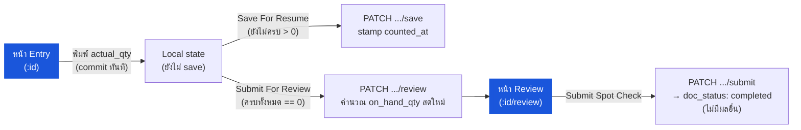

# การสุ่มตรวจ (Spot Check) — User Flow — หน้า Entry & Review

> **At a Glance**
> **หน้าจอ:** `spot-check/:id` (`sc-entry-component.tsx`) และ `spot-check/:id/review` (`sc-review-component.tsx`) &nbsp;·&nbsp; **โมดูล:** [spot-check](/th/inventory/spot-check) &nbsp;·&nbsp; **Role:** ผู้ใช้ที่มีสิทธิ์ `inventory_management.spot_check` คนเดียวกันที่บันทึกใน [03-user-flow-inventory-controller.md](/th/inventory/spot-check/03-user-flow-inventory-controller)
> **สิ่งที่ persona นี้ทำ:** ป้อน `actual_qty` ต่อสินค้าที่สุ่มได้ แนบ note/photo ต่อบรรทัด (ทางเลือก) save ความคืบหน้า submit เพื่อ review และยืนยัน submit ขั้นสุดท้าย

## 1. ขอบเขตหน้าจอ

หน้านี้ — carry มาจากชื่อ persona "Counter" ของดราฟต์ก่อนหน้า — บันทึกหน้า entry และ review จริง ไม่มีการมอบหมาย zone, ไม่มี grant counter-ต่อ-location, และไม่มีข้อจำกัดว่าใครแก้ไขบรรทัดใดได้: ผู้ใช้ใดก็ตามที่มี permission ของโมดูลสามารถแก้ไขบรรทัดใดบน spot check ใดก็ได้

### Action หน้า Entry (`sc-entry-component.tsx`)

```mermaid
graph LR
    entry[["หน้า Entry\n(:id)"]]:::current
    entry -->|"พิมพ์ actual_qty\n(commit ทันที)"| commit["Local state\n(ยังไม่ save)"]
    commit -->|"Save For Resume\n(ยังไม่ครบ > 0)"| save["PATCH .../save\nstamp counted_at"]
    commit -->|"Submit For Review\n(ครบทั้งหมด == 0)"| review["PATCH .../review\nคำนวณ on_hand_qty สดใหม่"]
    review --> reviewScreen[["หน้า Review\n(:id/review)"]]:::current
    reviewScreen -->|"Submit Spot Check"| submit["PATCH .../submit\n→ doc_status: completed\n(ไม่มีผลอื่น)"]
    classDef current fill:#1a56db,color:#fff,stroke:#1a56db;
```

### สิ่งที่หน้า entry แสดง

- **Header** (`sc-entry-header.tsx`) — ชื่อ/รหัสตำแหน่ง, badge method, badge สถานะ, จำนวน `counted/total`, เปอร์เซ็นต์เสร็จ, progress bar, และ `start_date` ของ spot check
- **ช่องค้นหา + filter pill สถานะ** — All / Counted / Uncounted กรองแถวสินค้าที่มองเห็นฝั่ง client; ค้นหาตรงกับชื่อ/รหัส/SKU/ชื่อท้องถิ่นสินค้า
- **ปุ่ม Refresh** — fetch spot check ใหม่ (ไม่ re-run logic การสุ่มหรือเพิ่มบรรทัดใหม่ — set สินค้าของ spot check ถูกกำหนดตายตัวตอนสร้าง ต่างจาก Refresh ของ physical-count เอง)
- **Import / Export** — Export เขียน `.xlsx` ของยอดนับปัจจุบัน (id, รหัส/ชื่อ/ชื่อท้องถิ่น/SKU สินค้า, หน่วย, `actual_qty`); Import อ่าน spreadsheet กลับและ match แถวตาม SKU รายงานจำนวน matched/skipped
- **แถวสินค้า** (`EntryItemRow`, virtualized) — ชื่อ/รหัส/ชื่อท้องถิ่น/SKU สินค้า ช่องกรอกตัวเลข `actual_qty` ปุ่ม calculator (คำนวณ total จากปริมาณ case/unit) label หน่วยนับ และลิงก์ "Add Notes" เปิด dialog แชร์ (ข้อความอิสระ + photo attachment รองรับโดย `tb_spot_check_detail_comment`) ปริมาณ book (`on_hand_qty`) ไม่เคยแสดงบนหน้านี้
- **"Set X Empty to Zero"** — เติมค่า `0` ในเครื่องให้ทุกบรรทัดที่ยังไม่นับ (ไม่ save ให้เองอัตโนมัติ)
- **Save For Resume vs. Submit For Review** — footer แสดง **Save For Resume** เมื่อยังมีบรรทัดที่ยังไม่นับ; เมื่อทุกบรรทัดมีค่า (จากการแก้ไขในเครื่องหรือ save ก่อนหน้า) Save หายไปเหลือแค่ **Submit For Review** นี่เป็น gate ฝั่ง client เท่านั้น — backend ไม่บังคับการตรวจความครบถ้วนบนทั้งสอง call

### สิ่งที่หน้า review แสดง (`sc-review-component.tsx` ผ่าน `ReviewComponent` แชร์)

- ชื่อ/รหัสตำแหน่ง และสี่ตัวนับสรุปจาก payload review: **matches** (`diff_qty === 0`), **variances**, **overages** (`diff_qty > 0`), **shortages** (`diff_qty < 0`)
- รายการบรรทัดเฉพาะที่มี variance แต่ละบรรทัดแสดงปริมาณระบบ (`on_hand_qty` — คำนวณสดใหม่โดย call Submit-for-Review ก่อนหน้า), ปริมาณจริง, variance (`diff_qty`), และหน่วย
- ปุ่ม **Submit Spot Check** เดียว — action ขั้นสุดท้าย terminal ของทั้งเอกสาร ผลของมันมีแค่ `doc_status → completed` บวก stamp `end_date`; ไม่มีเอกสารอื่นถูกสร้างและไม่มีอะไรเขียนลง inventory ledger

## 2. จุดเริ่ม

- **จากหน้ารายการ** — Start (ใหม่) หรือ Resume navigate ตรงไปยัง `spot-check/:id` (ดู [03-user-flow-inventory-controller.md](/th/inventory/spot-check/03-user-flow-inventory-controller))
- **จาก tab History** — คลิก spot check ในประวัติใด ๆ สถานะใดก็ได้ ก็ route ไปยัง `spot-check/:id` เช่นกัน; ไม่มีหน้า detail read-only แยกต่างหาก (ดู caveat ด้านล่าง)

## 3. Primary Actions

| Action | State precondition | State effect | Notes |
| ------ | ------------------ | ------------ | ----- |
| ป้อน/แก้ไข `actual_qty` บนบรรทัด | สถานะใดก็ได้ | Local state เท่านั้น จนกว่าจะ Save หรือ Submit for Review | ไม่พบขั้นต่ำฝั่ง client (ต่างจาก entry row ของ physical-count ที่ clamp `≥ 0`) |
| แนบ note/photo ให้บรรทัด | เวลาใดก็ได้ | `POST /spot-check-detail-comment/:detailId` (multipart: `message`, `type`, `files`) | รองรับโดย `tb_spot_check_detail_comment`; component dialog notes แชร์เดียวกับที่ physical-count ใช้ |
| Save For Resume | อย่างน้อยหนึ่งบรรทัดมีค่า; เอกสาร `pending` หรือ `in_progress` | `PATCH .../save` — stamp `counted_at`/`counted_by_id` และคำนวณ `diff_qty` ใหม่บนบรรทัดที่ส่งเทียบกับ `on_hand_qty` ที่เก็บอยู่ปัจจุบัน; call แรกยังพลิก `pending → in_progress`; ต้องส่ง `doc_version` | Reject นอก `{pending, in_progress}` (`SPC_VAL_007`) |
| Submit For Review | ทุกบรรทัดมีค่ากรอกในเครื่อง (`uncountedCount === 0`, gate ฝั่ง client เท่านั้น) | `PATCH .../review` — คำนวณ `on_hand_qty`/`diff_qty` ใหม่ทุกบรรทัดจากยอด ledger สด; stamp `counted_at`/`counted_by_id`; navigate ไป `/review` | **ไม่** เปลี่ยน `doc_status`; **ไม่มี** guard สถานะเลย — รันกับเอกสารที่ `completed`/`void` ก็ได้ถ้าถูก trigger (เช่นผ่าน tab History) |
| Submit (ขั้นสุดท้าย จาก `/review`) | เอกสารยังไม่ `completed`/`void` | `PATCH .../submit` — `doc_status → completed`; stamp `end_date` | ไม่มีการตรวจความครบถ้วน (`SPC_VAL_008`) Terminal; ไม่มี rollup ไม่มีผลต่อ ledger |

## 4. Decision Points

- **Save ก่อน vs. พิมพ์ต่อ** การ Save ระหว่างนับเป็น action เดียวที่พลิก `doc_status` จาก `pending` เป็น `in_progress` — พึ่ง Submit for Review อย่างเดียวเพื่อทำ sheet ให้เสร็จหมายความว่าเอกสารอาจไปถึง `completed` โดยไม่เคยผ่าน `in_progress` เลย ไม่มีผลใด ๆ ต่อการทำงาน (ทั้งสอง path ไปถึง terminal state เดียวกัน) แต่ควรรู้ไว้เมื่ออ่าน `doc_status` ในรายงานหรือ dashboard
- **การเปิดใหม่จาก History** เพราะ click handler ของ tab History route ไปหน้า entry ไม่ว่างสถานะใด การเปิด spot check ที่ `completed` แล้วแล้วกดต่อไป Submit for Review จะเขียนทับแถว detail ของมันเงียบ ๆ ทั้ง `on_hand_qty`/`actual_qty`/`diff_qty`/`counted_at` — มีเพียงขั้นตอนสุดท้าย Submit เท่านั้นที่ถูกบล็อกจริง ๆ เมื่อพยายามครั้งที่สอง
- **Import vs. ป้อนเอง** Import match แถวเข้าบรรทัดตาม SKU สินค้า และรายงานจำนวน matched/skipped — มีประโยชน์สำหรับโหลด export ของ handheld scanner จำนวนมาก; มันไม่ตรวจ tolerance ใด ๆ เพราะไม่มี tolerance อยู่

## 5. Exit / Handoff

| Trigger | Handoff to | Artefact |
| ------- | ---------- | -------- |
| Submit (ขั้นสุดท้าย) | (terminal — ไม่มี handoff) | `tb_spot_check.doc_status = completed`; stamp `end_date` ไม่มีเอกสารอื่นถูกสร้าง |
| Navigate back | [หน้ารายการ](/th/inventory/spot-check/03-user-flow-inventory-controller) | ไม่เปลี่ยนสถานะ (เว้นแต่ call Save หรือ Submit for Review ยิงไปแล้ว) |

## 6. แหล่งอ้างอิง

- **Frontend:** `../carmen-inventory-frontend-react/routes/inventory-management/spot-check/sc-entry-component.tsx`, `sc-review-component.tsx`, `sc-entry-header.tsx`, `sc-entry-notes-dialog.tsx`
- **Backend:** `../carmen-turborepo-backend-v2/apps/micro-business/src/inventory/spot-check/spot-check.service.ts` (`saveItems`, `reviewItems`, `getReview`, `submit`)
- **E2E:** `../carmen-inventory-frontend-e2e/tests/` — ยังไม่มี spec spot-check; manual test-case catalog ที่ `docs/test-cases/760-spot-check.md`
- ที่เกี่ยวข้อง: [spot-check/03-user-flow](/th/inventory/spot-check/03-user-flow) (overview), [spot-check/02-business-rules](/th/inventory/spot-check/02-business-rules) (`SPC_VAL_007`–`008`, `SPC_POST_001`–`004`), [spot-check/03-user-flow-inventory-controller](/th/inventory/spot-check/03-user-flow-inventory-controller) (การเดินทางหน้ารายการ/สร้างของ role เดียวกัน)
