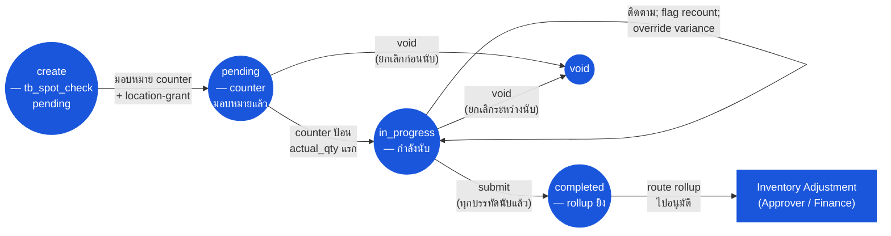

# การสุ่มตรวจ (Spot Check) — User Flow — Inventory Controller

> **At a Glance**
> **Persona:** Inventory Controller &nbsp;·&nbsp; **โมดูล:** [[spot-check]] &nbsp;·&nbsp; **ขั้นตอน workflow:** create → pending → in_progress → completed (+ void) &nbsp;·&nbsp; **สิทธิ์สำคัญ:** สร้าง / มอบหมาย / ติดตาม, flag recount, override variance, submit (ยิง rollup), void
> **สิ่งที่ persona นี้ทำ:** เป็นเจ้าของการ spot-check end-to-end — กำหนดการสุ่ม มอบหมาย Counter review variance และ submit เพื่อยิง rollup ของ adjustment

## 1. Persona

**Inventory Controller** — เจ้าของคนเดียวของการ spot-check: กำหนด selection criteria (`method` = random / high_value / manual, `size` ของตัวอย่าง) จัดตารางและเปิด spot check มอบหมาย Counter ติดตามความคืบหน้า review variance อนุมัติหรือ reject คำขอ recount และ trigger variance rollup ไปยัง [[inventory-adjustment]] Authority anchor สำหรับ `SPC_AUTH_001`

### ตำแหน่ง workflow (Inventory Controller เน้น)

### Permission Matrix — V1 Status × Action (Inventory Controller)

Inventory Controller เป็นเจ้าของคนเดียวของการ spot-check — persona เดียวที่สร้าง spot check, config method และ size, มอบหมาย counter, flag recount, submit และ void ได้ row มาจากหัวข้อ 3 (Primary Actions) ของไฟล์นี้; citation ของกฎอ้างอิง [[spot-check/02-business-rules]] § 4 / § 5

| Action | `pending` | `in_progress` | `completed` | `void` |
|---|---|---|---|---|
| สร้าง spot check (random / high_value / manual) | ✅ (`SPC_VAL_001`–`SPC_VAL_003`) | — | — | — |
| มอบหมาย counter ให้ spot check | ✅ (`SPC_AUTH_001`) | ✅ | ❌ | ❌ |
| ติดตามความคืบหน้า (บรรทัดนับ vs รวม) | ✅ | ✅ (`SPC_CALC_004`) | ✅ (read-only) | ✅ (read-only) |
| Flag บรรทัดให้ recount (variance breach) | — | ✅ (`SPC_VAL_006`) | ❌ | ❌ |
| Override / accept variance (countersignature) | — | ✅ (`SPC_AUTH_001`) | ❌ | ❌ |
| Submit spot check (`in_progress → completed`) | — | ✅ (`SPC_AUTH_001`; `SPC_VAL_004` — ทุกบรรทัดนับ; `SPC_POST_001` rollup ยิง) | — | — |
| Void spot check | ✅ (`SPC_VAL_008`) | ✅ (`SPC_VAL_008`) | ❌ (`SPC_VAL_007` — terminal) | — |
| Route rollup adjustment ไปอนุมัติ | — | — | ✅ — ไปยัง Approver / Finance ผ่าน [[inventory-adjustment]] | — |
| แก้ไขบรรทัดหลัง completion | — | — | ❌ (`SPC_VAL_007` — immutable; สร้าง adjustment ใหม่ตาม `SPC_POST_004`) | — |

## 2. จุดเริ่ม

- **Spot-check scheduler / launcher** — เปิด `tb_spot_check` ใหม่สำหรับ location ประเภท inventory หรือ consignment
- **Spot check ของฉัน** — รายการเอกสาร `tb_spot_check` ที่กำลังดำเนินการเป็นเจ้าของโดย controller (`pending` / `in_progress`)
- **My queue** — บรรทัดที่ flag recount และ submission ที่รอ action จาก controller
- **Notifications** — alert การ complete ของ counter, alert variance-breach

## 3. Primary Actions

| Action | State precondition | State effect | Notes |
| ------ | ------------------ | ------------ | ----- |
| เปิด spot check (random sampling) | Location เป็น inventory- หรือ consignment-type ตาม `SPC_VAL_001` | `tb_spot_check` ใหม่ใน `pending`; `method = random`; ระบบสุ่ม `size` สินค้าที่แตกต่าง | ตาม `SPC_VAL_002`–`SPC_VAL_003` |
| เปิด spot check (high-value sampling) | เหมือนกัน | `tb_spot_check` ใหม่ใน `pending`; `method = high_value`; top-`size` สินค้าตามมูลค่า / velocity สุ่ม | ตาม `SPC_VAL_003` |
| เปิด spot check (manual selection) | เหมือนกัน | `tb_spot_check` ใหม่ใน `pending`; `method = manual`; controller เพิ่ม row `tb_spot_check_detail` ชัดเจน | Manual คือ path event-driven (ต้องสงสัยความไม่ตรง, เหตุการณ์) |
| มอบหมาย counter | Spot check อยู่ `pending` | บันทึก counter location-grant | ตาม `SPC_AUTH_001` |
| ติดตามความคืบหน้า | Spot check อยู่ `in_progress` | (read) บรรทัดที่ `actual_qty` เติม vs รวม | ไม่มีตัวนับ persist บน `tb_spot_check` — derive ตาม `SPC_CALC_004` |
| Flag บรรทัดให้ recount | Variance breach tolerance ตาม `SPC_VAL_006` | Detail-comment พร้อม tag recount | recount ควรทำโดย counter คนละคนเพื่อลด bias |
| Override / accept variance | Flag `SPC_VAL_006` มีอยู่ | Flag เคลียร์; บรรทัด eligible สำหรับ rollup | บันทึก countersignature ของ controller ใน thread detail-comment |
| Submit spot check | บรรทัด detail ทั้งหมดมี `actual_qty`; ไม่มี flag recount เปิด | `doc_status = completed`; สร้าง rollup adjustment | ตาม `SPC_POST_001`–`SPC_POST_002` |
| Void spot check | สถานะเป็น `pending` หรือ `in_progress` | `doc_status = void`; ไม่มี rollup | ตาม `SPC_VAL_008`; การป้อนบางส่วนเก็บไว้ |

## 4. Decision Points

- **การเลือก method** *Random* รักษาการครอบคลุมที่หมุนเวียนของ inventory *High_value* รวมความพยายามบนหมวดที่เสี่ยงต่อการขโมยหรือ pilferage *Manual* ตอบสนองต่อ trigger เจาะจง (ความไม่ตรง, เหตุการณ์, ข้อพิพาท) ขับเคลื่อนโดย risk profile และ operational signal
- **การตอบสนองต่อ tolerance breach** เมื่อ `|diff_qty| / on_hand_qty` เกิน threshold, controller สามารถ (a) trigger recount (counter คนละคน), (b) override / accept variance พร้อม countersignature, (c) hold บรรทัดเพื่อสืบสวน
- **Submit vs hold vs void** เมื่อทุกบรรทัดนับแล้ว controller เลือก submit (ยิง rollup), hold เพื่อ operational reconciliation (เช่น การรับที่คาดหวังยังไม่ post) หรือ void ถ้า spot check เอง scope ผิด

> **TODO:** ดึง UI ที่แน่นอนสำหรับการเลือก method sampling, การ flag recount, countersignature override, และปุ่ม rollup-trigger จาก `../carmen-inventory-frontend/`

## 5. Exit / Handoff

| Trigger | Handoff to | Artefact |
| ------- | ---------- | -------- |
| Submit spot check | ระบบ → rollup ของ [[inventory-adjustment]] | `tb_spot_check.doc_status = completed`; `tb_stock_in` / `tb_stock_out` สร้างพร้อม `info.spotCheckId` |
| Route rollup adjustment ไปอนุมัติ | Audit / Config (Approver / Finance) ตาม `ADJ_AUTH_*` | Rollup `tb_stock_in` / `tb_stock_out` เป็น `in_progress` |
| Void | (terminal) | `tb_spot_check.doc_status = void` |

## 6. แหล่งอ้างอิง

- **Primary (TODO):** source carmen/docs — ไม่มีสำหรับโมดูลนี้
- **Frontend (TODO):** `../carmen-inventory-frontend/` — หน้าจอ UI ของ Inventory Controller
- **E2E (TODO):** `../carmen-inventory-frontend-e2e/tests/` — ยังไม่มี spec spot-check
- ที่เกี่ยวข้อง: [[spot-check/03-user-flow]] (overview), [[spot-check/02-business-rules]] (`SPC_AUTH_001`, `SPC_VAL_*`, `SPC_POST_*`), [[physical-count/03-user-flow-count-lead]] (เส้นทางเจ้าของคู่เทียบการนับเต็ม — persona เดียวกันทำหน้าที่ด้วย scope ที่กว้างกว่า), [[inventory-adjustment/03-user-flow-inventory-controller]] (flow ฝั่ง rollup, persona เดียวกันทำหน้าที่เป็นเจ้าของ adjustment)
