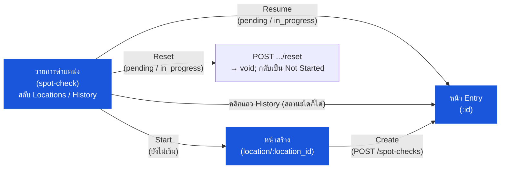

# การสุ่มตรวจ (Spot Check) — User Flow — หน้ารายการ & สร้าง

> **At a Glance**
> **หน้าจอ:** `spot-check` (`sc-component.tsx`) และ `spot-check/location/:location_id` (`sc-form.tsx` ผ่าน `spot-check-by-location-content.tsx`) &nbsp;·&nbsp; **โมดูล:** [spot-check](/th/inventory/spot-check) &nbsp;·&nbsp; **Role:** ผู้ใช้ใดก็ตามที่มีสิทธิ์ `inventory_management.spot_check` — role เดียวกับที่บันทึกใน [03-user-flow-counter.md](/th/inventory/spot-check/03-user-flow-counter) มองจากหน้ารายการ/สร้างแทนที่จะเป็นหน้า entry/review
> **สิ่งที่สองหน้าจอนี้ทำ:** แสดงสถานะ spot-check ของทุกตำแหน่ง (จัดกลุ่มเป็น Resume / Not Started บวก tab History เต็ม) และเริ่ม spot check ใหม่สำหรับตำแหน่งที่ยังไม่มีการตรวจค้าง

## 1. ขอบเขตหน้าจอ

หน้านี้ — carry มาจากชื่อ persona "Inventory Controller" ของดราฟต์ก่อนหน้า — บันทึกหน้ารายการ `spot-check` และหน้าสร้าง `spot-check/location/:location_id` ไม่มีความแตกต่างระดับโค้ดระหว่าง "Inventory Controller" กับ "Counter": ทั้งคู่ของหน้าจอนี้และหน้า entry/review ใน [03-user-flow-counter.md](/th/inventory/spot-check/03-user-flow-counter) ถูกกำหนดสิทธิ์ด้วย permission เดียวกัน `inventory_management.spot_check` และผู้ใช้คนเดียวกันมักเดินผ่านทั้งสี่หน้าจอในเซสชันเดียว

### Layout หน้าจอ (`sc-component.tsx`)

```mermaid
graph LR
    list["รายการตำแหน่ง\n(spot-check)\nสลับ Locations / History"] -->|"Start\n(ยังไม่เริ่ม)"| create["หน้าสร้าง\n(location/:location_id)"]
    list -->|"Resume\n(pending / in_progress)"| entry["หน้า Entry\n(:id)"]
    list -->|"Reset\n(pending / in_progress)"| voidSc["POST .../reset\n→ void; กลับเป็น Not Started"]
    list -->|"คลิกแถว History (สถานะใดก็ได้)"| entry
    create -->|"Create\n(POST /spot-checks)"| entry
    classDef current fill:#1a56db,color:#fff,stroke:#1a56db;
    class list,create,entry current
```

### สิ่งที่หน้ารายการแสดง

- **ปุ่มสลับ Locations / History** — มุมมอง **Locations** (`GET /spot-check/current`) จัดกลุ่มทุกตำแหน่งที่ eligible เป็น **Resume** (มี spot check `pending`/`in_progress`) หรือ **Not Started** (ไม่มี); มุมมอง **History** (`GET /spot-checks`, แบ่งหน้า) แสดง spot check ทุกฉบับที่เคยสร้าง สถานะใดก็ได้ พร้อม filter ตาม location/status/method
- **KPI tiles** (เฉพาะมุมมอง Locations) — จำนวน All / Resume / Not Started แต่ละอันคลิกเป็น filter ได้
- **Checkbox "Include Not Count"** — toggle `include_not_count` บนการเรียก `/current`; ไม่ติ๊ก (default) แสดงเฉพาะตำแหน่งที่ `physical_count_type = yes` (flag ระดับตำแหน่งเดียวกับที่ [physical-count](/th/inventory/physical-count) ใช้สำหรับ period-end gate ของตัวเอง — spot check เองไม่ใช่ period-end gate); ติ๊กแล้วเพิ่มตำแหน่งที่ flag `no`
- **ช่องค้นหา** — filter card ตำแหน่ง/history ที่มองเห็นตามชื่อ/รหัส (Locations) หรือหมายเลข spot-check/ตำแหน่ง (History) ฝั่ง client
- **Card ตำแหน่ง** (`ScLocationCard`) — หนึ่งต่อตำแหน่ง; ตำแหน่ง "Not Started" แสดงปุ่ม **Start**; ตำแหน่งที่มี spot check ค้างแสดง panel ข้อมูล resume (หมายเลข spot-check, badge method, ความคืบหน้า counted/total, badge สถานะ) พร้อมปุ่ม **Resume** และ **Reset**
- **Card History** (`ScHistoryCard`) — หนึ่งต่อ spot check ในประวัติ คลิกเพื่อเปิด (route ไปยังหน้า entry เดียวกันที่บันทึกใน [03-user-flow-counter.md](/th/inventory/spot-check/03-user-flow-counter) ไม่ว่างสถานะใดของ spot check)

### สิ่งที่หน้าสร้างแสดง (`sc-form.tsx` อยู่ในโหมด "add" เสมอที่นี่)

- **Method picker** (`ScMethodPicker`) — สาม card: **Random** (ระบบสุ่ม N สินค้า), **High Value** (ระบบสุ่ม N สินค้าที่มีมูลค่าสูงสุด), **Manual** (เลือกสินค้าเฉพาะ)
- **Location** — ล็อกไว้ตาม `location_id` จาก URL ไม่แก้ไขได้บนหน้านี้
- **ช่อง Items** — แสดงสำหรับ Random และ High Value; ขนาดตัวอย่าง (`size`)
- **ช่อง Min Value** — แสดงเฉพาะ High Value; cost floor ทางเลือก (`minimum_cost`) ตัดสินค้าที่ถูกกว่าออกจากการจัดอันดับ
- **Product transfer** (เฉพาะ method manual) — picker สองคอลัมน์ ย้ายสินค้าระหว่าง "Available" และ "Selected"
- **Description** / **Note** — free-text, optional
- **ปุ่ม Create** — `POST /spot-checks`; เมื่อสำเร็จ navigate ตรงไปหน้า entry (`spot-check/:id`)

## 2. จุดเริ่ม

- **รายการตำแหน่ง** (`spot-check`) — จุดเริ่มเดียว ไม่มีหน้า scheduler หรือปฏิทินแยกต่างหาก
- **Tab History** — เปิด spot check ที่เคยสร้างใหม่อีกครั้ง (สถานะใดก็ได้) ที่หน้า entry เดียวกัน

## 3. Primary Actions

| Action | State precondition | State effect | Notes |
| ------ | ------------------ | ------------ | ----- |
| เริ่ม spot check (Random) | ตำแหน่งไม่มี spot check ค้างอยู่ | `POST /spot-checks` ด้วย `method: "random"`, `items: N`; เอกสารใหม่ที่ `pending`; navigate ไป `/:id` | ตาม `SPC_VAL_001`–`002` |
| เริ่ม spot check (High Value) | เหมือนกัน บวกต้องมี `tb_period` ที่เปิดอยู่/ล็อกอยู่ | `POST /spot-checks` ด้วย `method: "high_value"`, `items: N`, `minimum_cost` ทางเลือก; เอกสารใหม่ที่ `pending` | Reject ด้วย `SPOT_CHECK_NO_ACTIVE_PERIOD` ถ้าไม่มีงวดที่เปิด/ล็อก (`SPC_VAL_004`) |
| เริ่ม spot check (Manual) | เหมือนกัน | `POST /spot-checks` ด้วย `method: "manual"`, `product_id: [...]`; เอกสารใหม่ที่ `pending` | ต้องมีสินค้าที่เลือกอย่างน้อยหนึ่งอยู่ใน eligible pool (`SPC_VAL_003`) |
| Resume การตรวจที่ค้าง | ตำแหน่งมี spot check `pending`/`in_progress` | Navigate ตรงไปยัง `/:id` — ไม่มีเอกสารใหม่สร้าง | เปลี่ยน route ฝั่ง client ล้วน ๆ |
| Reset spot check | ตำแหน่งมี spot check `pending`/`in_progress` | `POST /spot-checks/:id/reset` — `doc_status → void`; ตำแหน่งกลับไปเป็น Not Started | Reject บน `void`/`completed` (`SPC_VAL_006`); **ไม่** ล้างแถว `tb_spot_check_detail` |
| เปิดแถว history | Spot check ใด ๆ สถานะใดก็ได้ | Navigate ไป `/:id` — หน้า entry ไม่ว่างสถานะใด | ดู caveat ใน [03-user-flow.md](/th/inventory/spot-check/03-user-flow) § 2.1 เรื่อง `reviewItems()` ไม่มี guard completed/void |
| Filter ตาม flag ความจำเป็นนับ | ติ๊ก/ไม่ติ๊ก "Include Not Count" | รายการรวม/ตัดตำแหน่งที่ `physical_count_type = no` | ไม่มีผลต่อ period-end gate ใด ๆ — spot check ไม่ใช่ gate |

## 4. Decision Points

- **Random vs. High Value vs. Manual** Random รักษาความครอบคลุมทั่วไป; High Value เน้นตัวอย่างไปที่สินค้าที่มี cost การรับล่าสุดสูงสุดที่ตำแหน่งนั้น (ต้องมีงวดบัญชี active อยู่); Manual คือการเลือกที่จงใจ event-driven — ความสงสัยเจาะจงหรือเหตุการณ์
- **Include Not Count หรือไม่** ไม่ติ๊ก (default) จำกัดรายการให้เหลือตำแหน่งเดียวกับที่ period-end gate ของ [physical-count](/th/inventory/physical-count) สนใจ — แต่เพราะ spot check เองไม่ใช่ gate toggle นี้มีผลแค่ว่าตำแหน่งใดสะดวกเข้าถึงจากหน้านี้ ไม่ใช่ requirement ปลายทางใด
- **Reset vs. ปล่อยไว้** Reset ทำให้เอกสารที่ค้างอยู่เป็น void ทันที (ไม่มีทางกู้คืน) แทนที่จะพัก — ไม่มีตัวเลือก "ยกเลิกแต่เก็บไว้ทีหลัง"; การนับที่พักจริง ๆ ควรปล่อยไว้เป็น `pending`/`in_progress` และ resume ทีหลังดีกว่า reset

## 5. Exit / Handoff

| Trigger | Handoff to | Artefact |
| ------- | ---------- | -------- |
| Create / Start / Resume | [หน้า Entry](/th/inventory/spot-check/03-user-flow-counter) — ผู้ใช้เดิม เซสชันเดิม | `tb_spot_check` เป็น `pending` (ใหม่) หรือ `pending`/`in_progress` (resume) |
| Reset | (terminal สำหรับเอกสารนั้น) | `tb_spot_check.doc_status = void`; ตำแหน่งแสดงเป็น Not Started อีกครั้ง |

## 6. แหล่งอ้างอิง

- **Frontend:** `../carmen-inventory-frontend-react/routes/inventory-management/spot-check/sc-component.tsx`, `sc-form.tsx`, `sc-location-card.tsx`, `sc-history-card.tsx`, `sc-method-picker.tsx`, `sc-reset-dialog.tsx`
- **Backend:** `../carmen-turborepo-backend-v2/apps/micro-business/src/inventory/spot-check/spot-check.service.ts` (`create`, `reset`, `findCurrentByLocation`), `spot-check.logic.ts` (sampling)
- **E2E:** `../carmen-inventory-frontend-e2e/tests/` — ยังไม่มี spec spot-check; manual test-case catalog ที่ `docs/test-cases/760-spot-check.md`
- ที่เกี่ยวข้อง: [spot-check/03-user-flow](/th/inventory/spot-check/03-user-flow) (overview), [spot-check/02-business-rules](/th/inventory/spot-check/02-business-rules) (`SPC_VAL_001`–`004`, `SPC_VAL_006`, `SPC_AUTH_001`), [spot-check/03-user-flow-counter](/th/inventory/spot-check/03-user-flow-counter) (การเดินทางหน้า entry/review ของ role เดียวกัน)
