# การสุ่มตรวจ (Spot Check) — User Flow

> **At a Glance**
> **โมดูล:** [spot-check](/th/inventory/spot-check) &nbsp;·&nbsp; **Persona:** Inventory Controller &nbsp;·&nbsp; Counter &nbsp;·&nbsp; Audit / Config
> **วงจรชีวิต workflow:** Pending → In Progress → Completed (variance rollup ไปยัง [inventory-adjustment](/th/inventory/inventory-adjustment)) พร้อม branch Void
> **ดูรายละเอียดระดับ action ในมุมมองต่อ persona ด้านล่าง**

## 1. ภาพรวม

หน้านี้เป็น **จุดเริ่ม overview** สำหรับชุด user-flow ของโมดูล `spot-check` ไม่เหมือนการดำเนินงานสามชั้น period / document / detail ของ [physical-count](/th/inventory/physical-count), spot check เป็น **การตรวจ ad-hoc สองชั้น** — header `tb_spot_check` หนึ่งต่อคู่ (location, time-window) พร้อม `method` (random / high_value / manual) และ `size`, บวก row ของ `tb_spot_check_detail` ที่ถือ `on_hand_qty` (book snapshot) / `actual_qty` (counted) / `diff_qty` (variance) ต่อสินค้า งานเดินรวดเร็วตามลำดับชั้นนี้: Inventory Controller เปิด spot check, ระบบ (หรือ controller สำหรับ `method = manual`) สุ่ม `size` รายการ, มอบหมาย Counter; Counter เดินใน location และป้อนปริมาณ physical ทีละบรรทัด; Inventory Controller ตรวจสอบ variance, trigger recount, อนุมัติการ complete; rollup จะเขียน variance adjustment ไปยัง [inventory-adjustment](/th/inventory/inventory-adjustment) ซึ่งเป็น path ไปยัง ledger ของ [inventory](/th/inventory/inventory)

หัวข้อ 2 ด้านล่างอธิบาย **state machine ของวงจรชีวิตเอกสาร** สำหรับ `tb_spot_check.doc_status` (`pending → in_progress → completed` บวก path การยกเลิก `void`) โดยไม่ขึ้นกับว่าใครทำ ไฟล์ต่อ persona (ลิงก์จากหัวข้อ 3) อธิบาย *เส้นทางผ่าน* state space นี้ของ persona — จุดเริ่ม action ที่ทำได้ branch ตัดสินใจ handoff ที่จบการมีส่วนร่วม หัวข้อ 4 สรุป handoff ข้าม persona ที่เย็บเส้นทางบุคคลเข้าด้วยกัน (Inventory Controller → Counter สำหรับการมอบหมาย; Counter → Inventory Controller สำหรับเซ็นรับ sheet ที่เสร็จ; Inventory Controller → Approver/Finance สำหรับอนุมัติ adjustment ของ variance ผ่าน [inventory-adjustment](/th/inventory/inventory-adjustment))

> **TODO:** ดึงหน้าจอ UI / flow wizard canonical จาก `../carmen-inventory-frontend/` เมื่อ route `spot-check` ค้นพบได้; cross-reference E2E spec ที่ `../carmen-inventory-frontend-e2e/tests/` เมื่อเพิ่ม (ยังไม่มี spec `spot-check` ณ ขณะนี้) ไม่มี source folder carmen/docs สำหรับโมดูลนี้

## 2. วงจรชีวิตเอกสาร

**State machine ระดับเอกสาร (`enum_spot_check_status`):**

```mermaid
stateDiagram-v2
    [*] --> pending : Inventory Controller สร้าง tb_spot_check (location + method + size) — SPC_VAL_001/002; จับ snapshot on_hand_qty ต่อบรรทัด
    pending --> in_progress : Counter ป้อน actual_qty แรก — SPC_AUTH_004; stamp counted_at / counted_by_id
    in_progress --> in_progress : Counter ป้อน/แก้ไข actual_qty บนบรรทัดที่ได้รับมอบหมาย หรือ Inventory Controller flag บรรทัดให้ recount (SPC_VAL_006)
    in_progress --> completed : Inventory Controller submit — ทุกบรรทัดมี actual_qty (SPC_VAL_004); flag recount แก้ไขแล้ว; rollup ยิง (SPC_POST_001)
    pending --> void : Inventory Controller ยกเลิกก่อนนับเริ่ม — SPC_VAL_008; ไม่มี rollup
    in_progress --> void : Inventory Controller ยกเลิกระหว่างการนับ — SPC_VAL_008; การป้อนบางส่วนเก็บไว้; ไม่มี rollup
    completed --> [*]
    void --> [*]

    note right of completed
        Terminal — immutable (SPC_VAL_007)
        ตอบสนอง End Period Close Stage 2 (BR-PE-006)
        Variance rollup ยิง: diff_qty > 0 -> tb_stock_in (SPOT_CHECK_OVERAGE);
        diff_qty < 0 -> tb_stock_out (SPOT_CHECK_SHORTAGE) — SPC_POST_001
        หมายเหตุ: การ post variance ไป inventory PENDING (ดู 02-business-rules § 5.1)
    end note

    note right of void
        Terminal alternative — ไม่มีผลต่อ ledger
        การตรวจที่ยกเลิกไม่ตอบสนอง End Period Close Stage 2
    end note
```

### 2.1 การเปลี่ยนสถานะระดับเอกสาร (`enum_spot_check_status`)

| From state | Action | To state | อนุญาตให้ | Pre-conditions |
| ---------- | ------ | -------- | ----------- | -------------- |
| `(none)` | สร้าง `tb_spot_check` สำหรับ `(location, method, size)` | `pending` | Inventory Controller | Location เป็น inventory- หรือ consignment-type ตาม `SPC_VAL_001`; `method` และ `size` ตั้งตาม `SPC_VAL_002` ตัวอย่างสร้างตาม `SPC_VAL_003` (random / high_value) หรือว่างสำหรับ manual จับ snapshot `on_hand_qty` ต่อบรรทัด |
| `pending` | counter ป้อน `actual_qty` แรก | `in_progress` | Counter | Counter มี location-grant สำหรับ spot check ตาม `SPC_AUTH_004` |
| `in_progress` | แก้ไข `actual_qty` / เพิ่ม detail comment | `in_progress` | Counter (บรรทัดของตน) | บรรทัดภายใน location-grant ของ counter |
| `in_progress` | flag บรรทัด variance ให้ recount | `in_progress` | Inventory Controller | Variance breach ตาม `SPC_VAL_006` Trigger sub-flow ของ recount |
| `in_progress` | submit (ทุกบรรทัดนับแล้ว) | `completed` | Inventory Controller | ทุกบรรทัด detail มี `actual_qty` ไม่เป็น null ตาม `SPC_VAL_004`; flag recount ทั้งหมดแก้ไขแล้ว ยิง variance rollup ตาม `SPC_POST_001` |
| `pending` | ยกเลิกก่อนนับเริ่ม | `void` | Inventory Controller | อนุญาตตาม `SPC_VAL_008`; ไม่ trigger rollup |
| `in_progress` | ยกเลิกระหว่างการนับ | `void` | Inventory Controller | อนุญาตตาม `SPC_VAL_008`; ไม่ trigger rollup; การป้อนบางส่วนเก็บใน audit log |
| `completed` | ดู / รายงาน / audit | `completed` | ทุก persona (ตามขอบเขต) | Terminal Immutable ตาม `SPC_VAL_007` |
| `void` | ดู / audit | `void` | ทุก persona (ตามขอบเขต) | Terminal alternative ไม่มีผลต่อ ledger |

### 2.2 Variance-rollup fan-out

การเปลี่ยน `in_progress → completed` บน `tb_spot_check` คือ **เหตุการณ์ rollup** ตาม `SPC_POST_001` / `SPC_POST_002`:

- บรรทัดที่ `diff_qty > 0` จัดกลุ่มเป็นเอกสาร `tb_stock_in` หนึ่งฉบับขึ้นไปภายใต้ reason `SPOT_CHECK_OVERAGE` (หรือ alias `COUNT_OVERAGE`)
- บรรทัดที่ `diff_qty < 0` จัดกลุ่มเป็นเอกสาร `tb_stock_out` หนึ่งฉบับขึ้นไปภายใต้ reason `SPOT_CHECK_SHORTAGE` (หรือ alias `COUNT_SHORTAGE`)
- บรรทัดที่ `diff_qty = 0` ไม่สร้าง rollup row
- เอกสาร rollup แต่ละฉบับพกพา `info.spotCheckId = <tb_spot_check.id>` สำหรับการ join ย้อนกลับ
- การ post adjustment (ตาม [inventory-adjustment/03-user-flow](/th/inventory/inventory-adjustment/03-user-flow)) เขียน inventory transaction และ GL entry; spot check เองไม่เขียนลง ledger โดยตรง

> **TODO:** เขียน convention การกำหนดหมายเลขเอกสาร rollup (ว่าหนึ่ง rollup ต่อ spot check, หนึ่งต่อ reason, หรือหนึ่งต่อบรรทัด) เมื่อยืนยัน logic frontend ยืนยันการตั้งชื่อ reason-code

## 3. ไฟล์ Persona

แต่ละไฟล์อธิบายเส้นทางของหนึ่งกลุ่ม persona ผ่านวงจรชีวิตข้างต้น สามกลุ่มยุบจาก persona ต้นทางใน [spot-check](/th/inventory/spot-check) § 4:

- **[Inventory Controller](/th/inventory/spot-check/03-user-flow-inventory-controller)** — กำหนด selection criteria (`method`, `size`), จัดตารางและเปิด spot check, มอบหมาย Counter, ติดตามความคืบหน้า, review variance, อนุมัติหรือ reject คำขอ recount, อนุมัติ adjustment สำหรับการ post
- **[Counter](/th/inventory/spot-check/03-user-flow-counter)** — ทำการนับ physical ของรายการหรือ location ใน scope และบันทึกปริมาณที่นับได้อย่างถูกต้องและทันเวลา
- **[Audit / Config](/th/inventory/spot-check/03-user-flow-audit-config)** — Auditor review ผล spot-check, หลักฐาน recount, และ adjustment ที่ post อย่างเป็นอิสระเพื่อยืนยันว่าการควบคุมทำงานและการสูญเสียได้รับการสืบสวน Sysadmin (โดยปริยาย) config default ของ tolerance / sampling / reason codes

## 4. Handoff ข้าม Persona

| From persona | Trigger | To persona | Handoff artefact |
| ------------ | ------- | ---------- | ---------------- |
| Inventory Controller | สร้าง spot check + มอบหมาย counter | Counter | `tb_spot_check` เป็น `pending`; counter location-grant |
| Counter | ทำบรรทัดที่ได้รับมอบหมายเสร็จ | Inventory Controller | บรรทัด `tb_spot_check_detail` ทั้งหมดมี `actual_qty` ไม่เป็น null |
| Inventory Controller | flag บรรทัด variance ให้ recount | Counter (ควรเป็นคนละคนกับคนนับเดิม) | Detail-comment พร้อม tag recount-required |
| Inventory Controller | submit spot check | ระบบ → rollup → [inventory-adjustment](/th/inventory/inventory-adjustment) | `tb_spot_check.doc_status = completed`; rollup `tb_stock_in` / `tb_stock_out` สร้าง |
| Inventory Controller | route rollup adjustment ไปอนุมัติ | Audit / Config (Approver / Finance ผ่านฝั่ง adjustment) | `tb_stock_in` / `tb_stock_out` เป็น `in_progress` |
| Approver / Finance (ฝั่ง adjustment) | อนุมัติ rollup adjustment | ระบบ → ledger ของ [inventory](/th/inventory/inventory) | `tb_stock_in` / `tb_stock_out` เป็น `completed`; เขียน `tb_inventory_transaction` |
| Auditor | review spot check ที่เสร็จ + adjustment ที่ post | (read-only — terminal) | chain ทั้งหมดอ่านได้: spot-check sheet, บันทึก recount, การอนุมัติ, adjustment ที่ post, journal entry |

> **TODO:** วาด handoff นี้เป็น diagram เมื่อ convention Mermaid / sequence-diagram สำหรับวิกิถูกกำหนด Cross-link ไป [inventory-adjustment/03-user-flow](/th/inventory/inventory-adjustment/03-user-flow) สำหรับ flow ฝั่ง rollup

## 5. แหล่งอ้างอิง

- **Primary (TODO):** source carmen/docs — ไม่มีสำหรับโมดูลนี้
- **Frontend (TODO):** `../carmen-inventory-frontend/` — source ของ UI flow
- **E2E (TODO):** `../carmen-inventory-frontend-e2e/tests/` — ยังไม่มี spec spot-check
- หน้า flow ที่เกี่ยวข้อง: [inventory-adjustment/03-user-flow](/th/inventory/inventory-adjustment/03-user-flow) (flow ฝั่ง rollup), [physical-count/03-user-flow](/th/inventory/physical-count/03-user-flow) (flow คู่เทียบการนับเต็มที่มีโครงสร้างสามชั้น)
