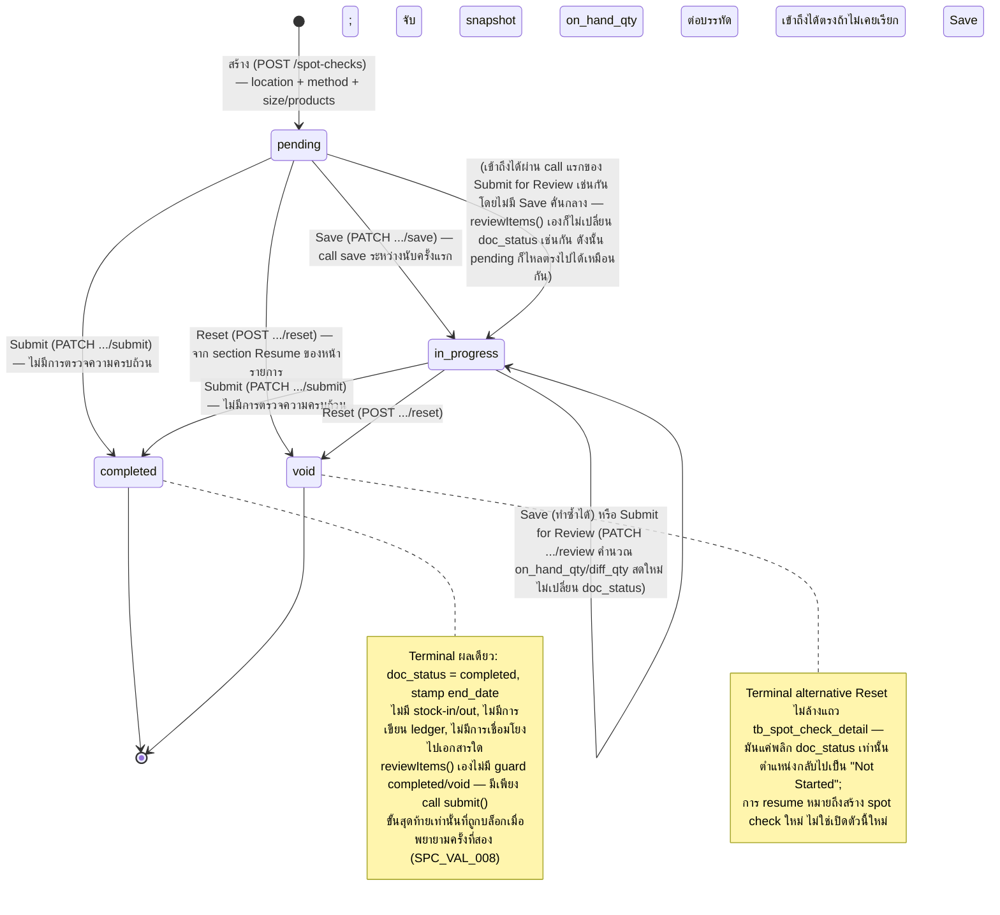

# การสุ่มตรวจ (Spot Check) — User Flow

> **At a Glance**
> **โมดูล:** [spot-check](/th/inventory/spot-check) &nbsp;·&nbsp; **Persona:** role เดียวที่ไม่แยกย่อย ถูกกำหนดสิทธิ์ด้วย permission เดียว (`inventory_management.spot_check`) — สองไฟล์ที่ลิงก์ด้านล่างแบ่งการเดินทางของมันตามหน้าจอ (list/create vs. entry/review) ไม่ใช่ตาม role ที่แตกต่างกันจริง
> **วงจรชีวิต workflow (`enum_spot_check_status`):** `pending → in_progress → completed` หรือ `pending`/`in_progress → void` (Reset) `pending → completed` โดยตรง (ข้าม `in_progress`) ก็เข้าถึงได้เช่นกันหากไม่เคย trigger Save ระหว่างนับ
> **หน้าจอจริง:** `spot-check` (list) → `spot-check/location/:location_id` (create) → `spot-check/:id` (entry) → `spot-check/:id/review` (review ผลต่าง + submit ขั้นสุดท้าย)

## 1. ภาพรวม

หน้านี้เป็น **จุดเริ่ม overview** สำหรับชุด user-flow ของโมดูล `spot-check` การ implement จริงเป็นการเดินทางต่อเนื่องเดียวไม่มีการส่งต่อระหว่างบุคคล: ผู้ใช้ที่มี permission คนเดียวเปิดรายการตำแหน่ง (`spot-check`) เริ่มการตรวจสำหรับตำแหน่งที่ไม่มี spot check ค้างอยู่ (`spot-check/location/:location_id`) โดยเลือก `method` การสุ่มและ scope กรอก `actual_qty` ต่อสินค้าที่สุ่มได้ในหน้า entry (`spot-check/:id`) กด **Submit for Review** เมื่อทุกบรรทัดมีค่ากรอกในเครื่องแล้ว review ผลต่างที่คำนวณได้ที่ `spot-check/:id/review` และกด **Submit** ขั้นสุดท้าย — action ที่ปิดเอกสาร (`doc_status = completed`) และ ต่างจาก [physical-count](/th/inventory/physical-count) ผลิต **ไม่มีผลอื่นใดเลย**: ไม่มีเอกสาร rollup ไม่มีการเขียน ledger

หัวข้อ 2 ด้านล่างอธิบาย state machine ของวงจรชีวิตเอกสารจริงสำหรับ `tb_spot_check.doc_status` หัวข้อ 3 ลิงก์สองไฟล์ที่อธิบาย flow จริงเดียวกันจากสองมุมตามหน้าจอ — หน้ารายการ/สร้าง (`03-user-flow-inventory-controller.md`) และหน้า entry/review (`03-user-flow-counter.md`) — เก็บไว้เป็นหน้าแยกเพื่อความต่อเนื่องกับ layout หน้าของวิกินี้ ไม่ใช่เพราะมี role "Inventory Controller" และ "Counter" ที่แตกต่างกันจริงในโค้ด หัวข้อ 4 เป็น correction note ชี้ไปที่ `03-user-flow-audit-config.md` ซึ่งบันทึกการไม่มีอยู่จริงที่ยืนยันแล้วของ surface Approver/Auditor/Sysadmin ใด ๆ สำหรับโมดูลนี้

## 2. วงจรชีวิตเอกสาร

**State machine ระดับเอกสาร (`enum_spot_check_status`):**

```mermaid
stateDiagram-v2
    [*] --> pending : สร้าง (POST /spot-checks) — location + method + size/products; จับ snapshot on_hand_qty ต่อบรรทัด
    pending --> in_progress : Save (PATCH .../save) — call save ระหว่างนับครั้งแรก
    in_progress --> in_progress : Save (ทำซ้ำได้) หรือ Submit for Review (PATCH .../review คำนวณ on_hand_qty/diff_qty สดใหม่ ไม่เปลี่ยน doc_status)
    pending --> in_progress : (เข้าถึงได้ผ่าน call แรกของ Submit for Review เช่นกัน โดยไม่มี Save คั่นกลาง — reviewItems() เองก็ไม่เปลี่ยน doc_status เช่นกัน ดังนั้น pending ก็ไหลตรงไปได้เหมือนกัน)
    pending --> completed : Submit (PATCH .../submit) — ไม่มีการตรวจความครบถ้วน; เข้าถึงได้ตรงถ้าไม่เคยเรียก Save
    in_progress --> completed : Submit (PATCH .../submit) — ไม่มีการตรวจความครบถ้วน
    pending --> void : Reset (POST .../reset) — จาก section Resume ของหน้ารายการ
    in_progress --> void : Reset (POST .../reset)
    completed --> [*]
    void --> [*]

    note right of completed
        Terminal ผลเดียว: doc_status = completed, stamp end_date
        ไม่มี stock-in/out, ไม่มีการเขียน ledger, ไม่มีการเชื่อมโยงไปเอกสารใด
        reviewItems() เองไม่มี guard completed/void — มีเพียง call submit()
        ขั้นสุดท้ายเท่านั้นที่ถูกบล็อกเมื่อพยายามครั้งที่สอง (SPC_VAL_008)
    end note

    note right of void
        Terminal alternative Reset ไม่ล้างแถว tb_spot_check_detail —
        มันแค่พลิก doc_status เท่านั้น ตำแหน่งกลับไปเป็น "Not Started";
        การ resume หมายถึงสร้าง spot check ใหม่ ไม่ใช่เปิดตัวนี้ใหม่
    end note
```

### 2.1 การเปลี่ยนสถานะระดับเอกสาร (`enum_spot_check_status`)

| From state | Action | To state | อนุญาตให้ | Pre-conditions |
| ---------- | ------ | -------- | ----------- | -------------- |
| `(none)` | สร้าง (`POST /spot-checks`) สำหรับ `(location, method, size หรือ product_id[])` | `pending` | ผู้ใช้ใดก็ตามที่มี `inventory_management.spot_check` | Location มีอยู่ (`SPC_VAL_001`); eligible product pool ไม่ว่างเปล่า (`SPC_VAL_002`); `manual` ต้องมี `product_id[]` ไม่ว่างเปล่าและตรงกับ pool (`SPC_VAL_003`); `high_value` ต้องมี `tb_period` ที่เปิดอยู่/ล็อกอยู่ (`SPC_VAL_004`) จับ snapshot `on_hand_qty` ต่อบรรทัด ณ จุดนี้ |
| `pending` | Save (`PATCH .../save`) | `in_progress` | ผู้ใช้เดิม | `items[]` ไม่ว่างเปล่า (`SPC_VAL_007`) Stamp `counted_at`/`counted_by_id`; คำนวณ `diff_qty` ใหม่เทียบกับ `on_hand_qty` ที่เก็บอยู่ปัจจุบัน |
| `in_progress` | Save (ซ้ำ) | `in_progress` | ผู้ใช้เดิม | เหมือนข้างต้น; ทำซ้ำได้ |
| `pending` / `in_progress` | Submit for Review (`PATCH .../review`) | (ไม่เปลี่ยนสถานะ) | ผู้ใช้เดิม | คำนวณ `on_hand_qty`/`diff_qty` สดใหม่ทุกบรรทัดจากยอด ledger ปัจจุบัน; stamp `counted_at`/`counted_by_id`; navigate ไป `/review` ไม่ถูกบล็อกโดยเอกสารที่ไม่ครบ |
| `pending` / `in_progress` | Submit (`PATCH .../submit`, จาก `/review`) | `completed` | ผู้ใช้เดิม | ไม่มีการตรวจความครบถ้วน (`SPC_VAL_008`) — สำเร็จแม้มีบรรทัดที่ยังไม่นับ Stamp `end_date` Terminal; ไม่มีผลต่อเอกสารหรือ ledger อื่น |
| `pending` / `in_progress` | Reset (`POST .../reset`) | `void` | ผู้ใช้เดิม จาก section Resume ของหน้ารายการ | Reject ถ้าเป็น `void` หรือ `completed` อยู่แล้ว (`SPC_VAL_006`) ไม่ล้างแถว detail |
| `completed` / `void` | ดูเท่านั้น | (ไม่เปลี่ยน) | ผู้ใช้ใดก็ตามที่มี permission ของโมดูล (อ่าน) | เข้าถึงได้จาก tab History ไม่ว่างสถานะใด; หน้า entry render เหมือนเดิม แม้ Save จะถูกบล็อกโดย `SPC_VAL_007` และ Submit ขั้นสุดท้ายถูกบล็อกโดย `SPC_VAL_008` — แต่ Submit for Review **ไม่** ถูกบล็อกและจะเขียนทับแถว detail เงียบ ๆ ถ้าถูก trigger อีก (ดู [02-business-rules.md](/th/inventory/spot-check/02-business-rules) `SPC_POST_004`) |

### 2.2 การ Submit ขั้นสุดท้ายทำอะไร — และไม่ทำอะไร

ตาม `SPC_POST_001`–`003`:

- `doc_status` กลายเป็น `completed`; `end_date` ถูก stamp นั่นคือผลทั้งหมด
- **ไม่มีเอกสาร `tb_stock_in`/`tb_stock_out` ถูกสร้าง** ไม่มี row `tb_inventory_transaction` ถูกเขียน ไม่มีฟิลด์บนตารางใดบันทึกว่า spot check นี้เคยเกิดขึ้น นอกเหนือจากแถวของ spot check เอง
- การแก้ไขผลต่างที่ยืนยันแล้วเป็น action แยกที่ต้อง manual โดยสิ้นเชิง: ผู้ใช้ต้องไปสร้างเอกสาร Stock In/Out ธรรมดาใน [inventory-adjustment](/th/inventory/inventory-adjustment) เอง ไม่มีสิ่งใด pre-fill, ลิงก์ หรือแม้แต่เตือนให้ผู้ใช้สร้างมันขึ้นมา

## 3. ไฟล์ Persona

ทั้งสองไฟล์ด้านล่างอธิบาย **role เดียวที่ถูกกำหนดสิทธิ์เดียวกัน** แบ่งตามหน้าจอที่ใช้:

- **[หน้ารายการ / สร้าง](/th/inventory/spot-check/03-user-flow-inventory-controller)** — เปิดรายการตำแหน่ง เลือกวิธีสุ่มและ scope เริ่ม spot check ใหม่
- **[หน้า Entry / Review](/th/inventory/spot-check/03-user-flow-counter)** — ป้อนบรรทัด notes import/export Submit for Review และ Submit ขั้นสุดท้าย

## 4. กลุ่ม Persona ที่ยืนยันแล้วว่าไม่มีอยู่จริง

ดราฟต์ก่อนหน้าของ wiki module นี้บรรยายกลุ่ม persona ที่สาม — Inventory Controller ที่แยกจาก Counter บวก Auditor และ Sysadmin โดยปริยาย — มอบหมาย counter, flag บรรทัด variance ให้ recount, อนุมัติ rollup adjustment, และ config tolerance threshold กับ reason code การค้นเป้าหมายใน frontend, backend และ Bruno collection ไม่พบ permission key, route, workflow stage หรือ configuration screen ที่ตรงกับสิ่งนี้เลย ดู [03-user-flow-audit-config.md](/th/inventory/spot-check/03-user-flow-audit-config) สำหรับ correction note

## 5. แหล่งอ้างอิง

- **Frontend:** `../carmen-inventory-frontend-react/routes/inventory-management/spot-check/` (`sc-component.tsx`, `sc-form.tsx`, `sc-entry-component.tsx`, `sc-review-component.tsx`)
- **Backend:** `../carmen-turborepo-backend-v2/apps/micro-business/src/inventory/spot-check/spot-check.service.ts`
- **E2E:** `../carmen-inventory-frontend-e2e/tests/` — ยังไม่มี spec spot-check; manual test-case catalog ที่ `docs/test-cases/760-spot-check.md`
- หน้า flow ที่เกี่ยวข้อง: [inventory-adjustment/03-user-flow](/th/inventory/inventory-adjustment/03-user-flow) (จุดที่ต้อง manual แก้ไขผลต่างที่ยืนยันแล้ว), [physical-count/03-user-flow](/th/inventory/physical-count/03-user-flow) (flow คู่เทียบการนับเต็ม)
