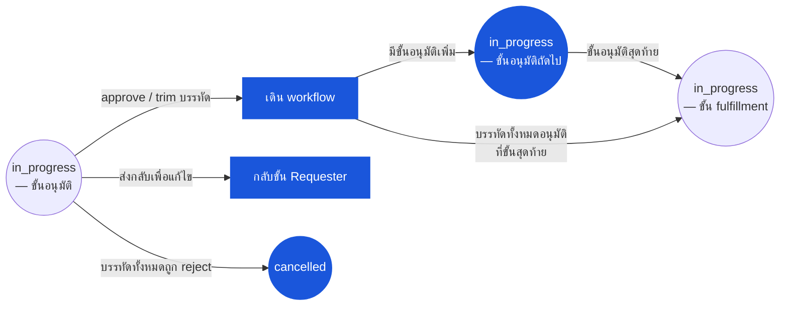

# ใบเบิกของสโตร์ (Store Requisition) — User Flow — Approver

> **At a Glance**
> **Persona:** Approver (Department Head + ขั้นหลัง Ops / Cost Controller) &nbsp;·&nbsp; **โมดูล:** [[store-requisition]] &nbsp;·&nbsp; **ขั้น workflow:** in_progress (ขั้นอนุมัติ) → in_progress (fulfillment) / cancelled / draft (send-back) &nbsp;·&nbsp; **สิทธิ์สำคัญ:** approve, trim approved_qty, reject (บรรทัด / ส่วนหัว), split-reject, send-back
> **persona นี้ทำอะไร:** review บรรทัดของ SR ที่ submit เทียบกับความต้องการ par level และงบประมาณ; อนุมัติ ตัด reject หรือส่งกลับผ่านการเดินขั้น workflow

## 1. บทบาทในโมดูลนี้

Persona **Approver** คือ **Department Head** (หรือในขั้นอนุมัติหลัง ๆ ใน workflow หลายระดับคือ Operations Manager / Cost Controller) ที่เป็นเจ้าของการ review SR ที่ submit แล้วก่อนปล่อยเข้าสู่ fulfillment Approver คือ control gate ระหว่างความต้องการของเอาท์เลต (`requested_qty`) กับสิทธิ์การปล่อยของสโตร์ (`approved_qty ≤ requested_qty`) ตอน entry SR อยู่ที่ `doc_status = in_progress` พร้อม `workflow_current_stage` ชี้ขั้นอนุมัติที่ Approver อยู่ใน `user_action.execute` Approver review แต่ละบรรทัดเทียบกับความจำเป็นเชิงปฏิบัติการ par level ความพร้อมต้นทางปัจจุบัน และงบประมาณ; อนุมัติเต็ม ตัด `approved_qty` ลง reject พร้อมเหตุผล หรือส่งเอกสารกลับให้ requester แก้ไข ลายเซ็น approval / review / rejection ต่อบรรทัด (`approved_by_id`, `review_by_id`, `reject_by_id` บวกคอลัมน์ name / date / message) ถูก persist โดยตรงบน `tb_store_requisition_detail` สำหรับ audit; JSON `history` ต่อบรรทัด append entry `{ seq, name, status, message, by, at }` สำหรับทุก action Approver ไม่เคยเดิน `doc_status` โดยตรง — เดิน `workflow_current_stage`; สถานะส่วนหัวยังคงเป็น `in_progress` ตลอดช่วงอนุมัติ Segregation of duties ห้าม requester เป็น approver (`SR_AUTH_011`); โมดูล SR บังคับใช้ที่ approve action การ delegate การอนุมัติ (Department Head มอบสิทธิ์อนุมัติให้รอง) จัดการที่ชั้น workflow (config `tb_workflow`) ไม่ใช่บน SR เอง

### ตำแหน่งใน workflow (Approver เน้นสี)

### ตารางสิทธิ์ — V2 Action × Stage Role (Approver)

Approver กระทำที่ `doc_status = in_progress` ขณะที่ `workflow_current_stage` ชี้ขั้นอนุมัติที่ Approver อยู่ใน `user_action.execute` โมดูล SR บังคับใช้ Segregation of Duties: Approver ต้องไม่ใช่ผู้ใช้คนเดียวกับ Requester (`SR_AUTH_011`) ใน workflow หลายระดับ action set เดียวกันใช้ที่แต่ละขั้น; Approver ขั้นสอง (Operations Manager / multi-tier) เห็นลายเซ็นขั้นแรกเป็น context เพิ่ม

| Action | Approver ขั้นแรก (Dept Head) | Approver ขั้นสอง (Ops Mgr / multi-tier) |
|---|---|---|
| เปิด SR ที่รออนุมัติ | ✅ (`SR_AUTH_005`) | ✅ (หลังขั้นแรกกระทำ) |
| อนุมัติบรรทัดเต็ม (`approved_qty = requested_qty`) | ✅ (`SR_AUTH_005`) | ✅ (`SR_AUTH_005`) |
| ตัด `approved_qty` ลง (`0 < approved_qty < requested_qty`) | ✅ (`SR_AUTH_005`) | ✅ (`SR_AUTH_005`) |
| Reject บรรทัด (`approved_qty = 0` + `reject_message` บังคับ) | ✅ (`SR_AUTH_005`, `SR_VAL_010`) | ✅ (`SR_AUTH_005`, `SR_VAL_010`) |
| ส่งบรรทัดกลับเพื่อแก้ไข (`review_message` ไม่ว่าง) | ✅ (`SR_AUTH_005`) | ✅ (`SR_AUTH_005`) |
| Split decision — ผสม approve / reject / send-back ต่อบรรทัด | ✅ (`SR_AUTH_006`) | ✅ (`SR_AUTH_006`) |
| อนุมัติ SR ของตน (เมื่อ Approver = Requester) | ❌ (SOD: `SR_AUTH_011`) | ❌ (SOD: `SR_AUTH_011`) |
| เพิ่ม `approved_qty` เกิน `requested_qty` | ❌ (`SR_VAL_010`) | ❌ (`SR_VAL_010`) |
| Commit / issue สินค้า | ❌ (SOD: Approver ≠ Fulfiller `SR_AUTH_012`) | ❌ (SOD: `SR_AUTH_012`) |

> ℹ️ **Multi-tier escalation:** เมื่อยอดรวมของ SR เกิน threshold ของ approver ขั้นแรก workflow เดินไปยัง approver ขั้นสองหลังขั้นแรกกระทำ Approver แต่ละขั้นเห็นลายเซ็นก่อนหน้าเป็น context; การตัดเพิ่มหรือ reject ยังคงอนุญาตที่แต่ละขั้น

## 2. จุดเข้าและ Flow หลัก

**จุดเข้า:** สามเส้นทางสู่ approve action

- **Approvals dashboard → Pending SR approvals** — list view กรองเป็น `(doc_status = 'in_progress', workflow_current_stage = '<approver-stage>', user_action.execute CONTAINS me)`; approver เลือก SR เพื่อเปิด
- **Notification → SR submitted for your approval** — email / in-app notification ตอน submit deep-link ไปยัง SR detail; surface approve action เดียวกัน
- **Multi-tier approval — approver ขั้นสอง** — tenant ที่มีระดับอนุมัติสองระดับขึ้นไปมี approver ขั้นสอง (เช่น Operations Manager สำหรับ SR เกิน threshold) workflow เดียวกันเดินเอกสารจากขั้นแรกไปขั้นสองหลังอนุมัติขั้นแรก; surface approve action เดียวกัน แต่ Approver เห็นลายเซ็นของ approver ขั้นแรกบนแต่ละบรรทัดเป็น context เพิ่ม

**Flow หลัก (เส้นทาง happy path, 8 ขั้น):**

1. **เปิด SR** Detail view แสดงส่วนหัว (ต้นทาง / ปลายทาง, `sr_type`, วันที่, requester, description, dimension), บรรทัดพร้อม `requested_qty` และบล็อก enrichment เฉพาะ UI (on-hand ต้นทางปัจจุบัน, on-order, last price, last vendor, หมวดสินค้า — ไม่ persist บน SR) และ workflow history
2. **ตรวจสอบคำขอเทียบกับ context** สำหรับแต่ละบรรทัด: ปริมาณสอดคล้องกับ par level ของเอาท์เลตหรือไม่ (`product.par_level` join ต่อเอาท์เลต)? ตรงกับ recipe demand ของการผลิตที่วางในงวด (`info.recipe_id` ถ้ามี) หรือไม่? on-hand ต้นทางเพียงพอหรือไม่? การจัดสรร cost-centre (`dimension`) สอดคล้องกับงบประมาณของเอาท์เลตหรือไม่? หน้าจอแสดง budget-impact hint ถ้า Finance ได้เชื่อมโมดูล budget เข้ากับ view ของ approver
3. **การตัดสินใจต่อบรรทัด** สำหรับแต่ละบรรทัด Approver เลือกหนึ่งใน:
   - **อนุมัติเต็ม**: ตั้ง `approved_qty = requested_qty` ต่อบรรทัด: `approved_by_id`, `approved_by_name`, `approved_date_at = now()`, `approved_message` ทางเลือก
   - **ตัดลง**: ตั้ง `approved_qty ∈ (0, requested_qty)` ต่อบรรทัด: คอลัมน์ลายเซ็นเดียวกัน; `approved_message` โดยทั่วไปอธิบายการตัด ("source on-hand limited", "par-level cap", "budget cap") `approved_qty > requested_qty` ถูก reject โดย `SR_VAL_010`
   - **Reject บรรทัด**: ตั้ง `approved_qty = 0` ต่อบรรทัด: `reject_by_id`, `reject_by_name`, `reject_date_at = now()`, `reject_message` **บังคับ** (`SR_VAL_010` ส่วน 2) Requester เห็นเหตุผลตอน resubmit และอาจแก้
   - **ส่งบรรทัดกลับเพื่อแก้ไข**: ตั้ง `review_by_id`, `review_by_name`, `review_date_at = now()`, `review_message` ไม่ว่าง Workflow route เอกสารกลับขั้น requester พร้อม flag บรรทัดนี้; Approver ไม่ตั้ง `approved_qty` (ยังเป็น `0` ตาม default จนกว่า requester resubmit และบรรทัดถูกอนุมัติใน pass ถัดไป)
4. **Split decision ข้ามบรรทัด** ผสมผลลัพธ์บน SR เดียวกันได้ — บางบรรทัดอนุมัติ (เต็มหรือตัด) บางบรรทัด reject บางบรรทัดส่งกลับ Action set เป็นต่อบรรทัด; หน้าจอแสดงยอดสะสมของ "approved value" และ "rejected value" เป็น context
5. **ยืนยัน action** คลิก **Submit Approval Decision** ระบบ fire `SR_VAL_010` ต่อบรรทัด (check cap บน `approved_qty`, การมีอยู่ของ reject-message), `SR_AUTH_005` (Approver อยู่ใน `user_action.execute`), `SR_AUTH_011` (Approver ≠ Requester) และ `SR_AUTH_006` (split & reject อนุญาตถ้ามีบรรทัดอย่างน้อยหนึ่งที่ `approved_qty > 0`)
6. **เดิน workflow** เมื่อบรรทัดทั้งหมดบนขั้นปัจจุบันถูก action แล้ว (ไม่มีบรรทัดเหลือที่สถานะ `submit` โดยไม่มีการตัดสินใจ) ระบบเดิน `workflow_current_stage` ไปขั้นถัดไป ความเป็นไปได้: (a) ขั้นอนุมัติถัดไปสำหรับ workflow หลายระดับ (โดยทั่วไป approver ระดับสูงขึ้น); (b) ขั้น fulfillment เมื่อการอนุมัติทั้งหมดเสร็จและมีบรรทัดอย่างน้อยหนึ่งที่ `approved_qty > 0`; (c) การย้ายอัตโนมัติเป็น `cancelled` ถ้าบรรทัด active ทั้งหมดถูก reject (`Σ approved_qty = 0`); (d) กลับขั้น requester เมื่อบรรทัดใดถูกส่งกลับเพื่อ review
7. **แจ้ง persona ปลายน้ำ** ระบบแจ้งผู้ใช้ขั้นถัดไป (`user_action.execute` ของขั้นใหม่): โดยทั่วไป Fulfiller ที่สถานที่ต้นทางถูกแจ้งเตือนว่า SR ที่อนุมัติพร้อมหยิบ Requester ถูกแจ้งผลลัพธ์ — approve, trim, reject หรือ send-back — ต่อบรรทัด
8. **บันทึก audit trail** `last_action` ถูกอัปเดต (`approved` สำหรับ approve เต็ม / บางส่วน, `rejected` สำหรับ reject เต็ม, `reviewed` สำหรับ send-back) พร้อม `last_action_at_date` และ `last_action_by_id`; `workflow_history` ได้ entry; แต่ละบรรทัดที่แตะได้ JSON `history` append คอลัมน์ลายเซ็นต่อบรรทัดของ approver (`approved_by_*`, `review_by_*`, `reject_by_*`) คือลายเซ็น audit อย่างเป็นทางการ; ตาราง comment สำหรับ thread สนทนาเพิ่ม

## 3. Branch การตัดสินใจ

- **ตัดตามความพร้อมที่ต้นทาง**: on-hand ต้นทางน้อยกว่า requested quantity Approver ตัด `approved_qty` ให้เท่ากับสต๊อกที่มี (หรือเหลือ buffer ใต้นั้นเพื่อความปลอดภัย) การตัดบันทึกด้วย `approved_message = "trimmed to source on-hand"` (หรือคล้ายกัน) Fulfiller จะเห็นค่าที่ตัดตอน issue
- **ตัดตาม par-level cap**: เอาท์เลตมีวินัย par-level (ปริมาณสูงสุดที่ถือต่อสินค้าต่อเอาท์เลต) ถ้าปริมาณที่ขอจะดันการถือของเอาท์เลตเกิน par Approver ตัดให้พอดี par allowance รูปแบบลายเซ็นเดียวกัน
- **ตัดตาม budget cap**: cost-centre ของเอาท์เลตใกล้แตะงบประมาณรายเดือน; Approver ตัดบรรทัด discretionary (วัตถุดิบที่ไม่จำเป็น) และทิ้งวัตถุดิบจำเป็นที่ requested quantity การตัดบันทึกใน `approved_message`
- **Reject เพราะขาด justification**: บรรทัดที่ผิดปกติหรือมูลค่าสูงขาดโน้ต justification Approver เลือก send-back (ไม่ใช่ reject) และเขียน `review_message = "please provide rationale for the requested quantity"`; บรรทัดถูกส่งกลับ requester เพื่อแก้
- **Reject ทั้ง SR**: ทุกบรรทัดถูก reject ด้วย `reject_message` ระบบย้ายเอกสารเป็น `cancelled` อัตโนมัติ (`SR_POST_004` tail → `SR_POST_009`); requester ถูกแจ้ง
- **ส่งบรรทัดเดียวกลับ อนุมัติส่วนที่เหลือ**: workflow อนุญาตผลผสมต่อบรรทัด Approver อนุมัติบรรทัดที่ผ่านและส่งบรรทัดที่ตั้งคำถามกลับ; SR กลับไปยัง requester ที่ขั้น requester แต่บรรทัดที่อนุมัติแล้วยังคงอนุมัติ (ไม่ revert) เมื่อ requester แก้และ resubmit บรรทัดที่ตั้งคำถามเข้าขั้นอนุมัติเป็น pass ใหม่; บรรทัดที่อนุมัติแล้วไม่
- **Multi-tier escalation**: ยอดรวมของ SR เกิน threshold ของ approver ขั้นแรก หลัง approver ขั้นแรกกระทำ (approve / trim) workflow เดินไปยัง approver ขั้นสองแทน fulfillment Approver ขั้นสองเห็นลายเซ็นขั้นแรกและอาจตัดเพิ่มหรือ reject
- **Delegation**: approver ที่ระบุชื่อลาพัก; workflow ได้รับ config ให้ delegate ไปยังรอง รองเห็น SR ใน queue ของตนและกระทำ; ลายเซ็นต่อบรรทัดบันทึก id ของรอง พร้อม `system` comment ระบุ delegation chain
- **Time-out / SLA escalation**: SR อยู่ใน approval queue เกิน SLA window ของ tenant Workflow อาจ auto-escalate ไปยัง approver ระดับสูงขึ้นหรือแจ้ง inventory controller; approver ดั้งเดิมไม่เสียอำนาจแต่ถูกเตือนด้วย priority flag

## 4. จุดออก / Handoff

การมีส่วนร่วมของ Approver บน SR ที่กำหนดจบที่ขอบเขตหนึ่งในสี่:

- **บรรทัดทั้งหมดถูก action, workflow เดินไปยัง fulfillment** — handoff ไปยัง **Fulfiller** ที่สถานที่ต้นทาง เอกสารเป็น `in_progress` และอยู่ใน queue ของ fulfiller แล้ว; approver ไม่อยู่ใน `user_action.execute` สำหรับขั้นปัจจุบัน `approved_qty`, `approved_by_*` และ `approved_message` ต่อบรรทัดคือสัญญาที่ fulfiller จะ fulfill ต่อ
- **บรรทัดทั้งหมดถูก action, workflow เดินไปยังขั้นอนุมัติถัดไป** — handoff ไปยัง **Approver ขั้นถัดไป** (workflow หลายระดับ) ลายเซ็นของ approver ปัจจุบันถูกรักษา; approver ขั้นถัดไปกระทำบนบรรทัดที่รอดจากขั้นแรก
- **บรรทัดใดถูกส่งกลับเพื่อแก้ไข** — handoff กลับ **Requester** SR เข้าขั้น workflow requester อีกครั้ง; บรรทัดที่อนุมัติแล้วยังคงอนุมัติ (ไม่ revert เป็น `submit`); requester ตอบ `review_message` และ resubmit
- **บรรทัดทั้งหมดถูก reject** — `in_progress → cancelled` อัตโนมัติตาม `SR_POST_004` tail; เอกสารจบ; requester ถูกแจ้งต่อบรรทัด

Approver อาจโต้แย้งปัญหาปลายน้ำหลัง commit ด้วย (เช่น fulfiller short-fulfill บรรทัดที่อนุมัติ); การ resolution ผ่าน Inventory Controller variance review และ `[[inventory-adjustment]]` ไม่ใช่ผ่านการเปิด SR ใหม่

## 5. แหล่งอ้างอิง

- ภาพรวมแม่: [03-user-flow.md](./03-user-flow.md) — วงจรชีวิตห้าค่า canonical บน `enum_doc_status` และตาราง handoff ข้าม persona; ส่วนที่ 4 แถว "Approver → Fulfiller" และ "Approver → Requester (send-back)" anchor จุดออกของ persona นี้
- `../carmen/docs/store-requisitions/SR-User-Experience.md` § Approving a Store Requisition — แหล่ง carmen/docs สำหรับ approver (ชื่อ "James Wilson, Department Head" ในเรื่องเล่า persona); ขั้น journey map ไปยังส่วนที่ 2 ข้างบน
- `../carmen/docs/store-requisitions/SR-Overview.md` § User Roles → แถว Approver — แหล่ง carmen/docs สำหรับขอบเขตความรับผิดชอบของ persona
- `../carmen/docs/store-requisitions/Store Requisitions.md` § UC-64 (Approve Requisition Requests), § UC-65 (Deny Requisition Requests), § UC-66 (Modify Requisition Requests) — แหล่ง use-case สำหรับการตัดสินใจ approve / trim / reject ในส่วนที่ 2 ข้างบน
- Sibling: [03-user-flow-requester.md](./03-user-flow-requester.md) — persona ต้นน้ำ; input ของ Approver คือ SR ที่ Requester submit
- Sibling: [03-user-flow-fulfiller.md](./03-user-flow-fulfiller.md) — persona ปลายน้ำ; `approved_qty` ของ Approver คือ cap ที่ Fulfiller ทำงานภายใน
- Sibling: [03-user-flow-audit-config.md](./03-user-flow-audit-config.md) — Inventory Controller และ Auditor ติดตามรูปแบบการอนุมัติ (over-approval เรื้อรัง, rejection เรื้อรัง) และ Sysadmin ตั้งค่าขั้น workflow / threshold ที่ bound อำนาจ Approver
- Sibling: [01-data-model.md](./01-data-model.md) — คอลัมน์ลายเซ็น approval / review / rejection ต่อบรรทัดบน `tb_store_requisition_detail` (`approved_by_*`, `review_by_*`, `reject_by_*`), timeline JSON `history` และ `stages_status`
- Sibling: [02-business-rules.md](./02-business-rules.md) — `SR_VAL_010` (approval invariant: `approved_qty ≤ requested_qty`, reject-message บังคับ), `SR_AUTH_005`–`SR_AUTH_006` (อำนาจ approve / trim / send-back), `SR_AUTH_011` (SoD Requester ≠ Approver), `SR_POST_003`–`SR_POST_004` (ผลกระทบ posting ของ approve / reject ภายใน `in_progress`)
- Related: [[recipe]] — SR ที่ขับโดย recipe มี `info.recipe_id`; Approver เห็น context recipe เป็นส่วนหนึ่งของการตัดสินใจต่อบรรทัด
- Related: [[inventory]] — context ความพร้อมต้นทาง surface ตอน approve (UI enrichment); การตัดสินใจ trim ของ Approver ส่งผลถึงการหยิบของ fulfiller
