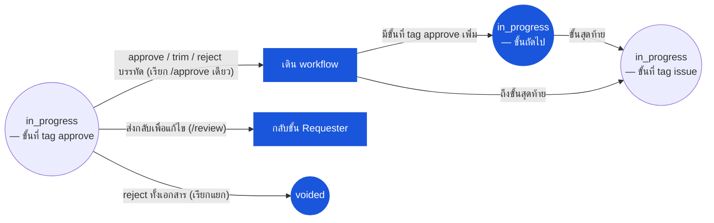

# ใบเบิกของสโตร์ (Store Requisition) — User Flow — Approver

> **At a Glance**
> **Persona:** Approver — ผู้ถือขั้น workflow ที่ tag `enum_stage_role.approve` &nbsp;·&nbsp; **โมดูล:** [store-requisition](/th/inventory/store-requisition) &nbsp;·&nbsp; **ขั้น workflow:** in_progress (ขั้นที่ tag approve) → in_progress (ขั้นถัดไป) / voided / draft (send-back) &nbsp;·&nbsp; **สิทธิ์สำคัญ:** approve, ตัด approved_qty, reject (bundle รวมในการเรียก `/approve` เดียวกัน), send-back (`/review`)
> **persona นี้ทำอะไร:** review บรรทัดของ SR ที่ submit เทียบกับความต้องการเชิงปฏิบัติการและความพร้อมที่ต้นทาง; อนุมัติ ตัด reject หรือส่งกลับผ่านการเดินขั้น workflow
> ⚠️ **แก้ไขรอบนี้.** เวอร์ชันก่อนหน้าของหน้านี้บรรยาย multi-tier escalation ที่ route ตาม value-threshold, การตัดตาม budget-cap และ par-level-cap, การ delegate การอนุมัติ และ SLA time-out escalation การตัดตาม budget-cap/par-level-cap, delegation, และ SLA time-out escalation ไม่พบ: การค้นทั้ง repo หา `delegat` และ `par_level` ในโมดูล SR และ workflow orchestrator ให้ผลลัพธ์เป็นศูนย์ (`tb_product_location.par_qty` มีอยู่จริงแต่เป็น field นโยบาย stock-replenishment ไม่ใช่ "par level" ต่อบรรทัดที่ surface ให้ approver เห็น)
>
> **ครึ่งหนึ่งของ claim ที่เป็นเรื่อง value-threshold routing กลับถูกตัดทิ้งผิดพลาดเอง** — การค้นหาติดตามผลยืนยันว่าการ route stage ตาม `total_amount` มีจริง: `routing_rules` ของ workflow ที่ assign ให้ (`tb_workflow.data.routing_rules`) สามารถ skip หรือกระโดดข้าม stage ตาม `total_amount` ได้ — สำหรับ SR คำนวณโดย `sr-workflow.mapper.ts` เป็นผลรวม `qty × current_average_cost` ต่อบรรทัด — ประเมินโดย `evaluateCondition`/`findNextStep` ใน `workflows.navagation.service.ts` ทุกครั้งที่ submit/approve เป็นกลไกทั่วไปแบบเดียวกับที่ documented ไว้สำหรับ PR และ PO (แท็บ **Routing** ของ `/system-admin/workflow`) ไม่ใช่ฟีเจอร์ "multi-tier escalation" เฉพาะของ SR ดู `SR_XMOD_008` ใน [02-business-rules.md](./02-business-rules.md)

## 1. บทบาทในโมดูลนี้

Persona **Approver** คือผู้ถือขั้น workflow ที่ tag `enum_stage_role.approve` (โดยทั่วไปมีตำแหน่ง Department Head) ที่เป็นเจ้าของการ review SR ที่ submit แล้วก่อนปล่อยเข้าสู่การ issue Approver คือ control gate ระหว่างความต้องการของเอาท์เลต (`requested_qty`) กับสิทธิ์การปล่อยของสโตร์ (`approved_qty ≤ requested_qty`) ตอน entry SR อยู่ที่ `doc_status = in_progress` พร้อม `workflow_current_stage` ชี้ขั้นที่ Approver อยู่ใน `user_action.execute` Approver review แต่ละบรรทัดเทียบกับความจำเป็นเชิงปฏิบัติการและความพร้อมต้นทางปัจจุบัน; อนุมัติเต็ม ตัด `approved_qty` ลง reject (bundle รวมกับบรรทัดอื่นที่อนุมัติในการเรียก `/approve` เดียวกัน) หรือส่งเอกสารทั้งฉบับกลับให้แก้ไขผ่านการเรียก `/review` แยก ลายเซ็น approval / review / rejection ต่อบรรทัด (`approved_by_id`, `review_by_id`, `reject_by_id` บวกคอลัมน์ name / date / message) ถูก persist โดยตรงบน `tb_store_requisition_detail` สำหรับ audit; JSON `history` ต่อบรรทัด append entry `{ seq, name, status, message, by, at }` สำหรับทุก action Approver ไม่เคยเดิน `doc_status` โดยตรงยกเว้นที่ขั้นสุดท้าย (ซึ่งการเรียก `/approve` เดียวกันนั้นทำให้เอกสาร complete) — สถานะส่วนหัวยังคงเป็น `in_progress` ตลอดขั้นก่อนหน้า **ยังไม่ยืนยัน:** requester ถูก block จากการอนุมัติ SR ของตนเองหรือไม่ — ไม่พบการ cross-check `requestor_id` ใน `store-requisition.service.ts` **ยังไม่ยืนยัน:** การ delegate การอนุมัติ — ไม่พบคำว่า `delegat` เลยไม่ว่าใน workflow orchestrator หรือโมดูลนี้

### ตำแหน่งใน workflow (Approver เน้นสี)

```mermaid
graph LR
    submitted(("in_progress\n— ขั้นที่ tag approve")) -->|"approve / trim / reject บรรทัด (เรียก /approve เดียว)"| advance["เดิน workflow"]:::current
    advance -->|"มีขั้นที่ tag approve เพิ่ม"| nextstage(("in_progress\n— ขั้นถัดไป")):::current
    nextstage -->|"ขั้นสุดท้าย"| fulfil(("in_progress\n— ขั้นที่ tag issue"))
    advance -->|"ถึงขั้นสุดท้าย"| fulfil
    submitted -->|"ส่งกลับเพื่อแก้ไข (/review)"| sendback["กลับขั้น Requester"]:::current
    submitted -->|"reject ทั้งเอกสาร (เรียกแยก)"| voided(("voided")):::current
    classDef current fill:#1a56db,color:#fff,stroke:#1a56db;
```

### ตารางสิทธิ์ — V2 Action × Stage Role (Approver)

Approver กระทำที่ `doc_status = in_progress` ขณะที่ `workflow_current_stage` ชี้ขั้นที่ Approver อยู่ใน `user_action.execute` ถ้า `tb_workflow` ของ tenant นิยามขั้นที่ tag `approve` มากกว่าหนึ่งขั้น action set เดียวกันใช้ที่แต่ละขั้น — นี่เป็นคุณสมบัติทั่วไปของ workflow engine ที่ใช้ร่วมกัน ไม่ใช่สิ่งที่สร้างเฉพาะสำหรับ SR *Authorization* ในการดำเนินการที่ขั้นหนึ่งไม่ถูก gate ด้วย amount (เป็น membership ใน `user_action.execute[]` ล้วน ๆ) แต่ *ขั้นถัดไปคือขั้นไหน* อาจขับเคลื่อนด้วย amount ได้ผ่าน `routing_rules` ของ workflow (`SR_XMOD_008`)

| Action | Approver ที่ขั้น tag `approve` ใดก็ได้ |
|---|---|
| เปิด SR ที่รออนุมัติ | ✅ (`SR_AUTH_005`) |
| อนุมัติบรรทัดเต็ม (`approved_qty = requested_qty`) | ✅ (`SR_AUTH_005`) |
| ตัด `approved_qty` ลง (`0 < approved_qty < requested_qty`) | ✅ (`SR_AUTH_005`) |
| Reject บรรทัด, bundle รวมกับการตัดสินใจ approve ของบรรทัดอื่นในการเรียก `/approve` เดียวกัน | ✅ (`SR_AUTH_005`, `SR_VAL_010`) |
| ส่งเอกสารทั้งฉบับกลับให้แก้ไข (`/review`; ผสมกับ approve/reject ในการเรียกเดียวกันไม่ได้) | ✅ (`SR_AUTH_005`) |
| ผสม approve / reject ต่อบรรทัดในการเรียก `/approve` เดียวกัน | ✅ — ยืนยันใน `computeSrAction()` (`sr-form-schema.ts`) |
| อนุมัติ SR ของตน (กรณี Approver = Requester) | ยังไม่ยืนยันว่าถูก block — ไม่พบ SoD check ในโค้ด |
| เพิ่ม `approved_qty` เกิน `requested_qty` | ❌ (`SR_VAL_010`) |
| การเดินขั้นสุดท้าย (บันทึก `issued_qty`) | ใช้ endpoint `/approve` เดียวกัน — gate ด้วยว่าผู้ใช้ถือ `enum_stage_role` ใด (`approve` เทียบกับ `issue`) ไม่ใช่สิทธิ์ commit แยกต่างหาก |

## 2. จุดเข้าและ Flow หลัก

**จุดเข้า:** สองเส้นทางที่ยืนยันได้สู่ approve action

- **Approvals dashboard → Pending SR approvals** — list view กรองเป็น `(doc_status = 'in_progress', workflow_current_stage = '<approver-stage>', user_action.execute CONTAINS me)`; approver เลือก SR เพื่อเปิด
- **Notification → SR submitted for your approval** — in-app notification ถูกส่งตอน submit (`sendSubmitNotification` ใน `store-requisition.logic.ts`) และ deep-link ไปยัง SR detail

ถ้า workflow ของ tenant นิยามขั้นที่ tag `approve` มากกว่าหนึ่งขั้น เอกสารเดินจากขั้นหนึ่งไปอีกขั้นโดยใช้ action surface เดียวกับที่บรรยายไว้ที่นี่ — นี่เป็นคุณสมบัติของ workflow engine ที่ใช้ร่วมกัน ไม่ใช่ฟีเจอร์ "multi-tier" ที่สร้างแยกสำหรับ SR

**Flow หลัก (เส้นทาง happy path, 8 ขั้น):**

1. **เปิด SR** Detail view แสดงส่วนหัว (ต้นทาง / ปลายทาง, `sr_type`, วันที่, requester, description, dimension), บรรทัดพร้อม `requested_qty` และบล็อก enrichment เฉพาะ UI (on-hand ต้นทางปัจจุบัน, on-order, last price, last vendor, หมวดสินค้า — ไม่ persist บน SR) และ workflow history
2. **ตรวจสอบคำขอเทียบกับ context** สำหรับแต่ละบรรทัด: ตรงกับ recipe demand ของการผลิตที่วางในงวดหรือไม่ (`info.recipe_id` ถ้ามี)? on-hand ต้นทางเพียงพอหรือไม่ (บล็อก enrichment เฉพาะ UI ไม่ persist)? **แก้ไขรอบนี้:** ไม่พบ "par level" หรือ "budget-impact hint" ที่ยืนยันได้บนหน้าจอนี้ — ไม่พบ field `product.par_level` และการเชื่อมโมดูล budget กับ Finance ใน source ปัจจุบัน (`tb_product_location.par_qty` เป็น field นโยบาย stock-replenishment ที่ไม่เกี่ยวกับหน้าจอนี้)
3. **การตัดสินใจต่อบรรทัด** สำหรับแต่ละบรรทัด Approver เลือกหนึ่งใน:
   - **อนุมัติเต็ม**: ตั้ง `approved_qty = requested_qty` ต่อบรรทัด: `approved_by_id`, `approved_by_name`, `approved_date_at = now()`, `approved_message` ทางเลือก
   - **ตัดลง**: ตั้ง `approved_qty ∈ (0, requested_qty)` ต่อบรรทัด: คอลัมน์ลายเซ็นเดียวกัน; `approved_message` อธิบายการตัด (เช่น "trimmed to source on-hand" — เหตุผลการตัดเดียวที่ยืนยันได้; ถ้อยคำ "par-level cap" และ "budget cap" เป็นเพียงตัวอย่างประกอบ ไม่ใช่ label ที่ระบบสร้างขึ้น) `approved_qty > requested_qty` ถูก reject โดย `SR_VAL_010`
   - **Reject บรรทัด**: ตั้ง `approved_qty = 0` ต่อบรรทัด: `reject_by_id`, `reject_by_name`, `reject_date_at = now()`, `reject_message` ทางเลือก (dialog reject อนุญาตเหตุผลว่างได้ — เหตุผลต่อบรรทัดไม่ได้ถูกบังคับใน frontend) Bundle รวมกับการตัดสินใจของบรรทัดอื่นในการเรียก `/approve` เดียวกัน
   - **ส่งเอกสารทั้งฉบับกลับให้แก้ไข**: การเรียก `/review` แยกต่างหาก; ถ้าบรรทัดใดถูก mark เป็น "review" การ submit ทั้งหมดกลายเป็น send-back และตัวเลือก approve/reject ของบรรทัดอื่นใน submission เดียวกันนั้นจะไม่ถูก apply (`computeSrAction()`)
4. **การตัดสินใจแบบผสมข้ามบรรทัด** Approve และ reject ผสมกันได้ในการเรียก `/approve` เดียวกัน; review ผสมกับอย่างใดอย่างหนึ่งใน submission เดียวกันไม่ได้ (ดูข้อ 3) หน้าจอที่อ่านในรอบนี้ไม่แสดง "ยอดสะสมของมูลค่าที่อนุมัติ/reject" — ถือว่าเป็นข้อความที่ยังไม่ยืนยัน
5. **ยืนยัน action** คลิก **Approve** (หรือ **Send Back** ตามส่วนผสม) ระบบ validate `SR_VAL_010` ต่อบรรทัด (check cap บน `approved_qty`) และ `SR_AUTH_014` (Approver อยู่ใน `user_action.execute`)
6. **เดิน workflow** เมื่อบรรทัดทั้งหมดบนขั้นปัจจุบันถูก action แล้ว ระบบเดิน `workflow_current_stage` ไปขั้นถัดไป — ขั้น `approve`/`issue` ถัดไปตาม `tb_workflow` หรือ `completed` ถ้านี่คือขั้นสุดท้าย การเรียก `/reject` ทั้งเอกสารแยกต่างหาก (เปิดใช้เฉพาะเมื่อทุกบรรทัดถูก mark reject) ตั้ง `doc_status = voided` โดยตรง — **ไม่ใช่** `cancelled` (ดู [01-data-model.md](./01-data-model.md) §5 ข้อ 11)
7. **แจ้ง persona ปลายน้ำ** ระบบส่ง notification ไปยังผู้ใช้ของขั้นถัดไป (`sendApproveNotification` ใน `store-requisition.logic.ts`); requester ก็ถูกแจ้งผลลัพธ์เช่นกัน
8. **บันทึก audit trail** `last_action` ถูกอัปเดตพร้อม `last_action_at_date` และ `last_action_by_id`; `workflow_history` ได้ entry; แต่ละบรรทัดที่แตะได้ JSON `history` append คอลัมน์ลายเซ็นต่อบรรทัดของ approver (`approved_by_*`, `review_by_*`, `reject_by_*`) คือลายเซ็น audit อย่างเป็นทางการ; ตาราง comment สำหรับ thread สนทนาเพิ่ม

## 3. Branch การตัดสินใจ

- **ตัดตามความพร้อมที่ต้นทาง**: on-hand ต้นทางน้อยกว่า requested quantity Approver ตัด `approved_qty` ให้เท่ากับสต๊อกที่มี การตัดบันทึกด้วย `approved_message` เช่น "trimmed to source on-hand" ขั้นถัดไปจะเห็นค่าที่ตัด
- **Reject เพราะขาด justification**: บรรทัดที่ผิดปกติหรือมูลค่าสูงขาดโน้ต justification Approver เลือก send-back (ไม่ใช่ reject) และเขียน `review_message`; บรรทัดถูกส่งกลับ requester เพื่อแก้
- **Reject ทั้ง SR**: ทุกบรรทัดถูก mark reject ใน submission เดียว เปิดใช้ action `/reject` ทั้งเอกสาร ระบบตั้ง `doc_status = voided` โดยตรง — **แก้ไขรอบนี้**: เวอร์ชันก่อนหน้าของหน้านี้บรรยายว่าจบที่ `cancelled`; ไม่มีการ assign `cancelled` เลยที่ใดใน `store-requisition.service.ts`
- **ส่งบรรทัดเดียวกลับ อนุมัติส่วนที่เหลือ**: **แก้ไขรอบนี้.** `computeSrAction()` แสดงว่าการ mark แม้เพียงบรรทัดเดียวเป็น "review" ทำให้ submission ทั้งหมดกลายเป็น send-back — ตัวเลือก approve/reject ของบรรทัดอื่นใน submission เดียวกันจะไม่ถูกส่งไป การจะอนุมัติบางบรรทัดและแยก flag บรรทัดหนึ่งเพื่อแก้ไข Approver ต้องทำสอง submission (อนุมัติบรรทัดอื่นก่อน แล้วตามด้วย send-back) ไม่ใช่ action ผสมเดียวตามที่เคยบรรยายไว้
- **Delegation และ SLA time-out escalation** — **ลบออกรอบนี้; ยังไม่ยืนยัน.** ไม่พบ delegation หรือ SLA-timeout logic ใน `workflow-orchestrator.service.ts` หรือโมดูลนี้ **แต่ value-threshold-based stage routing ยืนยันแล้วว่ามีจริง** (แก้ไขรอบนี้ — ดู callout ด้านบนและ `SR_XMOD_008`): `routing_rules` ของ workflow ที่ assign ให้สามารถ route ตาม `total_amount` เพื่อ skip หรือกระโดดข้ามขั้นที่ tag `approve` ได้ ถ้า `tb_workflow` ของ tenant นิยามขั้น `approve` มากกว่าหนึ่งขั้น เอกสารเดินผ่านขั้นเหล่านั้นด้วยกลไกปกติในส่วนที่ 2 และ routing rules ของ workflow ที่ assign ให้ — ไม่ใช่ฟีเจอร์ "multi-tier" เฉพาะของ SR — เป็นตัวกำหนดว่าขั้นใดถูก skip ตาม value หรือไม่

## 4. จุดออก / Handoff

การมีส่วนร่วมของ Approver บน SR ที่กำหนดจบที่ขอบเขตที่ยืนยันได้หนึ่งในสาม:

- **บรรทัดทั้งหมดถูก action, workflow เดินไปยังขั้นถัดไป** — handoff ไปยังผู้ถือขั้นถัดไป (ขั้น tag issuance หรือขั้นอนุมัติอื่นถ้า workflow ของ tenant มีมากกว่าหนึ่งขั้น) ลายเซ็นของ approver ปัจจุบันถูกรักษาไว้
- **บรรทัดใดถูกส่งกลับเพื่อแก้ไข** — handoff กลับ **Requester** SR เข้าขั้น workflow requester อีกครั้ง; requester ตอบ `review_message` และ resubmit
- **Reject ทั้งเอกสาร** — `in_progress → voided` (ไม่ใช่ `cancelled`); เอกสารจบ; requester ถูกแจ้ง

ไม่พบเส้นทางโต้แย้งหลัง commit ที่เฉพาะเจาะจงกับ Approver ที่ยืนยันได้; ดู [03-user-flow-audit-config.md](./03-user-flow-audit-config.md) สำหรับสิ่งที่ยืนยันได้และยังไม่ยืนยันเกี่ยวกับการแก้ไขหลัง commit

## 5. แหล่งอ้างอิง

- ภาพรวมแม่: [03-user-flow.md](./03-user-flow.md) — วงจรชีวิตห้าค่า canonical บน `enum_doc_status` และตาราง handoff ข้าม persona; ส่วนที่ 4 แถว "Approver → Fulfiller" และ "Approver → Requester (send-back)" anchor จุดออกของ persona นี้
- `../carmen/docs/store-requisitions/SR-User-Experience.md` § Approving a Store Requisition — แหล่ง carmen/docs สำหรับ approver (ชื่อ "James Wilson, Department Head" ในเรื่องเล่า persona); ขั้น journey map ไปยังส่วนที่ 2 ข้างบน
- `../carmen/docs/store-requisitions/SR-Overview.md` § User Roles → แถว Approver — แหล่ง carmen/docs สำหรับขอบเขตความรับผิดชอบของ persona
- `../carmen/docs/store-requisitions/Store Requisitions.md` § UC-64 (Approve Requisition Requests), § UC-65 (Deny Requisition Requests), § UC-66 (Modify Requisition Requests) — แหล่ง use-case สำหรับการตัดสินใจ approve / trim / reject ในส่วนที่ 2 ข้างบน
- Sibling: [03-user-flow-requester.md](./03-user-flow-requester.md) — persona ต้นน้ำ; input ของ Approver คือ SR ที่ Requester submit
- Sibling: [03-user-flow-fulfiller.md](./03-user-flow-fulfiller.md) — persona ขั้น issuance; `approved_qty` ของ Approver คือ cap ที่ขั้นนั้นทำงานภายใน (endpoint `/approve` ทั่วไปเดียวกัน)
- Sibling: [03-user-flow-audit-config.md](./03-user-flow-audit-config.md) — แก้ไขรอบนี้; ส่วนใหญ่ของ workspace การกำกับดูแล/config ที่เคยบรรยายไว้ (RBAC console, SoD-relaxation threshold) ไม่พบใน source ปัจจุบัน แม้ว่า config ทั่วไปสำหรับ routing-rule ตาม amount จะยืนยันแล้วว่ามีจริง (`SR_XMOD_008`)
- Sibling: [01-data-model.md](./01-data-model.md) — คอลัมน์ลายเซ็น approval / review / rejection ต่อบรรทัดบน `tb_store_requisition_detail` (`approved_by_*`, `review_by_*`, `reject_by_*`), timeline JSON `history` และ `stages_status`
- Sibling: [02-business-rules.md](./02-business-rules.md) — `SR_VAL_010` (approval invariant: `approved_qty ≤ requested_qty`), `SR_AUTH_005`–`SR_AUTH_006` (อำนาจ approve / trim / send-back, กฎการผสม), `SR_POST_005`–`SR_POST_010` (การเดินขั้นสุดท้ายและ reject ทั้งเอกสาร → `voided`)
- Related: [recipe](/th/inventory/recipe) — SR ที่ขับโดย recipe มี `info.recipe_id`; Approver เห็น context recipe เป็นส่วนหนึ่งของการตัดสินใจต่อบรรทัด
- Related: [inventory](/th/inventory/inventory) — context ความพร้อมต้นทาง surface ตอน approve (UI enrichment); การตัดสินใจ trim ของ Approver ส่งผลถึงการหยิบของ fulfiller
