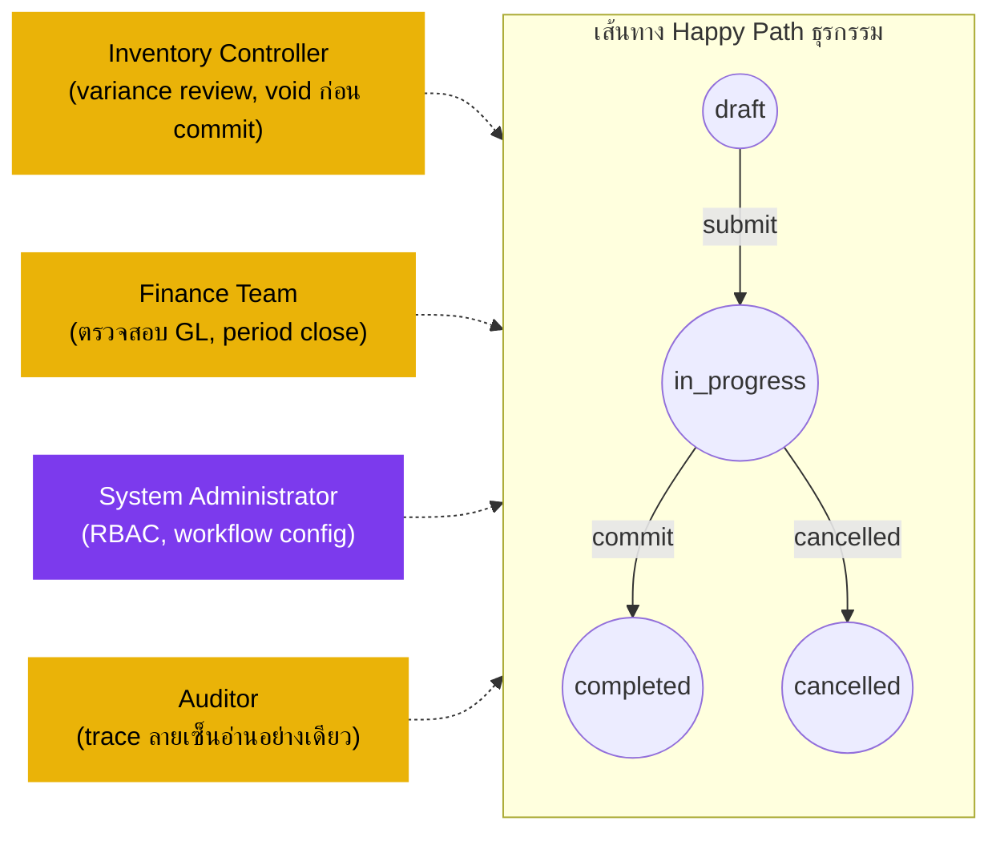

# ใบเบิกของสโตร์ (Store Requisition) — User Flow — Audit & Config

> **At a Glance**
> **Persona:** Inventory Controller + Finance + Sysadmin + Auditor &nbsp;·&nbsp; **โมดูล:** [[store-requisition]] &nbsp;·&nbsp; **ขั้น workflow:** นอกเส้นทาง — การกำกับดูแล การตรวจสอบ GL ตั้งค่า workflow / RBAC, void ก่อน commit &nbsp;·&nbsp; **สิทธิ์สำคัญ:** อ่าน audit chain, ตั้งค่า workflow / RBAC / threshold, admin-void ของ draft / in_progress, signoff period-close
> **persona นี้ทำอะไร:** ตั้งค่าและกำกับดูแลวงจรชีวิต SR — variance monitoring, การ reconcile GL, period close, RBAC และ void เชิงบริหารก่อน commit

## 1. บทบาทในโมดูลนี้

Persona **Audit / Config** ครอบคลุม 4 บทบาทเชิงปฏิบัติการที่ซ้อนกันซึ่งร่วมกันกำกับความถูกต้อง ความสมบูรณ์ และการตั้งค่าของโมดูล SR: **Inventory Controller** (กำกับ flow SR end-to-end ติดตาม variance และรูปแบบ partial-fulfilment, reconcile inventory sub-ledger กับการ post GL บริหาร threshold การอนุมัติ signoff กิจกรรมปลายงวด และเป็นผู้มีอำนาจ administrative-void สำหรับ SR `draft` / `in_progress`), **Finance Team** (ตรวจสอบการ map cost-centre และ journal entries บน SR `completed` reconcile รายงาน food-cost ของเอาท์เลตกับการ post SR มั่นใจว่า cost allocation ระหว่างแผนกถูกต้องตอน period close และ block การ commit ในงวดปิดผ่าน `SR_VAL_014`), **System Administrator** (เป็นเจ้าของ RBAC สำหรับสิทธิ์ create / approve / fulfil, การตั้งค่าขั้น workflow ใน `tb_workflow`, threshold มูลค่าอนุมัติ การผ่อนคลาย segregation-of-duties สำหรับ SR มูลค่าต่ำ และการเชื่อม auto-create จาก `[[recipe]]`) และ **Auditor** (review SR history อ่านอย่างเดียว — ลายเซ็นต่อบรรทัด timeline JSON `history` thread comment inventory transactions ที่ลิงก์ journal entries — เพื่อยืนยันว่าการควบคุมทำงาน variance กำลังถูกสอบสวน และ SoD ถูกบังคับใช้) บทบาทเหล่านี้ไม่กระทำบน happy path ของ SR; กระทำที่ **periphery** — ก่อน SR ใด ๆ มีอยู่ (config) ระหว่าง flow (variance monitoring) และหลัง commit (signoff, period close, audit trace) สองในนั้น — Inventory Controller และ System Administrator — ถือสิทธิ์ administrative-void (`SR_AUTH_013`) สำหรับ SR ก่อน commit; ไม่มีตัวใดสามารถ void SR `completed` ได้ (การแก้ไขหลัง commit ไหลผ่าน `[[inventory-adjustment]]`)

### ตำแหน่งเทียบกับ flow ธุรกรรม (ผู้สังเกตการณ์นอกเส้นทาง)

### ตารางสิทธิ์ — V6 Action × Sub-persona (Audit / Config)

บทบาทเหล่านี้กระทำที่ periphery ของวงจรชีวิต SR — ก่อน SR ใด ๆ มีอยู่ (Sysadmin config), ระหว่าง flow (Inventory Controller variance monitoring) และหลัง commit (Finance signoff, Auditor trace) ไม่มีตัวใดเดิน lifecycle happy-path; สองตัวถือสิทธิ์ administrative-void สำหรับ SR ก่อน commit

| Action | Inventory Controller | Finance Team | System Administrator | Auditor |
|---|---|---|---|---|
| ดู SR ที่สถานะใด ๆ | ✅ (`SR_AUTH_009`) | ✅ (`SR_AUTH_010`) | ✅ | ✅ (อ่านอย่างเดียว) |
| ดู signature chain ต่อบรรทัดและ JSON `history` | ✅ | ✅ | ✅ | ✅ |
| ตรวจสอบ variance dashboard (`requested − issued`) | ✅ (`SR_AUTH_009`) | ✅ | — | ❌ |
| Void เชิงบริหารก่อน commit (`draft` / `in_progress → voided`) | ✅ (`SR_AUTH_013`) | ❌ | ✅ (`SR_AUTH_013`) | ❌ |
| Void SR `completed` | ❌ (`SR_POST_010` — ไม่อนุญาต; ใช้ inventory-adjustment) | ❌ | ❌ | ❌ |
| สอบสวนและ resolve ความคลาดเคลื่อนของ Receiver | ✅ | ✅ (ฝั่ง GL) | — | ❌ |
| ร่วมเขียน inventory adjustment สำหรับการแก้หลัง commit | ✅ (`SR_XMOD_009`) | ✅ (ยืนยัน GL บาลานซ์) | — | ❌ |
| Block การ commit ในงวดปิด (`SR_VAL_014`) | — | ✅ (`SR_AUTH_010`) | — | ❌ |
| ตั้งค่าขั้น workflow (`tb_workflow`) | — | — | ✅ (`SR_AUTH_014`) | ❌ |
| บริหาร RBAC (assign / revoke role ต่อ location) | — | — | ✅ | ❌ |
| ตั้งค่า threshold การผ่อนคลาย SoD | — | — | ✅ | ❌ |
| เชื่อม recipe auto-create (`[[recipe]]` → SR draft) | — | — | ✅ | ❌ |
| แก้ส่วนหัว / บรรทัดของ SR | ❌ | ❌ | ❌ | ❌ |
| อนุมัติบรรทัด | ❌ | ❌ | ❌ | ❌ |
| Commit / issue สินค้า | ❌ | ❌ | ❌ | ❌ |

> ℹ️ **ขอบเขตของ Void:** Administrative void (`SR_AUTH_013`) เป็นก่อน commit เท่านั้น SR `completed` ไม่สามารถถูก void โดย sub-role ใดที่นี่ — การแก้ไขไหลผ่าน `[[inventory-adjustment]]` พร้อม id ของ SR เป็น back-reference (`SR_XMOD_009`)

## 2. จุดเข้าและ Flow หลัก

**จุดเข้า (หนึ่งต่อ sub-role):**

- **Inventory Controller — Variance dashboard** — list view ข้าม SR `completed` ทั้งหมดในงวดพร้อม `requested_qty − issued_qty` ที่คำนวณ (ส่วนที่ 3.2 ของ [02-business-rules.md](./02-business-rules.md)) กรองได้ตามเอาท์เลต สถานที่ต้นทาง requester approver และช่วงวันที่ และ: queue SR ก่อน commit (SR `draft` / `in_progress` ที่ดูเก่าค้างหรือผิดปกติ)
- **Finance — GL reconciliation queue** — list view ข้าม SR `completed` ในงวดปัจจุบัน surface inventory transactions ที่ลิงก์ของแต่ละ SR และ journal entries ที่สร้าง; กรองได้ตาม cost-centre เอาท์เลต และช่วงวันที่ และ: period-close dashboard
- **Sysadmin — Workflow / RBAC console** — หน้าจอ config `tb_workflow`, ตัวแก้ขั้นอนุมัติ, RBAC matrix ต่อ location / department, threshold การผ่อนคลาย SoD, การเชื่อม auto-create (recipe → SR)
- **Auditor — Audit trail อ่านอย่างเดียว** — SR detail ในโหมดอ่านอย่างเดียว; thread comment, `workflow_history`, JSON `history` ต่อบรรทัด, inventory transactions, journal entries; signature trace ตามผู้ใช้ / วันที่ / action

**Flow หลัก (การกำกับดูแล / ตั้งค่า 10 ขั้น — ทำต่อเนื่องข้ามงวด ไม่ใช่ต่อ SR):**

1. **(Sysadmin) ตั้งค่า workflow ตอน onboarding tenant** นิยามขั้นอนุมัติใน `tb_workflow` (เช่น Stage 1 = Department Head, Stage 2 = Operations Manager เกิน threshold มูลค่า); ตั้ง default `user_action.execute` ต่อขั้น; ตั้งค่า threshold การผ่อนคลาย SoD (เช่น "Approver = Fulfiller อนุญาตสำหรับ SR < ฿5,000"); เชื่อมแหล่ง auto-create จาก `[[recipe]]` ตั้งวิธี costing ต่อ location (FIFO vs moving-average ของต้นทาง — เป็นเจ้าของโดย `[[costing]]` แต่อ้างถึงที่นี่)
2. **(Sysadmin) บริหาร RBAC** กำหนดผู้ใช้ให้ role (Requester / Approver / Fulfiller / Receiver) ต่อ location และ department; บริหาร delegation chain (Department Head ลาพัก → รอง); ถอนสิทธิ์เมื่อผู้ใช้เปลี่ยน role หรือลาออก
3. **(Inventory Controller) ติดตาม SR ระหว่าง flow** เฝ้าดู queue `in_progress` สำหรับ: SR ค้าง (ไม่มี action เกิน SLA ของ tenant), รูปแบบผิดปกติ (การขอเกินเรื้อรังจากเอาท์เลตเฉพาะ การ reject เรื้อรังจาก approver เฉพาะ), การไหลแบบ cascade ของความพร้อมต้นทาง (SR ของเอาท์เลตหนึ่ง block อีกตัว) แทรกแซงโดย escalate ไปยังขั้นถัดไปของ workflow ด้วยมือ หรือ void เชิงบริหารของ SR ที่ค้าง (`SR_POST_010`)
4. **(Inventory Controller) สอบสวน variance** บน variance dashboard เจาะลึกไปยัง SR ที่มี gap `requested_qty − issued_qty` ใหญ่ trace สาเหตุ: การตัดของ approver (มอง `approved_message` ต่อบรรทัด), stock-out ตอน issue (มอง system comment ต่อบรรทัดจาก fulfiller), ความคลาดเคลื่อนของ receiver (มอง comment ความคลาดเคลื่อนของ receiver) ตัดสินใจว่า variance เป็นผลที่ควบคุม (การขอเกินเรื้อรังที่เอาท์เลตต้องแก้ไข) หรือ gap ระบบ (stock-out ต้นทางที่ต้องการการสนใจ supply-chain)
5. **(Inventory Controller) Void เชิงบริหารก่อน commit** สำหรับ SR ที่ไม่ควรถูกตั้ง (audit hold บน requester, ซ้ำซ้อนผิดของ SR อื่น, การยกเลิกฝั่งผู้ขาย) void เชิงบริหารตาม `SR_AUTH_013`: `draft → voided` หรือ `in_progress → voided` พร้อมเหตุผลบังคับ ไม่กระทบ inventory หรือ GL จุดสิ้นสุด
6. **(Finance) ตรวจสอบ journal entries บน SR ที่ commit แล้ว** SR `completed` ทุกตัวมี inventory transactions ที่ลิงก์และ journal entries ที่สร้างผ่านชั้น finance posting Finance ตรวจสอบ: บัญชีฝั่ง debit (cost-centre expense ปลายทางสำหรับ `sr_type = issue`, inventory ปลายทางสำหรับ `sr_type = transfer`), บัญชีฝั่ง credit (inventory ต้นทาง), จำนวน (ต้นทาง `cost_per_unit × issued_qty`) และ `Σ Dr = Σ Cr` ต่อ `SR_POST_007` ความไม่ตรงถูก escalate ไปยัง inventory controller และโมดูล costing ต้นทาง
7. **(Finance) Block การ commit ในงวดปิด** เมื่องวดปิด `SR_VAL_014` block การ commit ใหม่ที่มีวันที่ post ในงวดปิดอัตโนมัติ; Finance จัดการกรณีปฏิบัติการที่ fulfiller ต้อง issue วันนี้กับวันที่ในงวดปิด (escalation: เปิดงวดใหม่ หรือเลื่อนวันที่ post ไปข้างหน้า)
8. **(Finance) Reconcile ปลายงวด** ที่ period close Finance reconcile รายงาน food-cost ของเอาท์เลตกับยอดรวม SR `completed` ในงวด (ต่อเอาท์เลต ต่อ cost-centre) gap ที่ reconcile ไม่ได้ถูกสอบสวน: gap อาจเป็น adjustment ที่ missed, dimension ที่ map ผิด, ปัญหา FX (ถ้า tenant หลายสกุลเงิน) หรือปัญหา timing (SR commit ในงวดหนึ่งโดยสินค้ามาถึงจริงในงวดถัดไป)
9. **(Auditor) Review อิสระ** สุ่ม SR ที่ commit ข้ามงวด; ยืนยัน signature chain ต่อบรรทัด (Requester ผ่าน `created_by_id`, Approver ผ่าน `approved_by_id` ต่อบรรทัด, Fulfiller ผ่าน `last_action_by_id` ที่ transition commit) แสดงว่า SoD ถูกบังคับใช้ (`Requester ≠ Approver` ตาม `SR_AUTH_011`, `Approver ≠ Fulfiller` ตาม `SR_AUTH_012`); ยืนยัน timeline JSON `history` ต่อบรรทัดตรงกับ `workflow_history` และ thread comment; ยืนยันว่า variance ถูกสอบสวนในที่ที่เป็นสาระสำคัญ
10. **(ทุก sub-role) ประสานการ reverse หลัง commit** เมื่อ SR `completed` ถูกพบว่าผิด (หลัง commit) การแก้ไขไหลผ่าน `[[inventory-adjustment]]` ไม่ใช่ผ่านการแก้หรือ void SR Adjustment ถูกเขียนร่วม: Inventory Controller ยก adjustment พร้อม corrective movement, Finance ยืนยันว่า reversing journal entries บาลานซ์, Sysadmin อาจต้องเปิดให้ adjustment post ได้ถ้า threshold ควบคุม block SR เดิมยังคงเป็น `completed`; เอกสาร adjustment มี back-reference ไปยัง id ของ SR

## 3. Branch การตัดสินใจ

- **Variance ยอมรับได้ (อยู่ใน tolerance)** — `requested_qty − issued_qty` อยู่ใน band ประวัติของเอาท์เลต Inventory Controller ปิด variance review โดยไม่มี action; log สำหรับการวิเคราะห์แนวโน้ม
- **Variance เป็นสาระสำคัญ (การขอเกินเรื้อรัง)** — เอาท์เลตขอเกินที่ approver อนุญาตสม่ำเสมอ Inventory Controller ยก coaching action กับ outlet manager; อาจรัด workflow ขั้นอนุมัติ (เพิ่ม pre-approval review) หรือรัดวินัย par-level
- **Variance เป็นสาระสำคัญ (stock-out ตอน issue เรื้อรัง)** — ต้นทาง fulfill ปริมาณที่อนุมัติไม่ได้สม่ำเสมอ Inventory Controller ยก action supply-planning กับคลังต้นทาง; อาจ flag การปรับ re-order point ผ่านโมดูล inventory หรือ escalate ไปยัง procurement เพื่อตั้งใบสั่งซื้อบ่อยขึ้น
- **ความคลาดเคลื่อนที่ปลายทาง flag โดย Receiver** (`SR_POST_013`) — Receiver post comment ว่าการรับจริงต่างจาก `issued_qty` Inventory Controller สอบสวนการนับฝั่งต้นทาง vs ปลายทาง ตัดสินใจ corrective adjustment และ post ผ่าน `[[inventory-adjustment]]` พร้อม back-reference id ของ SR
- **ข้อยกเว้น period-close — SR in_progress ที่ไม่ได้ commit** ที่ period close SR ค้างที่ `in_progress` เกิน SLA Inventory Controller ตัดสินใจ: (a) ผลัก fulfiller ให้ commit ถ้าสินค้าถูก issue จริงแต่ action ระบบ missed; (b) void เชิงบริหาร (`SR_POST_010`) ถ้า SR ตกรุ่น; (c) ปล่อยไว้และ re-evaluate งวดถัดไปถ้าปลายทางยังต้องการสินค้า
- **การพยายาม commit ในงวดปิด** — Fulfiller พยายาม commit SR ที่มีวันที่ post ในงวดปิด; `SR_VAL_014` block Finance ตัดสินใจ: (a) เปิดงวดใหม่สั้น ๆ (พบยาก ต้องการลายเซ็น CFO); (b) ขอ Fulfiller เลื่อนวันที่ post ไปงวดปัจจุบัน; (c) void SR และตั้งใหม่กับวันที่งวดปัจจุบันถ้าธุรกรรมพื้นฐานไม่ถูกต้องแล้ว
- **การละเมิด SoD พบที่ audit** — Auditor พบ SR ที่ผู้ใช้คนเดียวกันปรากฏเป็นทั้ง Requester และ Approver (หรือ Approver และ Fulfiller) บน SR เดียวกัน การละเมิดบ่งชี้ทั้งการตั้งค่า workflow ผิด (Sysadmin ต้องสอบสวน) หรือ threshold การผ่อนคลาย SoD ถูกใช้ประโยชน์ (Inventory Controller + Finance ต้อง review ว่า threshold เหมาะสม) ระบุใน audit findings; corrective action ครอบคลุมตั้งแต่การเสริมนโยบายถึงการรัด system-config
- **SR ที่ขับโดย recipe ไม่สามารถ auto-create ได้** — โมดูล `[[recipe]]` ล้มเหลวในการสร้าง draft SR สำหรับ event ผลิตที่วางไว้ Sysadmin สอบสวนการเชื่อม (การ map recipe-product, การ resolve location ต้นทาง, ผู้ใช้ default requester, การ check สิทธิ์ location); แก้ ad-hoc post SR draft ด้วยมือพร้อม `info.recipe_id` ที่ carry over
- **Review threshold การอนุมัติ** — Inventory Controller และ Sysadmin ร่วม review threshold มูลค่าขั้นอนุมัติและ threshold การผ่อนคลาย SoD อย่างน้อยปีละครั้ง การรัดเพิ่มความเสียดทานในการควบคุม; การคลายเพิ่มความเร็ว flow แต่เพิ่มความเสี่ยง SoD

## 4. จุดออก / Handoff

การมีส่วนร่วมของ persona Audit / Config ไม่ "จบ" ต่อ SR — เป็นการกำกับดูแลต่อเนื่อง อย่างไรก็ตาม action การกำกับดูแลแต่ละครั้งมี handoff ที่ระบุชัด:

- **Void ก่อน commit (`SR_AUTH_013` → `SR_POST_010`)** — Inventory Controller / Sysadmin ย้าย SR `draft` หรือ `in_progress` เป็น `voided`; เอกสารจบ; requester เดิมถูกแจ้งและอาจตั้ง SR แทน
- **Action item จาก variance review** — Inventory Controller ยก coaching / planning action กับ outlet manager ที่กระทบหรือคลังต้นทาง; ติดตามนอกโมดูล SR (operational dashboards, supply-planning reviews)
- **Adjustment หลัง commit ร่วมเขียน** — Inventory Controller + Finance ร่วมเขียน inventory-adjustment เพื่อแก้ความคลาดเคลื่อนหรือ SR ที่ post ผิด; adjustment อยู่ใน `[[inventory-adjustment]]` พร้อม back-reference ไปยัง SR; SR เองยังคงเป็น `completed`
- **Signoff period-close** — Finance ออก signoff period-close ยืนยันว่า SR `completed` ทั้งหมดในงวดมี journal entries ที่ถูกต้องและ reconcile กับรายงาน food-cost ของเอาท์เลต; Auditor review signoff กับ SR sample ไม่มีการเปลี่ยนสถานะ SR; งวดถูกล็อก block การ commit ต่อด้วยวันที่ post ในงวดนั้น (`SR_VAL_014`)
- **การเปลี่ยน config Workflow / RBAC ที่ apply** — Sysadmin commit การเปลี่ยน `tb_workflow` หรือ RBAC; กฎใหม่ apply prospective กับ SR ถัดไป; SR ที่อยู่ใน flow อาจต้อง re-route (Sysadmin ประสานกับ Inventory Controller บนการ re-route)
- **เผยแพร่ Audit findings** — Auditor ออก findings บนตัวอย่างงวด; corrective action ถูกติดตามโดย Inventory Controller / Sysadmin / Finance; ไม่มีการเปลี่ยนสถานะ SR จากตัว audit เอง

Persona Audit / Config คือ **safety net** ของโมดูล SR — ไม่เดินวงจรชีวิต happy-path แต่แทรกแซงเมื่อวงจรชีวิตผิดพลาด ตั้งค่ารางที่ persona อื่นวิ่ง และยืนยันว่ารางถูกตามตอน audit

## 5. แหล่งอ้างอิง

- ภาพรวมแม่: [03-user-flow.md](./03-user-flow.md) — วงจรชีวิต canonical และตาราง handoff ข้าม persona; ส่วนที่ 4 แถว "Receiver → Inventory Controller (ความคลาดเคลื่อน)", "Inventory Controller → Audit / Config (variance review)", "Inventory Controller / Sysadmin → จุดสิ้นสุด `voided` (admin void)" anchor จุดออกของ persona นี้
- `../carmen/docs/store-requisitions/SR-Overview.md` § User Roles → แถว Manager (ซึ่งยุบ Inventory Controller / Finance Manager / Sysadmin เป็น "Manager" role เดียวพร้อม "View all SRs; access reports; manage settings"); หน้านี้ disaggregate role นั้น
- `../carmen/docs/store-requisitions/SR-User-Experience.md` § Persona 4 (Finance Manager — Sarah Johnson) — แหล่ง carmen/docs สำหรับ sub-role finance ในเรื่อง cost-centre / journal-entry
- `../carmen/docs/store-requisitions/Store Requisitions.md` § UC-67 (Monitor Requisition Processing) — แหล่ง use-case สำหรับ view monitoring ของ Inventory Controller
- Sibling: [03-user-flow-requester.md](./03-user-flow-requester.md) — RBAC config ของ Sysadmin bound ว่าใครสามารถเป็น requester ที่เอาท์เลตใด
- Sibling: [03-user-flow-approver.md](./03-user-flow-approver.md) — Workflow config ของ Sysadmin นิยามขั้นอนุมัติและ threshold มูลค่าที่ approver กระทำภายใน; Auditor ยืนยัน SoD เทียบกับลายเซ็นของ approver
- Sibling: [03-user-flow-fulfiller.md](./03-user-flow-fulfiller.md) — Block งวดปิดของ Finance (`SR_VAL_014`) gate การ commit ของ fulfiller; Auditor ยืนยัน SoD ระหว่าง Approver กับ Fulfiller (`SR_AUTH_012`)
- Sibling: [03-user-flow-receiver.md](./03-user-flow-receiver.md) — flag ความคลาดเคลื่อนของ Receiver route ไปยัง Inventory Controller สำหรับ resolution ผ่าน `[[inventory-adjustment]]`
- Sibling: [01-data-model.md](./01-data-model.md) — `tb_store_requisition.workflow_id` (Sysadmin config), คอลัมน์ลายเซ็นต่อบรรทัด (Auditor trace), JSON `dimension` สำหรับการจัดสรร cost-centre (Finance), `enum_doc_status.voided` (เส้นทาง admin Inventory Controller / Sysadmin)
- Sibling: [02-business-rules.md](./02-business-rules.md) — `SR_VAL_014` (block งวดปิด — Finance เป็นเจ้าของ), `SR_AUTH_009`–`SR_AUTH_010` (อำนาจ Inventory Controller และ Finance), `SR_AUTH_011`–`SR_AUTH_012` (กฎ SoD — Auditor ยืนยัน), `SR_AUTH_013` (admin void), `SR_AUTH_014` (authorization derive จาก workflow — Sysadmin เป็นเจ้าของ), `SR_POST_010` (ผลกระทบ posting ของ void), `SR_POST_013` (flag ความคลาดเคลื่อนของ Receiver → Inventory Controller)
- Related: [[inventory-adjustment]] — เส้นทางการแก้ไขหลัง commit; persona Audit / Config คือผู้เขียนหลักของ adjustment ที่ reconcile variance ของ SR
- Related: [[costing]] — period-end reconciliation ขึ้นกับ valuation ของ costing ที่ถูกต้อง; Finance และโมดูล costing ประสานกันที่ period close
- Related: [[recipe]] — Sysadmin เป็นเจ้าของการเชื่อม auto-create; เส้นทางความล้มเหลว surface ใน persona audit-config
- Related: [[good-receive-note]] — เมื่อ SR-OUT จับคู่กับ GRN-IN ในการโอนระหว่างคลัง persona Audit / Config reconcile เอกสารสองใบที่ period close
