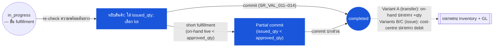

# ใบเบิกของสโตร์ (Store Requisition) — User Flow — Fulfiller

> **At a Glance**
> **Persona:** Store Keeper / Warehouse Supervisor ที่ต้นทาง &nbsp;·&nbsp; **โมดูล:** [store-requisition](/th/inventory/store-requisition) &nbsp;·&nbsp; **ขั้น workflow:** in_progress (ขั้น fulfillment) → completed (commit fire การ post) &nbsp;·&nbsp; **สิทธิ์สำคัญ:** หยิบ + บันทึก issued_qty, เลือก lot, commit (เต็มหรือบางส่วน), SoD blocked จากการอนุมัติ SR เดียวกัน
> **persona นี้ทำอะไร:** หยิบสินค้าที่ต้นทาง ตั้ง issued_qty และ lot และ commit SR — posting event ครั้งเดียวที่ลดสต๊อกและ post GL

## 1. บทบาทในโมดูลนี้

Persona **Fulfiller** คือ **Store Keeper / Warehouse Supervisor** ที่สถานที่ต้นทางที่เป็นเจ้าของขั้นการ post ที่ irrevocable — รับ SR ที่อนุมัติที่คลังต้นทาง หยิบสินค้าจากชั้น บันทึก `issued_qty` ต่อบรรทัด (ซึ่งอาจน้อยกว่า `approved_qty` ถ้าสต๊อกลดลงระหว่างอนุมัติกับ issue) เลือก lot เฉพาะสำหรับสินค้าควบคุม lot และ **commit** SR (`in_progress → completed`) Commit คือ posting event ครั้งเดียวสำหรับ SR: fire การลด on-hand ต้นทาง, การ consume cost-layer (ตาม `[costing](/th/inventory/costing)` FIFO หรือ moving-average ของสถานที่ต้นทาง), การเพิ่ม on-hand ปลายทาง (สำหรับ `sr_type = transfer`) หรือ debit cost-centre ปลายทาง (สำหรับ `sr_type = issue`) และการเขียน journal-entry ตอน entry SR อยู่ที่ `doc_status = in_progress` พร้อม `workflow_current_stage` ชี้ขั้น fulfillment และ Fulfiller อยู่ใน `user_action.execute`; แต่ละบรรทัดมี `approved_qty > 0` (มิเช่นนั้น SR จะย้ายไป `cancelled` ที่ approval) และลายเซ็นต่อบรรทัดของ Approver ถูกรักษาบน `tb_store_requisition_detail.approved_by_*` สถานะที่ persona นี้เป็นเจ้าของคือช่วง fulfillment ของ `in_progress` (ซึ่ง `issued_qty` ถูกตั้งและ lot ถูกเลือกโดยไม่ commit) และตัว transition `in_progress → completed` Segregation of duties ห้าม Approver เป็น Fulfiller บน SR เดียวกัน (`SR_AUTH_012`) — โมดูล SR บังคับใช้ตอน commit; tenant config อาจผ่อนคลายสำหรับ SR มูลค่าต่ำกว่า threshold การแก้ไขหลัง commit อยู่นอก scope ของเส้นทาง Fulfiller ปกติ; ผ่าน `[inventory-adjustment](/th/inventory/inventory-adjustment)`

### ตำแหน่งใน workflow (Fulfiller เน้นสี)

### ตารางสิทธิ์ — V1 Status × Action (Fulfiller)

Fulfiller กระทำที่ `doc_status = in_progress` ขณะ `workflow_current_stage` เป็นขั้น fulfillment และ Fulfiller อยู่ใน `user_action.execute` Fulfiller ไม่อาจเกิน `approved_qty` ของ Approver ต่อบรรทัด Segregation of Duties (`SR_AUTH_012`) ห้าม Approver ของบรรทัดเป็นผู้ใช้คนเดียวกับที่ commit SR; tenant config อาจผ่อนคลายสำหรับ SR มูลค่าต่ำ

| Action | `in_progress` (ขั้น fulfillment) | `completed` |
|---|---|---|
| ดู SR และปริมาณที่อนุมัติ | ✅ (`SR_AUTH_007`) | ✅ |
| Re-check ความพร้อมต้นทาง live | ✅ (`SR_VAL_013` pre-check) | — |
| ป้อน `issued_qty` ต่อบรรทัด (`≤ approved_qty`) | ✅ (`SR_AUTH_007`, `SR_VAL_008`) | ❌ |
| เลือก lot สำหรับสินค้าควบคุม lot | ✅ (`SR_VAL_012`) | ❌ |
| ป้อน comment / attachment ต่อบรรทัด | ✅ | ❌ |
| Commit SR (`in_progress → completed`) | ✅ (`SR_AUTH_007`, `SR_VAL_011`–`SR_VAL_014`) | ❌ |
| Short fulfillment (issue บางส่วน; `issued_qty < approved_qty`) | ✅ (`SR_POST_012`) | — |
| Commit เมื่อ Fulfiller = Approver บรรทัด | ❌ (SOD: `SR_AUTH_012`) | — |
| แก้ส่วนหัว / ปริมาณบรรทัดเกิน `approved_qty` | ❌ | ❌ |
| Void SR | ❌ | ❌ |

> ℹ️ **พฤติกรรม commit 3-variant:** สำหรับ `sr_type = transfer` (Variant A — INV → INV) ขั้น fulfillment และ completion ถูกยุบอัตโนมัติ (Issue = Complete); ไม่ต้องการ action completion แยก สำหรับ `sr_type = issue` (Variants B และ C — INV → DIR และ INV → CONS) Fulfiller ระบุ commit หลังบันทึก `issued_qty` อย่างชัดแจ้ง

## 2. จุดเข้าและ Flow หลัก

**จุดเข้า:** สองเส้นทางสู่ action fulfillment

- **Fulfillment dashboard → SR ที่อนุมัติแล้วรอหยิบ** — list view กรองเป็น `(doc_status = 'in_progress', workflow_current_stage = '<fulfilment-stage>', user_action.execute CONTAINS me, from_location_id IN my_locations)`; Fulfiller เลือก SR เพื่อเริ่ม
- **Notification → SR พร้อม fulfillment** — in-app notification ตอน approval เสร็จ deep-link ไปยัง SR detail; surface action fulfillment เดียวกัน

**Flow หลัก (เส้นทาง happy path, 10 ขั้น):**

1. **เปิด SR ที่ต้นทาง** Detail view แสดงเอาท์เลตปลายทาง, `sr_type`, expected date, requester, ลายเซ็นของ approver บนแต่ละบรรทัด (`approved_by_name`, `approved_date_at`, `approved_message`) และบรรทัดพร้อม `approved_qty` (ในหน่วย UoM ของสินค้า) Fulfiller ตรวจสอบปลายทาง, ความเร่งด่วน (`expected_date`) และโน้ตของ approver
2. **Re-check ความพร้อมต้นทางตอน issue** หน้าจอแสดง `tb_inventory_status[from_location_id, product_id].quantity_on_hand` live ต่อบรรทัด — นี่คือ check `SR_VAL_013` ที่ run ตอน commit ถ้า on-hand live ของบรรทัดใดลดต่ำกว่า `approved_qty` ตั้งแต่อนุมัติ Fulfiller ต้อง short-fulfill (decision branch ด้านล่าง)
3. **หยิบสินค้าจริง** เดินไปที่ชั้นพร้อม pick list ที่พิมพ์ / มือถือ; นับปริมาณที่จะปล่อย สำหรับสินค้าควบคุม lot ระบุ lot เฉพาะโดยใช้นโยบายการหมุนเวียนของสถานที่ (FIFO ตาม expiry สำหรับสินค้าเน่าเสีย, FIFO ตามการรับสำหรับสินค้าไม่เน่าเสีย)
4. **ป้อน `issued_qty` ต่อบรรทัด** สิ่งที่หยิบจริงในหน่วย UoM ของสินค้า หน้าจอบังคับ `0 ≤ issued_qty ≤ approved_qty` ตาม `SR_VAL_008`; ค่าที่เกิน `approved_qty` ถูก reject
5. **เลือก lot สำหรับสินค้าควบคุม lot** เปิด sub-form เลือก lot บนบรรทัด; หน้าจอแสดง lot ที่ active ที่ต้นทางพร้อม `lot_no`, `expiry_date` และปริมาณที่เหลือ เลือก lot หนึ่งใบหรือมากกว่ารวมเป็น `issued_qty` การเลือก lot เขียนลง `tb_inventory_transaction_detail` ที่ลิงก์ (ไม่ใช่บนบรรทัด SR โดยตรง — ข้อมูล lot อยู่บน inventory transaction; `SR_VAL_012` check ที่ commit)
6. **บันทึก context เพิ่ม** Comment แบบอิสระต่อบรรทัด (ปัญหาสภาพ โน้ตการ packaging เหตุผลการ partial fulfillment); attachment (รูปสินค้าที่หยิบ ใบชั่งน้ำหนัก); เขียนไป `tb_store_requisition_detail_comment`
7. **เตรียมสินค้าเพื่อปล่อย** ย้ายสินค้าที่หยิบไปยังพื้นที่ dispatch; ใน transfer flow ที่ใช้ GRN คู่ที่ปลายทาง (รูปแบบคู่ของ `[good-receive-note](/th/inventory/good-receive-note)`) tag load ด้วย `sr_no` ของ SR เพื่อ Receiver ปลายทาง match
8. **Commit SR** คลิก **Commit / Issue** ระบบ fire `SR_VAL_011`–`SR_VAL_014` ใน transaction เดียว: มีบรรทัดอย่างน้อยหนึ่งที่ `approved_qty > 0` และ `issued_qty` ที่สอดคล้อง, ข้อมูล lot บน inventory transactions ที่ลิงก์สำหรับสินค้าควบคุม lot, on-hand ต้นทางครอบคลุมทุก `issued_qty` (check live ไม่ใช่ snapshot), วันที่ post อยู่ในงวดเปิด SoD check `Approver ≠ Fulfiller` run (`SR_AUTH_012`)
9. **Cross-module fan-out fire เชิง atomic** ตาม `SR_POST_006`–`SR_POST_008`: สำหรับแต่ละบรรทัดที่ `issued_qty > 0` ระบบ insert แถว `tb_inventory_transaction` (`inventory_doc_type = store_requisition`) บวก children `tb_inventory_transaction_detail` ที่บรรจุ `lot_no`, `expiry_date` และ `cost_per_unit` จากต้นทาง; stamp id ที่ insert บน `tb_store_requisition_detail.inventory_transaction_id`; ลด on-hand ต้นทางตาม `issued_qty` (และ `issued_base_qty` สำหรับ flow ที่ UoM ต่างกัน); สำหรับ `sr_type = transfer` เขียนแถว IN คู่ที่ปลายทาง; สำหรับ `sr_type = issue` debit บัญชี expense ของ cost-centre ปลายทาง Journal entries บาลานซ์ตาม `SR_POST_007` Variance events feed รายงานเอาท์เลตตาม `SR_POST_008`
10. **เอกสารเปลี่ยนสถานะ** `doc_status = in_progress → completed`; `last_action = approved` (หรือ `submitted` ตาม workflow); `last_action_at_date = now()`; `workflow_history` ได้ entry commit; `history` ต่อบรรทัดได้ entry `issued` สุดท้าย SR ล็อกจากการแก้เพิ่ม; handoff ปลายน้ำไปยัง Receiver ปลายทาง Fulfiller ถูกแจ้ง commit สำเร็จ; การแก้ไขหลัง commit ต้องผ่าน `[inventory-adjustment](/th/inventory/inventory-adjustment)`

## 3. Branch การตัดสินใจ

- **Stock-out ตอน issue (on-hand live < `approved_qty`)** — branch ที่พบบ่อยที่สุด Fulfiller เห็น on-hand live ต่ำกว่า `approved_qty` บนบรรทัดหนึ่งขึ้นไป สองตัวเลือก:
  - **Short fulfillment (partial commit)** — ลด `issued_qty` เป็น `min(approved_qty, live_on_hand)` บนบรรทัดที่กระทบ เขียน system comment ต่อบรรทัด ("issued X of Y; Z short due to concurrent consumption") และ commit SR ด้วยส่วนนั้น SR ที่ปิดแสดง `fulfilment_gap = approved_qty − issued_qty > 0` บันทึก; requester เห็น partial fulfillment และอาจตั้ง SR ติดตาม ตาม `SR_POST_012` ตัวเลือก (a)
  - **ข้ามบรรทัด fulfill บรรทัดอื่น** — ตั้ง `issued_qty = 0` บนบรรทัดที่ขาด (หมายเหตุ `approved_qty > 0` ยังคงอยู่; บรรทัดอยู่กับค่าที่อนุมัติแต่ issue เป็นศูนย์) เขียน system comment และ commit บรรทัดอื่นปกติ ตาม `SR_POST_012` ตัวเลือก (b) บรรทัดปิดด้วย fulfilment gap = `approved_qty`
- **การเลือก lot สำหรับสินค้าควบคุม lot** — มี lot หลายใบที่ใช้ได้ที่ต้นทาง Fulfiller เลือก lot ตามนโยบายการหมุนเวียนของสถานที่ สำหรับสินค้าเน่าเสีย FIFO ตาม `expiry_date` เป็นมาตรฐาน (expiry เก่าสุดก่อน); สำหรับสินค้าไม่เน่าเสีย FIFO ตามการรับ (cost layer เก่าสุดก่อน) การเลือก lot เขียนลง `tb_inventory_transaction_detail` (หนึ่งแถวต่อ lot ที่หยิบ); บรรทัดหลาย lot มี inventory transaction หนึ่งใบที่มีแถว `_detail` หลายแถวรวมเป็น `issued_qty`
- **Multi-lot split บนบรรทัดเดียว** — `issued_qty = 10` ข้ามสอง lot (`lot A = 6, lot B = 4`) Lot sub-form รวมเป็น `issued_qty`; sub-total ไม่ต้องเท่ากันข้าม lot การ consume cost-layer เลือก `cost_per_unit` ของแต่ละ lot จาก `tb_inventory_transaction_cost_layer` ที่ลิงก์; ถ้า lot มี cost ต่างกัน (FIFO กับการรับผสม) บรรทัดที่ issue มี blended unit cost คำนวณตอน commit
- **ปัญหาคุณภาพตอนหยิบ (สินค้าเสีย)** — Fulfiller หยิบสินค้าและพบความเสียหายหรือ expiry เลยวัน Fulfiller ไม่รวมสินค้าเสียใน `issued_qty` (อยู่เป็น quality reject ฝั่งต้นทาง จัดการผ่าน inventory adjustment ของต้นทางเองสำหรับสินค้าเสีย — นอก scope ที่นี่) Fulfiller อาจต้อง short-fulfill ถ้า lot ที่ reject เป็น source เดียวที่มี; รูปแบบ partial commit เดียวกันใช้
- **สินค้าผิดบน pick list** — บรรทัด SR ระบุสินค้าที่ต้นทางไม่ stock (พบยาก แต่เป็นไปได้หลังการเปลี่ยน product-master ระหว่างอนุมัติกับ issue) Fulfiller ไม่อาจ fulfill บรรทัดตามที่ตั้ง; ตั้ง `issued_qty = 0` เขียน system comment และ commit SR Requester ต้องตั้ง SR ที่แก้กับสินค้าที่ใช้ได้ หลัง commit inventory controller อาจ post การแก้ไข
- **การสลับสถานที่ต้นทาง (พบยาก)** — ต้นทางที่ระบุชื่อ offline (system flag, audit hold) ระหว่างอนุมัติกับ issue; ต้นทางอื่นจัดสินค้าเดียวกันได้ นี่นอก scope สำหรับเส้นทาง fulfiller ปกติ — ต้องการ SR ใหม่ที่ต้นทางสำรอง; SR เดิมถูก void โดย inventory controller (`SR_POST_010`)
- **การพยายาม commit ในงวดปิด** — `SR_VAL_014` block ที่ commit เพราะวันที่ post อยู่ในงวดบัญชีปิด Fulfiller ไม่อาจข้าม; SR อยู่ที่ `in_progress` จนกว่า Finance จะเปิดงวดใหม่หรือ Fulfiller จะเลื่อนวันที่ post (tenant config ตัดสินใจว่าวันที่ post forward-looking หรือ fix ตอน issue)
- **การละเมิด SoD ตอน commit** (`SR_AUTH_012`) — Fulfiller เป็นผู้ใช้คนเดียวกับ `approved_by_id` ของบรรทัด Commit ถูก block Fulfiller ต้อง handoff ให้ผู้ใช้อื่น (กะอื่น escalate ไปยัง deputy fulfiller) หรือ inventory-controller อาจผ่อนคลาย SoD สำหรับ SR มูลค่าต่ำตาม tenant config

## 4. จุดออก / Handoff

การมีส่วนร่วมของ Fulfiller บน SR ที่กำหนดจบที่ขอบเขตหนึ่งในสาม:

- **Commit สำเร็จ (`in_progress → completed`)** — handoff ไปยัง **Receiver** ที่เอาท์เลตปลายทาง SR ล็อก; on-hand ต้นทางลด; ปลายทางได้รับสต๊อก (สำหรับ `transfer`) หรือดูดต้นทุน (สำหรับ `issue`); inventory transactions มีข้อมูล lot และ cost สำหรับ audit และ trace การแก้ไขใด ๆ ต่อมาผ่าน `[inventory-adjustment](/th/inventory/inventory-adjustment)`
- **Commit สำเร็จด้วย short fulfillment** — handoff ไปยัง **Receiver** บวก notification คู่ขนานไปยัง **Inventory Controller** (variance review) และ **Requester** (เพื่อให้ทราบผลบางส่วนและตัดสินใจว่าจะตั้ง SR ติดตามหรือไม่) SR เป็น `completed` พร้อม `fulfilment_gap > 0` บนบรรทัดหนึ่งขึ้นไปบันทึกเป็น variance
- **ขั้นก่อน commit ถูกขัดจังหวะ (ระบบ / เครือข่าย / SoD ล้มเหลว)** — SR อยู่ที่ `in_progress`; `issued_qty` ต่อบรรทัดของ Fulfiller และการเลือก lot ถูก save (sub-form lot persist เป็น draft state แม้ก่อน commit); ผู้ใช้อื่น (deputy fulfiller สำหรับ SoD, Sysadmin สำหรับปัญหา tech) เข้า flow ใหม่และดำเนินต่อ ไม่มีผลกระทบ inventory หรือ GL; SR ยังอยู่ใน queue ของ fulfiller

การ reverse SR ที่ `completed` หลัง commit **ไม่ใช่** ส่วนหนึ่งของเส้นทาง Fulfiller ปกติ — ต้องการ compensating adjustment ใน `[inventory-adjustment](/th/inventory/inventory-adjustment)` ที่ Inventory Controller และ Finance ร่วมเขียน และระบุภายใต้ persona Audit / Config

## 5. แหล่งอ้างอิง

- ภาพรวมแม่: [03-user-flow.md](./03-user-flow.md) — วงจรชีวิตห้าค่า canonical และตาราง handoff ข้าม persona; ส่วนที่ 4 แถว "Fulfiller → Receiver" anchor จุดออกหลักของ persona นี้; แถว "Fulfiller เจอ stock-out ตอน issue → Receiver + Inventory Controller" ครอบคลุมกรณี partial commit
- `../carmen/docs/store-requisitions/SR-User-Experience.md` § Processing a Store Requisition — แหล่ง carmen/docs สำหรับ fulfiller (ชื่อ "Maria Rodriguez, Warehouse Supervisor" ในเรื่องเล่า persona); ขั้น journey map ไปยังส่วนที่ 2 ข้างบน
- `../carmen/docs/store-requisitions/SR-Overview.md` § User Roles → แถว Fulfiller — แหล่ง carmen/docs สำหรับขอบเขตความรับผิดชอบของ persona
- `../carmen/docs/store-requisitions/Store Requisitions.md` § UC-69 (Approve Requisition and Record Stock as Issued) — scenario สำเร็จหลักของ use-case record-issue / commit
- Sibling: [03-user-flow-approver.md](./03-user-flow-approver.md) — persona ต้นน้ำ; cap `approved_qty` ของ Fulfiller ตั้งโดย Approver
- Sibling: [03-user-flow-receiver.md](./03-user-flow-receiver.md) — persona ปลายน้ำ; Receiver ยืนยันการรับจริงที่ปลายทางหลัง commit ของ Fulfiller
- Sibling: [03-user-flow-audit-config.md](./03-user-flow-audit-config.md) — Inventory Controller ตรวจสอบ fulfilment variance (`fulfilment_gap`); Finance ตรวจสอบ journal entries ที่ commit ของ Fulfiller trigger; Sysadmin เป็นเจ้าของ RBAC ที่ gate อำนาจ fulfilment และ threshold การผ่อนคลาย SoD
- Sibling: [01-data-model.md](./01-data-model.md) — `tb_store_requisition_detail.issued_qty`, ลิงก์ `inventory_transaction_id` และ linkage ข้อมูล lot ผ่าน `tb_inventory_transaction_detail` (lot อยู่บน inventory transaction ไม่ใช่บนบรรทัด SR — ดู §5 ข้อ 2, 6 ของ data model)
- Sibling: [02-business-rules.md](./02-business-rules.md) — `SR_VAL_008` (quantity invariant `issued_qty ≤ approved_qty`), `SR_VAL_011`–`SR_VAL_014` (gate ตอน commit), `SR_AUTH_007` (อำนาจ Fulfiller), `SR_AUTH_012` (SoD Approver ≠ Fulfiller), `SR_POST_005`–`SR_POST_008` (ผลกระทบ posting ตอน commit), `SR_POST_012` (ตัวเลือก short fulfillment ตอน issue)
- Related: [inventory](/th/inventory/inventory) — โมดูลปลายน้ำที่ commit fan-out เข้าไป; ข้อมูล lot, expiry และ cost-layer อยู่บน `tb_inventory_transaction_detail`
- Related: [costing](/th/inventory/costing) — FIFO / moving-average ของสถานที่ต้นทาง feed unit cost ที่ issue เลือกตอน commit
- Related: [good-receive-note](/th/inventory/good-receive-note) — GRN คู่ที่ปลายทางสำหรับการโอนระหว่างคลังใน tenant ที่ใช้ pattern คู่; Fulfiller tag load ด้วย `sr_no` สำหรับ match
