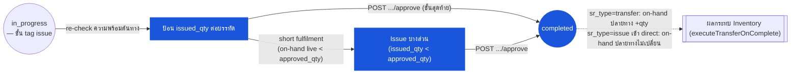

# ใบเบิกของสโตร์ (Store Requisition) — User Flow — Fulfiller

> **At a Glance**
> **Persona:** Store Keeper / Warehouse Supervisor — ผู้ถือขั้น workflow ที่ tag `enum_stage_role.issue` &nbsp;·&nbsp; **โมดูล:** [store-requisition](/th/inventory/store-requisition) &nbsp;·&nbsp; **ขั้น workflow:** in_progress (ขั้น tag issue) → completed (การเดินขั้นสุดท้าย fire การเขียน inventory-transaction) &nbsp;·&nbsp; **สิทธิ์สำคัญ:** บันทึก `issued_qty` ผ่าน endpoint `/approve` ทั่วไปเดียวกับที่ Approver ใช้; ไม่มี UI เลือก lot (FIFO auto-assign)
> **persona นี้ทำอะไร:** บันทึก `issued_qty` ที่ขั้น tag issue — action approve ทั่วไปเดียวกับที่ขั้นอื่นใช้ — ซึ่งตอนเดินขั้นสุดท้ายจะลด on-hand ต้นทาง
> ⚠️ **แก้ไขรอบนี้.** เวอร์ชันก่อนหน้าของหน้านี้บรรยาย action "commit" แยกต่างหาก, sub-form เลือก lot ด้วยมือ, segregation of duties ที่บังคับใช้ระหว่าง Approver กับ Fulfiller พร้อม threshold มูลค่าต่ำที่ config ได้ และการ post GL ไม่มีข้อความใดยืนยันได้ — ดู callout ด้านล่างและการเขียนใหม่ในส่วนที่ 1

## 1. บทบาทในโมดูลนี้

Persona **Fulfiller** คือผู้ถือขั้น workflow ที่ tag `enum_stage_role.issue` (โดยทั่วไปมีตำแหน่ง Store Keeper / Warehouse Supervisor) ที่สถานที่ต้นทาง ผู้บันทึก `issued_qty` ต่อบรรทัด (ซึ่งอาจน้อยกว่า `approved_qty` ถ้าสต๊อกลดลงตั้งแต่อนุมัติ) **แก้ไขรอบนี้:** ปุ่ม "Issue" ของ frontend (`useIssueStoreRequisition`) เรียก endpoint `POST .../approve` เดียวกันเป๊ะกับปุ่ม "Approve" ของ Approver (`useApproveStoreRequisition`) — ต่างกันแค่ tag `stage_role` ที่ส่งใน request body ไม่มี endpoint "commit" แยกต่างหาก เอกสารกลายเป็น `completed` เมื่อการเรียกนี้เกิดขึ้นที่ขั้น workflow สุดท้าย (`workflow_next_stage === '-'`) ซึ่ง fire `executeTransferOnComplete()` ใน `store-requisition.logic.ts`: เขียนแถว `tb_inventory_transaction` ผ่าน `InventoryTransactionService.executeTransfer()` ลด on-hand ต้นทาง และสำหรับ `sr_type = transfer` เพิ่ม on-hand ปลายทาง **การเลือก lot ที่ขั้นนี้เป็น FIFO ที่ระบบคำนวณ 100%** (`getAvailableFifoLots` / `consumeFifoLots`) — ไม่มี UI เลือก lot ใน SR frontend เลย ดังนั้นจึงไม่มี action "เลือก lot" ด้วยมือสำหรับ persona นี้ การ post GL/journal-entry จาก event นี้ยังไม่ยืนยัน (ดู [02-business-rules.md](./02-business-rules.md) `SR_POST_007`) ตอน entry SR อยู่ที่ `doc_status = in_progress` พร้อม `workflow_current_stage` ชี้ขั้น tag issue; แต่ละบรรทัดที่ Fulfiller กระทำมี `approved_qty > 0` (หรือ `0` ถ้าบรรทัดนั้นถูก reject ที่ต้นน้ำ) และลายเซ็นต่อบรรทัดของ Approver ถูกรักษาบน `tb_store_requisition_detail.approved_by_*` **ยังไม่ยืนยัน:** Approver ถูก block จากการถือขั้น issue บน SR เดียวกันด้วยหรือไม่ — ไม่พบการ cross-check `approved_by_id` ใน `store-requisition.service.ts` และไม่พบ config threshold การผ่อนคลาย SoD ใด ๆ ในโมดูลนี้ การแก้ไขหลัง commit อยู่นอก scope ของ persona นี้; ไปผ่าน [inventory-adjustment](/th/inventory/inventory-adjustment)

### ตำแหน่งใน workflow (Fulfiller เน้นสี)

```mermaid
graph LR
    approved(("in_progress\n— ขั้น tag issue")) -->|"re-check ความพร้อมต้นทาง"| pick["ป้อน issued_qty ต่อบรรทัด"]:::current
    pick -->|"POST .../approve (ขั้นสุดท้าย)"| completed(("completed")):::current
    pick -->|"short fulfilment\n(on-hand live < approved_qty)"| partial["Issue บางส่วน\n(issued_qty < approved_qty)"]:::current
    partial -->|"POST .../approve"| completed
    completed -.->|"sr_type=transfer: on-hand ปลายทาง +qty\nsr_type=issue เข้า direct: on-hand ปลายทางไม่เปลี่ยน"| effects[["ผลกระทบ Inventory (executeTransferOnComplete)"]]
    classDef current fill:#1a56db,color:#fff,stroke:#1a56db;
```

### ตารางสิทธิ์ — V1 Status × Action (Fulfiller)

Fulfiller กระทำที่ `doc_status = in_progress` ขณะ `workflow_current_stage` ถูก tag `enum_stage_role.issue` และ Fulfiller อยู่ใน `user_action.execute` Fulfiller ไม่อาจเกิน `approved_qty` ของ Approver ต่อบรรทัด **แก้ไขรอบนี้:** ไม่พบ check segregation-of-duties (Approver ≠ Fulfiller) หรือ threshold การผ่อนคลาย SoD ใด ๆ ใน `store-requisition.service.ts`

| Action | `in_progress` (ขั้น tag issue) | `completed` |
|---|---|---|
| ดู SR และปริมาณที่อนุมัติ | ✅ (`SR_AUTH_007`) | ✅ |
| Re-check ความพร้อมต้นทาง live | ✅ (`SR_VAL_013` pre-check) | — |
| ป้อน `issued_qty` ต่อบรรทัด (`≤ approved_qty`) | ✅ (`SR_AUTH_007`, `SR_VAL_008`) | ❌ |
| เลือก lot สำหรับสินค้าควบคุม lot | ❌ — ไม่มี UI เลือก lot; lot ถูก assign แบบ FIFO อัตโนมัติที่การเดินขั้นสุดท้าย | ❌ |
| ป้อน comment / attachment ต่อบรรทัด | ✅ | ❌ |
| การเดินขั้นสุดท้าย (`in_progress → completed`) | ✅ (`SR_AUTH_007`) — endpoint `/approve` เดียวกับขั้นอื่นใด ๆ | ❌ |
| Short fulfilment (issue บางส่วน; `issued_qty < approved_qty`) | ✅ (`SR_POST_012`) | — |
| การเดินขั้นสุดท้ายเมื่อ Fulfiller = Approver ของบรรทัด | ยังไม่ยืนยันว่าถูก block — ไม่พบ SoD check ในโค้ด | — |
| แก้ส่วนหัว / ปริมาณบรรทัดเกิน `approved_qty` | ❌ | ❌ |
| Reject ทั้งเอกสาร (`in_progress → voided`) | ✅ — action reject ทั่วไปเดียวกับที่ผู้ถือขั้นปัจจุบันคนใดก็เรียกได้; ไม่ใช่สิทธิ์ "void" แยกต่างหาก | ❌ |

> ℹ️ **แก้ไข — ไม่พบกลไก "commit" หรือ "3-variant" แยกต่างหาก** ทั้ง `sr_type = transfer` และ `sr_type = issue` complete ผ่านการเรียก `/approve` เดียวกันเมื่อ `workflow_next_stage === '-'`; จุดแตกแขนงเดียวของ `executeTransfer()` คือ `location_type` ของปลายทางเป็น `direct` (ถูก expense ทันที, on-hand คงที่ 0) หรือ `inventory` (on-hand เพิ่ม) ไม่มี action "Complete" แยกต่างหากจากการบันทึก `issued_qty` และเดินขั้นสุดท้าย

## 2. จุดเข้าและ Flow หลัก

**จุดเข้า:** หนึ่งเส้นทางที่ยืนยันได้สู่ action issuance

- **SR list กรองเป็นขั้น issue** — list view กรองเป็น `(doc_status = 'in_progress', workflow_current_stage = '<ขั้น tag issue>', user_action.execute CONTAINS me)`; Fulfiller เปิด SR จากที่นี่ **ยังไม่ยืนยัน:** list นี้กรองเพิ่มตาม `from_location_id IN my_locations` หรือไม่ — ไม่พบ check การจำกัด scope ตามสถานที่แบบนี้ใน `store-requisition.service.ts`

**Flow หลัก (เส้นทาง happy path):**

1. **เปิด SR ที่ต้นทาง** Detail view แสดงเอาท์เลตปลายทาง, `sr_type`, expected date, requester, ลายเซ็นของ approver บนแต่ละบรรทัด (`approved_by_name`, `approved_date_at`, `approved_message`) และบรรทัดพร้อม `approved_qty` (ในหน่วย UoM ของสินค้า)
2. **Re-check ความพร้อมต้นทางตอน issue** หน้าจอแสดง on-hand ต้นทาง live ต่อบรรทัด — นี่คือสิ่งที่ `SR_VAL_013` re-check ที่การเดินขั้นสุดท้าย ถ้า on-hand live ลดต่ำกว่า `approved_qty` ตั้งแต่อนุมัติ Fulfiller ต้อง short-fulfil (decision branch ด้านล่าง)
3. **หยิบสินค้าจริงและป้อน `issued_qty` ต่อบรรทัด** สิ่งที่หยิบจริง ในหน่วย UoM ของสินค้า; หน้าจอบังคับ `0 ≤ issued_qty ≤ approved_qty` ตาม `SR_VAL_008`
4. **บันทึก context เพิ่ม** Comment แบบอิสระต่อบรรทัด; attachment เขียนไป `tb_store_requisition_detail_comment`
5. **คลิก Issue** เรียก endpoint `POST .../approve` เดียวกันเป๊ะกับปุ่ม "Approve" ของ Approver (`useIssueStoreRequisition` และ `useApproveStoreRequisition` คือ mutation เดียวกัน ต่างกันแค่ tag `stage_role`) เมื่อนี่เป็นขั้นสุดท้าย (`workflow_next_stage === '-'`) เอกสารกลายเป็น `completed` และ `executeTransferOnComplete()` fire
6. **Inventory fan-out fire** สำหรับแต่ละบรรทัดที่ `issued_qty > 0` `InventoryTransactionService.executeTransfer()` insert แถว `tb_inventory_transaction` (`inventory_doc_type = store_requisition`) พร้อม child `tb_inventory_transaction_detail` ที่บรรจุ `lot_no` (assign แบบ FIFO โดยระบบ), `expiry_date` และ `cost_per_unit`; stamp id บน `tb_store_requisition_detail.inventory_transaction_id`; ลด on-hand ต้นทาง; สำหรับ `sr_type = transfer` เพิ่ม on-hand ปลายทาง (สำหรับ `sr_type = issue` เข้าสถานที่ `direct` transfer-in หักลบเป็นศูนย์ — on-hand ปลายทางไม่เปลี่ยน) การ post GL/journal-entry ยังไม่ยืนยัน
7. **เอกสารเปลี่ยนสถานะ** `doc_status = in_progress → completed`; `workflow_history` ได้ entry สุดท้าย SR ล็อกจากการแก้เพิ่ม **แก้ไขรอบนี้:** ไม่มี handoff ปลายน้ำไปยัง "Receiver" ที่ยืนยันได้ — ดู [03-user-flow-receiver.md](./03-user-flow-receiver.md)

## 3. Branch การตัดสินใจ

- **Stock-out ตอน issue (on-hand live < `approved_qty`)** — Fulfiller เห็น on-hand live ต่ำกว่า `approved_qty` บนบรรทัดหนึ่งขึ้นไป การลด `issued_qty` ให้เท่ากับสิ่งที่มีจริงแล้ว issue ต่อไปเป็นเส้นทางที่ยืนยันได้ (`SR_VAL_013` re-check on-hand live เทียบกับ `issued_qty` ที่ป้อน ไม่ใช่ `approved_qty` เดิม); ถ้อยคำ system-comment ที่เจาะจงและทางเลือก "ข้ามบรรทัด" แยกต่างหากตามที่เวอร์ชันก่อนหน้าบรรยายไม่ได้รับการยืนยันโดยตรง และควรถือเป็นตัวอย่างประกอบ
- **การเลือก lot** — **แก้ไขรอบนี้.** ไม่มี UI เลือก lot หรือตัวเลือก "นโยบายการหมุนเวียน" ที่เปิดให้ persona นี้ `createFifoConsumption()` ใน `inventory-transaction.service.ts` assign lot อัตโนมัติผ่าน `getAvailableFifoLots()` / `consumeFifoLots()` การ consume หลาย lot บนบรรทัดเดียวเป็นรายละเอียดฝั่ง backend ไม่ใช่การตัดสินใจของ Fulfiller
- **ความพยายาม commit ในงวดปิด** — **ลบออกรอบนี้; ยังไม่ยืนยัน.** ไม่พบการอ้างถึง `period` เลยไม่ว่าใน `store-requisition.service.ts` หรือ `store-requisition.logic.ts`; ถือว่าข้อความ block งวดปิดใด ๆ สำหรับ SR ยังไม่ยืนยัน (ดู `SR_VAL_014`)
- **การละเมิด SoD ตอน issuance** — **ลบออกรอบนี้; ยังไม่ยืนยัน.** ไม่พบการ cross-check ระหว่าง `approved_by_id` กับผู้ใช้ที่ issue ในโค้ด และไม่พบ config threshold การผ่อนคลาย SoD ใด ๆ ในโมดูลนี้

## 4. จุดออก / Handoff

การมีส่วนร่วมของ Fulfiller บน SR ที่กำหนดจบที่ขอบเขตที่ยืนยันได้หนึ่งในสอง:

- **การเดินขั้นสุดท้ายสำเร็จ (`in_progress → completed`)** — SR ล็อก; on-hand ต้นทางลดแล้ว; สำหรับ `sr_type = transfer` ปลายทางได้รับสต๊อกแล้ว **ไม่มี persona "Receiver" ปลายน้ำที่ยืนยันได้** — ดู [03-user-flow-receiver.md](./03-user-flow-receiver.md) สำหรับสิ่งที่ตรวจสอบแล้ว การแก้ไขใด ๆ ต่อมาไปผ่าน [inventory-adjustment](/th/inventory/inventory-adjustment)
- **Reject ทั้งเอกสาร** — `in_progress → voided` (action reject ทั่วไปเดียวกับที่ผู้ถือขั้นปัจจุบันคนใดก็เรียกได้ รวมถึง Fulfiller เอง); เอกสารจบ

การ reverse SR ที่ `completed` หลัง commit ไม่ใช่ส่วนหนึ่งของเส้นทาง Fulfiller ปกติ; ดู [03-user-flow-audit-config.md](./03-user-flow-audit-config.md) สำหรับสิ่งที่ยืนยันได้และยังไม่ยืนยันเกี่ยวกับการแก้ไขหลัง commit

## 5. แหล่งอ้างอิง

- ภาพรวมแม่: [03-user-flow.md](./03-user-flow.md) — วงจรชีวิตที่แก้ไขแล้วและตาราง handoff ข้าม persona (ไม่มี "Fulfiller → Receiver" หรือ "Receiver + Inventory Controller" ที่ยืนยันได้)
- `../carmen/docs/store-requisitions/SR-User-Experience.md` § Processing a Store Requisition — แหล่ง carmen/docs สำหรับ fulfiller (ชื่อ "Maria Rodriguez, Warehouse Supervisor" ในเรื่องเล่า persona); ถือเป็นเจตนาการออกแบบ ไม่ใช่พฤติกรรมปัจจุบันที่ยืนยันแล้ว
- `../carmen/docs/store-requisitions/Store Requisitions.md` § UC-69 (Approve Requisition and Record Stock as Issued) — แหล่ง use-case; โค้ดปัจจุบัน implement นี่เป็น action `/approve` ทั่วไปเดียวกับขั้นอื่น ไม่ใช่ use case "commit" แยกต่างหาก
- Sibling: [03-user-flow-approver.md](./03-user-flow-approver.md) — cap `approved_qty` ของ Fulfiller ตั้งที่นั่น; ทั้งสอง persona กระทำผ่าน endpoint `/approve` เดียวกัน
- Sibling: [03-user-flow-receiver.md](./03-user-flow-receiver.md) — แก้ไขรอบนี้เพื่อบันทึกว่าไม่พบ persona Receiver แยกใน source ปัจจุบัน
- Sibling: [03-user-flow-audit-config.md](./03-user-flow-audit-config.md) — แก้ไขรอบนี้; การตรวจสอบ GL/journal และ config threshold การผ่อนคลาย SoD ไม่พบใน source ปัจจุบัน
- Sibling: [01-data-model.md](./01-data-model.md) — `tb_store_requisition_detail.issued_qty`, ลิงก์ `inventory_transaction_id` และ linkage ข้อมูล lot ผ่าน `tb_inventory_transaction_detail` (lot อยู่บน inventory transaction และ assign แบบ FIFO อัตโนมัติ — ดู §5 ข้อ 2, 6, 12 ของ data model)
- Sibling: [02-business-rules.md](./02-business-rules.md) — `SR_VAL_008` (quantity invariant `issued_qty ≤ approved_qty`), `SR_VAL_013` (check ความพร้อมต้นทาง live), `SR_AUTH_007` (อำนาจขั้น issue), `SR_POST_005`–`SR_POST_006` (การเดินขั้นสุดท้ายและ inventory fan-out), `SR_POST_010` (reject ทั้งเอกสาร → `voided`)
- Related: [inventory](/th/inventory/inventory) — โมดูลปลายน้ำที่การเดินขั้นสุดท้าย fan-out เข้าไป; ข้อมูล lot, expiry และ cost-layer อยู่บน `tb_inventory_transaction_detail`
- Related: [costing](/th/inventory/costing) — FIFO / moving-average ของสถานที่ต้นทาง feed unit cost ที่ issue
- Related: [good-receive-note](/th/inventory/good-receive-note) — การโอนระหว่างคลังที่เวอร์ชันก่อนหน้าของหน้านี้บรรยายว่าเป็นรูปแบบ "GRN คู่"; ยังไม่ได้ตรวจสอบซ้ำอย่างเป็นอิสระในรอบนี้
