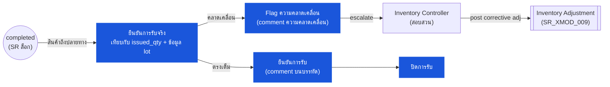

# ใบเบิกของสโตร์ (Store Requisition) — User Flow — Receiver

> **At a Glance**
> **Persona:** ผู้แทนเอาท์เลตปลายทาง / dock stock controller &nbsp;·&nbsp; **โมดูล:** [[store-requisition]] &nbsp;·&nbsp; **ขั้น workflow:** completed (เป็นจุดสิ้นสุดแล้ว — ตรวจสอบจริง ไม่เปลี่ยนสถานะ) &nbsp;·&nbsp; **สิทธิ์สำคัญ:** ยืนยันการรับ (comment), ยก escalation discrepancy comment
> **persona นี้ทำอะไร:** ยืนยันการรับสินค้าจริงเทียบกับ issued_qty / lot, flag ความคลาดเคลื่อนผ่าน comment และ escalate ไปยัง Inventory Controller เพื่อการ adjust

## 1. บทบาทในโมดูลนี้

Persona **Receiver** คือ **ผู้แทนเอาท์เลตปลายทาง** — คนที่เอาท์เลตที่บริโภค (ครัว บาร์ แบงเควต) หรือคลังปลายทางที่ยืนยันการรับสต๊อกจริงที่ issue จากสถานที่ต้นทาง ในการดำเนินงานเล็ก ๆ Receiver มักเป็นผู้ใช้คนเดียวกับ Requester (Outlet Manager) ที่สวมหมวกที่สองที่จุดส่ง; ในการดำเนินงานใหญ่ Receiver เป็น stock controller เฉพาะที่ปลายทาง ตอน entry SR อยู่ที่ `doc_status = completed` (Fulfiller ได้ commit issue ที่ต้นทางแล้วและ inventory transactions ถูกเขียน; on-hand ของปลายทางได้รับการเพิ่มแล้วสำหรับ `sr_type = transfer` หรือ cost-centre ปลายทางได้รับการ debit แล้วสำหรับ `sr_type = issue`) งานของ Receiver คือ **การยืนยันจริงและการตรวจจับความคลาดเคลื่อน** — นับสิ่งที่มาถึงจริง เปรียบเทียบกับ `issued_qty` ของ SR ต่อบรรทัด ตรวจสอบข้อมูล lot และ expiry บน inventory transaction ที่ลิงก์ และ **flag ความไม่ตรงกัน** ระหว่างสิ่งที่ระบบบอกว่า issue กับสิ่งที่ได้รับจริง Receiver **ไม่** เปลี่ยน `doc_status` โดยตรง — SR เป็นจุดสิ้นสุดที่ `completed` แล้ว — แต่ยก event ความคลาดเคลื่อนผ่านระบบ comment (`tb_store_requisition_comment`, `tb_store_requisition_detail_comment`) ที่ escalate ไปยัง Inventory Controller เพื่อการ resolve ผ่าน `[[inventory-adjustment]]` Receiver **ไม่มี** อำนาจ commit บน SR; บทบาทคือการยืนยันและส่งสัญญาณหลัง commit ฝั่งต้นทาง fire แล้ว สำหรับ SR `sr_type = transfer` ที่จับคู่กับ GRN ปลายทาง (รูปแบบคู่ของ `[[good-receive-note]]` ที่ใช้ใน tenant ที่ปลายทางเป็นนิติบุคคลต่างกันหรือ remote facility) flow ของ Receiver อาจซ้อนกับ flow Receiver ของ GRN — ดู [[good-receive-note/03-user-flow-receiver]]

### ตำแหน่งใน workflow (Receiver เน้นสี)

### ตารางสิทธิ์ — V1 Status × Action (Receiver)

Receiver ดำเนินการเฉพาะบน SR `completed` — SR เป็นจุดสิ้นสุดแล้วเมื่อ Receiver เข้า flow Receiver ไม่อาจเปลี่ยน `doc_status` แก้ `issued_qty` หรือยก inventory adjustment โดยตรง; อำนาจจำกัดเฉพาะการยืนยันและการส่งสัญญาณ ตาม `SR_AUTH_008` Receiver อาจยืนยันการรับจริงและ flag ความคลาดเคลื่อน

| Action | `completed` | สถานะอื่นทั้งหมด |
|---|---|---|
| ดู SR (ส่วนหัว บรรทัด issued_qty ข้อมูล lot บน inventory transaction ที่ลิงก์) | ✅ (`SR_AUTH_008`) | ✅ (อ่านอย่างเดียว) |
| ยืนยันการรับเต็ม (append `user` comment บนบรรทัด) | ✅ (`SR_AUTH_008`, `SR_POST_013`) | ❌ |
| Flag ความคลาดเคลื่อน (append comment ความคลาดเคลื่อนพร้อมปริมาณที่รับจริง) | ✅ (`SR_AUTH_008`, `SR_POST_013`) | ❌ |
| แนบหลักฐาน (รูป ใบชั่งน้ำหนัก) ที่ comment บรรทัด | ✅ | ❌ |
| เปลี่ยน `doc_status` | ❌ (`SR_POST_013` — สถานะไม่ขยับ) | ❌ |
| แก้ `issued_qty` บนบรรทัดใด | ❌ | ❌ |
| Void SR | ❌ | ❌ |
| Post inventory adjustment โดยตรง | ❌ (ผ่าน Inventory Controller → `SR_XMOD_009`) | ❌ |

> ℹ️ **การจัดการความคลาดเคลื่อน:** comment ความคลาดเคลื่อน **ไม่** ย้าย `doc_status` — SR ยังคงเป็น `completed` Resolution ผ่าน `[[inventory-adjustment]]` ที่ Inventory Controller ร่วมเขียน (`SR_XMOD_009`) สำหรับ SR `sr_type = transfer` ที่จับคู่กับ GRN ปลายทาง flow ของ Receiver อาจขยายไปยังโมดูล GRN

## 2. จุดเข้าและ Flow หลัก

**จุดเข้า:** สองเส้นทางสู่การยืนยันรับ

- **Inbound SR queue → SR ที่ issue มาให้เอาท์เลตของฉัน** — list view กรองเป็น `(doc_status = 'completed', to_location_id IN my_locations, last_action_at_date >= last_check)`; Receiver เลือก SR เพื่อยืนยัน
- **การส่งจริงที่ dock** — สินค้ามาถึงพร้อม pick list ที่พิมพ์ / SR `sr_no` ที่สแกนผ่านมือถือ; Receiver เปิด SR ตามเลขอ้างอิงและยืนยัน

**Flow หลัก (เส้นทาง happy path, 8 ขั้น):**

1. **เปิด SR ที่ปลายทาง** Detail view แสดงสถานที่ต้นทาง, `sr_type`, วันที่ issue (`last_action_at_date` สำหรับ commit), ลายเซ็นของ Fulfiller (ผู้ใช้ที่กระทำตอน commit ระบุได้ผ่าน `last_action_by_id`) และบรรทัดพร้อม `issued_qty` ต่อบรรทัด Receiver ยังเห็นลิงก์ inventory-transaction (`inventory_transaction_id`) ต่อบรรทัดที่ surface ข้อมูล lot, expiry และ cost
2. **ยืนยันการส่งจริงเทียบกับ SR** เปิดสินค้าที่ dock; สำหรับแต่ละบรรทัดใน SR: นับปริมาณจริง ระบุ label ของ lot ตรวจสอบ expiry ตรวจสอบความเสียหายระหว่างทาง Receiver บันทึกข้อสังเกตตรงกับ SR (ไม่ต้องการเอกสารแยกสำหรับกรณีปกติ — ความคลาดเคลื่อน escalate ผ่าน `[[inventory-adjustment]]` ถ้าเป็นสาระสำคัญ)
3. **ยืนยันการรับเต็มต่อบรรทัด** เมื่อปริมาณจริงตรงกับ `issued_qty` และข้อมูล lot / expiry ตรงกับ inventory transaction ที่ลิงก์ Receiver append `user` comment ลงบรรทัด ("received in full, condition good") ผ่าน `tb_store_requisition_detail_comment` ไม่มี state transition; ไม่มีการแก้ปริมาณบน SR
4. **Flag ความคลาดเคลื่อนบนบรรทัด** เมื่อปริมาณจริงต่างจาก `issued_qty` (ขาด เกิน หรือ lot ผิด) Receiver เขียน comment ความคลาดเคลื่อนพร้อมปริมาณที่รับจริง, ปริมาณที่คาดหวัง (คือ `issued_qty`), เหตุผลของความคลาดเคลื่อนถ้าทราบ (เสียในขนส่ง, นับผิดที่ต้นทาง, lot ผิดที่หยิบ, ขาด lot) และหลักฐานประกอบ (รูป ใบชั่งน้ำหนัก) ผ่าน attachment บน comment บรรทัด
5. **แจ้ง Inventory Controller** comment ความคลาดเคลื่อนเป็น `type = 'user'` และมองเห็นใน activity log ของ SR; ถ้า tenant มี workflow escalation ความคลาดเคลื่อน comment อาจยก event `system` เข้า queue ของ Inventory Controller (ขึ้นกับ config) Escalation เป็น **out-of-band จาก `doc_status` ของ SR** — SR ยังคงเป็น `completed`
6. **รอการ resolution ของ Inventory Controller** Inventory Controller review ความคลาดเคลื่อน สอบสวนการนับฝั่งต้นทาง vs ปลายทาง ตัดสินใจ corrective action: (a) ยอมรับความคลาดเคลื่อนและ post adjustment ที่ปลายทาง (ผ่าน `[[inventory-adjustment]]` เพิ่มหรือลด on-hand ปลายทางให้ตรงกับจริง); (b) ยอมรับความคลาดเคลื่อนและ post adjustment ที่ต้นทาง (ถ้า records ต้นทางผิด); (c) escalate ต่อไปยัง security / loss prevention ถ้า gap บ่งชี้การลักขโมย; (d) ยกเลิกความคลาดเคลื่อนด้วย system comment ถ้ากลายเป็นข้อผิดพลาดการนับ
7. **ปิดการรับ** เมื่อความคลาดเคลื่อน (ถ้ามี) ได้รับการ resolve (หรือบรรทัดตรงเต็มจากขั้นที่ 3) Receiver อาจ append comment ปิดสุดท้าย ("received and reconciled") บน SR สถานะของ SR ไม่เปลี่ยน — ยังเป็น `completed` จาก commit ฝั่งต้นทาง; การ reconcile ฝั่งปลายทางอยู่ใน thread comment และ (ในที่ที่เกี่ยวข้อง) ในเอกสาร adjustment ที่ลิงก์
8. **อัปเดต visibility ของ on-hand เอาท์เลตปลายทาง** สำหรับ `sr_type = transfer`, `tb_inventory_status[to_location_id, product_id].quantity_on_hand` ของปลายทางถูกเพิ่มแล้วตอน commit ฝั่งต้นทาง; บทบาท Receiver คือยืนยัน ไม่ใช่ป้อน on-hand สำหรับ `sr_type = issue` สินค้าเข้าการบริโภคของปลายทางโดยตรง (ไม่มี on-hand ที่ปลายทาง); Receiver ยืนยัน debit cost-centre ถูกต้อง

## 3. Branch การตัดสินใจ

- **ตรงเต็ม** — ปริมาณจริงเท่ากับ `issued_qty`; lot และ expiry ตรงกับ inventory transaction ที่ลิงก์ Receiver append comment ยืนยันปกติ; ไม่มี action เพิ่ม นี่คือเส้นทางที่พบบ่อยที่สุด
- **รับขาด (`received < issued_qty`)** — ปริมาณจริงน้อยกว่าที่ระบบบอกว่า issue gap อาจเกิดจาก (a) ของแตกในขนส่ง, (b) นับผิดที่ต้นทาง (ข้อผิดพลาดของ Fulfiller), (c) สูญหายในขนส่ง (ลักขโมย / การจัดการ) หรือ (d) นับผิดที่ปลายทาง (ข้อผิดพลาดของ Receiver) Receiver เขียน comment ความคลาดเคลื่อนพร้อมปริมาณที่รับจริง; Inventory Controller สอบสวน
- **รับเกิน (`received > issued_qty`)** — พบยากแต่เป็นไปได้ถ้าต้นทางนับผิดทางสูง Receiver เขียน comment ความคลาดเคลื่อน; Inventory Controller (a) reconcile โดยปรับการนับต้นทางขึ้น (ต้นทางมีสต๊อกที่ซ่อนอยู่) หรือ (b) ปรับการนับปลายทางขึ้นให้ตรงกับจริง (records ฝั่งต้นทางถูก ปลายทางได้รับส่วนเกิน) หมายเหตุนี้อาจบ่งชี้ข้อผิดพลาด fulfilment ที่ต้นทางที่ปล่อยเกินโดยไม่ได้บันทึก
- **lot ผิดที่ได้รับ** — เลข lot บนสินค้าจริงไม่ตรงกับ lot ที่บันทึกบน `tb_inventory_transaction_detail` ที่ลิงก์ สำหรับสินค้าไม่เน่าเสียอาจเป็นความไม่ตรงเชิง cosmetic (ต้นทางหยิบ lot ต่างจากที่บันทึก); สำหรับสินค้าเน่าเสียสำคัญเพราะการติดตาม expiry แตก Receiver flag ความคลาดเคลื่อน lot ผิด; Inventory Controller ทำงานกับ Fulfiller / records ต้นทางเพื่อแก้ trace lot ผ่าน `[[inventory-adjustment]]` (หรือ comment แก้ lot ถ้า lot จริงอยู่ใน records ต้นทางแต่ถูกบันทึกผิดบน SR นี้)
- **สินค้าเสียตอนมาถึง** — สินค้าจริงมาถึงเสียจากการขนส่ง Receiver บันทึกปริมาณที่เสีย ถ่ายรูปความเสียหาย และ (a) ยอมรับสินค้าและ write off ส่วนที่เสียที่ปลายทางผ่าน `[[inventory-adjustment]]` (เหตุผล "damaged-on-arrival") หรือ (b) ปฏิเสธส่วนที่เสียและ escalate ไปยัง Inventory Controller สำหรับ logistics ส่งคืนฝั่งต้นทาง
- **มาถึงช้าเทียบกับ `expected_date`** — สินค้าจริงมาถึงหลังที่ปลายทางต้องการ (การผลิตเลื่อนหรือเอาท์เลตต้องใช้สิ่งทดแทน) Receiver บันทึกความช้าใน comment; Inventory Controller อาจติดตามรูปแบบช้าเรื้อรังสำหรับ review supply-chain ไม่มี state change
- **สินค้าไม่มาถึงเลย** — SR เป็น `completed` แต่ปลายทางไม่เคยเห็นสินค้าจริง (สูญหายในขนส่ง) Receiver flag ความคลาดเคลื่อน "missing-on-arrival" ด้วย `received = 0` เทียบกับ `issued_qty` ไม่เป็นศูนย์; Inventory Controller เริ่มการค้นหาและถ้ากู้คืนไม่ได้ post compensating loss adjustment ที่ปลายทางผ่าน `[[inventory-adjustment]]`
- **`sr_type = transfer` จับคู่กับ GRN ปลายทาง** — ใน tenant ที่ใช้รูปแบบคู่ SR + GRN สำหรับการโอนระหว่างคลัง (โดยทั่วไปเมื่อต้นทางและปลายทางเป็นนิติบุคคลต่างกันหรือ remote facility) Receiver เปิด GRN ฝั่งปลายทางเพื่อยืนยันการรับเป็นทางการด้วยเอกสารแยก ภาพลายเซ็น และวงจรชีวิต GRN เต็ม ฝั่ง GRN ถูกกำกับโดยโมดูล [[good-receive-note]]; ฝั่ง SR ยังคงเป็น `completed` จาก commit ฝั่งต้นทาง เอกสารสองใบ reconcile ตามการอ้างอิง

## 4. จุดออก / Handoff

การมีส่วนร่วมของ Receiver บน SR ที่กำหนดจบที่ขอบเขตหนึ่งในสี่:

- **ยืนยันตรงเต็ม** — ไม่มี action เพิ่ม; SR ยังคงเป็น `completed`; การรับถูก log ใน thread comment สำหรับ audit Receiver ย้ายไปยัง SR inbound ถัดไป
- **Flag ความคลาดเคลื่อน รอ controller** — handoff ไปยัง **Inventory Controller** (persona Audit / Config) เพื่อสอบสวนและ corrective action SR อยู่ที่ `completed`; controller ทำงานผ่านความคลาดเคลื่อนและในที่ที่ต้องการ post adjustment ผ่าน `[[inventory-adjustment]]`
- **ความคลาดเคลื่อน resolve ด้วย adjustment** — handoff เสร็จเมื่อ Inventory Controller post adjustment แก้ไข เอกสาร adjustment มี back-reference ไปยัง id SR ต้นกำเนิดสำหรับ audit (`SR_XMOD_009`); SR เองยังคงเป็น `completed` และ on-hand ปลายทางตรงกับจริงแล้ว Receiver อาจ append comment ปิด
- **Escalation ไปยัง security / loss prevention** — สำหรับความคลาดเคลื่อนเชิงสาระสำคัญที่บ่งชี้การลักขโมย Inventory Controller escalate ออกนอกระบบ inventory; บทบาท Receiver ณ จุดนี้คือ fact-witness (comment ความคลาดเคลื่อนที่เซ็นพร้อมหลักฐาน) SR ไม่ได้รับผลกระทบเชิงปฏิบัติการ

Receiver **ไม่มี** อำนาจ reverse SR, void หรือแก้ `issued_qty` บนบรรทัด — สิทธิ์เหล่านั้นอยู่กับ Inventory Controller (void เชิงบริหารก่อน commit ไม่สามารถทำได้แล้วเพราะ SR เป็น `completed`) และกับทีม Finance (การ reverse หลัง commit ผ่าน inventory-adjustment)

## 5. แหล่งอ้างอิง

- ภาพรวมแม่: [03-user-flow.md](./03-user-flow.md) — วงจรชีวิต canonical และตาราง handoff ข้าม persona; ส่วนที่ 4 แถว "Fulfiller → Receiver" บรรยายขอบเขตจุดเข้า; "Receiver → Inventory Controller (flag ความคลาดเคลื่อน)" เป็นจุดออกหลักของ persona นี้
- `../carmen/docs/store-requisitions/SR-Overview.md` § User Roles → แถว Receiver — แหล่ง carmen/docs สำหรับขอบเขตความรับผิดชอบของ persona ("Confirms receipt of transferred items; view incoming SRs; confirm receipt; report discrepancies")
- `../carmen/docs/store-requisitions/SR-User-Experience.md` — หมายเหตุ: แหล่ง User-Experience ใช้โมเดล 4 persona (Store Manager, Warehouse Supervisor, Department Head, Finance Manager) และไม่ระบุ Receiver เป็น persona แยก; บทบาท Receiver ที่ระบุที่นี่รวบรวมจากตาราง User Roles ของ Overview และ flow Stock Movement Processing
- Sibling: [03-user-flow-fulfiller.md](./03-user-flow-fulfiller.md) — persona ต้นน้ำ; input ของ Receiver คือสินค้าที่ Fulfiller dispatch จริง พร้อม `issued_qty` และข้อมูล lot ที่ persist บน inventory transaction ที่ลิงก์
- Sibling: [03-user-flow-requester.md](./03-user-flow-requester.md) — ในเอาท์เลตเล็ก ๆ มักเป็นผู้ใช้คนเดียวกับ Receiver; Requester เห็นการยืนยันการรับและความคลาดเคลื่อนใด ๆ ที่กระทบสิ่งที่วางแผน
- Sibling: [03-user-flow-audit-config.md](./03-user-flow-audit-config.md) — Inventory Controller จัดการสอบสวนความคลาดเคลื่อนและ post inventory-adjustment เพื่อ reconcile on-hand ปลายทางกับจริง; Receiver เป็นผู้ส่งสัญญาณหลักไปยัง persona นี้
- Sibling: [01-data-model.md](./01-data-model.md) — `tb_store_requisition_detail.issued_qty` และ `inventory_transaction_id` คือค่าที่ Receiver เปรียบเทียบกับการรับจริง; ข้อมูล lot อยู่บน `tb_inventory_transaction_detail` (§5 ข้อ 6 ของ data model)
- Sibling: [02-business-rules.md](./02-business-rules.md) — `SR_POST_013` (flag ความคลาดเคลื่อนของ Receiver **ไม่** ย้าย `doc_status`; resolution ผ่าน inventory-adjustment); `SR_XMOD_009` (การแก้ไขหลัง commit ไหลผ่าน inventory-adjustment ไม่ใช่การแก้ SR)
- Related: [[good-receive-note]] — สำหรับ tenant ที่จับคู่ SR (ฝั่งต้นทาง) กับ GRN (ฝั่งปลายทาง) ในการโอนระหว่างคลัง flow ของ Receiver ขยายไปยัง [[good-receive-note/03-user-flow-receiver]]
- Related: [[inventory-adjustment]] — เส้นทาง resolution สำหรับความคลาดเคลื่อนเชิงสาระสำคัญ; เอกสาร adjustment มี back-reference ไปยัง SR สำหรับ audit
- Related: [[inventory]] — visibility ของ on-hand ปลายทาง (สำหรับ `sr_type = transfer`) ถูกเพิ่มแล้วตอน commit ฝั่งต้นทาง; การยืนยันของ Receiver ยืนยันว่า on-hand ระบบตรงกับจริง
