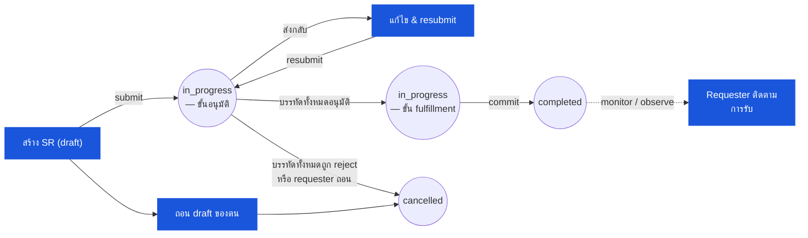

# ใบเบิกของสโตร์ (Store Requisition) — User Flow — Requester

> **At a Glance**
> **Persona:** Outlet Manager (สถานที่บริโภค) &nbsp;·&nbsp; **โมดูล:** [store-requisition](/th/inventory/store-requisition) &nbsp;·&nbsp; **ขั้น workflow:** draft → in_progress (ขั้นอนุมัติแรก; ถอน / แก้ตอน send-back) &nbsp;·&nbsp; **สิทธิ์สำคัญ:** สร้าง / แก้ / submit draft, ถอน draft, ถอนที่ขั้นแรก, แก้หลัง send-back
> **persona นี้ทำอะไร:** ตั้ง SR — เลือกต้นทาง/ปลายทาง + sr_type, เพิ่มบรรทัดพร้อม requested_qty, submit เพื่อขออนุมัติ และแก้ตอน send-back

## 1. บทบาทในโมดูลนี้

Persona **Requester** คือ **Outlet Manager** (ครัว บาร์ แบงเควต ภัตตาคาร) — คนที่สถานที่บริโภคที่ระบุความต้องการสต๊อกและตั้ง requisition กับคลังต้นทางหรือสโตร์กลาง Requester เป็นเจ้าของ `draft` ที่แก้ไขได้: เลือกสถานที่ต้นทางและเอาท์เลตปลายทาง เลือกประเภทการเคลื่อนย้าย (`sr_type = issue` สำหรับการดึงเพื่อบริโภคแบบ direct-cost, `sr_type = transfer` สำหรับการย้ายเข้าสถานที่ที่ถือ inventory อีกแห่ง) เพิ่มบรรทัดสินค้าพร้อม `requested_qty` และวันที่ต้องการ (`expected_date`) แนบโน้ตประกอบ (snapshot recipe demand, รายละเอียด banquet event, เหตุผล par-level) และ submit เอกสารเพื่อขออนุมัติ ตอน entry requester ล็อกอินด้วยสิทธิ์ create-SR และเป็นสมาชิก `tb_store_requisition.department_id`; requester อนุญาตให้ทำธุรกรรมระหว่าง `from_location_id` และ `to_location_id` ที่เลือก สถานะ SR ที่ persona นี้เป็นเจ้าของคือ `draft` (สิทธิ์แก้เต็ม) และส่วนเล็ก ๆ ของ `in_progress` — requester สามารถถอน SR ของตนขณะที่ workflow ยังอยู่ที่ขั้นอนุมัติแรกและยังไม่มีผู้อนุมัติกระทำ (`SR_AUTH_004`) และสามารถแก้ / resubmit เมื่อผู้อนุมัติส่งเอกสารกลับมาแก้ไข (ขั้น requester ถูกเข้าใหม่ผ่าน workflow) Segregation of duties ห้าม requester อนุมัติ SR ของตน (`SR_AUTH_011`) — โมดูล SR บังคับใช้ที่ approve action

### ตำแหน่งใน workflow (Requester เน้นสี)

### ตารางสิทธิ์ — V1 Status × Action (Requester)

Requester มีสิทธิ์แก้เต็มที่ `draft` และเข้า `in_progress` อีกครั้งเฉพาะเมื่อผู้อนุมัติส่งเอกสารกลับมาแก้ไข Segregation of duties (`SR_AUTH_011`) ห้าม Requester อนุมัติ SR ของตน — โมดูลบังคับใช้ที่ approve action

| Action | `draft` | `in_progress` (เฉพาะ send-back) | `completed` | `cancelled` / `voided` |
|---|---|---|---|---|
| สร้าง SR | ✅ (`SR_AUTH_001`) | — | — | — |
| แก้ส่วนหัว (สถานที่, วันที่, description, dimension) | ✅ (`SR_AUTH_002`) | ✅ เฉพาะ send-back | ❌ | ❌ |
| เพิ่ม / แก้ / ลบบรรทัด (`requested_qty`) | ✅ (`SR_AUTH_002`) | ✅ เฉพาะ send-back | ❌ | ❌ |
| แนบหลักฐานประกอบ (comment / attachments) | ✅ | ✅ | ❌ | ❌ |
| Submit เพื่อขออนุมัติ (`draft → in_progress`) | ✅ (`SR_AUTH_003`) | — | — | — |
| Resubmit หลัง send-back | — | ✅ (`SR_AUTH_003`) | — | — |
| ถอน / ยกเลิก draft ของตน | ✅ (`SR_AUTH_004`) | ✅ เฉพาะที่ขั้นอนุมัติแรก (`SR_AUTH_004`) | ❌ | — |
| ดู SR (อ่านอย่างเดียว) | ✅ | ✅ | ✅ | ✅ |
| อนุมัติ SR ของตน | ❌ (SOD: Requester ≠ Approver ตาม `SR_AUTH_011`) | ❌ | — | — |

> ℹ️ **Loop ของ send-back:** เมื่อ Approver ส่ง SR กลับเพื่อแก้ไข SR ยังคงที่ `doc_status = in_progress` แต่ `workflow_current_stage` กลับไปขั้น requester Requester แก้และ resubmit; บรรทัดที่อนุมัติแล้วไม่ถูก reverse

## 2. จุดเข้าและ Flow หลัก

**จุดเข้า:** สามเส้นทางในการสร้าง draft

- **โมดูล SR → Create SR** — เลือกเอาท์เลตปลายทาง (default เป็นเอาท์เลตของ requester) จากนั้นเลือกสถานที่ต้นทาง; เลือก `sr_type` (`issue` หรือ `transfer`); เริ่มเพิ่มรายการ
- **Auto-create จาก recipe demand** — โมดูล `[recipe](/th/inventory/recipe)` คำนวณปริมาณวัตถุดิบสำหรับ event production / banquet ที่จะถึงที่เอาท์เลตและ post SR `draft` ให้ requester review; `info.recipe_id` มี back-reference Requester เปิด draft ที่ pre-populate แล้ว ปรับปริมาณถ้าจำเป็น และดำเนินต่อจาก step 4 ด้านล่าง
- **แก้ SR ที่ถูกส่งกลับ (send-back จาก approver)** — approver route เอกสารกลับมาขั้น requester พร้อม `review_message` ต่อบรรทัด; requester เข้าขั้น workflow เดียวกับที่ตนเริ่ม แก้ปริมาณ / โน้ต และ resubmit

**Flow หลัก (เส้นทาง happy path, 10 ขั้น):**

1. **ระบุความต้องการ** review par level ของเอาท์เลต ตารางผลิตที่จะถึง (recipe demand, ใบ event banquet) จุด stock-out ที่ทราบ และ on-hand ที่เอาท์เลต ตัดสินใจสถานที่ต้นทาง (โดยทั่วไปคือสโตร์กลาง) และปลายทาง (เอาท์เลตของ requester เองสำหรับ `issue` หรือสโตร์ inventory อีกแห่งสำหรับ `transfer`)
2. **เปิดโมดูล SR → Create SR** ระบบเขียน `tb_store_requisition` ที่ `doc_status = draft`; `sr_no` กำหนดตามนโยบายเลขของ tenant; `requestor_id` / `requestor_name` / `department_id` / `department_name` บรรจุจาก profile ของผู้ใช้ที่ล็อกอิน
3. **เลือกสถานที่ต้นทาง สถานที่ปลายทาง และประเภทการเคลื่อนย้าย** ต้นทางคือ `from_location_id` (โดยทั่วไปคลัง `tb_location.location_type = 'inventory'`); ปลายทางคือ `to_location_id` (`direct` สำหรับ `sr_type = issue`, `inventory` สำหรับ `sr_type = transfer`) หน้าจอแสดง check ความเข้ากันได้ของ location-type / movement-type จาก `SR_VAL_003`
4. **ป้อนรายละเอียดส่วนหัว** `sr_date` (default เป็นวันนี้), `expected_date` (วันที่เอาท์เลตต้องการของ — ใช้สำหรับลำดับความสำคัญใน fulfilment), `description` (เหตุผลแบบอิสระ: "weekly replenishment", "banquet event Friday", "emergency pull") และ JSON `dimension` cost-dimension ถ้าเอาท์เลตแยกข้าม cost-centre หลายตัว
5. **เพิ่มรายการสินค้า** ค้นหา product catalog ด้วยชื่อ รหัส หรือหมวด; เลือกสินค้า หน้าจอแสดงบล็อก enrichment เฉพาะ UI ที่แสดง on-hand ปัจจุบันที่ต้นทาง, on-order, last price, last vendor และหมวด / barcode ของสินค้า (สิ่งเหล่านี้ **ไม่** ถูกเก็บบนบรรทัด SR — ดู [store-requisition/01-data-model](/th/inventory/store-requisition/01-data-model) § 5 ข้อ 5) ป้อน `requested_qty` (ในหน่วย UoM ของสินค้า); บรรทัดเขียนหนึ่งแถวใน `tb_store_requisition_detail` ทำซ้ำสำหรับแต่ละสินค้าที่ต้องการ
6. **แยกบรรทัดตาม cost-dimension ถ้าจำเป็น** สินค้าเดียวบน SR เดียวกันที่จัดสรร cost-dimension สองแบบต่างกัน (เช่น 60% ไป Banquet, 40% ไป A-la-carte) ถูก model เป็นสองบรรทัดแยก แต่ละบรรทัดมี JSON `dimension` ของตน (ตาม unique index `SRT1_*`) product+dimension เหมือนกันเป็น duplicate (`SR_VAL_007`)
7. **แนบหลักฐานประกอบ** Snapshot recipe demand, ใบ event, รูป, การวิเคราะห์ par-level, เมโม pre-clearance อนุมัติ Attachments scope กับส่วนหัว SR (ผ่าน `tb_store_requisition_comment.attachments`) หรือกับบรรทัดเฉพาะ (ผ่าน `tb_store_requisition_detail_comment.attachments`)
8. **review validation ก่อน submit** หน้าจอแสดง check source-availability `SR_VAL_009` (ตาม tenant config: hard block หรือ soft warn) — สำหรับแต่ละบรรทัด on-hand ต้นทางปัจจุบันหักการจองจาก SR เปิดอื่นถูกแสดง; บรรทัดที่เกิน cap ถูก flag Requester ปรับ `requested_qty` หรือยอมรับ soft warning
9. **Submit เพื่อขออนุมัติ** คลิก **Submit**; ระบบ fire `SR_VAL_001`–`SR_VAL_009`, ตั้ง `doc_status = draft → in_progress`, ก้าว workflow ไปขั้นอนุมัติแรก, บรรจุ `user_action.execute` จาก permitted users ของขั้นนั้น (โดยทั่วไปคือ Department Head ของ requester), เขียน entry `submitted` ลงใน `last_action` / `workflow_history` และ append entry `submit` ลงใน JSON `history` ของแต่ละบรรทัด Requester ถูกแจ้งว่า SR อยู่ภายใต้การอนุมัติแล้ว; เอกสารไม่สามารถแก้จากมือ requester ได้อีก (ยกเว้นผ่าน send-back)
10. **ติดตามสถานะจนกระทั่งรับ** Requester ตรวจสอบความคืบหน้า: การตัดสินใจของ approver กลับมาเป็น send-back (กลับไปขั้น requester) หรือเดินต่อ (workflow ก้าวไปขั้น fulfilment); ตอน commit requester ถูกแจ้งว่าสินค้าถูก issue และอยู่ระหว่างทาง; Receiver ที่ปลายทาง log การรับ; ความคลาดเคลื่อนใด ๆ ถูก flag เพื่อ inventory-controller ติดตาม Requester **ไม่** รับที่ปลายทางโดยตรง — นั่นเป็นบทบาทของ Receiver (ซึ่งในเอาท์เลตเล็ก ๆ อาจเป็นผู้ใช้คนเดียวกันที่สวมหมวกสองใบ)

## 3. Branch การตัดสินใจ

- **Soft warning เรื่องความพร้อมที่ต้นทาง** (`SR_VAL_009` โหมด soft): on-hand ต้นทางน้อยกว่า requested quantity Requester เลือก (a) ลด `requested_qty` ให้ตรงกับสต๊อกที่มี, (b) submit ทั้งที่มี soft warning บันทึก (approver จะเห็น warning ตอนอนุมัติและตัดสินใจว่าจะตัดหรืออนุมัติตามเดิม โดยรับว่า fulfiller อาจต้อง commit บางส่วน) หรือ (c) ตั้ง SR เพิ่มกับสถานที่ต้นทางอื่นถ้าหลายคลังสามารถจัดสินค้าได้
- **Hard block เรื่องความพร้อมที่ต้นทาง** (`SR_VAL_009` โหมด hard): การ submit ถูก reject Requester ต้อง (a) ลด `requested_qty` ให้อยู่ในความพร้อม, (b) ตั้ง SR กับต้นทางอื่น หรือ (c) ขอ inventory controller เปิด / ขยาย config soft-warn
- **แยกการจัดสรร cost-dimension**: สินค้าเดียวกันถูกขอด้วย cost-centre split สองแบบ (เช่น 60/40 ระหว่าง Banquet และ A-la-carte) Requester เพิ่มสองบรรทัดสำหรับ `product_id` เดียวกัน แต่ละบรรทัดมี JSON `dimension` ของตน (ตาม unique index `SRT1_*`) สองบรรทัดไหลอย่างอิสระผ่านการอนุมัติและ fulfilment
- **SR ฉุกเฉิน / นอกรอบ**: เอาท์เลตมีความต้องการทันทีนอกรอบ replenishment รายสัปดาห์ Requester ตั้ง SR ด้วย `description` flag เป็น emergency, ตั้ง `expected_date` เป็นวันนี้ / พรุ่งนี้ และอาจแนบเมโมเหตุผลฉุกเฉิน; approver และ fulfiller เห็น flag เร่งด่วนใน queue ของตน ไม่มีคอลัมน์ `emergency_flag` แยกบน schema — ความเร่งด่วนสื่อสารผ่าน `description` และ extension `info`; workflow อาจมี routing ขั้นฉุกเฉินใน config ของ tenant
- **SR ที่ขับโดย recipe**: โมดูล recipe pre-populate SR ด้วยปริมาณวัตถุดิบที่คำนวณ Requester review และอาจปรับปริมาณ (ลดเท่านั้น — การเพิ่ม invalidate สมมติฐานของ recipe; requester ควรแก้แผนผลิตและ trigger recipe demand ใหม่แทน) ตอน submit SR มี `info.recipe_id` เป็น back-reference
- **Send-back จาก approver**: Approver route SR กลับขั้น requester พร้อม `review_message` ต่อบรรทัดที่กระทบ Requester เห็นเอกสารใน queue ของตนที่ `doc_status = in_progress` แต่ที่ขั้น workflow requester; อาจแก้ `requested_qty` หรือ `description`, ตอบโน้ตของ reviewer และ resubmit (ซึ่ง re-route เอกสารไปขั้นอนุมัติ) หมายเหตุ: requester ไม่สามารถข้าม send-back ที่ active — ต้องตอบ
- **ถอน SR ของตน**: ขณะ workflow ยังอยู่ที่ขั้นอนุมัติแรกและยังไม่มีผู้อนุมัติกระทำ Requester อาจยกเลิก SR ของตน (`in_progress → cancelled` ตาม `SR_AUTH_004`) พร้อมเหตุผล เกินจุดนั้น Requester ต้องขอ approver ให้ reject เอกสาร

## 4. จุดออก / Handoff

การมีส่วนร่วมของ Requester บน SR ที่กำหนดจบที่ขอบเขตหนึ่งในสี่:

- **Submit สำเร็จ** — handoff ไปยัง **Approver** (Department Head) ที่ขั้นอนุมัติแรก เอกสารเป็น `in_progress` แล้วและถือใน queue ของ approver; requester อยู่ในโหมด monitor-only จนกว่า send-back จะ route เอกสารกลับหรือการตัดสินใจของ approver จะย้าย workflow ไปข้างหน้า
- **ได้รับ send-back** — handoff ชั่วคราว **กลับมา Requester** ที่ขั้น workflow requester Requester ตอบ `review_message` ของ approver แก้ตามต้องการ และ resubmit นี่เป็น loop ภายใน `in_progress` ไม่ใช่การเปลี่ยนสถานะ
- **ยกเลิก (ถอนที่ขั้นอนุมัติแรก)** — `in_progress → cancelled` ตาม `SR_AUTH_004`; เอกสารจบ; requester อาจตั้ง SR ใหม่ถ้าความต้องการยังคงอยู่
- **บรรทัดทั้งหมดถูก reject ตอนอนุมัติ** — `in_progress → cancelled` อัตโนมัติตาม `SR_POST_004`; requester เห็นเอกสารใน `cancelled` พร้อม `reject_message` ต่อบรรทัดอธิบายเหตุผล; requester อาจตั้ง SR ที่แก้ไขด้วยปริมาณที่กระชับขึ้น ต้นทางอื่น หรือ justification เพิ่ม

หลัง commit สำเร็จโดย fulfiller Requester อยู่ในโหมด **observer / receiver-coordination**: อาจติดตามการยืนยันของ Receiver ปลายทางและ flag ความคลาดเคลื่อนใด ๆ กลับไปยัง Receiver ในเอาท์เลตเล็ก ๆ Requester และ Receiver มักเป็นคนเดียวกันที่สวมหมวกสองใบ; ในการดำเนินงานใหญ่ Requester มุ่งเน้น demand planning ในขณะที่ Receiver จัดการรับสินค้าจริงที่จุดส่ง

## 5. แหล่งอ้างอิง

- ภาพรวมแม่: [03-user-flow.md](./03-user-flow.md) — วงจรชีวิตห้าค่า canonical (`draft / in_progress / completed / cancelled / voided`) บน `enum_doc_status`, state machine ส่วนกลางที่เส้นทางของ persona นี้ผ่าน และตาราง handoff ข้าม persona
- `../carmen/docs/store-requisitions/SR-User-Experience.md` § Creating a Store Requisition — แหล่ง carmen/docs สำหรับ requester (ชื่อ "Alex Chen, Store Manager" ในเรื่องเล่า persona); ขั้น journey map ไปยังส่วนที่ 2 ข้างบน
- `../carmen/docs/store-requisitions/SR-Overview.md` § User Roles → แถว Requester — แหล่ง carmen/docs สำหรับขอบเขตความรับผิดชอบของ persona
- `../carmen/docs/store-requisitions/Store Requisitions.md` § UC-68 (Create and Manage Store Requisition) — scenario สำเร็จหลักของ use-case create / submit
- Sibling: [03-user-flow-approver.md](./03-user-flow-approver.md) — persona ปลายน้ำที่รับ SR หลัง submit; จัดการการตัดสินใจ approve / trim / reject / send-back
- Sibling: [03-user-flow-fulfiller.md](./03-user-flow-fulfiller.md) — persona fulfilment; ผลของ Requester ต่อสินค้าขึ้นกับ `issued_qty` ต่อบรรทัดของ Fulfiller
- Sibling: [03-user-flow-receiver.md](./03-user-flow-receiver.md) — การยืนยันที่ปลายทาง; ในเอาท์เลตเล็ก ๆ มักเป็นผู้ใช้คนเดียวกับ Requester
- Sibling: [03-user-flow-audit-config.md](./03-user-flow-audit-config.md) — การกำกับดูแล flow SR โดย Inventory Controller / Finance / Sysadmin; variance review และ config ที่ bound ตัวเลือกของ requester
- Sibling: [01-data-model.md](./01-data-model.md) — canonical `enum_doc_status`, `enum_sr_type` และคอลัมน์ `tb_store_requisition_detail` ที่ requester เขียน (`product_id`, `requested_qty`, `dimension`)
- Sibling: [02-business-rules.md](./02-business-rules.md) — `SR_VAL_001`–`SR_VAL_009` (gate ตอน submit ที่ requester เผชิญ), `SR_AUTH_001`–`SR_AUTH_004` (ขอบเขตอำนาจของ requester), `SR_AUTH_011` (SoD Requester ≠ Approver)
- Related: [recipe](/th/inventory/recipe) — เส้นทาง auto-create; recipe demand pre-populate SR `draft` ให้ requester review และ submit
- Related: [inventory](/th/inventory/inventory) — การมองเห็น on-hand ต้นทางตอนป้อนบรรทัด (enrichment เฉพาะ UI ไม่ persist บนบรรทัด SR) และการเขียน inventory-transaction ปลายน้ำที่ SR trigger ตอน commit
