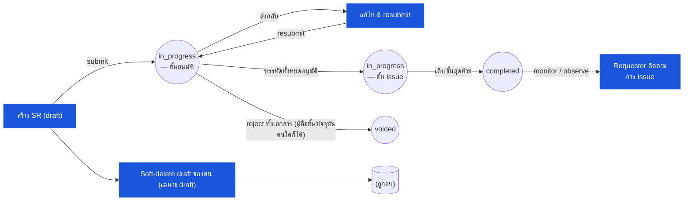

# ใบเบิกของสโตร์ (Store Requisition) — User Flow — Requester

> **At a Glance**
> **Persona:** Outlet Manager (สถานที่บริโภค) &nbsp;·&nbsp; **โมดูล:** [store-requisition](/th/inventory/store-requisition) &nbsp;·&nbsp; **ขั้น workflow:** draft → in_progress (แก้เมื่อ send-back) &nbsp;·&nbsp; **สิทธิ์สำคัญ:** สร้าง / แก้ / submit draft, soft-delete draft ของตน, แก้หลัง send-back
> ⚠️ **แก้ไขรอบนี้:** "ถอนที่ขั้นอนุมัติแรก" และข้อความเรื่อง SoD ด้านล่างไม่มีหลักฐานรองรับใน source ปัจจุบัน — ดู callout ในส่วนที่ 1
> **persona นี้ทำอะไร:** ตั้ง SR — เลือกต้นทาง/ปลายทาง (ประเภทการเคลื่อนย้ายถูก derive), เพิ่มบรรทัดพร้อม requested_qty, submit เพื่อขออนุมัติ (ตอบ prompt วันที่ open-period เมื่อถูกถาม) และแก้ตอน send-back
> **Re-sync 2026-09-22:** ไม่มีตัวเลือก `sr_type` (derive ฝั่ง server), `sr_no`/`sr_date` ถูกกำหนดขั้นสุดท้ายตอน submit, แผนก derive จาก requester, ไม่มีการตรวจความพร้อมต้นทางตอน submit, Submit ใช้ได้บนฟอร์มที่ยังไม่บันทึก, Duplicate, ลบเดี่ยว/batch เฉพาะเจ้าของ, ไม่มี auto-save

## 1. บทบาทในโมดูลนี้

Persona **Requester** คือ **Outlet Manager** (ครัว บาร์ แบงเควต ภัตตาคาร) — คนที่สถานที่บริโภคที่ระบุความต้องการสต๊อกและตั้ง requisition กับคลังต้นทางหรือสโตร์กลาง Requester เป็นเจ้าของ `draft` ที่แก้ไขได้: เลือกสถานที่ต้นทางและเอาท์เลตปลายทาง เห็นประเภทการเคลื่อนย้ายที่ derive จากปลายทาง (`sr_type = issue` เมื่อปลายทางเป็น `direct`, `transfer` ในกรณีอื่น — `deriveSrType()` แสดงเป็น label แบบอ่านอย่างเดียว) เพิ่มบรรทัดสินค้าพร้อม `requested_qty` และวันที่ต้องการ (`expected_date`) แนบโน้ตประกอบ (snapshot recipe demand, รายละเอียด banquet event, เหตุผล par-level) และ submit เอกสารเพื่อขออนุมัติ ตอน entry requester ล็อกอินด้วยสิทธิ์ create-SR และมี SR workflow อย่างน้อยหนึ่งตัวที่ขั้นแรกอนุญาตให้ create (`CreateWorkflowGate` บน `/new`); แผนกถูกเอาจากสมาชิกภาพ `tb_department_user` ของ requester (ฟอร์มไม่มีตัวเลือกแผนก — `resolveRequesterDepartment()`) และสถานที่ถูกจำกัดเฉพาะที่ผู้ใช้ถูก assign (`tb_location_user`) สถานะ SR ที่ persona นี้เป็นเจ้าของคือ `draft` (สิทธิ์แก้เต็ม รวมถึง soft-delete/ถอน — ยืนยันว่าจำกัดเฉพาะ `draft` เท่านั้น) และส่วนเล็ก ๆ ของ `in_progress` — requester สามารถแก้ / resubmit เมื่อผู้ถือขั้น workflow ปัจจุบันส่งเอกสารกลับมาแก้ไข (ขั้น requester ถูกเข้าใหม่ผ่าน workflow) **แก้ไขรอบนี้:** ไม่มี action ที่ยืนยันได้ให้ requester ถอน SR ที่ submit แล้ว (`in_progress`) — `store-requisition.service.ts` ไม่มี endpoint `cancel`/`withdraw` เลย มีแต่ soft-delete เฉพาะ `draft` เท่านั้น ข้อความที่ว่า "segregation of duties ห้าม requester อนุมัติ SR ของตนเอง" (`SR_AUTH_011`) ก็ยังไม่ยืนยันเช่นกัน — ไม่พบการ cross-check `requestor_id` ที่ approve action ใน source ปัจจุบัน

### ตำแหน่งใน workflow (Requester เน้นสี)

```mermaid
graph LR
    create["สร้าง SR (draft)"]:::current -->|"submit"| approval(("in_progress\n— ขั้นอนุมัติ"))
    approval -->|"ส่งกลับ"| amend["แก้ไข & resubmit"]:::current
    amend -->|"resubmit"| approval
    approval -->|"บรรทัดทั้งหมดอนุมัติ"| fulfil(("in_progress\n— ขั้น issue"))
    fulfil -->|"เดินขั้นสุดท้าย"| completed(("completed"))
    approval -->|"reject ทั้งเอกสาร (ผู้ถือขั้นปัจจุบันคนใดก็ได้)"| voided(("voided"))
    draft_delete["Soft-delete draft ของตน (เฉพาะ draft)"]:::current --> deleted[("(ถูกลบ)")]
    create --> draft_delete
    completed -.->|"monitor / observe"| observer["Requester ติดตาม\nการ issue"]:::current
    classDef current fill:#1a56db,color:#fff,stroke:#1a56db;
```

### ตารางสิทธิ์ — V1 Status × Action (Requester)

Requester มีสิทธิ์แก้เต็มที่ `draft` และเข้า `in_progress` อีกครั้งเฉพาะเมื่อผู้ถือขั้น workflow ปัจจุบันส่งเอกสารกลับมาแก้ไข ข้อความที่ว่า segregation of duties ห้าม Requester อนุมัติ SR ของตน (`SR_AUTH_011`) ยังคง **ไม่ยืนยัน** — ไม่พบ check ดังกล่าวใน `store-requisition.service.ts`

| Action | `draft` | `in_progress` (เฉพาะ send-back) | `completed` | `voided` |
|---|---|---|---|---|
| สร้าง SR | ✅ (`SR_AUTH_001`) | — | — | — |
| แก้ส่วนหัว (สถานที่, วันที่, description, dimension) | ✅ (`SR_AUTH_002`) | ✅ เฉพาะ send-back | ❌ | ❌ |
| เพิ่ม / แก้ / ลบบรรทัด (`requested_qty`) | ✅ (`SR_AUTH_002`) | ✅ เฉพาะ send-back | ❌ | ❌ |
| แนบหลักฐานประกอบ (comment / attachments) | ✅ | ✅ | ❌ | ❌ |
| Submit เพื่อขออนุมัติ (`draft → in_progress`) | ✅ (`SR_AUTH_003`) | — | — | — |
| Resubmit หลัง send-back | — | ✅ (`SR_AUTH_003`) | — | — |
| Soft-delete draft ของตน (เส้นทางถอนที่ยืนยันได้เพียงเส้นทางเดียว; เจ้าของเท่านั้น เดี่ยวหรือ batch จากหน้า list) | ✅ (`SR_AUTH_004`) | ❌ — ไม่มี action ถอนที่ `in_progress` ที่ยืนยันได้ | ❌ | — |
| Duplicate (โหมด view → `/new?duplicate_id=`) | ✅ | ✅ | ✅ | ✅ |
| ดู SR (อ่านอย่างเดียว) | ✅ | ✅ | ✅ | ✅ |
| อนุมัติ SR ของตน | ไม่ยืนยันว่าถูก block — ไม่พบ SoD check ในโค้ด | ไม่ยืนยัน | — | — |

> ℹ️ **Loop ของ send-back:** เมื่อ Approver ส่ง SR กลับเพื่อแก้ไข SR ยังคงที่ `doc_status = in_progress` แต่ `workflow_current_stage` กลับไปขั้น requester Requester แก้และ resubmit; บรรทัดที่อนุมัติแล้วไม่ถูก reverse

## 2. จุดเข้าและ Flow หลัก

**จุดเข้า:** สามเส้นทางในการสร้าง draft

- **โมดูล SR → New** — เลือก workflow, สถานที่ต้นทาง และสถานที่ปลายทาง (lookup ปลายทางตัดต้นทางที่เลือกออก); label ประเภทการเคลื่อนย้ายอัปเดตจาก `location_type` ของปลายทาง; **Add Item** เปิดใช้เมื่อตั้ง workflow + สถานที่ทั้งสองแล้ว
- **Duplicate** — จากส่วนหัวโหมด view ของ SR ที่บันทึกแล้ว (`/new?duplicate_id=<id>`): ส่วนหัวและบรรทัดถูกเติมไว้ล่วงหน้า ฟอร์ม dirty ตั้งแต่ต้น และการบันทึกสร้าง draft ใหม่
- **Stock Replenishment wizard** — `POST .../stock-replenishment/sr` สร้าง draft หนึ่งใบต่อคู่ `(source, destination)`; requester หาเจอในหน้า list และดำเนินต่อจาก step 7
- **แก้ SR ที่ถูกส่งกลับ (send-back จาก approver)** — approver route เอกสารกลับมาขั้น requester พร้อม `review_message` ต่อบรรทัด; requester เข้าขั้น workflow เดียวกับที่ตนเริ่ม แก้ปริมาณ / โน้ต และ resubmit

**Flow หลัก (เส้นทาง happy path, 10 ขั้น):**

1. **ระบุความต้องการ** review par level ของเอาท์เลต ตารางผลิตที่จะถึง (recipe demand, ใบ event banquet) จุด stock-out ที่ทราบ และ on-hand ที่เอาท์เลต ตัดสินใจสถานที่ต้นทาง (โดยทั่วไปคือสโตร์กลาง) และปลายทาง (เอาท์เลตของ requester เองสำหรับ `issue` หรือสโตร์ inventory อีกแห่งสำหรับ `transfer`)
2. **เปิดโมดูล SR → New** ไม่มีสิ่งใดถูกเขียนจนกว่าจะ **Save** (หรือ **Submit** ซึ่งบันทึกก่อน) ตอนบันทึกระบบเขียน `tb_store_requisition` ที่ `doc_status = draft` พร้อม placeholder `sr_no = draft-<hex>`; `requestor_id` default เป็นผู้ใช้ที่ล็อกอิน และ `department_id` ถูกบังคับโดย create DTO (client ส่งแผนกของผู้ใช้)
3. **เลือกสถานที่ต้นทางและปลายทาง** ต้นทางคือ `from_location_id` (ต้องเป็น `inventory` หรือ `consignment` — ต้นทางแบบ `direct` ถูกปฏิเสธตอนบันทึก); ปลายทางคือ `to_location_id` ซึ่ง `location_type` เป็นตัวตัดสิน `sr_type` (`direct` → `issue`, อื่น ๆ → `transfer`) ไม่มีตัวเลือกประเภทการเคลื่อนย้ายและไม่มี compatibility error (`SR_VAL_003`)
4. **ป้อนรายละเอียดส่วนหัว** `sr_date` (default เป็นวันนี้ — เป็นเพียง placeholder จนกว่าจะ submit), `expected_date` (ฟอร์มบังคับ ต้องเป็นวันเดียวกับหรือหลัง `sr_date`), `description` และ JSON `dimension` cost-dimension ถ้าเอาท์เลตแยกข้าม cost-centre หลายตัว
5. **เพิ่มรายการสินค้า** ค้นหา product catalog ด้วยชื่อ รหัส หรือหมวด; เลือกสินค้า หน้าจอแสดงบล็อก enrichment เฉพาะ UI ที่แสดง on-hand ปัจจุบันที่ต้นทาง, on-order, last price, last vendor และหมวด / barcode ของสินค้า (สิ่งเหล่านี้ **ไม่** ถูกเก็บบนบรรทัด SR — ดู [store-requisition/01-data-model](/th/inventory/store-requisition/01-data-model) § 5 ข้อ 5) ป้อน `requested_qty` (รับทศนิยม; หน่วยแสดงหลังปริมาณ) — ยอดรวมบรรทัดถูกดึงจาก costing endpoint (`sr-item-cost-sync.tsx`) เพื่อแสดงผลเท่านั้น แต่ละบรรทัดเขียนหนึ่งแถวใน `tb_store_requisition_detail` ทำซ้ำสำหรับแต่ละสินค้าที่ต้องการ
6. **แยกบรรทัดตาม cost-dimension ถ้าจำเป็น** สินค้าเดียวบน SR เดียวกันที่จัดสรร cost-dimension สองแบบต่างกัน (เช่น 60% ไป Banquet, 40% ไป A-la-carte) ถูก model เป็นสองบรรทัดแยก แต่ละบรรทัดมี JSON `dimension` ของตน (ตาม unique index `SRT1_*`) product+dimension เหมือนกันเป็น duplicate (`SR_VAL_007`)
7. **แนบหลักฐานประกอบ** Snapshot recipe demand, ใบ event, รูป, การวิเคราะห์ par-level, เมโม pre-clearance อนุมัติ Attachments scope กับส่วนหัว SR (ผ่าน `tb_store_requisition_comment.attachments`) หรือกับบรรทัดเฉพาะ (ผ่าน `tb_store_requisition_detail_comment.attachments`)
8. **review ก่อน submit** dialog **Inventory Information** ต่อแถว (คลิก ไม่ใช่ hover) แสดง On Hand / On Order / Re-order / Re-stock ที่ต้นทาง — เป็นข้อมูลประกอบเท่านั้น; **ไม่มีการตรวจความพร้อมต้นทางตอน submit** (`SR_VAL_009` ยังไม่ยืนยัน) สิ่งที่ *ถูก* ตรวจตอน submit: ทุกสินค้าต้องถูกเปิดใช้ที่สถานที่ปลายทาง (`SR_VAL_015`) และฟอร์มต้องครบ (ฟอร์มที่ไม่ครบแสดง toast และกระโดดไปยังฟิลด์แทนที่จะเปิด dialog ยืนยัน)
9. **Submit เพื่อขออนุมัติ** คลิก **Submit** ใน footer (ใช้ได้แม้บนฟอร์มใหม่ที่ยังไม่บันทึก — client สร้าง draft แล้วเรียก `PATCH .../submit`) backend derive แผนกหากขาด, run `ValidateSRBeforeSubmitSchema` และการตรวจสินค้าที่ปลายทาง, freeze `sr_date` — ถ้าวันนี้อยู่นอกทุก open period client ได้รับ `SR_DATE_PATTERN_REQUIRED` และแสดง dialog สองปุ่ม (**วันที่ใน open period** / **วันนี้**) แล้ว retry พร้อม `sr_date_pattern` — ออก `sr_no` จริง, ตั้ง `doc_status = in_progress`, ตั้งค่าเริ่มต้น `approved_qty = requested_qty` ทุกบรรทัด, ก้าว workflow ไปขั้นแรกและบรรจุ `user_action.execute`, เขียน `workflow_history` และ `history` ต่อบรรทัด และส่ง submit notification เอกสารไม่สามารถแก้จากมือ requester ได้อีก (ยกเว้นผ่าน send-back)
10. **ติดตามสถานะจนกระทั่งรับ** Requester ตรวจสอบความคืบหน้า: การตัดสินใจของ approver กลับมาเป็น send-back (กลับไปขั้น requester) หรือเดินต่อ (workflow ก้าวไปขั้น fulfilment); ตอน commit requester ถูกแจ้งว่าสินค้าถูก issue และอยู่ระหว่างทาง Requester **ไม่** รับที่ปลายทางโดยตรง — ปัจจุบันไม่มี persona "Receiver" หรือกลไก flag ความคลาดเคลื่อนที่ยืนยันได้ใน source (ดู [03-user-flow-receiver.md](./03-user-flow-receiver.md)) ดังนั้นการติดตามหลัง commit ในวันนี้จึงเป็นแบบไม่เป็นทางการ

## 3. Branch การตัดสินใจ

- **On-hand ต้นทางต่ำกว่าที่ขอ** — ไม่มีสิ่งใด block การ submit (`SR_VAL_009` ยังไม่ยืนยัน) requester เห็น on-hand ได้ใน dialog Inventory Information และตัดลงเองโดยสมัครใจ; มิฉะนั้น approver ตัด หรือขั้น issue ล้มเหลวด้วย `Insufficient stock` (`SR_VAL_013`)
- **สินค้าไม่ได้เปิดใช้ที่ปลายทาง** — submit ถูกปฏิเสธด้วย `The following products are not allowed in the destination location: <names>` (`SR_VAL_015`); ลบบรรทัดออกหรือให้เปิดใช้สินค้าใน product-location list ของปลายทาง
- **วันนี้อยู่นอกทุก inventory period ที่เปิด** — dialog date-pattern ปรากฏ (`SR_DATE_PATTERN_REQUIRED`) เลือก *open-period* ลงวันที่ SR เป็นวันสุดท้ายของ open period ปัจจุบัน (จึง issue ได้ทันที); เลือก *today* ลงวันที่ใน period ที่ยังไม่เปิด — ขั้น issue จะปฏิเสธด้วย `SR_DATE_OUTSIDE_OPEN_PERIOD` จนกว่า period นั้นจะเปิด ถ้าไม่มี period ใดเปิดเลย: `SR_NO_OPEN_PERIOD`
- **Requester อยู่ในหลายแผนก** — `SR_DEPARTMENT_AMBIGUOUS` (422) ตอน submit เมื่อ draft ไม่มีแผนก; client ต้องส่ง `department_id`
- **แยกการจัดสรร cost-dimension**: สินค้าเดียวกันถูกขอด้วย cost-centre split สองแบบ (เช่น 60/40 ระหว่าง Banquet และ A-la-carte) Requester เพิ่มสองบรรทัดสำหรับ `product_id` เดียวกัน แต่ละบรรทัดมี JSON `dimension` ของตน (ตาม unique index `SRT1_*`) สองบรรทัดไหลอย่างอิสระผ่านการอนุมัติและ fulfilment
- **SR ฉุกเฉิน / นอกรอบ**: เอาท์เลตมีความต้องการทันทีนอกรอบ replenishment รายสัปดาห์ Requester ตั้ง SR ด้วย `description` flag เป็น emergency, ตั้ง `expected_date` เป็นวันนี้ / พรุ่งนี้ และอาจแนบเมโมเหตุผลฉุกเฉิน; approver และ fulfiller เห็น flag เร่งด่วนใน queue ของตน ไม่มีคอลัมน์ `emergency_flag` แยกบน schema — ความเร่งด่วนสื่อสารผ่าน `description` และ extension `info`; workflow อาจมี routing ขั้นฉุกเฉินใน config ของ tenant
- **Send-back จาก approver**: Approver route SR กลับขั้น requester พร้อม `review_message` ต่อบรรทัดที่กระทบ Requester เห็นเอกสารใน queue ของตนที่ `doc_status = in_progress` แต่ที่ขั้น workflow requester; อาจแก้ `requested_qty` หรือ `description`, ตอบโน้ตของ reviewer และ resubmit (ซึ่ง re-route เอกสารไปขั้นอนุมัติ) หมายเหตุ: requester ไม่สามารถข้าม send-back ที่ active — ต้องตอบ
- **ถอน SR ของตน** — ไม่มี action ให้ถอน SR ที่ submit แล้ว (`in_progress`) เส้นทางถอนก่อน submit มีเพียง soft-delete ของ `draft` — อนุญาตเฉพาะเจ้าของ (มิฉะนั้น `SR_DELETE_FORBIDDEN`) ทีละใบจากเอกสารหรือหลายใบจากหน้า list (`DELETE .../batch` แบบ all-or-nothing) เมื่อ submit แล้ว requester ต้องขอให้ผู้ถือขั้นปัจจุบัน reject ทั้งเอกสาร (ซึ่งตั้งเป็น `voided` ไม่ใช่ `cancelled`)
- **ออกจากฟอร์มโดยมีการเปลี่ยนแปลงที่ยังไม่บันทึก** — ไม่มี auto-save; `useNavigationGuard` แสดง dialog *Discard changes?* (**Keep editing** / **Discard**)

## 4. จุดออก / Handoff

การมีส่วนร่วมของ Requester บน SR ที่กำหนดจบที่ขอบเขตที่ยืนยันได้หนึ่งในสาม:

- **Submit สำเร็จ** — handoff ไปยังผู้ถือขั้น workflow แรก เอกสารเป็น `in_progress` แล้ว; requester อยู่ในโหมด monitor-only จนกว่า send-back จะ route เอกสารกลับหรือ workflow จะเดินต่อ
- **ได้รับ send-back** — handoff ชั่วคราว **กลับมา Requester** ที่ขั้น workflow requester Requester ตอบ `review_message` แก้ตามต้องการ และ resubmit นี่เป็น loop ภายใน `in_progress` ไม่ใช่การเปลี่ยนสถานะ
- **Reject ทั้งเอกสาร** — `in_progress → voided` (ไม่ใช่ `cancelled` — ดู note แก้ไขในส่วนที่ 1); เอกสารจบ; requester อาจตั้ง SR ใหม่ถ้าความต้องการยังคงอยู่

หลังการเดินขั้น workflow สุดท้ายเสร็จสิ้นและ SR เป็น `completed` บทบาทของ Requester คือติดตามให้สินค้ามาถึง — ปัจจุบันไม่มี persona "Receiver" หรือกลไก flag ความคลาดเคลื่อนที่ยืนยันได้ใน source (ดู [03-user-flow-receiver.md](./03-user-flow-receiver.md)) ดังนั้นการยืนยันหลัง commit ในวันนี้จึงเป็นแบบไม่เป็นทางการ

## 5. แหล่งอ้างอิง

- ภาพรวมแม่: [03-user-flow.md](./03-user-flow.md) — วงจรชีวิตที่แก้ไขแล้วบน `enum_doc_status` (`draft / in_progress / completed` บวก `voided` เป็นเส้นทางยกเลิกเดียวที่ยืนยันได้ — `cancelled` นิยามใน enum แต่ไม่มีทางไปถึง), state machine ส่วนกลางที่เส้นทางของ persona นี้ผ่าน และตาราง handoff ข้าม persona
- `../carmen/docs/store-requisitions/SR-User-Experience.md` § Creating a Store Requisition — แหล่ง carmen/docs สำหรับ requester (ชื่อ "Alex Chen, Store Manager" ในเรื่องเล่า persona); ขั้น journey map ไปยังส่วนที่ 2 ข้างบน
- `../carmen/docs/store-requisitions/SR-Overview.md` § User Roles → แถว Requester — แหล่ง carmen/docs สำหรับขอบเขตความรับผิดชอบของ persona
- `../carmen/docs/store-requisitions/Store Requisitions.md` § UC-68 (Create and Manage Store Requisition) — scenario สำเร็จหลักของ use-case create / submit
- Sibling: [03-user-flow-approver.md](./03-user-flow-approver.md) — persona ปลายน้ำที่รับ SR หลัง submit; จัดการการตัดสินใจ approve / trim / reject / send-back
- Sibling: [03-user-flow-fulfiller.md](./03-user-flow-fulfiller.md) — persona issuance; ผลของ Requester ต่อสินค้าขึ้นกับ `issued_qty` ที่บันทึกที่นั่น
- Sibling: [03-user-flow-receiver.md](./03-user-flow-receiver.md) — แก้ไขรอบนี้เพื่อบันทึกว่าไม่พบ persona Receiver แยกใน source ปัจจุบัน
- Sibling: [03-user-flow-audit-config.md](./03-user-flow-audit-config.md) — แก้ไขรอบนี้; ส่วนใหญ่ของ workspace การกำกับดูแล/config ที่เคยบรรยายไว้ไม่พบใน source ปัจจุบัน
- Sibling: [01-data-model.md](./01-data-model.md) — canonical `enum_doc_status`, `enum_sr_type` และคอลัมน์ `tb_store_requisition_detail` ที่ requester เขียน (`product_id`, `requested_qty`, `dimension`)
- Sibling: [02-business-rules.md](./02-business-rules.md) — `SR_VAL_005`, `SR_VAL_014`–`SR_VAL_016` (gate ตอน submit ที่ requester เผชิญ), `SR_AUTH_001`–`SR_AUTH_004` (ขอบเขตอำนาจที่ยืนยันได้ของ requester), `SR_POST_002`, `SR_POST_011` (soft-delete เฉพาะเจ้าของ)
- Related: [stock-replenishment](/th/inventory/store-requisition/stock-replenishment) — เส้นทาง auto-create เดียวที่ยืนยันได้ (`POST .../stock-replenishment/sr`)
- Related: [inventory](/th/inventory/inventory) — การมองเห็น on-hand ต้นทางตอนป้อนบรรทัด (enrichment เฉพาะ UI ไม่ persist บนบรรทัด SR) และการเขียน inventory-transaction ปลายน้ำที่ SR trigger ตอน commit
