# ใบเบิกของสโตร์ (Store Requisition) — User Flow

> **At a Glance**
> **โมดูล:** [store-requisition](/th/inventory/store-requisition) &nbsp;·&nbsp; **Persona:** Requester &nbsp;·&nbsp; Approver &nbsp;·&nbsp; Fulfiller &nbsp;·&nbsp; Receiver &nbsp;·&nbsp; Audit / Config
> **วงจรชีวิต workflow:** Draft → In Progress (ขั้นย่อยอนุมัติ + fulfillment) → Completed (พร้อม branch Cancelled / Voided)
> **เจาะลึก view ต่อ persona ด้านล่างสำหรับรายละเอียดระดับ action**

## 1. ภาพรวม

หน้านี้คือ **จุดเริ่มต้นภาพรวม** สำหรับชุด user-flow ของโมดูล `store-requisition` Store Requisition (SR) คือเอกสารที่บันทึก **การเคลื่อนย้ายสต๊อกภายในระหว่างสถานที่** — แถวส่วนหัวใน `tb_store_requisition` ร่วมกับบรรทัด `tb_store_requisition_detail` หนึ่งบรรทัดขึ้นไป SR อาจเป็น *การดึงเพื่อบริโภค* (`sr_type = issue`, สต๊อกออกจาก inventory และตกเป็น expense บน cost-centre ของเอาท์เลตปลายทาง) หรือ *การโอน inventory* (`sr_type = transfer`, สต๊อกเคลื่อนระหว่างสองสถานที่ที่ถือ inventory) SR คือ **system of record สำหรับการเคลื่อนย้ายสต๊อกภายใน**: จนกว่าจะ commit ไม่มีการลด inventory ที่ต้นทางและไม่มี expense / inventory entry ที่ปลายทาง; เมื่อ commit แล้ว on-hand ต้นทางลดลง ปลายทางได้รับสต๊อกหรือดูดต้นทุน และ inventory transactions (พร้อมข้อมูล lot, expiry และ cost-layer) ถูกเขียนผ่าน `tb_inventory_transaction` ที่ลิงก์

ส่วนที่ 2 ด้านล่างคือ **state machine ส่วนกลาง** — รายการ canonical ของ transition ที่ถูกกฎหมายข้ามห้าค่าของ `enum_doc_status` (`draft`, `in_progress`, `completed`, `cancelled`, `voided`) โดยไม่ขึ้นกับว่าใครเป็นผู้กระทำ ไฟล์ต่อ persona แต่ละไฟล์ (ลิงก์จากส่วนที่ 3) บรรยายเส้นทางของ persona นั้น *ผ่าน* state machine — จุดเข้า, action ที่พร้อมใช้, branch การตัดสินใจที่เผชิญ และ handoff ที่จบบทบาท ส่วนที่ 4 สรุป handoff ข้าม persona ที่ร้อยเส้นทางแต่ละเส้นเข้าด้วยกัน อ่านภาพรวมนี้ก่อนเพื่อยึดวงจรชีวิต จากนั้นเจาะลึกไปยังไฟล์ persona ที่ตรงกับ role ของคุณ

หมายเหตุเรื่องขั้น workflow: ต่างจาก GRN ที่ approval และ fulfillment เป็นสถานะส่วนหัวแยก SR ยุบทั้งสองช่วงภายใต้ค่า `in_progress` เดียว ฟิลด์ `workflow_current_stage` คือสิ่งที่แยก "รอผู้อนุมัติ" "รอ fulfiller" และ "รอ receiver ยืนยัน" ดังนั้น state machine ในส่วนที่ 2 ระบุเฉพาะการย้าย `doc_status` ที่ถูกกฎหมาย; การเดินขั้น intra-`in_progress` (approve, send-back, route ไปยัง fulfiller) เป็น workflow-internal และไม่เปลี่ยน `doc_status`

## 2. วงจรชีวิตเอกสาร

สถานะเอกสาร SR ถูกเก็บบน `tb_store_requisition.doc_status` และจำกัดที่ห้าค่าที่ประกาศใน `enum_doc_status` ร่วม: `draft` (สถานะเริ่มต้นที่แก้ไขได้ ไม่กระทบสต๊อกหรือ GL ป้อนบรรทัดโดย requester), `in_progress` (submit แล้วและอยู่ภายใต้ workflow control — ช่วง approval + fulfillment อยู่ที่นี่; ยังไม่กระทบสต๊อกหรือ GL จนกว่าจะ commit), `completed` (posting event ครั้งเดียวได้ fire แล้ว — inventory ลดที่ต้นทาง, cost-layer consume, ปลายทางรับสต๊อกหรือ expense, เอกสารล็อก), `cancelled` (การถอนที่ user เริ่ม หรือการย้ายอัตโนมัติเมื่อทุกบรรทัดถูก reject; ไม่กระทบสต๊อกหรือ GL) และ `voided` (การยกเลิกเชิงบริหารโดยไม่กระทบสต๊อกหรือ GL) Transitions ด้านล่างครอบคลุมการย้ายที่ถูกกฎหมายระหว่างกัน; อย่างอื่นถูก reject โดย workflow engine ผลกระทบปลายน้ำ (ลด on-hand ต้นทาง, เพิ่ม on-hand ปลายทางสำหรับ `transfer`, เขียน journal-entry) fire บน transition `in_progress → completed` เท่านั้น — ดู [02-business-rules.md](./02-business-rules.md) Section 5 สำหรับกฎ posting

```mermaid
stateDiagram-v2
    [*] --> draft: สร้าง (Requester — manual หรือ auto-create จาก recipe)
    draft --> in_progress: submit (Requester — SR_VAL_001–009 ผ่าน)
    draft --> cancelled: ถอน / ยกเลิก (Requester — draft ของตน)
    draft --> voided: void เชิงบริหาร (Inventory Controller / Sysadmin)
    in_progress --> in_progress: approve / ตัด / reject บรรทัด (Approver — workflow-internal)
    in_progress --> in_progress: ส่งกลับเพื่อแก้ไข (Approver → ขั้น Requester)
    in_progress --> completed: commit issued_qty (Fulfiller — Variant A auto-complete · Variants B/C ระบุ)
    in_progress --> cancelled: ทุกบรรทัดถูก reject / requester ถอนที่ขั้นแรก
    in_progress --> voided: void เชิงบริหาร (Inventory Controller / Sysadmin)
    completed --> completed: flag ความคลาดเคลื่อน (Receiver — ไม่เปลี่ยนสถานะ; SR_POST_013)
    completed --> [*]
    cancelled --> [*]
    voided --> [*]

    note right of in_progress
        Variant A (INV→INV / sr_type=transfer): Issue = Complete, auto-complete
        Variant B (INV→DIR / sr_type=issue): Fulfiller ระบุ Complete
        Variant C (INV→CONS / sr_type=issue): Fulfiller ระบุ Complete
        Sub-stage ติดตามผ่าน workflow_current_stage ไม่ใช่ doc_status
    end note
```

> ℹ️ **หมายเหตุ — ขั้น intra-`in_progress`:** self-loop ของ `in_progress` ครอบคลุม sub-stage ของ workflow สองขั้นที่ต่างกัน — ช่วงอนุมัติและช่วง fulfillment — ทั้งคู่ใช้ `doc_status` เดียวกัน sub-stage จริงติดตามผ่าน `tb_store_requisition.workflow_current_stage` สำหรับ Variant A (โอน INV → INV) ขั้น fulfillment (Issue) และ completion ถูกยุบเป็น transition เดียวอัตโนมัติ; Variant B และ C ต้องการ action Complete ที่ระบุชัดโดย Fulfiller

| จากสถานะ | Action | ไปสถานะ | อนุญาตให้ | เงื่อนไขล่วงหน้า |
| -------- | ------ | -------- | --------- | ----------------- |
| `(none)` | สร้าง | `draft` | Requester | Requester เป็นสมาชิก `department_id`; อนุญาตให้ทำธุรกรรมระหว่าง `from_location_id` และ `to_location_id`; `sr_no` กำหนดตามนโยบายเลขของ tenant ส่วนหัวอาจป้อนบางส่วน; บรรทัดอาจว่าง |
| `(none)` | auto-create จาก recipe demand | `draft` | System (cross-ref [recipe](/th/inventory/recipe)) | โมดูล recipe คำนวณปริมาณวัตถุดิบสำหรับ event production / banquet ของเอาท์เลตปลายทางและ post SR `draft` ให้ requester ของเอาท์เลต review และ submit `info.recipe_id` มี back-reference |
| `draft` | แก้ไข / save | `draft` | Requester (เจ้าของ) | กฎ validation ส่วนหัวและบรรทัดใน [02-business-rules.md](./02-business-rules.md) Section 2 ผ่านตอน save (warn-only บางส่วน) หรือ block ตอน submit; เอกสารยังแก้ไขได้ |
| `draft` | submit | `in_progress` | Requester (เจ้าของ) | กฎตอน submit ทั้งหมดผ่าน (`SR_VAL_001`–`SR_VAL_009`): สถานที่ต้นทาง / ปลายทางตั้งและเข้ากันกับ `sr_type`, source-availability check ผ่าน (ตาม tenant config: hard block หรือ soft warn), อย่างน้อยหนึ่งบรรทัดที่ `requested_qty > 0` Workflow engine จัดเส้นทางไปยังขั้นอนุมัติแรกและบรรจุ `user_action.execute` |
| `draft` | ถอน / ยกเลิก | `cancelled` | Requester (draft ของตน) | ต้องการเหตุผล; ไม่กระทบสต๊อกหรือ GL; เอกสารจบ |
| `draft` | void (เชิงบริหาร) | `voided` | Inventory Controller, System Administrator | ต้องการเหตุผล; ไม่กระทบสต๊อกหรือ GL; เอกสารจบ |
| `in_progress` | approve บรรทัด (workflow-internal) | `in_progress` | Approver ที่ขั้นปัจจุบัน | Approver อยู่ใน `user_action.execute` สำหรับ `workflow_current_stage`; `approved_qty ≤ requested_qty` ตาม `SR_VAL_010`; SoD check `requester ≠ approver` ตาม `SR_AUTH_011` `workflow_current_stage` เดินต่อเมื่อบรรทัดทั้งหมดที่ขั้นปัจจุบันถูก action |
| `in_progress` | reject บรรทัด / send back (workflow-internal) | `in_progress` | Approver ที่ขั้นปัจจุบัน | Reject ต่อบรรทัดตั้ง `approved_qty = 0` และต้องการ `reject_message`; send-back ส่งเอกสารกลับขั้นก่อนหน้า (โดยทั่วไปคือ requester) พร้อม `review_message` ถ้าบรรทัด active ทั้งหมดถูก reject (`Σ approved_qty = 0`) เอกสารย้ายอัตโนมัติเป็น `cancelled` |
| `in_progress` | requester ถอนที่ขั้นอนุมัติแรก | `cancelled` | Requester (SR ของตน) | อนุญาตเฉพาะเมื่อ workflow ยังอยู่ที่ขั้นอนุมัติแรกและยังไม่มีผู้อนุมัติกระทำ เกินจุดนั้น เฉพาะผู้อนุมัติเท่านั้นที่ reject SR ได้ ต้องการเหตุผล |
| `in_progress` | บันทึก `issued_qty` + commit | `completed` | Fulfiller ที่ขั้น fulfillment | กฎตอน commit ทั้งหมดผ่าน (`SR_VAL_011`–`SR_VAL_014`): อย่างน้อยหนึ่งบรรทัดที่ `approved_qty > 0`, ข้อมูล lot บน inventory transactions สำหรับสินค้าควบคุม lot, on-hand ต้นทางครอบคลุมทุก `issued_qty`, วันที่ post อยู่ในงวดเปิด SoD check `approver ≠ fulfiller` ตาม `SR_AUTH_012` **Trigger การลด on-hand ต้นทาง, การ consume cost-layer, การเพิ่ม on-hand ปลายทาง (สำหรับ `transfer`) หรือ debit cost-centre ปลายทาง (สำหรับ `issue`), เขียน journal-entry** |
| `in_progress` | void (เชิงบริหาร) | `voided` | Inventory Controller, System Administrator | ต้องการเหตุผล; ไม่กระทบสต๊อกหรือ GL (SR ไม่เคย post) ต่างจาก `cancelled` — `voided` เป็นเส้นทาง audit / เชิงบริหาร |
| `completed` | flag ความคลาดเคลื่อนหลัง commit (ไม่เปลี่ยนสถานะ) | `completed` | Receiver | Receiver เพิ่ม comment ความคลาดเคลื่อน ("received less than issued", "wrong lot"); flag เขียน system comment แต่ **ไม่** ย้าย `doc_status` Resolution ผ่าน `[inventory-adjustment](/th/inventory/inventory-adjustment)` |
| `completed` | (ไม่มี transition สถานะต่อ) | `completed` | — | จุดสิ้นสุดของเส้นทาง fulfillment การแก้ไขต้องผ่าน compensating adjustment ใน `[inventory-adjustment](/th/inventory/inventory-adjustment)`; SR เองยังคงล็อก |
| `cancelled` | (ไม่มี action ต่อ) | `cancelled` | — | จุดสิ้นสุด เอกสารที่ยกเลิกถูกเก็บไว้สำหรับ audit; คำขอถัดไปต้องตั้งเป็น SR ใหม่ |
| `voided` | (ไม่มี action ต่อ) | `voided` | — | จุดสิ้นสุด เก็บไว้สำหรับ audit |

## 3. ดัชนี Persona

แต่ละ persona ด้านล่างมีไฟล์เจาะลึกแยกที่บรรยายจุดเข้า flow หลัก branch การตัดสินใจ และจุดออก slug ตรงกับ role ของ persona; การคลิก link เปิด view ต่อ persona การจัดกลุ่มห้า persona ยุบหก persona ของ carmen/docs (Store Manager, Warehouse Supervisor, Department Head, Finance Manager, Inventory Controller, System Administrator + Auditor) เป็นห้า role เชิงปฏิบัติการ

- [Requester](./03-user-flow-requester.md) — Outlet Manager ที่ระบุความต้องการสต๊อกที่สถานที่บริโภค สร้าง SR เพิ่มรายการพร้อม `requested_qty` และวันที่ต้องการ แนบโน้ตประกอบ submit เอกสารเพื่อขออนุมัติ และติดตามสถานะจนถึงการรับที่เอาท์เลต
- [Approver](./03-user-flow-approver.md) — Department Head ที่ review คำขอที่ submit แล้วเทียบกับความจำเป็นเชิงปฏิบัติการ par level และความพร้อมต้นทาง; อนุมัติ ตัด `approved_qty` ลงจาก `requested_qty` reject บรรทัดพร้อมเหตุผล split คำขอ หรือส่งกลับเพื่อแก้ไข ลายเซ็นอนุมัติต่อบรรทัด persist โดยตรงบน `tb_store_requisition_detail`
- [Fulfiller](./03-user-flow-fulfiller.md) — Store Keeper ที่สถานที่ต้นทางที่รับคำขอที่อนุมัติแล้ว หยิบสินค้า บันทึก `issued_qty` ต่อบรรทัด (ซึ่งอาจน้อยกว่า `approved_qty` ถ้าสต๊อกขาดตอน issue) เลือก lot สำหรับสินค้าควบคุม lot commit การเคลื่อนย้ายสต๊อก และปล่อยสินค้า
- [Receiver](./03-user-flow-receiver.md) — ผู้แทนเอาท์เลตปลายทางที่ยืนยันการรับสินค้าที่ issue ออก flag ความคลาดเคลื่อนระหว่างปริมาณที่ issue กับที่รับ และปิด requisition จากมุมมองเอาท์เลต ไม่เปลี่ยน `doc_status` โดยตรงแต่ยก event ความคลาดเคลื่อนที่อาจ escalate ไปยัง inventory-adjustment
- [Audit / Config](./03-user-flow-audit-config.md) — Inventory Controller (variance review, period-end signoff, สิทธิ์ void เชิงบริหาร), Finance Team (ตรวจสอบการ map cost-centre / journal-entry, period close, การ reconcile food-cost) และ System Administrator + Auditor (RBAC, threshold อนุมัติ, การตั้งค่า workflow, การติดตามลายเซ็น / variance)

## 4. การ Handoff ข้าม Persona

ตารางด้านล่างจับช่วงเวลาที่ SR ย้ายจากความรับผิดชอบของ persona หนึ่งไปยังอีก persona Handoff แต่ละครั้ง anchor กับสถานะเอกสาร (และที่เกี่ยวข้องคือ `workflow_current_stage`) ที่จุดส่งต่อ

| จาก persona | Trigger | ไป persona | สถานะเอกสารตอน handoff |
| ----------- | ------- | ---------- | ---------------------- |
| Requester | submit เพื่ออนุมัติ | Approver | `in_progress` (ขั้นอนุมัติแรก; `user_action.execute` บรรจุด้วย approver ขั้นแรก) |
| Approver | ส่งกลับเพื่อแก้ไข | Requester | `in_progress` (workflow route กลับไปขั้น requester; `review_message` ต่อบรรทัดเขียน) |
| Approver | บรรทัดทั้งหมดอนุมัติที่ขั้นอนุมัติสุดท้าย | Fulfiller | `in_progress` (workflow ก้าวไปขั้น fulfillment; `user_action.execute` บรรจุด้วย fulfiller ที่สถานที่ต้นทาง) |
| Approver | บรรทัดทั้งหมดถูก reject (`Σ approved_qty = 0`) | (จุดสิ้นสุด — `cancelled`) | `cancelled` (การย้ายอัตโนมัติผ่าน `SR_POST_004` tail) |
| Fulfiller | บันทึก `issued_qty` และ commit | Receiver | `completed` (on-hand ต้นทางลด; on-hand ปลายทางเพิ่มสำหรับ `transfer` หรือ cost-centre ปลายทาง debit สำหรับ `issue`; ข้อมูล lot เขียนบน inventory transaction ที่ลิงก์) |
| Fulfiller | เจอ stock-out ตอน issue และ commit บางส่วน | Receiver, Inventory Controller | `completed` (พร้อม `issued_qty < approved_qty` ในหนึ่งบรรทัดขึ้นไป; `fulfilment_gap` บันทึก; system comment "could not fulfil — source stock-out") |
| Receiver | ยก flag ความคลาดเคลื่อนหลัง commit | Inventory Controller | `completed` (พร้อม comment ความคลาดเคลื่อน; resolution ผ่าน `[inventory-adjustment](/th/inventory/inventory-adjustment)`) |
| Inventory Controller | period-end variance review | Audit / Config (Finance Team) | (ไม่เปลี่ยนสถานะเอกสาร; variance dashboard roll up ต่อเอาท์เลต / ต่องวด) |
| Inventory Controller / Sysadmin | void ก่อน commit ด้วยเหตุผล audit | (จุดสิ้นสุด — `voided`) | `voided` (การยกเลิกเชิงบริหาร; ไม่กระทบสต๊อกหรือ GL; เอกสารจบ) |
| Recipe (auto-create) | คำนวณ recipe demand สำหรับ production / banquet | Requester | `draft` (pre-populate โดยโมดูล recipe; `info.recipe_id` มี back-reference) |

## 5. แหล่งอ้างอิง

- `../carmen/docs/store-requisitions/SR-User-Experience.md` — แหล่ง user-experience ของ carmen/docs: คำอธิบาย persona (Store Manager / Warehouse Supervisor / Department Head / Finance Manager), user journeys (Create / Approve / Process) และ legacy 6-state lifecycle diagram (`Draft → Submitted → UnderReview → Approved → InProcess → Fulfilled → Completed`) — โปรดทราบว่า diagram **ไม่** canonical ที่นี่; หน้านี้ตาม `enum_doc_status` 5 ค่าของ Prisma (`draft / in_progress / completed / cancelled / voided`)
- `../carmen/docs/store-requisitions/SR-Overview.md` — ภาพรวมโมดูลของ carmen/docs: วัตถุประสงค์ ขอบเขต กลุ่มผู้ใช้ จุด integration; วงจรชีวิตในส่วนที่ 2 และ handoff ในส่วนที่ 4 ปรับให้ตรงกับ enum Prisma ไม่ใช่กับ 5 สถานะ `In Process / Complete / Reject / Void / Draft` ของ Overview ซึ่งยุบเป็น enum Prisma ตามที่ระบุใน [01-data-model.md](./01-data-model.md) Section 5 ข้อ 1
- `../carmen/docs/store-requisitions/Store Requisitions.md` — Use cases UC-64 (Approve), UC-65 (Deny), UC-66 (Modify), UC-67 (Monitor), UC-68 (Create and Manage), UC-69 (Approve and Record Stock as Issued); ไฟล์ persona Requester, Approver และ Fulfiller ดึง flow หลักจากนี้
- Sibling: [01-data-model.md](./01-data-model.md) — canonical `enum_doc_status`, `enum_sr_type` และ three-quantity invariant (`requested_qty / approved_qty / issued_qty`) ที่อ้างถึงตลอดส่วนที่ 2
- Sibling: [02-business-rules.md](./02-business-rules.md) Section 5 — ผลกระทบ posting และ gate authorization ที่อ้างถึงโดยทุกแถวของส่วนที่ 2
- โมดูลที่เกี่ยวข้อง: [inventory](/th/inventory/inventory) (ปลายน้ำ — ตอน commit on-hand ต้นทางลดและปลายทางเพิ่มสำหรับ `transfer`; ข้อมูล lot, expiry และ cost-layer อยู่บน inventory transaction ที่ลิงก์), [costing](/th/inventory/costing) (FIFO / moving-average ของสถานที่ต้นทาง feed unit cost ที่ issue), [recipe](/th/inventory/recipe) (เส้นทาง auto-create สำหรับการเบิกวัตถุดิบที่ขับโดย recipe), [good-receive-note](/th/inventory/good-receive-note) (การโอนระหว่างสถานที่อาจจับคู่ SR-OUT ที่ต้นทางกับ GRN-IN ที่ปลายทาง), [inventory-adjustment](/th/inventory/inventory-adjustment) (การแก้ไขหลัง commit)
