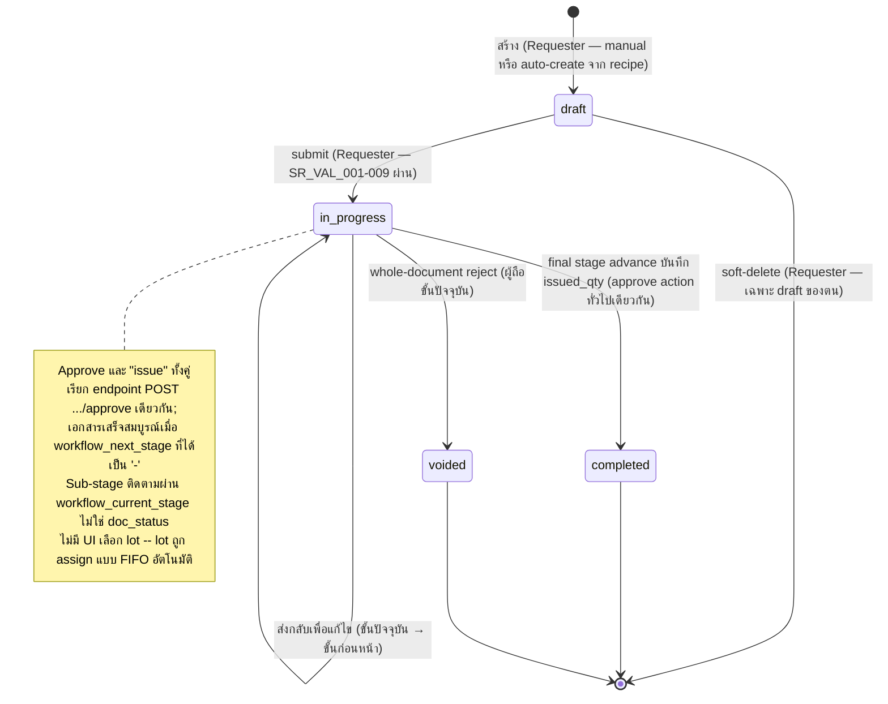

# ใบเบิกของสโตร์ (Store Requisition) — User Flow

> **At a Glance**
> **โมดูล:** [store-requisition](/th/inventory/store-requisition) &nbsp;·&nbsp; **Persona:** Requester &nbsp;·&nbsp; Approver &nbsp;·&nbsp; Fulfiller (ยืนยันแล้ว) &nbsp;·&nbsp; Receiver + Audit / Config (ยังไม่ยืนยัน — หน้า correction)
> **วงจรชีวิต workflow:** draft → in_progress (ขั้นย่อยอนุมัติ + issuance) → completed โดยมี voided เป็นทางยกเลิกทางเดียวที่ไปถึงได้จริง (reject ทั้งเอกสาร); `cancelled` มีนิยามใน enum แต่ไม่มี code path ปัจจุบันไปถึง
> **เจาะลึก view ต่อ persona ด้านล่างสำหรับรายละเอียดระดับ action**

## 1. ภาพรวม

หน้านี้คือ **จุดเริ่มต้นภาพรวม** สำหรับชุด user-flow ของโมดูล `store-requisition` Store Requisition (SR) คือเอกสารที่บันทึก **การเคลื่อนย้ายสต๊อกภายในระหว่างสถานที่** — แถวส่วนหัวใน `tb_store_requisition` ร่วมกับบรรทัด `tb_store_requisition_detail` หนึ่งบรรทัดขึ้นไป SR อาจเป็น *การดึงเพื่อบริโภค* (`sr_type = issue`, สต๊อกออกจาก inventory และตกเป็น expense บน cost-centre ของเอาท์เลตปลายทาง) หรือ *การโอน inventory* (`sr_type = transfer`, สต๊อกเคลื่อนระหว่างสองสถานที่ที่ถือ inventory) SR คือ **system of record สำหรับการเคลื่อนย้ายสต๊อกภายใน**: จนกว่าจะ commit ไม่มีการลด inventory ที่ต้นทางและไม่มี expense / inventory entry ที่ปลายทาง; เมื่อ commit แล้ว on-hand ต้นทางลดลง ปลายทางได้รับสต๊อกหรือดูดต้นทุน และ inventory transactions (พร้อมข้อมูล lot, expiry และ cost-layer) ถูกเขียนผ่าน `tb_inventory_transaction` ที่ลิงก์

ส่วนที่ 2 ด้านล่างคือ **state machine ส่วนกลาง** — รายการ canonical ของ transition ที่ถูกกฎหมายข้ามห้าค่าของ `enum_doc_status` (`draft`, `in_progress`, `completed`, `cancelled`, `voided`) โดยไม่ขึ้นกับว่าใครเป็นผู้กระทำ ไฟล์ต่อ persona แต่ละไฟล์ (ลิงก์จากส่วนที่ 3) บรรยายเส้นทางของ persona นั้น *ผ่าน* state machine — จุดเข้า, action ที่พร้อมใช้, branch การตัดสินใจที่เผชิญ และ handoff ที่จบบทบาท ส่วนที่ 4 สรุป handoff ข้าม persona ที่ร้อยเส้นทางแต่ละเส้นเข้าด้วยกัน อ่านภาพรวมนี้ก่อนเพื่อยึดวงจรชีวิต จากนั้นเจาะลึกไปยังไฟล์ persona ที่ตรงกับ role ของคุณ

หมายเหตุเรื่องขั้น workflow: ต่างจาก GRN ที่ approval และ fulfillment เป็นสถานะส่วนหัวแยก SR ยุบทั้งสองช่วงภายใต้ค่า `in_progress` เดียว ฟิลด์ `workflow_current_stage` คือสิ่งที่แยก "รอผู้อนุมัติ" จาก "รอผู้ issue" ดังนั้น state machine ในส่วนที่ 2 ระบุเฉพาะการย้าย `doc_status` ที่ถูกกฎหมาย; การเดินขั้น intra-`in_progress` (approve, send-back, route ไปยังขั้นที่ tag issue) เป็น workflow-internal และไม่เปลี่ยน `doc_status`

## 2. วงจรชีวิตเอกสาร

> ⚠️ **แก้ไขในรอบนี้** เวอร์ชันก่อนหน้าของ section นี้บรรยาย `cancelled` ว่าเป็นสถานะจริงที่เข้าถึงได้ (requester ถอนเอง, all-lines-rejected auto-cancel) และ `voided` ว่าเป็นเส้นทางเชิงบริหารแยกที่สงวนสำหรับ Inventory Controller/Sysadmin เท่านั้น การอ่านโค้ด `store-requisition.service.ts` โดยตรงแสดงว่าทั้งสองไม่ถูกต้อง: `cancelled` ไม่เคยถูก assign โดย service method ใดในปัจจุบัน และ `voided` ถูกตั้งแบบไม่มีเงื่อนไขโดย whole-document reject action เดียวกันที่ผู้ถือขั้น workflow ปัจจุบันคนใดก็เรียกได้ ดู [01-data-model.md](./01-data-model.md) §5 ข้อ 11 และ [02-business-rules.md](./02-business-rules.md) §5 สำหรับการแก้ไขฉบับเต็ม

สถานะเอกสาร SR ถูกเก็บบน `tb_store_requisition.doc_status` และจำกัดที่ห้าค่าที่ประกาศใน `enum_doc_status` ร่วม: `draft` (สถานะเริ่มต้นที่แก้ไขได้ ไม่กระทบสต๊อก ป้อนบรรทัดโดย requester), `in_progress` (submit แล้วและอยู่ภายใต้ workflow control; ยังไม่กระทบสต๊อกจนกว่าจะถึงขั้นสุดท้าย), `completed` (posting event ครั้งเดียวได้ fire แล้ว — inventory ลดที่ต้นทาง, cost-layer consume, ปลายทางรับสต๊อกหรือ expense ที่ยังไม่ post, เอกสารล็อก), `cancelled` (ประกาศไว้ใน enum แต่ไม่มี code path ปัจจุบันใดเข้าถึงได้) และ `voided` (ปลายทางที่ยืนยันแล้วของ whole-document reject; ไม่กระทบ inventory) Transitions ด้านล่างครอบคลุมการย้ายที่ถูกกฎหมายระหว่างกัน; อย่างอื่นถูก reject โดย workflow engine ผลกระทบปลายน้ำ (ลด on-hand ต้นทาง, เพิ่ม on-hand ปลายทางสำหรับ `transfer`) fire บน final workflow-stage advance เท่านั้น — ดู [02-business-rules.md](./02-business-rules.md) Section 5 สำหรับกฎ posting การ post journal-entry / GL ยังไม่ยืนยันในซอร์สปัจจุบัน

```mermaid
stateDiagram-v2
    [*] --> draft: สร้าง (Requester — manual หรือ auto-create จาก recipe)
    draft --> in_progress: submit (Requester — SR_VAL_001-009 ผ่าน)
    draft --> [*]: soft-delete (Requester — เฉพาะ draft ของตน)
    in_progress --> in_progress: approve / ตัด / reject บรรทัด (ผู้ถือขั้นปัจจุบัน)
    in_progress --> in_progress: ส่งกลับเพื่อแก้ไข (ขั้นปัจจุบัน → ขั้นก่อนหน้า)
    in_progress --> completed: final stage advance บันทึก issued_qty (approve action ทั่วไปเดียวกัน)
    in_progress --> voided: whole-document reject (ผู้ถือขั้นปัจจุบัน)
    completed --> [*]
    voided --> [*]

    note right of in_progress
        Approve และ "issue" ทั้งคู่เรียก endpoint POST .../approve เดียวกัน;
        เอกสารเสร็จสมบูรณ์เมื่อ workflow_next_stage ที่ได้เป็น '-'
        Sub-stage ติดตามผ่าน workflow_current_stage ไม่ใช่ doc_status
        ไม่มี UI เลือก lot -- lot ถูก assign แบบ FIFO อัตโนมัติ
    end note
```

> ℹ️ **หมายเหตุ — ขั้น intra-`in_progress`:** self-loop ของ `in_progress` ครอบคลุมจำนวนขั้นเท่าที่ config `tb_workflow` ของ tenant กำหนดไว้ ทั้งหมดใช้ `doc_status` เดียวกัน sub-stage จริงติดตามผ่าน `tb_store_requisition.workflow_current_stage` ไม่มีการแยกที่ยืนยันได้ใน backend ระหว่างขั้น "อนุมัติ" กับขั้น "fulfillment" นอกเหนือจาก tag `enum_stage_role` ที่ขั้นปัจจุบันถืออยู่ (`approve` เทียบกับ `issue`) — ทั้งคู่กระทำผ่าน endpoint `/approve` เดียวกัน

| จากสถานะ | Action | ไปสถานะ | อนุญาตให้ | เงื่อนไขล่วงหน้า |
| -------- | ------ | -------- | --------- | ----------------- |
| `(none)` | สร้าง | `draft` | Requester | Requester เป็นสมาชิก `department_id`; อนุญาตให้ทำธุรกรรมระหว่าง `from_location_id` และ `to_location_id`; `sr_no` กำหนดตามนโยบายเลขของ tenant ส่วนหัวอาจป้อนบางส่วน; บรรทัดอาจว่าง |
| `(none)` | auto-create จาก recipe demand | `draft` | System (cross-ref [recipe](/th/inventory/recipe)) | โมดูล recipe คำนวณปริมาณวัตถุดิบสำหรับ event production / banquet ของเอาท์เลตปลายทางและ post SR `draft` ให้ requester ของเอาท์เลต review และ submit `info.recipe_id` มี back-reference |
| `draft` | แก้ไข / save | `draft` | Requester (เจ้าของ) | กฎ validation ส่วนหัวและบรรทัดใน [02-business-rules.md](./02-business-rules.md) Section 2 ผ่านตอน save (warn-only บางส่วน) หรือ block ตอน submit; เอกสารยังแก้ไขได้ |
| `draft` | submit | `in_progress` | Requester (เจ้าของ) | กฎตอน submit ทั้งหมดผ่าน (`SR_VAL_001`–`SR_VAL_009`): สถานที่ต้นทาง / ปลายทางตั้งและเข้ากันกับ `sr_type`, source-availability check ผ่าน (ตาม tenant config: hard block หรือ soft warn), อย่างน้อยหนึ่งบรรทัดที่ `requested_qty > 0` Workflow engine จัดเส้นทางไปยังขั้นอนุมัติแรกและบรรจุ `user_action.execute` |
| `draft` | soft-delete (กลไกถอนก่อน submit เดียวที่ยืนยันได้) | `(deleted)` | Requester (draft ของตนเท่านั้น) | ยืนยันว่าจำกัดเฉพาะ `doc_status = draft`; ไม่มี action ถอนที่ `in_progress` ที่ยืนยันได้ |
| `in_progress` | approve / ตัด / reject บรรทัด (ผสม approve+reject ในการเรียกเดียว; ผสมกับ review ไม่ได้) | `in_progress` | ผู้อยู่ใน `user_action.execute` สำหรับขั้นปัจจุบัน | `approved_qty ≤ requested_qty` ตาม `SR_VAL_010` `workflow_current_stage` เดินต่อเมื่อบรรทัดทั้งหมดที่ขั้นปัจจุบันถูก action การตรวจ segregation-of-duties (`requester ≠ approver`, `approver ≠ issuer`) ยังไม่ยืนยัน — ไม่พบโค้ดลักษณะนี้ |
| `in_progress` | ส่งกลับ (`/review`, action ระดับทั้งการเรียก) | `in_progress` | ผู้อยู่ใน `user_action.execute` สำหรับขั้นปัจจุบัน | ส่งเอกสารกลับขั้นก่อนหน้า (โดยทั่วไปคือ requester) พร้อม `review_message`; `doc_status` ไม่เปลี่ยน |
| `in_progress` | final stage advance บันทึก `issued_qty` | `completed` | ผู้อยู่ใน `user_action.execute` สำหรับขั้นที่ tag `enum_stage_role.issue` | endpoint `/approve` เดียวกับขั้นอื่น; เสร็จสมบูรณ์เมื่อ `workflow_next_stage === '-'` Trigger การลด on-hand ต้นทางและ (สำหรับ `sr_type = transfer`) การเพิ่ม on-hand ปลายทาง ผ่าน `executeTransferOnComplete` การเลือก lot เป็น FIFO อัตโนมัติ |
| `in_progress` | whole-document reject | `voided` | ผู้อยู่ใน `user_action.execute` สำหรับขั้นปัจจุบัน | ไม่จำกัดเฉพาะ role "admin" — reject action เดียวกันพร้อมใช้สำหรับผู้ถือขั้นปัจจุบันคนใดก็ได้ ข้อความเหตุผลเป็นทางเลือกตาม reject dialog (maxLength 256 ไม่มี minimum) ไม่กระทบ inventory (SR ไม่เคย post) |
| `completed` | (ไม่มี transition สถานะต่อ) | `completed` | — | สถานะจุดสิ้นสุด การแก้ไขต้องผ่าน compensating adjustment ใน `[inventory-adjustment](/th/inventory/inventory-adjustment)`; SR เองยังคงล็อก ไม่มี action ยืนยันการรับของ Receiver หรือ flag ความคลาดเคลื่อนที่ยืนยันได้กับ SR ที่ `completed` — ดู [03-user-flow-receiver.md](./03-user-flow-receiver.md) |
| `voided` | (ไม่มี action ต่อ) | `voided` | — | จุดสิ้นสุด เก็บไว้สำหรับ audit |

## 3. ดัชนี Persona

แต่ละ persona ด้านล่างมีไฟล์เจาะลึกแยกที่บรรยายจุดเข้า flow หลัก branch การตัดสินใจ และจุดออก slug ตรงกับ role ของ persona; การคลิก link เปิด view ต่อ persona การจัดกลุ่มห้า persona ยุบหก persona ของ carmen/docs (Store Manager, Warehouse Supervisor, Department Head, Finance Manager, Inventory Controller, System Administrator + Auditor) เป็นห้า role เชิงปฏิบัติการ

- [Requester](./03-user-flow-requester.md) — Outlet Manager ที่ระบุความต้องการสต๊อกที่สถานที่บริโภค สร้าง SR เพิ่มรายการพร้อม `requested_qty` และวันที่ต้องการ แนบโน้ตประกอบ submit เอกสารเพื่อขออนุมัติ และติดตามสถานะ
- [Approver](./03-user-flow-approver.md) — Department Head ที่ review คำขอที่ submit แล้วเทียบกับความจำเป็นเชิงปฏิบัติการและความพร้อมต้นทาง; อนุมัติ ตัด `approved_qty` ลงจาก `requested_qty`, reject บรรทัด หรือส่งกลับเพื่อแก้ไข ลายเซ็นอนุมัติต่อบรรทัด persist โดยตรงบน `tb_store_requisition_detail`
- [Fulfiller](./03-user-flow-fulfiller.md) — ผู้ถือขั้น workflow ที่ tag `enum_stage_role.issue` (Store Keeper) ที่บันทึก `issued_qty` ต่อบรรทัดผ่าน approve action ทั่วไปเดียวกับที่ Approver ใช้ Lot ถูก assign แบบ FIFO อัตโนมัติ; ไม่มี UI เลือก lot
- [Receiver](./03-user-flow-receiver.md) — **แก้ไขในรอบนี้: ยังไม่ยืนยันว่าเป็น persona แยก** ไม่พบ route, permission key หรือกลไก flag ความคลาดเคลื่อนของ receiver ในซอร์สปัจจุบัน ดูในหน้านั้นว่าอะไรยืนยันได้และอะไรยังไม่ได้
- [Audit / Config](./03-user-flow-audit-config.md) — **แก้ไขในรอบนี้: ส่วนใหญ่ยังไม่ยืนยัน** พื้นที่ทำงาน "Inventory Controller / Finance / Sysadmin / Auditor" ที่หน้านี้เคยบรรยายไว้ (คอนโซล RBAC, การตรวจสอบ GL, threshold ผ่อนคลาย SoD) ไม่มี route หรือโค้ดรองรับ ดูในหน้านั้นว่าอะไรยืนยันได้และอะไรยังไม่ได้

## 4. การ Handoff ข้าม Persona

ตารางด้านล่างจับช่วงเวลาที่ SR ย้ายจากความรับผิดชอบของ persona หนึ่งไปยังอีก persona Handoff แต่ละครั้ง anchor กับสถานะเอกสาร (และที่เกี่ยวข้องคือ `workflow_current_stage`) ที่จุดส่งต่อ

| จาก persona | Trigger | ไป persona | สถานะเอกสารตอน handoff |
| ----------- | ------- | ---------- | ---------------------- |
| Requester | submit เพื่ออนุมัติ | Approver | `in_progress` (ขั้นแรก; `user_action.execute` บรรจุด้วยผู้ใช้ของขั้นแรก) |
| Approver | ส่งกลับเพื่อแก้ไข | Requester | `in_progress` (workflow route กลับไปขั้น requester; `review_message` ต่อบรรทัดเขียน) |
| Approver | บรรทัดทั้งหมดอนุมัติที่ขั้นอนุมัติสุดท้าย | Fulfiller (ผู้ใช้ขั้นถัดไป กลไก `/approve` เดียวกัน) | `in_progress` (workflow ก้าวต่อ; `user_action.execute` บรรจุด้วยผู้ใช้ที่ขั้นถัดไป) |
| Approver / Fulfiller | whole-document reject | (จุดสิ้นสุด — `voided`) | `voided` ไม่ใช่ `cancelled` — ดูหมายเหตุการแก้ไขใน Section 2 ไม่กระทบ inventory |
| Fulfiller | บันทึก `issued_qty`, final stage เสร็จสมบูรณ์ | (ไม่มี persona ปลายทางที่ยืนยันได้) | `completed` (on-hand ต้นทางลด; on-hand ปลายทางเพิ่มสำหรับ `transfer` หรือไม่เปลี่ยน on-hand ปลายทางสำหรับ `issue`; ข้อมูล lot auto-assign บน inventory transaction ที่ลิงก์) ไม่มี handoff ไปยัง "Receiver" ที่ยืนยันได้ — ดู [03-user-flow-receiver.md](./03-user-flow-receiver.md) |
| Fulfiller | เจอ stock-out ตอน issue และบันทึกบางส่วน | — | `completed` (พร้อม `issued_qty < approved_qty` ในหนึ่งบรรทัดขึ้นไป) ไม่พบกลไก alert/notification ที่ยืนยันได้เฉพาะกรณีนี้ |
| Recipe (auto-create) | คำนวณ recipe demand สำหรับ production / banquet | Requester | `draft` (pre-populate โดยโมดูล recipe; `info.recipe_id` มี back-reference) |

แถวที่บรรยาย persona "Receiver" หรือ "Inventory Controller / Sysadmin / Finance" ที่กระทำต่อ SR หลัง commit ถูกถอดออกในรอบนี้ — ดู [03-user-flow-receiver.md](./03-user-flow-receiver.md) และ [03-user-flow-audit-config.md](./03-user-flow-audit-config.md) สำหรับสิ่งที่ตรวจสอบแล้วและสิ่งที่ยังไม่ยืนยัน

## 5. แหล่งอ้างอิง

- `../carmen/docs/store-requisitions/SR-User-Experience.md` — แหล่ง user-experience ของ carmen/docs: คำอธิบาย persona (Store Manager / Warehouse Supervisor / Department Head / Finance Manager), user journeys (Create / Approve / Process) และ legacy 6-state lifecycle diagram (`Draft → Submitted → UnderReview → Approved → InProcess → Fulfilled → Completed`) — โปรดทราบว่า diagram **ไม่** canonical ที่นี่; หน้านี้ตาม `enum_doc_status` 5 ค่าของ Prisma (`draft / in_progress / completed / cancelled / voided`)
- `../carmen/docs/store-requisitions/SR-Overview.md` — ภาพรวมโมดูลของ carmen/docs: วัตถุประสงค์ ขอบเขต กลุ่มผู้ใช้ จุด integration; วงจรชีวิตในส่วนที่ 2 และ handoff ในส่วนที่ 4 ปรับให้ตรงกับ enum Prisma ไม่ใช่กับ 5 สถานะ `In Process / Complete / Reject / Void / Draft` ของ Overview ซึ่งยุบเป็น enum Prisma ตามที่ระบุใน [01-data-model.md](./01-data-model.md) Section 5 ข้อ 1
- `../carmen/docs/store-requisitions/Store Requisitions.md` — Use cases UC-64 (Approve), UC-65 (Deny), UC-66 (Modify), UC-67 (Monitor), UC-68 (Create and Manage), UC-69 (Approve and Record Stock as Issued); ไฟล์ persona Requester, Approver และ Fulfiller ดึง flow หลักจากนี้
- Sibling: [01-data-model.md](./01-data-model.md) — canonical `enum_doc_status`, `enum_sr_type` และ three-quantity invariant (`requested_qty / approved_qty / issued_qty`) ที่อ้างถึงตลอดส่วนที่ 2
- Sibling: [02-business-rules.md](./02-business-rules.md) Section 5 — ผลกระทบ posting และ gate authorization ที่อ้างถึงโดยทุกแถวของส่วนที่ 2
- โมดูลที่เกี่ยวข้อง: [inventory](/th/inventory/inventory) (ปลายน้ำ — ตอน commit on-hand ต้นทางลดและปลายทางเพิ่มสำหรับ `transfer`; ข้อมูล lot, expiry และ cost-layer อยู่บน inventory transaction ที่ลิงก์), [costing](/th/inventory/costing) (FIFO / moving-average ของสถานที่ต้นทาง feed unit cost ที่ issue), [recipe](/th/inventory/recipe) (เส้นทาง auto-create สำหรับการเบิกวัตถุดิบที่ขับโดย recipe), [good-receive-note](/th/inventory/good-receive-note) (การโอนระหว่างสถานที่อาจจับคู่ SR-OUT ที่ต้นทางกับ GRN-IN ที่ปลายทาง), [inventory-adjustment](/th/inventory/inventory-adjustment) (การแก้ไขหลัง commit)
