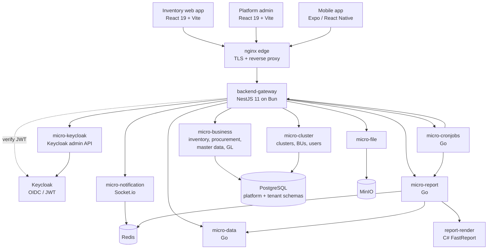
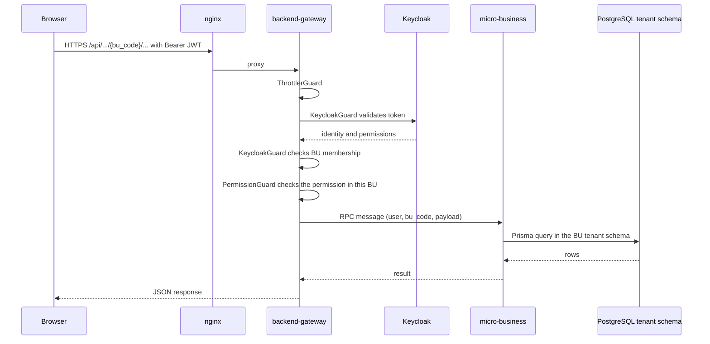
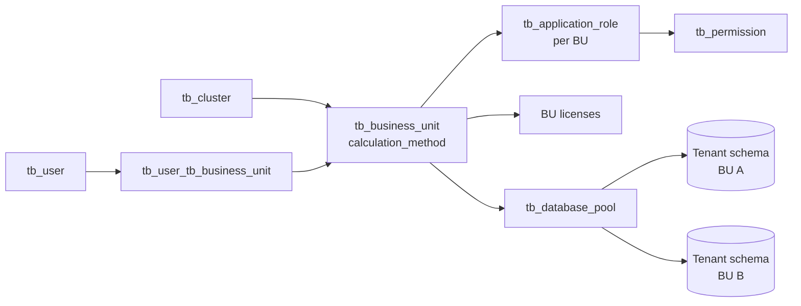
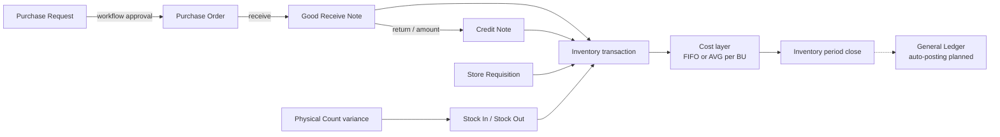

# ภาพรวมระบบ

หน้าเดียวสำหรับทำความเข้าใจระบบก่อนเข้าไปอ่าน [Inventory](/th/inventory) หรือ [Platform](/th/platform) book ว่า Carmen ทำอะไร ทำไมต้องมี ต้องตอบ requirement อะไร สร้างด้วยอะไร และแต่ละส่วนเชื่อมกันอย่างไร

> **สรุปสั้น** — Carmen เป็น ERP แบบ multi-tenant SaaS ที่ดูแลห่วงโซ่ จัดซื้อ → รับสินค้า → คลัง → ต้นทุน ให้โรงแรมและร้านอาหารในประเทศไทย เบราว์เซอร์คุยกับ **backend gateway** (NestJS) เพียงจุดเดียว ซึ่งกระจายงานไปยัง domain microservices และ Go sidecar services บน PostgreSQL ที่มี **platform schema** หนึ่งชุด และ **tenant schema แยกต่อ business unit**

## 1. Carmen คืออะไร

Carmen คือ ERP ด้านจัดซื้อถึงคลังสินค้าสำหรับธุรกิจ hospitality — โรงแรม รีสอร์ต และกลุ่มร้านอาหารที่มีหลาย outlet หรือหลาย property ครอบคลุม:

| ด้าน | สิ่งที่ดูแล | Book |
|------|-----------|------|
| จัดซื้อ | Purchase request, purchase order, goods received note (GRN), credit note, vendor price list | [Inventory](/th/inventory) |
| คลังสินค้า | การเคลื่อนไหวสต็อก, store requisition, stock in/out adjustment, physical count, spot check, period close | [Inventory](/th/inventory) |
| ต้นทุน | Cost layer แบบ FIFO หรือ weighted average เลือกได้ต่อ business unit | [Costing](/th/inventory/costing) |
| Master data | สินค้า หมวดหมู่ หน่วยและการแปลงหน่วย ผู้ขาย location สูตรอาหาร | [Inventory](/th/inventory) |
| บัญชี | รากฐาน General Ledger — ผังบัญชี, journal voucher, GL period, งบประมาณ | [General Ledger](/th/inventory/general-ledger) |
| รายงาน | รายงานจาก template (FastReport `.frx`), dashboard, รายงานตามกำหนดเวลา | [Reporting & Audit](/th/inventory/reporting-audit) |
| ดูแลแพลตฟอร์ม | Cluster, business unit, ผู้ใช้, RBAC, license, report template | [Platform](/th/platform) |

สกุลเงินที่ใช้ทั้งระบบคือบาท (฿)

## 2. ทำไมต้องมีระบบนี้

การจัดซื้อในธุรกิจโรงแรมและร้านอาหารมีปริมาณสูง สินค้าเน่าเสียง่าย และกระจายอยู่หลาย outlet ถ้าไม่มีระบบกลาง แต่ละ property จะซื้อ รับ และนับสต็อกด้วยวิธีของตัวเอง และรู้ต้นทุนอาหารก็ต่อเมื่อปิดเดือนไปแล้ว Carmen มีขึ้นเพื่อปิดช่องว่างนี้

| ปัญหาทางธุรกิจ | Carmen แก้อย่างไร |
|---------------|------------------|
| การจัดซื้อไม่มีการควบคุม — ใครก็สั่งจากผู้ขายรายไหนก็ได้ ในราคาเท่าไรก็ได้ | Purchase request ต้องผ่าน **workflow** อนุมัติที่ตั้งค่าได้ (stage ใน `tb_workflow`) ก่อนกลายเป็น purchase order และราคาอ้างอิงจาก vendor price list |
| มองไม่เห็นต้นทุนอาหารและเครื่องดื่มจนกว่าจะปิดเดือน | ทุกการรับและเบิกสร้าง inventory transaction พร้อม **cost layer** จึงรู้มูลค่าสต็อกและต้นทุนทุกครั้งที่มีการเคลื่อนไหว |
| กลุ่มที่มีหลาย property มองไม่เห็นและควบคุมทุก outlet ไม่ได้ | **Cluster** รวม business unit เข้าด้วยกัน ผู้ใช้ role และ license จัดการจากส่วนกลางใน Platform admin |
| สต็อกในระบบไม่ตรงกับของบนชั้น | **Physical count** ลงผลต่างเป็น stock in/out ส่วน **spot check** เทียบยอดโดยไม่ลงรายการ |
| ฝ่ายบัญชีต้องการตัวเลขที่ตรวจสอบได้ | **Period close** เก็บ snapshot ของ cost layer และมีรากฐาน General Ledger สำหรับ journal voucher และ GL period |
| การเปลี่ยนแปลงต้องตรวจย้อนได้ | Soft delete, optimistic locking ด้วย `doc_version`, comment thread และ activity log บนเอกสาร |

ผู้ใช้เป้าหมาย (ตาม Master PRD ใน `carmen/docs/prd`): ผู้จัดการฝ่ายจัดซื้อ, inventory controller, ผู้จัดการร้านและครัว, finance controller, F&B director และผู้ดูแลระบบ

## 3. Requirements

### 3.1 Functional Requirements

| # | Requirement | อ่านต่อที่ |
|---|-------------|-----------|
| F1 | สร้าง อนุมัติ ปฏิเสธ และส่งกลับ purchase request ผ่าน workflow หลายขั้น | [Purchase Request](/th/inventory/purchase-request) |
| F2 | แปลง request ที่อนุมัติแล้วเป็น purchase order และส่งให้ผู้ขาย | [Purchase Order](/th/inventory/purchase-order) |
| F3 | รับสินค้าตาม PO หรือรับตรง รวมถึง extra (landed) cost | [Good Receive Note](/th/inventory/good-receive-note) |
| F4 | คืนสินค้าหรือลดยอดเงินอ้างอิง GRN | [Credit Note](/th/inventory/purchase-order/credit-note) |
| F5 | โอนสต็อกระหว่าง location และเบิกให้ outlet | [Store Requisition](/th/inventory/store-requisition) |
| F6 | ปรับสต็อกพร้อมระบุประเภทเหตุผล | [Inventory Adjustment](/th/inventory/inventory-adjustment) |
| F7 | นับสต็อกและลงผลต่าง; spot check โดยไม่ลงรายการ | [Physical Count](/th/inventory/physical-count), [Spot Check](/th/inventory/spot-check) |
| F8 | ประเมินมูลค่าสต็อกแบบ FIFO หรือ weighted average ต่อ business unit | [Costing](/th/inventory/costing) |
| F9 | ดูแลสินค้า หน่วย ผู้ขาย location price list และสูตรอาหาร | [Product](/th/inventory/product), [Master Data](/th/inventory/master-data), [Vendor Pricelist](/th/inventory/vendor-pricelist), [Recipe](/th/inventory/recipe) |
| F10 | ออกรายงานจาก template รายงานตามกำหนดเวลา และ dashboard | [Reporting & Audit](/th/inventory/reporting-audit), [Dashboard](/th/inventory/dashboard) |
| F11 | ดูแล cluster, business unit, ผู้ใช้, role และ license | [Platform](/th/platform) |

### 3.2 Non-Functional Requirements

| ประเด็น | Requirement | ทำได้อย่างไร |
|--------|-------------|-------------|
| Multi-tenancy | ข้อมูลของ business unit หนึ่งต้องไม่รั่วไปอีก BU | **Platform schema** ใช้ร่วมกันสำหรับ config ข้าม tenant; **tenant schema** แยกต่อ business unit; มี `bu_code` ใน path ของ tenant API |
| Access control | ผู้ใช้ทำงานได้เฉพาะใน BU และ permission ที่ได้รับ | ยืนยันตัวตนด้วย Keycloak (OIDC/JWT); application role ต่อ BU ผูกกับ permission; route ใช้ `KeycloakGuard` ตามด้วย `PermissionGuard` |
| Concurrency | ผู้ใช้สองคนแก้เอกสารเดียวกันต้องไม่เขียนทับกันเงียบ ๆ | คอลัมน์ `doc_version` บนเอกสาร (optimistic locking) |
| Auditability | ข้อมูลตรวจย้อนและกู้คืนได้ | Soft delete, comment thread บนเอกสาร, activity event |
| Licensing | เปิดฟีเจอร์ได้ต่อ cluster / BU | ตาราง license และ feature group ใน platform schema; license interceptor ใน gateway |
| ภาระของรายงาน | รายงานขนาดใหญ่ต้องไม่ทำให้ API ค้าง | Render แบบ synchronous ถ้าไม่เกินจำนวนแถวที่กำหนด ไม่เช่นนั้นเป็น async job ในคิว Redis |
| Observability | ติดตาม (trace) service ใน production ได้ | ส่ง OpenTelemetry ไปที่ SigNoz |

## 4. Tech Stack

Version ตามที่ประกาศใน manifest ของแต่ละ repo (`package.json`, `go.mod`, `.csproj`) ตรวจเมื่อ 2026-09-23

| Layer | Component | Technology |
|-------|-----------|------------|
| Client | Inventory web app | React 19, Vite 7, TypeScript 5.9, Tailwind 4, React Router 7, TanStack Query 5, react-hook-form + Zod, Radix UI |
| Client | Platform admin | React 19, Vite 8, TypeScript 5.9, Tailwind 4, shadcn/ui, React Router 7 |
| Client | Mobile app | Expo 56, React Native 0.85 |
| Edge | Reverse proxy | nginx (TLS termination, proxy ไปยัง gateway และ web app) |
| API | Backend gateway | NestJS 11 บน Bun, Swagger, WebSocket |
| Domain services | micro-business, micro-cluster, micro-file, micro-keycloak, micro-notification | NestJS 11, Prisma 7, HTTP-as-RPC transport, Turborepo monorepo |
| Sidecar services | micro-report, micro-cronjobs, micro-data | Go 1.25, Gin, GORM, gocron |
| Report rendering | report-render | C# ASP.NET Core (.NET 8), FastReport OpenSource |
| Data | Database | PostgreSQL (platform schema + tenant schemas) |
| Data | Cache / queue | Redis (asynq jobs) |
| Data | Files | MinIO object storage |
| Identity | Authentication | Keycloak (OIDC / JWT) |
| Real-time | Notifications | Socket.io |
| Ops | Observability | OpenTelemetry → SigNoz |
| QA | Test และ API contract | Playwright (E2E), Bruno (API collections) |
| Docs | Wiki นี้ | Wiki.js กับ git storage |

## 5. Diagrams

### 5.1 System Architecture

Gateway เป็นทางเข้า HTTP เพียงจุดเดียว NestJS services ด้านหลังถูกเรียกผ่าน HTTP-as-RPC transport (`@MessagePattern`) ส่วน Go services เป็น HTTP sidecar ธรรมดา เบราว์เซอร์ไม่เรียก microservice ตรง ๆ เลย

### 5.2 เส้นทางของ API request หนึ่งครั้ง

สำหรับทีมทดสอบ status code บอกได้ว่าการตรวจขั้นไหนไม่ผ่าน:

| Status | มาจาก | ความหมาย |
|--------|-------|---------|
| `400` | `KeycloakGuard` | ไม่มี `bu_code` บน route ที่ผูกกับ BU |
| `401` | `KeycloakGuard` | ไม่มี token, token ไม่ถูกต้อง หรือหมดอายุ |
| `403` | `KeycloakGuard` | ยืนยันตัวตนผ่านแล้ว แต่ไม่ได้เป็นสมาชิกของ BU ที่ขอ |
| `403` | `PermissionGuard` | เป็นสมาชิก BU แต่ role ไม่มี permission ของ route นั้น |
| `429` | `ThrottlerGuard` | เรียกเกิน rate limit |

### 5.3 Multi-Tenancy Model

ทุกอย่างยกเว้น tenant schema อยู่ใน **platform schema** ที่ใช้ร่วมกัน และจัดการผ่าน [Platform](/th/platform) book เอกสารของแต่ละ business unit — PR, PO, GRN, สต็อก, cost layer, GL — อยู่ใน **tenant schema** ของ BU นั้นเอง ค่า `calculation_method` ของ BU เป็นตัวกำหนดว่าสต็อกคิดต้นทุนแบบ FIFO หรือ weighted average

### 5.4 Procurement-to-Inventory Flow

เอกสารทุกตัวที่กระทบสต็อกจะไหลเข้า `tb_inventory_transaction` และ cost layer ของมัน Spot check อ่านยอดคงเหลืออย่างเดียวและไม่สร้าง transaction ปัจจุบันเอกสาร **ไม่** ลงบัญชี GL อัตโนมัติ — journal voucher สร้างด้วยมือหรือจากการรัน template ส่วนการลงบัญชีอัตโนมัติยังอยู่ในแผน (เส้นประ)

## 6. Repository Map

ไปดูที่ไหนเมื่อ wiki นี้ไม่พอ Implementation และ E2E test คือความจริงสูงสุด เอกสารออกแบบเป็นอันดับรอง

| Repository | เป็นแหล่งความจริงของ |
|------------|---------------------|
| `carmen-inventory-frontend-react` | หน้าจอ, route และ validation ฝั่ง client ของ Inventory |
| `carmen-platform` | หน้าจอ Platform admin (cluster, BU, ผู้ใช้, RBAC, report template) |
| `carmen-inventory-mobile` | หน้าจอ mobile |
| `carmen-turborepo-backend-v2` | Route และ guard ของ gateway, domain logic, Prisma schema (`packages/prisma-shared-schema-platform`, `-tenant`), config ของ nginx และ k8s |
| `micro-report`, `report-render` | การเตรียมข้อมูลรายงานและการ render `.frx` |
| `micro-cronjobs` | งานตามกำหนดเวลา (รายงานตามรอบ, การรัน GL template, cleanup) |
| `micro-data` | การรัน dataset สำหรับ dashboard และ widget |
| `carmen-turborepo-backend-bruno` | รูปแบบ request และ response ของ API ที่แน่นอน |
| `carmen-inventory-frontend-e2e`, `carmen-platform-e2e` | พฤติกรรมที่คาดหวังในรูปที่รันได้ (Playwright) |
| `carmen/docs` | แนวคิดการออกแบบและ business requirement |

ระบบข้างเคียงที่อยู่นอก scope ของ wiki นี้: Knowledge Base / AI chat (`knowledge-base-carmen`) และโมดูลบัญชีที่อยู่ในแผนนอกเหนือจาก GL (AP, AR, สินทรัพย์ถาวร, ภาษี — `carmen-accounting-concept`)

## 7. อ่านต่อ

- [Carmen Inventory book](/th/inventory) — คู่มือรายโมดูลของคลังสินค้า จัดซื้อ และต้นทุน
- [Carmen Platform book](/th/platform) — cluster, business unit, ผู้ใช้, RBAC และ report template
- [Costing](/th/inventory/costing) — วิธีคำนวณ cost layer แบบ FIFO และ weighted average
- [Access Control](/th/inventory/access-control) — permission ทำงานอย่างไรภายใน business unit
