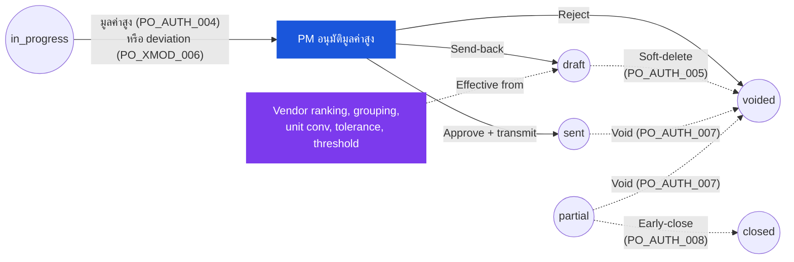

# ใบสั่งซื้อ — User Flow — Procurement Manager

> **At a Glance**
> **Persona:** Procurement Manager &nbsp;·&nbsp; **Module:** [[purchase-order]] &nbsp;·&nbsp; **Workflow stages:** การอนุมัติมูลค่าสูงที่ stage สุดท้าย (`in_progress → sent` ตาม `PO_POST_004`) — approve-and-transmit, send-back ให้ Purchaser, หรือ reject เป็น `voided` (`PO_POST_010`); soft-delete-in-draft (`PO_AUTH_005`); void จาก non-terminal (`PO_AUTH_007`); early-close `partial → closed` (`PO_POST_011`); workbench ปรับ rule (vendor master, grouping rules, unit conversions, pricelist tolerance, high-value threshold) &nbsp;·&nbsp; **สิทธิ์สำคัญ:** approve / send-back / reject มูลค่าสูง (`PO_AUTH_004`); override authorities (`PO_AUTH_005` / `PO_AUTH_007` / `PO_AUTH_008`)
> **Persona นี้ทำอะไร:** Gate การอนุมัติมูลค่าสูงและ administrator กฎ procurement; ถือ override authorities ที่ Purchaser ใช้ไม่ได้

## 1. บทบาทในโมดูลนี้

**Procurement Manager** เป็นเจ้าของ oversight ของฟังก์ชัน procurement และ engage กับโมดูล PO ข้าม **สอง surfaces ที่แตกต่าง** **Transactional surface** คือ gate การอนุมัติมูลค่าสูงที่ stage สุดท้ายของห่วงโซ่ workflow — POs ที่ `tb_purchase_order.total_amount` เกิน tenant high-value threshold (หรือมี pricelist deviation เกิน tolerance ตาม `PO_XMOD_006`) route มาที่นี่สำหรับ transition `in_progress → sent` ที่ Purchaser self-approve ไม่ได้ภายใต้ `PO_AUTH_004` และ Manager ก็ approve-and-transmit (`PO_POST_004`), send PO กลับให้ Purchaser สำหรับการ revise (`PO_POST_005`), หรือ reject เพื่อ terminate workflow ที่ `voided` (`PO_POST_010`) **Configurational surface** คือ workbench ปรับ rule ที่ Manager รักษา vendor master และ ranking, กฎ grouping `(vendor_id, currency_id)` ที่ Convert-to-PO ใช้, factors unit-conversion ที่ขับเคลื่อน `PO_VAL_009` / `PO_CALC_011`, band tolerance pricelist ที่ gate `PO_XMOD_006` และ high-value threshold เองบน workflow definition ที่ `tb_purchase_order.workflow_id` อ้างอิง Manager เพิ่มเติมถือ **override authorities** ที่ Purchaser ใช้ไม่ได้: soft-delete-in-draft (`PO_AUTH_005`), void จาก non-terminal state ใด ๆ (`PO_AUTH_007`, `PO_POST_010`), early-close จาก `partial → closed` (`PO_POST_011`, ใช้ร่วมกับ Inventory Manager ตาม `PO_AUTH_008`), และ override ของ send-back ของ Purchaser ที่ return-to-draft ปกติจะทำให้ PO ที่ time-critical หยุดชะงัก Manager ปฏิบัติงานภายใต้ `enum_stage_role = approve` ที่ stage มูลค่าสูงและเพิ่มเติมเป็น administrator การตั้งค่านอก workflow ที่เป็น transactional

### ตำแหน่งใน Workflow (เน้นเส้นทาง PM transactional + override)

### ตารางสิทธิ์ — Surface × Action (Procurement Manager)

อำนาจของ Manager spans gate อนุมัติ transactional และ surfaces configuration / override Transitions ที่ driven โดย receipt (`sent → partial → completed`) ไม่ใช่ส่วนหนึ่งของ role นี้

| Action | Transactional (อนุมัติมูลค่าสูง) | Override (non-terminal state ใด ๆ) | Configurational (Rule workbench) |
|---|---|---|---|
| ดู PO | ✅ | ✅ | — |
| Approve & Transmit (`in_progress → sent`) | ✅ (`PO_POST_004`) | — | — |
| Send-back (`in_progress → draft`) | ✅ (`PO_POST_005`) | — | — |
| Reject (`in_progress → voided`) | ✅ (`PO_POST_010`) | — | — |
| Soft-delete draft (`PO_AUTH_005`) | — | ✅ (`PO_POST_012`) | — |
| Void จาก `sent` / `partial` (`PO_AUTH_007`) | — | ✅ (`PO_POST_010`) | — |
| Early-close `partial → closed` (`PO_AUTH_008`, ร่วมกับ Inv Mgr) | — | ✅ (`PO_POST_011`) | — |
| Override send-back ของ Purchaser (re-submit + approve) | ✅ | — | — |
| รักษา vendor ranking และ performance score | — | — | ✅ |
| Edit คีย์ grouping Convert-to-PO (vendor + currency, secondary optional) | — | — | ✅ |
| Edit unit-conversion factors (ขับเคลื่อน `PO_VAL_009` / `PO_CALC_011`) | — | — | ✅ |
| Edit pricelist tolerance band (gate `PO_XMOD_006`) | — | — | ✅ |
| Edit high-value threshold (gate `PO_AUTH_004`) | — | — | ✅ |
| Save rule version พร้อม `effective_from` (in-flight snapshot เก็บไว้) | — | — | ✅ |
| Roll back rule version | — | — | ✅ |
| Bulk Void / Bulk Close | — | ✅ | — |
| Edit header / lines (qty, price, tax, FOC) | ❌ | ❌ | — |

> ℹ️ **หลักการ Snapshot:** การเปลี่ยน rule ใช้ **forward-only** POs ที่ `in_progress`, `sent`, หรือ `partial` แล้วยังคงเก็บ snapshot ของ `vendor_id`, `currency_id`, `exchange_rate`, `price` บรรทัด, `order_unit_conversion_factor`, และ workflow threshold — พวกเขาไม่ re-evaluate ภายใต้ rule ใหม่

## 2. Entry Point และ Primary Flow

Procurement Manager ทำงานสอง flows ขนานกัน — **transactional flow** ที่ trigger โดย escalated PO มาถึงคิว approval และ **configuration flow** driven บน cadence ช้ากว่าเพื่อให้ rules update แต่ละ surface มี entry point และจังหวะการตัดสินใจของตัวเอง

### Transactional flow — การอนุมัติมูลค่าสูง

**Entry point:** การแจ้งเตือนใน-app "Purchase Order [PO-No] Awaiting High-Value Approval" หรือ digest email deep-link เข้าคิว **Approvals → Pending** filter ที่ `workflow_current_stage = <high-value stage>` หรืออีกทางหนึ่ง Sidebar → โมดูล **Purchase Order** → list **My Approvals** sort ตาม `total_amount` descending

**Primary flow (happy path):**

1. รับ escalation Notification fire เมื่อ PO transition `draft → in_progress` (`PO_POST_002`) และ stage cursor ของ workflow land ที่ stage approval มูลค่าสูง — ทั้งเพราะ `tb_purchase_order.total_amount` เกิน tenant threshold (`PO_AUTH_004`) หรือเพราะ pricelist deviation เหนือ tolerance ได้ force-route PO มาที่นี่ภายใต้ `PO_XMOD_006` User-id ของ Manager อยู่ในชุด `user_action.execute` ที่ populated สำหรับ stage ปัจจุบัน
2. เปิดหน้า **PO detail** จากคิว approval Review header (vendor, currency, exchange rate, credit term, order และ delivery dates) เพื่อความถูกต้องเทียบกับ `PO_VAL_002`–`PO_VAL_006` Confirm ว่า workflow path เป็นที่คาดหวังสำหรับ tier มูลค่านี้และไม่มี validation flag (deviation, pricelist coverage หายตาม `PO_XMOD_005`, segregation-of-duties warning ตาม `PO_AUTH_010`) ค้างอยู่
3. เดินแท็บ **Items** สำหรับแต่ละบรรทัดตรวจสอบ pricelist deviation indicator, flag `is_foc`, `cancelled_qty` (ควรเป็นศูนย์ที่ stage นี้), PR ที่ link ผ่านตาราง bridge สำหรับ PR-sourced POs (`PO_XMOD_001`) และ `delivery_date` ต่อบรรทัด Manager re-validate roll-up การคำนวณ: `total_price`, `total_tax`, `total_amount` ตาม `PO_CALC_008`–`PO_CALC_010`
4. Review แท็บ **Attachments** และ **Comments** Manager หา vendor quote, note justification ของ buyer, comments จาก approver stage ก่อนหน้า และ (สำหรับ POs ที่ deviation-routed) เหตุผลที่ชัดเจนที่บันทึกใน `tb_purchase_order_detail_comment` JSON columns `history` และ `workflow_history` surface ห่วงโซ่ events `created → submitted → approved` เต็ม
5. ตัดสินใจ Manager มีสาม actions ที่ stage นี้:
   - **Approve ที่ final stage** — คลิก **Approve & Transmit** `po_status` transition `in_progress → sent` ผ่าน `PO_POST_004`, `approval_date = now()`, `last_action = approved`, และระบบ fire transmit handler ภายใต้ `PO_AUTH_006` ไปยัง email / EDI / portal-post PO ให้ vendor Soft budget commitment แข็งตัวเป็น vendor liability
   - **Send back** — คลิก **Return to Buyer** และใส่เหตุผลที่บังคับ `po_status` transition `in_progress → draft` ผ่าน `PO_POST_005`, `workflow_current_stage` reset เป็นจุดเริ่ม, `last_action = rejected`, และเหตุผล append ใน `tb_purchase_order_comment` (type `system`) Purchaser หยิบ PO จากคิว **Returned** ของพวกเขา
   - **Reject / void** — คลิก **Reject** และใส่เหตุผลที่บังคับ `po_status` transition `in_progress → voided` ผ่าน `PO_POST_010`, `is_active = false`, workflow terminate, และ soft budget commitment ใด ๆ reverse `voided` เป็น terminal
6. (หลัง approve-and-transmit) confirm ผลการส่ง Activity log บันทึก channel และ timestamp; vendor acknowledgement (เมื่อ channel รองรับ) feed มุมมอง **Sent POs awaiting acknowledgement** ที่ Manager monitor เพียงเหลือบมอง
7. (Optional, override path) intervene บน PO ที่ state สูงกว่า จากหน้า detail PO Manager สามารถ void `sent` หรือ `partial` PO (`PO_AUTH_007`, `PO_POST_010`) — ตัวอย่างเช่นเมื่อ vendor ยกเลิก — หรือ close `partial` PO เร็ว (`PO_AUTH_008`, `PO_POST_011`) เมื่อ vendor ไม่สามารถ supply outstanding balance ทั้งสอง actions ต้องการ reason text และบันทึกใน activity log ดู Section 3 สำหรับเงื่อนไขการตัดสินใจ

### Configuration flow — การปรับ rule

**Entry point:** Sidebar → **Procurement → Configuration** → เลือก rule set: **Vendor Ranking & Allocation**, **Convert-to-PO Grouping**, **Unit Conversion**, **Pricelist Tolerance**, หรือ **Workflow Threshold** Configuration screens gate โดย role Procurement Manager; Purchasers ทั่วไปมี read-only visibility บน screens เดียวกัน

**Primary flow (happy path):**

1. เปิด workbench rule เป้าหมาย Screen list rule set ปัจจุบันพร้อม metadata: rule id, effective-from date, last-updated-by, และจำนวน POs ที่ in-flight ที่เก็บ snapshot ของ version ก่อน Screen **Vendor Ranking & Allocation** sort vendors ตาม performance score (on-time delivery rate, three-way-match success rate, deviation rate); Screen **Convert-to-PO Grouping** เปิดเผยคีย์ grouping `(vendor_id, currency_id)` และคีย์ secondary optional ใด ๆ (delivery location, payment term) ที่ tenant enable; Screen **Unit Conversion** list factor `order_unit → base_unit` ต่อสินค้าที่ feed `PO_VAL_009` และ `PO_CALC_011`; Screen **Pricelist Tolerance** เปิดเผย band `±X%` ที่ gate `PO_XMOD_006`; Screen **Workflow Threshold** เปิดเผย cutoff มูลค่าสูงที่ trigger `PO_AUTH_004`
2. Edit rule ปรับ parameter — re-rank vendor ขึ้นหรือลง เปลี่ยนคีย์ grouping update factor conversion ขยายหรือแคบ band tolerance ขึ้นหรือลด threshold ระบบ flag PO ใด ๆ ที่ in-flight ที่ปัจจุบัน snapshot ค่าก่อนหน้าและเตือนว่าการเปลี่ยนแปลงจะส่งผลกระทบต่อ **POs ใหม่** เท่านั้น (ตามหลักการ snapshot ด้านล่าง)
3. Save การเปลี่ยนแปลง ระบบเขียน rule version ใหม่ด้วย effective-from timestamp เพิ่ม counter version ของ rule และบันทึก change ใน configuration audit log ด้วย user-id ของ Manager ค่าก่อนหน้า และค่าใหม่ POs ใหม่ที่สร้างจากจุดนี้ไปใช้ rule ใหม่; PO drafts ที่ `in_progress` แล้วและ POs ที่ `sent` / `partial` แล้วเก็บ snapshot ของพวกเขา
4. Notify ผู้ใช้ที่ได้รับผลกระทบ ระบบ fire notification การเปลี่ยน configuration ให้ Purchasers ("Vendor ranking updated", "Convert-to-PO grouping rule updated", "Unit conversion factor changed for product [SKU]") เพื่อให้ทีม buyer รับทราบก่อนการรัน Convert-to-PO ครั้งถัดไป
5. (Optional) ทดสอบการเปลี่ยนแปลง สำหรับ grouping และ threshold rules Manager สามารถรัน dry-run preview เทียบกับชุด PR synthetic เพื่อ confirm ว่า rule ผลิตรูปแบบ grouping หรือ escalation ที่คาดหวังก่อนพึ่งพาในการผลิต
6. (Optional) roll back หาก report ปลายน้ำหรือการ escalate ของ buyer surface ปัญหา Manager re-open workbench rule, restore version ก่อน (ซึ่ง audit log เก็บไว้) และ version ใหม่ใช้ได้สำหรับ POs ที่สร้างหลัง rollback timestamp

## 3. Decision Branches

- **หากการ escalate ที่ซับซ้อนเข้ามาที่ PO มูลค่าสูง valid ทางเทคนิคแต่น่าสงสัยทางการค้า** (เช่น ราคาเหนือ benchmark ก่อนหน้า, alternate vendor รู้จักว่าถูกกว่า, FOC line ที่ควรถูกเรียกเก็บ): Manager review vendor quote ใน **Attachments**, ประวัติ PO ก่อนใน [[vendor-pricelist]] activity, และ justification ของ Purchaser ใน **Comments** หากคำตอบคือ "this is the right vendor at the right price" Manager approve-and-transmit หากคำตอบคือ "this needs the buyer to renegotiate or pick a different vendor" Manager ส่งกลับให้ Purchaser พร้อมเหตุผล renegotiation บันทึกเป็น comment หากคำตอบคือ "this PO should not happen at all" Manager reject เป็น `voided` (`PO_POST_010`) และแจ้ง Purchaser ผ่าน reason field มาตรฐาน; workflow terminate และ soft commitment ปล่อย
- **หาก Manager ต้องการเปลี่ยน rule ที่ in-flight PO ได้ snapshot แล้ว** (เช่น raise high-value threshold ขณะที่ borderline PO นั่งที่ `in_progress` บน stage มูลค่าสูง): screen edit rule เตือน in-flight PO และเสนอสองเส้นทาง (a) **Save and apply going forward** — threshold ใหม่ใช้ได้สำหรับ POs ใหม่เท่านั้น; in-flight PO ดำเนินต่อผ่าน stage มูลค่าสูงบน threshold เก่า (b) **Save and re-route in-flight** — มีเฉพาะเมื่อ workflow definition รองรับ re-routing; in-flight PO bump กลับเป็น `draft` (พร้อม system comment), threshold ใหม่ evaluate เทียบกับ `total_amount`, และ PO ก็ skip stage มูลค่าสูงบน resubmission หรือยังคงอยู่ขึ้นอยู่กับค่าใหม่ Tenants ส่วนใหญ่ disable (b) เพื่อ audit safety และใช้ (a) เฉพาะ ซึ่งเป็นเหตุผลที่ snapshot-on-submit rule (Section 2 step 2 ของ transactional flow) documented เป็น default
- **หาก bulk action จำเป็นบน POs ที่ stuck** (เช่น vendor ออกจากธุรกิจและ POs active 12 ตัวที่ `sent` / `partial` ต้องถูก void หรือ early-close ในการดำเนินการเดียว): จาก PO list Manager filter โดย vendor และ status, multi-select rows ที่ได้รับผลกระทบ และรัน **Bulk Void** (`PO_AUTH_007`, `PO_POST_010`) หรือ **Bulk Close** (`PO_AUTH_008`, `PO_POST_011`) แต่ละ action ต้องการ reason text เดียวที่บันทึกต่อ PO ใน activity log สำหรับ `partial` POs เส้นทาง bulk-close เขียน remainder ของแต่ละบรรทัดเป็น `cancelled_qty` เพื่อให้ `received_qty + cancelled_qty = order_qty` POs ที่ `completed`, `closed`, หรือ `voided` แล้วถูก skip จาก bulk action (terminal states ไม่สามารถ re-transition)
- **หาก Manager override send-back ของ Purchaser** (buyer ได้ return PO เป็น draft ที่ Manager เชื่อว่าควรดำเนินการต่อ — เช่น PO ที่ time-critical ที่ concern ของ buyer ไม่ blocking): เส้นทาง override คือ re-submit PO จาก `draft` แทน buyer (role ของ Manager inherit สิทธิ์ Purchaser ตาม hierarchy role) และ approve ที่ stage มูลค่าสูงตามปกติ Override บันทึกเป็นสอง distinct events ใน audit log — send-back ดั้งเดิมจาก buyer และการ re-submit ของ Manager พร้อม justification comment Alternative path: Manager re-route workflow definition เพื่อ bypass stage ของ buyer ทั้งหมดสำหรับ PO นี้และ approve โดยตรง — มีเฉพาะเมื่อ tenant workflow อนุญาต manual re-routing
- **หาก PO ที่ deviation-routed เข้ามาที่ไม่ควรถูก routed มาที่นี่** (deviation flag ราize โดย `PO_XMOD_006` แต่ใน review ราคาถูกและ pricelist เองเก่า): Manager approve-and-transmit ตามปกติและเพิ่มเติมเปิด workbench rule **Pricelist Tolerance** เพื่อ refresh row pricelist underlying ใน [[vendor-pricelist]] หรือปรับ band tolerance เพื่อให้ PO ที่คล้ายกันถัดไปไม่ re-route โดยไม่จำเป็น นี่คือ loop ที่ทำให้ surfaces transactional และ configurational synchronised
- **หาก Manager soft-delete draft PO** (buyer ได้ raise PO โดยผิดพลาดและทิ้งไว้ หรือ PO เป็น duplicate ของ active อีกใบ): จากหน้า detail draft PO Manager รัน **Delete Draft** (`PO_AUTH_005`, `PO_POST_012`); `deleted_at` และ `deleted_by_id` ตั้ง, และ row ยังอยู่ในฐานข้อมูลสำหรับ audit เพราะ unique index บน `po_no` รวม `deleted_at` `po_no` เดียวกันถูกปล่อยให้ใช้ใหม่ Buyer แจ้งเตือนโดย notification delete-event มาตรฐาน

## 4. Exit Point / Handoffs

การ involve ของ Procurement Manager บน PO ที่กำหนดและ rule set ที่กำหนดจบที่หนึ่งใน handoffs ที่ documented ดังต่อไปนี้

### Transactional handoffs

- **Final approval → ส่งให้ vendor** — Manager approve ที่ stage มูลค่าสูงและ `po_status` transition `in_progress → sent` ผ่าน `PO_POST_004` Handoff ไปยัง **Vendor**; document state ที่ handoff คือ `sent` PO ตอนนี้เป็น firm commitment; **Purchaser** monitor vendor acknowledgement และ receipt transitions ที่ driven โดย GRN บน Open POs dashboard ดู [03-user-flow-vendor.md](./03-user-flow-vendor.md) สำหรับ flow ฝั่งภายนอก
- **Reject → terminal voided** — Manager reject พร้อม reason และ `po_status` transition `in_progress → voided` ผ่าน `PO_POST_010` Handoff ไปยัง **Auditor** สำหรับ review post-hoc เท่านั้น; document state ที่ handoff คือ `voided` (terminal) Soft budget commitment ใด ๆ reverse Purchaser แจ้งเตือนและสามารถใช้ reason เพื่อแจ้ง requestor หรือ re-raise PO ที่แก้ไขถ้าความต้องการ underlying ยังคงอยู่
- **Send back → revision โดย buyer** — Manager return PO เป็น draft พร้อม reason และ `po_status` transition `in_progress → draft` ผ่าน `PO_POST_005` Handoff ไปยัง **Purchaser**; document state ที่ handoff คือ `draft` Purchaser หยิบ PO จากคิว **Returned** edit ตาม reason ของ Manager และ re-submit ผ่าน approver chain เต็ม การ involve ของ Manager resume หาก resubmitted PO อีกครั้งกระทบ stage มูลค่าสูง
- **Void ที่ non-draft / early-close** — Manager void `sent` หรือ `partial` PO (`PO_AUTH_007`, `PO_POST_010`) หรือ early-close `partial` PO (`PO_AUTH_008`, `PO_POST_011`) Handoff ไปยัง **Finance** (สำหรับ AP close-out review ของ accrual ใด ๆ ที่ raise โดย GRN postings แล้ว) และ **Auditor**; document state ที่ handoff คือ `voided` หรือ `closed` ตามลำดับ (ทั้งคู่ terminal) ดู [03-user-flow-finance.md](./03-user-flow-finance.md) สำหรับ close-out ฝั่ง AP

### Configurational handoffs

- **Rule change saved → effective สำหรับ POs ใหม่** — Manager save การเปลี่ยนแปลง vendor ranking, Convert-to-PO grouping, unit conversion, pricelist tolerance, หรือ high-value threshold Handoff ไปยังชุมชน **Purchaser** ผ่าน notification การเปลี่ยน configuration; effect บน POs ใหม่เท่านั้น **In-flight POs เก็บ snapshot** ของ rule version ก่อน — drafts ที่ `in_progress` แล้วดำเนินต่อบน workflow stage เก่า, POs ที่ `sent` แล้วเก็บ `vendor_id`, `currency_id`, `exchange_rate`, `price` บรรทัด, และ `order_unit_conversion_factor` บรรทัด ที่เก็บไว้ ไม่ว่าจะมี rule edit ใด ๆ ตามมา หลักการ snapshot นี้คือสิ่งที่ทำให้ surface configurational ปลอดภัยที่จะทำงานบน cadence ต่างจาก surface transactional
- **Rule rollback → version ก่อน restore** — Manager roll back rule change Handoff อีกครั้งไปยังชุมชน **Purchaser** ผ่าน notification; rule version ก่อน restore สำหรับ POs ที่สร้างจาก rollback timestamp ไปข้างหน้า หลัก forward-only-effect ยังคงใช้: POs ที่สร้างระหว่าง save ดั้งเดิมและ rollback เก็บ rule version ที่ (ตอนนี้ superseded แล้ว) ที่พวกเขา snapshot

Transitions ที่ driven โดย receipt (`sent → partial → completed` ผ่าน `PO_POST_006`/`PO_POST_007`) ไม่ใช่ action ของ Procurement Manager — driven โดย **Receiver** ผ่าน GRN posting Manager สังเกต transitions เหล่านี้บน dashboard และ intervene เฉพาะผ่านเส้นทาง override early-close หรือ void ที่อธิบายข้างต้น

## 5. แหล่งอ้างอิง

- ภาพรวม parent: [03-user-flow.md](./03-user-flow.md) — global PO state machine และตาราง cross-persona handoff
- Sibling: [03-user-flow-purchaser.md](./03-user-flow-purchaser.md) — persona ต้นน้ำที่ submit PO ที่ escalate ไปยัง Manager และหยิบ send-back ที่ `draft`
- Sibling: [03-user-flow-vendor.md](./03-user-flow-vendor.md) — ฝ่ายภายนอกปลายน้ำที่รับ PO ที่ส่งที่ `po_status = sent`
- Sibling: [03-user-flow-finance.md](./03-user-flow-finance.md) — close-out ฝั่ง AP ของ GRN accrual ใด ๆ เมื่อ Manager void หรือ early-close `partial` PO
- Sibling: [03-user-flow-audit-config.md](./03-user-flow-audit-config.md) — System Administrator ที่ตั้งค่า workflow definitions และ RBAC bindings ที่ rule edits ของ Manager พึ่งพา; Auditor ที่ review activity log ของ actions approve / reject / void / config-change ของ Manager
- กฎ Authorization: [02-business-rules.md](./02-business-rules.md) Section 4 — `PO_AUTH_004` (อนุมัติมูลค่าสูง), `PO_AUTH_005` (delete-in-draft), `PO_AUTH_007` (void จาก non-draft), `PO_AUTH_008` (early-close จาก partial), `PO_AUTH_010` (segregation of duties), `PO_AUTH_011` (workflow stage gating)
- กฎ Posting: [02-business-rules.md](./02-business-rules.md) Section 5 — `PO_POST_004` (final approval และ transmit), `PO_POST_005` (send-back เป็น draft), `PO_POST_010` (void จาก non-terminal state ใด ๆ), `PO_POST_011` (early-close จาก partial), `PO_POST_012` (soft-delete ใน draft)
- กฎ Cross-module: [02-business-rules.md](./02-business-rules.md) Section 6 — `PO_XMOD_001` / `PO_XMOD_002` (PR bridge linkage), `PO_XMOD_005` / `PO_XMOD_006` (vendor-pricelist snapshot และ deviation routing), `PO_XMOD_007` (three-way-match AP interaction บน void / close)
- `../carmen/docs/purchase-order-management/purchase-order-module.md` — แหล่ง carmen/docs หลักสำหรับ business analysis โมดูล PO, ตาราง RBAC, และ state diagram ที่ flow นี้อ้างอิง
- เกี่ยวข้อง: [[vendor-pricelist]] — vendor master, pricelist coverage, และ tolerance band ที่ Manager ปรับจาก configuration surface
- เกี่ยวข้อง: [[purchase-request]] — โมดูล upstream ที่ PR-to-PO conversion ถูก govern โดย grouping rule ที่ Manager ตั้งค่า
- เกี่ยวข้อง: [[good-receive-note]] — fulfilment ปลายน้ำที่ Manager สังเกต receipt postings; early-close และ void จาก `partial` interact กับ GRN accruals ผ่าน `PO_XMOD_007`
