# ใบสั่งซื้อ — User Flow (Purchase Order — User Flow)

> **At a Glance**
> **Module:** [[purchase-order]] &nbsp;·&nbsp; **Personas:** Purchaser &nbsp;·&nbsp; Procurement Manager &nbsp;·&nbsp; Vendor &nbsp;·&nbsp; Receiver &nbsp;·&nbsp; Finance &nbsp;·&nbsp; Audit / Config
> **วงจรการทำงาน workflow:** Draft → In Progress → Sent → Partial → Completed / Closed (พร้อม branch Voided)
> **ดูมุมมองแต่ละ persona ด้านล่างเพื่อรายละเอียดระดับ action**

## 1. ภาพรวม

หน้านี้คือ **จุดเริ่มต้นภาพรวม** สำหรับชุด user-flow ของโมดูล `purchase-order` Purchase Order (PO) คือเอกสารการผูกพัน procurement — header PO (`tb_purchase_order`) ร่วมกับบรรทัด detail หนึ่งหรือมากกว่าหนึ่งบรรทัด (`tb_purchase_order_detail`) — ที่นำ line items ที่ตกลงแล้วจาก Purchase Requests ที่อนุมัติแล้วหนึ่งหรือมากกว่าหนึ่งใบและผูกพัน buyer กับ vendor ในราคา ปริมาณ และวันส่งของที่ fixed วงจรชีวิตใน Section 2 ครอบคลุมจากการสร้าง draft เริ่มต้นผ่าน internal approval การส่งให้ vendor การรับบางส่วนหรือเต็มเทียบกับ PO และสุดท้ายการปิด (การ complete ปกติหรือการปิดเร็ว) Personas ที่เกี่ยวข้องคือ **Purchaser** (สร้างและส่ง POs บริหาร amendments), **Procurement Manager** (oversight, อนุมัติ high-value, vendor ranking, override authority), **Vendor** (ฝ่ายภายนอกไม่มี system login — รับ ตอบรับ fulfil ออก invoice), **Receiver** (รับสินค้าจริงและสร้าง GRN เทียบกับ PO), ทีม **Finance** (three-way match และ AP posting) และ roles **Audit / Config** (Auditor สำหรับ read-only review, System Administrator สำหรับการตั้งค่า workflow และ integration) Catalogue role เองนิยามใน [index.md](./index.md) Section 4

Section 2 ด้านล่างคือ **global state machine** — list canonical ของ transitions ข้ามค่า `enum_purchase_order_doc_status` อิสระจากใครทำ ไฟล์ persona แต่ละไฟล์ (link จาก Section 3) อธิบาย *เส้นทางผ่าน* state machine ของ persona นั้น — entry point ของพวกเขา actions ที่ใช้ได้กับพวกเขา decision branches ที่พวกเขาเผชิญ และ handoff ที่จบการ involvement ของพวกเขา Section 4 จากนั้น summarise cross-persona handoffs ที่เย็บเส้นทางส่วนตัวเข้าด้วยกัน อ่านภาพรวมนี้ก่อนเพื่อ anchor วงจรชีวิต จากนั้นเจาะลึกไฟล์ persona ที่ตรงกับ role ของคุณ

## 2. วงจรชีวิตของเอกสาร

PO document status เก็บใน `tb_purchase_order.po_status` และจำกัดให้เป็นค่าที่ประกาศใน `enum_purchase_order_doc_status`: `draft`, `in_progress`, `voided`, `sent`, `partial`, `closed`, `completed` Transitions ด้านล่างครอบคลุมการเคลื่อนไหวที่ถูกต้องระหว่างกัน; อย่างอื่นถูก reject โดย workflow engine หมายเหตุว่า transitions ที่ driven โดย receipt (`sent → partial → completed`) ถูก trigger โดย GRN postings ในโมดูลปลายน้ำ [[good-receive-note]] ไม่ใช่โดย action ผู้ใช้โดยตรงบน PO

```mermaid
stateDiagram-v2
    [*] --> draft: create (Purchaser)
    draft --> draft: save / edit
    draft --> in_progress: submit for approval
    draft --> [*]: soft-delete (PO_AUTH_005)
    in_progress --> in_progress: approve intermediate stage
    in_progress --> sent: approve final + transmit
    in_progress --> draft: send-back (any approver)
    in_progress --> voided: reject / void
    sent --> partial: GRN posts partial receipt
    sent --> completed: GRN posts full receipt
    sent --> voided: void (no GRN posted; PO_AUTH_007)
    partial --> partial: subsequent partial GRN
    partial --> completed: GRN clears outstanding balance
    partial --> closed: early-close (Inv. Mgr / PM; PO_AUTH_008)
    completed --> [*]
    closed --> [*]
    voided --> [*]
```

| จาก state | Action | ไปยัง state | อนุญาตสำหรับ | เงื่อนไขก่อน |
| ---------- | ------ | -------- | ----------- | -------------- |
| `(none)` | create | `draft` | Purchaser | ฟิลด์ header validate (`vendor_id`, `currency_id`, `order_date`, `delivery_date`, `workflow_id`); ต้องมีอย่างน้อยหนึ่งบรรทัดก่อน submission PR linkage เขียนเข้าตาราง bridge เมื่อมีต้นทางจาก PR |
| `draft` | save (edit) | `draft` | Purchaser (owner) | PO ยังแก้ไขได้; ไม่มี workflow stage advance Header totals (`total_qty`, `total_price`, `total_tax`, `total_amount`) คำนวณใหม่ตอน save |
| `draft` | submit for approval | `in_progress` | Purchaser (owner) | อย่างน้อยบรรทัดที่ไม่ deleted หนึ่งบรรทัด; header ครบ; `workflow_id` ที่เลือก active สำหรับ scope `purchase-order` `last_action` ตั้งเป็น `submitted`; stage cursor advance ไปยัง stage approval แรก |
| `draft` | delete | `(none)` | Purchaser, Procurement Manager | Soft-delete เท่านั้น (`deleted_at` ตั้ง); อนุญาตเฉพาะตอน PO อยู่ใน `draft` และไม่เคย submit |
| `in_progress` | approve (stage นี้ ไม่ใช่ final) | `in_progress` | Current-stage approver | Approver assigned ไปยัง `workflow_current_stage` ด้วย `stage_role = approve`; `last_action` กลายเป็น `approved`; stage cursor advance |
| `in_progress` | approve (final stage) | `sent` | Final-stage approver (โดยทั่วไป Procurement Manager สำหรับ high-value) | All prior stages signed off; ผ่าน high-value threshold check ที่ใช้ได้ PO ถูกส่งให้ vendor บน transition นี้ (email / EDI / portal ตามที่ตั้งค่า) |
| `in_progress` | send-back | `draft` | Approver ใด ๆ บนห่วงโซ่ | Reason text required; ส่ง PO กลับไปยัง Purchaser สำหรับการแก้ไข Audit comment เขียน |
| `in_progress` | reject / void | `voided` | Approver ใด ๆ บนห่วงโซ่, System Administrator | Reason text required; workflow terminate โดยไม่อนุญาต action เพิ่ม |
| `sent` | receive (partial) | `partial` | Receiver ผ่าน GRN posting | อย่างน้อย PO line หนึ่งมี `received_qty > 0` แต่ `received_qty < order_qty − cancelled_qty` ข้าม PO State change คำนวณจาก GRN postings ระดับบรรทัด |
| `sent` | receive (full) | `completed` | Receiver ผ่าน GRN posting | ทุกบรรทัดเป็นไปตาม `received_qty + cancelled_qty ≥ order_qty`; ทุกบรรทัดปิดผ่าน GRN ใน transaction เดียว |
| `sent` | void | `voided` | Procurement Manager, System Administrator | Reason text required; อนุญาตเฉพาะเมื่อไม่มี GRN post เทียบกับบรรทัดใด ๆ |
| `partial` | receive (เพิ่มเติม) | `partial` | Receiver ผ่าน GRN posting | GRN ถัดไป post quantity เพิ่ม แต่ PO ยังมีอย่างน้อยหนึ่งบรรทัดที่เปิด; state ยังคงเป็น `partial` |
| `partial` | receive (final balance) | `completed` | Receiver ผ่าน GRN posting | GRN สุดท้าย clear outstanding balance บนทุกบรรทัด; PO transition ไปยัง normal completion |
| `partial` | close (supply ไม่ได้) | `closed` | Procurement Manager, Inventory Manager | Vendor ไม่สามารถ supply outstanding quantity; open qty ที่เหลือถูก treat เป็น cancelled (line `cancelled_qty` เขียน) Reason text required |
| `completed` | (ไม่มี action เพิ่ม) | `completed` | — | Terminal state สำหรับเส้นทาง receipt; three-way match ใน Finance track บน linked invoice ไม่ใช่บน PO status |

## 3. สารบัญ Persona

แต่ละ persona ด้านล่างมีไฟล์ drill-down เฉพาะที่อธิบาย entry point, primary flow, decision branches, และ exit point Slugs ตรงกับ role ของ persona; การคลิก link เปิดมุมมองต่อ persona

- [Purchaser](./03-user-flow-purchaser.md) — สร้าง POs ด้วยมือหรือโดยการแปลง PRs ที่อนุมัติแล้ว (พร้อม vendor+currency grouping), validate ราคา pricelist, ส่ง PO, จัดการ amendments และการติดตาม
- [Procurement Manager](./03-user-flow-procurement-manager.md) — กำกับ procurement, อนุมัติ PO มูลค่าสูงและ amendments, จัดการ vendor ranking, ถือ delete-in-draft, void, และ override authority ของ early-close
- [Vendor](./03-user-flow-vendor.md) — ฝ่ายภายนอกไม่มี system login; รับ PO ที่ส่งมา ตอบรับการตอบรับ fulfil ส่งของตามเงื่อนไขที่ตกลง และออก invoice สำหรับ three-way match
- [Receiver](./03-user-flow-receiver.md) — Receiver / Store Keeper + Inventory Manager รับสินค้าจริง สร้าง GRN เทียบกับ PO ทีละบรรทัด และ trigger receipt-state transitions `sent → partial → completed`
- [Finance](./03-user-flow-finance.md) — Finance Officer / AP + Finance Manager Review ความถูกต้องทางการเงินของ PO, รัน three-way match (PO ↔ GRN ↔ invoice), จัดการ currency / FX, และ post AP liability
- [Audit / Config](./03-user-flow-audit-config.md) — Auditor (read-only review ของ POs, amendments, และ activity log) และ System Administrator (workflow stage configuration, RBAC, numbering, vendor และ pricelist integration)

## 4. Handoffs ข้าม Persona

ตารางด้านล่าง capture moments ที่ PO เคลื่อนจากความรับผิดชอบของ persona หนึ่งไปยังอีก persona Handoff แต่ละครั้ง anchor ที่ document state ณ จุด transfer

| จาก persona | Trigger | ไปยัง persona | Document state ที่ handoff |
| ------------ | ------- | ---------- | ------------------------- |
| Purchaser | Submit for approval | First-stage approver (โดยทั่วไป Procurement Manager สำหรับ high-value) | `in_progress` (stage cursor บน stage approval แรก) |
| Approver (stage N, ไม่ใช่ final) | Approve ที่ stage นี้ | Approver (stage N+1) | `in_progress` (stage cursor advance) |
| Procurement Manager (final stage) | Approve ที่ final stage และส่ง | Vendor | `sent` (PO ส่งแล้ว; รอ GRN ครั้งแรก) |
| Approver (stage ใด ๆ) | Send-back พร้อมเหตุผล | Purchaser | `draft` (พร้อม revision history และ approver comment เก็บไว้) |
| Vendor | การส่งของจริง | Receiver | `sent` (state ระบบไม่เปลี่ยนจนกว่า GRN จะ post) |
| Receiver | Post GRN — partial fulfilment | Purchaser, Inventory Manager | `partial` (บรรทัดหนึ่งหรือมากกว่ายังเปิดอยู่) |
| Receiver | Post GRN — final balance | Finance (สำหรับ invoice match) | `completed` (ทุกบรรทัดรับครบ) |
| Procurement Manager / Inventory Manager | Close PO ด้วย qty ที่เหลือเป็น cancelled | Finance (review close-out) | `closed` (qty ที่เหลือเขียนเป็น `cancelled_qty`) |
| Procurement Manager / System Administrator | Void พร้อมเหตุผล | Auditor (review post-hoc เท่านั้น) | `voided` |
| Finance | Three-way match สำเร็จและ AP posted | (terminal) | `completed` (PO ไม่เปลี่ยน; AP liability post เทียบกับ matched invoice) |

## 5. แหล่งอ้างอิง

- `../carmen/docs/purchase-order-management/purchase-order-module.md` — แหล่ง carmen/docs หลักสำหรับ business analysis, state diagram, และ PO creation flows
- Sibling: [01-data-model.md](./01-data-model.md) — ค่า `enum_purchase_order_doc_status` canonical ที่ใช้ใน Section 2 ข้างต้นและตาราง bridge ที่ carry PR→PO traceability
- Sibling: [02-business-rules.md](./02-business-rules.md) — กฎ validation, authorization, posting, และ transition ที่อ้างอิงโดยแต่ละ row ของ Section 2
- โมดูลที่เกี่ยวข้อง: [[purchase-request]] (ต้นทาง upstream ผ่าน PR→PO bridge), [[good-receive-note]] (fulfilment ปลายน้ำที่ขับเคลื่อน transitions `partial` / `completed`), [[vendor-pricelist]] (price snapshot ที่ PR-to-PO conversion time)
