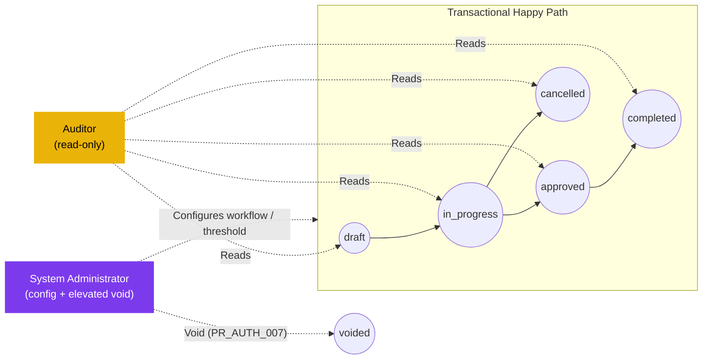

# ใบขอซื้อ — User Flow — Audit / Config (Purchase Request — User Flow — Audit / Config)

> **At a Glance**
> **Persona:** Auditor (read-only) + System Administrator (config) &nbsp;·&nbsp; **โมดูล:** [[purchase-request]] &nbsp;·&nbsp; **Stage ของ workflow:** off-path — สังเกตทุกสถานะ; Sysadmin ถือ void ระดับสูง (PR_AUTH_007) &nbsp;·&nbsp; **สิทธิ์สำคัญ:** audit/อ่านประวัติ, ตั้งค่า workflow / threshold / delegation, void ระดับสูง
> **persona นี้ทำอะไร:** review audit trail immutable (Auditor) และเป็นเจ้าของการตั้งค่า workflow, threshold, delegation และนโยบาย (Sysadmin)

## 1. บทบาทในโมดูลนี้

แกน persona **Audit / Config** group สอง role ที่นั่ง **นอกเส้นทาง happy path** ของ transactional ของโมดูล `purchase-request` แต่จำเป็นสำหรับ governance และ operability ของมัน **Auditor** เป็น persona อ่านอย่างเดียวที่ review activity trail ที่ immutable ของ PR ทุกใบ — timeline ประวัติสถานะใน `workflow_history`, log comment ใน `tb_purchase_request_comment` (`PR_POST_008`), การเปลี่ยน header / บรรทัด / สถานะ / vendor / pricelist ทุกการเปลี่ยนที่จับเป็น system event และ snapshot การให้สิทธิ์ต่อ stage ใน `user_action` — และ verify ว่าเอกสารปฏิบัติตามนโยบาย, segregation of duties ได้รับการเคารพ (ไม่มีผู้ใช้เดียวทำหน้าที่ทั้ง Requestor และ Approver บน PR เดียวกัน, ไม่มีการอนุมัตินอก band) และ audit trail สมบูรณ์และตรวจจับการแทรกแซงได้ Auditor **ไม่มี write surface** ในโมดูล: พวกเขา approve, reject, send back, แก้บรรทัด, เปลี่ยน workflow หรือ void PR ไม่ได้ **System Administrator** เป็น persona configuration ที่เป็นเจ้าของ **surface workflow และนโยบาย** สำหรับโมดูล — stage ของ workflow และ chain `stage_role`, threshold มูลค่าที่ขับ routing และ escalation (`PR_AUTH_005`), กฎ delegation และหน้าต่าง (`PR_AUTH_006`), default ต่อประเภท PR (workflow default ต่อ `enum_purchase_request_type`, default tax-treatment ระดับบรรทัด, default นโยบายเหตุผล mandatory ของ approve / reject), tax code และ default tax-inclusive/exclusive ที่ consume โดย `PR_CALC_002`–`PR_CALC_004`, แหล่งอัตราสกุลเงินที่ feed `exchange_rate` และ snapshot `PR_CALC_006` และ assignment ผู้ใช้ / role / business-unit ที่กำหนดว่าใครลงใน `user_action.execute[]` ที่แต่ละ stage ไม่มี role ใดอยู่บนเส้นทาง happy ของ request-to-PO; แต่ละ role มีจุดเริ่มต้นของตัวเอง, surface ของตัวเอง และ semantic จุดออกของตัวเอง: Auditor ออกผ่าน report ที่ generate โดยไม่มีการเปลี่ยนสถานะ PR, Sysadmin ออกผ่าน configuration ที่ save ที่มีผลกับ PR อนาคตในขณะที่รักษา semantic snapshot สำหรับ PR ที่อยู่ใน `in_progress` แล้ว คู่นี้ถูกบันทึกที่นี่บนแกน persona เดียวเพราะทั้งสอง role peripheral ต่อ flow transactional และ share pattern ทั่วไป "off-path, governance-oriented"

### ตำแหน่งเทียบกับ flow transactional (ผู้สังเกต off-path)

### ตารางสิทธิ์ — Action × Sub-persona (Audit / Config)

สอง sub-persona มีสิทธิ์ที่เสริมกันโดยไม่ทับซ้อน Auditor สังเกตและรายงาน; Sysadmin ตั้งค่าและ (ในกรณีพิเศษ) void ทั้งสองไม่มีส่วนใน approve / send-back / reject

| Action | Auditor | System Administrator |
|---|---|---|
| อ่าน `workflow_history` / `tb_purchase_request_comment` | ✅ | ✅ |
| อ่าน header / บรรทัด / snapshot (vendor / pricelist / exchange rate) | ✅ | ✅ |
| สร้าง audit query แบบ ad-hoc (filter) | ✅ | ✅ |
| Flag PR ใน audit case file (ฝั่ง audit เท่านั้น) | ✅ | ❌ |
| Export report (CSV / PDF) — ฟิลด์ที่ sensitive ต้อง export-approver | ✅ | ✅ |
| แก้ stage ของ workflow / chain `stage_role` | ❌ | ✅ |
| แก้ amount threshold (`PR_AUTH_005`) | ❌ | ✅ |
| แก้กฎ delegation / window (`PR_AUTH_006`) | ❌ | ✅ |
| Assign / remove ผู้ใช้จาก `user_action.execute[]` | ❌ | ✅ |
| แก้ default ของประเภท PR / tax code / อัตราสกุลเงิน | ❌ | ✅ |
| Save configuration ด้วย `effective_from` (snapshot สำหรับ PR กลาง flow) | ❌ | ✅ |
| Roll back configuration ไป version ก่อน | ❌ | ✅ |
| Void PR กลาง flow (`PR_AUTH_007`, `PR_POST_006`) | ❌ | ✅ |
| แก้ header / บรรทัด / vendor / pricing ของ PR | ❌ | ❌ |
| Approve / Reject / Send-back / Split-Reject | ❌ | ❌ |

> ℹ️ **Auditor → Sysadmin escalation:** เมื่อ audit finding ต้องการเปลี่ยนสถานะ (เช่น void PR ที่ไม่ compliant) Auditor flag case file และ **System Administrator** ทำ void ภายใต้ `PR_AUTH_007` Auditor ไม่ทำ action เอง

## 2. จุดเริ่มต้นและ flow หลัก

### Flow ของ Auditor

**จุดเริ่มต้น:** Sidebar → workspace **Audit** → **PR Activity Queries** (หรือเมื่อเริ่มจากเอกสารที่รู้ Sidebar → โมดูล **Purchase Request** → เปิด PR → แท็บ **Activity Log**) Auditor ลงบน surface query-builder scope กับ document family `purchase-request` ไม่ใช่บนคิว My Approvals / My PRs ที่ persona transactional ใช้

**Flow หลัก (happy path — Auditor):**

1. จาก **Audit → PR Activity Queries** เลือก template audit query (เช่น "All PRs voided in period", "All send-backs by stage", "All split-rejects", "Threshold escalations", "Delegations exercised", "All status transitions for a PR") หรือสร้าง ad-hoc query กับ `workflow_history`, `tb_purchase_request_comment` และ snapshot header / detail
2. Apply **filter**: ช่วงวันที่ (`pr_date`, `last_action_at` หรือ `created_at`), แผนก / business unit, requestor, ผู้อนุมัติ / delegate, ค่า `pr_status`, `enum_purchase_request_type`, แถบ `base_total_amount` และ flag threshold-breach Chip filter ปรากฏเหนือตาราง result; filter set ว่างถูกปฏิเสธเพื่อกัน unbounded scan
3. Review **result set**: แต่ละแถวเป็น PR หนึ่งใบ (หรือ event หนึ่ง, ขึ้นกับ shape query) พร้อม `pr_no`, requestor, สถานะปัจจุบัน, action ล่าสุด, ผู้ทำล่าสุด และ audit fact ที่เกี่ยวข้องสำหรับ query (เช่นเหตุผล void, ระยะ send-back hop, จำนวนบรรทัด split-reject) Sort ตามคอลัมน์ใด; คลิกเข้าแถวเพื่อเจาะลงไป **trail activity เต็ม** สำหรับ PR นั้น
4. ที่หน้า drill-down เดิน **timeline สถานะ** จาก `created_at` ถึงสถานะปัจจุบัน: ทุกแถว `workflow_history` (stage ที่เข้า, stage ที่ผ่าน, โดยใคร, ด้วย comment ใด), ทุก entry `tb_purchase_request_comment` (user comment และ comment `type = system` ที่จับ action จากกฎ), การตัดสินใจระดับบรรทัด (`current_stage_status` ต่อบรรทัด) และ reference snapshot ทุกตัว (snapshot vendor / pricelist / exchange-rate ที่ถูกถ่ายตอน submit และตอน approval ตาม `PR_CALC_006`) Verify ว่า trail contiguous (ไม่มีช่องว่าง, ไม่มี timestamp out-of-order) และทุก state transition มีทั้งผู้ทำและเหตุผลที่จำเป็น
5. ถ้าพบ anomaly (เช่น approval บันทึกนอก `user_action.execute[]` ของ stage, void โดยไม่มี comment เหตุผล, delegate ทำงานนอก window ของพวกเขา) **flag** PR ใน audit case file พร้อม note การ flag **ไม่** เปลี่ยน PR — มันเขียนไปยัง store ฝั่ง audit เท่านั้น
6. **Export report** เป็น CSV / PDF สำหรับงวดหรือสำหรับ case file Export ของฟิลด์ sensitive (เช่นชื่อ requestor, ข้อความ free-text เต็ม, payload attachment) ต้องการการอนุมัติทุติยภูมิตามนโยบาย data-export ที่อธิบายใน [02-business-rules.md](./02-business-rules.md) Section 4 — Auditor submit คำขอ export และ export-approver ปล่อยมัน Report ที่ export และ record การอนุมัติเองเป็น audit object

### Flow ของ System Administrator

**จุดเริ่มต้น:** Sidebar → workspace **Configuration** → **PR Workflow Settings** (สำหรับ stage, threshold, delegation), **PR Type Defaults** (สำหรับ default `enum_purchase_request_type` และ default tax-treatment), **Tax Codes**, **Currency Rates** หรือ **Users & Roles** (สำหรับ assignment `user_action.execute[]`) แต่ละ surface เป็นหน้าแยกใต้ workspace เดียวกัน

**Flow หลัก (happy path — Sysadmin, การเปลี่ยน workflow / threshold / delegation):**

1. **ระบุการเปลี่ยนนโยบาย** Trigger จากภายนอก — เช่น Finance ต้องการ Stage 4 approver มูลค่าสูงใหม่, การปรับโครงสร้างแผนกเปลี่ยนว่าใครเป็นเจ้าของ Stage 1, ต้อง activate delegation สำหรับ window ลาที่จะมา หรือต้องปรับแถบ threshold หลัง budget review เปิด change ticket และ link reference นโยบาย (memo / approval) ก่อนเปิด surface configuration
2. **เปิดหน้า configuration ที่เกี่ยวข้อง** สำหรับการเปลี่ยน workflow / threshold: **Configuration → PR Workflow Settings** → เลือกแถว workflow (ต่อ business unit / ต่อประเภท PR) → เปิด stage editor สำหรับ delegation: **Configuration → Delegation Rules** → เลือกผู้ใช้ที่ delegate, set delegate และ window สำหรับ default ประเภท PR: **Configuration → PR Type Defaults**
3. **ปรับ setting** ใน staged editor: เพิ่ม / ลบ / จัดลำดับ stage, เปลี่ยน `stage_role` ของ stage (`approve`, `purchase`, `review`), assign หรือลบผู้ใช้จาก `user_action.execute[]`, แก้ amount threshold ที่ trigger escalation ไปยัง stage `purchase` ตาม `PR_AUTH_005`, set delegation window (`start_at`, `end_at`, delegate user, scope ตาม `PR_AUTH_006`) หรือเปลี่ยน workflow default / tax treatment ของประเภท PR ทุกการแก้สะสมใน draft configuration ที่ค้าง; ไม่มีอะไร persist จนกว่าจะ Save
4. **Preview ผลกระทบ** หน้า configuration แสดงสรุป side-panel: จำนวน active-PR ที่จะดำเนินต่อภายใต้ snapshot เก่า, จำนวน new-PR ที่จะใช้กฎใหม่ (forecast จากอัตราการสร้างล่าสุด), stage ที่เปลี่ยน และผู้ใช้ที่เพิ่มเข้าหรือลบจาก `user_action.execute[]` สำหรับการเปลี่ยน threshold panel แสดงการเลื่อนแถบและจำนวน PR ล่าสุดที่จะถูก route ต่างออกไป Sysadmin สามารถ revise หรือทิ้ง draft ที่จุดนี้
5. **Save configuration** ระบบเขียน configuration ใหม่ด้วย timestamp `effective_from`, บันทึกการเปลี่ยนใน configuration audit log ฝั่งระบบ (อิสระจาก `tb_purchase_request_comment`) และแจ้งกลุ่มผู้ใช้ที่ได้รับผลกระทบ (เช่น approver ที่เพิ่งเพิ่ม, ผู้ที่ delegate และผู้รับ delegate) PR ที่อยู่ใน `in_progress` แล้วยังคง **snapshot** configuration ดั้งเดิม — chain stage ของ workflow, แถบ threshold และบริบท tax / currency ที่พวกเขา submit ภายใต้ถูกตรึงตาม semantic snapshot ที่อธิบายใน [02-business-rules.md](./02-business-rules.md) Section 6 PR ใหม่ที่สร้างหลัง `effective_from` ใช้ configuration ใหม่
6. **Verify การ activate** เลือก PR test ใหม่ตัวแทน (หรือจำลองหนึ่งใน environment ที่ไม่ใช่ production) และยืนยันว่า routing ใหม่ fire ตามที่คาด: stage, พฤติกรรม threshold breach และการสืบทอด delegate ถ้าพบ regression roll back โดยเปิด configuration ใหม่และ revert ไป version ก่อน (ทุก version ที่ save ถูกเก็บไว้ใน configuration audit log)
7. **ปิด change ticket** ด้วย link configuration audit-log จากจุดนี้การเปลี่ยนมีผลกับ PR ใหม่; การมีส่วนร่วมของ Sysadmin จบจนกว่าจะมีการเปลี่ยนนโยบายถัดไป

## 3. แขนงการตัดสินใจ

- **ถ้า Auditor พบการละเมิดนโยบาย** (เช่น approval โดยผู้ใช้ที่ไม่อยู่ใน `user_action.execute[]`, void โดยไม่มีเหตุผล mandatory, delegate ทำงานนอก window `PR_AUTH_006` ของพวกเขา): Auditor **ไม่สามารถ act บน PR ในโมดูล** (read-only) Auditor escalate ผ่าน audit case file — flag PR, แนบหลักฐาน (screenshot timeline, ตัดตอน comment-log, diff version configuration) และ route case ไปยัง business owner ที่รับผิดชอบ (Finance, Compliance หรือหัวหน้าแผนกที่เกี่ยวข้อง) สำหรับการแก้ไขนอก band ถ้าการแก้ไขต้องการ action ระดับระบบ (เช่น void เพื่อยุติ PR ที่ไม่ compliant) action นั้นทำโดย System Administrator ภายใต้ `PR_AUTH_007` ไม่ใช่ Auditor
- **ถ้า Sysadmin พยายามเปลี่ยน configuration ขณะที่ PR กลาง flow พึ่งกฎปัจจุบัน**: การ save ได้รับอนุญาต (กฎไม่ถูก lock โดย PR กลาง flow) แต่การเปลี่ยน **ไม่** re-route หรือ re-rank PR กลาง flow ที่มีอยู่ย้อนหลัง หน้า configuration แสดงจำนวน PR `in_progress` ที่ได้รับผลกระทบใน preview panel; PR เหล่านั้นดำเนินต่อภายใต้ snapshot ตาม [02-business-rules.md](./02-business-rules.md) Section 6 และจะรู้สึกถึงกฎใหม่เฉพาะถ้าถูกส่งกลับเป็น `draft` และ resubmit (ในกรณีนั้น resubmission ใช้ configuration ใหม่) นี่เป็นพฤติกรรม snapshot-preservation เดียวกันที่ปกป้องอัตราแลกเปลี่ยน `PR_CALC_006`
- **ถ้า delegation activate สำหรับ window ทันที**: delegate สืบทอด membership `user_action.execute[]` ของผู้ที่ delegate สำหรับ scope ของ window (ตาม `PR_AUTH_006`) Notification สำหรับ PR ใด ๆ ที่นั่งอยู่ที่ stage ที่ผู้ delegate เป็นเจ้าของถูกส่งใหม่ไปยัง delegate เมื่อ window delegation หมดอายุ (`end_at` ถึง) สิทธิ์ที่ delegate สืบทอดหายอัตโนมัติ; PR ที่ยังที่ stage นั้นดำเนินต่อกับ `user_action.execute[]` ของผู้ใช้ดั้งเดิม (ที่ไม่เคยเปลี่ยน) — ไม่ต้อง re-route PR
- **ถ้า window delegation ถูก set ด้วย `start_at` ในอนาคต**: delegate ไม่ได้อะไรจนกว่าจะถึง `start_at` ระบบ schedule activation event; ที่ `start_at` delegation go live และ notification เริ่ม fan ใหม่ Sysadmin สามารถ revoke pending delegation ใด ๆ ก่อน activation โดยไม่มี side effect
- **ถ้า Auditor request export ที่รวมฟิลด์ sensitive** (ชื่อ requestor เต็ม, ข้อความ free-text justification เต็ม, snapshot pricelist vendor, payload attachment): export ไปสู่สถานะ **pending** และต้องการการอนุมัติจาก data-export approver ตามนโยบาย export Auditor ไม่สามารถ bypass step นี้ ขณะ pending export ไม่เห็นนอก audit case file; เมื่ออนุมัติ export ถูก materialize และ link download ถูกบันทึกใน case file พร้อม identity ของผู้อนุมัติ
- **ถ้าการเปลี่ยนของ Sysadmin block PR กลาง flow** (เช่น configuration ลบผู้ใช้จาก `user_action.execute[]` บน stage ที่ผู้ใช้นั้นเป็นคนเดียวที่ assigned และ PR กำลังรอที่ stage นั้นโดยไม่มีผู้อนุมัติคนอื่น): preview panel flag deadlock ใน step 4 ถ้า Sysadmin save ยังไงก็ตาม PR ที่ได้รับผลกระทบจะ time out ที่ stage นั้นและต้องการ intervention ด้วยมือ — โดยทั่วไปคือ delegation one-off (`PR_AUTH_006`) หรือ void ที่ Sysadmin เริ่ม (`PR_AUTH_007`) — เพื่อปลด block Configuration audit log บันทึกการเปลี่ยนและคำเตือน deadlock เพื่อให้ audit trail ทำสาเหตุชัดเจน

## 4. จุดออก / Handoff

แกน persona Audit / Config ออกในรูปแบบต่อไปนี้ขึ้นกับ role ที่ลงมือ:

- **Auditor — report ที่ generate** Result ของ query, trail ของ drill-down หรือ case file ถูก materialize (review บนหน้าจอหรือ export ไป CSV / PDF หลัง flow การอนุมัติ export) **ไม่มีการเปลี่ยนสถานะ PR**: `pr_status`, `workflow_current_stage`, `workflow_history`, `tb_purchase_request_comment` และทุก snapshot บนเอกสารยังคงเหมือนก่อนที่ Auditor เปิดหน้า Handoff ของ Auditor เป็นแบบ **out-of-band** ไปยัง business owner ที่รับผิดชอบ (Finance, Compliance, หัวหน้าแผนก หรือ System Administrator) สำหรับการแก้ไขใด ๆ ที่ audit surface ถ้า case file ของ Auditor แนะนำ void System Administrator ทำ void ภายใต้ `PR_AUTH_007`
- **Auditor — case file ปิดโดยไม่มี action** เมื่อ audit query / drill-down ไม่พบ anomaly Auditor ปิด case file ด้วย note "no findings" ไม่มีการเปลี่ยนสถานะ PR; case file เองถูกเก็บไว้เป็นหลักฐานว่า period / scope ถูก audit
- **Sysadmin — configuration ที่ save** Version ใหม่ของ configuration (stage ของ workflow, threshold, กฎ delegation, default ประเภท PR, tax code, อัตราสกุลเงิน หรือ assignment user-role) ถูกเขียนด้วย timestamp `effective_from` และบันทึกใน configuration audit log **PR ที่สร้างหลัง `effective_from`** ใช้ configuration ใหม่; **PR ที่อยู่ใน `in_progress` แล้ว** ยังคง configuration ดั้งเดิมที่ snapshot ตาม [02-business-rules.md](./02-business-rules.md) Section 6 — รวม chain stage, แถบ threshold, การจัดการภาษี และ semantic exchange-rate `PR_CALC_006` Notification ไปยังกลุ่มผู้ใช้ที่ได้รับผลกระทบ fire ตอน save Handoff คือ **forward in time** — Requestor คนถัดไปที่สร้าง PR เห็นพฤติกรรมใหม่อัตโนมัติ
- **Sysadmin — void บน PR กลาง flow (`PR_AUTH_007`).** ต่างจาก configuration save: เมื่อ Sysadmin ใช้สิทธิ์ `void` ระดับสูงเพื่อถอน PR เดี่ยว (โดยทั่วไปตาม case file ของ Auditor) `pr_status` พลิกจาก `in_progress` (หรือ `approved`) เป็น `voided` (terminal); commitment soft (หรือ hard) ถูกปล่อย; เหตุผล mandatory ถูกจับใน `tb_purchase_request_comment` (`PR_POST_006`); และ `workflow_history` บันทึก void Handoff ไปยัง **Auditor** สำหรับ review หลังเหตุการณ์และไปยัง **Requestor** ที่เห็นสถานะ voided บน dashboard **My PRs** ของพวกเขา ไม่มี action ของผู้ใช้บน PR เพิ่มเติม
- **Sysadmin — configuration ที่ roll back** ถ้า verification ใน step 6 ของ flow หลักพบ regression Sysadmin revert ไป version configuration ก่อนหน้า การ rollback เองเป็น configuration save ของตัวเองพร้อม `effective_from` ของตัวเอง; PR ที่สร้างระหว่างการเปลี่ยนต้นฉบับและการ rollback ไม่ถูก re-evaluate ย้อนหลัง (semantic snapshot) แต่ PR ใหม่หลัง rollback ใช้ configuration ที่ revert Configuration audit log จับทั้งการเปลี่ยน forward และ rollback รักษา trail ที่สะอาด

สถานะเอกสารข้ามทุกจุดออก Audit / Config ถูก govern โดย `enum_purchase_request_doc_status = { draft, in_progress, voided, approved, completed, cancelled }` Flow ของ Auditor ไม่เคยย้าย PR ข้าม enum นี้; flow configuration ของ Sysadmin ก็ไม่เคยย้าย PR ข้าม enum (PR อนาคตเท่านั้นที่ได้รับผลกระทบ) Action เดียวของ Sysadmin ที่เปลี่ยนสถานะ PR คือ void ระดับสูงภายใต้ `PR_AUTH_007` และถือเป็น operation พิเศษที่ trigger โดย audit แทนที่จะเป็น step configuration ประจำ

## 5. แหล่งอ้างอิง

- ภาพรวมหลัก: [03-user-flow.md](./03-user-flow.md)
- กฎการให้สิทธิ์: [02-business-rules.md](./02-business-rules.md) Section 4 — `PR_AUTH_002` (ผู้ทำต่อ stage), `PR_AUTH_005` (routing ตาม amount-threshold), `PR_AUTH_006` (delegation), `PR_AUTH_007` (void ระดับสูง / การเปลี่ยนสถานะ sysadmin-only), `PR_AUTH_008` (เป็นเจ้าของ `enum_stage_role`)
- กฎการ posting: [02-business-rules.md](./02-business-rules.md) Section 5 — `PR_POST_006` (void), `PR_POST_008` (audit comment immutable)
- กฎข้ามโมดูล: [02-business-rules.md](./02-business-rules.md) Section 6 — semantic snapshot สำหรับการเปลี่ยน configuration, snapshot exchange-rate `PR_CALC_006` ที่ขนานกันสำหรับบริบท tax / currency / threshold
- `../carmen/docs/purchase-request-management/PR-Module-Structure.md` — surface configuration (stage workflow, threshold, delegation, default ประเภท PR, configuration tax / currency / user-role)
- `../carmen/docs/purchase-request-management/PR-User-Experience.md` — UX activity-log, การนำเสนอ audit-trail, convention drill-down
- `../carmen/docs/purchase-request-management/PR-Overview.md` — role stakeholder Auditor และ System Administrator, จุด integration governance
- `../carmen/docs/purchase-request-management/purchase-request-module-prd.md` — product requirement สำหรับ audit log, surface configuration และ action ธุรการระดับสูง
- หน้าพี่น้อง: [03-user-flow-requestor.md](./03-user-flow-requestor.md) — persona ต้นน้ำที่ action feed audit trail
- หน้าพี่น้อง: [03-user-flow-approver.md](./03-user-flow-approver.md) — การตัดสินใจของ chain อนุมัติที่จับใน `workflow_history` สำหรับ audit review
- หน้าพี่น้อง: [03-user-flow-purchaser.md](./03-user-flow-purchaser.md) — persona ปลายน้ำที่ handoff การแปลง PO ถูก audit
- หน้าพี่น้อง: [03-user-flow-procurement-manager.md](./03-user-flow-procurement-manager.md) — การเปลี่ยน escalation และชุดกฎที่ configuration threshold / workflow ของ Sysadmin enable
- หน้าพี่น้อง: [index.md](./index.md) Section 4 — คำอธิบาย role ของ Auditor และ System Administrator ตามมาตรฐาน
- Cross-link: [[inventory-adjustment]] — surface audit-trail พี่น้องสำหรับ governance ฝั่ง inventory
- Cross-link: [[purchase-order]] — โมดูลปลายน้ำที่ event การแปลงถูกสังเกตใน audit trail ของ PR
