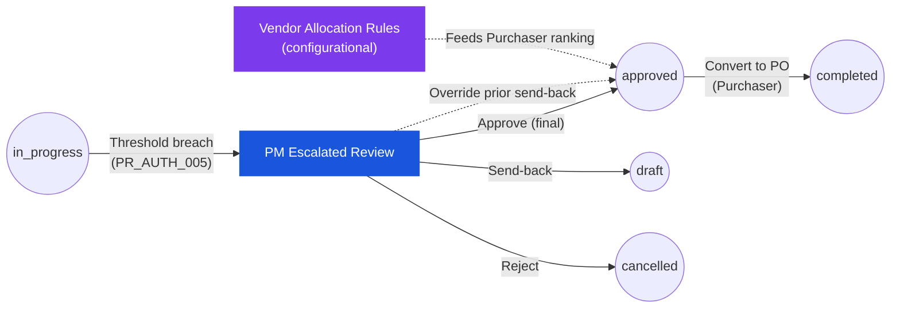

# ใบขอซื้อ — User Flow — Procurement Manager (Purchase Request — User Flow — Procurement Manager)

> **At a Glance**
> **Persona:** Procurement Manager &nbsp;·&nbsp; **โมดูล:** [[purchase-request]] &nbsp;·&nbsp; **Stage ของ workflow:** in_progress (escalated final approve) + configurational (กฎ Allocate Vendor) &nbsp;·&nbsp; **สิทธิ์สำคัญ:** approve มูลค่าสูง, override send-back ของ stage ก่อนหน้า, ตั้งค่า vendor-ranking
> **persona นี้ทำอะไร:** เป็น authority ของ approve สุดท้ายแบบ escalated สำหรับ PR มูลค่าสูงและเป็นเจ้าของชุดกฎจัดสรร vendor ที่ feed Purchaser

## 1. บทบาทในโมดูลนี้

**Procurement Manager** เป็น persona procurement ระดับซีเนียร์ที่เป็นเจ้าของสอง surface ที่แตกต่างในโมดูล `purchase-request` Surface **transactional** คือ stage อนุมัติ escalated สุดท้ายเหนือ Finance: เมื่อ `base_total_amount` ของ PR ข้าม threshold มูลค่าสูงที่ตั้งไว้ (`PR_AUTH_005`) หรือเมื่อ workflow route PR ที่มีความสำคัญเชิงกลยุทธ์ตรงไปที่ procurement เอกสารลงในคิวของ Procurement Manager สำหรับการตัดสินกำกับ (approve, send back, reject หรือ split-reject) ที่ใช้ UI review-and-decide เดียวกันกับ chain Approver ที่เหลือแต่ scope กว้างกว่า — รวมสิทธิ์ override send-back ที่ Approver issue เมื่อความต้องการธุรกิจสมเหตุผล Surface **configurational** คือชุดกฎ Allocate Vendor: Procurement Manager ดูแลการตั้งค่า vendor-ranking และ pricelist-priority ที่ขับการจัดอันดับการเลือก vendor ของทุก Purchaser, ปรับ scoring weight (vendor rank vs ราคาต่ำสุด vs ประวัติการรับของล่าสุด) และ override priority ต่อ vendor และรัน bulk oversight action บน PR ที่ค้างใน `in_progress` เกินหน้าต่าง SLA Procurement Manager ทำงานภายใต้ `enum_stage_role = purchase` (`PR_AUTH_008`) บนด้าน configurational และบนชุด action `approve` เดียวกันกับ chain Approver (`PR_AUTH_002`–`PR_AUTH_004`) บนด้าน transactional พวกเขาต่างจาก Approver พื้นฐานเพราะถือทั้ง authority chain escalation **และ** เป็นเจ้าของกฎ vendor allocation ที่ feed Purchaser ปลายน้ำ; พวกเขาต่างจาก Purchaser เพราะไม่รัน vendor allocation บน PR แต่ละใบเอง — พวกเขาตั้งค่ากฎที่ขับมัน

### ตำแหน่งใน workflow (เส้นทาง transactional ของ PM highlighted)

### ตารางสิทธิ์ — Surface × Action (Procurement Manager)

Manager engage กับโมดูลข้ามสอง surface สิทธิ์ Transactional scope อยู่ที่ stage escalated (`PR_AUTH_005`); สิทธิ์ Configurational scope อยู่ที่ workbench ของกฎ Allocate Vendor (`PR_AUTH_008`)

| Action | Transactional (Stage escalated) | Configurational (กฎ Allocate Vendor) |
|---|---|---|
| ดู PR (escalated) | ✅ | — |
| Approve (stage สุดท้าย → `approved`) | ✅ | — |
| Send-back (พร้อมเหตุผล) | ✅ | — |
| Reject (ยุติ → `cancelled`) | ✅ | — |
| Split-Reject — ระดับบรรทัด | ✅ | — |
| ปรับ `approved_qty` (`PR_VAL_013`) | ✅ | — |
| Override send-back ของ Approver stage ก่อนหน้า | ✅ | — |
| ดูแลเกณฑ์และน้ำหนัก vendor ranking | — | ✅ |
| ตั้ง override priority ต่อ vendor / blacklist | — | ✅ |
| Bulk action บน PR ที่ค้าง `in_progress` (send-back / ping / re-allocate) | ✅ (ต่อ PR `PR_AUTH_002`) | ✅ (bulk wrapper) |
| Save ชุดกฎด้วย timestamp `effective_from` | — | ✅ |
| Delegate role (`PR_AUTH_006`) | ✅ (delegate ได้) | ❌ (config delegate ไม่ได้ตาม default) |
| แก้ header / บรรทัด / vendor / pricing ของ PR | ❌ | ❌ |
| Void PR (`PR_AUTH_007`) | ❌ (sysadmin เท่านั้น) | ❌ |

> ℹ️ **Semantic snapshot:** การ save ชุดกฎ Allocate Vendor ใหม่มีผลสำหรับ PR **ใหม่** เท่านั้น PR ที่อยู่ใน `in_progress` แล้วยังคง vendor allocation ที่ snapshot ไว้ (คล้าย `PR_CALC_006` exchange-rate snapshot) การ re-allocate กับกฎใหม่ต้องใช้ send-back กลับเป็น `draft` และ resubmit หรือ bulk re-allocate ครั้งเดียวจาก Stuck PR Oversight

## 2. จุดเริ่มต้นและ flow หลัก

**จุดเริ่มต้น — transactional:** Email / in-app notification "Purchase Request [PR-ID] Escalated for Procurement Manager Review" → คลิก deep link ซึ่งพาตรงไปยังหน้า PR detail หรือทางเลือก: Sidebar → โมดูล **Purchase Request** → คิว **Escalated PRs** (filter เป็น PR ที่ workflow route stage ปัจจุบันไปยังผู้ใช้ role `purchase` เป็นเป้าหมาย escalation, โดยทั่วไปเพราะ `base_total_amount` เกิน threshold ของ `tb_workflow` ตาม `PR_AUTH_005`)

**จุดเริ่มต้น — configurational:** Sidebar → workspace **Procurement** → **Vendor Allocation Rules** (surface การตั้งค่า Allocate Vendor ที่อธิบายใน `../carmen/docs/purchase-request-management/PR-Module-Structure.md`) Workspace เดียวกันยังเปิดมุมมอง **Stuck PR Oversight** ที่ filter เป็น PR ที่อยู่ใน `in_progress` เกิน SLA ที่ตั้งค่าได้

**Flow หลัก (happy path — transactional, อนุมัติมูลค่าสูง):**

1. จากคิว **Escalated PRs** (หรือ link notification) เลือก PR ที่รอการตัดสิน escalated คิวแสดง `pr_no`, requestor, แผนก, `base_total_amount` ในสกุลเงินธุรกรรมและสกุลฐาน, stage ต้นทางที่ trigger escalation, แถบ threshold ที่ fire และเวลารอที่ stage escalated นี้ คลิกเข้า PR เพื่อเปิดหน้า detail ใน read-mostly mode (header และบรรทัดแก้ไม่ได้ยกเว้น `approved_qty` และ flag การตัดสินใจระดับบรรทัด เหมือนกับ UI Approver พื้นฐาน)
2. Review **บริบทต้นน้ำเต็ม**: header (ประเภท PR, requestor, แผนก, `pr_date`, วันส่งของที่ต้องการ, สกุลเงิน, `exchange_rate`, `workflow_name`, เหตุผล, attachment), การตัดสินใจของ Approver ก่อนหน้าใน **Activity Log** (note Department Head, commentary budget ของ Budget Controller, review ของ Finance) และ system event ใด ๆ รวมถึง annotation threshold breach Activity Log แสดง comment ของทุก stage ก่อนหน้าจาก `tb_purchase_request_comment` เพื่อให้ Procurement Manager มีภาพเดียวกับที่ decision-maker ก่อนหน้ามี บวกกับเหตุผล escalation
3. เปิดแท็บ **Items** และเดินทีละบรรทัด ยืนยันสินค้า, store location, `requested_qty`, หน่วยนับ, `approved_qty` (ถ้า Approver ลดไว้ก่อนหน้า), ราคาต่อหน่วย, FOC, ส่วนลด, การจัดการภาษี, วันส่งของของบรรทัด, note บรรทัด และบริบท inventory (on-hand, on-order, reorder level, average monthly usage, ราคาซื้อล่าสุด) ที่ pull จาก [[inventory]] แบบ live และบริบท preferred-vendor / pricelist ที่ pull จาก [[vendor-pricelist]] สำหรับ PR มูลค่าสูงยังยืนยันมุมมอง vendor-impact ที่ consolidate — บรรทัดใด auto-allocate ไปยัง vendor ใดภายใต้กฎ Allocate Vendor ปัจจุบัน — เพื่อให้ Procurement Manager sense-check vendor commitment ปลายน้ำที่กำลังจะอนุมัติ
4. เปิด panel **Budget Impact** สำหรับ footprint budget ระดับ PR เต็ม (total budget, soft commitment จาก PR นี้และ PR / PO อื่นที่เปิดอยู่, hard commitment, `availableBudget` ผลลัพธ์) — Procurement Manager ใส่ใจ headroom budget ระดับ portfolio ข้ามแผนก ไม่ใช่แค่ cost-centre ต้นทาง
5. ถ้าจำนวนต้องปรับที่ stage นี้ (พบไม่บ่อยที่ stage escalated แต่อนุญาต) แก้ `approved_qty` บนบรรทัดที่ได้รับผลกระทบตาม `PR_VAL_013` — ค่าใหม่ต้อง `> 0` และ `≤ requested_qty` หลังแปลง UoM; `approved_unit_id` และ `approved_unit_conversion_factor` ถูก persist ไปด้วย Roll-up header (`base_sub_total_amount`, `base_total_amount` ฯลฯ) คำนวณใหม่เมื่อ save และอาจย้ายบรรทัดออกจากแถบมูลค่าสูงตอน re-submit
6. ตัดสิน **disposition ต่อบรรทัด** ถ้าต้องการ split-reject: mark บรรทัดเดี่ยว accept / reject พร้อมเหตุผลบนแต่ละบรรทัดที่ reject ตาม `PR_AUTH_003` บรรทัดที่ reject ยังอยู่บนเอกสารด้วย `current_stage_status = rejected` และไม่ถึงการแปลงเป็น PO; บรรทัดที่ accept เดินต่อ
7. เลือก **action ระดับ header** จาก action bar: **Approve** (clear stage escalated), **Send Back** (ส่งกลับไป stage ก่อนหน้าหรือ Requestor — override การตัดสินใจ send-back ของ Approver ก่อนหน้าเมื่อ applicable), **Reject** (ยุติเอกสาร) หรือ commit **Split-Reject** โดยทิ้ง Approve ไว้พร้อมอย่างน้อยหนึ่งบรรทัดที่ reject Reject และ Send Back ต้องการเหตุผล mandatory; Approve อนุญาต comment optional
8. ยืนยัน action ใน dialog ระบบรันเช็คการให้สิทธิ์ (`PR_AUTH_002` — ผู้ใช้ปัจจุบันต้องอยู่ใน `user_action.execute[]` ของ stage escalated; `PR_VAL_013` บน `approved_qty` ที่แก้)
9. เมื่อกด **Approve** ที่ stage escalated เนื่องจากเป็น stage **สุดท้าย** ของ approve ใน chain ตามนิยาม (escalation route ไปยัง procurement เป็น step `approve` สุดท้ายก่อน `purchase`) ระบบใช้ `PR_POST_005`: `pr_status` พลิกจาก `in_progress` เป็น `approved`, stepper ของ workflow mark chain เสร็จ, notification ไปที่ Requestor ("Approved") และคิวของ Purchaser และ PR เข้าเกณฑ์การแปลงเป็น PO Soft commitment ยังอยู่จนกว่า Purchaser สร้าง PO
10. Procurement Manager กลับไปคิว **Escalated PRs** ซึ่ง PR ที่เพิ่งตัดสินใจหายไป Action และ comment ใด ๆ ปรากฏใน log `tb_purchase_request_comment` ของ PR แบบ immutable (`PR_POST_008`)

**Flow หลัก (configurational — ปรับกฎ Allocate Vendor):**

1. ไปที่ **Procurement → Vendor Allocation Rules** หน้าจอแสดงชุดกฎ active (ต่อองค์กร, ต่อ business-unit) ด้วย: stack เกณฑ์ที่จัดลำดับ (ลำดับ default: **vendor rank** → **ราคาต่อหน่วยต่ำสุด** → **ประวัติการรับล่าสุด**), น้ำหนัก scoring ต่อเกณฑ์, override priority ต่อ vendor และช่วงวันที่มีผลของ configuration ปัจจุบัน
2. Review **ranking ปัจจุบัน** ใน panel simulation: เลือกสินค้าหรือ category สินค้าตัวแทนและดูว่า vendor candidate จัดอันดับอย่างไรภายใต้น้ำหนักปัจจุบัน — ชื่อ vendor, ราคา pricelist ปัจจุบัน, lead time, อัตรา fulfillment ในอดีต, คะแนนที่คำนวณ และ rank ผลลัพธ์
3. ปรับ **น้ำหนัก scoring** (เช่นย้ายน้ำหนักจาก price ไปยัง delivery-history มากขึ้น) หรือ set / ล้าง **override priority ต่อ vendor** (pin vendor เชิงกลยุทธ์ไปยัง top rank, blacklist vendor สำหรับ family สินค้า, ตัด vendor ออกจาก auto-allocation ขณะที่ยังเลือก manual ได้) แต่ละการเปลี่ยนถูก stage ใน draft configuration ที่ค้างและ preview live ใน panel simulation ก่อน save
4. Save ชุดกฎที่ปรับ ระบบเขียน configuration ใหม่ด้วย timestamp effective-from ใหม่และแจ้งทีม Purchaser PR ใหม่และ **re-allocation** ใด ๆ ที่ trigger บน PR ที่มีอยู่ใน `draft` จะใช้กฎใหม่; PR ที่อยู่ใน `in_progress` แล้วยังคง vendor allocation ที่ snapshot ตาม semantic snapshot แบบ `PR_CALC_006` ที่อธิบายใน [02-business-rules.md](./02-business-rules.md) Section 6
5. แบบ optional จากมุมมอง **Stuck PR Oversight** รัน **bulk action** บน PR ที่อยู่ใน `in_progress` เกินหน้าต่าง SLA: send-back ไปยัง Requestor ต้นทางด้วยเหตุผล template, escalate ไปยัง stage ถัดไปด้วย comment "ping" หรือสำหรับ PR ที่ block เฉพาะที่ vendor allocation trigger one-off re-allocation กับชุดกฎที่เพิ่ง save Bulk action ยังคงผ่านเช็คการให้สิทธิ์ต่อ PR (`PR_AUTH_002`) และเขียน comment audit ต่อ PR (`PR_POST_008`)

## 3. แขนงการตัดสินใจ

- **ถ้า PR ที่ escalated ใหญ่หรือมีความสำคัญเชิงกลยุทธ์มากจนต้องมีการเซ็นอนุมัติของ executive เพิ่ม** (เกิน chain ที่ตั้งของโมดูล PR): Procurement Manager บันทึกการอนุมัติของ executive นอก band (อีเมล, board minute), แนบหลักฐานกับ PR แล้ว commit Approve ในระบบ โมดูล PR เองไม่ model stage เหนือ procurement — อะไรเกินกว่า `enum_stage_role = approve` จบที่ `purchase` Approve ของ Procurement Manager คือคำสุดท้ายของระบบ
- **ถ้า Procurement Manager เลือก override send-back ของ Approver ก่อนหน้า**: Activity Log แสดงเหตุผล send-back ก่อนหน้า Procurement Manager สามารถ (a) ยืนยัน send-back (PR ยังคงเป็น `draft` หรือที่ stage ก่อนหน้า) หรือ (b) override โดย issue **Approve** ตรงจาก stage escalated — bypass loop send-back ใหม่ Override ถูกบันทึกใน `workflow_history` พร้อม user id ของ Procurement Manager และ comment เหตุผล mandatory ที่จับใน `tb_purchase_request_comment`
- **ถ้า Procurement Manager เลือก Send Back** แทน Approve ที่ stage escalated: dialog ต้องการเหตุผล เมื่อยืนยัน `PR_POST_003` ใช้ — `workflow_current_stage` ย้ายไปก่อนหน้าหนึ่ง stage; ขึ้นกับ workflow configuration อาจเป็น Finance (Stage 3), Budget Controller (Stage 2) หรือกลับไปยัง Requestor ที่ `draft` Soft budget commitment ถูกปล่อยเฉพาะถ้าการ rollback ถึง create stage ของ Requestor การมีส่วนร่วมของ Procurement Manager จบที่นี่
- **ถ้า Procurement Manager เลือก Reject ระดับ header**: dialog ต้องการเหตุผล เมื่อยืนยัน `PR_AUTH_004` + `PR_POST_006` ใช้ — `pr_status` ย้ายเป็น `cancelled` (terminal), soft budget commitment ถูกปล่อย, `workflow_history` ถูก append และ comment `type = system` จับการ reject Chain จบไม่มี stage ถัดไป
- **ถ้าพยายามเปลี่ยนชุดกฎขณะที่ PR อยู่กลาง flow (`in_progress`) และ PR นั้นพึ่งกฎที่ถูกเปลี่ยน**: surface configuration อนุญาตให้ save (กฎ vendor ไม่ถูก lock โดย PR แต่ละใบที่อยู่กลาง flow) แต่การเปลี่ยน **ไม่** re-rank PR ที่อยู่กลาง flow ย้อนหลัง แต่ละ PR กลาง flow ยังคง vendor allocation ที่ snapshot; กฎใหม่ใช้กับ: (a) PR ใหม่หลัง effective-from timestamp, (b) PR ที่ส่งกลับเป็น `draft` ผ่าน send-back ที่ถูก re-allocate ตอน re-submit และ (c) PR ที่รันผ่าน bulk re-allocation ครั้งเดียวจาก Stuck PR Oversight พฤติกรรม snapshot-preservation นี้เลียนแบบ semantic exchange-rate `PR_CALC_006`
- **ถ้า bulk action target PR ที่ Procurement Manager ไม่มีสิทธิ์** (เช่น PR ของ business unit อื่น scope นอก `user_action.execute[]` ของพวกเขา): PR นั้นถูกตัดออกจากผล bulk แบบเงียบพร้อมบรรทัดอธิบายใน audit log ของ bulk action PR ที่มีสิทธิ์เดินต่อ; ที่ไม่มีสิทธิ์ไม่และ manager เห็นจำนวนของแต่ละแบบใน dialog ผล
- **ถ้า Procurement Manager ไม่อยู่ชั่วคราว** และ delegate stage ของตน: ตาม `PR_AUTH_006` delegate สืบทอดสิทธิ์ transactional เดียวกัน (approve, send back, reject, split-reject) เฉพาะช่วง delegation สิทธิ์ Configurational (การดูแลกฎ) **ไม่** delegate ได้ตาม default — การแก้ไขกฎสงวนสำหรับ role Procurement Manager ตาม `PR_AUTH_008`

## 4. จุดออก / Handoff

การมีส่วนร่วมของ Procurement Manager จบในรูปแบบต่อไปนี้ จุดออกขึ้นกับว่า manager ลงมือสุดท้ายบน surface ใด (transactional หรือ configurational):

- **Transactional — Approve ของ stage escalated (approve สุดท้ายใน chain).** `pr_status` พลิกจาก `in_progress` เป็น `approved` ตาม `PR_POST_005`; handoff ไปยังคิว **Purchaser** ([03-user-flow-purchaser.md](./03-user-flow-purchaser.md)) สำหรับ validation vendor และการแปลงเป็น PO Soft budget commitment ยังอยู่จนกว่าการสร้าง PO จะแปลงเป็น hard commitment (ดู [[purchase-order]]) PR ยังคงเป็น `approved` จนกว่าทุกบรรทัดจะ bridge เต็มหรือยกเลิก จุดนั้น `pr_status` พลิกเป็น `completed` (`PR_POST_007`)
- **Transactional — Send Back.** `pr_status` ยังคง `in_progress` แต่ `workflow_current_stage` ย้ายไปก่อนหน้าหนึ่ง stage; ถ้า rollback ถึง create stage ของ Requestor เอกสารกลับเป็น `draft` และ **Requestor** รับต่อที่ [03-user-flow-requestor.md](./03-user-flow-requestor.md) Section 2 step 2 Soft budget commitment ถูกปล่อยเฉพาะเมื่อ rollback ถึง create stage; สำหรับ rollback สั้นกว่า ผู้อนุมัติก่อนหน้ารับ handoff และ commitment ยังอยู่
- **Transactional — Header Reject.** `pr_status` พลิกเป็น `cancelled` (terminal, `PR_POST_006`); soft budget commitment ถูกปล่อย; **Auditor** review หลังเหตุการณ์แต่ไม่มี action ของผู้ใช้เพิ่มเติม Requestor เห็นการยกเลิกใน dashboard **My PRs**
- **Configurational — ชุดกฎที่ save.** ไม่มีการเปลี่ยนสถานะ PR ชุดกฎใหม่มีผลกับ PR อนาคตที่สร้างหลัง effective-from timestamp; PR ที่มีอยู่ใน `in_progress` ยังคง vendor allocation ดั้งเดิมและ pricelist reference ที่ snapshot **ทีม Purchaser** ได้รับแจ้งว่า configuration Allocate Vendor เปลี่ยน; การกด Convert-to-PO ครั้งถัดไปที่พวกเขาทำบน PR ที่ approved ใหม่จะใช้ ranking ที่อัปเดต
- **Configurational — Bulk action ที่ commit.** PR ที่ target ได้รับ effect ต่อ action (send-back ไปยัง `draft` ตาม `PR_POST_003`, escalation ping โดยไม่มีการเปลี่ยนสถานะ หรือ one-off re-allocation ที่อัปเดต snapshot `vendor_id` / `pricelist_*` บนแถว PR detail) PR ที่ได้รับผลกระทบแต่ละใบรับ comment `type = system` (`PR_POST_008`) บันทึก bulk action และต้นทาง Flow ถัดไปของแต่ละ PR ดำเนินตามสถานะใหม่ (Requestor รับ `draft` ต่อ, ผู้อนุมัติ stage ถัดไปรับหลังจาก ping ฯลฯ)

สถานะเอกสารข้ามทุก transition บันทึกโดย `enum_purchase_request_doc_status = { draft, in_progress, voided, approved, completed, cancelled }` และ workflow timeline ใน `workflow_history` การ void (`pr_status → voided`) สงวนสำหรับ Finance หรือ system-admin ต่อ `PR_AUTH_007` และไม่ใช่ส่วนของ flow Procurement Manager มาตรฐาน

## 5. แหล่งอ้างอิง

- ภาพรวมหลัก: [03-user-flow.md](./03-user-flow.md)
- กฎการให้สิทธิ์: [02-business-rules.md](./02-business-rules.md) Section 4 — `PR_AUTH_002` (ผู้ทำต่อ stage), `PR_AUTH_003` (action ระดับบรรทัดและ split-reject), `PR_AUTH_004` (reject header), `PR_AUTH_005` (routing ตาม amount-threshold และ escalation), `PR_AUTH_006` (delegation), `PR_AUTH_008` (`enum_stage_role = purchase` เป็นเจ้าของกฎ vendor allocation)
- กฎการ posting: [02-business-rules.md](./02-business-rules.md) Section 5 — `PR_POST_003` (send-back), `PR_POST_005` (final approve → `approved`), `PR_POST_006` (reject / void / cancel), `PR_POST_008` (audit comment immutable)
- กฎข้ามโมดูล: [02-business-rules.md](./02-business-rules.md) Section 6 — semantic snapshot vendor / pricelist, handoff soft→hard commitment ของ budget, พฤติกรรม snapshot-preservation ระหว่างการเปลี่ยนกฎ
- `../carmen/docs/purchase-request-management/PR-Module-Structure.md` — surface โมดูล Allocate Vendor, shape การตั้งค่า vendor-allocation, การตั้งค่า threshold-routing
- `../carmen/docs/purchase-request-management/PR-User-Experience.md` — UI review-and-decide ที่ใช้ร่วมกับ chain Approver พื้นฐาน, ขั้นตอน escalation
- `../carmen/docs/purchase-request-management/PR-Overview.md` — role stakeholder Procurement Manager, integration ของ workflow engine (ขั้นตอน escalation), การจัดการ vendor
- `../carmen/docs/purchase-request-management/purchase-request-module-prd.md` — product requirement สำหรับ routing ตาม threshold และการตั้งค่ากฎ Allocate Vendor
- หน้าพี่น้อง: [03-user-flow-approver.md](./03-user-flow-approver.md) — flow อนุมัติพื้นฐานที่นี่ extend; UI review-and-decide และ mechanics split-reject สืบทอด
- หน้าพี่น้อง: [03-user-flow-purchaser.md](./03-user-flow-purchaser.md) — persona ปลายน้ำที่ consume กฎ vendor-allocation ที่ Procurement Manager ดูแล
- หน้าพี่น้อง: [03-user-flow-requestor.md](./03-user-flow-requestor.md) — เป้าหมาย bounce-back สำหรับ send-back ที่ถึง create stage
- หน้าพี่น้อง: [index.md](./index.md) Section 4 — คำอธิบาย role ของ Procurement Manager ตามมาตรฐาน
- Cross-link: [[vendor-pricelist]] — ข้อมูล pricelist ที่ feed ranking Allocate Vendor
- Cross-link: [[purchase-order]] — โมดูลปลายน้ำที่รับ PR ที่ final-approved สำหรับการแปลง
